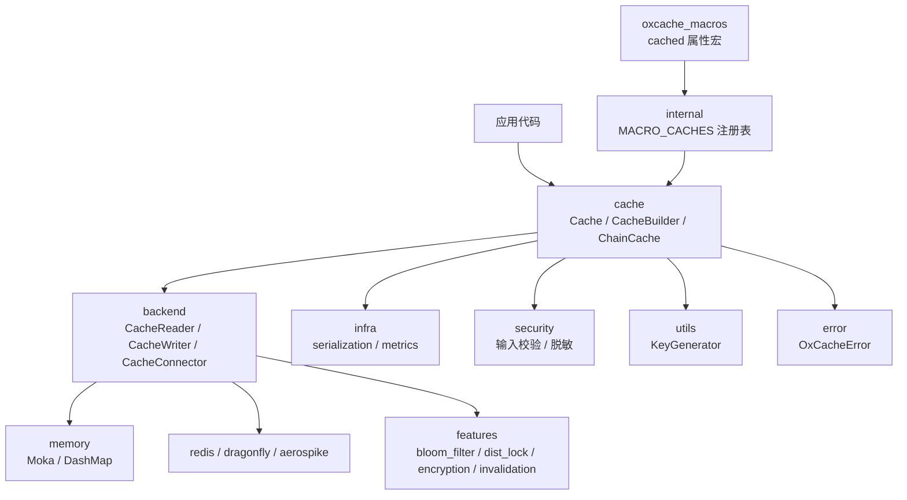
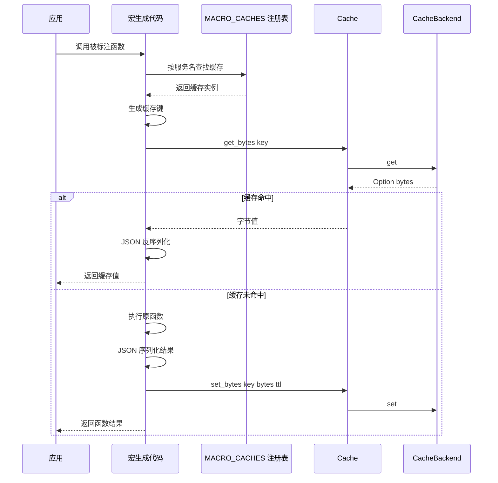
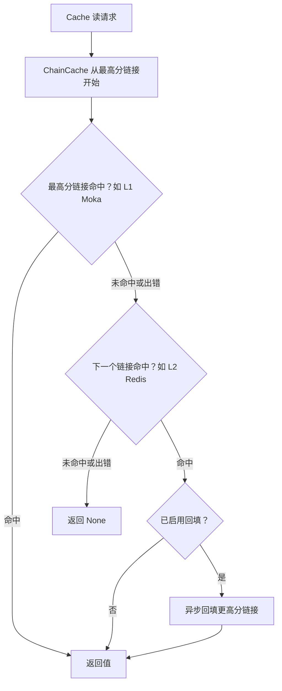
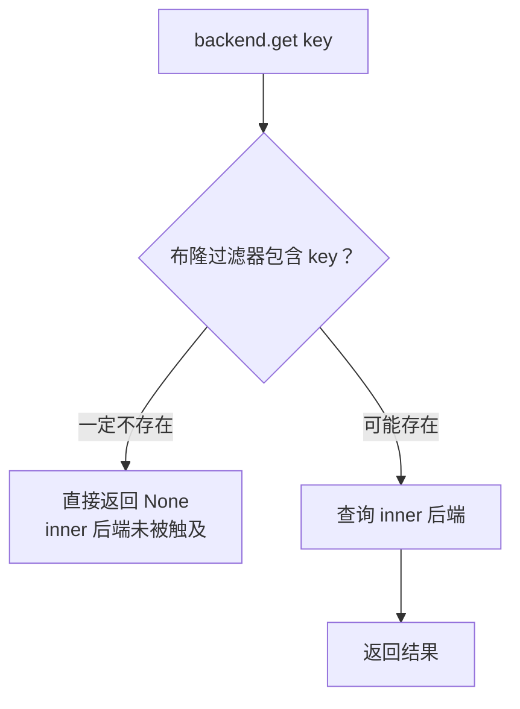

<div align="center">


[](https://github.com/Kirky-X/oxcache/actions/workflows/ci.yml) [](https://crates.io/crates/oxcache) [](https://docs.rs/oxcache) [](https://crates.io/crates/oxcache) [](LICENSE) [](https://www.rust-lang.org/) [](https://codecov.io/gh/Kirky-X/oxcache)

**中文** | [English](README_EN.md)

**Rust 多级缓存库：L1 内存 + L2 分布式**

[✨ 功能特性](#-功能特性) • [🚀 快速开始](#-快速开始) • [📚 文档](#-文档) • [💻 示例](#-示例) • [🤝 参与贡献](#-参与贡献)

</div>

<div align="center">

<table>
  <tr>
    <td width="50%" align="center"><b>🚀 极致性能</b><br/>L1 纳秒级读写，热路径借用键 API 消除多余分配</td>
    <td width="50%" align="center"><b>🧩 多级后端</b><br/>L1（Moka / DashMap）+ L2（Redis / Valkey / Dragonfly / Aerospike），ChainCache 自由组链</td>
  </tr>
  <tr>
    <td align="center"><b>⚡ 零侵入接入</b><br/>#[cached] 宏一行启用，CacheBuilder 类型安全构建</td>
    <td align="center"><b>🛡️ 生产就绪</b><br/>输入校验与脱敏、可选自动降级、混沌测试、CI 质量门禁</td>
  </tr>
</table>

</div>

---

## 📋 目录

<details open>
<summary>📑 目录</summary>

- [✨ 功能特性](#-功能特性)
- [🚀 快速开始](#-快速开始)
  - [📦 安装](#-安装)
  - [💡 最小可运行示例](#-最小可运行示例)
  - [🧭 核心概念](#-核心概念)
- [🎨 特性标志](#-特性标志)
- [📚 文档](#-文档)
- [💻 示例](#-示例)
- [🏗️ 架构](#️-架构)
- [🔄 同步 API](#-同步-api)
- [🌸 布隆过滤器与穿透防护](#-布隆过滤器与穿透防护)
- [⏱️ TTL 行为对照表](#️-ttl-行为对照表)
- [🧪 测试](#-测试)
- [📊 性能](#-性能)
- [🔒 安全](#-安全)
- [🗺️ 开发路线图](#️-开发路线图)
- [🤝 参与贡献](#-参与贡献)
- [📋 更新日志](#-更新日志)
- [📄 许可证](#-许可证)
- [🙏 致谢](#-致谢)
- [📞 联系与支持](#-联系与支持)
- [⭐ Star 历史](#-star-历史)

</details>

---

## ✨ 功能特性

| 特性 | 说明 |
|------|------|
| 🚀 **多级缓存** | L1（Moka / DashMap）与 L2（Redis / Valkey / Dragonfly / Aerospike）经 `ChainCache` 按分数组链，非最高分命中可异步回填 |
| ⚡ **零侵入宏** | `#[cached]` 一行接入，支持 `service` / `ttl` / `key` / `key_prefix` / `sync` / `single_flight` / `strict` / `condition` |
| 🔄 **同步 API** | `sync_mode(true)` 后 `get_sync` / `set_sync` / `get_or_sync` 与异步 API 在同一 `Cache<K, V>` 上共存 |
| ⏱️ **全后端 per-entry TTL** | `ttl` / `expire` 在 Moka / DashMap / Redis / Valkey / Dragonfly / Aerospike / Mock / Chain / Bloom 九类后端语义一致 |
| 🌸 **穿透防护** | 单飞去重（64 分片）、空值哨兵、TTL 抖动、布隆过滤器负查询短路 |
| 🔐 **安全内建** | 键 / Lua / SCAN 三层输入校验、连接串脱敏、值级加密与完整性装饰器 |
| 📈 **可观测性** | 延迟直方图与操作计数、Prometheus / JSON 导出、`telemetry` tracing 遥测、审计事件流 |
| 🧬 **可插拔序列化** | JSON 默认，`serde-bincode` / `postcard` 二进制格式可选，深度限制防嵌套 DoS |
| 🗜️ **自适应压缩** | `CompressingBackend` 按阈值触发 zstd，读取按魔数识别并兼容旧 gzip |
| 🔑 **分布式协调** | Redis 分布式锁（watchdog 续期 / 可重入）、RedLock 多节点多数派锁、跨实例失效总线 |
| 🧯 **故障韧性** | ChainCache 单链路容错、`degradation` 三态自动降级与恢复、健康检查、优雅关闭 |
| 🧪 **工程化质量** | 1900+ 测试函数（截至 0.5.0-rc.4）、混沌与安全测试、三平台 CI 矩阵、覆盖率门禁 |

<details>
<summary>🔎 进阶能力一览</summary>

- **分布式锁**（`lock`）：Redis TTL 锁、watchdog 自动续期、可重入获取
- **RedLock**（`red-lock`）：多节点多数派锁、`INCR` fencing token 单调防回退
- **跨实例失效**（`invalidation`）：Redis Pub/Sub 广播失效事件，键空间通知第二通道
- **值级加密**（`encrypt`）：XChaCha20-Poly1305 信封，AAD 绑定键名防换键移植
- **值完整性**（`integrity`）：HMAC-SHA256 标签，校验失败视为 miss 并计数
- **版本化 CAS**（`versioning`）：内存版与 Redis WATCH/MULTI/EXEC 版 `compare_and_swap`
- **配置驱动**（`config-confers`）：confers 加载容量 / TTL / 熔断参数，`ConfigBus` watch 热更新
- **自动降级**（`degradation`）：Active / Degraded / HalfOpen 三态状态机，探测成功自动恢复
- **审计事件流**（`audit`）：结构化 hit / miss / set / delete / evict / expired 事件，键脱敏
- **宏高级参数**：`single_flight` 并发 miss 去重、`strict` 未注册 panic、`condition` 谓词旁路
- **分层构建器**：`L1Builder` / `L2Builder` / `ChainBuilder` 链式组合
- **生命周期集成**（`kit`）：trait-kit AsyncKit 的 `OxcacheModule`、健康检查、三阶段关闭、后端装饰器
- **错误国际化**：基于 ICU4X 的错误消息 i18n 与系统语言自动检测
- **穿透防护配置**：`null_cache_ttl` 空值哨兵 TTL、`ttl_jitter` TTL 抖动系数

</details>

---

## 🚀 快速开始

### 📦 安装

```bash
cargo add oxcache            # 默认 minimal：L1 内存缓存
cargo add oxcache --features full   # 全量：L1 + L2 + 宏 + 压缩 + 批量 + Lua + 锁
```

或在 `Cargo.toml` 中手动添加：

```toml
[dependencies]
oxcache = "0.5.0-rc.4"
tokio = { version = "1", features = ["rt-multi-thread", "macros"] }
serde = { version = "1", features = ["derive"] }
```

**最低要求**：Rust 1.97.1+（edition 2024）。默认 `minimal` 特性仅启用 L1 内存缓存；使用 L2（Redis / Valkey / Dragonfly / Aerospike）需本地可达的对应服务，Redis 相关测试依赖 Docker（testcontainers 自动拉起容器）。

### 💡 最小可运行示例

以下示例精简自 [`examples/src/01_basics/example_basic_operations.rs`](examples/src/01_basics/example_basic_operations.rs)：

```rust
use oxcache::Cache;
use serde::{Deserialize, Serialize};

#[derive(Debug, Clone, Serialize, Deserialize)]
struct User {
    id: u64,
    name: String,
}

#[tokio::main]
async fn main() -> Result<(), Box<dyn std::error::Error>> {
    // 默认 Moka L1 内存后端
    let cache: Cache<String, User> = Cache::builder().build().await?;

    // 写入
    cache
        .set(&"user:1".to_string(), &User { id: 1, name: "Alice".into() })
        .await?;

    // 读取
    if let Some(user) = cache.get(&"user:1".to_string()).await? {
        println!("命中: {}", user.name);
    }

    // 删除
    cache.delete(&"user:1".to_string()).await?;
    assert!(cache.get(&"user:1".to_string()).await?.is_none());
    Ok(())
}
```

函数级缓存只需一行宏（完整版见 [`examples/src/01_basics/example_cached_macro.rs`](examples/src/01_basics/example_cached_macro.rs)）：

```rust
use oxcache::macros::cached;

#[cached(service = "user_cache", ttl = 600)]
async fn get_user(id: u64) -> Result<User, String> {
    Ok(User { id, name: format!("User {id}") })   // 首次执行后结果被缓存
}
```

### 🧭 核心概念

- **`Cache<K, V>`**：统一类型安全入口，`Cache::builder()` 配置 `capacity` / `ttl` / `tti` / `sync_mode`
- **可插拔后端**：`MokaMemoryBackend` / `DashMapMemoryBackend` / `RedisBackend` / `DragonflyBackend` / `AerospikeBackend` 经 `.backend_arc(Arc::new(backend))` 注入
- **`ChainCache`**：多后端按分数组链，自高向低读穿透，非最高分命中可异步回填更高分链接
- **`#[cached]` 宏**：函数级缓存，经 `cache.register_for_macro("service")` 注册后由宏生成代码查找
- **同步 API**：`.sync_mode(true)` 开启 `get_sync` / `set_sync` / `get_or_sync` 同步路径

---

## 🎨 特性标志

层级预设（`default = ["minimal"]`，仅 L1）：

```toml
oxcache = { version = "0.5.0-rc.4", features = ["minimal"] }   # 仅 L1（默认）
oxcache = { version = "0.5.0-rc.4", features = ["core"] }      # L1 + L2 Redis
oxcache = { version = "0.5.0-rc.4", features = ["full"] }      # 全量（不含 bloom / kit 等选择加入特性）
```

| 标志 | 说明 | 默认 |
|------|------|:----:|
| `minimal` | 预设：`memory` + `metrics` + `serialization` + `chrono`，仅 L1 | ✅ |
| `core` | 预设：`minimal` + `redis`，L1 + L2 | ❌ |
| `full` | 预设：`core` + `macros` / `compression` / `batch` / `lua` / `testing` / `dragonfly` / `aerospike` / `lock` | ❌ |
| `memory` | L1 内存后端（Moka + DashMap） | ❌ |
| `redis` | L2 分布式缓存（Redis / Valkey，Standalone / Sentinel / Cluster） | ❌ |
| `dragonfly` | Dragonfly 后端（Redis 协议兼容） | ❌ |
| `aerospike` | Aerospike 后端（独立协议） | ❌ |
| `macros` | `#[cached]` 属性宏（`oxcache_macros` crate） | ❌ |
| `serialization` | JSON 序列化（serde + serde_json + serde_stacker 深度防护） | ❌ |
| `metrics` | 内置指标：延迟直方图、操作计数、JSON / Prometheus 导出 | ❌ |
| `batch` | `BatchWriter` 缓冲批量写入（容量 / 时间双阈值刷盘） | ❌ |
| `lua` | Lua 脚本执行（依赖 `redis`） | ❌ |
| `testing` | 测试工具（暴露内部函数） | ❌ |
| `bloom` | 布隆过滤器负查询过滤（`BloomFilter` + `BloomFilterBackend`） | ❌ |
| `lock` | 分布式锁：TTL、watchdog 自动续期、可重入（依赖 `redis`） | ❌ |
| `red-lock` | RedLock 多节点多数派锁 + fencing token（依赖 `lock`） | ❌ |
| `compression` | 自适应压缩：zstd 阈值触发，兼容旧 gzip 读取 | ❌ |
| `telemetry` | `tracing` 门面：熔断 / 回填 / 宏穿透路径埋点，关闭时零开销 | ❌ |
| `invalidation` | 跨实例失效总线：Redis Pub/Sub 广播 + 键空间通知通道 | ❌ |
| `encrypt` | 值级加密装饰器（XChaCha20-Poly1305，AAD 绑定键名） | ❌ |
| `integrity` | 值完整性装饰器（HMAC-SHA256，校验失败视为 miss） | ❌ |
| `serde-bincode` | bincode 1.x 二进制序列化格式 | ❌ |
| `postcard` | postcard 二进制序列化格式 | ❌ |
| `config-confers` | confers 配置驱动构建 + `ConfigBus` watch 热更新 | ❌ |
| `degradation` | 自动降级与恢复（Active / Degraded / HalfOpen 三态状态机） | ❌ |
| `audit` | 结构化审计事件流（NoOp / 有界内存环形 / tracing 发布器） | ❌ |
| `versioning` | 版本化 CAS（内存实现 + Redis WATCH/MULTI/EXEC 实现） | ❌ |
| `kit` | trait-kit AsyncKit 集成（`OxcacheModule` / 健康检查 / 生命周期 / 关闭 / 装饰器） | ❌ |

> `bloom` 与 `kit` 等选择加入特性**不在** `full` 中，需显式启用。

---

## 📚 文档

| 文档 | 说明 |
|------|------|
| [📖 用户指南](docs/USER_GUIDE.md) | 从安装到进阶的完整使用教程 |
| [📘 API 参考](docs/API_REFERENCE.md) | 全部公开 API 的详细说明与错误码表 |
| [🏗️ 架构文档](docs/ARCHITECTURE.md) | 设计理念、模块职责、数据流与故障处理 |
| [📊 性能基线](docs/PERFORMANCE.md) | 序列化体积、压缩率、热路径基准与复现命令 |
| [🔒 安全文档](docs/SECURITY.md) | 安全设计、威胁模型与最佳实践 |
| [🧪 测试场景矩阵](docs/TEST_SCENARIOS.md) | 功能域到测试落点的映射与执行口径 |
| [🤝 贡献指南](docs/CONTRIBUTING.md) | 开发环境、TDD 工作流与 PR 流程 |
| [📋 更新日志](docs/CHANGELOG.md) | 每个版本的变更记录 |
| [📦 在线 API 文档](https://docs.rs/oxcache) | docs.rs 自动生成的最新文档 |
| [📦 crates.io](https://crates.io/crates/oxcache) | 发布页面 |

---

## 💻 示例

`examples/` 目录（workspace 成员 `oxcache-examples`，已设 `publish = false`）包含 **37 个可运行示例**：

```bash
# 运行单个示例（在 examples/ 目录下）
cd examples && cargo run --example example_basic_operations

# 列出所有可用示例
cd examples && ls src/*/*.rs
```

**入门（`examples/src/01_basics`）**

| 示例 | 说明 |
|------|------|
| `example_basic_operations` | 基本 CRUD 操作（`get` / `set` / `delete` / `exists`） |
| `example_new_api` | 现代 API 入门（`Cache::builder()` / `Cache::memory()`） |
| `example_cache_builder` | CacheBuilder 配置（`capacity` / `ttl` / `tti` / `sync_mode`） |
| `example_serialization` | JSON 序列化 |
| `example_cache_key` | 自定义缓存键（`CacheKey` trait） |
| `example_cached_macro` | `#[cached]` 宏（`service` / `ttl` / `key_prefix`） |
| `example_explicit_init` | 显式初始化（`Cache::new()` / 全局缓存） |
| `example_get_or` | 缓存未命中时计算（`get_or`，单飞） |
| `example_sync_api` | 同步 API（`get_sync` / `set_sync` / `clear_sync` / `len_sync`） |
| `example_byte_ops` | 字节级操作（`get_bytes` / `set_bytes` / `len` / `capacity` / `shutdown`） |
| `example_comprehensive_usage` | 综合使用（全部功能概览） |

**进阶（`examples/src/02_advanced`）**

| 示例 | 说明 |
|------|------|
| `example_batch_write` | 批量操作（`set_many` / `get_many` / `delete_many`） |
| `example_chain_cache` | 链式缓存（`ChainCache` / `ChainLink`） |
| `example_invalidation` | 缓存失效策略（TTL / TTI / 手动失效） |
| `example_warmup` | 缓存预热（批量预加载） |
| `example_smart_strategy` | 缓存策略模式（Cache-Aside / Lazy Loading / TTL 分层） |
| `example_cache_promotion` | 缓存提升（L2→L1 提升 / 热点分析） |
| `example_error_handling` | 错误处理（`OxCacheError` / 重试 / 可恢复性） |
| `example_custom_backend` | 自定义后端（`CacheReader` / `CacheWriter` / `CacheConnector`） |
| `example_dashmap_backend` | DashMap 后端（`DashMapMemoryBackend`） |
| `example_moka_ttl` | Moka per-entry TTL（`Expiry` trait） |
| `example_redis_native` | Redis 原生操作（`RedisBackend`，需 Redis） |
| `example_redis_modes` | Redis 部署模式（Standalone / Cluster / Sentinel，需 Redis） |
| `example_redis_pipeline` | Pipeline 批量（`set_many_pipeline` / `get_many_pipeline`，需 Redis） |
| `example_lua_script` | Lua 脚本执行（`eval_lua` / `script_load` / `eval_sha`，需 Redis） |

**配置（`examples/src/03_config`）**

| 示例 | 说明 |
|------|------|
| `example_dynamic_config` | 动态配置（运行时配置变更） |
| `example_key_generator` | Key 生成器（`KeyGenerator`） |

**数据库集成（`examples/src/05_database`）**

| 示例 | 说明 |
|------|------|
| `example_database_integration` | 数据库集成（Cache-Aside 模式） |

**特性展示（`examples/src/06_features`）**

| 示例 | 说明 |
|------|------|
| `example_metrics` | 指标导出（`export_json_format` / `export_prometheus_format`） |
| `example_compression` | 数据压缩（`JsonSerializer::with_compression()`） |
| `example_security` | 安全脱敏（`redact_value` / `redact_connection_string`） |
| `example_security_validation` | 安全验证（`validate_redis_key` / `validate_lua_script`） |
| `example_bloom_filter` | 布隆过滤器（`BloomFilter` / `BloomFilterBackend`） |
| `example_i18n` | 国际化（`CacheI18nFormatter`） |
| `example_events` | 事件系统（`CacheEvent` / `CacheEventType`） |
| `example_cli_usage` | CLI 场景（以代码方式获取缓存状态与指标） |
| `example_kit_integration` | trait-kit AsyncKit 集成（`OxcacheModule` / 健康检查 / 生命周期 / 三阶段关闭 / 装饰器） |

> 标注"需 Redis"的示例需要运行中的 Redis 6.0+ 服务；其余示例使用内存后端，可独立运行。

---

## 🏗️ 架构

Oxcache 采用「统一接口 + 可插拔后端」的分层设计。应用只面对 `Cache<K, V>` 一个类型安全入口，序列化（`infra::serialization`）与指标（`infra::metrics`）横切其后。所有读写最终落到实现 `CacheReader` / `CacheWriter` / `CacheConnector` 三个 trait 的后端上，blanket impl 自动将其组合为 `CacheBackend`。L1（`backend::memory` 的 Moka / DashMap）与 L2（`redis` / `dragonfly` / `aerospike`）可单独使用，也可经 `ChainCache` 按分数组链并按需回填；`features` 模块以装饰器形态叠加布隆过滤器、分布式锁、加密、完整性、失效总线等能力。`#[cached]` 宏由独立的 `oxcache_macros` crate 提供，经 `internal::MACRO_CACHES` 注册表把函数调用接入同一套缓存路径。



`batch`（缓冲写入）、`integrations::kit`（生命周期集成）、`i18n`、`config`、`traits`、`testing` 等模块按特性门控挂载，详见[架构文档](docs/ARCHITECTURE.md)。

### 宏执行路径

`#[cached]` 宏展开后：按服务名查注册表，命中即反序列化返回；未命中执行原函数并将 `Ok` 结果序列化回写。未注册服务默认静默穿透执行原函数，`strict` 模式改为 panic。



### 链式缓存读取路径



单链接失败仅记录警告并继续下一链接，仅当全部链接失败时读取才报错；写入并发下发到所有写入者链接，单链接写入失败被容忍。`enable_race_read()` 启用后改为并发查询全部链接并返回首个命中。

**可靠性要点**：

- [x] 单飞去重（`get_or` / `get_or_sync`，64 分片降低锁竞争）
- [x] ChainCache 链路容错（单链接故障不阻塞整体读写）
- [x] 可选自动降级（`degradation` 特性，半开探测自动恢复）
- [x] 健康检查（ChainCache 并发 ping，每链接 5 秒超时）
- [x] 优雅关闭（`shutdown`；`kit` 特性映射到三阶段关闭协调）

---

## 🔄 同步 API

在 builder 上启用 `sync_mode(true)` 后，异步 API 之外获得完整同步镜像（无需 `.await`）：

```rust
use oxcache::Cache;
use serde::{Deserialize, Serialize};

#[derive(Serialize, Deserialize, Clone, Debug, PartialEq)]
struct User { id: u64, name: String }

#[tokio::main(flavor = "multi_thread")]
async fn main() -> Result<(), Box<dyn std::error::Error>> {
    let cache: Cache<String, User> = Cache::builder().sync_mode(true).build().await?;

    // 同步操作
    cache.set_sync(&"user:1".to_string(), &User { id: 1, name: "Alice".into() })?;
    let cached = cache.get_sync(&"user:1".to_string())?;
    assert_eq!(cached, Some(User { id: 1, name: "Alice".into() }));

    // per-entry TTL
    cache.set_with_ttl_sync(
        &"temp".to_string(),
        &User { id: 2, name: "Temp".into() },
        Some(std::time::Duration::from_secs(60)),
    )?;

    // 单飞 get_or_sync：并发调用共享一次 fallback 执行
    let value = cache.get_or_sync(&"user:42".to_string(), || {
        Ok(User { id: 42, name: "Bob".into() })
    })?;

    // sync 与 async API 在同一 Cache 上共存
    cache.set(&"async_key".to_string(), &User { id: 99, name: "Async".into() }).await?;
    let v = cache.get_sync(&"async_key".to_string())?;
    Ok(())
}
```

**何时使用**：阻塞调用点（遗留代码、FFI、同步处理器）；调用方本身是同步的，避免运行时开销。

**运行时注意**：

- `sync_mode(true)` 需 `multi_thread` tokio 运行时；`current_thread` 运行时上 Moka 的 `sync_block_on` 会 panic
- 未启用 `sync_mode(true)` 时调用任何 `*_sync` 方法返回 `Err(OxCacheError::NotSupported)`
- `sync_mode(true)` 不能与 `backend_arc(...)` 组合，同时设置时 `build()` 返回 `Err(OxCacheError::NotSupported)`

**`#[cached]` 宏参数**：

| 参数 | 类型 | 描述 |
|------|------|------|
| `service` | 字符串 | 缓存服务名（必填） |
| `ttl` | 整数 | 默认 TTL（秒） |
| `key` | 字符串 | 自定义键模式（支持 `{param}` 插值） |
| `key_prefix` | 字符串 | 键前缀命名空间 |
| `sync` | 标志 | 生成同步函数（无需 async 运行时） |
| `skip_cache_write` | 标志 | 跳过 `Ok` 结果的缓存写入 |
| `single_flight` | 标志 | 同 key 并发 miss 仅回源一次 |
| `strict` | 标志 | 未注册缓存时 panic 而非静默穿透 |
| `condition` | 函数路径 | 执行前谓词，返回 false 时旁路缓存 |

---

## 🌸 布隆过滤器与穿透防护

`bloom` 特性（需显式启用，不在 `full` 中）提供负查询过滤。`BloomFilterBackend` 装饰任意后端：布隆过滤器判定「一定不存在」时直接返回 `None`，inner 后端完全不被触及。



```rust
use oxcache::backend::MokaMemoryBackend;
use oxcache::features::bloom_filter::{BloomFilter, BloomFilterBackend};

#[tokio::main]
async fn main() -> Result<(), Box<dyn std::error::Error>> {
    // 独立 BloomFilter：容量 10_000，误判率 1%
    let bf = BloomFilter::new(10_000, 0.01);
    bf.insert("existing_key");
    assert!(bf.contains("existing_key"));   // 无假阴性
    assert!(!bf.contains("missing_key"));   // 可能有假阳性

    // 装饰器：包装任意 CacheBackend
    let backend = BloomFilterBackend::builder()
        .capacity(10_000)
        .false_positive_rate(0.01)
        .inner(MokaMemoryBackend::new())
        .build()?;

    backend.set("user:1", b"Alice".to_vec(), None).await?;
    assert!(backend.get("user:1").await?.is_some());
    assert!(backend.get("user:999").await?.is_none());   // BF 过滤，inner 未触及
    Ok(())
}
```

**语义**：无假阴性；`set` 同时更新 BF 与 inner，`delete` 只更新 inner（BF 不支持删除），`clear` 两者皆清，TTL 原样透传；inner 实现 `SyncCacheBackend` 时装饰器同样实现。

**穿透与击穿防护组合**：

| 机制 | 入口 | 作用 |
|------|------|------|
| 单飞去重 | `get_or` / `get_or_sync` / 宏 `single_flight` | 同 key 并发 miss 仅一个调用者回源，跟随者等待结果（异步 `Notify` / 同步 `Condvar`，64 分片） |
| 空值哨兵 | `get_or_option` + `null_cache_ttl` | 对 `None` 结果缓存哨兵，避免不存在的键反复打到存储 |
| TTL 抖动 | builder `ttl_jitter(factor)` | 实际 TTL 在 `base * (1 ± factor)` 内随机，防止批量同时过期 |
| 布隆过滤 | `BloomFilterBackend` | 负查询 O(1) 短路，inner 后端零请求 |

---

## ⏱️ TTL 行为对照表

所有后端统一遵守 per-entry `set(key, value, Some(ttl))`。行为汇总：

| 后端 | `set(ttl=Some)` | `ttl(key)` | `expire(key, new_ttl)` | 说明 |
|---------|-----------------|------------|------------------------|-------|
| **MokaMemoryBackend** | 通过 `moka::Expiry` 真实 per-entry TTL | 剩余 TTL | 更新 + 返回 `true` | 全局 TTL（`builder.ttl(...)`）被 per-entry TTL 覆盖 |
| **DashMapMemoryBackend** | 存储 `(value, expiry Instant)`；读取时懒过期 | 剩余 TTL（无 TTL 则 None） | 更新 + 返回 `true` | 懒过期，条目在下次访问时移除；超容量时 FIFO O(1) 淘汰最旧条目 |
| **RedisBackend** | `SET key value EX ttl` | `TTL key`（Redis 原生） | `EXPIRE key ttl` | 使用 Redis 原生 TTL |
| **Valkey**（经 RedisBackend） | 同 Redis | 同 Redis | 同 Redis | Redis 协议兼容，使用 `ValkeyStandalone` 模式 |
| **DragonflyBackend** | 委托内部 RedisBackend | 委托内部 RedisBackend | 委托内部 RedisBackend | Redis 协议兼容，TTL 行为与 Redis 一致 |
| **AerospikeBackend** | `write_policy_with_ttl` → `Expiration::Seconds` | `record.time_to_live()` | `touch` + 新 `Expiration` | Aerospike 原生 TTL（秒级精度），亚秒 TTL 上取整 |
| **MockBackend** | 存储 `(value, expiry Instant)`；懒过期 | 剩余 TTL | 更新 + 返回 `true` | 仅测试用，与 DashMap 语义对齐 |
| **ChainCache** | 将 `ttl` 透传到所有链接 | 返回拥有该 key 的最高分链接的 TTL | 透传到所有链接 | 所有链接接收相同 TTL |
| **BloomFilterBackend** | 将 `ttl` 透传到 inner（同时插入 key 到 BF） | 委托给 inner | 委托给 inner | BF 本身无 TTL 概念 |

**全局与 per-entry 的关系**：`builder.ttl(Duration)` 设置作用于每个条目的全局 TTL；`set(key, value, Some(ttl))` 覆盖该条目；`set(key, value, None)` 沿用全局 TTL（未设置则永不过期）。

---

## 🧪 测试

测试套件按 [`tests/README.md`](tests/README.md) 组织，场景矩阵见 [docs/TEST_SCENARIOS.md](docs/TEST_SCENARIOS.md)。

| 层级 | 运行入口 | 覆盖内容 | 测试函数数¹ |
|------|----------|----------|------------|
| 库单元测试 | `--lib` | `src/` 内 `#[cfg(test)]` 测试 | 1335 |
| 单元测试 | `--test unit` | 后端接口、CacheBuilder、序列化、指标、日志脱敏等 | 331 |
| 集成测试 | `--test integration` | 批量写入、链式缓存、降级与恢复、TTL、Redis Cluster / Sentinel、分布式锁等 | 131 |
| 端到端测试 | `--test e2e` | 基础操作、`#[cached]` 宏、真实业务场景、高级场景 | 65 |
| 宏测试 | `--test macros` | `sync` / `skip_cache_write` 模式与 trybuild 编译失败用例 | 11 |
| 安全测试 | `--test security` | 安全覆盖与安全验证 | 20 |
| 混沌测试 | `--test chaos` | 后端故障注入、网络故障、随机故障 | 19 |
| 性能测试 | `--test performance` | 内存泄漏检测、Miri 内存安全、Pipeline 性能 | 19 |
| Feature 门控 | `--test feature_test`；`--features "full,bloom" --test bloom_filter_integration` | 窄特性组合、布隆过滤器集成 | 2 + 7 |

> ¹ `#[test]` / `#[tokio::test]` 函数 grep 统计，截至 **0.5.0-rc.4**；合计 1900+（`src/` 1335 + `tests/` 606）。

### 常用命令（与 CI 一致）

```bash
# CI test 矩阵以 minimal / core / full 三档运行
cargo test --features full --workspace

# 按测试二进制运行
cargo test --features full --lib
cargo test --features full --test integration
cargo test --features full --test e2e

# 窄特性组合检查（CI feature-core / feature-minimal job）
cargo check -p oxcache --no-default-features --features core
cargo check -p oxcache --no-default-features --features minimal

# 跳过需要 Redis 的测试
cargo test --features full -- --skip redis

# 覆盖率（CI 与 pre-push 门禁：行覆盖 >= 80%）
cargo llvm-cov --features full --workspace --fail-under-lines 80
```

> Redis 相关测试经 testcontainers 自动拉起 `redis:7-alpine` 容器，需要本机 Docker；集成 / E2E 禁用 test double，使用进程内真实实现与混沌式故障注入替身（口径见 [docs/TEST_SCENARIOS.md](docs/TEST_SCENARIOS.md)）。

---

## 📊 性能

> 架构基准测试环境：M1 Pro，16GB RAM，macOS，Redis 7.0。性能因硬件、网络条件和数据大小而异，以下为数量级估计（来源：[docs/ARCHITECTURE.md](docs/ARCHITECTURE.md)）。

| 操作 | 吞吐量 | 延迟（P99） |
|------|--------|-------------|
| L1 读取 | 5-10M ops/sec | 50-100ns |
| L1 写入 | 2-5M ops/sec | 50-200ns |
| L2 读取 | 50-100K ops/sec | 1-5ms |
| L2 写入（批量） | 200-500K ops/sec | 1-10ms |

**热路径基准**（来源：[docs/PERFORMANCE.md](docs/PERFORMANCE.md)；`benches/hot_path_benchmark.rs`，bench profile = release + lto=fat，Moka L1 命中路径）：

| 基准 | owned 键（既有 API） | 借用键（`get_by_str` / `set_by_str`） | 差异 |
|------|----------------------|--------------------------------------|------|
| get 命中 | 241.07 ns | 224.88 ns | **-6.7%** |
| set | 819.38 ns | 715.01 ns | **-12.7%** |

**L2 传输体积对比**（来源：[docs/PERFORMANCE.md](docs/PERFORMANCE.md)；序列化格式经 `serde-bincode` / `postcard` 特性切换）：

| 负载 | JSON | bincode 1.x | postcard 1.x |
|------|------|-------------|--------------|
| Sample（短字符串混合） | 69 B | 74 B | 32 B |
| NumericHeavy（6×64 位数值） | 84 B | 48 B | — |

Criterion 基准代码位于 `benches/`：`modern_api_benchmark`、`hot_path_benchmark`、`redis_benchmark`、`serialization_benchmark`、`dashmap_benchmark`、`dragonfly_benchmark`，运行方式如 `cargo bench --bench hot_path_benchmark`。

---

## 🔒 安全

Oxcache 在库层面内建多层防御，完整安全设计、威胁模型与安全修复记录见 [安全文档](docs/SECURITY.md)。

**漏洞报告**：请勿通过公开 Issue 报告安全漏洞。请使用 GitHub [Security Advisories](https://github.com/Kirky-X/oxcache/security/advisories/new) 私密披露通道提交（48 小时内确认，7 天内给出初步评估，报告者可在修复发布前预览验证补丁）。

| 防线 | 机制 |
|------|------|
| 键校验 | `validate_redis_key`：拒绝空键、超过 512 KB、含 `\r` / `\n` / `\0` 的键，扫描 SQL 注入与路径遍历模式 |
| Lua 沙箱 | `validate_lua_script`：10 KB 上限、100 键上限、危险命令黑名单（`FLUSHALL` / `CONFIG` / `SHUTDOWN` 等）、注释与字符串预处理防绕过、30 秒超时 |
| SCAN 限制 | `validate_scan_pattern`（256 字符、10 个通配符上限）+ `clamp_scan_count`（钳制到 1-1000）、30 秒超时 |
| TLS 强制 | `RedisBackend` 默认要求 `rediss://`，除非显式设置 `OXCACHE_ALLOW_INSECURE_REDIS` 开发豁免 |
| 脱敏 | `redact_connection_string` / `redact_value` / `Redacted` 包装器，日志与审计事件中的键与凭据默认脱敏 |
| 内存安全 | crate 根 `#![deny(unsafe_code)]` |
| 值保护 | `encrypt`（XChaCha20-Poly1305，AAD 绑定键名）与 `integrity`（HMAC-SHA256）装饰器 |
| 反序列化防 DoS | `MAX_JSON_DEPTH` 深度限制 + 64 MiB 反序列化大小上限 + 基于栈的递归（`serde_stacker`） |
| 供应链 | CI 全部第三方 Action 以 commit SHA 固定；`cargo deny check`（漏洞 / 许可证 / 重复依赖，配置见 `deny.toml`）与 `cargo audit` 常开 |

**安全 API（公共验证函数）**：

```rust
use oxcache::{validate_lua_script, validate_redis_key, validate_scan_pattern};

validate_redis_key("user:123").expect("无效的键");
validate_lua_script("return redis.call('GET', KEYS[1])", 1).expect("无效的脚本");
validate_scan_pattern("user:*").expect("无效的模式");
```

---

## 🗺️ 开发路线图

| 状态 | 事项 | 说明 |
|:----:|------|------|
| 📋 | **0.5.0 正式发布** | 当前版本 0.5.0-rc.4（`Cargo.toml`）；完成发布流程验证后推送 tag 触发 `release.yml` 自动发布到 crates.io |
| 📋 | **下游版本传导** | dbnexus、inklog、limiteron、sdforge 同步对 oxcache 的依赖要求至 0.5（path + version 双写） |
| 📋 | **Valkey 集成测试环境门控** | 8 个 Valkey 集成测试依赖 Docker（testcontainers），无 Docker 环境无法运行，为验收记录中的已知限制 |
| 📋 | **质量审查留档项跟进** | 代码质量审查（diting）留档的 3 项 Medium 建议与 2 项 Low 记录，按优先级评估处理 |

---

## 🤝 参与贡献

欢迎提交 Pull Request 和 Issue！参与开发请先阅读 [贡献指南](docs/CONTRIBUTING.md)。

- **工具链**：`rust-toolchain.toml` 固定 1.97.1（edition 2024）
- **本地门禁**：pre-commit / lefthook hooks 覆盖 `cargo fmt --check`、`cargo clippy --all-targets --all-features -- -D warnings`、`cargo deny check`、私钥与密钥扫描；pre-push 追加 `cargo audit` 与行覆盖 ≥ 80% 门禁
- **提交信息**：conventional commits（`feat` / `fix` / `refactor` / `docs` 等，commit-msg hook 校验）
- **TDD 工作流**：定接口 → 写测试（red）→ 写实现（green）→ 提交 → 影响分析

---

## 📋 更新日志

完整版本历史见 [CHANGELOG.md](docs/CHANGELOG.md)。最近要点：

- **0.5.0-rc.4**（2026-09-10）：`#[cached]` 宏高级参数（`single_flight` / `strict` / `condition`）；`telemetry` / `encrypt` / `integrity` / `serde-bincode` / `postcard` / `config-confers` / `degradation` / `audit` / `versioning` / `red-lock` / `invalidation` 特性落地；热路径借用键 API（get -6.7%、set -12.7%）；移除空壳 `cli` 特性
- **0.5.0-rc.3**（2026-09-08）：熔断器状态转换竞态修复；Lua 注入校验与 Redis 密码脱敏加固；CI 供应链加固（58 处第三方 Action 引用 SHA 固定）
- **0.4.3**（2026-08-06）：`kit` 特性扩展（构建观察者、`CacheBackend` 关闭映射三阶段协调、后端装饰器注册）

---

## 📄 许可证

本项目基于 MIT + Commons Clause 许可证发布，商业使用需单独授权。详见 [LICENSE](LICENSE)。

---

## 🙏 致谢

Oxcache 构建在众多优秀的开源项目之上：

- [Moka](https://github.com/moka-rs/moka) 与 [DashMap](https://github.com/xacrimon/dashmap) ，L1 内存缓存后端
- [redis-rs](https://github.com/redis-rs/redis) ，Redis / Valkey / Dragonfly / Sentinel / Cluster 客户端
- [aerospike-client-rust](https://github.com/aerospike/aerospike-client-rust) ，Aerospike 后端
- [Tokio](https://github.com/tokio-rs/tokio) 与 [Serde](https://github.com/serde-rs/serde) ，异步运行时与序列化生态
- [trait-kit](https://github.com/Kirky-X/trait-kit) ，AsyncKit 集成（生命周期 / 健康检查 / 关闭协调）
- [testcontainers-rs](https://github.com/testcontainers/testcontainers-rs) 与 [Criterion](https://github.com/bheisler/criterion.rs) ，集成测试与基准测试基础设施

---

## 📞 联系与支持

- **Issue 反馈**：[GitHub Issues](https://github.com/Kirky-X/oxcache/issues)（提供 Bug 报告 / 功能建议 / 问题咨询三类模板）
- **安全漏洞**：请勿通过公开 Issue 报告安全漏洞，参见 [安全文档](docs/SECURITY.md) 中的漏洞报告流程
- **维护者**：Kirky.X

---

## ⭐ Star 历史

[](https://star-history.com/#Kirky-X/oxcache&Date)

### 💝 支持本项目

如果这个项目对你有帮助，请考虑给它一个 ⭐️！

**Made with love by Kirky.X**
