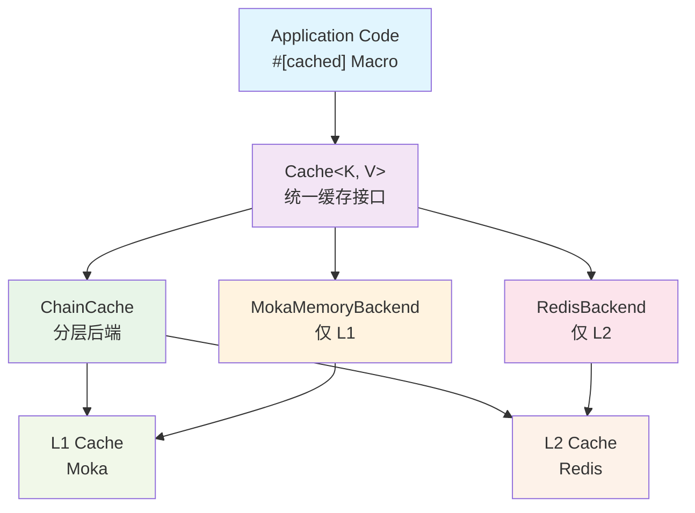
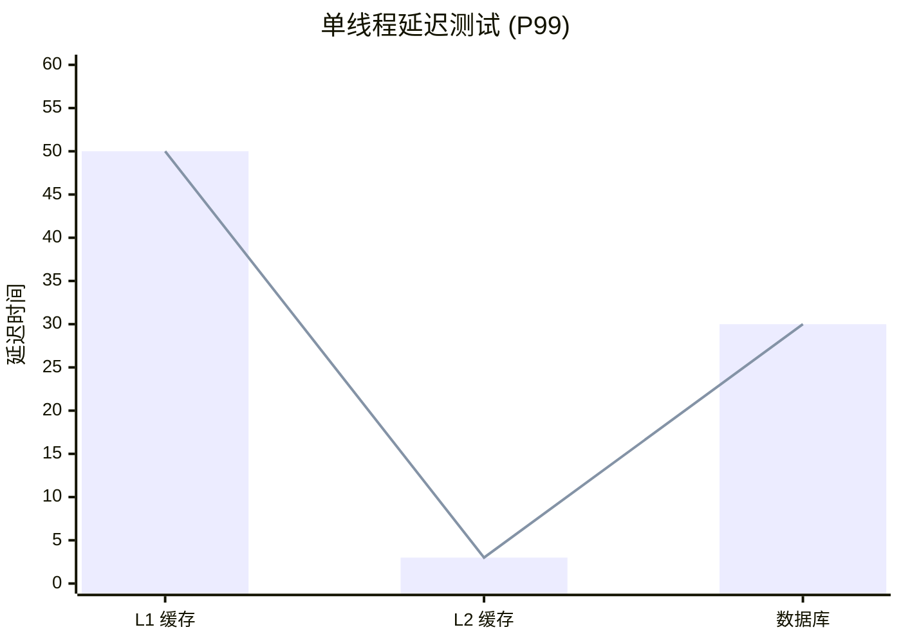
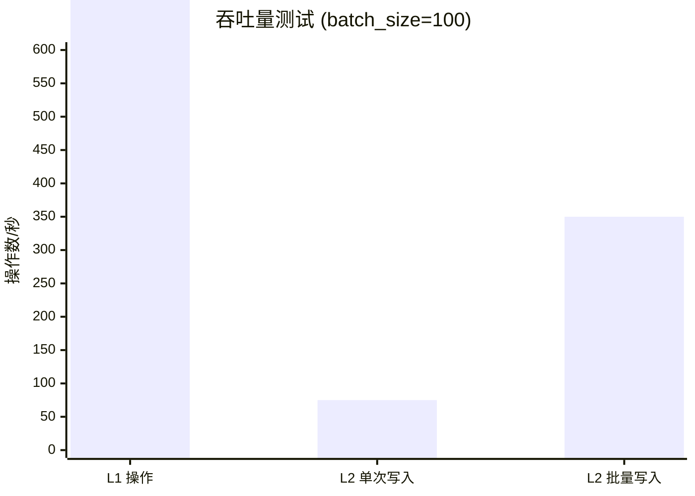

<div align="center">


[](https://github.com/Kirky-X/oxcache/actions/workflows/ci.yml)[](https://crates.io/crates/oxcache)[](https://docs.rs/oxcache)[](https://crates.io/crates/oxcache)[](https://codecov.io/gh/Kirky-X/oxcache)[](https://deps.rs/repo/github/Kirky-X/oxcache)[](https://github.com/Kirky-X/oxcache/blob/main/LICENSE)[](https://www.rust-lang.org)

高性能、生产级的 Rust 双层缓存库，提供 L1（Moka 内存缓存）+ L2（Redis 分布式缓存）双层架构。

</div>

[English](./README_EN.md)

## ✨ 核心特性

<div align="center">

<table>
<tr>
<td width="25%" align="center">
<br>
<b>极致性能</b><br>L1 纳秒级响应
</td>
<td width="25%" align="center">
<br>
<b>零侵入式</b><br>一行代码启用缓存
</td>
<td width="25%" align="center">
<br>
<b>自动故障恢复</b><br>Redis 故障自动降级
</td>
<td width="25%" align="center">
<br>
<b>批量优化</b><br>智能批量写入
</td>
</tr>
</table>

</div>

- **🚀 极致性能**: L1 纳秒级响应（P99 < 100ns），L2 毫秒级响应（P99 < 5ms）
- **🎯 零侵入式**: 通过 `#[cached]` 宏一行代码启用缓存
- **🔄 自动故障恢复**: Redis 故障时自动降级到 L1 缓存
- **⚡ 批量优化**: 智能批量写入，大幅提升吞吐量
- **🧪 同步 API**: 在异步 API 之外提供同步路径 `get_sync` / `set_sync` / `get_or_sync`，在 `multi_thread` tokio 上无需运行时
- **🌸 布隆过滤器**: 可选的 `BloomFilterBackend` 装饰器以 O(1) 成本过滤负查询，跳过 inner 后端
- **⏱️ 全局 per-entry TTL**: 所有后端（Moka / DashMap / Redis / Mock / Chain / Bloom）都遵守 per-entry `set(key, value, Some(ttl))`
- **🛡️ 生产级可靠**: 完整的可观测性、健康检查、混沌测试验证

## 📦 快速开始

### 安装

在 `Cargo.toml` 中添加依赖：

```toml
[dependencies]
oxcache = "0.3.6"
```

> **注意**：`tokio` 和 `serde` 已默认包含。如果需要最小依赖，可以使用
`oxcache = { version = "0.3.5", default-features = false }` 手动添加。

> **特性**：要使用 `#[cached]` 宏，需要启用 `macros` 特性：`oxcache = { version = "0.3.5", features = ["macros"] }`

### 基础使用

```rust
use oxcache::macros::cached;
use oxcache::{Cache, CacheBuilder};
use serde::{Deserialize, Serialize};

#[derive(Serialize, Deserialize, Clone, Debug)]
struct User {
    id: u64,
    name: String,
}

// 一行代码启用缓存
#[cached(service = "user_cache", ttl = 600)]
async fn get_user(id: u64) -> Result<User, String> {
    // 模拟耗时的数据库查询
    tokio::time::sleep(std::time::Duration::from_millis(100)).await;
    Ok(User {
        id,
        name: format!("User {}", id),
    })
}

#[tokio::main]
async fn main() -> Result<(), Box<dyn std::error::Error>> {
    // 使用 Builder 模式初始化缓存（默认：Moka L1 内存后端）
    let cache: Cache<String, User> = Cache::builder()
        .capacity(10000)
        .ttl(std::time::Duration::from_secs(600))
        .build()
        .await?;

    // 注册缓存实例供宏使用
    cache.register_for_macro("user_cache").await;

    // 第一次调用：执行函数逻辑 + 缓存结果（~100ms）
    let user = get_user(1).await?;
    println!("First call: {:?}", user);

    // 第二次调用：直接从缓存返回（~0.1ms）
    let cached_user = get_user(1).await?;
    println!("Cached call: {:?}", cached_user);

    Ok(())
}
```

### Builder API

Oxcache 提供类型安全的构建器 API 用于配置缓存。以下是可用的构建器方法：

| 方法 | 描述 |
|--------|------|
| `Cache::builder()` | 创建新的缓存构建器 |
| `.ttl(Duration)` | 设置缓存条目的默认 TTL |
| `.tti(Duration)` | 设置缓存条目的默认 TTI（time-to-idle） |
| `.capacity(u64)` | 设置内存缓存容量 |
| `.backend_arc(Arc<dyn CacheBackend>)` | 添加预构建后端（如 `RedisBackend`、`MokaMemoryBackend`） |
| `.sync_mode(bool)` | 启用同步 API 支持（`get_sync`/`set_sync`/...） |
| `.build()` | 构建 `Cache<K, V>` 实例（异步） |

> **注意：** Redis 后端请使用 `RedisBackend::new(url).await?` 然后通过 `.backend_arc(Arc::new(backend))` 传入。
> 分层缓存（L1+L2）请使用 `ChainCache::builder().link(...).build()`。

## 🔧 特性标志

### 特性分层

```toml
# 完整特性（推荐）
oxcache = { version = "0.3.6", features = ["full"] }

# 核心功能（L1 + L2 缓存）
oxcache = { version = "0.3.6", features = ["core"] }

# 最小特性（仅 L1 缓存）
oxcache = { version = "0.3.6", features = ["minimal"] }

# 自定义选择
oxcache = { version = "0.3.6", features = ["core", "macros", "metrics", "bloom-filter"] }
```

### 可用特性

| 层级 | 包含特性 | 描述 |
|------|----------|------|
| **minimal** | `memory`, `tokio/time`, `tracing`, `metrics`, `serialization`, `chrono` | 仅 L1 缓存 |
| **core** | `minimal` + `redis`, `futures` | L1 + L2 缓存 |
| **full** | `core` + `macros`, `compression`, `batch-write`, `lua-script`, `cli`, `testing` | 完整功能 |

**独立特性**：
- `memory` - L1 缓存后端（Moka + DashMap）
- `redis` - L2 分布式缓存（Redis）
- `macros` - `#[cached]` 属性宏
- `serialization` - JSON 序列化（serde + serde_json）
- `compression` - 数据压缩（flate2）
- `metrics` - OpenTelemetry 指标与可观测性
- `batch-write` - 优化的批量写入（tokio-util）
- `lua-script` - Lua 脚本执行支持
- `cli` - 命令行界面（clap）
- `tracing` - 结构化日志支持
- `bloom-filter` - 负查询过滤（BloomFilter + BloomFilterBackend）；不在 `full` 中，需显式启用

## 🎨 使用场景

### 场景 1: 用户信息缓存

```rust
#[cached(service = "user_cache", ttl = 600)]
async fn get_user_profile(user_id: u64) -> Result<UserProfile, Error> {
    database::query_user(user_id).await
}
```

### 场景 2: API 响应缓存

```rust
#[cached(
    service = "api_cache",
    ttl = 300,
    key = "api_{endpoint}_{version}"
)]
async fn fetch_api_data(endpoint: String, version: u32) -> Result<ApiResponse, Error> {
    http_client::get(&format!("/api/{}/{}", endpoint, version)).await
}
```

### 场景 3: 仅 L1 热数据缓存

```rust
#[cached(service = "session_cache", cache_type = "l1", ttl = 60)]
async fn get_user_session(session_id: String) -> Result<Session, Error> {
    session_store::load(session_id).await
}
```

### 场景 4: 手动控制缓存

```rust
use oxcache::{Cache, CacheBuilder};
use serde::{Deserialize, Serialize};

#[derive(Serialize, Deserialize)]
struct MyData {
    field: String,
}

async fn advanced_caching() -> Result<(), Box<dyn std::error::Error>> {
    // 使用 Builder 模式初始化缓存（默认：Moka L1 内存后端）
    let cache: Cache<String, MyData> = Cache::builder()
        .capacity(10000)
        .build()
        .await?;

    let my_data = MyData {
        field: "value".to_string(),
    };

    // 标准操作
    cache.set(&"key".to_string(), &my_data).await?;

    let data: Option<MyData> = cache.get(&"key".to_string()).await?;
    println!("Data: {:?}", data);

    // 删除
    cache.delete(&"key".to_string()).await?;

    Ok(())
}
```

## 🧪 同步 API（0.3.0）

Oxcache 0.3.0 在异步 API 之外引入了**同步 API 路径**。在 builder 上启用：

```rust
use oxcache::Cache;
use serde::{Deserialize, Serialize};

#[derive(Serialize, Deserialize, Clone, Debug, PartialEq)]
struct User { id: u64, name: String }

#[tokio::main(flavor = "multi_thread")]
async fn main() -> Result<(), Box<dyn std::error::Error>> {
    // sync_mode(true) 使 Cache<K,V> 同时持有 Arc<dyn SyncCacheBackend>
    let cache: Cache<String, User> = Cache::builder().sync_mode(true).build().await?;

    // 同步操作（无 .await）
    cache.set_sync(&"user:1".to_string(), &User { id: 1, name: "Alice".into() })?;
    let cached = cache.get_sync(&"user:1".to_string())?;
    assert_eq!(cached, Some(User { id: 1, name: "Alice".into() }));

    // per-entry TTL
    cache.set_with_ttl_sync(&"temp".to_string(), &User { id: 2, name: "Temp".into() }, Some(std::time::Duration::from_secs(60)))?;

    // 单飞 get_or_sync：并发调用共享一次 fallback 执行
    let value = cache.get_or_sync(&"user:42".to_string(), || {
        Ok(User { id: 42, name: "Bob".into() })
    })?;

    // sync 与 async API 在同一 Cache<K,V> 上共存
    cache.set(&"async_key".to_string(), &User { id: 99, name: "Async".into() }).await?;
    let v = cache.get_sync(&"async_key".to_string())?;
    Ok(())
}
```

**何时使用同步 API**：
- 阻塞调用点（遗留代码、FFI、同步处理器）
- 不想在每个断言中穿过 `async` 的测试
- 调用方本身是同步的，避免运行时开销

**运行时注意事项**：
- `sync_mode(true)` 在 `multi_thread` tokio 运行时上工作。在 `current_thread` 运行时上，Moka 的 `sync_block_on` 会 panic（使用 `#[tokio::main(flavor = "multi_thread")]` 或在运行时上下文之外调用）。
- 不启用 `sync_mode(true)` 时，调用任何 `*_sync` 方法返回 `Err(OxCacheError::NotSupported)`。

**`#[cached(sync)]` 宏**：

```rust
use oxcache::macros::cached;

#[cached(service = "user_cache", ttl = 600, sync)]
fn get_user_sync(id: u64) -> Result<User, String> {
    // 同步函数体 —— 无需 async 运行时
    Ok(User { id, name: format!("User {}", id) })
}
```

## 🌸 布隆过滤器（0.3.0）

`bloom-filter` 特性（需显式启用；不在 `full` 中）提供负查询过滤：

```toml
[dependencies]
oxcache = { version = "0.3.6", features = ["memory", "bloom-filter"] }
```

```rust
use oxcache::backend::interface::{CacheReader, CacheWriter};
use oxcache::backend::MokaMemoryBackend;
use oxcache::features::bloom_filter::{BloomFilter, BloomFilterBackend};

#[tokio::main]
async fn main() -> Result<(), Box<dyn std::error::Error>> {
    // 1. 独立 BloomFilter 类型
    let bf = BloomFilter::new(10_000, 0.01);  // 容量、误判率
    bf.insert("existing_key");
    assert!(bf.contains("existing_key"));    // 无假阴性
    assert!(!bf.contains("missing_key"));    // 可能有假阳性

    // 2. BloomFilterBackend 装饰器：包装任何 CacheBackend
    let inner = MokaMemoryBackend::new();
    let backend = BloomFilterBackend::builder()
        .capacity(10_000)
        .false_positive_rate(0.01)
        .inner(inner)
        .build()?;

    // `get` 时：BF 说"不存在" → 完全跳过 inner。BF 说"可能存在" → 查询 inner。
    backend.set("user:1", b"Alice".to_vec(), None).await?;
    let value = backend.get("user:1").await?;       // Some(b"Alice")
    let miss  = backend.get("user:999").await?;     // None —— BF 过滤，inner 未触及

    Ok(())
}
```

**特性**：
- 无假阴性（插入的 key 总是 `contains == true`）
- `set` 更新 BF 和 inner；`delete` 只更新 inner（BF 不支持删除）
- `clear` 同时清空两者；TTL 原样透传
- 当 inner 后端实现 `SyncCacheBackend` 时，装饰器也实现

## ⏱️ TTL 行为对照表（0.3.0）

自 0.3.0 起所有后端都遵守 per-entry TTL。行为汇总：

| 后端 | `set(ttl=Some)` | `ttl(key)` | `expire(key, new_ttl)` | 说明 |
|---------|-----------------|------------|------------------------|-------|
| **MokaMemoryBackend** | 通过 `moka::Expiry` 真实 per-entry TTL | 剩余 TTL | 更新 + 返回 `true` | 全局 TTL（`builder.ttl(...)`）被 per-entry TTL 覆盖 |
| **DashMapMemoryBackend** | 存储 `(value, expiry Instant)`；读取时懒过期 | 剩余 TTL（无 TTL 则 None） | 更新 + 返回 `true` | 懒过期 —— 条目在下次访问时移除 |
| **RedisBackend** | `SET key value EX ttl` | `TTL key`（Redis 原生） | `EXPIRE key ttl` | 使用 Redis 原生 TTL |
| **MockBackend** | 存储 `(value, expiry Instant)`；懒过期 | 剩余 TTL | 更新 + 返回 `true` | 仅测试用；与 DashMap 语义对齐 |
| **ChainCache** | 将 `ttl` 透传到所有链接 | 返回拥有该 key 的最高分链接的 TTL | 透传到所有链接 | 所有链接接收相同 TTL |
| **BloomFilterBackend** | 将 `ttl` 透传到 inner（同时插入 key 到 BF） | 委托给 inner | 委托给 inner | BF 本身无 TTL 概念 |

**全局 vs per-entry TTL**：
- `MokaMemoryBackend::builder().ttl(Duration)` 设置应用于每个条目的全局 TTL
- `set(key, value, Some(ttl))` 覆盖该条目的全局 TTL
- `set(key, value, None)` 使用全局 TTL（若设置）；否则条目永不过期

## 🏗️ 架构



**L1**: 进程内高速缓存，使用 LRU/TinyLFU 淘汰策略
**L2**: 分布式共享缓存，支持 Sentinel/Cluster 模式

## 📊 性能

> 测试环境: M1 Pro, 16GB RAM, macOS, Redis 7.0
>
> **注意**: 性能因硬件、网络条件和数据大小而异。





**性能数据总结**:
- **L1 缓存**: 50-100ns (内存访问)
- **L2 缓存**: 1-5ms (Redis, 本地)
- **数据库**: 10-50ms (典型 SQL 查询)
- **L1 操作**: 5-10M ops/sec
- **L2 单次写入**: 50-100K ops/sec
- **L2 批量写入**: 200-500K ops/sec

## 🛡️ 可靠性

- ✅ 单次请求去重 (Single-Flight)
- ✅ Redis 故障自动降级
- ✅ 优雅关闭机制
- ✅ 健康检查与自动恢复

### 安全性

Oxcache 实现了多项安全措施以防范常见攻击：

#### 输入验证

所有用户输入在传递给 Redis 之前都会进行验证：

- **键验证**：键不能为空、不能超过 512KB、不能包含危险字符（`\r`、`\n`、`\0`），以防止 Redis 协议注入攻击。
- **Lua 脚本验证**：脚本验证包括：
  - 最大长度 10KB
  - 最多 100 个键
  - 阻止危险命令：`FLUSHALL`、`FLUSHDB`、`KEYS`、`SHUTDOWN`、`DEBUG`、`CONFIG`、`SAVE`、`BGSAVE`、`MONITOR`
  - 注释和字符串内容预处理，防止通过注释绕过检测
- **SCAN 模式验证**：模式验证以防止 ReDoS 攻击：
  - 最大长度 256 个字符
  - 最多 10 个通配符（`*`）字符
  - count 参数限制在安全范围内（1-1000）
- **SQL/路径遍历检测**：Redis 键会扫描潜在的 SQL 注入和路径遍历模式

#### 安全 API（公共函数）

对于高级用例，您可以直接使用安全验证函数：

```rust
use oxcache::{validate_redis_key, validate_lua_script, validate_scan_pattern};

// 验证 Redis 键
validate_redis_key("user:123").expect("无效的键");

// 验证 Lua 脚本
validate_lua_script("return redis.call('GET', KEYS[1])", 1).expect("无效的脚本");

// 验证 SCAN 模式
validate_scan_pattern("user:*").expect("无效的模式");
```

#### 超时保护

长时间运行的操作有超时保护：

- **Lua 脚本**：30 秒超时，防止 Redis 阻塞
- **SCAN 操作**：30 秒超时，防止扫描挂起

#### 安全锁值

分布式锁使用库自动生成的加密安全 UUID v4 值，消除锁值预测攻击的风险。

#### 连接字符串脱敏

连接字符串中的密码在日志中默认脱敏，以防止凭据泄露。使用 `redact_connection_string()` 进行安全日志记录。

#### 最佳实践

1. **使用库的键验证** - 不要绕过 `validate_redis_key()` 函数
2. **避免自定义 Lua 脚本** - 尽可能使用内置缓存操作
3. **设置适当的超时** - 不要禁用 30 秒默认超时
4. **轮换锁值** - 库会自动处理
5. **永远不要记录连接字符串** - 使用脱敏工具进行调试

更多详情请参阅 [安全文档](docs/SECURITY.md)。

## 📚 文档

- [📖 用户指南](docs/USER_GUIDE.md)
- [📘 API 文档](https://docs.rs/oxcache)
- [💻 示例代码](examples/)

> **注意**：`oxcache-examples` 已设为 `publish = false` 并纳入 workspace 管理。

## 🤝 贡献

欢迎提交 Pull Request 和 Issue！详见 [贡献指南](CONTRIBUTING.md)。

## 📋 更新日志

详见 [CHANGELOG.md](CHANGELOG.md)

## 📄 许可证

本项目采用 MIT 许可证。详见 [LICENSE](LICENSE) 文件。

---

<div align="center">

**如果这个项目对你有帮助，请给个 ⭐ Star 支持一下！**

Made with ❤️ by Kirky.X

</div>
