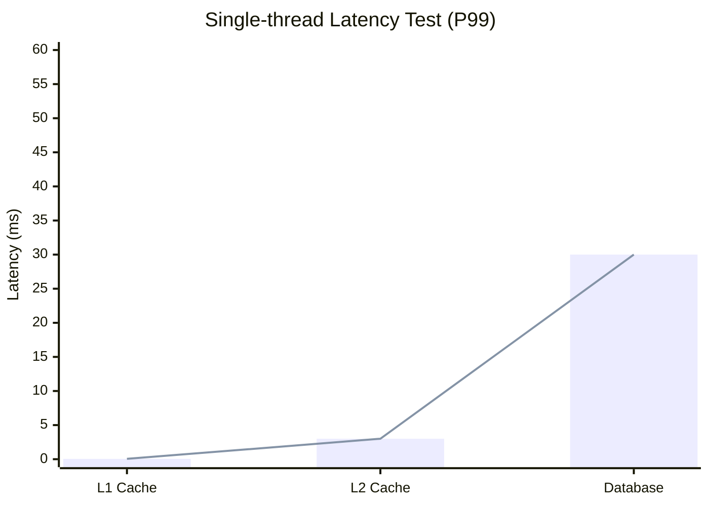
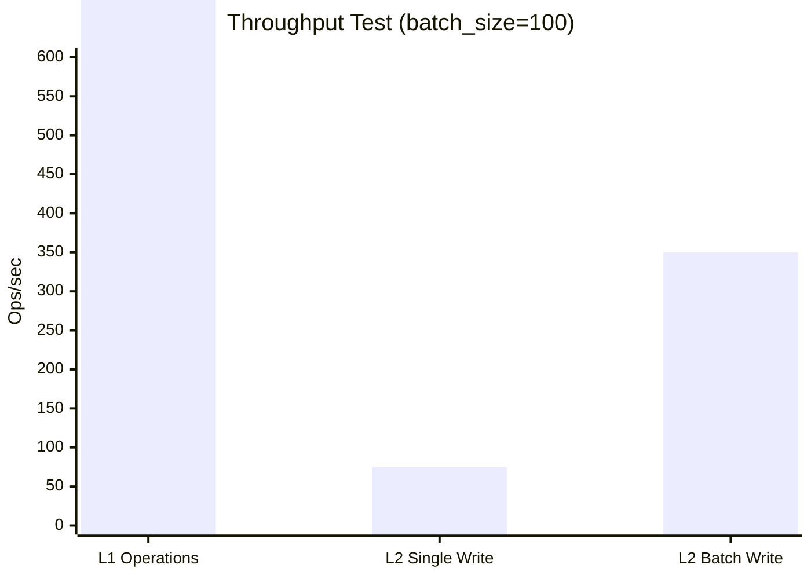

<div align="center">


[](https://github.com/Kirky-X/oxcache/actions/workflows/ci.yml)[](https://crates.io/crates/oxcache)[](https://docs.rs/oxcache)[](https://crates.io/crates/oxcache)[](https://codecov.io/gh/Kirky-X/oxcache)[](https://deps.rs/repo/github/Kirky-X/oxcache)[](https://github.com/Kirky-X/oxcache/blob/main/LICENSE)[](https://www.rust-lang.org)

[English](../README.md) | [简体中文](README_zh.md)

Oxcache is a high-performance, production-grade two-level caching library for Rust, providing L1 (Moka in-memory
cache) + L2 (Redis distributed cache) architecture.

</div>

## ✨ Key Features

<div align="center">

<table>
<tr>
<td width="20%" align="center">
<br>
<b>Extreme Performance</b><br>L1 in nanoseconds
</td>
<td width="20%" align="center">
<br>
<b>Zero-Code Changes</b><br>One-line cache enable
</td>
<td width="20%" align="center">
<br>
<b>Auto Recovery</b><br>Redis fault degradation
</td>
<td width="20%" align="center">
<br>
<b>Multi-Instance Sync</b><br>Based on Pub/Sub
</td>
<td width="20%" align="center">
<br>
<b>Batch Optimization</b><br>Smart batch writes
</td>
</tr>
</table>

</div>

- **🚀 Extreme Performance**: L1 nanosecond response (P99 < 100ns), L1 millisecond response (P99 < 5ms)
- **🎯 Zero-Code Changes**: Enable caching with a single `#[cached]` macro
- **🔄 Auto Recovery**: Automatic degradation on Redis failure, WAL replay on recovery
- **🌐 Multi-Instance Sync**: Pub/Sub + version-based invalidation synchronization
- **⚡ Batch Optimization**: Intelligent batch writes for significantly improved throughput
- **🛡️ Production Grade**: Complete observability, health checks, chaos testing verified

## 📦 Quick Start

### 1. Add Dependency

Add `oxcache` to your `Cargo.toml`:

```toml
[dependencies]
oxcache = "0.2.0"
```

> **Note**: `tokio` and `serde` are already included by default. If you need minimal dependencies, you can use
`oxcache = { version = "0.2.0", default-features = false }` and add them manually.

> **Features**: To use `#[cached]` macro, enable `macros` feature: `oxcache = { version = "0.2.0", features = ["macros"] }`

#### Feature Tiers

```toml
# Full features (recommended)
oxcache = { version = "0.2.0", features = ["full"] }

# Core functionality only
oxcache = { version = "0.2.0", features = ["core"] }

# Minimal - L1 cache only
oxcache = { version = "0.2.0", features = ["minimal"] }

# Custom selection
oxcache = { version = "0.2.0", features = ["core", "macros", "metrics"] }

# Development with specific features
oxcache = { version = "0.2.0", features = [
    "moka",      # L1 cache (Moka)
    "redis",     # L2 cache (Redis)
    "macros",       # #[cached] macro
    "batch-write",  # Optimized batch writing
    "metrics",      # Basic metrics
] }
```

| Tier | Features | Description |
|------|----------|-------------|
| **minimal** | `moka`, `serialization`, `metrics` | L1 cache only |
| **core** | `minimal` + `redis` | L1 + L2 cache |
| **full** | `core` + all advanced features | Complete functionality |

**Advanced Features** (included in `full`):
- `macros` - `#[cached]` attribute macro
- `batch-write` - Optimized batch writing
- `wal-recovery` - Write-ahead log for durability
- `bloom-filter` - Cache penetration protection
- `rate-limiting` - DoS protection
- `database` - Database integration
- `cli` - Command-line interface
- `full-metrics` - OpenTelemetry integration

### 2. Configuration

Create a `config.toml` file:

> **Important**: To initialize from a config file, you need to enable the `confers` feature:
> ```toml
> oxcache = { version = "0.2.0", features = ["confers"] }
> ```

```toml
[global]
default_ttl = 3600
health_check_interval = 30
serialization = "json"
enable_metrics = true

# Two-level cache (L1 + L2)
[services.user_cache]
cache_type = "two-level"  # "l1" | "l2" | "two-level"
ttl = 600

  [services.user_cache.l1]
  max_capacity = 10000
  ttl = 300  # L1 TTL must be <= L2 TTL
  tti = 180
  initial_capacity = 1000

  [services.user_cache.l2]
  mode = "standalone"  # "standalone" | "sentinel" | "cluster"
  connection_string = "redis://127.0.0.1:6379"

  [services.user_cache.two_level]
  write_through = true
  promote_on_hit = true
  enable_batch_write = true
  batch_size = 100
  batch_interval_ms = 50

# L1-only cache (memory only)
[services.session_cache]
cache_type = "l1"
ttl = 300

  [services.session_cache.l1]
  max_capacity = 5000
  ttl = 300
  tti = 120

# L2-only cache (Redis only)
[services.shared_cache]
cache_type = "l2"
ttl = 7200

  [services.shared_cache.l2]
  mode = "standalone"
  connection_string = "redis://127.0.0.1:6379"
```

### 2.1 Type-Safe Configuration API (Recommended)

Oxcache provides a **type-safe builder API** for configuration, enabling compile-time type checking and better IDE support. This approach is recommended over TOML configuration for most use cases.

> **Note**: To use the type-safe configuration API, enable the `confers` feature:
> ```toml
> oxcache = { version = "0.2.0", features = ["confers"] }
> ```

#### Memory-Only Cache (L1)

```rust
use oxcache::config::UnifiedConfigBuilder;
use oxcache::{Cache, CacheBuilder};
use serde::{Deserialize, Serialize};

#[derive(Serialize, Deserialize, Clone, Debug)]
struct User {
    id: u64,
    name: String,
}

#[tokio::main]
async fn main() -> Result<(), Box<dyn std::error::Error>> {
    // Create type-safe configuration using builder API
    let config = UnifiedConfigBuilder::memory_only()
        .with_ttl(3600)           // Default TTL in seconds
        .with_l1_capacity(10000)  // L1 cache capacity
        .build();

    // Create cache directly from configuration
    let cache: Cache<String, User> = CacheBuilder::from_unified_config(&config)
        .build()
        .await?;

    // Use the cache
    let user = User {
        id: 1,
        name: "Alice".to_string(),
    };

    cache.set(&"user:1".to_string(), &user).await?;
    let cached: Option<User> = cache.get(&"user:1".to_string()).await?;

    println!("User: {:?}", cached);
    Ok(())
}
```

#### Tiered Cache (L1 + L2)

```rust
use oxcache::config::UnifiedConfigBuilder;
use oxcache::{Cache, CacheBuilder};
use serde::{Deserialize, Serialize};

#[derive(Serialize, Deserialize, Clone, Debug)]
struct User {
    id: u64,
    name: String,
}

#[tokio::main]
async fn main() -> Result<(), Box<dyn std::error::Error>> {
    // Create tiered cache configuration
    let config = UnifiedConfigBuilder::tiered()
        .with_ttl(7200)            // Default TTL in seconds
        .with_l1_capacity(10000)   // L1 memory cache capacity
        .with_redis_url("redis://localhost:6379")  // L2 Redis connection
        .with_redis_mode("standalone")  // Redis mode
        .build();

    // Create cache directly from configuration
    let cache: Cache<String, User> = CacheBuilder::from_unified_config(&config)
        .build()
        .await?;

    // Use the cache (writes to both L1 and L2)
    let user = User {
        id: 1,
        name: "Alice".to_string(),
    };

    cache.set(&"user:1".to_string(), &user).await?;
    let cached: Option<User> = cache.get(&"user:1".to_string()).await?;

    println!("User: {:?}", cached);
    Ok(())
}
```

#### Configuration Builder Methods

| Method | Description |
|--------|-------------|
| `UnifiedConfigBuilder::memory_only()` | Create memory-only (L1) cache configuration |
| `UnifiedConfigBuilder::redis_only()` | Create Redis-only (L2) cache configuration |
| `UnifiedConfigBuilder::tiered()` | Create tiered (L1 + L2) cache configuration |
| `.with_ttl(seconds)` | Set default TTL for cache entries |
| `.with_tti(seconds)` | Set default TTI (time-to-inactive) |
| `.with_health_check_interval(seconds)` | Set health check interval |
| `.with_l1_capacity(count)` | Set L1 memory cache capacity |
| `.with_redis_url(url)` | Set Redis connection URL |
| `.with_redis_mode(mode)` | Set Redis mode ("standalone", "sentinel", "cluster") |
| `.with_metrics(enabled)` | Enable/disable metrics collection |
| `.with_wal(enabled)` | Enable/disable Write-Ahead Log |
| `.with_auto_recovery(enabled)` | Enable/disable automatic recovery |
| `.build()` | Build `UnifiedConfig` instance |
| `.build_json()` | Build configuration as `serde_json::Value` |

#### Benefits of Type-Safe API

- **Compile-time validation**: Configuration errors caught at compile time
- **IDE support**: Full autocomplete and type hints
- **No runtime parsing**: Eliminates TOML parsing overhead
- **Better error messages**: Type errors instead of configuration parse errors
- **Refactoring friendly**: Rename refactoring works across configuration

### 3. Usage

#### Using Macros (Recommended)

```rust
use oxcache::macros::cached;
use oxcache::{Cache, CacheBuilder};
use serde::{Deserialize, Serialize};

#[derive(Serialize, Deserialize, Clone, Debug)]
struct User {
    id: u64,
    name: String,
}

// One-line cache enable
#[cached(service = "user_cache", ttl = 600)]
async fn get_user(id: u64) -> Result<User, String> {
    // Simulate slow database query
    tokio::time::sleep(std::time::Duration::from_millis(100)).await;
    Ok(User {
        id,
        name: format!("User {}", id),
    })
}

#[tokio::main]
async fn main() -> Result<(), Box<dyn std::error::Error>> {
    // Initialize cache using Builder pattern
    let cache: Cache<String, User> = CacheBuilder::default()
        .tiered(10000, "redis://127.0.0.1:6379")
        .build()
        .await?;

    // Register cache for macro usage
    cache.register_for_macro("user_cache").await;

    // First call: execute function logic + cache result (~100ms)
    let user = get_user(1).await?;
    println!("First call: {:?}", user);

    // Second call: return directly from cache (~0.1ms)
    let cached_user = get_user(1).await?;
    println!("Cached call: {:?}", cached_user);

    Ok(())
}
```

#### Manual Client Usage

```rust
use oxcache::{Cache, CacheBuilder};
use serde::{Deserialize, Serialize};

#[derive(Serialize, Deserialize)]
struct MyData {
    field: String,
}

#[tokio::main]
async fn main() -> Result<(), Box<dyn std::error::Error>> {
    // Initialize cache using Builder pattern
    let cache: Cache<String, MyData> = CacheBuilder::default()
        .tiered(10000, "redis://127.0.0.1:6379")
        .build()
        .await?;

    let my_data = MyData {
        field: "value".to_string(),
    };

    // Standard operation: write to both L1 and L2
    cache.set(&"key".to_string(), &my_data).await?;

    let data: Option<MyData> = cache.get(&"key".to_string()).await?;
    println!("Data: {:?}", data);

    // Delete
    cache.delete(&"key".to_string()).await?;

    Ok(())
}
```

## 🎨 Use Cases

### Scenario 1: User Information Cache

```rust
#[cached(service = "user_cache", ttl = 600)]
async fn get_user_profile(user_id: u64) -> Result<UserProfile, Error> {
    database::query_user(user_id).await
}
```

### Scenario 2: API Response Cache

```rust
#[cached(
    service = "api_cache",
    ttl = 300,
    key = "api_{endpoint}_{version}"
)]
async fn fetch_api_data(endpoint: String, version: u32) -> Result<ApiResponse, Error> {
    http_client::get(&format!("/api/{}/{}", endpoint, version)).await
}
```

### Scenario 3: L1-Only Hot Data Cache

```rust
#[cached(service = "session_cache", cache_type = "l1", ttl = 60)]
async fn get_user_session(session_id: String) -> Result<Session, Error> {
    session_store::load(session_id).await
}
```

## 🏗️ Architecture

```mermaid
graph TD
    A[Application Code<br/>#[cached] Macro] --> B[Cache&lt;K, V&gt;<br/>Unified Cache Interface]

    B --> C[ChainCache<br/>Tiered Backend]
    B --> D[MokaMemoryBackend<br/>L1 Only]
    B --> E[RedisBackend<br/>L2 Only]

    C --> F[L1 Cache<br/>Moka]
    C --> G[L2 Cache<br/>Redis]

    D --> F
    E --> G

    style A fill:#e1f5fe
    style B fill:#f3e5f5
    style C fill:#e8f5e8
    style D fill:#fff3e0
    style E fill:#fce4ec
    style F fill:#f1f8e9
    style G fill:#fdf2e9
```

**L1**: In-process high-speed cache using LRU/TinyLFU eviction strategy
**L2**: Distributed shared cache supporting Sentinel/Cluster modes

## 📊 Performance Benchmarks

> Test environment: M1 Pro, 16GB RAM, macOS, Redis 7.0
>
> **Note**: Performance varies based on hardware, network conditions, and data size.





**Performance Summary**:
- **L1 Cache**: 50-100ns (in-memory)
- **L2 Cache**: 1-5ms (Redis, localhost)
- **Database**: 10-50ms (typical SQL query)
- **L1 Operations**: 5-10M ops/sec
- **L2 Single Write**: 50-100K ops/sec
- **L2 Batch Write**: 200-500K ops/sec

## 🛡️ Reliability

- ✅ Single-Flight (prevent cache stampede)
- ✅ WAL (Write-Ahead Log) persistence
- ✅ Automatic degradation on Redis failure
- ✅ Graceful shutdown mechanism
- ✅ Health checks and auto-recovery

## 🔐 Security

Oxcache implements multiple security measures to protect against common attacks:

### Input Validation

All user inputs are validated before being passed to Redis:

- **Key Validation**: Keys cannot be empty, exceed 512KB, or contain dangerous characters (`\r`, `\n`, `\0`) that could enable Redis protocol injection attacks.
- **Lua Script Validation**: Scripts are validated for:
  - Maximum length of 10KB
  - Maximum of 100 keys
  - Blocking dangerous commands: `FLUSHALL`, `FLUSHDB`, `KEYS`, `SHUTDOWN`, `DEBUG`, `CONFIG`, `SAVE`, `BGSAVE`, `MONITOR`
- **SCAN Pattern Validation**: Patterns are validated to prevent ReDoS attacks:
  - Maximum length of 256 characters
  - Maximum of 10 wildcard (`*`) characters
  - Count parameter clamped to safe range (1-1000)

### Timeout Protection

Long-running operations have timeout protection:

- **Lua Scripts**: 30-second timeout prevents Redis blocking
- **SCAN Operations**: 30-second timeout prevents hanging scans

### Secure Lock Values

Distributed locks use cryptographically secure UUID v4 values automatically generated by the library, eliminating the risk of lock value prediction attacks.

### Connection String Redaction

Passwords in connection strings are redacted in logs by default to prevent credential leakage. Use `normalize_connection_string_with_redaction()` for secure logging.

### Best Practices

1. **Use the library's key validation** - Don't bypass the `validate_redis_key()` function
2. **Avoid custom Lua scripts** - Use the built-in cache operations when possible
3. **Set appropriate timeouts** - Don't disable the 30-second default timeout
4. **Rotate lock values** - The library handles this automatically
5. **Never log connection strings** - Use the redaction utility for debugging

For more details, see [Security Documentation](docs/SECURITY.md).

## 📚 Documentation

- [📖 User Guide](docs/USER_GUIDE.md)
- [📘 API Documentation](https://docs.rs/oxcache)
- [💻 Examples](../examples/)

## 🤝 Contributing

Pull Requests and Issues are welcome!

## 📝 Changelog

See [CHANGELOG.md](../CHANGELOG.md)

## 📄 License

This project is licensed under MIT License. See [LICENSE](../LICENSE) file.

---

<div align="center">

**If this project helps you, please give a ⭐ Star to show support!**

Made with ❤️ by Kirky.X

</div>
