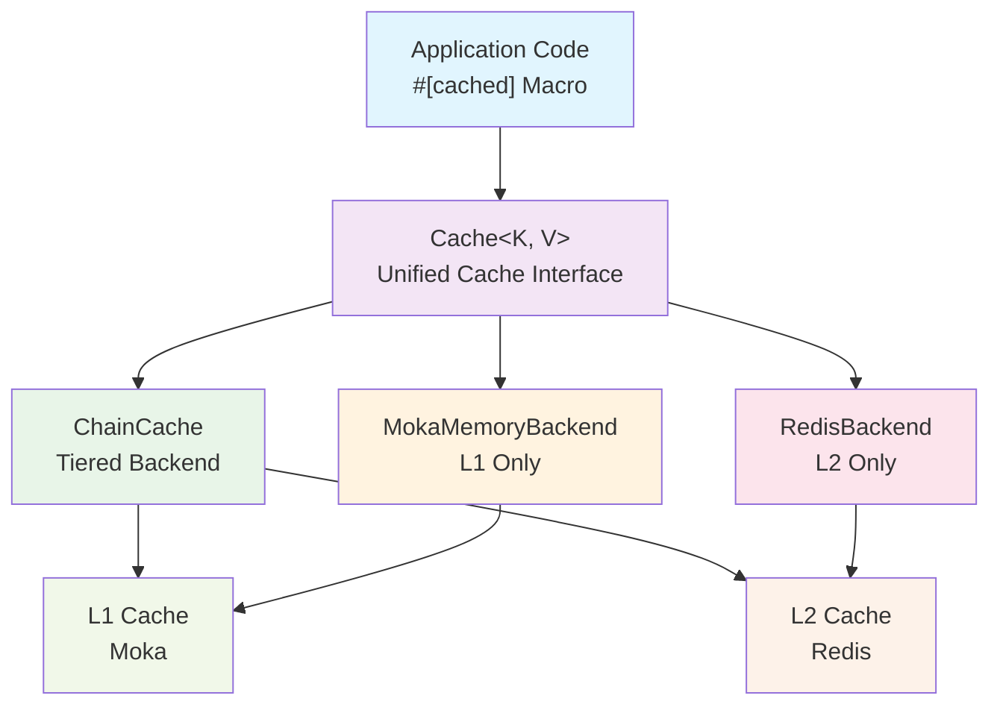
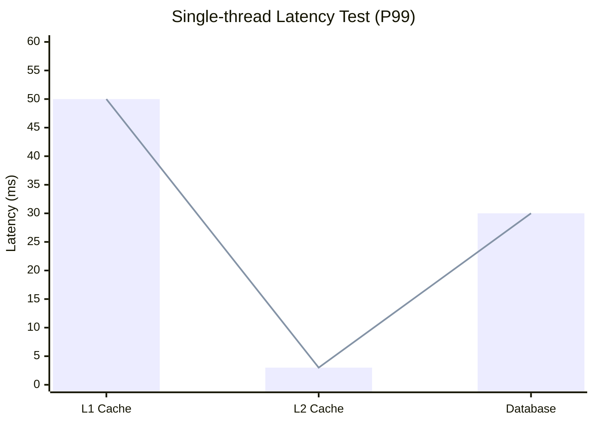
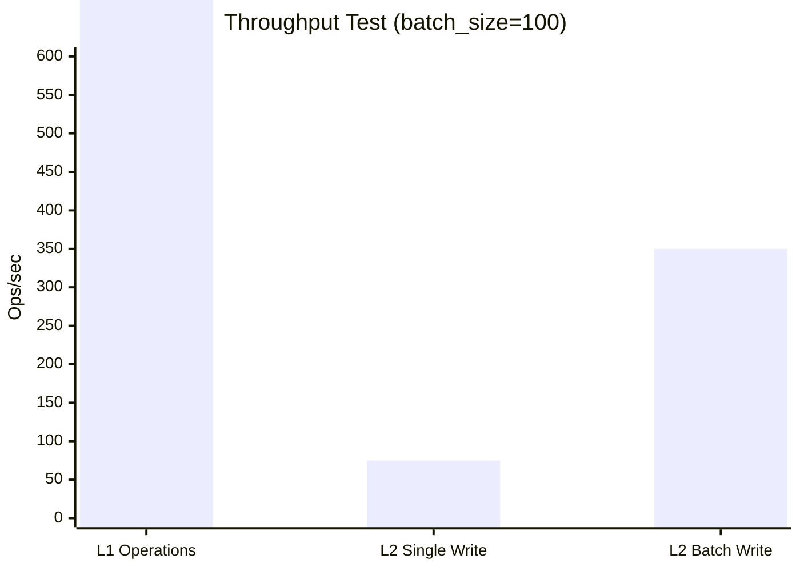

<div align="center">


[](https://github.com/Kirky-X/oxcache/actions/workflows/ci.yml) [](https://crates.io/crates/oxcache) [](https://docs.rs/oxcache) [](https://crates.io/crates/oxcache) [](LICENSE) [](https://www.rust-lang.org/) [](https://codecov.io/gh/Kirky-X/oxcache)

**[中文](README.md)** | English

**Oxcache is a high-performance, production-grade multi-backend caching library for Rust, supporting L1 (Moka/DashMap in-memory cache) + L2 (Redis / Valkey / Dragonfly / Aerospike) multi-tier architecture.**

[✨ Features](#-features) • [🚀 Quick Start](#-quick-start) • [📚 Documentation](#-documentation) • [💻 Examples](#-examples) • [🤝 Contributing](#-contributing)

</div>

---

## 📋 Table of Contents

<details open>
<summary>📑 Table of Contents (click to collapse / expand)</summary>

- [✨ Features](#-features)
- [🚀 Quick Start](#-quick-start)
  - [📦 Installation](#-installation)
  - [💡 Basic Usage](#-basic-usage)
  - [🧱 Builder API](#-builder-api)
- [🎨 Feature Flags](#-feature-flags)
- [📚 Documentation](#-documentation)
- [💻 Examples](#-examples)
- [🏗️ Architecture](#️-architecture)
- [🎯 Use Cases](#-use-cases)
- [🔄 Sync API](#-sync-api)
- [🌸 Bloom Filter](#-bloom-filter)
- [⏱️ TTL Behavior Reference](#️-ttl-behavior-reference)
- [🧪 Testing](#-testing)
- [📊 Performance](#-performance)
- [🔒 Security](#-security)
- [🗺️ Roadmap](#️-roadmap)
- [🤝 Contributing](#-contributing)
- [📋 Changelog](#-changelog)
- [📄 License](#-license)
- [🙏 Acknowledgments](#-acknowledgments)
- [📞 Contact & Support](#-contact--support)
- [⭐ Star History](#-star-history)

</details>

---

## ✨ Features

- **Extreme Performance**: L1 nanosecond response (P99 < 100ns), L2 millisecond response (P99 < 5ms)
- **Zero-Code Changes**: Enable caching with a single `#[cached]` macro
- **Auto Recovery**: Automatic degradation on Redis failure
- **Batch Optimization**: Intelligent batch writes for significantly improved throughput
- **Sync API**: Synchronous `get_sync` / `set_sync` / `get_or_sync` API path alongside async, with no runtime required on `multi_thread` tokio
- **Bloom Filter**: Optional `BloomFilterBackend` decorator filters negative queries at O(1) cost, skipping inner backend entirely
- **Universal per-entry TTL**: All backends (Moka / DashMap / Redis / Valkey / Dragonfly / Aerospike / Mock / Chain / Bloom) honor per-entry `set(key, value, Some(ttl))`
- **Production Grade**: Complete observability, health checks, chaos testing verified

---

## 🚀 Quick Start

### 📦 Installation

Add `oxcache` to your `Cargo.toml`:

```toml
[dependencies]
oxcache = "0.5.0-rc.3"
```

> **Note**: `tokio` and `serde` are already included by default. If you need minimal dependencies, you can use
> `oxcache = { version = "0.5.0-rc.3", default-features = false }` and add them manually.

> **Features**: To use `#[cached]` macro, enable `macros` feature: `oxcache = { version = "0.5.0-rc.3", features = ["macros"] }`

### 💡 Basic Usage

```rust
use oxcache::cached;
use oxcache::{Cache, CacheBuilder};
use serde::{Deserialize, Serialize};

#[derive(Serialize, Deserialize, Clone, Debug)]
struct User {
    id: u64,
    name: String,
}

// One-line cache enable
#[cached(service = "user_cache", ttl = 600)]
async fn get_user(id: u64) -> Result<User, String> {
    // Simulate slow database query
    tokio::time::sleep(std::time::Duration::from_millis(100)).await;
    Ok(User {
        id,
        name: format!("User {}", id),
    })
}

#[tokio::main]
async fn main() -> Result<(), Box<dyn std::error::Error>> {
    // Initialize cache using Builder pattern (default: Moka L1 memory backend)
    let cache: Cache<String, User> = Cache::builder()
        .capacity(10000)
        .ttl(std::time::Duration::from_secs(600))
        .build()
        .await?;

    // Register cache instance for macro usage
    cache.register_for_macro("user_cache").await;

    // First call: execute function logic + cache result (~100ms)
    let user = get_user(1).await?;
    println!("First call: {:?}", user);

    // Second call: return directly from cache (~0.1ms)
    let cached_user = get_user(1).await?;
    println!("Cached call: {:?}", cached_user);

    Ok(())
}
```

### 🧱 Builder API

Oxcache provides a type-safe builder API for configuring caches. Available builder methods:

| Method                                | Description                                                         |
| ------------------------------------- | ------------------------------------------------------------------- |
| `Cache::builder()`                    | Create a new cache builder                                          |
| `.ttl(Duration)`                      | Set default TTL for cache entries                                   |
| `.tti(Duration)`                      | Set default TTI (time-to-idle) for cache entries                    |
| `.capacity(u64)`                      | Set memory cache capacity                                           |
| `.backend_arc(Arc<dyn CacheBackend>)` | Add a pre-built backend (e.g., `RedisBackend`, `MokaMemoryBackend`) |
| `.sync_mode(bool)`                    | Enable sync API support (`get_sync`/`set_sync`/...)                 |
| `.build()`                            | Build `Cache<K, V>` instance (async, no internal awaits)           |
| `.build_sync()`                       | Build `Cache<K, V>` instance synchronously (no runtime required)  |

> **Note:** For Redis backend, use `RedisBackend::new(url).await?` then pass via `.backend_arc(Arc::new(backend))`.
> For tiered (L1+L2) cache, use `ChainCache::builder().link(...).build()`.

---

## 🎨 Feature Flags

### 🧱 Feature Tiers

```toml
# Full features (recommended)
oxcache = { version = "0.5.0-rc.3", features = ["full"] }

# Core functionality only
oxcache = { version = "0.5.0-rc.3", features = ["core"] }

# Minimal - L1 cache only
oxcache = { version = "0.5.0-rc.3", features = ["minimal"] }

# Custom selection
oxcache = { version = "0.5.0-rc.3", features = ["core", "macros", "metrics", "bloom"] }
```

### 📦 Available Features

| Tier        | Features                                                                        | Description            |
| ----------- | ------------------------------------------------------------------------------- | ---------------------- |
| **minimal** | `memory`, `tokio/time`, `metrics`, `serialization`, `chrono`                  | L1 cache only          |
| **core**    | `minimal` + `redis`                                                             | L1 + L2 cache          |
| **full**    | `core` + `macros`, `compression`, `batch`, `lua`, `cli`, `testing`, `dragonfly`, `aerospike`, `lock` | Complete functionality |

**Individual Features**:

- `memory` - L1 cache backends (Moka + DashMap)
- `redis` - L2 distributed cache (Redis / Valkey)
- `dragonfly` - Dragonfly cache backend (Redis protocol compatible)
- `aerospike` - Aerospike cache backend (independent protocol)
- `macros` - `#[cached]` attribute macro
- `serialization` - JSON serialization (serde + serde\_json)
- `compression` - Data compression (flate2)
- `metrics` - Built-in performance metrics (latency histograms, operation counts, JSON export); OTLP export handled at application level
- `batch` - Optimized batch writing
- `lua` - Lua script execution support
- `cli` - Command-line interface tools
- `i18n` - Error message internationalization + auto system language detection
- `bloom` - Negative query filtering (BloomFilter + BloomFilterBackend); not in `full`, must be enabled explicitly
- `kit` - trait-kit AsyncKit integration (OxcacheModule + health check + lifecycle + build observer + shutdown coordinator + decorator); not in `full`, must be enabled explicitly
- `testing` - Testing utilities

---

## 📚 Documentation

| Document | Description |
|----------|-------------|
| [📖 User Guide](docs/USER_GUIDE.md) | Complete tutorial from installation to advanced usage |
| [📘 API Reference](docs/API_REFERENCE.md) | Detailed description of all public APIs |
| [🏗️ Architecture](docs/ARCHITECTURE.md) | Design philosophy and internal implementation |
| [🔒 Security](docs/SECURITY.md) | Security design and best practices |
| [📋 Changelog](docs/CHANGELOG.md) | Change log for every release |
| [🤝 Contributing Guide](docs/CONTRIBUTING.md) | How to contribute to the project |
| [📦 Online API Docs](https://docs.rs/oxcache) | Latest auto-generated documentation on docs.rs |

> **Note**: documentation under `docs/` is written in Chinese.

---

## 💻 Examples

The `examples/` directory (workspace member `oxcache-examples`, set as `publish = false`) contains 37 runnable examples:

```bash
# Run a single example (from the examples/ directory)
cd examples && cargo run --example example_basic_operations

# List all available examples
cd examples && ls src/*/*.rs
```

### 🌱 Basics (`examples/src/01_basics`)

| Example | Description |
|---------|-------------|
| `example_basic_operations` | Basic CRUD operations (`get`/`set`/`delete`/`exists`) |
| `example_new_api` | Modern API introduction (`Cache::builder()` / `Cache::memory()`) |
| `example_cache_builder` | CacheBuilder configuration (`capacity` / `ttl` / `tti` / `sync_mode`) |
| `example_serialization` | JSON serialization |
| `example_cache_key` | Custom cache keys (`CacheKey` trait) |
| `example_cached_macro` | `#[cached]` macro (`service` / `ttl` / `key_prefix`) |
| `example_explicit_init` | Explicit initialization (`Cache::new()` / global cache) |
| `example_get_or` | Compute on cache miss (`get_or`, single-flight) |
| `example_sync_api` | Sync API (`get_sync` / `set_sync` / `clear_sync` / `len_sync`) |
| `example_byte_ops` | Byte-level operations (`get_bytes` / `set_bytes` / `len` / `capacity` / `shutdown`) |
| `example_comprehensive_usage` | Comprehensive usage (overview of all features) |

### 🚀 Advanced (`examples/src/02_advanced`)

| Example | Description |
|---------|-------------|
| `example_batch_write` | Batch operations (`set_many` / `get_many` / `delete_many`) |
| `example_chain_cache` | Chained cache (`ChainCache` / `ChainLink`) |
| `example_invalidation` | Cache invalidation strategies (TTL / TTI / manual invalidation) |
| `example_warmup` | Cache warm-up (batch preloading) |
| `example_smart_strategy` | Caching strategy patterns (Cache-Aside / Lazy Loading / tiered TTL) |
| `example_cache_promotion` | Cache promotion (L2→L1 promotion / hot-key analysis) |
| `example_error_handling` | Error handling (`OxCacheError` / retry / recoverability) |
| `example_custom_backend` | Custom backends (`CacheReader` / `CacheWriter` / `CacheConnector`) |
| `example_dashmap_backend` | DashMap backend (`DashMapMemoryBackend`) |
| `example_moka_ttl` | Moka per-entry TTL (`Expiry` trait) |
| `example_redis_native` | Native Redis operations (`RedisBackend`, requires Redis) |
| `example_redis_modes` | Redis deployment modes (Standalone / Cluster / Sentinel, requires Redis) |
| `example_redis_pipeline` | Pipeline batching (`set_many_pipeline` / `get_many_pipeline`, requires Redis) |
| `example_lua_script` | Lua script execution (`eval_lua` / `script_load` / `eval_sha`, requires Redis) |

### ⚙️ Configuration (`examples/src/03_config`)

| Example | Description |
|---------|-------------|
| `example_dynamic_config` | Dynamic configuration (runtime config changes) |
| `example_key_generator` | Key generator (`KeyGenerator`) |

### 🗄️ Database Integration (`examples/src/05_database`)

| Example | Description |
|---------|-------------|
| `example_database_integration` | Database integration (Cache-Aside pattern) |

### 🧩 Feature Showcase (`examples/src/06_features`)

| Example | Description |
|---------|-------------|
| `example_metrics` | Metrics export (`export_json_format` / `export_prometheus_format`) |
| `example_compression` | Data compression (`JsonSerializer::with_compression()`) |
| `example_security` | Data redaction (`redact_value` / `redact_connection_string`) |
| `example_security_validation` | Security validation (`validate_redis_key` / `validate_lua_script`) |
| `example_bloom_filter` | Bloom filter (`BloomFilter` / `BloomFilterBackend`) |
| `example_i18n` | Internationalization (`CacheI18nFormatter`) |
| `example_events` | Event system (`CacheEvent` / `CacheEventType`) |
| `example_cli_usage` | CLI usage (command-line tools) |
| `example_kit_integration` | trait-kit AsyncKit integration (OxcacheModule / health check / lifecycle / build observer / three-phase shutdown / decorator) |

> **Note**: examples marked "requires Redis" need a running Redis 6.0+ server; all other examples use in-memory backends and run standalone.

---

## 🏗️ Architecture



**L1**: In-process high-speed cache using LRU/TinyLFU eviction strategy
**L2**: Distributed shared cache supporting Sentinel/Cluster modes

**Reliability capabilities**:

- [x] Single-Flight (prevent cache stampede)
- [x] Automatic degradation on Redis failure
- [x] Graceful shutdown mechanism
- [x] Health checks and auto-recovery

For detailed design philosophy, module breakdown, and data flow, see the [Architecture documentation](docs/ARCHITECTURE.md).

---

## 🎯 Use Cases

### 👤 Scenario 1: User Information Cache

```rust
#[cached(service = "user_cache", ttl = 600)]
async fn get_user_profile(user_id: u64) -> Result<UserProfile, Error> {
    database::query_user(user_id).await
}
```

### 🌐 Scenario 2: API Response Cache

```rust
#[cached(
    service = "api_cache",
    ttl = 300,
    key = "api_{endpoint}_{version}"
)]
async fn fetch_api_data(endpoint: String, version: u32) -> Result<ApiResponse, Error> {
    http_client::get(&format!("/api/{}/{}", endpoint, version)).await
}
```

### ⚡ Scenario 3: L1-Only Hot Data Cache

```rust
#[cached(service = "session_cache", ttl = 60)]
async fn get_user_session(session_id: String) -> Result<Session, Error> {
    session_store::load(session_id).await
}
```

### 🛠️ Scenario 4: Manual Cache Control

```rust
use oxcache::{Cache, CacheBuilder};
use serde::{Deserialize, Serialize};

#[derive(Serialize, Deserialize)]
struct MyData {
    field: String,
}

async fn advanced_caching() -> Result<(), Box<dyn std::error::Error>> {
    // Initialize cache using Builder pattern (default: Moka L1 memory backend)
    let cache: Cache<String, MyData> = Cache::builder()
        .capacity(10000)
        .build()
        .await?;

    let my_data = MyData {
        field: "value".to_string(),
    };

    // Standard operations
    cache.set(&"key".to_string(), &my_data).await?;

    let data: Option<MyData> = cache.get(&"key".to_string()).await?;
    println!("Data: {:?}", data);

    // Delete
    cache.delete(&"key".to_string()).await?;

    Ok(())
}
```

---

## 🔄 Sync API

Oxcache 0.3.0 introduces a **synchronous API path** alongside the async API. Enable it on the builder:

```rust
use oxcache::Cache;
use serde::{Deserialize, Serialize};

#[derive(Serialize, Deserialize, Clone, Debug, PartialEq)]
struct User { id: u64, name: String }

#[tokio::main(flavor = "multi_thread")]
async fn main() -> Result<(), Box<dyn std::error::Error>> {
    // sync_mode(true) makes the Cache<K,V> also hold an Arc<dyn SyncCacheBackend>
    let cache: Cache<String, User> = Cache::builder().sync_mode(true).build().await?;

    // Synchronous operations (no .await)
    cache.set_sync(&"user:1".to_string(), &User { id: 1, name: "Alice".into() })?;
    let cached = cache.get_sync(&"user:1".to_string())?;
    assert_eq!(cached, Some(User { id: 1, name: "Alice".into() }));

    // Per-entry TTL
    cache.set_with_ttl_sync(&"temp".to_string(), &User { id: 2, name: "Temp".into() }, Some(std::time::Duration::from_secs(60)))?;

    // Single-flight get_or_sync: concurrent callers share one fallback execution
    let value = cache.get_or_sync(&"user:42".to_string(), || {
        Ok(User { id: 42, name: "Bob".into() })
    })?;

    // Sync and async APIs coexist on the same Cache<K,V>
    cache.set(&"async_key".to_string(), &User { id: 99, name: "Async".into() }).await?;
    let v = cache.get_sync(&"async_key".to_string())?;
    Ok(())
}
```

**When to use sync API**:

- Blocking call sites (legacy code, FFI, sync handlers)
- Tests that don't want to thread `async` through every assertion
- Avoiding runtime overhead when the caller is already synchronous

**Runtime notes**:

- `sync_mode(true)` works on `multi_thread` tokio runtime. On `current_thread` runtime, Moka's `sync_block_on` will panic (use `#[tokio::main(flavor = "multi_thread")]` or call from outside a runtime).
- Without `sync_mode(true)`, calling any `*_sync` method returns `Err(OxCacheError::NotSupported)`.

**`#[cached]` macro parameters**:

| Parameter | Type | Description |
|-----------|------|-------------|
| `service` | string | Cache service name (required) |
| `ttl` | integer | Default TTL in seconds |
| `key` | string | Custom key pattern (supports `{param}` interpolation) |
| `key_prefix` | string | Key prefix namespace |
| `sync` | flag | Generate synchronous function (no async runtime needed) |
| `skip_cache_write` | flag | Skip cache write for `Ok` results |

**`#[cached(sync)]`** **macro**:

```rust
use oxcache::cached;

#[cached(service = "user_cache", ttl = 600, sync)]
fn get_user_sync(id: u64) -> Result<User, String> {
    // Synchronous body — no async runtime required
    Ok(User { id, name: format!("User {}", id) })
}
```

---

## 🌸 Bloom Filter

Since 0.3.0, the `bloom` feature (must be enabled explicitly; not in `full`) provides negative-query filtering:

```toml
[dependencies]
oxcache = { version = "0.5.0-rc.3", features = ["memory", "bloom"] }
```

```rust
use oxcache::backend::interface::{CacheReader, CacheWriter};
use oxcache::backend::MokaMemoryBackend;
use oxcache::features::bloom_filter::{BloomFilter, BloomFilterBackend};

#[tokio::main]
async fn main() -> Result<(), Box<dyn std::error::Error>> {
    // 1. Standalone BloomFilter type
    let bf = BloomFilter::new(10_000, 0.01);  // capacity, false-positive rate
    bf.insert("existing_key");
    assert!(bf.contains("existing_key"));    // no false negatives
    assert!(!bf.contains("missing_key"));    // may have false positives

    // 2. BloomFilterBackend decorator: wraps any CacheBackend
    let inner = MokaMemoryBackend::new();
    let backend = BloomFilterBackend::builder()
        .capacity(10_000)
        .false_positive_rate(0.01)
        .inner(inner)
        .build()?;

    // On `get`: BF says "absent" → skip inner entirely. BF says "maybe present" → query inner.
    backend.set("user:1", b"Alice".to_vec(), None).await?;
    let value = backend.get("user:1").await?;       // Some(b"Alice")
    let miss  = backend.get("user:999").await?;     // None — BF filtered, inner untouched

    Ok(())
}
```

**Properties**:

- No false negatives (inserted keys always `contains == true`)
- `set` updates both BF and inner; `delete` only updates inner (BF doesn't support removal)
- `clear` clears both; TTL passes through unchanged
- Also implements `SyncCacheBackend` when inner backend does

---

## ⏱️ TTL Behavior Reference

All backends honor per-entry TTL since 0.3.0. Behavior summary:

| Backend                  | `set(ttl=Some)`                                          | `ttl(key)`                                            | `expire(key, new_ttl)`      | Notes                                                          |
| ------------------------ | -------------------------------------------------------- | ----------------------------------------------------- | --------------------------- | -------------------------------------------------------------- |
| **MokaMemoryBackend**    | Real per-entry TTL via `moka::Expiry`                    | Remaining TTL                                         | Updates + returns `true`    | Global TTL (`builder.ttl(...)`) is overridden by per-entry TTL |
| **DashMapMemoryBackend** | Stores `(value, expiry Instant)`; lazy expiry on read    | Remaining TTL (None if no TTL)                        | Updates + returns `true`    | Lazy expiry — entries removed on next access; FIFO O(1) eviction of oldest entries when over capacity |
| **RedisBackend**         | `SET key value EX ttl`                                   | `TTL key` (Redis native)                              | `EXPIRE key ttl`            | Uses Redis native TTL                                          |
| **Valkey** (via RedisBackend) | Same as Redis                                       | Same as Redis                                         | Same as Redis               | Redis protocol compatible, uses `ValkeyStandalone` mode        |
| **DragonflyBackend**     | Delegates to inner RedisBackend                          | Delegates to inner RedisBackend                       | Delegates to inner RedisBackend | Redis protocol compatible, TTL behavior identical to Redis     |
| **AerospikeBackend**     | `write_policy_with_ttl` → `Expiration::Seconds`          | `record.time_to_live()`                               | `touch` + new `Expiration`  | Uses Aerospike native TTL (second-level precision)             |
| **MockBackend**          | Stores `(value, expiry Instant)`; lazy expiry            | Remaining TTL                                         | Updates + returns `true`    | Test-only; aligns with DashMap semantics                       |
| **ChainCache**           | Passes `ttl` through to all links                        | Returns TTL from highest-scored link that has the key | Passes through to all links | All links receive the same TTL                                 |
| **BloomFilterBackend**   | Passes `ttl` through to inner (also inserts key into BF) | Delegates to inner                                    | Delegates to inner          | BF itself has no TTL concept                                   |

**Global vs per-entry TTL**:

- `MokaMemoryBackend::builder().ttl(Duration)` sets a global TTL applied to every entry
- `set(key, value, Some(ttl))` overrides the global TTL for that specific entry
- `set(key, value, None)` uses the global TTL (if set); otherwise the entry never expires

---

## 🧪 Testing

The test suite is organized as described in `tests/README.md` and covers the following categories:

| Category | Test target | Description |
|----------|-------------|-------------|
| Library unit tests | `--lib` | `#[cfg(test)]` tests inside `src/` (1000+) |
| Unit tests | `--test unit` | Backend interfaces, CacheBuilder, serialization, metrics, log redaction, etc. (325) |
| Integration tests | `--test integration` | Batch writes, chained cache, degradation & recovery, TTL, Redis Cluster/Sentinel, distributed locks, etc. (133) |
| End-to-end tests | `--test e2e` | Basic Cache operations, `#[cached]` macro, real-world scenarios, advanced scenarios (74) |
| Macro tests | `--test macros` | `sync` / `skip_cache_write` modes and trybuild compile-fail cases (10) |
| Feature-gating tests | `--test feature_test` plus `feature_core` / `feature_minimal` | Narrow feature combination verification |
| Chaos tests | `--test chaos` | Backend failure injection, network failures, random failures |
| Security tests | `--test security` | Security coverage and security validation |
| Performance tests | `--test performance` | Memory leak detection, Miri memory safety, pipeline performance |

### ▶️ Common Commands

```bash
# All tests (equivalent to make test)
cargo test --all-features --no-fail-fast

# Run by test binary
cargo test --features full --lib                    # Library unit tests
cargo test --features full --test integration       # Integration tests
cargo test --features full --test e2e               # End-to-end tests

# Narrow feature combinations (same as CI)
cargo test --no-default-features --features core --test feature_core
cargo test --no-default-features --features minimal --test feature_minimal

# Skip tests that require Redis
cargo test --features full -- --skip redis

# Coverage (CI gate: line coverage >= 85%)
cargo llvm-cov --features full --workspace --fail-under-lines 85
```

> **Note**: Redis-related tests spin up a Redis container automatically via testcontainers and require a local Docker environment.

---

## 📊 Performance

> Test environment: M1 Pro, 16GB RAM, macOS, Redis 7.0
>
> **Note**: Performance varies based on hardware, network conditions, and data size.





**Performance Summary**:

- **L1 Cache**: 50-100ns (in-memory)
- **L2 Cache**: 1-5ms (Redis, localhost)
- **Database**: 10-50ms (typical SQL query)
- **L1 Operations**: 5-10M ops/sec
- **L2 Single Write**: 50-100K ops/sec
- **L2 Batch Write**: 200-500K ops/sec

Criterion benchmark sources live in the `benches/` directory (`modern_api_benchmark`, `redis_benchmark`, `serialization_benchmark`, `dashmap_benchmark`, `dragonfly_benchmark`).

---

## 🔒 Security

Oxcache implements multiple security measures to protect against common attacks. For the full security policy and vulnerability reporting process, see the [Security documentation](docs/SECURITY.md).

### 🛡️ Input Validation

All user inputs are validated before being passed to Redis:

- **Key Validation**: Keys cannot be empty, exceed 512KB, or contain dangerous characters (`\r`, `\n`, `\0`) that could enable Redis protocol injection attacks.
- **Lua Script Validation**: Scripts are validated for:
  - Maximum length of 10KB
  - Maximum of 100 keys
  - Blocking dangerous commands: `FLUSHALL`, `FLUSHDB`, `KEYS`, `SHUTDOWN`, `DEBUG`, `CONFIG`, `SAVE`, `BGSAVE`, `MONITOR`
  - Blocking nested `eval`/`evalsha` calls
  - Blocking infinite loop constructs: `while true`, `while 1`, `repeat`, `goto`
  - Blocking OS command execution: `os.execute`, `os.exec`, `io.popen`, `loadstring`, `load`
  - Comment and string content preprocessing to prevent bypass via comments
- **SCAN Pattern Validation**: Patterns are validated to prevent ReDoS attacks:
  - Maximum length of 256 characters
  - Maximum of 10 wildcard (`*`) characters
  - Count parameter clamped to safe range (1-1000)
- **SQL/Path Traversal Detection**: Redis keys are scanned for potential SQL injection and path traversal patterns

### 🔐 Security API (Public Functions)

For advanced use cases, you can directly use the security validation functions:

```rust
use oxcache::{validate_redis_key, validate_lua_script, validate_scan_pattern};

// Validate Redis keys
validate_redis_key("user:123").expect("Invalid key");

// Validate Lua scripts
validate_lua_script("return redis.call('GET', KEYS[1])", 1).expect("Invalid script");

// Validate SCAN patterns
validate_scan_pattern("user:*").expect("Invalid pattern");
```

### ⏱️ Timeout Protection

Long-running operations have timeout protection:

- **Lua Scripts**: 30-second timeout prevents Redis blocking
- **SCAN Operations**: 30-second timeout prevents hanging scans

### 🔑 Secure Lock Values

Distributed locks use cryptographically secure UUID v4 values automatically generated by the library, eliminating the risk of lock value prediction attacks.

### 🙈 Connection String Redaction

Passwords in connection strings are redacted in logs by default to prevent credential leakage. Use `redact_connection_string()` for secure logging.

### ✅ Best Practices

1. **Use the library's key validation** - Don't bypass the `validate_redis_key()` function
2. **Avoid custom Lua scripts** - Use the built-in cache operations when possible
3. **Set appropriate timeouts** - Don't disable the 30-second default timeout
4. **Rotate lock values** - The library handles this automatically
5. **Never log connection strings** - Use the redaction utility for debugging

---

## 🗺️ Roadmap

The following items are recorded for oxcache in the workspace acceptance & release plan (no unfinished items in the CHANGELOG yet):

- [ ] **0.5.0 stable release**: current version is 0.5.0-rc.3; complete the version bump and `cargo publish --dry-run` verification, then push the tag to trigger automatic publishing to crates.io via `release.yml`
- [ ] **Downstream version propagation**: dbnexus, inklog, limiteron, and sdforge sync their oxcache dependency requirement to 0.5 (path + version dual declaration)
- [ ] **Valkey integration test environment gating**: 8 Valkey integration tests depend on Docker (testcontainers) and cannot run without it — a known limitation recorded during acceptance
- [ ] **Follow-up on archived review findings**: 3 Medium suggestions and 2 Low notes archived from the diting code quality review, to be triaged by priority

---

## 🤝 Contributing

Pull Requests and Issues are welcome! Before contributing, please read the [Contributing Guide](docs/CONTRIBUTING.md), which covers:

- **Environment setup**: Rust 1.97.1+ (edition 2024), pre-commit hooks installation
- **TDD workflow**: define the interface → write tests (red) → implement (green) → commit → impact analysis
- **Pre-submission checks**: `cargo fmt`, `cargo clippy --all-features -- -D warnings`, plus full-feature and narrow-feature tests all passing

---

## 📋 Changelog

See [CHANGELOG.md](docs/CHANGELOG.md) for the complete version history. Recent highlights:

- **0.4.3** (2026-08-06): `kit` feature extensions — build observer, `CacheBackend` shutdown mapped to the three-phase shutdown coordinator, backend decorator registration
- **0.4.2** (2026-08-06): dead code cleanup, iterative rewrite of `glob_match` (eliminating exponential worst cases with multiple `*`), reduced complexity of security validation functions
- **0.4.1** (2026-08-04): enhanced trait-kit 0.4 integration (`AsyncHealthCheck` / `AsyncLifecycle`), workspace inheritance enabled and edition 2024 unified

---

## 📄 License

This project is licensed under the MIT + Commons Clause License. Commercial use requires separate authorization. See [LICENSE](LICENSE).

---

## 🙏 Acknowledgments

Oxcache is built on top of many great open-source projects:

- [Moka](https://github.com/moka-rs/moka) and [DashMap](https://github.com/xacrimon/dashmap) — L1 in-memory cache backends
- [redis-rs](https://github.com/redis-rs/redis) — Redis / Valkey / Dragonfly / Sentinel / Cluster client
- [aerospike-client-rust](https://github.com/aerospike/aerospike-client-rust) — Aerospike backend
- [Tokio](https://github.com/tokio-rs/tokio) and [Serde](https://github.com/serde-rs/serde) — async runtime and serialization ecosystem
- [trait-kit](https://github.com/Kirky-X/trait-kit) — AsyncKit integration (lifecycle / health check / shutdown coordination)
- [testcontainers-rs](https://github.com/testcontainers/testcontainers-rs) and [Criterion](https://github.com/bheisler/criterion.rs) — integration testing and benchmarking infrastructure

---

## 📞 Contact & Support

- **Issue tracker**: [GitHub Issues](https://github.com/Kirky-X/oxcache/issues) (templates available for bug reports / feature requests / questions)
- **Security vulnerabilities**: please do not report security vulnerabilities through public GitHub Issues; see the vulnerability reporting process in the [Security documentation](docs/SECURITY.md)
- **Maintainer**: Kirky.X

---

## ⭐ Star History

[](https://star-history.com/#Kirky-X/oxcache&Date)

### 💝 Support This Project

If you find this project useful, please consider giving it a ⭐️!

**Made with love by Kirky.X**
