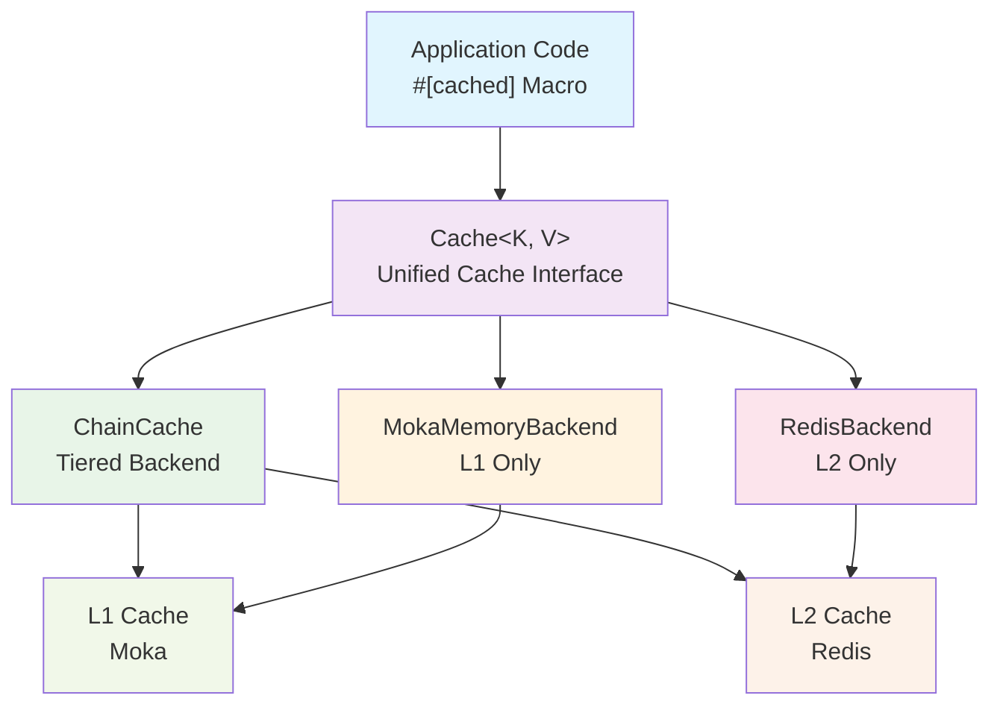
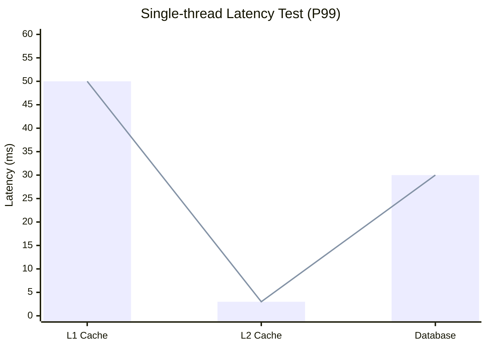
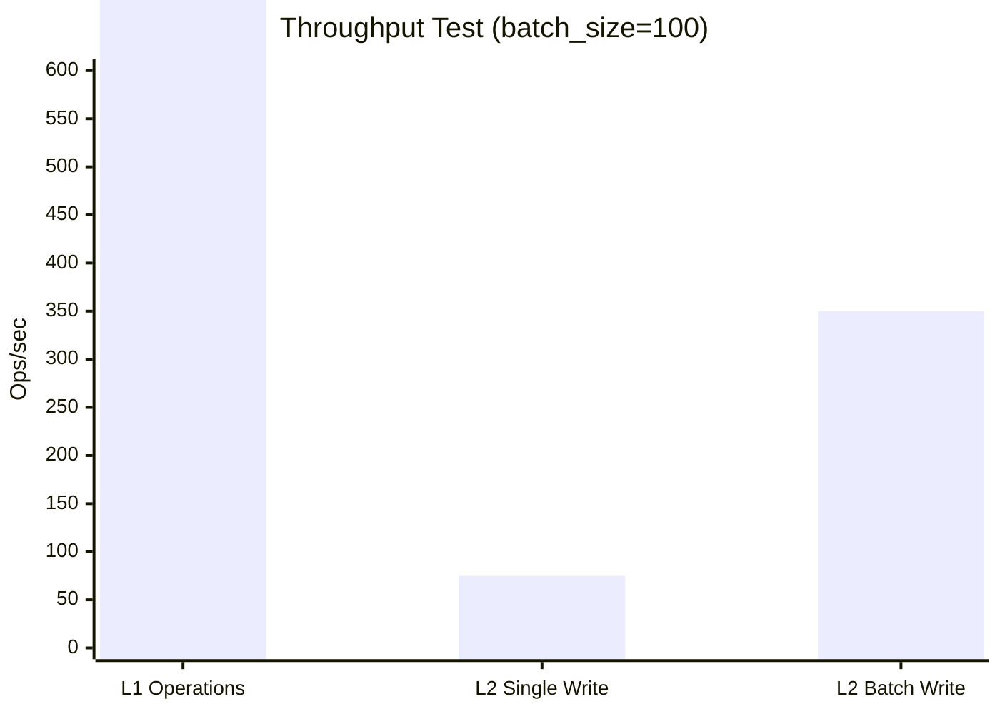

<div align="center">


[](https://github.com/Kirky-X/oxcache/actions/workflows/ci.yml) [](https://crates.io/crates/oxcache) [](https://docs.rs/oxcache) [](https://crates.io/crates/oxcache) [](https://codecov.io/gh/Kirky-X/oxcache) [](https://deps.rs/repo/github/Kirky-X/oxcache) [](https://github.com/Kirky-X/oxcache/blob/main/LICENSE) [](https://www.rust-lang.org)


[中文](./README.md) | English

Oxcache is a high-performance, production-grade two-level caching library for Rust, providing L1 (Moka in-memory
cache) + L2 (Redis distributed cache) architecture.

</div>

## ✨ Key Features

<div align="center">

<table>
<tr>
<td width="25%" align="center">
<br>
<b>Extreme Performance</b><br>L1 in nanoseconds
</td>
<td width="25%" align="center">
<br>
<b>Zero-Code Changes</b><br>One-line cache enable
</td>
<td width="25%" align="center">
<br>
<b>Auto Recovery</b><br>Redis fault degradation
</td>
<td width="25%" align="center">
<br>
<b>Batch Optimization</b><br>Smart batch writes
</td>
</tr>
</table>

</div>

- **🚀 Extreme Performance**: L1 nanosecond response (P99 < 100ns), L2 millisecond response (P99 < 5ms)
- **🎯 Zero-Code Changes**: Enable caching with a single `#[cached]` macro
- **🔄 Auto Recovery**: Automatic degradation on Redis failure
- **⚡ Batch Optimization**: Intelligent batch writes for significantly improved throughput
- **🧪 Sync API**: Synchronous `get_sync` / `set_sync` / `get_or_sync` API path alongside async, with no runtime required on `multi_thread` tokio
- **🌸 Bloom Filter**: Optional `BloomFilterBackend` decorator filters negative queries at O(1) cost, skipping inner backend entirely
- **⏱️ Universal per-entry TTL**: All backends (Moka / DashMap / Redis / Mock / Chain / Bloom) honor per-entry `set(key, value, Some(ttl))`
- **🛡️ Production Grade**: Complete observability, health checks, chaos testing verified

## 📦 Quick Start

### 1. Add Dependency

Add `oxcache` to your `Cargo.toml`:

```toml
[dependencies]
oxcache = "0.3"
```

> **Note**: `tokio` and `serde` are already included by default. If you need minimal dependencies, you can use
> `oxcache = { version = "0.3", default-features = false }` and add them manually.

> **Features**: To use `#[cached]` macro, enable `macros` feature: `oxcache = { version = "0.3", features = ["macros"] }`

#### Feature Tiers

```toml
# Full features (recommended)
oxcache = { version = "0.3", features = ["full"] }

# Core functionality only
oxcache = { version = "0.3", features = ["core"] }

# Minimal - L1 cache only
oxcache = { version = "0.3", features = ["minimal"] }

# Custom selection
oxcache = { version = "0.3", features = ["core", "macros", "metrics", "bloom-filter"] }
```

| Tier        | Features                                                                        | Description            |
| ----------- | ------------------------------------------------------------------------------- | ---------------------- |
| **minimal** | `memory`, `tokio/time`, `tracing`, `metrics`, `serialization`, `chrono`         | L1 cache only          |
| **core**    | `minimal` + `redis`                                                             | L1 + L2 cache          |
| **full**    | `core` + `macros`, `compression`, `batch-write`, `lua-script`, `cli`, `testing` | Complete functionality |

**Individual Features**:

- `memory` - L1 cache backends (Moka + DashMap)
- `redis` - L2 distributed cache (Redis)
- `macros` - `#[cached]` attribute macro
- `serialization` - JSON serialization (serde + serde\_json)
- `compression` - Data compression (flate2)
- `metrics` - Built-in performance metrics (latency histograms, operation counts, JSON export); OTLP export handled at application level
- `batch-write` - Optimized batch writing
- `lua-script` - Lua script execution support
- `cli` - Command-line interface (clap)
- `tracing` - Structured logging support
- `bloom-filter` - Negative query filtering (BloomFilter + BloomFilterBackend); not in `full`, must be enabled explicitly
- `kit` - trait-kit AsyncKit integration (OxcacheModule); not in `full`, must be enabled explicitly
- `i18n` - ICU4X-backed internationalization (always enabled, included in `minimal`)
- `testing` - Testing utilities

### 2. Basic Usage

```rust
use oxcache::macros::cached;
use oxcache::{Cache, CacheBuilder};
use serde::{Deserialize, Serialize};

#[derive(Serialize, Deserialize, Clone, Debug)]
struct User {
    id: u64,
    name: String,
}

// One-line cache enable
#[cached(service = "user_cache", ttl = 600)]
async fn get_user(id: u64) -> Result<User, String> {
    // Simulate slow database query
    tokio::time::sleep(std::time::Duration::from_millis(100)).await;
    Ok(User {
        id,
        name: format!("User {}", id),
    })
}

#[tokio::main]
async fn main() -> Result<(), Box<dyn std::error::Error>> {
    // Initialize cache using Builder pattern (default: Moka L1 memory backend)
    let cache: Cache<String, User> = Cache::builder()
        .capacity(10000)
        .ttl(std::time::Duration::from_secs(600))
        .build()
        .await?;

    // Register cache instance for macro usage
    cache.register_for_macro("user_cache").await;

    // First call: execute function logic + cache result (~100ms)
    let user = get_user(1).await?;
    println!("First call: {:?}", user);

    // Second call: return directly from cache (~0.1ms)
    let cached_user = get_user(1).await?;
    println!("Cached call: {:?}", cached_user);

    Ok(())
}
```

### Builder API

Oxcache provides a type-safe builder API for configuring caches. Available builder methods:

| Method                                | Description                                                         |
| ------------------------------------- | ------------------------------------------------------------------- |
| `Cache::builder()`                    | Create a new cache builder                                          |
| `.ttl(Duration)`                      | Set default TTL for cache entries                                   |
| `.tti(Duration)`                      | Set default TTI (time-to-idle) for cache entries                    |
| `.capacity(u64)`                      | Set memory cache capacity                                           |
| `.backend_arc(Arc<dyn CacheBackend>)` | Add a pre-built backend (e.g., `RedisBackend`, `MokaMemoryBackend`) |
| `.sync_mode(bool)`                    | Enable sync API support (`get_sync`/`set_sync`/...)                 |
| `.build()`                            | Build `Cache<K, V>` instance (async, no internal awaits)           |
| `.build_sync()`                       | Build `Cache<K, V>` instance synchronously (no runtime required)  |

> **Note:** For Redis backend, use `RedisBackend::new(url).await?` then pass via `.backend_arc(Arc::new(backend))`.
> For tiered (L1+L2) cache, use `ChainCache::builder().link(...).build()`.

### 3. Usage

#### Using Macros (Recommended)

```rust
use oxcache::macros::cached;
use oxcache::{Cache, CacheBuilder};
use serde::{Deserialize, Serialize};

#[derive(Serialize, Deserialize, Clone, Debug)]
struct User {
    id: u64,
    name: String,
}

// One-line cache enable
#[cached(service = "user_cache", ttl = 600)]
async fn get_user(id: u64) -> Result<User, String> {
    // Simulate slow database query
    tokio::time::sleep(std::time::Duration::from_millis(100)).await;
    Ok(User {
        id,
        name: format!("User {}", id),
    })
}

#[tokio::main]
async fn main() -> Result<(), Box<dyn std::error::Error>> {
    // Initialize cache using Builder pattern (default: Moka L1 memory backend)
    let cache: Cache<String, User> = Cache::builder()
        .capacity(10000)
        .ttl(std::time::Duration::from_secs(600))
        .build()
        .await?;

    // Register cache for macro usage
    cache.register_for_macro("user_cache").await;

    // First call: execute function logic + cache result (~100ms)
    let user = get_user(1).await?;
    println!("First call: {:?}", user);

    // Second call: return directly from cache (~0.1ms)
    let cached_user = get_user(1).await?;
    println!("Cached call: {:?}", cached_user);

    Ok(())
}
```

#### Manual Client Usage

```rust
use oxcache::{Cache, CacheBuilder};
use serde::{Deserialize, Serialize};

#[derive(Serialize, Deserialize)]
struct MyData {
    field: String,
}

async fn manual_caching() -> Result<(), Box<dyn std::error::Error>> {
    // Initialize cache using Builder pattern (default: Moka L1 memory backend)
    let cache: Cache<String, MyData> = Cache::builder()
        .capacity(10000)
        .build()
        .await?;

    let my_data = MyData {
        field: "value".to_string(),
    };

    // Standard operation: write to cache
    cache.set(&"key".to_string(), &my_data).await?;

    let data: Option<MyData> = cache.get(&"key".to_string()).await?;
    println!("Data: {:?}", data);

    // Delete
    cache.delete(&"key".to_string()).await?;

    Ok(())
}
```

## 🎨 Use Cases

### Scenario 1: User Information Cache

```rust
#[cached(service = "user_cache", ttl = 600)]
async fn get_user_profile(user_id: u64) -> Result<UserProfile, Error> {
    database::query_user(user_id).await
}
```

### Scenario 2: API Response Cache

```rust
#[cached(
    service = "api_cache",
    ttl = 300,
    key = "api_{endpoint}_{version}"
)]
async fn fetch_api_data(endpoint: String, version: u32) -> Result<ApiResponse, Error> {
    http_client::get(&format!("/api/{}/{}", endpoint, version)).await
}
```

### Scenario 3: L1-Only Hot Data Cache

```rust
#[cached(service = "session_cache", ttl = 60)]
async fn get_user_session(session_id: String) -> Result<Session, Error> {
    session_store::load(session_id).await
}
```

### Scenario 4: Manual Cache Control

```rust
use oxcache::{Cache, CacheBuilder};
use serde::{Deserialize, Serialize};

#[derive(Serialize, Deserialize)]
struct MyData {
    field: String,
}

async fn advanced_caching() -> Result<(), Box<dyn std::error::Error>> {
    // Initialize cache using Builder pattern (default: Moka L1 memory backend)
    let cache: Cache<String, MyData> = Cache::builder()
        .capacity(10000)
        .build()
        .await?;

    let my_data = MyData {
        field: "value".to_string(),
    };

    // Standard operations
    cache.set(&"key".to_string(), &my_data).await?;

    let data: Option<MyData> = cache.get(&"key".to_string()).await?;
    println!("Data: {:?}", data);

    // Delete
    cache.delete(&"key".to_string()).await?;

    Ok(())
}
```

## 🧪 Sync API (0.3.0)

Oxcache 0.3.0 introduces a **synchronous API path** alongside the async API. Enable it on the builder:

```rust
use oxcache::Cache;
use serde::{Deserialize, Serialize};

#[derive(Serialize, Deserialize, Clone, Debug, PartialEq)]
struct User { id: u64, name: String }

#[tokio::main(flavor = "multi_thread")]
async fn main() -> Result<(), Box<dyn std::error::Error>> {
    // sync_mode(true) makes the Cache<K,V> also hold an Arc<dyn SyncCacheBackend>
    let cache: Cache<String, User> = Cache::builder().sync_mode(true).build().await?;

    // Synchronous operations (no .await)
    cache.set_sync(&"user:1".to_string(), &User { id: 1, name: "Alice".into() })?;
    let cached = cache.get_sync(&"user:1".to_string())?;
    assert_eq!(cached, Some(User { id: 1, name: "Alice".into() }));

    // Per-entry TTL
    cache.set_with_ttl_sync(&"temp".to_string(), &User { id: 2, name: "Temp".into() }, Some(std::time::Duration::from_secs(60)))?;

    // Single-flight get_or_sync: concurrent callers share one fallback execution
    let value = cache.get_or_sync(&"user:42".to_string(), || {
        Ok(User { id: 42, name: "Bob".into() })
    })?;

    // Sync and async APIs coexist on the same Cache<K,V>
    cache.set(&"async_key".to_string(), &User { id: 99, name: "Async".into() }).await?;
    let v = cache.get_sync(&"async_key".to_string())?;
    Ok(())
}
```

**When to use sync API**:

- Blocking call sites (legacy code, FFI, sync handlers)
- Tests that don't want to thread `async` through every assertion
- Avoiding runtime overhead when the caller is already synchronous

**Runtime notes**:

- `sync_mode(true)` works on `multi_thread` tokio runtime. On `current_thread` runtime, Moka's `sync_block_on` will panic (use `#[tokio::main(flavor = "multi_thread")]` or call from outside a runtime).
- Without `sync_mode(true)`, calling any `*_sync` method returns `Err(OxCacheError::NotSupported)`.

**`#[cached(sync)]`** **macro**:

```rust
use oxcache::macros::cached;

#[cached(service = "user_cache", ttl = 600, sync)]
fn get_user_sync(id: u64) -> Result<User, String> {
    // Synchronous body — no async runtime required
    Ok(User { id, name: format!("User {}", id) })
}
```

## 🌸 Bloom Filter

The `bloom-filter` feature (must be enabled explicitly; not in `full`) provides negative-query filtering:

```toml
[dependencies]
oxcache = { version = "0.3", features = ["memory", "bloom-filter"] }
```

```rust
use oxcache::backend::interface::{CacheReader, CacheWriter};
use oxcache::backend::MokaMemoryBackend;
use oxcache::features::bloom_filter::{BloomFilter, BloomFilterBackend};

#[tokio::main]
async fn main() -> Result<(), Box<dyn std::error::Error>> {
    // 1. Standalone BloomFilter type
    let bf = BloomFilter::new(10_000, 0.01);  // capacity, false-positive rate
    bf.insert("existing_key");
    assert!(bf.contains("existing_key"));    // no false negatives
    assert!(!bf.contains("missing_key"));    // may have false positives

    // 2. BloomFilterBackend decorator: wraps any CacheBackend
    let inner = MokaMemoryBackend::new();
    let backend = BloomFilterBackend::builder()
        .capacity(10_000)
        .false_positive_rate(0.01)
        .inner(inner)
        .build()?;

    // On `get`: BF says "absent" → skip inner entirely. BF says "maybe present" → query inner.
    backend.set("user:1", b"Alice".to_vec(), None).await?;
    let value = backend.get("user:1").await?;       // Some(b"Alice")
    let miss  = backend.get("user:999").await?;     // None — BF filtered, inner untouched

    Ok(())
}
```

**Properties**:

- No false negatives (inserted keys always `contains == true`)
- `set` updates both BF and inner; `delete` only updates inner (BF doesn't support removal)
- `clear` clears both; TTL passes through unchanged
- Also implements `SyncCacheBackend` when inner backend does

## ⏱️ TTL Behavior Reference

All backends honor per-entry TTL since 0.3.0. Behavior summary:

| Backend                  | `set(ttl=Some)`                                          | `ttl(key)`                                            | `expire(key, new_ttl)`      | Notes                                                          |
| ------------------------ | -------------------------------------------------------- | ----------------------------------------------------- | --------------------------- | -------------------------------------------------------------- |
| **MokaMemoryBackend**    | Real per-entry TTL via `moka::Expiry`                    | Remaining TTL                                         | Updates + returns `true`    | Global TTL (`builder.ttl(...)`) is overridden by per-entry TTL |
| **DashMapMemoryBackend** | Stores `(value, expiry Instant)`; lazy expiry on read    | Remaining TTL (None if no TTL)                        | Updates + returns `true`    | Lazy expiry — entries removed on next access; FIFO O(1) eviction of oldest entries when over capacity |
| **RedisBackend**         | `SET key value EX ttl`                                   | `TTL key` (Redis native)                              | `EXPIRE key ttl`            | Uses Redis native TTL                                          |
| **MockBackend**          | Stores `(value, expiry Instant)`; lazy expiry            | Remaining TTL                                         | Updates + returns `true`    | Test-only; aligns with DashMap semantics                       |
| **ChainCache**           | Passes `ttl` through to all links                        | Returns TTL from highest-scored link that has the key | Passes through to all links | All links receive the same TTL                                 |
| **BloomFilterBackend**   | Passes `ttl` through to inner (also inserts key into BF) | Delegates to inner                                    | Delegates to inner          | BF itself has no TTL concept                                   |

**Global vs per-entry TTL**:

- `MokaMemoryBackend::builder().ttl(Duration)` sets a global TTL applied to every entry
- `set(key, value, Some(ttl))` overrides the global TTL for that specific entry
- `set(key, value, None)` uses the global TTL (if set); otherwise the entry never expires

## 🏗️ Architecture



**L1**: In-process high-speed cache using LRU/TinyLFU eviction strategy
**L2**: Distributed shared cache supporting Sentinel/Cluster modes

## 📊 Performance Benchmarks

> Test environment: M1 Pro, 16GB RAM, macOS, Redis 7.0
>
> **Note**: Performance varies based on hardware, network conditions, and data size.





**Performance Summary**:

- **L1 Cache**: 50-100ns (in-memory)
- **L2 Cache**: 1-5ms (Redis, localhost)
- **Database**: 10-50ms (typical SQL query)
- **L1 Operations**: 5-10M ops/sec
- **L2 Single Write**: 50-100K ops/sec
- **L2 Batch Write**: 200-500K ops/sec

## 🛡️ Reliability

- ✅ Single-Flight (prevent cache stampede)
- ✅ Automatic degradation on Redis failure
- ✅ Graceful shutdown mechanism
- ✅ Health checks and auto-recovery

## 🔐 Security

Oxcache implements multiple security measures to protect against common attacks:

### Input Validation

All user inputs are validated before being passed to Redis:

- **Key Validation**: Keys cannot be empty, exceed 512KB, or contain dangerous characters (`\r`, `\n`, `\0`) that could enable Redis protocol injection attacks.
- **Lua Script Validation**: Scripts are validated for:
  - Maximum length of 10KB
  - Maximum of 100 keys
  - Blocking dangerous commands: `FLUSHALL`, `FLUSHDB`, `KEYS`, `SHUTDOWN`, `DEBUG`, `CONFIG`, `SAVE`, `BGSAVE`, `MONITOR`
  - Comment and string content preprocessing to prevent bypass via comments
- **SCAN Pattern Validation**: Patterns are validated to prevent ReDoS attacks:
  - Maximum length of 256 characters
  - Maximum of 10 wildcard (`*`) characters
  - Count parameter clamped to safe range (1-1000)
- **SQL/Path Traversal Detection**: Redis keys are scanned for potential SQL injection and path traversal patterns

### Security API (Public Functions)

For advanced use cases, you can directly use the security validation functions:

```rust
use oxcache::{validate_redis_key, validate_lua_script, validate_scan_pattern};

// Validate Redis keys
validate_redis_key("user:123").expect("Invalid key");

// Validate Lua scripts
validate_lua_script("return redis.call('GET', KEYS[1])", 1).expect("Invalid script");

// Validate SCAN patterns
validate_scan_pattern("user:*").expect("Invalid pattern");
```

### Timeout Protection

Long-running operations have timeout protection:

- **Lua Scripts**: 30-second timeout prevents Redis blocking
- **SCAN Operations**: 30-second timeout prevents hanging scans

### Secure Lock Values

Distributed locks use cryptographically secure UUID v4 values automatically generated by the library, eliminating the risk of lock value prediction attacks.

### Connection String Redaction

Passwords in connection strings are redacted in logs by default to prevent credential leakage. Use `redact_connection_string()` for secure logging.

### Best Practices

1. **Use the library's key validation** - Don't bypass the `validate_redis_key()` function
2. **Avoid custom Lua scripts** - Use the built-in cache operations when possible
3. **Set appropriate timeouts** - Don't disable the 30-second default timeout
4. **Rotate lock values** - The library handles this automatically
5. **Never log connection strings** - Use the redaction utility for debugging

For more details, see [Security Documentation](docs/SECURITY.md).

## 📚 Documentation

- [📖 User Guide](docs/USER_GUIDE.md)
- [📘 API Documentation](https://docs.rs/oxcache)
- [💻 Examples](examples/)

> **Note**: `oxcache-examples` is set as `publish = false` and managed within the workspace.

## 🤝 Contributing

Pull Requests and Issues are welcome! See [Contributing Guide](CONTRIBUTING.md) for details.

## 📝 Changelog

See [CHANGELOG.md](CHANGELOG.md)

## 📄 License

This project is licensed under MIT License. See [LICENSE](LICENSE) file.

***

<div align="center">

**If this project helps you, please give a ⭐ Star to show support!**

Made with ❤️ by Kirky.X

</div>
