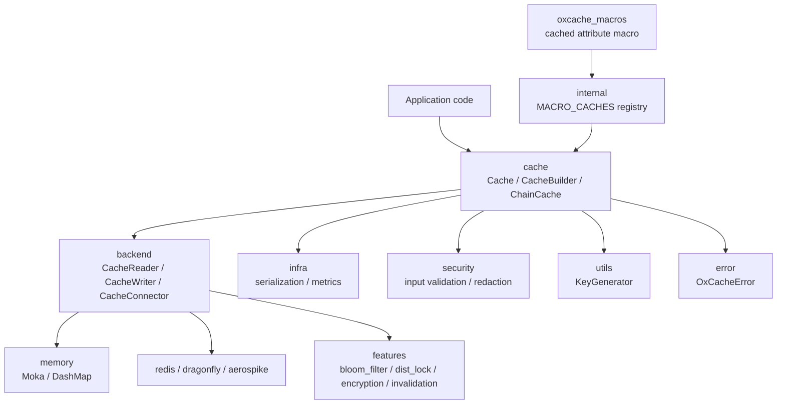
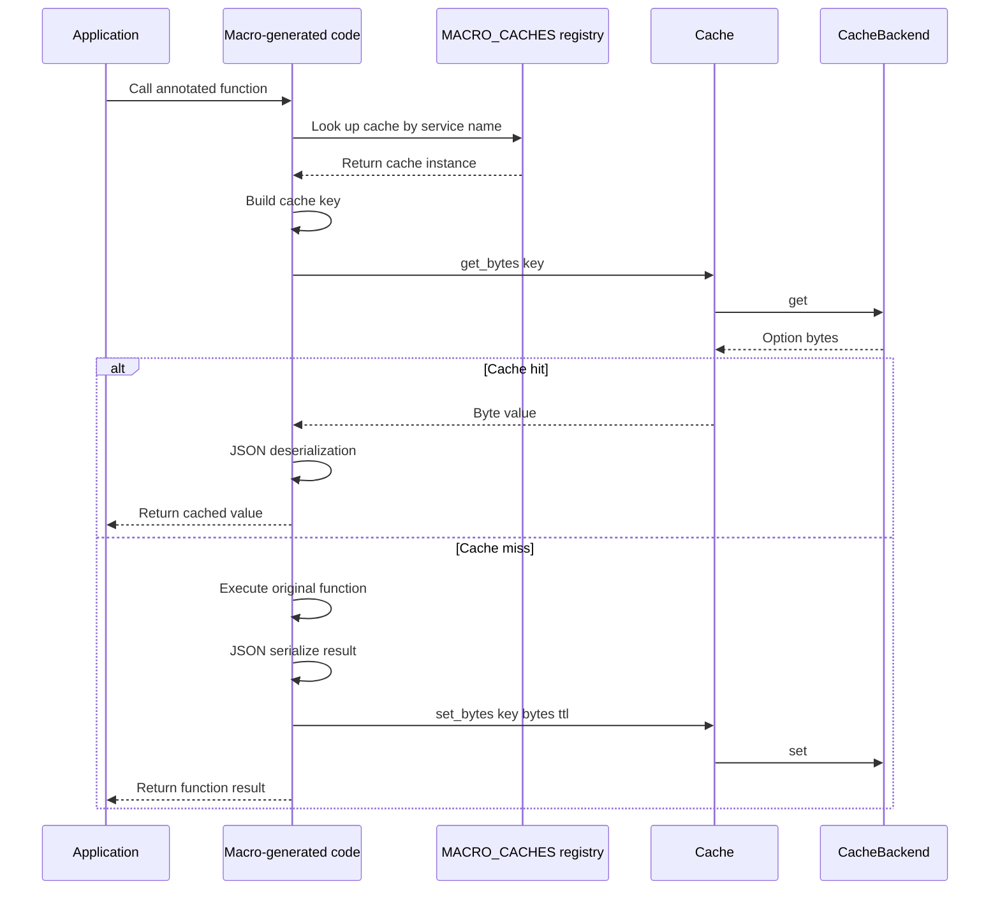
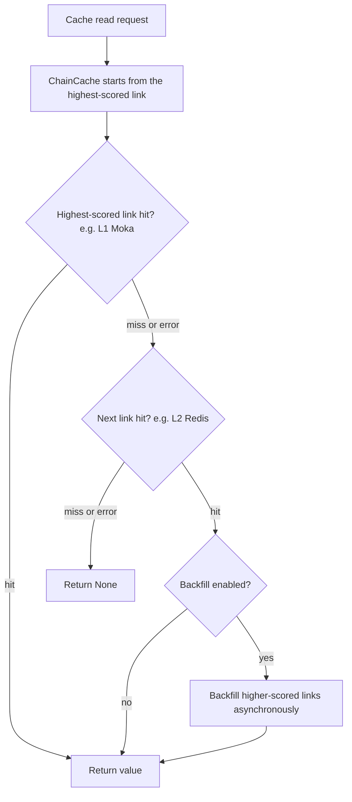
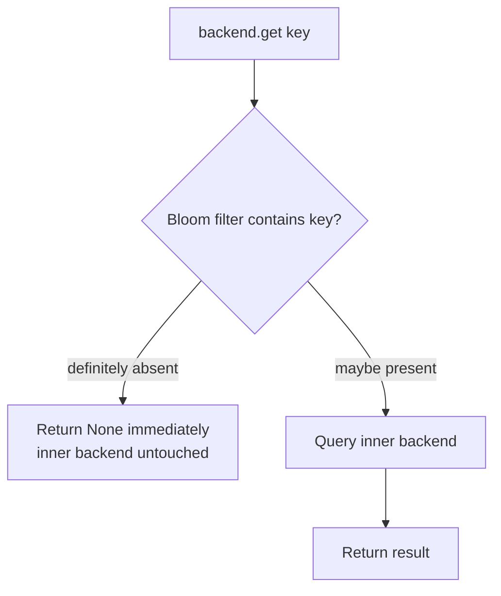

<div align="center">


[](https://github.com/Kirky-X/oxcache/actions/workflows/ci.yml) [](https://crates.io/crates/oxcache) [](https://docs.rs/oxcache) [](https://crates.io/crates/oxcache) [](LICENSE) [](https://www.rust-lang.org/) [](https://codecov.io/gh/Kirky-X/oxcache)

**[中文](README.md)** | English

**Multi-tier caching for Rust: L1 in-memory + L2 distributed**

[✨ Features](#-features) • [🚀 Quick Start](#-quick-start) • [📚 Documentation](#-documentation) • [💻 Examples](#-examples) • [🤝 Contributing](#-contributing)

</div>

<div align="center">

<table>
  <tr>
    <td width="50%" align="center"><b>🚀 Extreme Performance</b><br/>Nanosecond L1 reads and writes, borrowed-key hot-path APIs eliminate redundant allocations</td>
    <td width="50%" align="center"><b>🧩 Multi-Tier Backends</b><br/>L1 (Moka / DashMap) + L2 (Redis / Valkey / Dragonfly / Aerospike), freely chained via ChainCache</td>
  </tr>
  <tr>
    <td align="center"><b>⚡ Zero-Boilerplate Integration</b><br/>One-line #[cached] macro, type-safe CacheBuilder</td>
    <td align="center"><b>🛡️ Production Ready</b><br/>Input validation and redaction, optional auto-degradation, chaos testing, CI quality gates</td>
  </tr>
</table>

</div>

---

## 📋 Table of Contents

<details open>
<summary>📑 Table of Contents</summary>

- [✨ Features](#-features)
- [🚀 Quick Start](#-quick-start)
  - [📦 Installation](#-installation)
  - [💡 Minimal Runnable Example](#-minimal-runnable-example)
  - [🧭 Core Concepts](#-core-concepts)
- [🎨 Feature Flags](#-feature-flags)
- [📚 Documentation](#-documentation)
- [💻 Examples](#-examples)
- [🏗️ Architecture](#️-architecture)
- [🔄 Sync API](#-sync-api)
- [🌸 Bloom Filter & Penetration Guard](#-bloom-filter--penetration-guard)
- [⏱️ TTL Behavior Reference](#️-ttl-behavior-reference)
- [🧪 Testing](#-testing)
- [📊 Performance](#-performance)
- [🔒 Security](#-security)
- [🗺️ Roadmap](#️-roadmap)
- [🤝 Contributing](#-contributing)
- [📋 Changelog](#-changelog)
- [📄 License](#-license)
- [🙏 Acknowledgments](#-acknowledgments)
- [📞 Contact & Support](#-contact--support)
- [⭐ Star History](#-star-history)

</details>

---

## ✨ Features

| Feature | Description |
|---------|-------------|
| 🚀 **Multi-tier caching** | L1 (Moka / DashMap) and L2 (Redis / Valkey / Dragonfly / Aerospike) chained by score via `ChainCache`, with async backfill on non-top hits |
| ⚡ **Zero-boilerplate macro** | One-line `#[cached]` integration supporting `service` / `ttl` / `key` / `key_prefix` / `sync` / `single_flight` / `strict` / `condition` |
| 🔄 **Sync API** | With `sync_mode(true)`, `get_sync` / `set_sync` / `get_or_sync` coexist with the async API on the same `Cache<K, V>` |
| ⏱️ **Universal per-entry TTL** | `ttl` / `expire` behave consistently across all nine backend kinds: Moka / DashMap / Redis / Valkey / Dragonfly / Aerospike / Mock / Chain / Bloom |
| 🌸 **Penetration guard** | Single-flight dedup (64 shards), null sentinel, TTL jitter, bloom-filter negative-query short-circuit |
| 🔐 **Built-in security** | Key / Lua / SCAN input validation, connection-string redaction, value-level encryption and integrity decorators |
| 📈 **Observability** | Latency histograms and operation counters, Prometheus / JSON export, `telemetry` tracing events, audit event stream |
| 🧬 **Pluggable serialization** | JSON by default, opt-in `serde-bincode` / `postcard` binary formats, depth limiting against nested-JSON DoS |
| 🗜️ **Adaptive compression** | `CompressingBackend` applies zstd above a size threshold; reads auto-detect by magic bytes and stay compatible with legacy gzip |
| 🔑 **Distributed coordination** | Redis distributed lock (watchdog renewal / reentrant), RedLock multi-node majority lock, cross-instance invalidation bus |
| 🧯 **Fault resilience** | ChainCache per-link fault tolerance, `degradation` three-state auto-degradation and recovery, health checks, graceful shutdown |
| 🧪 **Engineering quality** | 1900+ test functions (as of 0.5.0-rc.4), chaos and security tests, three-platform CI matrix, coverage gate |

<details>
<summary>🔎 Advanced capabilities at a glance</summary>

- **Distributed lock** (`lock`): Redis TTL lock, watchdog auto-renewal, reentrant acquire
- **RedLock** (`red-lock`): multi-node majority lock, monotonic `INCR` fencing tokens
- **Cross-instance invalidation** (`invalidation`): Redis Pub/Sub invalidation broadcast plus a keyspace-notification channel
- **Value-level encryption** (`encrypt`): XChaCha20-Poly1305 envelope with the cache key bound as AAD
- **Value integrity** (`integrity`): HMAC-SHA256 tag; verification failure counts as a miss
- **Versioned CAS** (`versioning`): `compare_and_swap` with in-memory and Redis WATCH/MULTI/EXEC implementations
- **Config-driven build** (`config-confers`): capacity / TTL / circuit params loaded via confers with `ConfigBus` watch hot-reload
- **Auto-degradation** (`degradation`): Active / Degraded / HalfOpen state machine with automatic recovery on successful probes
- **Audit event stream** (`audit`): structured hit / miss / set / delete / evict / expired events with key redaction
- **Advanced macro args**: `single_flight` concurrent-miss dedup, `strict` panic on unregistered cache, `condition` predicate bypass
- **Tiered builders**: `L1Builder` / `L2Builder` / `ChainBuilder` fluent composition
- **Lifecycle integration** (`kit`): trait-kit AsyncKit `OxcacheModule`, health checks, three-phase shutdown, backend decorators
- **Error i18n**: ICU4X-based error-message internationalization with system-language detection
- **Penetration guard config**: `null_cache_ttl` null-sentinel TTL, `ttl_jitter` TTL jitter factor

</details>

---

## 🚀 Quick Start

### 📦 Installation

```bash
cargo add oxcache            # default minimal: L1 in-memory cache
cargo add oxcache --features full   # full: L1 + L2 + macro + compression + batch + Lua + lock
```

Or add manually to `Cargo.toml`:

```toml
[dependencies]
oxcache = "0.5.0-rc.4"
tokio = { version = "1", features = ["rt-multi-thread", "macros"] }
serde = { version = "1", features = ["derive"] }
```

**Requirements**: Rust 1.97.1+ (edition 2024). The default `minimal` feature enables the L1 in-memory cache only; using L2 (Redis / Valkey / Dragonfly / Aerospike) requires a reachable server, and Redis-related tests depend on Docker (containers are started automatically via testcontainers).

### 💡 Minimal Runnable Example

The following example is adapted from [`examples/src/01_basics/example_basic_operations.rs`](examples/src/01_basics/example_basic_operations.rs):

```rust
use oxcache::Cache;
use serde::{Deserialize, Serialize};

#[derive(Debug, Clone, Serialize, Deserialize)]
struct User {
    id: u64,
    name: String,
}

#[tokio::main]
async fn main() -> Result<(), Box<dyn std::error::Error>> {
    // Default Moka L1 memory backend
    let cache: Cache<String, User> = Cache::builder().build().await?;

    // Write
    cache
        .set(&"user:1".to_string(), &User { id: 1, name: "Alice".into() })
        .await?;

    // Read
    if let Some(user) = cache.get(&"user:1".to_string()).await? {
        println!("hit: {}", user.name);
    }

    // Delete
    cache.delete(&"user:1".to_string()).await?;
    assert!(cache.get(&"user:1".to_string()).await?.is_none());
    Ok(())
}
```

Function-level caching takes one macro line (full version in [`examples/src/01_basics/example_cached_macro.rs`](examples/src/01_basics/example_cached_macro.rs)):

```rust
use oxcache::macros::cached;

#[cached(service = "user_cache", ttl = 600)]
async fn get_user(id: u64) -> Result<User, String> {
    Ok(User { id, name: format!("User {id}") })   // result is cached after first execution
}
```

### 🧭 Core Concepts

- **`Cache<K, V>`**: the single type-safe entry point; `Cache::builder()` configures `capacity` / `ttl` / `tti` / `sync_mode`
- **Pluggable backends**: `MokaMemoryBackend` / `DashMapMemoryBackend` / `RedisBackend` / `DragonflyBackend` / `AerospikeBackend` injected via `.backend_arc(Arc::new(backend))`
- **`ChainCache`**: multiple backends chained by score; reads fall through from high to low score, non-top hits backfill upward asynchronously
- **`#[cached]` macro**: function-level caching; register with `cache.register_for_macro("service")` and the macro-generated code looks it up
- **Sync API**: `.sync_mode(true)` enables the `get_sync` / `set_sync` / `get_or_sync` synchronous path

---

## 🎨 Feature Flags

Tier presets (`default = ["minimal"]`, L1 only):

```toml
oxcache = { version = "0.5.0-rc.4", features = ["minimal"] }   # L1 only (default)
oxcache = { version = "0.5.0-rc.4", features = ["core"] }      # L1 + L2 Redis
oxcache = { version = "0.5.0-rc.4", features = ["full"] }      # full (excludes opt-in features such as bloom / kit)
```

| Flag | Description | Default |
|------|-------------|:-------:|
| `minimal` | Preset: `memory` + `metrics` + `serialization` + `chrono`, L1 only | ✅ |
| `core` | Preset: `minimal` + `redis`, L1 + L2 | ❌ |
| `full` | Preset: `core` + `macros` / `compression` / `batch` / `lua` / `testing` / `dragonfly` / `aerospike` / `lock` | ❌ |
| `memory` | L1 in-memory backends (Moka + DashMap) | ❌ |
| `redis` | L2 distributed cache (Redis / Valkey, Standalone / Sentinel / Cluster) | ❌ |
| `dragonfly` | Dragonfly backend (Redis protocol compatible) | ❌ |
| `aerospike` | Aerospike backend (independent protocol) | ❌ |
| `macros` | `#[cached]` attribute macro (`oxcache_macros` crate) | ❌ |
| `serialization` | JSON serialization (serde + serde_json + serde_stacker depth guard) | ❌ |
| `metrics` | Built-in metrics: latency histograms, operation counters, JSON / Prometheus export | ❌ |
| `batch` | `BatchWriter` buffered batch writes (capacity / time dual-threshold flush) | ❌ |
| `lua` | Lua script execution (requires `redis`) | ❌ |
| `testing` | Testing utilities (exposes internal functions) | ❌ |
| `bloom` | Bloom-filter negative-query filtering (`BloomFilter` + `BloomFilterBackend`) | ❌ |
| `lock` | Distributed lock: TTL, watchdog auto-renewal, reentrant (requires `redis`) | ❌ |
| `red-lock` | RedLock multi-node majority lock + fencing tokens (requires `lock`) | ❌ |
| `compression` | Adaptive compression: threshold-triggered zstd, legacy-gzip compatible reads | ❌ |
| `telemetry` | `tracing` facade: circuit / backfill / macro-passthrough events, zero overhead when off | ❌ |
| `invalidation` | Cross-instance invalidation bus: Redis Pub/Sub broadcast + keyspace-notification channel | ❌ |
| `encrypt` | Value-level encryption decorator (XChaCha20-Poly1305, key bound as AAD) | ❌ |
| `integrity` | Value integrity decorator (HMAC-SHA256, verification failure counts as a miss) | ❌ |
| `serde-bincode` | bincode 1.x binary serialization format | ❌ |
| `postcard` | postcard binary serialization format | ❌ |
| `config-confers` | Config-driven build via confers + `ConfigBus` watch hot-reload | ❌ |
| `degradation` | Auto-degradation and recovery (Active / Degraded / HalfOpen state machine) | ❌ |
| `audit` | Structured audit event stream (NoOp / bounded in-memory ring / tracing publishers) | ❌ |
| `versioning` | Versioned CAS (in-memory + Redis WATCH/MULTI/EXEC implementations) | ❌ |
| `kit` | trait-kit AsyncKit integration (`OxcacheModule` / health check / lifecycle / shutdown / decorators) | ❌ |

> Opt-in features such as `bloom` and `kit` are **not** part of `full` and must be enabled explicitly.

---

## 📚 Documentation

| Document | Description |
|----------|-------------|
| [📖 User Guide](docs/USER_GUIDE.md) | Complete tutorial from installation to advanced usage |
| [📘 API Reference](docs/API_REFERENCE.md) | Detailed description of all public APIs and the error-code table |
| [🏗️ Architecture](docs/ARCHITECTURE.md) | Design philosophy, module responsibilities, data flow and failure handling |
| [📊 Performance Baseline](docs/PERFORMANCE.md) | Serialization sizes, compression ratios, hot-path benchmarks and reproduction commands |
| [🔒 Security](docs/SECURITY.md) | Security design, threat model and best practices |
| [🧪 Test Scenario Matrix](docs/TEST_SCENARIOS.md) | Mapping from feature domains to test targets, with execution policy |
| [🤝 Contributing Guide](docs/CONTRIBUTING.md) | Development environment, TDD workflow and PR process |
| [📋 Changelog](docs/CHANGELOG.md) | Change log for every release |
| [📦 Online API Docs](https://docs.rs/oxcache) | Latest auto-generated documentation on docs.rs |
| [📦 crates.io](https://crates.io/crates/oxcache) | Published crate page |

> **Note**: documentation under `docs/` is written in Chinese.

---

## 💻 Examples

The `examples/` directory (workspace member `oxcache-examples`, set as `publish = false`) contains **37 runnable examples**:

```bash
# Run a single example (from the examples/ directory)
cd examples && cargo run --example example_basic_operations

# List all available examples
cd examples && ls src/*/*.rs
```

**Basics (`examples/src/01_basics`)**

| Example | Description |
|---------|-------------|
| `example_basic_operations` | Basic CRUD operations (`get` / `set` / `delete` / `exists`) |
| `example_new_api` | Modern API introduction (`Cache::builder()` / `Cache::memory()`) |
| `example_cache_builder` | CacheBuilder configuration (`capacity` / `ttl` / `tti` / `sync_mode`) |
| `example_serialization` | JSON serialization |
| `example_cache_key` | Custom cache keys (`CacheKey` trait) |
| `example_cached_macro` | `#[cached]` macro (`service` / `ttl` / `key_prefix`) |
| `example_explicit_init` | Explicit initialization (`Cache::new()` / global cache) |
| `example_get_or` | Compute on cache miss (`get_or`, single-flight) |
| `example_sync_api` | Sync API (`get_sync` / `set_sync` / `clear_sync` / `len_sync`) |
| `example_byte_ops` | Byte-level operations (`get_bytes` / `set_bytes` / `len` / `capacity` / `shutdown`) |
| `example_comprehensive_usage` | Comprehensive usage (overview of all features) |

**Advanced (`examples/src/02_advanced`)**

| Example | Description |
|---------|-------------|
| `example_batch_write` | Batch operations (`set_many` / `get_many` / `delete_many`) |
| `example_chain_cache` | Chained cache (`ChainCache` / `ChainLink`) |
| `example_invalidation` | Cache invalidation strategies (TTL / TTI / manual invalidation) |
| `example_warmup` | Cache warm-up (batch preloading) |
| `example_smart_strategy` | Caching strategy patterns (Cache-Aside / Lazy Loading / tiered TTL) |
| `example_cache_promotion` | Cache promotion (L2→L1 promotion / hot-key analysis) |
| `example_error_handling` | Error handling (`OxCacheError` / retry / recoverability) |
| `example_custom_backend` | Custom backends (`CacheReader` / `CacheWriter` / `CacheConnector`) |
| `example_dashmap_backend` | DashMap backend (`DashMapMemoryBackend`) |
| `example_moka_ttl` | Moka per-entry TTL (`Expiry` trait) |
| `example_redis_native` | Native Redis operations (`RedisBackend`, requires Redis) |
| `example_redis_modes` | Redis deployment modes (Standalone / Cluster / Sentinel, requires Redis) |
| `example_redis_pipeline` | Pipeline batching (`set_many_pipeline` / `get_many_pipeline`, requires Redis) |
| `example_lua_script` | Lua script execution (`eval_lua` / `script_load` / `eval_sha`, requires Redis) |

**Configuration (`examples/src/03_config`)**

| Example | Description |
|---------|-------------|
| `example_dynamic_config` | Dynamic configuration (runtime config changes) |
| `example_key_generator` | Key generator (`KeyGenerator`) |

**Database Integration (`examples/src/05_database`)**

| Example | Description |
|---------|-------------|
| `example_database_integration` | Database integration (Cache-Aside pattern) |

**Feature Showcase (`examples/src/06_features`)**

| Example | Description |
|---------|-------------|
| `example_metrics` | Metrics export (`export_json_format` / `export_prometheus_format`) |
| `example_compression` | Data compression (`JsonSerializer::with_compression()`) |
| `example_security` | Data redaction (`redact_value` / `redact_connection_string`) |
| `example_security_validation` | Security validation (`validate_redis_key` / `validate_lua_script`) |
| `example_bloom_filter` | Bloom filter (`BloomFilter` / `BloomFilterBackend`) |
| `example_i18n` | Internationalization (`CacheI18nFormatter`) |
| `example_events` | Event system (`CacheEvent` / `CacheEventType`) |
| `example_cli_usage` | CLI scenarios (obtaining cache status and metrics from code) |
| `example_kit_integration` | trait-kit AsyncKit integration (`OxcacheModule` / health check / lifecycle / three-phase shutdown / decorators) |

> Examples marked "requires Redis" need a running Redis 6.0+ server; all other examples use in-memory backends and run standalone.

---

## 🏗️ Architecture

Oxcache follows a layered design of unified interface plus pluggable backends. Applications face a single type-safe entry point, `Cache<K, V>`, with serialization (`infra::serialization`) and metrics (`infra::metrics`) layered crosswise behind it. All reads and writes land on backends implementing the three traits `CacheReader` / `CacheWriter` / `CacheConnector`; a blanket impl automatically composes them into `CacheBackend`. L1 (Moka / DashMap in `backend::memory`) and L2 (`redis` / `dragonfly` / `aerospike`) can be used standalone, or chained by score via `ChainCache` with on-demand backfill; the `features` module layers capabilities such as bloom filters, distributed locks, encryption, integrity and the invalidation bus as decorators. The `#[cached]` macro is provided by the separate `oxcache_macros` crate and routes function calls into the same cache path through the `internal::MACRO_CACHES` registry.



`batch` (buffered writes), `integrations::kit` (lifecycle integration), `i18n`, `config`, `traits` and `testing` mount behind feature gates. See the [Architecture documentation](docs/ARCHITECTURE.md) for details.

### Macro Execution Path

After expansion, the `#[cached]` macro looks up the cache by service name, deserializes and returns on hit; on miss it executes the original function and serializes the `Ok` result back. Unregistered services silently pass through by default; `strict` mode panics instead.



### Chained Cache Read Path



A single failing link only logs a warning and the walk continues; reads fail only when every link fails. Writes fan out concurrently to all writer links, and a single link's write failure is tolerated. With `enable_race_read()` enabled, all links are queried concurrently and the first hit wins.

**Reliability highlights**:

- [x] Single-flight dedup (`get_or` / `get_or_sync`, 64 shards to reduce lock contention)
- [x] ChainCache link fault tolerance (single-link failure never blocks overall reads or writes)
- [x] Optional auto-degradation (`degradation` feature, half-open probes with automatic recovery)
- [x] Health checks (ChainCache pings all links concurrently, 5s timeout each)
- [x] Graceful shutdown (`shutdown`; `kit` feature maps it onto the three-phase shutdown coordinator)

---

## 🔄 Sync API

With `sync_mode(true)` on the builder, you get a full synchronous mirror alongside the async API (no `.await`):

```rust
use oxcache::Cache;
use serde::{Deserialize, Serialize};

#[derive(Serialize, Deserialize, Clone, Debug, PartialEq)]
struct User { id: u64, name: String }

#[tokio::main(flavor = "multi_thread")]
async fn main() -> Result<(), Box<dyn std::error::Error>> {
    let cache: Cache<String, User> = Cache::builder().sync_mode(true).build().await?;

    // Synchronous operations
    cache.set_sync(&"user:1".to_string(), &User { id: 1, name: "Alice".into() })?;
    let cached = cache.get_sync(&"user:1".to_string())?;
    assert_eq!(cached, Some(User { id: 1, name: "Alice".into() }));

    // Per-entry TTL
    cache.set_with_ttl_sync(
        &"temp".to_string(),
        &User { id: 2, name: "Temp".into() },
        Some(std::time::Duration::from_secs(60)),
    )?;

    // Single-flight get_or_sync: concurrent callers share one fallback execution
    let value = cache.get_or_sync(&"user:42".to_string(), || {
        Ok(User { id: 42, name: "Bob".into() })
    })?;

    // Sync and async APIs coexist on the same Cache
    cache.set(&"async_key".to_string(), &User { id: 99, name: "Async".into() }).await?;
    let v = cache.get_sync(&"async_key".to_string())?;
    Ok(())
}
```

**When to use it**: blocking call sites (legacy code, FFI, synchronous handlers); callers that are already synchronous, avoiding runtime overhead.

**Runtime notes**:

- `sync_mode(true)` requires a `multi_thread` tokio runtime; on a `current_thread` runtime, Moka's `sync_block_on` panics
- Without `sync_mode(true)`, any `*_sync` method returns `Err(OxCacheError::NotSupported)`
- `sync_mode(true)` cannot be combined with `backend_arc(...)`; setting both makes `build()` return `Err(OxCacheError::NotSupported)`

**`#[cached]` macro parameters**:

| Parameter | Type | Description |
|-----------|------|-------------|
| `service` | string | Cache service name (required) |
| `ttl` | integer | Default TTL in seconds |
| `key` | string | Custom key pattern (supports `{param}` interpolation) |
| `key_prefix` | string | Key prefix namespace |
| `sync` | flag | Generate a synchronous function (no async runtime needed) |
| `skip_cache_write` | flag | Skip cache writes for `Ok` results |
| `single_flight` | flag | Concurrent misses on the same key trigger only one fallback |
| `strict` | flag | Panic on unregistered cache instead of silently passing through |
| `condition` | function path | Pre-execution predicate; bypasses the cache when it returns false |

---

## 🌸 Bloom Filter & Penetration Guard

The `bloom` feature (opt-in; not in `full`) provides negative-query filtering. The `BloomFilterBackend` decorator wraps any backend: when the bloom filter says "definitely absent", it returns `None` immediately and the inner backend is never touched.



```rust
use oxcache::backend::MokaMemoryBackend;
use oxcache::features::bloom_filter::{BloomFilter, BloomFilterBackend};

#[tokio::main]
async fn main() -> Result<(), Box<dyn std::error::Error>> {
    // Standalone BloomFilter: capacity 10_000, 1% false-positive rate
    let bf = BloomFilter::new(10_000, 0.01);
    bf.insert("existing_key");
    assert!(bf.contains("existing_key"));   // no false negatives
    assert!(!bf.contains("missing_key"));   // false positives are possible

    // Decorator: wraps any CacheBackend
    let backend = BloomFilterBackend::builder()
        .capacity(10_000)
        .false_positive_rate(0.01)
        .inner(MokaMemoryBackend::new())
        .build()?;

    backend.set("user:1", b"Alice".to_vec(), None).await?;
    assert!(backend.get("user:1").await?.is_some());
    assert!(backend.get("user:999").await?.is_none());   // BF filtered, inner untouched
    Ok(())
}
```

**Semantics**: no false negatives; `set` updates both BF and inner, `delete` only updates inner (BF does not support removal), `clear` resets both, TTL passes through unchanged; when the inner backend implements `SyncCacheBackend`, so does the decorator.

**Penetration and stampede guard combinations**:

| Mechanism | Entry point | Purpose |
|-----------|-------------|---------|
| Single-flight | `get_or` / `get_or_sync` / macro `single_flight` | Concurrent misses on one key trigger a single fallback; followers wait for the result (async `Notify` / sync `Condvar`, 64 shards) |
| Null sentinel | `get_or_option` + `null_cache_ttl` | Caches a sentinel for `None` results so missing keys stop hitting storage repeatedly |
| TTL jitter | builder `ttl_jitter(factor)` | Actual TTL randomized within `base * (1 ± factor)` to prevent mass simultaneous expiry |
| Bloom filtering | `BloomFilterBackend` | O(1) short-circuit for negative queries, zero requests to the inner backend |

---

## ⏱️ TTL Behavior Reference

All backends honor per-entry `set(key, value, Some(ttl))` uniformly. Behavior summary:

| Backend | `set(ttl=Some)` | `ttl(key)` | `expire(key, new_ttl)` | Notes |
|---------|-----------------|------------|------------------------|-------|
| **MokaMemoryBackend** | Real per-entry TTL via `moka::Expiry` | Remaining TTL | Updates + returns `true` | Global TTL (`builder.ttl(...)`) is overridden by per-entry TTL |
| **DashMapMemoryBackend** | Stores `(value, expiry Instant)`; lazy expiry on read | Remaining TTL (None if no TTL) | Updates + returns `true` | Lazy expiry — entries removed on next access; FIFO O(1) eviction of oldest entries when over capacity |
| **RedisBackend** | `SET key value EX ttl` | `TTL key` (Redis native) | `EXPIRE key ttl` | Uses Redis native TTL |
| **Valkey** (via RedisBackend) | Same as Redis | Same as Redis | Same as Redis | Redis protocol compatible, uses the `ValkeyStandalone` mode |
| **DragonflyBackend** | Delegates to the inner RedisBackend | Delegates to the inner RedisBackend | Delegates to the inner RedisBackend | Redis protocol compatible, TTL behavior identical to Redis |
| **AerospikeBackend** | `write_policy_with_ttl` → `Expiration::Seconds` | `record.time_to_live()` | `touch` + new `Expiration` | Aerospike native TTL (second precision); sub-second TTLs round up |
| **MockBackend** | Stores `(value, expiry Instant)`; lazy expiry | Remaining TTL | Updates + returns `true` | Test-only; aligns with DashMap semantics |
| **ChainCache** | Passes `ttl` through to all links | Returns the TTL of the highest-scored link that owns the key | Passes through to all links | All links receive the same TTL |
| **BloomFilterBackend** | Passes `ttl` through to inner (also inserts the key into the BF) | Delegates to inner | Delegates to inner | The BF itself has no TTL concept |

**Global vs per-entry**: `builder.ttl(Duration)` sets a global TTL applied to every entry; `set(key, value, Some(ttl))` overrides it for that entry; `set(key, value, None)` uses the global TTL (or never expires if unset).

---

## 🧪 Testing

The test suite is organized as described in [`tests/README.md`](tests/README.md); the scenario matrix lives in [docs/TEST_SCENARIOS.md](docs/TEST_SCENARIOS.md).

| Layer | Entry point | Coverage | Test functions¹ |
|-------|-------------|----------|-----------------|
| Library unit tests | `--lib` | `#[cfg(test)]` tests inside `src/` | 1335 |
| Unit tests | `--test unit` | Backend interfaces, CacheBuilder, serialization, metrics, log redaction, etc. | 331 |
| Integration tests | `--test integration` | Batch writes, chained cache, degradation & recovery, TTL, Redis Cluster / Sentinel, distributed locks, etc. | 131 |
| End-to-end tests | `--test e2e` | Basic operations, `#[cached]` macro, real-world scenarios, advanced scenarios | 65 |
| Macro tests | `--test macros` | `sync` / `skip_cache_write` modes and trybuild compile-fail cases | 11 |
| Security tests | `--test security` | Security coverage and security validation | 20 |
| Chaos tests | `--test chaos` | Backend failure injection, network failures, random failures | 19 |
| Performance tests | `--test performance` | Memory leak detection, Miri memory safety, pipeline performance | 19 |
| Feature gating | `--test feature_test`; `--features "full,bloom" --test bloom_filter_integration` | Narrow feature combinations, bloom filter integration | 2 + 7 |

> ¹ `#[test]` / `#[tokio::test]` function counts via grep, as of **0.5.0-rc.4**; 1900+ in total (`src/` 1335 + `tests/` 606).

### Common Commands (same as CI)

```bash
# The CI test matrix runs at minimal / core / full
cargo test --features full --workspace

# Run by test binary
cargo test --features full --lib
cargo test --features full --test integration
cargo test --features full --test e2e

# Narrow feature-combination checks (CI feature-core / feature-minimal jobs)
cargo check -p oxcache --no-default-features --features core
cargo check -p oxcache --no-default-features --features minimal

# Skip tests that require Redis
cargo test --features full -- --skip redis

# Coverage (CI and pre-push gate: line coverage >= 80%)
cargo llvm-cov --features full --workspace --fail-under-lines 80
```

> Redis-related tests start a `redis:7-alpine` container automatically via testcontainers and require a local Docker environment. Integration / E2E tests forbid test doubles and use real in-process implementations plus chaos-style fault-injection stubs (policy in [docs/TEST_SCENARIOS.md](docs/TEST_SCENARIOS.md)).

---

## 📊 Performance

> Architecture benchmark environment: M1 Pro, 16GB RAM, macOS, Redis 7.0. Performance varies with hardware, network conditions and data size; treat these as order-of-magnitude estimates (source: [docs/ARCHITECTURE.md](docs/ARCHITECTURE.md)).

| Operation | Throughput | Latency (P99) |
|-----------|------------|---------------|
| L1 read | 5-10M ops/sec | 50-100ns |
| L1 write | 2-5M ops/sec | 50-200ns |
| L2 read | 50-100K ops/sec | 1-5ms |
| L2 write (batched) | 200-500K ops/sec | 1-10ms |

**Hot-path benchmarks** (source: [docs/PERFORMANCE.md](docs/PERFORMANCE.md); `benches/hot_path_benchmark.rs`, bench profile = release + lto=fat, Moka L1 hit path):

| Benchmark | Owned key (existing API) | Borrowed key (`get_by_str` / `set_by_str`) | Delta |
|-----------|--------------------------|--------------------------------------------|-------|
| get hit | 241.07 ns | 224.88 ns | **-6.7%** |
| set | 819.38 ns | 715.01 ns | **-12.7%** |

**L2 transfer size comparison** (source: [docs/PERFORMANCE.md](docs/PERFORMANCE.md); serialization format switched via the `serde-bincode` / `postcard` features):

| Payload | JSON | bincode 1.x | postcard 1.x |
|---------|------|-------------|--------------|
| Sample (mixed short strings) | 69 B | 74 B | 32 B |
| NumericHeavy (6×64-bit numbers) | 84 B | 48 B | — |

Criterion benchmark sources live in `benches/`: `modern_api_benchmark`, `hot_path_benchmark`, `redis_benchmark`, `serialization_benchmark`, `dashmap_benchmark`, `dragonfly_benchmark`; run e.g. `cargo bench --bench hot_path_benchmark`.

---

## 🔒 Security

Oxcache ships multiple layers of defense inside the library. For the full security design, threat model and fix history, see the [Security documentation](docs/SECURITY.md).

**Reporting vulnerabilities**: please do not report security vulnerabilities through public GitHub Issues. Use the private [GitHub Security Advisories](https://github.com/Kirky-X/oxcache/security/advisories/new) disclosure channel (acknowledgement within 48 hours, initial assessment within 7 days, and reporters get a chance to verify the patch before release).

| Defense layer | Mechanism |
|---------------|-----------|
| Key validation | `validate_redis_key`: rejects empty keys, keys over 512 KB, and keys containing `\r` / `\n` / `\0`; scans for SQL-injection and path-traversal patterns |
| Lua sandbox | `validate_lua_script`: 10 KB limit, 100-key limit, dangerous-command blacklist (`FLUSHALL` / `CONFIG` / `SHUTDOWN` etc.), comment and string preprocessing against bypass, 30-second timeout |
| SCAN limits | `validate_scan_pattern` (256 chars, max 10 wildcards) + `clamp_scan_count` (clamped to 1-1000), 30-second timeout |
| TLS enforcement | `RedisBackend` requires `rediss://` by default unless the `OXCACHE_ALLOW_INSECURE_REDIS` development escape hatch is set explicitly |
| Redaction | `redact_connection_string` / `redact_value` / `Redacted` wrapper; keys and credentials are redacted in logs and audit events by default |
| Memory safety | Crate-root `#![deny(unsafe_code)]` |
| Value protection | `encrypt` (XChaCha20-Poly1305 with the key bound as AAD) and `integrity` (HMAC-SHA256) decorators |
| Deserialization DoS guard | `MAX_JSON_DEPTH` depth limit + 64 MiB deserialization size cap + stack-based recursion (`serde_stacker`) |
| Supply chain | Every third-party GitHub Action pinned by commit SHA in CI; `cargo deny check` (advisories / licenses / duplicate deps, see `deny.toml`) and `cargo audit` run in CI |

**Security API (public validation functions)**:

```rust
use oxcache::{validate_lua_script, validate_redis_key, validate_scan_pattern};

validate_redis_key("user:123").expect("invalid key");
validate_lua_script("return redis.call('GET', KEYS[1])", 1).expect("invalid script");
validate_scan_pattern("user:*").expect("invalid pattern");
```

---

## 🗺️ Roadmap

| Status | Item | Notes |
|:------:|------|-------|
| 📋 | **0.5.0 stable release** | Current version is 0.5.0-rc.4 (`Cargo.toml`); once the release process is verified, push the tag to trigger automatic publishing to crates.io via `release.yml` |
| 📋 | **Downstream version propagation** | dbnexus, inklog, limiteron, and sdforge sync their oxcache dependency requirement to 0.5 (path + version dual declaration) |
| 📋 | **Valkey integration test environment gating** | 8 Valkey integration tests depend on Docker (testcontainers) and cannot run without it — a known limitation recorded during acceptance |
| 📋 | **Follow-up on archived review findings** | 3 Medium suggestions and 2 Low notes archived from the diting code quality review, to be triaged by priority |

---

## 🤝 Contributing

Pull Requests and Issues are welcome! Before contributing, please read the [Contributing Guide](docs/CONTRIBUTING.md).

- **Toolchain**: `rust-toolchain.toml` pins 1.97.1 (edition 2024)
- **Local gates**: pre-commit / lefthook hooks cover `cargo fmt --check`, `cargo clippy --all-targets --all-features -- -D warnings`, `cargo deny check`, and private-key / secret scans; pre-push adds `cargo audit` and a line-coverage ≥ 80% gate
- **Commit messages**: conventional commits (`feat` / `fix` / `refactor` / `docs` etc., enforced by the commit-msg hook)
- **TDD workflow**: define the interface → write tests (red) → implement (green) → commit → impact analysis

---

## 📋 Changelog

See [CHANGELOG.md](docs/CHANGELOG.md) for the complete version history. Recent highlights:

- **0.5.0-rc.4** (2026-09-10): advanced `#[cached]` macro args (`single_flight` / `strict` / `condition`); landed `telemetry` / `encrypt` / `integrity` / `serde-bincode` / `postcard` / `config-confers` / `degradation` / `audit` / `versioning` / `red-lock` / `invalidation` features; borrowed-key hot-path APIs (get -6.7%, set -12.7%); removed the empty `cli` feature
- **0.5.0-rc.3** (2026-09-08): fixed circuit-breaker state-transition races; hardened Lua-injection validation and Redis password redaction; CI supply-chain hardening (58 third-party Action references pinned to SHAs)
- **0.4.3** (2026-08-06): `kit` feature extensions (build observer, `CacheBackend` shutdown mapped to three-phase coordination, backend decorator registration)

---

## 📄 License

This project is licensed under the MIT + Commons Clause License. Commercial use requires separate authorization. See [LICENSE](LICENSE).

---

## 🙏 Acknowledgments

Oxcache is built on top of many great open-source projects:

- [Moka](https://github.com/moka-rs/moka) and [DashMap](https://github.com/xacrimon/dashmap) — L1 in-memory cache backends
- [redis-rs](https://github.com/redis-rs/redis) — Redis / Valkey / Dragonfly / Sentinel / Cluster client
- [aerospike-client-rust](https://github.com/aerospike/aerospike-client-rust) — Aerospike backend
- [Tokio](https://github.com/tokio-rs/tokio) and [Serde](https://github.com/serde-rs/serde) — async runtime and serialization ecosystem
- [trait-kit](https://github.com/Kirky-X/trait-kit) — AsyncKit integration (lifecycle / health check / shutdown coordination)
- [testcontainers-rs](https://github.com/testcontainers/testcontainers-rs) and [Criterion](https://github.com/bheisler/criterion.rs) — integration testing and benchmarking infrastructure

---

## 📞 Contact & Support

- **Issue tracker**: [GitHub Issues](https://github.com/Kirky-X/oxcache/issues) (templates available for bug reports / feature requests / questions)
- **Security vulnerabilities**: please do not report security vulnerabilities through public GitHub Issues; see the vulnerability reporting process in the [Security documentation](docs/SECURITY.md)
- **Maintainer**: Kirky.X

---

## ⭐ Star History

[](https://star-history.com/#Kirky-X/oxcache&Date)

### 💝 Support This Project

If you find this project useful, please consider giving it a ⭐️!

**Made with love by Kirky.X**
