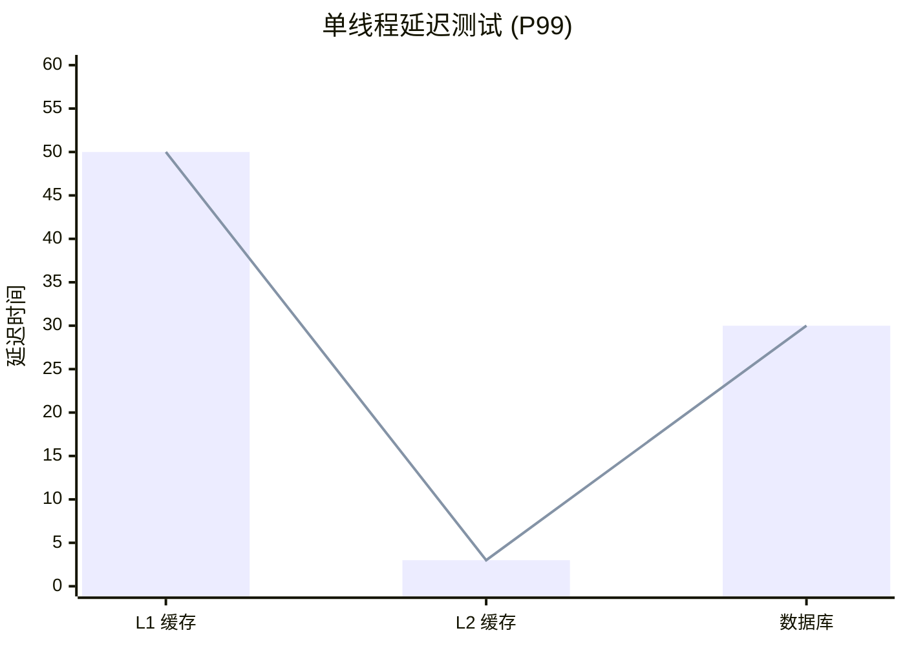
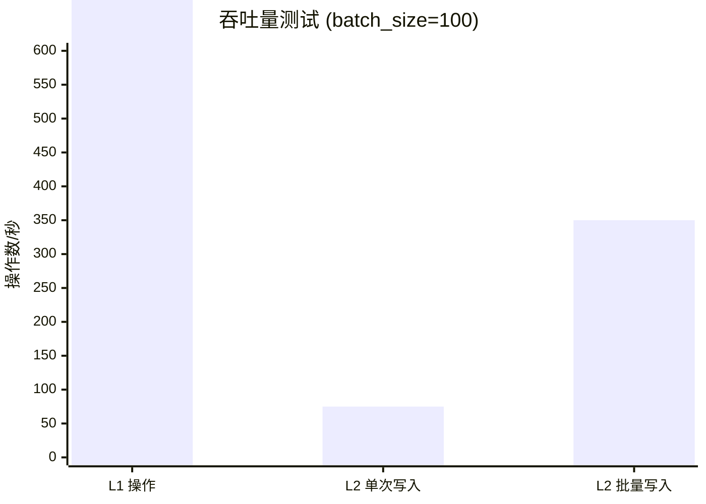

<div align="center">


[](https://github.com/Kirky-X/oxcache/actions/workflows/ci.yml)
[](https://crates.io/crates/oxcache)
[](https://docs.rs/oxcache)
[](https://crates.io/crates/oxcache)
[](https://codecov.io/gh/Kirky-X/oxcache)
[](https://deps.rs/repo/github/Kirky-X/oxcache)
[](https://github.com/Kirky-X/oxcache/blob/main/LICENSE)
[](https://www.rust-lang.org)

[English](../README.md) | 简体中文

高性能、生产级的 Rust 双层缓存库，提供 L1（Moka 内存缓存）+ L2（Redis 分布式缓存）双层架构。

</div>

## ✨ 核心特性

<div align="center">

<table>
<tr>
<td width="20%" align="center">
<br>
<b>极致性能</b><br>L1 纳秒级响应
</td>
<td width="20%" align="center">
<br>
<b>零侵入式</b><br>一行代码启用缓存
</td>
<td width="20%" align="center">
<br>
<b>自动故障恢复</b><br>Redis 故障自动降级
</td>
<td width="20%" align="center">
<br>
<b>多实例同步</b><br>基于 Pub/Sub 机制
</td>
<td width="20%" align="center">
<br>
<b>批量优化</b><br>智能批量写入
</td>
</tr>
</table>

</div>

- **🚀 极致性能**: L1 纳秒级响应（P99 < 100ns），L2 毫秒级响应（P99 < 5ms）
- **🎯 零侵入式**: 通过 `#[cached]` 宏一行代码启用缓存
- **🔄 自动故障恢复**: Redis 故障时自动降级，恢复后自动重放 WAL
- **🌐 多实例同步**: 基于 Pub/Sub + 版本号的失效同步机制
- **⚡ 批量优化**: 智能批量写入，大幅提升吞吐量
- **🛡️ 生产级可靠**: 完整的可观测性、健康检查、混沌测试验证

## 📦 快速开始

### 安装

在 `Cargo.toml` 中添加依赖：

```toml
[dependencies]
oxcache = "0.1.3"
```

> **注意**：`tokio` 和 `serde` 已默认包含。如果需要最小依赖，可以使用
`oxcache = { version = "0.1.3", default-features = false }` 手动添加。

> **特性**：要使用 `#[cached]` 宏，需要启用 `macros` 特性：`oxcache = { version = "0.1.3", features = ["macros"] }`

#### 特性分层

```toml
# 完整特性（推荐）
oxcache = { version = "0.1.3", features = ["full"] }

# 核心功能（L1 + L2 缓存）
oxcache = { version = "0.1.3", features = ["core"] }

# 最小特性（仅 L1 缓存）
oxcache = { version = "0.1.3", features = ["minimal"] }

# 自定义选择
oxcache = { version = "0.1.3", features = ["core", "macros", "metrics"] }
```

#### 可用特性

| 层级 | 包含特性 | 描述 |
|------|----------|------|
| **minimal** | `moka`, `serialization`, `metrics` | 仅 L1 缓存 |
| **core** | `minimal` + `redis` | L1 + L2 缓存 |
| **full** | `core` + 所有高级特性 | 完整功能 |

**高级特性**（包含在 `full` 中）：
- `macros` - `#[cached]` 属性宏
- `batch-write` - 优化的批量写入
- `wal-recovery` - 预写日志持久化
- `bloom-filter` - 缓存穿透保护
- `rate-limiting` - DoS 防护
- `database` - 数据库集成
- `cli` - 命令行界面
- `full-metrics` - OpenTelemetry 集成

### 最简示例

```rust
use oxcache::macros::cached;
use serde::{Deserialize, Serialize};

#[derive(Serialize, Deserialize, Clone, Debug)]
struct User {
    id: u64,
    name: String,
}

// 一行代码启用缓存
#[cached(service = "user_cache", ttl = 600)]
async fn get_user(id: u64) -> Result<User, String> {
    // 模拟耗时的数据库查询
    tokio::time::sleep(std::time::Duration::from_millis(100)).await;
    Ok(User {
        id,
        name: format!("User {}", id),
    })
}

#[tokio::main]
async fn main() -> Result<(), Box<dyn std::error::Error>> {
    // 初始化缓存（从配置文件加载）
    oxcache::init_from_file("config.toml").await?;
    
    // 第一次调用：执行函数逻辑 + 缓存结果（~100ms）
    let user = get_user(1).await?;
    println!("First call: {:?}", user);
    
    // 第二次调用：直接从缓存返回（~0.1ms）
    let cached_user = get_user(1).await?;
    println!("Cached call: {:?}", cached_user);
    
    Ok(())
}
```

### 配置文件

创建 `config.toml`：

> **重要**：要从配置文件初始化，需要启用 `config-toml` 和 `confers` 特性：
> ```toml
> oxcache = { version = "0.1.3", features = ["config-toml", "confers"] }
> ```

```toml
[global]
default_ttl = 3600
health_check_interval = 30
serialization = "json"
enable_metrics = true

# 双层缓存 (L1 + L2)
[services.user_cache]
cache_type = "two-level"  # "l1" | "l2" | "two-level"
ttl = 600

  [services.user_cache.l1]
  max_capacity = 10000
  ttl = 300  # L1 TTL 必须 <= L2 TTL
  tti = 180
  initial_capacity = 1000

  [services.user_cache.l2]
  mode = "standalone"  # "standalone" | "sentinel" | "cluster"
  connection_string = "redis://127.0.0.1:6379"

  [services.user_cache.two_level]
  write_through = true
  promote_on_hit = true
  enable_batch_write = true
  batch_size = 100
  batch_interval_ms = 50

# 仅 L1 缓存 (仅内存)
[services.session_cache]
cache_type = "l1"
ttl = 300

  [services.session_cache.l1]
  max_capacity = 5000
  ttl = 300
  tti = 120

# 仅 L2 缓存 (仅 Redis)
[services.shared_cache]
cache_type = "l2"
ttl = 7200

  [services.shared_cache.l2]
  mode = "standalone"
  connection_string = "redis://127.0.0.1:6379"
```

## 🎨 使用场景

### 场景 1: 用户信息缓存

```rust
#[cached(service = "user_cache", ttl = 600)]
async fn get_user_profile(user_id: u64) -> Result<UserProfile, Error> {
    database::query_user(user_id).await
}
```

### 场景 2: API 响应缓存

```rust
#[cached(
    service = "api_cache",
    ttl = 300,
    key = "api_{endpoint}_{version}"
)]
async fn fetch_api_data(endpoint: String, version: u32) -> Result<ApiResponse, Error> {
    http_client::get(&format!("/api/{}/{}", endpoint, version)).await
}
```

### 场景 3: 仅 L1 热数据缓存

```rust
#[cached(service = "session_cache", cache_type = "l1", ttl = 60)]
async fn get_user_session(session_id: String) -> Result<Session, Error> {
    session_store::load(session_id).await
}
```

### 场景 4: 手动控制缓存

```rust
use oxcache::{get_client, CacheOps};

async fn advanced_caching() -> Result<(), Box<dyn std::error::Error>> {
    oxcache::init_from_file("config.toml").await?;
    
    let client = get_client("custom_cache")?;
    
    // 标准操作
    client.set("key", &my_data, Some(300)).await?;
    let data: MyData = client.get("key").await?.unwrap();
    
    // 仅写入 L1（临时数据）
    client.set_l1_only("temp_key", &temp_data, Some(60)).await?;
    
    // 仅写入 L2（共享数据）
    client.set_l2_only("shared_key", &shared_data, Some(3600)).await?;
    
    // 删除
    client.delete("key").await?;
    
    Ok(())
}
```

## 🏗️ 架构设计

```mermaid
graph TD
    A[Application Code<br/>#[cached] Macro] --> B[CacheManager<br/>Service Registry + Health Monitor]
    
    B --> C[TwoLevelClient]
    B --> D[L1OnlyClient]
    B --> E[L2OnlyClient]
    
    C --> F[L1 Cache<br/>Moka]
    C --> G[L2 Cache<br/>Redis]
    
    D --> F
    E --> G
    
    style A fill:#e1f5fe
    style B fill:#f3e5f5
    style C fill:#e8f5e8
    style D fill:#fff3e0
    style E fill:#fce4ec
    style F fill:#f1f8e9
    style G fill:#fdf2e9
```

**L1**: 进程内高速缓存，使用 LRU/TinyLFU 淘汰策略  
**L2**: 分布式共享缓存，支持 Sentinel/Cluster 模式

## 📊 性能基准

> 测试环境: M1 Pro, 16GB RAM, macOS, Redis 7.0
> 
> **注意**: 性能因硬件、网络条件和数据大小而异。





**性能数据总结**:
- **L1 缓存**: 50-100ns (内存访问)
- **L2 缓存**: 1-5ms (Redis, 本地)
- **数据库**: 10-50ms (典型 SQL 查询)
- **L1 操作**: 5-10M ops/sec
- **L2 单次写入**: 50-100K ops/sec
- **L2 批量写入**: 200-500K ops/sec

## 🛡️ 可靠性

- ✅ 单次请求去重 (Single-Flight)
- ✅ 预写日志 (WAL) 持久化
- ✅ Redis 故障自动降级
- ✅ 优雅关闭机制
- ✅ 健康检查与自动恢复

## 📚 文档

- [📖 用户指南](docs/USER_GUIDE.md)
- [📘 API 文档](https://docs.rs/oxcache)
- [💻 示例代码](../examples/)

## 🤝 贡献

欢迎提交 Pull Request 和 Issue！

## 📝 更新日志

详见 [CHANGELOG.md](../CHANGELOG.md)

## 📄 许可证

本项目采用 MIT 许可证。详见 [LICENSE](../LICENSE) 文件。

---

<div align="center">

**如果这个项目对你有帮助，请给个 ⭐ Star 支持一下！**

Made with ❤️ by Kirky.X

</div>
