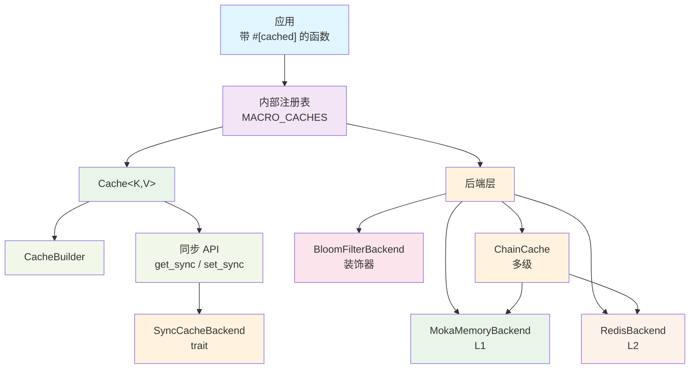
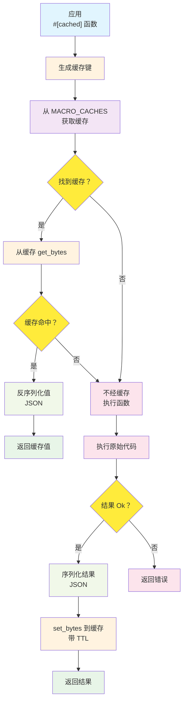
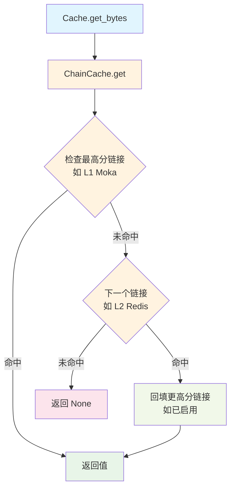
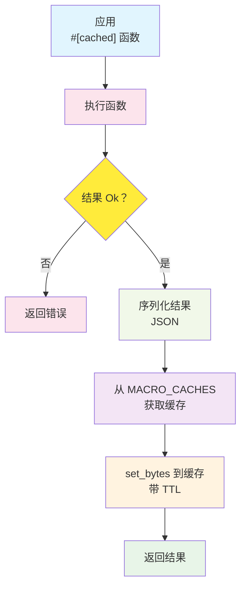
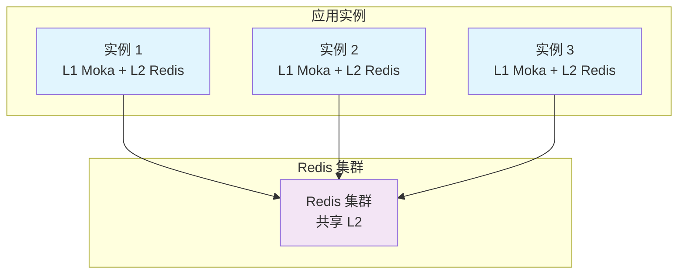

# 架构文档

本文档描述 Oxcache 库（v0.4.1）的架构、设计决策和技术细节。

## 目录

- [概述](#概述)
- [架构](#架构)
- [组件](#组件)
- [数据流](#数据流)
- [一致性模型](#一致性模型)
- [故障处理](#故障处理)
- [性能优化](#性能优化)
- [安全](#安全)
- [可扩展性](#可扩展性)
- [特性标志](#特性标志)

## 概述

Oxcache 是一个多级缓存系统，专为高性能、生产就绪的应用设计。它整合了：

- **L1 缓存**：使用 Moka（LRU/TinyLFU 淘汰）或 DashMap 的内存缓存
- **L2 缓存**：使用 Redis（Standalone/Sentinel/Cluster）、Valkey、Dragonfly 或 Aerospike 的分布式缓存
- **ChainCache**：按分数排序的多后端缓存链，支持回填（替代了旧版“分层后端”概念）
- **同步 API**：异步 API 的同步镜像（`get_sync` / `set_sync` / …），用于非异步调用场景
- **布隆过滤器**：可选装饰器，在负查询到达内部后端前短路返回
- **单条目 TTL**：所有后端（Moka / DashMap / Redis / Valkey / Dragonfly / Aerospike / Mock / Chain / Bloom）统一支持 `ttl` / `expire` 操作

> **说明（v0.3.2）**：0.3.0 之前文档中引用的 Pub/Sub 跨实例失效层和 WAL（Write-Ahead-Log）恢复层**不存在**于 0.3.2 代码库中。多实例一致性由应用负责（如通过 Redis keyspace 通知或外部失效），持久性委托给 Redis 后端本身。

### 设计目标

1. **性能**：L1 延迟 50-100ns，L2 延迟 1-5ms（P99，随环境变化）
2. **可靠性**：后端 trait 层级让调用方在 L2 不可达时优雅降级
3. **易用性**：通过 `#[cached]` 宏实现零模板代码集成
4. **可观测性**：指标（`CacheStats`、Prometheus/JSON 导出）、追踪 span、健康检查
5. **安全性**：Redis 键 / Lua 脚本 / SCAN 模式的输入校验，敏感数据脱敏

## 架构



## 组件

### 1. 内部缓存注册表（`internal.rs`）

**职责**：缓存实例的中央注册表，供 `#[cached]` 宏使用。

**数据结构**：

```rust
type MacroCacheMap = Mutex<HashMap<String, Arc<Cache<String, Vec<u8>>>>>;
static MACRO_CACHES: once_cell::sync::OnceCell<MacroCacheMap> = ...;
```

注册表存储**具体的 `Cache<String, Vec<u8>>` Arc 句柄**（非 `dyn CacheOps`），以服务名为键。使用 `Mutex<HashMap<…>>` 而非 `DashMap`。

**公共内部函数**（仅两个；0.3.2 中不存在 `__internal_remove_cache` 或 `__internal_clear_all`）：

- `__internal_register_cache(name, cache: Arc<Cache<String, Vec<u8>>>)` — 注册/覆盖某服务的缓存（异步，互斥锁中毒时为 no-op）
- `__internal_get_cache(name) -> Option<Arc<Cache<String, Vec<u8>>>>` — 按服务名获取缓存（同步）

两者均从 `oxcache::internal` 重导出，`oxcache::__internal_get_cache` 在 crate 根重导出供宏生成代码使用。

**线程安全**：`Mutex<HashMap<…>>` 由 `once_cell::sync::OnceCell` 守护，用于延迟初始化。互斥锁仅在 map 变更/查找期间持有（持锁期间无 await）。

**使用模式**：

```rust
use oxcache::Cache;

// 构建并注册缓存供 #[cached] 宏使用
let cache: Cache<String, Vec<u8>> = Cache::builder().build().await?;
oxcache::internal::__internal_register_cache("my_service", Arc::new(cache)).await;

// 或使用 Cache 上的便捷方法：
cache.register_for_macro("my_service").await?;

// 宏生成的代码从注册表获取缓存：
#[cached(service = "my_service", ttl = 300)]
async fn get_user(id: u64) -> User { /* ... */ }
```

### 2. 缓存接口（`cache/`）

**职责**：统一的类型安全缓存接口。

**模块结构**：
- `cache/mod.rs` - 模块根和重导出
- `cache/builder/` - `CacheBuilder` 实现
- `cache/api/` - 缓存操作实现（`basic_ops`、`batch_ops`、`bytes_ops`、`macros`）
- `cache/chain.rs` - `ChainCache`、`ChainLink`、`ChainCacheBuilder`
- `cache/interface.rs` - `UnifiedCache` trait

**关键类型**：
- `Cache<K, V>`：主缓存类型，泛型键（`K: CacheKey`）和值（`V: Serialize + DeserializeOwned`）
- `CacheBuilder<K, V>`：用于创建已配置缓存实例的构建器
- `ChainCache` / `ChainLink` / `ChainCacheBuilder`：多级缓存链（按分数排序）

**`Cache<K, V>` 上的构造方法**：

| 方法 | 特性 | 说明 |
|------|------|------|
| `Cache::memory().await` | `memory` | 便捷方法：默认 Moka 后端 |
| `Cache::redis(url).await` | `redis` | 便捷方法：Redis 后端（强制 TLS） |
| `Cache::builder()` | — | 启动 `CacheBuilder<K, V>` |
| `Cache::with_dependencies(backend: Arc<dyn CacheBackend>)` | — | 将任意 backend 包装为 `Cache` |
| `Cache::new()` | `memory` | 同步构造方法（默认 Moka 后端） |

> **重要**：0.3.2 中 `CacheBuilder` **不**暴露 `.redis(url)`、`.tiered(…)`、`.with_backend(…)`、`.batch_writes(…)` 或 `.auto_promote(…)` 方法。要组合多个后端请使用 `ChainCache` 并通过 `.backend_arc(Arc::new(chain))` 注入。

**CacheBuilder API**（`Cache::builder()`）：

```rust
pub fn backend_arc(self, backend: Arc<dyn CacheBackend>) -> Self;
pub fn ttl(self, ttl: Duration) -> Self;             // 默认 TTL
pub fn tti(self, tti: Duration) -> Self;             // 默认 TTI（Moka）
pub fn capacity(self, capacity: u64) -> Self;        // L1 容量提示
pub fn sync_mode(self, enabled: bool) -> Self;       // 启用同步 API
pub async fn build(self) -> Result<Cache<K, V>>;
```

**约束**：`sync_mode(true)` 不能与 `backend_arc(Arc<dyn CacheBackend>)` 组合。两者同时设置时 `build()` 返回 `Err(OxCacheError::NotSupported)`（OXCACHE_009）。这是 stable Rust 上 `trait_upcasting` 的临时限制；同步模式要求后端由构建器内部构造（如通过 `Cache::memory()` / `Cache::redis()` 路径或省略 `backend_arc`）。

**关键异步方法**：

- `get(key) -> OxCacheResult<Option<V>>`
- `set(key, value) -> OxCacheResult<()>`（使用构建器 TTL）
- `set_with_ttl(key, value, ttl: Option<Duration>) -> OxCacheResult<()>`
- `delete(key) -> OxCacheResult<()>`
- `exists(key) -> OxCacheResult<bool>`
- `clear() -> OxCacheResult<()>`
- `get_or(key, fallback) -> OxCacheResult<V>`（单飞，通过 `tokio::sync::Notify`）
- `ttl(key) -> OxCacheResult<Option<Duration>>` — 剩余 TTL（无单条目 TTL 或键不存在时为 None）
- `expire(key, ttl) -> OxCacheResult<bool>` — 更新已有键的 TTL 而不修改其值
- `get_bytes(key) -> OxCacheResult<Option<Vec<u8>>>` / `set_bytes(key, bytes, ttl)` — 原始字节操作
- `len() / is_empty() / capacity() / stats() / health_check() / shutdown()` — 生命周期与统计
- `register_for_macro(service_name) -> OxCacheResult<()>` — 注册到 `MACRO_CACHES`

**同步 API**（需构建器上 `sync_mode(true)`；否则返回 `Err(NotSupported)`）：

- `get_sync(key)`、`set_sync(key, value)`、`set_with_ttl_sync(key, value, ttl)`、
- `delete_sync(key)`、`exists_sync(key)`、`clear_sync()`、
- `ttl_sync(key)`、`expire_sync(key, ttl)`、
- `get_or_sync(key, fallback)`（单飞，通过 `std::sync::Condvar`）

**线程安全**：所有操作通过 `Arc<dyn CacheBackend>`（同步路径为 `Option<Arc<dyn SyncCacheBackend>>`）保证线程安全。

**使用模式**：

```rust
use oxcache::Cache;
use std::time::Duration;

// 1) 简单内存缓存（默认）
let cache: Cache<String, User> = Cache::builder()
    .ttl(Duration::from_secs(3600))
    .capacity(10000)
    .build()
    .await?;

// 2) Redis 缓存（强制 TLS，除非设置了 OXCACHE_ALLOW_INSECURE_REDIS）
let cache: Cache<String, User> = Cache::redis("rediss://localhost:6379").await?;

// 3) 注入任意自定义后端
let backend: Arc<dyn oxcache::backend::CacheBackend> = /* ... */;
let cache: Cache<String, User> = Cache::builder()
    .backend_arc(backend)
    .ttl(Duration::from_secs(3600))
    .build()
    .await?;

// 4) 同步 API（Moka 需要 multi_thread tokio 运行时）
let cache: Cache<String, String> = Cache::builder()
    .sync_mode(true)
    .build()
    .await?;
cache.set_sync(&"k".to_string(), &"v".to_string())?;
let v = cache.get_sync(&"k".to_string())?;

// 注册供 #[cached] 宏使用
cache.register_for_macro("my_service").await?;
```

### 3. 后端层（`backend/`）

**职责**：可插拔的缓存后端实现，遵循 ISP 合规 trait 层级。

**模块结构**：
- `backend/mod.rs` - 模块根和重导出
- `backend/interface.rs` - `CacheReader` / `CacheWriter` / `CacheConnector` / `CacheBackend` 及其同步镜像；`AtomicCacheWriter` / `SyncAtomicCacheWriter` 用于原子操作
- `backend/memory/` - 内存后端实现（Moka、DashMap）及 Redis/Valkey 客户端
- `backend/dragonfly/` - Dragonfly 后端（基于 Redis 协议包装）
- `backend/aerospike/` - Aerospike 后端（独立协议，feature-gated）
- `backend/score.rs` - `BackendScore` / `Scores` 常量供 `ChainCache` 使用
- `backend/config_validation.rs` - Redis/Valkey URL / Sentinel 配置校验

**后端类型**（重导出在 `oxcache::backend::*`，部分在 crate 根）：

| 类型 | 路径 | 特性 | 说明 |
|------|------|------|------|
| `MokaMemoryBackend` | `oxcache::backend::MokaMemoryBackend` | `memory` | L1 缓存，Moka（LRU/TinyLFU） |
| `DashMapMemoryBackend` | `oxcache::backend::DashMapMemoryBackend` | `memory` | 纯内存并发缓存，FIFO O(1) 淘汰 |
| `RedisBackend` | `oxcache::backend::RedisBackend` | `redis` | L2 分布式缓存（Redis/Valkey） |
| `RedisBackendBuilder` | `oxcache::backend::RedisBackendBuilder` | `redis` | Redis/Valkey 构建器（模式、连接池、TLS） |
| `DragonflyBackend` | `oxcache::backend::DragonflyBackend` | `dragonfly` | Dragonfly 缓存（Redis 协议兼容） |
| `AerospikeBackend` | `oxcache::backend::AerospikeBackend` | `aerospike` | Aerospike 持久化 KV 存储 |
| `ChainCache` | `oxcache::cache::chain::ChainCache` | — | 按分数排序的多后端缓存链 |
| `BloomFilterBackend` | `oxcache::features::bloom_filter::BloomFilterBackend` | `bloom-filter` | 负查询过滤装饰器 |

**异步 Trait 层级**（`backend/interface.rs`）：

```rust
#[async_trait]
pub trait CacheReader: Send + Sync + 'static {
    async fn get(&self, key: &str) -> OxCacheResult<Option<Vec<u8>>>;
    async fn exists(&self, key: &str) -> OxCacheResult<bool>;
    async fn ttl(&self, key: &str) -> OxCacheResult<Option<Duration>>;
    async fn len(&self) -> OxCacheResult<u64>;
    async fn is_empty(&self) -> OxCacheResult<bool> { /* 默认实现 */ }
    async fn capacity(&self) -> OxCacheResult<u64>;
    async fn stats(&self) -> OxCacheResult<HashMap<String, String>>;
    async fn get_many(&self, keys: &[String]) -> OxCacheResult<Vec<Option<Vec<u8>>>> { /* 默认 */ }
    async fn keys(&self, pattern: &str) -> OxCacheResult<Vec<String>> { /* 默认：空 Vec */ }
}

/// 批量写入条目类型：`(Arc<str> key, Arc<Vec<u8>> value, Option<Duration> ttl)`
pub type CacheSetItem = (Arc<str>, Arc<Vec<u8>>, Option<Duration>);

#[async_trait]
pub trait CacheWriter: Send + Sync + 'static {
    async fn set(&self, key: Arc<str>, value: Arc<Vec<u8>>, ttl: Option<Duration>) -> OxCacheResult<()>;
    async fn delete(&self, key: &str) -> OxCacheResult<()>;
    async fn clear(&self) -> OxCacheResult<()>;
    async fn expire(&self, key: &str, ttl: Duration) -> OxCacheResult<bool>;
    async fn set_many(&self, items: &[CacheSetItem]) -> OxCacheResult<()> { /* 默认 */ }
    async fn delete_many(&self, keys: &[String]) -> OxCacheResult<()> { /* 默认 */ }
}

#[async_trait]
pub trait CacheConnector: Send + Sync + 'static {
    async fn health_check(&self) -> OxCacheResult<()>;
    async fn shutdown(&self);
    fn backend_kind(&self) -> BackendKind;
    #[cfg(feature = "lua-script")]
    fn as_lua_executor(&self) -> Option<&dyn LuaExecutor> { None }
    fn as_atomic_writer(&self) -> Option<&dyn AtomicCacheWriter> { None }
}

#[async_trait]
pub trait CacheBackend: CacheReader + CacheWriter + CacheConnector + 'static {}
// blanket 实现：满足三个超级 trait 的任意 T 自动成为 CacheBackend。
```

**同步 Trait 层级**（镜像异步版本，无 `async`/`#[async_trait]`）：

```rust
pub trait SyncCacheReader: Send + Sync + 'static { /* 同步 fn */ }
pub trait SyncCacheWriter: Send + Sync + 'static { /* 同步 fn */ }
pub trait SyncCacheConnector: Send + Sync + 'static { /* 同步 fn */ }
pub trait SyncCacheBackend: SyncCacheReader + SyncCacheWriter + SyncCacheConnector + 'static {}
```

后端通过额外实现同步 trait 来选择加入同步 API。`Cache<K, V>::get_sync` 通过 `Arc<dyn SyncCacheBackend>` 分发。**异步和同步层级有意分离**，使后端可以只支持其一，且保持异步 trait 对象的对象安全（异步热路径上无 `block_in_place`）。

**AtomicCacheWriter**（独立 trait，非 `CacheWriter` 的超级 trait）：

```rust
#[async_trait]
pub trait AtomicCacheWriter: Send + Sync + 'static {
    async fn incr(&self, key: &str, delta: i64, ttl: Option<Duration>) -> OxCacheResult<i64>;
    async fn compare_and_swap(&self, key: &str, expected: Option<&[u8]>, new: Vec<u8>, ttl: Option<Duration>) -> OxCacheResult<bool>;
    async fn set_if_absent(&self, key: &str, value: Vec<u8>, ttl: Option<Duration>) -> OxCacheResult<bool>;
}

pub trait SyncAtomicCacheWriter: Send + Sync + 'static { /* 同步镜像 */ }
```

后端通过 `CacheConnector::as_atomic_writer()` 暴露原子能力。`Cache<K,V>::incr()` / `compare_and_swap()` / `set_if_absent()` 通过此运行时发现方法委托；后端缺少原子支持时返回 `Err(NotSupported)`。

**`BackendKind` 枚举**（`Moka | DashMap | Redis | Valkey | Dragonfly | Aerospike | Chain | Mock | Unknown`）由 `backend_kind()` 返回，用于运行时标识而无需 `as_any()`）。

**ChainCache 读取路径**（替代旧版 "TieredBackend"）：

```
1. 从最高分（L1）到最低分（L2）遍历 ChainLink
2. 命中 → 返回值
3. 未命中（None 或 Err）→ 记录警告并继续下一个链接
   （L1 读取失败优雅降级而非使请求失败）
4. 在非最高分链接命中后，如启用回填，
   异步填充更高分（更靠近 L1）的链接
   （fire-and-forget `tokio::spawn`，失败仅警告不传播）
```

启用 `enable_race_read()`（选择加入）后，读取路径改为**并发**查询**所有**
后端（`JoinSet`）并返回首个命中；非最高分命中时仍执行回填，
仅当所有后端都失败时读取才报错。

**ChainCache 写入路径**：

```
1. 并发（tokio::spawn / JoinSet）写入所有分数
   <= 写入者阈值的链接（通常所有非持久化 + 持久化写入者）
2. 持久化后端接收写入以保证持久性
3. 单链接失败仅记录日志并容忍；仅当所有后端都失败时
   写入才报错
4. 无 WAL，无 Pub/Sub 发布（这些层不在 0.3.2 中）
```

**ChainCache 健康检查**：每个链接并发 ping，每个后端 5 秒超时；仅当所有链接都失败时 `health_check()` 才失败。

### 4. 特性模块（`features/`）

**职责**：可选能力和运行时特性信息。

**关键项**：
- `features::bloom_filter::BloomFilter` — 概率数据结构（`new(capacity, fpr)`、`add`、`contains`、`clear`、`len`、`is_empty`）
- `features::bloom_filter::BloomFilterBackend` — 装饰器，包装任意 `CacheBackend`；`get` 时如键不在布隆过滤器中则直接返回 `Ok(None)`
- `get_l1_feature_info() / get_l2_feature_info() / get_all_feature_info()`
- `is_l1_enabled() / is_l2_enabled()`

### 5. 基础设施模块（`infra/`）

**职责**：指标、序列化和键校验工具。

**子模块**：
- `infra/metrics/backend.rs` — `MetricsCollector`、`LatencyHistogram`、`OperationCounter`、`FullMetrics`
- `infra/metrics/snapshot.rs` — `CacheStats`
- `infra/metrics/export.rs` — `export_json_format`、`export_prometheus_format`、`get_enhanced_stats`
- `infra/metrics/unified.rs` — `UnifiedMetrics`、原子计数器、直方图数据
- `infra/serialization/` — JSON 序列化器（`JsonSerializer`）和 `UnifiedSerializer`（0.3.2 中仅 JSON）
- `infra::validate_cache_key(key)` — 键校验便捷方法

**Crate 根重导出**（启用 `metrics` 或 `full` 特性时）：

```rust
pub use infra::{export_json_format, export_prometheus_format, get_enhanced_stats, CacheStats};
```

**重要**：`MetricsCollector` **不**在 crate 根重导出。它位于 `oxcache::infra::metrics::backend::MetricsCollector::new() -> OxCacheResult<Self>`（注意：0.3.2 中无参数，返回 `Result`）。

**序列化**：仅支持 **JSON**（`serialization` 特性引入 `serde` + `serde_json`）。Bincode/MessagePack/CBOR 未实现。序列化在 `infra/serialization/` 中实现（`json.rs`、`unified.rs`、`utils.rs`、`depth_limited.rs`）：

- **`JsonSerializer`** — 异步/同步后端侧序列化器（值为 `Vec<u8>`）；`with_compression()` 启用 flate2 gzip 输出。
- **`UnifiedSerializer`** — 值级编解码（`serialize<T>` / `deserialize<T>` / `estimate_size`），供 `Cache<K, V>` 和 `#[cached]` 宏使用。
- **`depth_limited.rs`** — `deserialize_safe` 防止深层嵌套 JSON DoS：禁用 `serde_json` 递归限制（`unbounded_depth` 特性），流通过 `serde_stacker` 包装为基于堆栈的递归。`MAX_JSON_DEPTH` 常量加 64 MiB 反序列化大小上限和 gzip 魔数头检测加固了该路径。

线上无 base64 往返——值以原始字节传递（可选 gzip）。

### 6. 安全模块（`security/`）

**职责**：输入校验和敏感数据脱敏。模块本身为 `pub(crate)` — 调用方必须使用 **crate 根重导出**。

**子模块**：
- `security/validation.rs` - Redis 键、Lua 脚本、SCAN 模式校验
- `security/redaction.rs` - 敏感数据脱敏（`Redacted` 包装器）
- `security/log.rs` - 安全日志工具
- `security/regex.rs` - 模式匹配

**Crate 根重导出**（启用 `redis` 或 `full` 特性时）：

```rust
pub use crate::security::{
    clamp_scan_count,
    log::{log_cache_key, sanitize_message},
    redaction::{redact_cache_key, redact_connection_string, redact_field, redact_value, Redacted},
    validate_lua_script, validate_redis_key, validate_scan_pattern,
};
```

> **导入路径说明**：`oxcache::security::*` 是**无效**路径（模块为 `pub(crate)`）。直接使用 `oxcache::validate_redis_key(...)` 等。函数名为 `validate_redis_key`（非 `validate_key`）。

### 7. 键生成器（`utils/`）

**职责**：缓存键生成和管理。

**关键类型**：
- `KeyGenerator`：用于生成带命名空间和前缀的缓存键的工具（重导出在 `oxcache::KeyGenerator`）

**关键方法**：
- `new()`：创建默认键生成器
- `with_namespace(ns)`：设置命名空间用于键隔离
- `with_prefix_str(prefix)`：设置前缀用于键组织
- `generate(template, params)`：从模板生成键
- `generate_full(template, params)`：使用命名空间和前缀生成键
- `validate_key(key)`：校验键格式

**使用模式**：

```rust
use oxcache::KeyGenerator;

let generator = KeyGenerator::new()
    .with_namespace("myapp")
    .with_prefix_str("cache");

let key = generator.generate_full("user:{id}", &[("id", "123")]);
// 结果："myapp:cache:user:123"
```

### 8. 事件模块（`core/events.rs`）

**职责**：缓存事件系统，用于监控和钩子。

**关键类型**（重导出在 crate 根）：
- `CacheEventType`：事件类型枚举（`Hit`、`Miss`、`Set`、`Delete`、`Expire`、`Clear`、`Get`、`BatchStart`、`BatchEnd`、`Error`、`Connect`、`Disconnect`、`Custom(String)`）
- `CacheEvent`：事件数据结构（builder 模式构造）
- `EventPublisher`：事件发布 trait（提供 `NoopPublisher` 供测试使用）

**`CacheEvent` API**（builder 模式）：

```rust
let event = CacheEvent::new(CacheEventType::Hit)
    .with_key("user:123")
    .with_latency(15)
    .with_metadata("source", "l1");
```

字段：`event_type`、`key: Option<String>`、`timestamp: u64`（毫秒）、`latency_ms: Option<u64>`、`error: Option<String>`、`metadata: Vec<(String, String)>`。

### 9. 配置模块（`config/`）

`oxcache::config` 模块作为公共模块存在但当前为空桩（仅有版权头）。0.3.2 之前文档中引用的 `UnifiedConfigBuilder`、`ServiceConfig`、`L1Config`、`L2Config` 和 `PartitionConfig` 类型在 0.3.2 中**不存在**。配置通过 `CacheBuilder` 和 `RedisBackendBuilder` 以编程方式完成。

## 数据流

### #[cached] 宏工作流

`#[cached]` 宏通过自动处理缓存查找、存储和序列化实现零模板代码缓存。有效的宏参数为：`service`、`ttl`、`key`、`key_prefix`、`sync`、`skip_cache_write`（不存在 `key_generator` 或 `cache_type` 参数）。

```mermaid
sequenceDiagram
    participant App as "应用"
    participant Macro as "#[cached] 宏"
    participant Registry as MACRO_CACHES
    participant Cache as Cache&lt;String, Vec&lt;u8&gt;&gt;
    participant Backend as CacheBackend

    App->>Macro: 调用缓存函数
    Macro->>Macro: 生成缓存键（service + key / key_prefix）
    Macro->>Registry: __internal_get_cache("service")
    Registry-->>Macro: Option&lt;Arc&lt;Cache&gt;&gt;
    Macro->>Cache: get_bytes(key)
    Cache->>Backend: get(key)
    Backend-->>Cache: Option&lt;Vec&lt;u8&gt;&gt;
    Cache-->>Macro: Option&lt;bytes&gt;
    Macro->>Macro: 反序列化字节（JSON）
    Macro-->>App: 返回缓存值

    Note over App,Backend: 缓存未命中路径
    Macro->>Macro: 执行原始函数
    Macro->>Macro: 序列化结果（JSON）
    Macro->>Cache: set_bytes(key, bytes, Some(ttl))
    Cache->>Backend: set(key, bytes, ttl)
    Macro-->>App: 返回结果
```

**宏生成代码结构**：

```rust
#[cached(service = "my_service", ttl = 300)]
async fn get_user(id: u64) -> OxCacheResult<User> {
    // ... 原始函数体 ...
}
```

展开后大致为：

```rust
async fn get_user(id: u64) -> OxCacheResult<User> {
    let cache_key = format!("my_service:get_user:{:?}", id);

    // 从注册表获取缓存（同步查找）
    let client = match oxcache::__internal_get_cache("my_service") {
        Some(c) => c,
        None => return { /* 原始代码 */ }.await,
    };

    // 尝试缓存命中（JSON 反序列化为 User）
    if let Ok(Some(bytes)) = client.get_bytes(&cache_key).await {
        if let Ok(val) = serde_json::from_slice::<User>(&bytes) {
            return Ok(val);
        }
    }

    // 执行原始函数
    let result = { /* 原始代码 */ }.await;

    // 成功时缓存结果
    if let Ok(ref val) = result {
        if let Ok(bytes) = serde_json::to_vec(val) {
            let _ = client.set_bytes(&cache_key, bytes, Some(Duration::from_secs(300))).await;
        }
    }

    result
}
```

### 读操作（配合 #[cached] 宏）



### ChainCache 读取路径



### 写操作（配合 #[cached] 宏）



> **说明**：0.3.0 之前的 "set_l1_bytes / set_l2_bytes / 批量写入 L2" 分支已移除。`#[cached]` 在注册的 `Cache<String, Vec<u8>>` 上调用 `set_bytes`，由其分发到所接入的后端（内存、Redis、ChainCache 或 BloomFilterBackend）。如果后端是 `ChainCache`，链按分数/回填策略内部处理 L1+L2 写入。

## 一致性模型

### 单实例一致性

在单个 `Cache<K, V>` 实例内，配置的后端决定一致性：

- **仅 Moka / DashMap**：进程内强一致性。无跨实例协调。
- **仅 Redis**：通过 Redis 单线程命令执行实现强一致性。
- **ChainCache（Moka + Redis）**：进程内读后写一致性。L1 缓存同步更新；L2（Redis）写入在 `set` 返回前完成。如启用回填，L2 命中会异步填充 L1。

### 跨实例一致性

Oxcache 0.3.2 **不**内置跨实例失效层（无 Pub/Sub，无版本方案）。多实例一致性由应用负责。常见模式：

- 使用 Redis 作为唯一真实来源（跳过 L1，或接受 L1 的短暂过期数据）
- 使用短 L1 TTL 限制数据过期程度
- 应用外部失效（如 Redis keyspace 通知、应用层 Pub/Sub）并在每个实例上调用 `cache.delete(key)`

### 单飞（缓存击穿保护）

`get_or`（异步）和 `get_or_sync`（同步）都实现单飞：当多个并发调用未命中同一键时，仅第一个调用者（"领导者"）执行 fallback；跟随者在 `tokio::sync::Notify`（异步）或 `std::sync::Condvar`（同步）上阻塞，直到领导者写入结果。panic 安全守卫确保即使领导者 panic 跟随者也能被释放。

飞行中注册表**分片**（64 个哈希桶通过 `DefaultHasher`）以减少并发下跨键锁竞争：`get_or_shard_index(key)` 将每个键路由到一个分片，每个分片拥有 `Mutex<HashMap<String, Arc<Notify>>>`（异步）/ `Mutex<HashMap<String, SyncFlight>>`（同步）。

## 故障处理

### Redis 故障

**检测**（通过 `CacheConnector::health_check()`）：
- 连接超时 / 拒绝
- `PING` 失败
- 连接被远端关闭

**恢复（应用驱动，非自动）**：
Oxcache 0.3.2 不在后端间自动故障转移。应用决定如何处理 Redis 错误：

1. `Cache::health_check().await` 返回 `Err(OxCacheError::*)` — 调用方可切换到回退代码路径
2. `ChainCache` 即使 L2 链接报错仍继续提供 L1 命中（未命中仅传播为 `None`）；L1 读取错误被记录并穿透到下一链接；L2 写入失败被记录，仅当所有后端都失败时写入才向调用方报错
3. 应用可以在缓存外包裹自己的熔断器/重试策略

0.3.2 中无自动"仅 L1 模式"切换，无重连时 WAL 重放。

### 网络分区

- 每个实例继续使用本地 L1 缓存运行
- Redis 写入/读取将失败并表现为 `Err(OxCacheError::*)`
- 恢复后：无自动协调（0.3.2 无版本方案）。应用可发出 `cache.clear()` 或依赖 TTL 过期。

### 后端 Trait 错误

所有后端错误通过 `OxCacheError` 传递（参见 `src/error.rs`）。关键变体：

| 错误码 | 变体 | 含义 |
|--------|------|------|
| OXCACHE_001 | `NotFound` | 键未找到 |
| OXCACHE_002 | `Connection` | 网络连接失败 |
| OXCACHE_003 | `Serialization` | JSON 序列化/反序列化失败 |
| OXCACHE_004 | `Operation` | 一般操作失败 |
| OXCACHE_005 | `Degraded` | 缓存处于降级模式 |
| OXCACHE_006 | `L1Error` | L1（内存）后端错误 |
| OXCACHE_007 | `L2Error` | L2（Redis）后端错误 |
| OXCACHE_009 | `NotSupported` | 此后端/配置不支持的操作（如未启用 `sync_mode(true)` 的同步 API） |
| OXCACHE_010 | `WalError` | WAL 操作失败 |
| OXCACHE_011 | `DatabaseError` | 数据库错误 |
| OXCACHE_012 | `RedisError` | Redis 错误 |
| OXCACHE_013 | `IoError` | I/O 错误 |
| OXCACHE_014 | `BackendError` | 后端错误 |
| OXCACHE_015 | `Timeout` | 操作超时 |
| OXCACHE_016 | `ShutdownError` | 关闭错误 |
| OXCACHE_017 | `KeyTooLong` | 键超过最大长度 |
| OXCACHE_018 | `ValueTooLarge` | 值超过最大大小 |
| OXCACHE_019 | `BufferFull` | 批量写入缓冲区已满 |
| OXCACHE_020 | `InvalidInput` | 错误的键/值/配置输入 |
| OXCACHE_021 | `InvalidKey` | 无效键格式 |
| OXCACHE_022 | `LockError` | 锁中毒 |
| OXCACHE_023 | `ServiceNotFound` | 服务未在注册表中 |
| OXCACHE_024 | `Internal` | 内部状态损坏 |

完整表格（OXCACHE_001–OXCACHE_024）记录在 `docs/API_REFERENCE.md` 中。

## 性能优化

### 优化技术

1. **Moka 单条目 TTL**：使用 `moka::Expiry` trait 实现真正的单条目 TTL（覆盖构建器的全局 TTL），避免独立过期跟踪的开销。
2. **连接池**：`RedisBackend::with_pool(url, pool_size)` 复用 Redis 连接。
3. **Pipeline / 批量操作**：`RedisBackend` 支持通过 Redis pipeline 的 `set_many` / `delete_many` / `get_many`（默认 trait 实现循环，但 `RedisBackend` 覆盖它们）。`batch-write` 特性添加缓冲 L2 写入。
4. **无锁 L1**：Moka 的并发缓存设计（TinyLFU 准入、LRU 淘汰）。
5. **JSON 序列化**：人类可读、广泛支持。`MAX_JSON_DEPTH` 常量防止深层嵌套 JSON DoS。
6. **可选压缩**：`compression` 特性启用 flate2 压缩用于大值。
7. **单飞**：`get_or` / `get_or_sync` 对每键的并发 fallback 执行去重，防止缓存击穿惊群效应。
8. **布隆过滤器短路**：`BloomFilterBackend` 在键不在过滤器中时直接返回 `Ok(None)` 而不触及内部后端——适用于高负查询比工作负载。

### 性能调优

```rust
use std::time::Duration;
use oxcache::Cache;

let cache: Cache<String, User> = Cache::builder()
    .capacity(10_000)              // L1 最大条目数
    .ttl(Duration::from_secs(600)) // 默认 TTL
    .tti(Duration::from_secs(300)) // 空闲 TTL（Moka）
    .build()
    .await?;

// Redis 连接池大小：
let redis = oxcache::backend::RedisBackend::with_pool(
    "rediss://localhost:6379", 16,
).await?;
```

### 基准测试结果

> 测试环境：M1 Pro，16GB RAM，macOS，Redis 7.0
>
> **注意**：性能因硬件、网络条件和数据大小而异。将这些视为数量级估计。

| 操作 | 吞吐量 | 延迟（P99） |
|------|--------|-------------|
| L1 读取 | 5-10M ops/sec | 50-100ns |
| L1 写入 | 2-5M ops/sec | 50-200ns |
| L2 读取 | 50-100K ops/sec | 1-5ms |
| L2 写入（批量） | 200-500K ops/sec | 1-10ms |

## 安全

### 威胁模型

1. **缓存穿透**：攻击者请求不存在的键 → 加载数据库
2. **缓存击穿**：热点键过期，大量请求同时打到数据库
3. **DoS 攻击**：高请求率压垮系统
4. **SQL 注入**：Redis 键中的恶意模式
5. **Lua 脚本注入**：Lua 脚本中的危险命令
6. **ReDoS**：恶意 SCAN 模式导致 CPU 耗尽
7. **深层嵌套 JSON DoS**：恶意 JSON 在反序列化时导致栈溢出

### 防御措施

1. **单飞**：通过请求去重防止缓存击穿（`get_or` / `get_or_sync`）
2. **输入校验**：`validate_redis_key`、`validate_lua_script`、`validate_scan_pattern`、`clamp_scan_count`（在 crate 根重导出）
3. **注释预处理**：校验前剥离 Lua 注释以防止绕过
4. **敏感数据脱敏**：`Redacted` 包装器、`redact_connection_string`、`redact_cache_key`、`redact_field`、`redact_value`
5. **JSON 深度限制**：`MAX_JSON_DEPTH` 在 `get` 时拒绝深层嵌套 JSON
6. **TLS 强制**：`RedisBackend` 要求 `rediss://` URL，除非设置了 `OXCACHE_ALLOW_INSECURE_REDIS=I_UNDERSTAND_THE_RISKS`
7. **布隆过滤器**：后端查找前的负查询过滤（可选，`bloom-filter` 特性）

> **注意**：0.3.2 中**无内置限流**。0.3.2 之前文档引用的 `GlobalRateLimiter` / `RateLimitConfig` 类型在 0.3.2 中**不存在**。限流由应用或上游代理负责。

### 输入校验

`security` 模块（私有；通过 crate 根重导出消费）提供：

#### Redis 键校验（`validate_redis_key`）
- 拒绝空键
- 512KB 大小限制
- 危险字符检测（`\r`、`\n`、`\0`）
- SQL 注入模式检测
- 路径遍历模式检测

#### Lua 脚本校验（`validate_lua_script`）
- 10KB 脚本长度限制
- 100 个键限制
- 危险命令阻止：`FLUSHALL`、`FLUSHDB`、`KEYS`、`SHUTDOWN`、`DEBUG`、`CONFIG`、`SAVE`、`BGSAVE`、`MONITOR`
- 注释预处理防止绕过

#### SCAN 模式校验（`validate_scan_pattern`）
- 256 字符长度限制
- 10 个通配符限制
- `clamp_scan_count(count)` 将 count 参数钳制到 1-1000

### 最佳实践

1. **键设计**：使用稳定、可预测的键（使用 `KeyGenerator` 进行命名空间管理）
2. **TTL 策略**：根据数据易变性设置适当的 TTL；使用 `cache.ttl(&key)` 在保留 TTL 的更新工作流中读取已有 TTL
3. **访问控制**：使用 Redis AUTH + TLS（`rediss://` URL）
4. **监控**：通过 `get_enhanced_stats` / `export_prometheus_format` 跟踪 `CacheStats`（命中率、操作计数器、延迟直方图）
5. **同步 API**：为非异步调用场景启用 `sync_mode(true)`。在 `multi_thread` tokio 运行时上，Moka 的同步桥通过 `block_in_place` 复用当前运行时；否则它用 `noop` waker + 手动轮询驱动（运行时无关的）moka future——在任何运行时内外都安全，无全局运行时线程（P2 3.2）。

## 可扩展性

### 水平扩展



每个实例维护自己的 L1（Moka）并共享 L2（Redis）。跨实例 L1 失效在 0.3.2 中**不**自动 — 参见[一致性模型](#一致性模型)。

### 垂直扩展

- 通过 `CacheBuilder::capacity(u64)` 增加 L1 容量（更多内存）
- 使用更快/专用的 Redis 实例
- 在 Redis 端启用 Redis 持久化（AOF + RDB）
- 通过 `RedisBackend::with_pool(url, pool_size)` 增加 Redis 连接池

### 分区

Oxcache 0.3.2 不内置分区配置（0.3.2 之前文档引用的 `PartitionConfig` / `TimeUnit` 类型不存在）。应用可以通过将键路由到不同的 `Cache<K, V>` 实例（每个由不同的 Redis db / 集群支持）来实现自己的分区。

## 特性标志

### 分层特性集

- **`minimal`**：仅 L1 内存缓存（`memory` + `metrics` + `serialization` + `chrono`）
- **`core`**：L1 + L2 Redis（`minimal` + `redis`）
- **`full`**：启用所有特性，**除了** `bloom-filter` 和 `kit`（包含 `dragonfly` 和 `aerospike`）

### 组件特性

| 特性 | 说明 | 在 `full` 中？ |
|------|------|:---:|
| `memory` | L1 内存缓存（Moka + DashMap） | ✅ |
| `redis` | L2 分布式缓存（Redis + regex） | ✅ |
| `macros` | `#[cached]` 过程宏 | ✅ |
| `serialization` | JSON 序列化（serde + serde_json） | ✅ |
| `compression` | Flate2 压缩 | ✅ |
| `tracing` | ~~已废弃~~（保留空 feature 向后兼容） | ✅ |
| `metrics` | 内置指标与可观测性 | ✅ |
| `batch-write` | 缓冲 L2 写入 | ✅ |
| `lua-script` | Lua 脚本执行（需要 `redis`） | ✅ |
| `cli` | 命令行工具 | ✅ |
| `dragonfly` | Dragonfly 缓存后端（Redis 协议兼容） | ✅ |
| `aerospike` | Aerospike 缓存后端（独立协议） | ✅ |
| `bloom-filter` | 负查询过滤（bloomfilter crate） | ❌（选择加入） |
| `kit` | trait-kit 0.4 AsyncKit 集成（OxcacheModule + AsyncHealthCheck + AsyncLifecycle） | ❌（选择加入） |
| `testing` | 暴露内部函数供测试使用 | ✅ |

> **重要**：`bloom-filter` 和 `kit` **不包含**在 `full` 中。需通过 `features = ["bloom-filter"]` 等显式启用。

## 未来增强

1. **跨实例失效**：可选的 Pub/Sub L1 失效层（将重新审视 0.3.0 之前的设计）
2. **自适应 TTL**：基于访问模式的 TTL 优化启发式
3. **地理分布**：多区域复制原语
4. **缓存预热**：智能预热策略
5. **高级压缩**：Zstd 压缩选项与 flate2 并行
6. **`trait_upcasting` 迁移**：稳定后解除 `sync_mode + backend_arc` 互斥限制，使用户能注入自定义后端并同时使用同步 API

## 参考资料

- [Moka 文档](https://github.com/moka-rs/moka)
- [Redis 文档](https://redis.io/documentation)
- [TinyLFU 论文](https://arxiv.org/abs/1512.00757)
- [布隆过滤器](https://en.wikipedia.org/wiki/Bloom_filter)
- [ISP 合规 trait 设计](https://en.wikipedia.org/wiki/Interface_segregation_principle)
