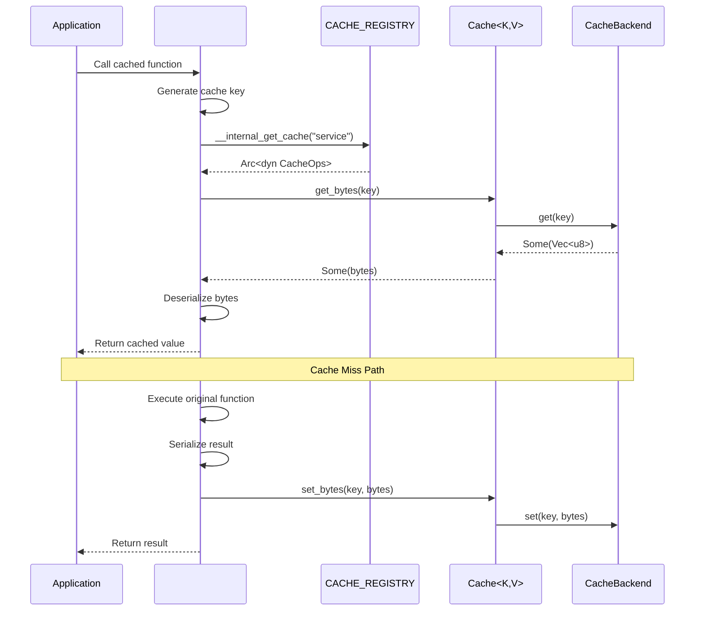
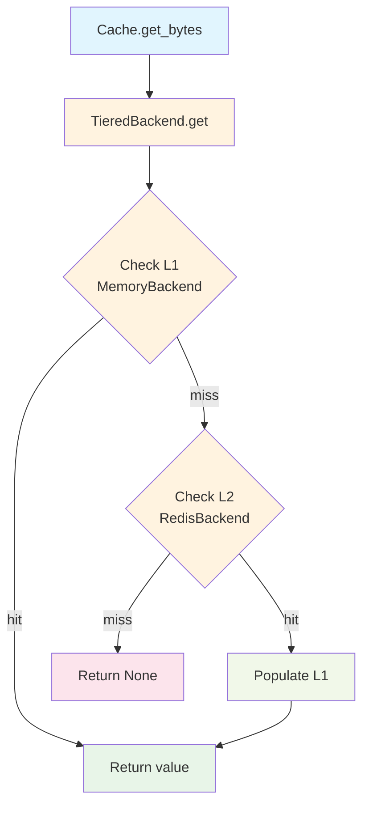
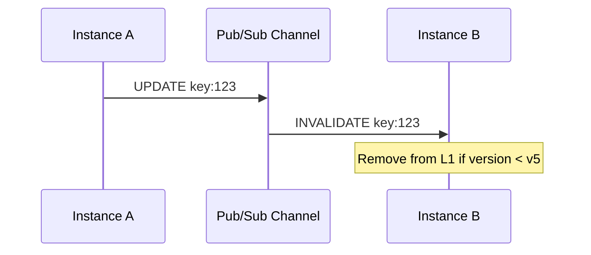
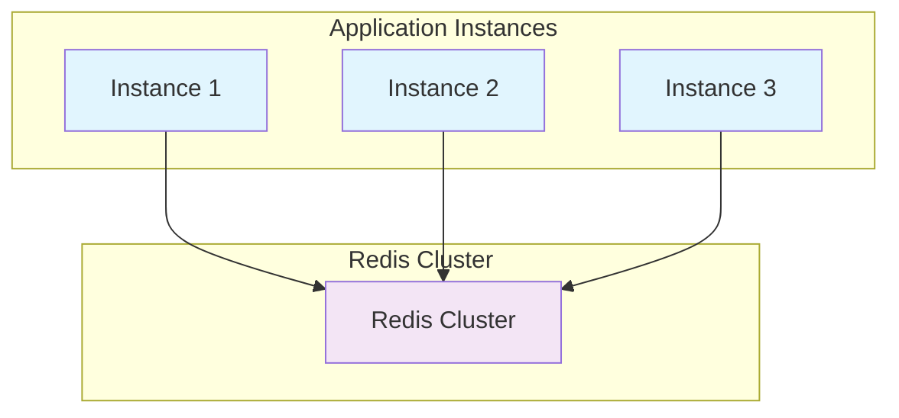

# Architecture Documentation

This document describes the architecture, design decisions, and technical details of the Oxcache library.

## Table of Contents

- [Overview](#overview)
- [Architecture](#architecture)
- [Components](#components)
- [Data Flow](#data-flow)
- [Consistency Model](#consistency-model)
- [Failure Handling](#failure-handling)
- [Performance Optimization](#performance-optimization)
- [Security](#security)
- [Scalability](#scalability)

## Overview

Oxcache is a multi-level caching system designed for high-performance, production-ready applications. It combines:

- **L1 Cache**: In-memory cache using Moka (LRU/TinyLFU eviction)
- **L2 Cache**: Distributed cache using Redis
- **Sync Layer**: Pub/Sub-based invalidation for multi-instance consistency
- **Recovery Layer**: Write-ahead log (WAL) for durability and failover

### Design Goals

1. **Performance**: L1 latency 50-100ns, L2 latency 1-5ms (P99, varies by environment)
2. **Reliability**: Automatic failover, data consistency across instances
3. **Usability**: Zero-boilerplate integration via `#[cached]` macro
4. **Observability**: Comprehensive metrics, tracing, and health checks
5. **Security**: Protection against cache penetration and DoS attacks

## Architecture

```mermaid
graph TD
    A[Application<br/>Functions with #[cached]] --> B[Internal Registry<br/>CACHE_REGISTRY]
    
    B --> C[Cache&lt;K,V&gt;]
    B --> D[Backend Layer]
    
    C --> E[CacheBuilder]
    D --> F[MemoryBackend]
    D --> G[RedisBackend]
    D --> H[TieredBackend]
    
    F --> I[L1 Cache<br/>Moka]
    G --> J[L2 Cache<br/>Redis]
    H --> I
    H --> J
    
    D --> K[Sync Layer<br/>Pub/Sub]
    D --> L[Recovery<br/>WAL]
    
    K --> M[Pub/Sub Channel]
    L --> N[WAL Storage]
    
    style A fill:#e1f5fe
    style B fill:#f3e5f5
    style C fill:#e8f5e8
    style D fill:#fff3e0
    style E fill:#f1f8e9
    style F fill:#e8f5e8
    style G fill:#fdf2e9
    style H fill:#fff3e0
    style I fill:#f1f8e9
    style J fill:#fdf2e9
    style K fill:#fff3e0
    style L fill:#fce4ec
    style M fill:#fff3e0
    style N fill:#fce4ec
```

## Components

### 1. Internal Cache Registry (`internal.rs`)

**Responsibility**: Central registry for all cache instances used by the `#[cached]` macro

**Data Structures**:
- `CACHE_REGISTRY: OnceLock<DashMap<String, Arc<dyn CacheOps>>>`: Thread-safe service-to-client mapping

**Key Internal Functions**:
- `__internal_register_cache(service_name, cache)`: Register a cache instance
- `__internal_get_cache(service_name)`: Retrieve cache by service name
- `__internal_remove_cache(service_name)`: Remove a cache registration
- `__internal_clear_all()`: Shutdown and clear all registered caches

**Thread Safety**: Uses `DashMap` for lock-free concurrent access and `OnceLock` for lazy initialization

**Usage Pattern**:
```rust
// Register cache for #[cached] macro
let cache: Cache<String, User> = Cache::new().await?;
cache.register_for_macro("my_service").await;

// Macro automatically retrieves cache from registry
#[cached(service = "my_service", ttl = 300)]
async fn get_user(id: u64) -> User { ... }
```

### 2. Feature Information (`manager.rs`)

**Responsibility**: Provide runtime feature status information

**Public Functions**:
- `get_l1_feature_info()`: Get L1 cache feature status
- `get_l2_feature_info()`: Get L2 cache feature status
- `get_all_feature_info()`: Get all feature status
- `is_l1_enabled()`: Check if L1 is enabled
- `is_l2_enabled()`: Check if L2 is enabled

### 3. Cache Interface (`cache.rs`)

**Responsibility**: Unified type-safe cache interface

**Key Types**:
- `Cache<K, V>`: Main cache type with generic key and value types
- `CacheBuilder`: Builder for creating configured cache instances
- `BackendBuilder`: Builder for creating cache backends

**Key Methods**:
- `new()`: Create cache with default memory backend
- `builder()`: Create cache builder for advanced configuration
- `get(key)`: Get value from cache
- `set(key, value)`: Set value in cache
- `get_or(key, fallback)`: Get value or compute using fallback
- `register_for_macro(service_name)`: Register for #[cached] macro
- `shutdown()`: Shutdown cache and release resources

**Thread Safety**: All operations are thread-safe via Arc<dyn CacheBackend>

**Usage Pattern**:
```rust
// Create cache using Builder
use oxcache::{Cache, CacheBuilder};
use oxcache::builder::BackendBuilder;

let cache: Cache<String, User> = CacheBuilder::new()
    .backend(
        BackendBuilder::tiered()
            .l1_capacity(10000)
            .l2_connection_string("redis://localhost:6379")
    )
    .build()
    .await?;

// Register for macro usage
cache.register_for_macro("my_service").await;

// Use cache
cache.set(&"user:1".to_string(), &user).await?;
let user: Option<User> = cache.get(&"user:1".to_string()).await?;
```

### 2. L1 Cache Backend (`backend/l1.rs`)

**Technology**: Moka (high-performance concurrent cache)

**Eviction Policy**: TinyLFU (Least Frequently Used with frequency sketch)

**Configuration**:
```rust
pub struct L1Config {
    pub max_capacity: u64,         // Maximum number of entries
    pub max_key_length: usize,      // Maximum key length in bytes
    pub max_value_size: usize,      // Maximum value size in bytes
    pub cleanup_interval_secs: u64,  // Cleanup interval in seconds
}
```

**Performance Characteristics**:
- Read: 50-100ns (P99, in-memory)
- Write: 50-200ns (P99, in-memory)
- Thread-safe with lock-free design

> **Note**: Performance varies based on hardware, data size, and access patterns

### 3. L2 Cache Backend (`backend/l2.rs`)

**Technology**: Redis (Standalone/Sentinel/Cluster)

**Connection Management**:
- Connection pooling via `connection-manager`
- Automatic reconnection on failure
- Cluster topology awareness

**Serialization**:
- JSON: Human-readable, larger size
- Bincode: Binary, smaller size, faster

**Features**:
- Batch write optimization
- Pub/Sub for invalidation
- Write-ahead logging

### 4. Backend Layer (`backend/`)

**Responsibility**: Pluggable cache backend implementations

**Backend Types**:
- `MemoryBackend`: In-memory cache using Moka
- `RedisBackend`: Redis distributed cache
- `TieredBackend`: Two-level cache (L1 + L2)

**Backend Trait**:
```rust
#[async_trait]
pub trait CacheBackend: Send + Sync {
    async fn get(&self, key: &str) -> Result<Option<Vec<u8>>>;
    async fn set(&self, key: &str, value: Vec<u8>, ttl: Option<Duration>) -> Result<()>;
    async fn delete(&self, key: &str) -> Result<()>;
    async fn exists(&self, key: &str) -> Result<bool>;
    async fn clear(&self) -> Result<()>;
    async fn stats(&self) -> Result<HashMap<String, String>>;
    async fn health_check(&self) -> Result<bool>;
    async fn close(&self) -> Result<()>;
}
```

**Tiered Backend Read Path**:
```
1. Check L1 cache (MemoryBackend)
2. If hit → Return value
3. If miss → Check L2 cache (RedisBackend)
4. If L2 hit → Populate L1 → Return value
5. If L2 miss → Return None
```

**Tiered Backend Write Path**:
```
1. Write to L1 cache (async, immediate)
2. Write to L2 cache (async, can be batched)
3. Write to WAL for durability
4. Publish invalidation if needed
```

### 5. Client Layer (`client/`)

**Responsibility**: Cache client implementations and database integration

**Client Types**:
- `L1Client`: L1 cache client
- `L2Client`: L2 cache client
- `TieredCacheClient`: Two-level cache client
- `DbLoader`: Database loader for cache-aside pattern

**CacheOps Trait**:
```rust
#[async_trait]
pub trait CacheOps: Send + Sync {
    async fn get_bytes(&self, key: &str) -> Result<Option<Vec<u8>>>;
    async fn set_bytes(&self, key: &str, value: Vec<u8>, ttl: Option<u64>) -> Result<()>;
    async fn set_l1_bytes(&self, key: &str, value: Vec<u8>, ttl: Option<u64>) -> Result<()>;
    async fn set_l2_bytes(&self, key: &str, value: Vec<u8>, ttl: Option<u64>) -> Result<()>;
    async fn delete(&self, key: &str) -> Result<()>;
    async fn clear_l1(&self) -> Result<()>;
    async fn clear_l2(&self) -> Result<()>;
    async fn shutdown(&self) -> Result<()>;
    fn serializer(&self) -> &SerializerEnum;
    fn as_any(&self) -> &dyn Any;
    fn into_any_arc(self: Arc<Self>) -> Arc<dyn Any + Send + Sync>;
}
```

### 6. Batch Writer (`sync/batch_writer.rs`)

**Purpose**: Optimize L2 write throughput by batching multiple operations

**Algorithm**:
1. Accumulate operations in buffer
2. Flush when buffer size > threshold OR timeout
3. Use Redis MSET for batch writes

**Performance**: 10-50x improvement in throughput for write-heavy workloads

### 7. Invalidation Service (`sync/invalidation.rs`)

**Purpose**: Ensure consistency across multiple instances

**Protocol**:
```
1. Instance A updates key "user:123"
2. Instance A publishes invalidation message:
   {
     "key": "user:123",
     "version": "v5",
     "timestamp": 1704921600
   }
3. Instance B receives message via Pub/Sub
4. Instance B removes "user:123" from L1 if version < v5
```

**Version-Based Invalidation**: Prevents race conditions and thundering herd

### 8. Recovery Layer (`recovery/`)

#### Write-Ahead Log (WAL) (`wal.rs`)

**Purpose**: Ensure no data loss during Redis failures

**Structure**:
```
WAL Entry:
{
  "type": "SET" | "DELETE",
  "key": "user:123",
  "value": "...",  // Base64 encoded
  "timestamp": 1704921600
}
```

**Replay Logic**:
```
1. Redis recovers
2. System reads WAL entries
3. Replay entries to Redis in order
4. Clear WAL after successful replay
```

#### Health Checker (`health.rs`)

**Health Checks**:
- L1 availability (memory usage)
- L2 connectivity (ping/pong)
- WAL size (disk space)

**Degradation Modes**:
- **L2 failure**: Operate in L1-only mode
- **Low memory**: Reduce L1 capacity
- **Disk full**: Pause WAL, log warning

### 9. Database Integration (`database/`)

**Supported Databases**:
- MySQL (`sqlx-mysql`)
- PostgreSQL (`sqlx-postgres`)
- SQLite (`sqlx-sqlite`)

**Partition Support**:
```rust
pub enum PartitionStrategy {
    TimeBased(TimeUnit),  // Partition by time
    HashBased(u32),       // Partition by hash
    Custom(Box<dyn Fn(&str) -> String>),  // Custom logic
}
```

**Cache-Aside Pattern**:
```
1. Check cache
2. If miss, load from database
3. Populate cache
4. Return value
```

### 10. Security Features

#### Bloom Filter (`bloom_filter.rs`)

**Purpose**: Prevent cache penetration attacks

**Algorithm**: MurmurHash3 with bit array

**Configuration**:
```rust
pub struct BloomFilterConfig {
    pub expected_elements: u64,
    pub false_positive_rate: f64,
}
```

**Usage**:
```
Before cache lookup → Check Bloom filter
If filter says "definitely not" → Skip cache, go to DB
If filter says "maybe" → Check cache
```

#### Rate Limiter (`rate_limiting.rs`)

**Purpose**: Prevent DoS attacks

**Algorithm**: Token bucket with refill

**Configuration**:
```rust
pub struct RateLimitConfig {
    pub max_requests_per_second: u32,
    pub burst_capacity: u32,
    pub block_duration_secs: u64,
}
```

## Data Flow

### #[cached] Macro Workflow

The `#[cached]` macro provides zero-boilerplate caching by automatically handling cache lookup, storage, and serialization:



**Macro Generated Code Structure**:
```rust
#[cached(service = "my_service", ttl = 300)]
async fn get_user(id: u64) -> Result<User> {
    // ... original function body ...
}
```

Expands to approximately:
```rust
async fn get_user(id: u64) -> Result<User> {
    let cache_key = format!("my_service:get_user:{:?}", id);

    // Get cache from registry
    let client = match oxcache::__internal_get_cache("my_service") {
        Some(c) => c,
        None => return { /* original code */ }.await,
    };

    // Try to get from cache
    if let Ok(Some(bytes)) = client.get_bytes(&cache_key).await {
        if let Ok(val) = client.serializer().deserialize::<User>(&bytes) {
            return Ok(val);
        }
    }

    // Execute original function
    let result = { /* original code */ }.await;

    // Cache result if successful
    if let Ok(ref val) = result {
        if let Ok(bytes) = client.serializer().serialize(val) {
            let _ = client.set_bytes(&cache_key, bytes, Some(300)).await;
        }
    }

    result
}
```

### Read Operation (with #[cached] macro)

```mermaid
flowchart TD
    A[Application<br/>#[cached] function] --> B[Generate cache key]
    B --> C[Get cache from<br/>CACHE_REGISTRY]
    C --> D{Cache found?}
    D -->|no| E[Execute function<br/>uncached]
    D -->|yes| F[get_bytes from cache]
    F --> G{Cache hit?}
    G -->|yes| H[Deserialize value]
    G -->|no| E
    H --> I[Return cached value]
    E --> J[Execute original code]
    J --> K{Result Ok?}
    K -->|yes| L[Serialize result]
    L --> M[set_bytes to cache]
    K -->|no| N[Return error]
    M --> O[Return result]
    
    style A fill:#e1f5fe
    style B fill:#fff3e0
    style C fill:#f3e5f5
    style D fill:#ffeb3b
    style E fill:#fce4ec
    style F fill:#fff3e0
    style G fill:#ffeb3b
    style H fill:#f1f8e9
    style I fill:#e8f5e8
    style J fill:#fce4ec
    style K fill:#ffeb3b
    style L fill:#f1f8e9
    style M fill:#fff3e0
    style N fill:#fce4ec
    style O fill:#e8f5e8
```

### Tiered Backend Read Path



### Write Operation (with #[cached] macro)

```mermaid
flowchart TD
    A[Application<br/>#[cached] function] --> B[Execute function]
    B --> C[Result Ok?]
    C -->|no| D[Return error]
    C -->|yes| E[Serialize result]
    E --> F[Get cache from<br/>CACHE_REGISTRY]
    F --> G[set_bytes to cache]
    G --> H{Cache type?}
    H -->|l1-only| I[set_l1_bytes]
    H -->|l2-only| J[set_l2_bytes]
    H -->|two-level| K[set_bytes to both]
    I --> L[Return result]
    J --> L
    K --> M[Write to L1<br/>immediate]
    M --> N[Batch write to L2]
    N --> L
    
    style A fill:#e1f5fe
    style B fill:#fce4ec
    style C fill:#ffeb3b
    style D fill:#fce4ec
    style E fill:#f1f8e9
    style F fill:#f3e5f5
    style G fill:#fff3e0
    style H fill:#ffeb3b
    style I fill:#f1f8e9
    style J fill:#fdf2e9
    style K fill:#fff3e0
    style L fill:#e8f5e8
    style M fill:#f1f8e9
    style N fill:#fdf2e9
```

## Consistency Model

### Eventual Consistency

Oxcache provides **eventual consistency** across instances:

- **Strong consistency within instance**: L1 + L2 are always consistent
- **Eventual consistency across instances**: Propagation delay of < 100ms typically

### Invalidation Propagation



### Versioning Scheme

```
Version format: "v{timestamp}_{instance_id}"

Example: "v1704921600_i32"

Compare versions lexicographically:
- v1704921600_i32 < v1704921601_i45  (newer wins)
```

## Failure Handling

### Redis Failure

**Detection**:
- Connection timeout
- Ping failure
- Connection closed by remote

**Recovery**:
```
1. Switch to L1-only mode
2. Log warning
3. Continue serving from L1
4. Reconnect in background
5. Replay WAL on reconnect
6. Resume normal operation
```

### Network Partition

**Behavior**:
- Instances continue operating with local data
- Invalidation messages queued
- On recovery: Reconcile using versioning

### Disk Failure (WAL)

**Degradation**:
- Pause WAL writes
- Log critical error
- Continue operating (less durable)

## Performance Optimization

### Optimization Techniques

1. **Batch Write**: Buffer multiple operations, flush with MSET
2. **Connection Pooling**: Reuse Redis connections
3. **Lock-Free L1**: Moka's concurrent cache design
4. **Binary Serialization**: Bincode for smaller payload size
5. **AHash**: High-performance hash algorithm

### Performance Tuning

```toml
[optimization]
# L1 cache
l1_max_capacity = 10000
l1_time_to_idle = 600

# L2 cache
l2_batch_size = 100
l2_batch_timeout_ms = 50

# Serialization
serialization_type = "bincode"  # "json" or "bincode"
```

### Benchmark Results

> Test environment: M1 Pro, 16GB RAM, macOS, Redis 7.0
> 
> **Note**: Performance varies based on hardware, network conditions, and data size.

| Operation | Throughput | Latency (P99) |
|-----------|------------|---------------|
| L1 Read | 5-10M ops/sec | 50-100ns |
| L1 Write | 2-5M ops/sec | 50-200ns |
| L2 Read | 50-100K ops/sec | 1-5ms |
| L2 Write (batch) | 200-500K ops/sec | 1-10ms |

## Security

### Threat Model

1. **Cache Penetration**: Attacker requests non-existent keys
2. **Cache Breakdown**: Hot key expires, many requests hit DB
3. **DoS Attack**: High request rate overwhelms system

### Defenses

1. **Bloom Filter**: Prevent cache penetration
2. **Cache Locking**: Prevent cache breakdown
3. **Rate Limiting**: Prevent DoS attacks
4. **Sensitive Data Redaction**: Auto-redact in logs

### Best Practices

1. **Key Design**: Use stable, predictable keys
2. **TTL Strategy**: Set appropriate TTL based on data volatility
3. **Access Control**: Use Redis AUTH + TLS
4. **Monitoring**: Track metrics for anomalies

## Scalability

### Horizontal Scaling



### Vertical Scaling

- Increase L1 capacity (more memory)
- Use faster Redis (SSD, dedicated server)
- Enable Redis persistence (AOF + RDB)

### Partitioning

Database partitioning for large datasets:
```rust
PartitionConfig::time_based(TimeUnit::Month)  // By month
PartitionConfig::hash_based(16)                // 16 shards
```

## Future Enhancements

1. **L3 Cache**: Add support for other distributed caches (Cassandra, Memcached)
2. **Adaptive TTL**: Machine learning-based TTL optimization
3. **Geo-Distribution**: Multi-region replication
4. **Cache Warming**: Intelligent warmup strategies
5. **Compression**: Zstd compression for large values

## References

- [Moka Documentation](https://github.com/moka-rs/moka)
- [Redis Documentation](https://redis.io/documentation)
- [TinyLFU Paper](https://arxiv.org/abs/1512.00757)
- [Bloom Filter](https://en.wikipedia.org/wiki/Bloom_filter)
