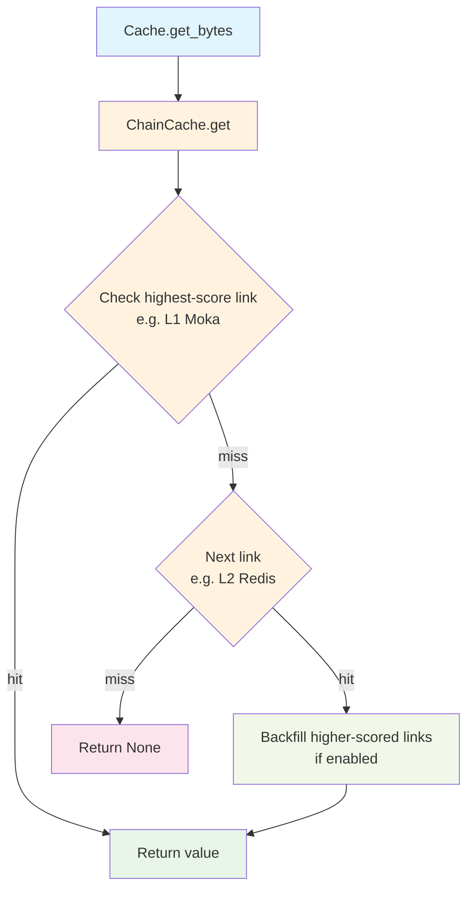
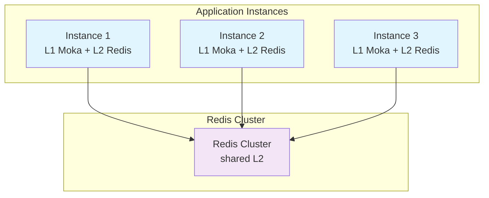

# Architecture Documentation

This document describes the architecture, design decisions, and technical details of the Oxcache library (v0.3.2).

## Table of Contents

- [Overview](#overview)
- [Architecture](#architecture)
- [Components](#components)
- [Data Flow](#data-flow)
- [Consistency Model](#consistency-model)
- [Failure Handling](#failure-handling)
- [Performance Optimization](#performance-optimization)
- [Security](#security)
- [Scalability](#scalability)
- [Feature Flags](#feature-flags)

## Overview

Oxcache is a multi-level caching system designed for high-performance, production-ready applications. It combines:

- **L1 Cache**: In-memory cache using Moka (LRU/TinyLFU eviction) or DashMap
- **L2 Cache**: Distributed cache using Redis (Standalone/Sentinel/Cluster)
- **ChainCache**: Score-ordered multi-backend chain with backfill (replaces the legacy "tiered backend" concept)
- **Sync API**: Synchronous mirror of the async API (`get_sync` / `set_sync` / …) for non-async call sites
- **Bloom Filter**: Optional decorator that short-circuits negative queries before they hit the inner backend
- **Per-entry TTL**: Universal `ttl` / `expire` operations honored by every backend (Moka / DashMap / Redis / Mock / Chain / Bloom)

> **Note (v0.3.2)**: The Pub/Sub-based cross-instance invalidation layer and the Write-Ahead-Log (WAL) recovery layer referenced by pre-0.3.0 documentation are **not** part of the 0.3.2 codebase. Multi-instance consistency is the responsibility of the application (e.g. via Redis keyspace notifications or external invalidation), and durability is delegated to the Redis backend itself.

### Design Goals

1. **Performance**: L1 latency 50-100ns, L2 latency 1-5ms (P99, varies by environment)
2. **Reliability**: Backend trait hierarchy lets callers degrade gracefully when L2 is unreachable
3. **Usability**: Zero-boilerplate integration via `#[cached]` macro
4. **Observability**: Metrics (`CacheStats`, Prometheus/JSON export), tracing spans, health checks
5. **Security**: Input validation for Redis keys / Lua scripts / SCAN patterns, sensitive-data redaction

## Architecture

```mermaid
graph TD
    A[Application<br/>Functions with #[cached]] --> B[Internal Registry<br/>MACRO_CACHES]

    B --> C[Cache&lt;K,V&gt;]
    B --> D[Backend Layer]

    C --> E[CacheBuilder]
    D --> F[MokaMemoryBackend<br/>L1]
    D --> G[RedisBackend<br/>L2]
    D --> H[ChainCache<br/>multi-tier]
    D --> O[BloomFilterBackend<br/>decorator]

    H --> F
    H --> G

    C --> P[Sync API<br/>get_sync / set_sync]
    P --> Q[SyncCacheBackend<br/>trait]

    style A fill:#e1f5fe
    style B fill:#f3e5f5
    style C fill:#e8f5e8
    style D fill:#fff3e0
    style E fill:#f1f8e9
    style F fill:#e8f5e8
    style G fill:#fdf2e9
    style H fill:#fff3e0
    style O fill:#fce4ec
    style P fill:#f1f8e9
    style Q fill:#fff3e0
```

## Components

### 1. Internal Cache Registry (`internal.rs`)

**Responsibility**: Central registry for cache instances used by the `#[cached]` macro.

**Data Structure**:

```rust
type MacroCacheMap = Mutex<HashMap<String, Arc<Cache<String, Vec<u8>>>>>;
static MACRO_CACHES: once_cell::sync::OnceCell<MacroCacheMap> = ...;
```

The registry stores **concrete `Cache<String, Vec<u8>>` Arc handles** (not `dyn CacheOps`), keyed by service name. A `Mutex<HashMap<…>>` is used instead of `DashMap`.

**Public Internal Functions** (only two; there is no `__internal_remove_cache` or `__internal_clear_all` in 0.3.2):

- `__internal_register_cache(name, cache: Arc<Cache<String, Vec<u8>>>)` — register/overwrite a cache for a service (async, no-op if the mutex is poisoned)
- `__internal_get_cache(name) -> Option<Arc<Cache<String, Vec<u8>>>>` — retrieve a cache by service name (sync)

Both are re-exported from `oxcache::internal` and `oxcache::__internal_get_cache` is re-exported at the crate root for macro-generated code.

**Thread Safety**: `Mutex<HashMap<…>>` guarded by `once_cell::sync::OnceCell` for lazy initialization. The mutex is held only for the duration of the map mutation/lookup (no await while held).

**Usage Pattern**:

```rust
use oxcache::Cache;

// Build and register a cache for the #[cached] macro
let cache: Cache<String, Vec<u8>> = Cache::builder().build().await?;
oxcache::internal::__internal_register_cache("my_service", Arc::new(cache)).await;

// Or use the convenience method on Cache:
cache.register_for_macro("my_service").await?;

// Macro-generated code retrieves the cache from the registry:
#[cached(service = "my_service", ttl = 300)]
async fn get_user(id: u64) -> User { /* ... */ }
```

### 2. Cache Interface (`cache/`)

**Responsibility**: Unified type-safe cache interface.

**Module Structure**:
- `cache/mod.rs` - Module root and re-exports
- `cache/builder/` - `CacheBuilder` implementation
- `cache/api/` - Cache operation implementations (`basic_ops`, `batch_ops`, `bytes_ops`, `macros`)
- `cache/chain.rs` - `ChainCache`, `ChainLink`, `ChainCacheBuilder`
- `cache/interface.rs` - `UnifiedCache` trait

**Key Types**:
- `Cache<K, V>`: Main cache type with generic key (`K: CacheKey`) and value (`V: Serialize + DeserializeOwned`) types
- `CacheBuilder<K, V>`: Builder for creating configured cache instances
- `ChainCache` / `ChainLink` / `ChainCacheBuilder`: Multi-level cache chain (score-ordered)

**Construction Methods on `Cache<K, V>`**:

| Method | Feature | Description |
|---|---|---|
| `Cache::memory().await` | `memory` | Convenience: default Moka backend |
| `Cache::redis(url).await` | `redis` | Convenience: Redis backend (TLS enforced) |
| `Cache::builder()` | — | Start a `CacheBuilder<K, V>` |
| `Cache::with_dependencies(backend: Arc<dyn CacheBackend>)` | — | Wrap any backend in a `Cache` |
| `Cache::new()` | `memory` | Sync constructor (default Moka backend) |

> **Important**: `CacheBuilder` does **not** expose `.redis(url)`, `.tiered(…)`, `.with_backend(…)`, `.batch_writes(…)`, or `.auto_promote(…)` methods in 0.3.2. To compose multiple backends use `ChainCache` and inject it via `.backend_arc(Arc::new(chain))`.

**CacheBuilder API** (`Cache::builder()`):

```rust
pub fn backend_arc(self, backend: Arc<dyn CacheBackend>) -> Self;
pub fn ttl(self, ttl: Duration) -> Self;             // default TTL
pub fn tti(self, tti: Duration) -> Self;             // default TTI (Moka)
pub fn capacity(self, capacity: u64) -> Self;        // L1 capacity hint
pub fn sync_mode(self, enabled: bool) -> Self;       // enable sync API
pub async fn build(self) -> Result<Cache<K, V>>;
```

**Constraint**: `sync_mode(true)` cannot be combined with `backend_arc(Arc<dyn CacheBackend>)`. When both are set, `build()` returns `Err(CacheError::NotSupported)` (CACHE_009). This is a temporary limitation on stable Rust pending `trait_upcasting`; sync mode requires the backend to be constructed internally by the builder (e.g. via `Cache::memory()` / `Cache::redis()` paths or by omitting `backend_arc`).

**Key Async Methods**:

- `get(key) -> Result<Option<V>>`
- `set(key, value) -> Result<()>` (uses builder TTL)
- `set_with_ttl(key, value, ttl: Option<Duration>) -> Result<()>`
- `delete(key) -> Result<()>`
- `exists(key) -> Result<bool>`
- `clear() -> Result<()>`
- `get_or(key, fallback) -> Result<V>` (single-flight via `tokio::sync::Notify`)
- `ttl(key) -> Result<Option<Duration>>` — remaining TTL (None if no per-entry TTL or key absent)
- `expire(key, ttl) -> Result<bool>` — update TTL of an existing key without touching its value
- `get_bytes(key) -> Result<Option<Vec<u8>>>` / `set_bytes(key, bytes, ttl)` — raw byte ops
- `len() / is_empty() / capacity() / stats() / health_check() / shutdown()` — lifecycle & stats
- `register_for_macro(service_name) -> Result<()>` — register into `MACRO_CACHES`

**Sync API** (requires `sync_mode(true)` on the builder; returns `Err(NotSupported)` otherwise):

- `get_sync(key)`, `set_sync(key, value)`, `set_with_ttl_sync(key, value, ttl)`,
- `delete_sync(key)`, `exists_sync(key)`, `clear_sync()`,
- `ttl_sync(key)`, `expire_sync(key, ttl)`,
- `get_or_sync(key, fallback)` (single-flight via `std::sync::Condvar`)

**Thread Safety**: All operations are thread-safe via `Arc<dyn CacheBackend>` (and `Option<Arc<dyn SyncCacheBackend>>` for the sync path).

**Usage Pattern**:

```rust
use oxcache::Cache;
use std::time::Duration;

// 1) Simple memory cache (default)
let cache: Cache<String, User> = Cache::builder()
    .ttl(Duration::from_secs(3600))
    .capacity(10000)
    .build()
    .await?;

// 2) Redis cache (TLS enforced unless OXCACHE_ALLOW_INSECURE_REDIS is set)
let cache: Cache<String, User> = Cache::redis("rediss://localhost:6379").await?;

// 3) Inject any custom backend
let backend: Arc<dyn oxcache::backend::CacheBackend> = /* ... */;
let cache: Cache<String, User> = Cache::builder()
    .backend_arc(backend)
    .ttl(Duration::from_secs(3600))
    .build()
    .await?;

// 4) Sync API (requires multi_thread tokio runtime for Moka)
let cache: Cache<String, String> = Cache::builder()
    .sync_mode(true)
    .build()
    .await?;
cache.set_sync(&"k".to_string(), &"v".to_string())?;
let v = cache.get_sync(&"k".to_string())?;

// Register for #[cached] macro usage
cache.register_for_macro("my_service").await?;
```

### 3. Backend Layer (`backend/`)

**Responsibility**: Pluggable cache backend implementations following an ISP-compliant trait hierarchy.

**Module Structure**:
- `backend/mod.rs` - Module root and re-exports
- `backend/interface.rs` - `CacheReader` / `CacheWriter` / `CacheConnector` / `CacheBackend` and their sync mirrors
- `backend/memory/` - Memory backend implementations (Moka, DashMap) and the Redis client
- `backend/score.rs` - `BackendScore` / `Scores` constants used by `ChainCache`
- `backend/config_validation.rs` - Redis URL / Sentinel config validation

**Backend Types** (re-exported at `oxcache::backend::*` and some at crate root):

| Type | Path | Feature | Description |
|---|---|---|---|
| `MokaMemoryBackend` | `oxcache::backend::MokaMemoryBackend` | `memory` | L1 cache, Moka (LRU/TinyLFU) |
| `DashMapMemoryBackend` | `oxcache::backend::DashMapMemoryBackend` | `memory` | Pure in-memory concurrent cache |
| `RedisBackend` | `oxcache::backend::RedisBackend` | `redis` | L2 distributed cache |
| `RedisBackendBuilder` | `oxcache::backend::RedisBackendBuilder` | `redis` | Builder for Redis (mode, pool, TLS) |
| `ChainCache` | `oxcache::cache::chain::ChainCache` | — | Score-ordered multi-backend chain |
| `BloomFilterBackend` | `oxcache::features::bloom_filter::BloomFilterBackend` | `bloom-filter` | Negative-query filter decorator |

**Async Trait Hierarchy** (`backend/interface.rs`):

```rust
#[async_trait]
pub trait CacheReader: Send + Sync + 'static {
    async fn get(&self, key: &str) -> Result<Option<Vec<u8>>>;
    async fn exists(&self, key: &str) -> Result<bool>;
    async fn ttl(&self, key: &str) -> Result<Option<Duration>>;
    async fn len(&self) -> Result<u64>;
    async fn is_empty(&self) -> Result<bool> { /* default impl */ }
    async fn capacity(&self) -> Result<u64>;
    async fn stats(&self) -> Result<HashMap<String, String>>;
    async fn get_many(&self, keys: &[String]) -> Result<Vec<Option<Vec<u8>>>> { /* default */ }
}

#[async_trait]
pub trait CacheWriter: Send + Sync + 'static {
    async fn set(&self, key: &str, value: Vec<u8>, ttl: Option<Duration>) -> Result<()>;
    async fn delete(&self, key: &str) -> Result<()>;
    async fn clear(&self) -> Result<()>;
    async fn expire(&self, key: &str, ttl: Duration) -> Result<bool>;
    async fn set_many(&self, items: &[(String, Vec<u8>, Option<Duration>)]) -> Result<()> { /* default */ }
    async fn delete_many(&self, keys: &[String]) -> Result<()> { /* default */ }
}

#[async_trait]
pub trait CacheConnector: Send + Sync + 'static {
    async fn health_check(&self) -> Result<()>;
    async fn shutdown(&self);
    fn backend_kind(&self) -> BackendKind;
    #[cfg(feature = "lua-script")]
    fn as_lua_executor(&self) -> Option<&dyn LuaExecutor> { None }
}

#[async_trait]
pub trait CacheBackend: CacheReader + CacheWriter + CacheConnector + 'static {}
// Blanket impl: any T satisfying the three supertraits is a CacheBackend.
```

**Sync Trait Hierarchy** (mirrors the async one, without `async`/`#[async_trait]`):

```rust
pub trait SyncCacheReader: Send + Sync + 'static { /* sync fns */ }
pub trait SyncCacheWriter: Send + Sync + 'static { /* sync fns */ }
pub trait SyncCacheConnector: Send + Sync + 'static { /* sync fns */ }
pub trait SyncCacheBackend: SyncCacheReader + SyncCacheWriter + SyncCacheConnector + 'static {}
```

A backend opts into the sync API by implementing the sync traits in addition to the async ones. `Cache<K, V>::get_sync` then dispatches through `Arc<dyn SyncCacheBackend>`. **The async and sync hierarchies are intentionally separate** so a backend can support one without the other, and so the async trait object stays object-safe (no `block_in_place` on the async hot path).

**`BackendKind` enum** (`Moka | DashMap | Redis | Chain | Mock | Unknown`) is returned by `backend_kind()` for runtime identification without `as_any()`.

**ChainCache Read Path** (replaces the legacy "TieredBackend"):

```
1. Iterate ChainLinks from highest score (L1) to lowest (L2)
2. On hit → return value
3. On miss → continue to next link
4. After a hit on a non-highest link, if backfill is enabled,
   asynchronously populate the higher-scored (closer to L1) links
```

**ChainCache Write Path**:

```
1. Write to all links whose score is <= the writer threshold
   (typically all non-persistent + the persistent writer)
2. Persistent backends receive the write for durability
3. No WAL, no Pub/Sub publish (those layers are not in 0.3.2)
```

### 4. Features Module (`features/`)

**Responsibility**: Optional capabilities and runtime feature information.

**Key Items**:
- `features::bloom_filter::BloomFilter` — probabilistic data structure (`new(capacity, fpr)`, `add`, `contains`, `clear`, `len`, `is_empty`)
- `features::bloom_filter::BloomFilterBackend` — decorator wrapping any `CacheBackend`; on `get`, returns `Ok(None)` immediately if the key is not in the Bloom filter
- `get_l1_feature_info() / get_l2_feature_info() / get_all_feature_info()`
- `is_l1_enabled() / is_l2_enabled()`

### 5. Infrastructure Module (`infra/`)

**Responsibility**: Metrics, serialization, and key validation utilities.

**Sub-modules**:
- `infra/metrics/backend.rs` — `MetricsCollector`, `LatencyHistogram`, `OperationCounter`, `FullMetrics`
- `infra/metrics/snapshot.rs` — `CacheStats`
- `infra/metrics/export.rs` — `export_json_format`, `export_prometheus_format`, `get_enhanced_stats`
- `infra/metrics/unified.rs` — `UnifiedMetrics`, atomic counters, histogram data
- `infra/serialization/` — JSON serializer (`JsonSerializer`) and `UnifiedSerializer` (JSON only in 0.3.2)
- `infra::validate_cache_key(key)` — key validation convenience

**Crate-Root Re-exports** (when `metrics` or `full` feature is on):

```rust
pub use infra::{export_json_format, export_prometheus_format, get_enhanced_stats, CacheStats};
```

**Important**: `MetricsCollector` is **NOT** re-exported at the crate root. It lives at `oxcache::infra::metrics::backend::MetricsCollector::new() -> Result<Self>` (note: takes no arguments in 0.3.2, returns `Result`).

**Serialization**: Only **JSON** is supported in 0.3.2 (`serialization` feature pulls in `serde` + `serde_json`). Bincode/MessagePack/CBOR are not implemented. A `MAX_JSON_DEPTH` constant guards against deeply-nested JSON DoS during deserialization.

### 6. Security Module (`security/`)

**Responsibility**: Input validation and sensitive-data redaction. The module itself is `pub(crate)` — callers must use the **crate-root re-exports**.

**Sub-modules**:
- `security/validation.rs` - Redis key, Lua script, SCAN pattern validation
- `security/redaction.rs` - Sensitive data redaction (`Redacted` wrapper)
- `security/log.rs` - Secure logging utilities
- `security/regex.rs` - Pattern matching

**Crate-Root Re-exports** (when `redis` or `full` feature is on):

```rust
pub use crate::security::{
    clamp_scan_count,
    log::{log_cache_key, sanitize_message},
    redaction::{redact_cache_key, redact_connection_string, redact_field, redact_value, Redacted},
    validate_lua_script, validate_redis_key, validate_scan_pattern,
};
```

> **Import-path note**: `oxcache::security::*` is **not** a valid path (the module is `pub(crate)`). Use `oxcache::validate_redis_key(...)` etc. directly. The function is named `validate_redis_key` (not `validate_key`).

### 7. Key Generator (`utils/`)

**Responsibility**: Cache key generation and management.

**Key Type**:
- `KeyGenerator`: Utility for generating cache keys with namespaces and prefixes (re-exported at `oxcache::KeyGenerator`)

**Key Methods**:
- `new()`: Create default key generator
- `with_namespace(ns)`: Set namespace for key isolation
- `with_prefix_str(prefix)`: Set prefix for key organization
- `generate(template, params)`: Generate key from template
- `generate_full(template, params)`: Generate key with namespace and prefix
- `validate_key(key)`: Validate key format

**Usage Pattern**:

```rust
use oxcache::KeyGenerator;

let gen = KeyGenerator::new()
    .with_namespace("myapp")
    .with_prefix_str("cache");

let key = gen.generate_full("user:{id}", &[("id", "123")]);
// Result: "myapp:cache:user:123"
```

### 8. Events Module (`core/events.rs`)

**Responsibility**: Cache event system for monitoring and hooks.

**Key Types** (re-exported at crate root):
- `CacheEventType`: Event type enum (`Hit`, `Miss`, `Set`, `Delete`, `Expire`, `Clear`, `Get`, `BatchStart`, `BatchEnd`, `Error`, `Connect`, `Disconnect`, `Custom(String)`)
- `CacheEvent`: Event data structure (builder-style construction)
- `EventPublisher`: Trait for publishing events (a `NoopPublisher` is provided for testing)

**`CacheEvent` API** (builder pattern):

```rust
let event = CacheEvent::new(CacheEventType::Hit)
    .with_key("user:123")
    .with_latency(15)
    .with_metadata("source", "l1");
```

Fields: `event_type`, `key: Option<String>`, `timestamp: u64` (ms), `latency_ms: Option<u64>`, `error: Option<String>`, `metadata: Vec<(String, String)>`.

### 9. Config Module (`config/`)

The `oxcache::config` module exists as a public module but is currently a stub (only a copyright header). The `UnifiedConfigBuilder`, `ServiceConfig`, `L1Config`, `L2Config`, and `PartitionConfig` types referenced in pre-0.3.2 documentation **do not exist** in 0.3.2. Configuration is done programmatically via `CacheBuilder` and `RedisBackendBuilder`.

## Data Flow

### #[cached] Macro Workflow

The `#[cached]` macro provides zero-boilerplate caching by automatically handling cache lookup, storage, and serialization. In 0.3.2 the only valid macro parameters are: `service`, `ttl`, `key`, `key_prefix`, `sync` (there is no `key_generator` or `cache_type` parameter).

```mermaid
sequenceDiagram
    participant App as Application
    participant Macro as #[cached] Macro
    participant Registry as MACRO_CACHES
    participant Cache as Cache&lt;String, Vec&lt;u8&gt;&gt;
    participant Backend as CacheBackend

    App->>Macro: Call cached function
    Macro->>Macro: Generate cache key (service + key / key_prefix)
    Macro->>Registry: __internal_get_cache("service")
    Registry-->>Macro: Option&lt;Arc&lt;Cache&gt;&gt;
    Macro->>Cache: get_bytes(key)
    Cache->>Backend: get(key)
    Backend-->>Cache: Option&lt;Vec&lt;u8&gt;&gt;
    Cache-->>Macro: Option&lt;bytes&gt;
    Macro->>Macro: Deserialize bytes (JSON)
    Macro-->>App: Return cached value

    Note over App,Backend: Cache Miss Path
    Macro->>Macro: Execute original function
    Macro->>Macro: Serialize result (JSON)
    Macro->>Cache: set_bytes(key, bytes, Some(ttl))
    Cache->>Backend: set(key, bytes, ttl)
    Macro-->>App: Return result
```

**Macro Generated Code Structure**:

```rust
#[cached(service = "my_service", ttl = 300)]
async fn get_user(id: u64) -> Result<User> {
    // ... original function body ...
}
```

Expands approximately to:

```rust
async fn get_user(id: u64) -> Result<User> {
    let cache_key = format!("my_service:get_user:{:?}", id);

    // Get cache from registry (sync lookup)
    let client = match oxcache::__internal_get_cache("my_service") {
        Some(c) => c,
        None => return { /* original code */ }.await,
    };

    // Try cache hit (JSON-deserialized into User)
    if let Ok(Some(bytes)) = client.get_bytes(&cache_key).await {
        if let Ok(val) = serde_json::from_slice::<User>(&bytes) {
            return Ok(val);
        }
    }

    // Execute original function
    let result = { /* original code */ }.await;

    // Cache result if successful
    if let Ok(ref val) = result {
        if let Ok(bytes) = serde_json::to_vec(val) {
            let _ = client.set_bytes(&cache_key, bytes, Some(Duration::from_secs(300))).await;
        }
    }

    result
}
```

### Read Operation (with #[cached] macro)

```mermaid
flowchart TD
    A[Application<br/>#[cached] function] --> B[Generate cache key]
    B --> C[Get cache from<br/>MACRO_CACHES]
    C --> D{Cache found?}
    D -->|no| E[Execute function<br/>uncached]
    D -->|yes| F[get_bytes from cache]
    F --> G{Cache hit?}
    G -->|yes| H[Deserialize value<br/>JSON]
    G -->|no| E
    H --> I[Return cached value]
    E --> J[Execute original code]
    J --> K{Result Ok?}
    K -->|yes| L[Serialize result<br/>JSON]
    L --> M[set_bytes to cache<br/>with TTL]
    K -->|no| N[Return error]
    M --> O[Return result]

    style A fill:#e1f5fe
    style B fill:#fff3e0
    style C fill:#f3e5f5
    style D fill:#ffeb3b
    style E fill:#fce4ec
    style F fill:#fff3e0
    style G fill:#ffeb3b
    style H fill:#f1f8e9
    style I fill:#e8f5e8
    style J fill:#fce4ec
    style K fill:#ffeb3b
    style L fill:#f1f8e9
    style M fill:#fff3e0
    style N fill:#fce4ec
    style O fill:#e8f5e8
```

### ChainCache Read Path



### Write Operation (with #[cached] macro)

```mermaid
flowchart TD
    A[Application<br/>#[cached] function] --> B[Execute function]
    B --> C[Result Ok?]
    C -->|no| D[Return error]
    C -->|yes| E[Serialize result<br/>JSON]
    E --> F[Get cache from<br/>MACRO_CACHES]
    F --> G[set_bytes to cache<br/>with TTL]
    G --> L[Return result]

    style A fill:#e1f5fe
    style B fill:#fce4ec
    style C fill:#ffeb3b
    style D fill:#fce4ec
    style E fill:#f1f8e9
    style F fill:#f3e5f5
    style G fill:#fff3e0
    style L fill:#e8f5e8
```

> **Note**: The pre-0.3.0 "set_l1_bytes / set_l2_bytes / batch-write to L2" branch has been removed. `#[cached]` calls `set_bytes` on the registered `Cache<String, Vec<u8>>`, which dispatches to whatever backend was wired in (memory, Redis, ChainCache, or BloomFilterBackend). If the backend is a `ChainCache`, the chain handles the L1+L2 write internally per its score/backfill policy.

## Consistency Model

### Single-Instance Consistency

Within a single `Cache<K, V>` instance, the configured backend defines consistency:

- **Moka / DashMap only**: Strong consistency within the process. No cross-instance coordination.
- **Redis only**: Strong consistency via Redis single-threaded command execution.
- **ChainCache (Moka + Redis)**: Read-after-write consistency within the process. The L1 cache is updated synchronously; the L2 (Redis) write completes before `set` returns. If backfill is enabled, a hit on L2 asynchronously populates L1.

### Cross-Instance Consistency

Oxcache 0.3.2 **does not** ship a built-in cross-instance invalidation layer (no Pub/Sub, no versioning scheme). Multi-instance consistency is the application's responsibility. Common patterns:

- Use Redis as the single source of truth (skip L1, or accept short-lived staleness on L1)
- Use short L1 TTLs to bound staleness
- Apply external invalidation (e.g. Redis keyspace notifications, application-level Pub/Sub) and call `cache.delete(key)` on each instance

### Single-Flight (Cache Breakdown Protection)

Both `get_or` (async) and `get_or_sync` (sync) implement single-flight: when multiple concurrent calls miss the same key, only the first caller ("leader") executes the fallback; followers block on `tokio::sync::Notify` (async) or `std::sync::Condvar` (sync) until the leader writes the result. Panic-safe guards ensure followers are released even if the leader panics.

## Failure Handling

### Redis Failure

**Detection** (via `CacheConnector::health_check()`):
- Connection timeout / refused
- `PING` failure
- Connection closed by remote

**Recovery (application-driven, not automatic)**:
Oxcache does not auto-failover between backends in 0.3.2. The application decides how to handle a Redis error:

1. `Cache::health_check().await` returns `Err(CacheError::*)` — caller can switch to a fallback code path
2. `ChainCache` continues serving L1 hits even if the L2 link errors (the miss just propagates as `None`); writes to L2 still error and surface to the caller
3. The application can wrap the cache in its own circuit-breaker / retry policy

There is no automatic "L1-only mode" switch and no WAL replay on reconnect in 0.3.2.

### Network Partition

- Each instance continues operating with its local L1 cache
- Redis writes/reads will fail and surface as `Err(CacheError::*)`
- On recovery: no automatic reconciliation (no versioning scheme in 0.3.2). The application may issue `cache.clear()` or rely on TTL expiry.

### Backend Trait Errors

All backend errors flow through `CacheError` (see `src/error.rs`). Notable variants:

| Code | Variant | Meaning |
|---|---|---|
| CACHE_001 | `L1Error` | L1 (memory) backend error |
| CACHE_002 | `L2Error` | L2 (Redis) backend error |
| CACHE_009 | `NotSupported` | Operation not supported by this backend / config (e.g. sync API without `sync_mode(true)`) |
| CACHE_010 | `InvalidInput` | Bad key / value / config input |
| CACHE_011 | `Serialization` | JSON serialization/deserialization failure |
| CACHE_013 | `Connection` | Redis connection failure |
| CACHE_024 | `Config` | Cache configuration error (`CacheConfigError`) |

The full table (CACHE_001–CACHE_024) is documented in `docs/API_REFERENCE.md`.

## Performance Optimization

### Optimization Techniques

1. **Per-entry TTL on Moka**: Uses the `moka::Expiry` trait for true per-entry TTL (overriding the builder's global TTL), avoiding the cost of separate expiry tracking.
2. **Connection Pooling**: `RedisBackend::with_pool(url, pool_size)` reuses Redis connections.
3. **Pipeline / Batch Operations**: `RedisBackend` supports `set_many` / `delete_many` / `get_many` via Redis pipelining (default trait impls loop, but `RedisBackend` overrides them). The `batch-write` feature adds buffered L2 writes via `tokio-util`.
4. **Lock-Free L1**: Moka's concurrent cache design (TinyLFU admission, LRU eviction).
5. **JSON Serialization**: Human-readable, widely supported. A `MAX_JSON_DEPTH` constant protects against deeply-nested JSON DoS.
6. **Optional Compression**: `compression` feature enables flate2 compression for large values.
7. **Single-Flight**: `get_or` / `get_or_sync` deduplicate concurrent fallback execution per key, preventing cache-breakdown thundering herds.
8. **Bloom Filter Short-Circuit**: `BloomFilterBackend` returns `Ok(None)` without hitting the inner backend when the key is not in the filter — useful for high-negative-query-ratio workloads.

### Performance Tuning

```rust
use std::time::Duration;
use oxcache::Cache;

let cache: Cache<String, User> = Cache::builder()
    .capacity(10_000)              // L1 max entries
    .ttl(Duration::from_secs(600)) // default TTL
    .tti(Duration::from_secs(300)) // idle TTL (Moka)
    .build()
    .await?;

// Redis pool sizing:
let redis = oxcache::backend::RedisBackend::with_pool(
    "rediss://localhost:6379", 16,
).await?;
```

### Benchmark Results

> Test environment: M1 Pro, 16GB RAM, macOS, Redis 7.0
>
> **Note**: Performance varies based on hardware, network conditions, and data size. Treat these as order-of-magnitude estimates.

| Operation | Throughput | Latency (P99) |
|-----------|------------|---------------|
| L1 Read | 5-10M ops/sec | 50-100ns |
| L1 Write | 2-5M ops/sec | 50-200ns |
| L2 Read | 50-100K ops/sec | 1-5ms |
| L2 Write (batch) | 200-500K ops/sec | 1-10ms |

## Security

### Threat Model

1. **Cache Penetration**: Attacker requests non-existent keys → DB load
2. **Cache Breakdown**: Hot key expires, many requests hit DB simultaneously
3. **DoS Attack**: High request rate overwhelms system
4. **SQL Injection**: Malicious patterns in Redis keys
5. **Lua Script Injection**: Dangerous commands in Lua scripts
6. **ReDoS**: Malicious SCAN patterns causing CPU exhaustion
7. **Deeply-Nested JSON DoS**: Adversarial JSON causing stack overflow during deserialization

### Defenses

1. **Single-Flight**: Prevent cache breakdown with request deduplication (`get_or` / `get_or_sync`)
2. **Input Validation**: `validate_redis_key`, `validate_lua_script`, `validate_scan_pattern`, `clamp_scan_count` (re-exported at crate root)
3. **Comment Preprocessing**: Strip Lua comments before validation to prevent bypass
4. **Sensitive Data Redaction**: `Redacted` wrapper, `redact_connection_string`, `redact_cache_key`, `redact_field`, `redact_value`
5. **JSON Depth Limit**: `MAX_JSON_DEPTH` rejects deeply-nested JSON during `get`
6. **TLS Enforcement**: `RedisBackend` requires `rediss://` URLs unless `OXCACHE_ALLOW_INSECURE_REDIS=I_UNDERSTAND_THE_RISKS` is set
7. **Bloom Filter**: Negative-query filtering before backend lookup (optional, `bloom-filter` feature)

> **Note**: There is **no built-in rate limiting** in 0.3.2. Pre-0.3.2 documentation referenced a `GlobalRateLimiter` / `RateLimitConfig`; those types are **not** present in 0.3.2. Rate limiting is the responsibility of the application or an upstream proxy.

### Input Validation

The `security` module (private; consumed via crate-root re-exports) provides:

#### Redis Key Validation (`validate_redis_key`)
- Empty key rejection
- 512KB size limit
- Dangerous character detection (`\r`, `\n`, `\0`)
- SQL injection pattern detection
- Path traversal pattern detection

#### Lua Script Validation (`validate_lua_script`)
- 10KB script length limit
- 100 key limit
- Dangerous command blocking: `FLUSHALL`, `FLUSHDB`, `KEYS`, `SHUTDOWN`, `DEBUG`, `CONFIG`, `SAVE`, `BGSAVE`, `MONITOR`
- Comment preprocessing to prevent bypass

#### SCAN Pattern Validation (`validate_scan_pattern`)
- 256 character length limit
- 10 wildcard limit
- `clamp_scan_count(count)` clamps the count parameter to 1-1000

### Best Practices

1. **Key Design**: Use stable, predictable keys (use `KeyGenerator` for namespacing)
2. **TTL Strategy**: Set appropriate TTL based on data volatility; use `cache.ttl(&key)` to read existing TTL before update-with-preserve workflows
3. **Access Control**: Use Redis AUTH + TLS (`rediss://` URL)
4. **Monitoring**: Track `CacheStats` (hit rates, op counters, latency histograms) via `get_enhanced_stats` / `export_prometheus_format`
5. **Sync API**: Only enable `sync_mode(true)` when running on a `multi_thread` tokio runtime (required by Moka's sync interface)

## Scalability

### Horizontal Scaling



Each instance keeps its own L1 (Moka) and shares the L2 (Redis). Cross-instance L1 invalidation is **not** automatic in 0.3.2 — see [Consistency Model](#consistency-model).

### Vertical Scaling

- Increase L1 capacity via `CacheBuilder::capacity(u64)` (more memory)
- Use a faster / dedicated Redis instance
- Enable Redis persistence (AOF + RDB) on the Redis side
- Increase the Redis connection pool via `RedisBackend::with_pool(url, pool_size)`

### Partitioning

Oxcache 0.3.2 does not ship a built-in partitioning config (the `PartitionConfig` / `TimeUnit` types referenced in pre-0.3.2 docs do not exist). Applications can implement their own partitioning by routing keys to different `Cache<K, V>` instances (each backed by a different Redis db / cluster).

## Feature Flags

### Tiered Feature Sets

- **`minimal`**: L1 memory cache only (`memory` + `tracing` + `metrics` + `serialization` + `chrono`)
- **`core`**: L1 + L2 Redis (`minimal` + `redis` + `futures`)
- **`full`** (default): All features enabled **except** `bloom-filter` and `testing`

### Component Features

| Feature | Description | In `full`? |
|---|---|:---:|
| `memory` | L1 memory cache (Moka + DashMap) | ✅ |
| `redis` | L2 distributed cache (Redis + regex) | ✅ |
| `macros` | Proc macros for `#[cached]` | ✅ |
| `serialization` | JSON serialization (serde + serde_json) | ✅ |
| `compression` | Flate2 compression | ✅ |
| `tracing` | Tracing support | ✅ |
| `metrics` | OpenTelemetry metrics & observability | ✅ |
| `batch-write` | Buffered L2 writes (tokio-util) | ✅ |
| `lua-script` | Lua script execution (requires `redis`) | ✅ |
| `cli` | CLI tools (clap) | ✅ |
| `bloom-filter` | Negative-query filtering (bloomfilter crate) | ❌ (opt-in) |
| `testing` | Exposes internal functions for tests | ❌ (opt-in) |

> **Important**: `bloom-filter` is **not** included in `full`. Enable it explicitly with `features = ["bloom-filter"]`.

## Future Enhancements

1. **Cross-Instance Invalidation**: Optional Pub/Sub-based L1 invalidation layer (pre-0.3.0 design will be revisited)
2. **Adaptive TTL**: Heuristics for TTL optimization based on access patterns
3. **Geo-Distribution**: Multi-region replication primitives
4. **Cache Warming**: Intelligent warmup strategies
5. **Advanced Compression**: Zstd compression option alongside flate2
6. **`trait_upcasting` Migration**: Once stable, lift the `sync_mode + backend_arc` exclusivity so users can inject a custom backend and still use the sync API

## References

- [Moka Documentation](https://github.com/moka-rs/moka)
- [Redis Documentation](https://redis.io/documentation)
- [TinyLFU Paper](https://arxiv.org/abs/1512.00757)
- [Bloom Filter](https://en.wikipedia.org/wiki/Bloom_filter)
- [ISP-compliant trait design](https://en.wikipedia.org/wiki/Interface_segregation_principle)
