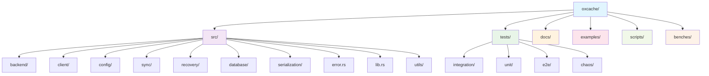
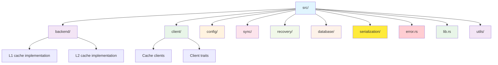
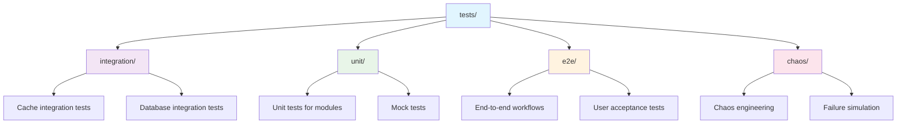

# Contributing to Oxcache

Thank you for your interest in contributing to Oxcache! This document provides guidelines and instructions for contributing to the project.

## Table of Contents

- [Code of Conduct](#code-of-conduct)
- [Getting Started](#getting-started)
- [Development Workflow](#development-workflow)
- [Coding Standards](#coding-standards)
- [Testing](#testing)
- [Documentation](#documentation)
- [Submitting Changes](#submitting-changes)
- [Reporting Issues](#reporting-issues)

## Code of Conduct

We are committed to providing a welcoming and inclusive environment. Please be respectful and considerate in all interactions.

## Getting Started

### Prerequisites

- Rust 1.75 or later
- Docker (for running Redis in tests)
- Git

### Setup

```bash
# Clone the repository
git clone https://github.com/Kirky-X/oxcache.git
cd oxcache

# Install dependencies
cargo fetch

# Run tests to verify setup
cargo test
```

### Development Environment

```bash
# Watch mode for development (requires cargo-watch)
cargo install cargo-watch
cargo watch -x test -x clippy
```

## Development Workflow

### Branching Strategy

- `main` - Stable release branch
- `develop` - Development branch
- `feature/*` - Feature branches
- `fix/*` - Bug fix branches
- `docs/*` - Documentation branches

### Creating a Branch

```bash
# Update develop branch
git checkout develop
git pull origin develop

# Create feature branch
git checkout -b feature/your-feature-name
```

### Commit Guidelines

Follow Conventional Commits specification:

```
<type>(<scope>): <subject>

<body>

<footer>
```

**Types**:
- `feat`: New feature
- `fix`: Bug fix
- `docs`: Documentation changes
- `style`: Code style changes (formatting, etc.)
- `refactor`: Code refactoring
- `test`: Test changes
- `chore`: Build process or tooling changes

**Examples**:

```
feat(batch): add optimized batch writer

Implement new optimized batch writer with adaptive batch sizing
and concurrent flushing for better throughput.

Closes #123
```

```
fix(l2): handle Redis connection timeout

Add proper timeout handling and retry logic for Redis
connection failures.

Fixes #456
```

## Coding Standards

### Rust Style Guide

- Use `rustfmt` for formatting: `cargo fmt`
- Use `clippy` for linting: `cargo clippy`
- Follow Rust API guidelines: [rust-lang/rfcs](https://rust-lang.github.io/api-guidelines/)

### Project Structure



### Code Organization



### Naming Conventions

- **Types**: `PascalCase` (e.g., `CacheConfig`, `L1Backend`)
- **Functions**: `snake_case` (e.g., `get_client`, `set_value`)
- **Constants**: `SCREAMING_SNAKE_CASE` (e.g., `DEFAULT_TTL`)
- **Private fields**: `snake_case` with `_` prefix for internal use

### Error Handling

Use `thiserror` for error definitions:

```rust
use thiserror::Error;

#[derive(Error, Debug)]
pub enum CacheError {
    #[error("Key not found: {0}")]
    KeyNotFound(String),

    #[error("Serialization error: {0}")]
    SerializationError(#[from] serde_json::Error),

    #[error("Redis error: {0}")]
    RedisError(String),
}
```

### Async Code

- Use `async fn` for async functions
- Use `tokio` runtime
- Use `tracing` for logging:

```rust
use tracing::{info, error, debug};

#[tracing::instrument(skip(self))]
pub async fn get<T>(&self, key: &str) -> Result<Option<T>> {
    info!("Getting key: {}", key);
    debug!("Cache hit for key: {}", key);
    Ok(None)
}
```

### Documentation

- Use `///` for public API documentation
- Include examples in doc comments
- Use `//!` for module-level documentation

```rust
/// Gets a value from the cache.
///
/// # Arguments
///
/// * `key` - The cache key to retrieve
///
/// # Returns
///
/// * `Ok(Some(T))` - Value found in cache
/// * `Ok(None)` - Value not found
/// * `Err(Error)` - Cache error
///
/// # Examples
///
/// ```rust
/// # use oxcache::CacheClient;
/// # async fn example(client: CacheClient) -> Result<(), Box<dyn std::error::Error>> {
/// let value: Option<String> = client.get("key").await?;
/// # Ok(())
/// # }
/// ```
pub async fn get<T>(&self, key: &str) -> Result<Option<T>> {
    // Implementation
}
```

## Testing

### Test Structure



### Writing Tests

#### Unit Tests

```rust
#[cfg(test)]
mod tests {
    use super::*;

    #[test]
    fn test_parse_connection_string() {
        let conn = ConnectionString::parse("redis://localhost:6379").unwrap();
        assert_eq!(conn.host(), "localhost");
        assert_eq!(conn.port(), 6379);
    }
}
```

#### Integration Tests

```rust
use oxcache::tests::common::{setup_redis, teardown_redis};
use serial_test::serial;

#[tokio::test]
#[serial]
async fn test_cache_set_get() {
    let redis = setup_redis().await;
    // Test code
    teardown_redis(redis).await;
}
```

#### Property-Based Tests

```rust
use proptest::prelude::*;

proptest! {
    #[test]
    fn test_roundtrip(key in "[a-z0-9]+", value: u64) {
        let cache = create_test_cache().await;
        cache.set(&key, &value, None).await.unwrap();
        let retrieved: Option<u64> = cache.get(&key).await.unwrap();
        assert_eq!(retrieved, Some(value));
    }
}
```

### Running Tests

```bash
# Run all tests
cargo test

# Run tests with output
cargo test -- --nocapture

# Run specific test
cargo test test_cache_set_get

# Run integration tests only
cargo test --test '*'

# Run with Redis
./scripts/real_redis_test.sh

# Run benchmarks
cargo bench
```

### Test Coverage

```bash
# Install tarpaulin
cargo install cargo-tarpaulin

# Generate coverage report
cargo tarpaulin --out Html --output-dir ./coverage
```

## Documentation

### Documentation Requirements

- All public APIs must have doc comments
- Include examples for complex APIs
- Keep documentation up-to-date with code changes
- Run documentation validation script: `./scripts/validate_docs.sh`
- Ensure version consistency across all documentation files

### Building Documentation

```bash
# Build documentation
cargo doc --no-deps

# Open documentation in browser
cargo doc --open

# Build for docs.rs (with all features)
cargo doc --all-features
```

### Documentation Comments

```rust
/// Configuration for L1 cache.
///
/// # Fields
///
/// - `max_capacity`: Maximum number of entries in cache
/// - `time_to_live`: Optional time-to-live in seconds
/// - `time_to_idle`: Optional idle time-to-live in seconds
///
/// # Example
///
/// ```rust
/// use oxcache::L1Config;
///
/// let config = L1Config::new()
///     .with_max_capacity(10000)
///     .with_time_to_live(3600);
/// ```
pub struct L1Config {
    // Fields
}
```

## Submitting Changes

### Pull Request Process

1. **Update your branch**

```bash
git checkout develop
git pull origin develop
git checkout feature/your-feature
git rebase develop
```

2. **Run tests and checks**

```bash
# Format code
cargo fmt

# Run clippy
cargo clippy -- -D warnings

# Run tests
cargo test --all-features
```

3. **Commit your changes**

```bash
git add .
git commit -m "feat(cache): add new caching strategy"
```

4. **Push to GitHub**

```bash
git push origin feature/your-feature
```

5. **Create Pull Request**

- Go to GitHub and create a PR
- Link to related issues
- Add description of changes
- Request review from maintainers

### Pull Request Checklist

- [ ] Code follows style guidelines (`cargo fmt`, `cargo clippy`)
- [ ] All tests pass (`cargo test`)
- [ ] New tests added for new features
- [ ] Documentation updated and validated (`./scripts/validate_docs.sh`)
- [ ] Commit messages follow Conventional Commits
- [ ] PR description is clear and detailed

### Review Process

1. Maintainers will review your PR
2. Address feedback and make requested changes
3. Update tests as needed
4. Once approved, your PR will be merged

## Reporting Issues

### Bug Reports

When reporting a bug, include:

1. **Version**: `oxcache --version` or `Cargo.toml`
2. **Rust version**: `rustc --version`
3. **OS**: `uname -a` (Linux/Mac) or version info (Windows)
4. **Reproduction**: Minimal code example
5. **Expected behavior**: What you expected to happen
6. **Actual behavior**: What actually happened
7. **Stack trace**: If applicable

**Bug Report Template**:

```
**Version**: 0.1.2

**Rust version**: 1.75.0+

**OS**: [Your OS and version]

**Oxcache features**: [e.g., "full", "core", "minimal"]

**Reproduction**:
```rust
// Minimal reproducible code
```

**Expected behavior**:
Should return cached value

**Actual behavior**:
Panics with "Key not found"

**Stack trace**:
```
[Stack trace here]
```
```

### Feature Requests

When requesting a feature:

1. **Use case**: Why do you need this feature?
2. **Proposed solution**: How should it work?
3. **Alternatives**: What alternatives have you considered?
4. **Implementation**: Would you be willing to contribute?

**Feature Request Template**:

```
**Use case**:
I need to cache database query results with automatic invalidation when data changes.

**Proposed solution**:
Add support for database change notifications that trigger cache invalidation.

**Alternatives**:
- Manual invalidation (requires more code)
- Shorter TTL (wastes cache hits)

**Implementation**:
I'm willing to contribute this feature if approved.
```

## Getting Help

- **GitHub Issues**: Report bugs and request features
- **GitHub Discussions**: Ask questions and discuss ideas
- **Discord**: Join our Discord community (if available)
- **Email**: Contact maintainers directly (for security issues)

## Acknowledgments

Thank you for contributing to Oxcache! Your contributions help make this project better for everyone.
