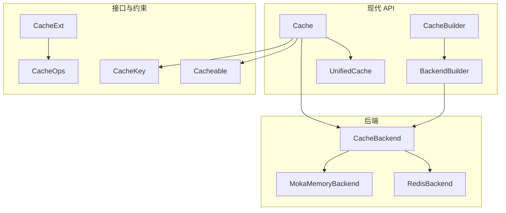
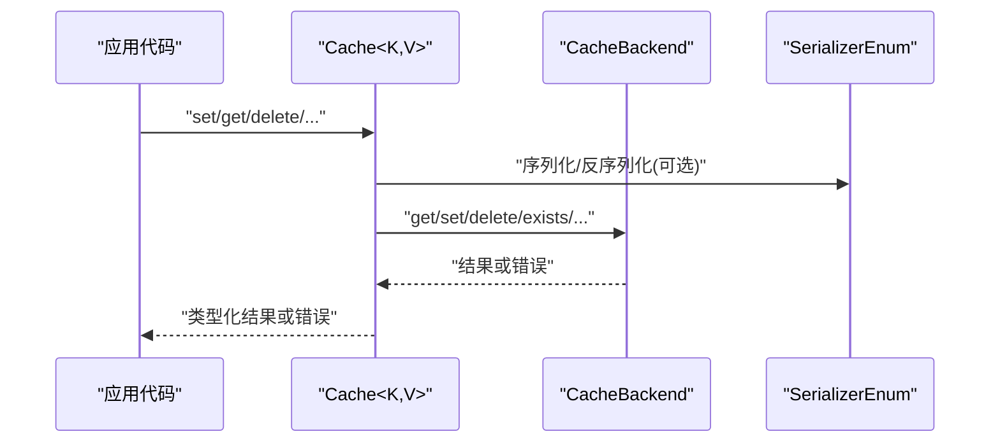
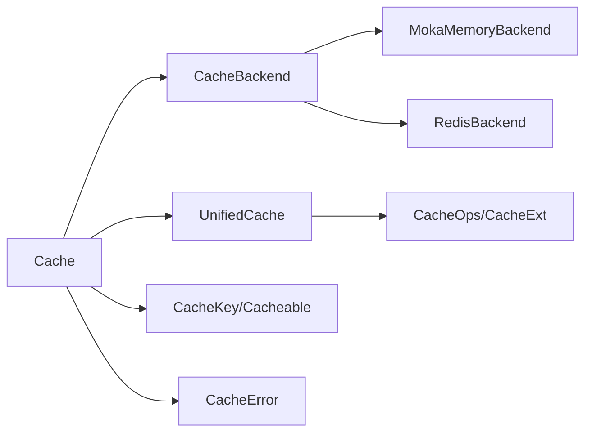

# API 参考

<cite>
**本文引用的文件**
- [src/lib.rs](file://src/lib.rs)
- [src/cache.rs](file://src/cache.rs)
- [src/builder/cache_builder.rs](file://src/builder/cache_builder.rs)
- [src/builder/backend_builder.rs](file://src/builder/backend_builder.rs)
- [src/error.rs](file://src/error.rs)
- [src/cache_interface.rs](file://src/cache_interface.rs)
- [src/traits/cache_key.rs](file://src/traits/cache_key.rs)
- [src/traits/cacheable.rs](file://src/traits/cacheable.rs)
- [src/client/mod.rs](file://src/client/mod.rs)
- [src/backend/mod.rs](file://src/backend/mod.rs)
- [Cargo.toml](file://Cargo.toml)
- [examples/src/01_basics/example_basic_operations.rs](file://examples/src/01_basics/example_basic_operations.rs)
- [examples/src/01_basics/example_comprehensive_usage.rs](file://examples/src/01_basics/example_comprehensive_usage.rs)
</cite>

## 目录
1. [简介](#简介)
2. [项目结构](#项目结构)
3. [核心组件](#核心组件)
4. [架构总览](#架构总览)
5. [详细组件分析](#详细组件分析)
6. [依赖分析](#依赖分析)
7. [性能考虑](#性能考虑)
8. [故障排查指南](#故障排查指南)
9. [结论](#结论)
10. [附录](#附录)

## 简介
本文件为 oxcache 的完整 API 参考，覆盖现代 API 的核心类型与接口，包括 Cache、CacheBuilder、BackendBuilder、UnifiedCache、CacheKey、Cacheable 等，并对错误类型、版本兼容性、线程安全与并发注意事项、最佳实践与常见陷阱进行系统说明。同时提供基于仓库示例的使用场景与参考路径，帮助快速上手与迁移。

## 项目结构
- 核心模块
  - cache：现代 API 的统一缓存入口，提供类型安全的 CRUD、批量操作、健康检查、统计等能力
  - builder：缓存与后端构建器，支持链式配置 TTL、容量、批写、自动提升等
  - cache_interface：统一缓存接口，整合底层字节操作与高层类型化操作
  - traits：类型约束，CacheKey 与 Cacheable
  - client：低层缓存操作接口 CacheOps 与扩展 CacheExt
  - backend：后端抽象与客户端实现导出
  - error：统一错误类型与工具方法
- 功能特性通过 Cargo features 开关控制，支持 moka、redis、serialization、metrics、wal-recovery、batch-write、full 等
- examples 提供基础与综合使用示例

图表来源
- [src/cache.rs](file://src/cache.rs#L117-L646)
- [src/builder/cache_builder.rs](file://src/builder/cache_builder.rs#L38-L209)
- [src/builder/backend_builder.rs](file://src/builder/backend_builder.rs#L40-L221)
- [src/cache_interface.rs](file://src/cache_interface.rs#L24-L300)
- [src/client/mod.rs](file://src/client/mod.rs#L18-L304)
- [src/backend/mod.rs](file://src/backend/mod.rs#L25-L59)

章节来源
- [src/lib.rs](file://src/lib.rs#L1-L680)
- [Cargo.toml](file://Cargo.toml#L235-L347)

## 核心组件
- Cache<K, V>
  - 类型安全的统一缓存入口，封装底层 CacheBackend
  - 提供 get/set/delete/exists/get_or/clear/stats/health_check/shutdown 等方法
  - 泛型约束：K 必须实现 CacheKey；V 必须实现 Cacheable（serde 的序列化/反序列化）
- CacheBuilder<K, V>
  - 链式配置缓存实例：ttl、capacity、batch_writes、auto_promote、backend
- BackendBuilder
  - 构建 L1/Memory 与 L2/Redis 后端，支持 capacity/ttl/connection_string/mode
- UnifiedCache
  - 统一接口：字节级操作 + 分布式锁 + 批量 + typed 操作
- CacheOps/CacheExt
  - 低层字节操作与高层类型化操作的分离
- CacheKey/Cacheable
  - 键与值的类型约束，提供常见类型实现与自定义实现方式

章节来源
- [src/cache.rs](file://src/cache.rs#L117-L646)
- [src/builder/cache_builder.rs](file://src/builder/cache_builder.rs#L38-L209)
- [src/builder/backend_builder.rs](file://src/builder/backend_builder.rs#L40-L221)
- [src/cache_interface.rs](file://src/cache_interface.rs#L24-L300)
- [src/client/mod.rs](file://src/client/mod.rs#L18-L304)
- [src/traits/cache_key.rs](file://src/traits/cache_key.rs#L38-L49)
- [src/traits/cacheable.rs](file://src/traits/cacheable.rs#L7-L45)

## 架构总览
现代 API 的调用链路如下：应用代码通过 Cache<K,V> 调用，内部委托到 CacheBackend 接口，具体实现由 BackendBuilder 构建的 MemoryBackend 或 RedisBackend 提供。序列化在 Cache 层或 UnifiedCache 层完成，错误统一为 CacheError。

图表来源
- [src/cache.rs](file://src/cache.rs#L241-L325)
- [src/cache_interface.rs](file://src/cache_interface.rs#L133-L154)
- [src/client/mod.rs](file://src/client/mod.rs#L24-L46)

## 详细组件分析

### Cache<K, V> API
- 构造与工厂
  - new() -> Result<Cache<K,V>>：默认内存后端
  - memory() -> Result<Cache<K,V>>：显式内存后端
  - redis(connection_string) -> Result<Cache<K,V>>：Redis 后端（需启用 redis 特性）
  - builder() -> CacheBuilder<K,V>：高级配置入口
- 基础操作
  - get(&K) -> Result<Option<V>>：按键获取值（需要 serialization 特性）
  - set(&K, &V) -> Result<()>：设置值（需要 serialization 特性）
  - set_with_ttl(&K, &V, Option<Duration>) -> Result<()>：带 TTL 设置
  - delete(&K) -> Result<()>：删除键
  - exists(&K) -> Result<bool>：键存在性检查
- 高阶操作
  - get_or<F,Fut>(&K, F) -> Result<V>：缓存-旁路模式，无值时回源并写入
  - set_many/Itr -> Result<()>：批量写入
  - get_many/Itr -> Result<HashMap<String,V>>：批量读取
  - delete_many/Itr -> Result<()>：批量删除
- 系统运维
  - clear() -> Result<()>：清空缓存
  - stats() -> Result<HashMap<String,String>>：获取统计
  - health_check() -> Result<bool>：健康检查
  - shutdown() -> Result<()>：优雅关闭
- 注册与宏支持
  - to_cache_ops() -> Arc<CacheOps>：注册到全局缓存管理器
  - register_for_macro(service_name) -> void：为 #[cached] 宏注册服务名

泛型约束与使用
- K: CacheKey，提供 to_key_string() 将键转为字符串
- V: Cacheable（在启用 serialization 特性时要求 serde::Serialize/Deserialize）

错误与返回
- 成功返回 Result<T>，失败返回统一的 CacheError
- 未启用 serialization 时，get/set 等方法会返回序列化相关错误

线程安全与并发
- Cache 内部使用 Arc<dyn CacheBackend>，Backend 实现应保证并发安全
- set/get/delete 等均为异步方法，适合高并发场景

使用示例（参考路径）
- 基本 CRUD：[examples/src/01_basics/example_basic_operations.rs](file://examples/src/01_basics/example_basic_operations.rs#L21-L72)
- 综合使用（含 TTL、批量、统计）：[examples/src/01_basics/example_comprehensive_usage.rs](file://examples/src/01_basics/example_comprehensive_usage.rs#L37-L224)

章节来源
- [src/cache.rs](file://src/cache.rs#L140-L646)
- [src/traits/cache_key.rs](file://src/traits/cache_key.rs#L38-L49)
- [src/traits/cacheable.rs](file://src/traits/cacheable.rs#L7-L45)
- [examples/src/01_basics/example_basic_operations.rs](file://examples/src/01_basics/example_basic_operations.rs#L21-L72)
- [examples/src/01_basics/example_comprehensive_usage.rs](file://examples/src/01_basics/example_comprehensive_usage.rs#L37-L224)

### CacheBuilder<K, V> API
- 配置项
  - ttl(Duration) -> Self：默认 TTL
  - capacity(u64) -> Self：内存后端容量
  - batch_writes(bool) -> Self：启用批写（取决于特性）
  - auto_promote(bool) -> Self：分层缓存自动提升
  - backend(BackendBuilder) -> Self：指定后端构建器
- 构建
  - build() -> Result<Cache<K,V>>：构建 Cache 实例
    - 若未指定后端，默认使用 MemoryBackend（可设置 capacity）
    - 若指定后端，按 BackendBuilder 的配置创建

使用示例（参考路径）
- 链式配置与构建：[src/builder/cache_builder.rs](file://src/builder/cache_builder.rs#L174-L208)

章节来源
- [src/builder/cache_builder.rs](file://src/builder/cache_builder.rs#L38-L209)

### BackendBuilder API
- 工厂
  - memory() -> Self：内存后端配置
  - redis() -> Self：Redis 后端配置（需启用 redis 特性）
- 内存后端配置
  - capacity(u64) -> Self：容量
  - ttl(Duration) -> Self：TTL
- Redis 后端配置
  - connection_string(&str) -> Self：连接串
  - mode(Mode) -> Self：模式（Standalone/Sentinel/Cluster）
- 构建
  - build() -> Result<Arc<dyn CacheBackend>>：创建后端实例
    - Redis：校验连接串必填，否则返回配置错误
    - Memory：根据 capacity/ttl 构建

使用示例（参考路径）
- 内存/Redis 后端构建：[src/builder/backend_builder.rs](file://src/builder/backend_builder.rs#L182-L221)

章节来源
- [src/builder/backend_builder.rs](file://src/builder/backend_builder.rs#L40-L221)

### UnifiedCache 接口
- 字节级核心操作：get_bytes/set_bytes/delete/exists/clear/close/ttl/expire/health_check/stats
- 分布式锁：lock/unlock
- L1/L2 层级操作：get_l1_bytes/get_l2_bytes/set_l1_bytes/set_l2_bytes/clear_l1/clear_l2（默认 NotSupported）
- 类型化操作：get_typed/set_typed/get_or_fetch/try_get_typed/remove_typed/contains
- 批量操作：set_many_bytes/get_many_bytes/delete_many/set_many_typed/get_many_typed
- 适配器：CacheOpsAdapter 将 CacheOps 适配为 UnifiedCache

使用示例（参考路径）
- 类型化与批量操作测试：[src/cache_interface.rs](file://src/cache_interface.rs#L489-L596)

章节来源
- [src/cache_interface.rs](file://src/cache_interface.rs#L24-L300)

### CacheOps/CacheExt 接口
- CacheOps：字节级操作 + 序列化器 + 分布式锁 + 清理 + 关闭
- CacheExt：在 CacheOps 基础上提供类型化 get/set/get_or_fetch/try_get/remove/contains 等便捷方法

使用示例（参考路径）
- 类型化扩展方法：[src/client/mod.rs](file://src/client/mod.rs#L18-L152)

章节来源
- [src/client/mod.rs](file://src/client/mod.rs#L18-L304)

### 类型约束：CacheKey 与 Cacheable
- CacheKey
  - 为任意类型提供 to_key_string()，常见类型已有实现（String/&str/u64/i64/usize 等）
  - 自定义类型可通过实现该 trait 定义键格式
- Cacheable
  - 在启用 serialization 特性时，要求类型实现 serde::Serialize + DeserializeOwned
  - 通过 blanket impl 为满足条件的类型自动实现

使用示例（参考路径）
- CacheKey 实现与测试：[src/traits/cache_key.rs](file://src/traits/cache_key.rs#L38-L141)
- Cacheable blanket 实现：[src/traits/cacheable.rs](file://src/traits/cacheable.rs#L7-L45)

章节来源
- [src/traits/cache_key.rs](file://src/traits/cache_key.rs#L38-L141)
- [src/traits/cacheable.rs](file://src/traits/cacheable.rs#L7-L45)

## 依赖分析
- 特性与模块映射
  - moka/dashmap-backend：启用 L1 内存后端（Moka/DashMap）
  - redis：启用 L2 Redis 后端
  - serialization/bincode/compression：启用序列化与压缩
  - metrics/full-metrics/opentelemetry：可观测性
  - wal-recovery/batch-write：持久化与批写优化
  - full：聚合所有特性
- 版本与兼容
  - 版本常量 VERSION 来源于 Cargo 包元数据
  - 通过编译时特性检查确保依赖满足（如 bloom-filter 需 moka，wal-recovery 需 redis 等）

图表来源
- [src/cache.rs](file://src/cache.rs#L117-L120)
- [src/backend/mod.rs](file://src/backend/mod.rs#L25-L59)
- [src/cache_interface.rs](file://src/cache_interface.rs#L24-L300)
- [src/client/mod.rs](file://src/client/mod.rs#L18-L304)
- [src/traits/cache_key.rs](file://src/traits/cache_key.rs#L38-L49)
- [src/traits/cacheable.rs](file://src/traits/cacheable.rs#L7-L45)
- [src/error.rs](file://src/error.rs#L75-L208)

章节来源
- [Cargo.toml](file://Cargo.toml#L235-L347)
- [src/lib.rs](file://src/lib.rs#L644-L645)

## 性能考虑
- 批量写入：通过 set_many 降低网络/锁开销
- 自动提升：分层缓存中 L2 miss 时可自动提升至 L1，减少后续访问延迟
- 序列化选择：JSON 与 Bincode 的权衡，结合 compression 特性优化体积
- TTL 策略：合理设置 TTL，避免频繁重建与内存压力
- 并发模型：Cache 内部使用 Arc，建议在高并发场景下复用同一实例

[本节为通用指导，无需特定文件引用]

## 故障排查指南
- 常见错误类型
  - Serialization：序列化/反序列化失败或未启用 serialization 特性
  - Connection/L2Error/RedisError：网络连接或 Redis 不可用
  - NotFound：键不存在
  - Degraded：缓存处于降级模式
  - ConfigError：配置缺失或非法
  - Timeout：操作超时
  - IoError/WalError：IO 或 WAL 相关错误
  - NotSupported：当前后端不支持某操作
- 错误判断工具
  - CacheError::is_not_found()/is_connection_error()/is_degraded() 辅助分支处理
- 安全与脱敏
  - Redis 连接串中的密码会被脱敏输出，便于日志安全

章节来源
- [src/error.rs](file://src/error.rs#L75-L288)

## 结论
现代 API 以 Cache<K,V> 为核心，通过 CacheBuilder 与 BackendBuilder 提供灵活配置，配合 UnifiedCache/CacheOps/CacheExt 形成从字节到类型化的完整接口体系。借助特性开关与编译时检查，可在不同部署环境间平衡功能与性能。配合错误类型与工具方法，可快速定位问题并进行稳健的错误处理。

[本节为总结，无需特定文件引用]

## 附录

### API 一览表（方法签名与参数说明）
- Cache<K,V>
  - new() -> Result<Cache<K,V>>
  - memory() -> Result<Cache<K,V>>
  - redis(connection_string: &str) -> Result<Cache<K,V>>
  - builder() -> CacheBuilder<K,V>
  - get(&K) -> Result<Option<V>>
  - set(&K, &V) -> Result<()>
  - set_with_ttl(&K, &V, Option<Duration>) -> Result<()>
  - delete(&K) -> Result<()>
  - exists(&K) -> Result<bool>
  - get_or<F,Fut>(&K, F) -> Result<V>
  - set_many<I>(&I) -> Result<()>（I: IntoIterator<Item=(&K,&V)>）
  - get_many<I>(&I) -> Result<HashMap<String,V>>
  - delete_many<I>(&I) -> Result<()>
  - clear() -> Result<()>
  - stats() -> Result<HashMap<String,String>>
  - health_check() -> Result<bool>
  - shutdown() -> Result<()>
  - to_cache_ops() -> Arc<CacheOps>
  - register_for_macro(&str) -> void
- CacheBuilder<K,V>
  - ttl(Duration) -> Self
  - capacity(u64) -> Self
  - batch_writes(bool) -> Self
  - auto_promote(bool) -> Self
  - backend(BackendBuilder) -> Self
  - build() -> Result<Cache<K,V>>
- BackendBuilder
  - memory() -> Self
  - redis() -> Self
  - capacity(u64) -> Self
  - ttl(Duration) -> Self
  - connection_string(&str) -> Self
  - mode(Mode) -> Self
  - build() -> Result<Arc<dyn CacheBackend>>
- UnifiedCache
  - get_bytes/set_bytes/delete/exists/clear/close/ttl/expire/health_check/stats
  - get_l1_bytes/get_l2_bytes/set_l1_bytes/set_l2_bytes/clear_l1/clear_l2
  - lock/unlock
  - get_typed/set_typed/get_or_fetch/try_get_typed/remove_typed/contains
  - set_many_bytes/get_many_bytes/delete_many/set_many_typed/get_many_typed
  - serializer() -> &SerializerEnum
- CacheOps/CacheExt
  - get_bytes/set_bytes/delete + L1/L2 扩展 + lock/unlock + clear_l1/clear_l2/clear_wal + shutdown
  - get/set/get_or_fetch/try_get/remove/contains（CacheExt）

章节来源
- [src/cache.rs](file://src/cache.rs#L140-L646)
- [src/builder/cache_builder.rs](file://src/builder/cache_builder.rs#L60-L209)
- [src/builder/backend_builder.rs](file://src/builder/backend_builder.rs#L54-L221)
- [src/cache_interface.rs](file://src/cache_interface.rs#L24-L300)
- [src/client/mod.rs](file://src/client/mod.rs#L18-L304)

### 版本兼容性与迁移
- 版本常量：VERSION 来自包元数据
- 兼容策略：统一使用新 API（v0.2.0+）
- 迁移要点
  - 初始化：使用 Cache::memory()/redis()/builder()
  - 键类型：通过实现 CacheKey 或使用内置类型（String/&str/u64 等）
  - 值类型：实现 serde::Serialize/DeserializeOwned 或使用 blanket 实现
- 特性检查：编译时通过 check_feature_dependence! 宏确保特性依赖满足

章节来源
- [src/lib.rs](file://src/lib.rs#L126-L146)
- [src/lib.rs](file://src/lib.rs#L644-L679)
- [Cargo.toml](file://Cargo.toml#L235-L347)

### 线程安全与并发注意事项
- Cache 内部使用 Arc<dyn CacheBackend>，Backend 实现需保证并发安全
- 异步方法适合高并发场景，建议复用同一 Cache 实例
- 批量操作建议合并请求，减少锁竞争
- 分布式锁仅在支持的后端生效，否则返回 NotSupported

章节来源
- [src/cache.rs](file://src/cache.rs#L117-L120)
- [src/cache_interface.rs](file://src/cache_interface.rs#L468-L474)

### 最佳实践与常见陷阱
- 最佳实践
  - 明确键格式：实现 CacheKey 或使用内置类型
  - 合理设置 TTL：避免过短导致频繁回源，过长导致内存压力
  - 使用批写：set_many/get_many/delete_many
  - 健康检查：定期 health_check，异常时降级或告警
  - 序列化：优先使用 JSON，必要时启用 bincode/compression
- 常见陷阱
  - 未启用 serialization 导致 get/set 报错
  - Redis 连接串缺失导致 BackendBuilder::build 失败
  - 错误分支未区分 NotFound/Connection/Degraded
  - 并发写入未复用实例造成资源浪费

章节来源
- [src/error.rs](file://src/error.rs#L228-L288)
- [src/builder/backend_builder.rs](file://src/builder/backend_builder.rs#L207-L211)

### 使用示例与场景
- 基本 CRUD：[examples/src/01_basics/example_basic_operations.rs](file://examples/src/01_basics/example_basic_operations.rs#L21-L72)
- 综合使用（TTL、批量、统计）：[examples/src/01_basics/example_comprehensive_usage.rs](file://examples/src/01_basics/example_comprehensive_usage.rs#L37-L224)

章节来源
- [examples/src/01_basics/example_basic_operations.rs](file://examples/src/01_basics/example_basic_operations.rs#L21-L72)
- [examples/src/01_basics/example_comprehensive_usage.rs](file://examples/src/01_basics/example_comprehensive_usage.rs#L37-L224)