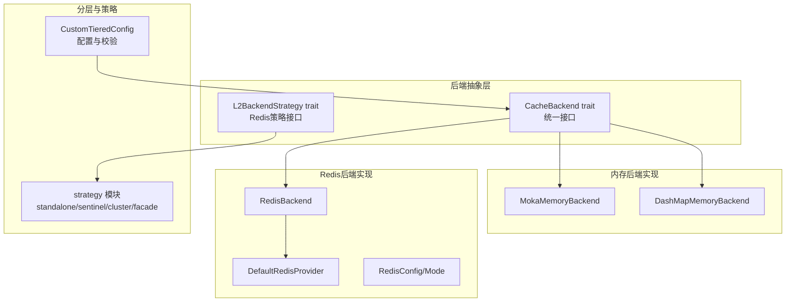
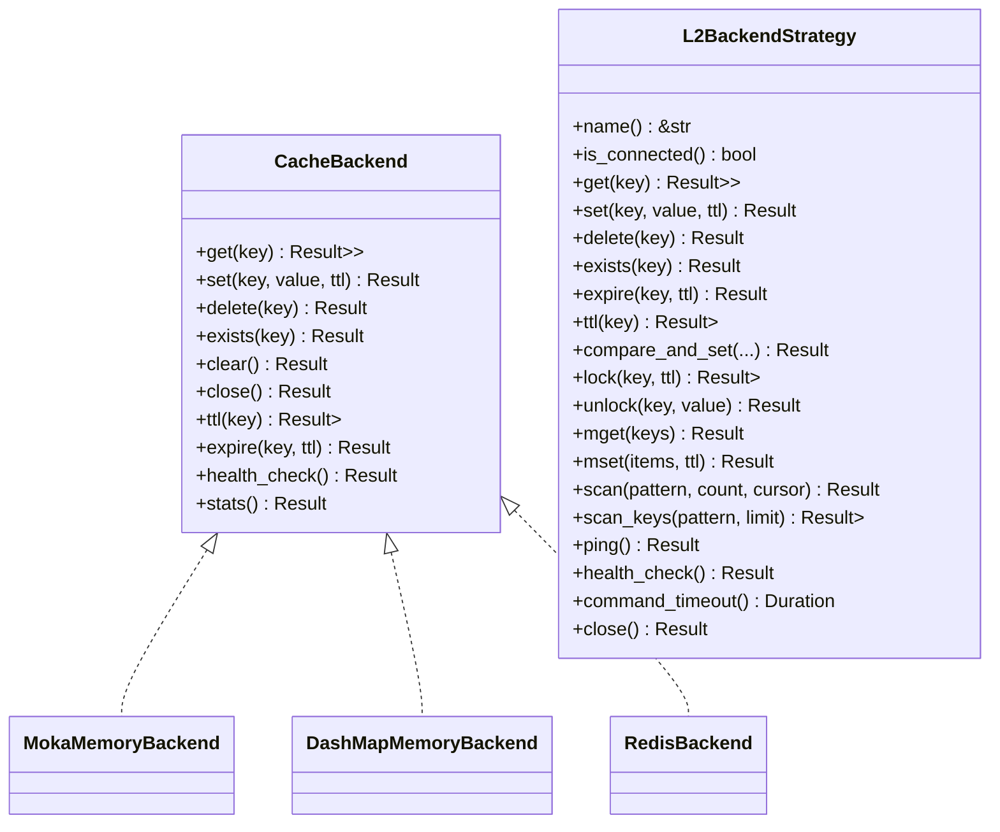
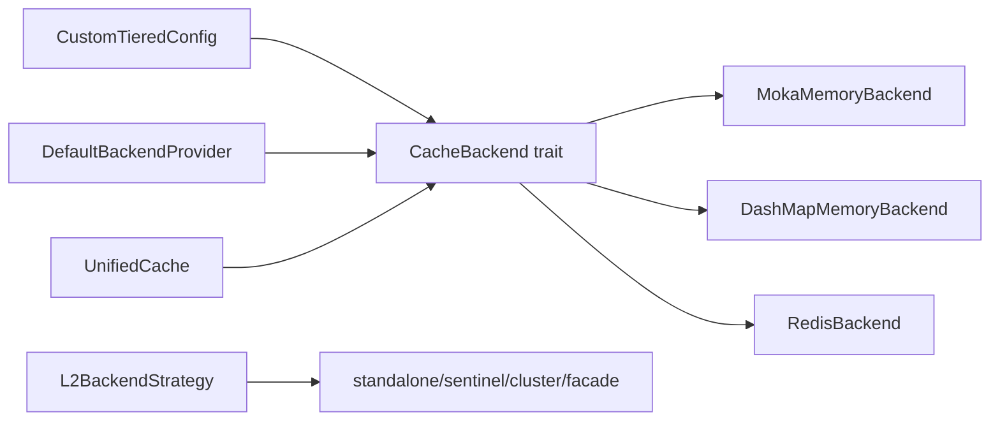

# 后端接口

<cite>
**本文引用的文件**
- [src/backend/interface.rs](file://src/backend/interface.rs)
- [src/backend/mod.rs](file://src/backend/mod.rs)
- [src/backend/client/mod.rs](file://src/backend/client/mod.rs)
- [src/backend/client/dashmap/backend.rs](file://src/backend/client/dashmap/backend.rs)
- [src/backend/client/moka/backend.rs](file://src/backend/client/moka/backend.rs)
- [src/backend/client/redis/mod.rs](file://src/backend/client/redis/mod.rs)
- [src/backend/client/redis/client.rs](file://src/backend/client/redis/client.rs)
- [src/backend/client/redis/provider.rs](file://src/backend/client/redis/provider.rs)
- [src/backend/strategy/mod.rs](file://src/backend/strategy/mod.rs)
- [src/backend/strategy/traits.rs](file://src/backend/strategy/traits.rs)
- [src/backend/custom_tiered.rs](file://src/backend/custom_tiered.rs)
- [src/cache_interface.rs](file://src/cache_interface.rs)
</cite>

## 目录
1. [简介](#简介)
2. [项目结构](#项目结构)
3. [核心组件](#核心组件)
4. [架构总览](#架构总览)
5. [详细组件分析](#详细组件分析)
6. [依赖关系分析](#依赖关系分析)
7. [性能考量](#性能考量)
8. [故障排查指南](#故障排查指南)
9. [结论](#结论)
10. [附录](#附录)

## 简介
本文件系统性阐述后端抽象层与现代 API 设计，围绕 Backend trait 与相关接口，给出方法定义、参数与返回值规范、错误处理与生命周期管理，并提供多后端实现对比、配置与切换示例、扩展机制与自定义实现指南，以及状态管理与生命周期控制的约定。

## 项目结构
后端子系统采用模块化组织，核心抽象位于 backend 子模块，具体实现分布在 client、strategy、custom_tiered 等子模块；同时通过统一的 CacheBackend trait 对外暴露一致接口，配合 UnifiedCache 提供高层封装。

**图表来源**
- [src/backend/interface.rs](file://src/backend/interface.rs#L46-L166)
- [src/backend/strategy/traits.rs](file://src/backend/strategy/traits.rs#L89-L303)
- [src/backend/client/moka/backend.rs](file://src/backend/client/moka/backend.rs#L18-L123)
- [src/backend/client/dashmap/backend.rs](file://src/backend/client/dashmap/backend.rs#L50-L321)
- [src/backend/client/redis/client.rs](file://src/backend/client/redis/client.rs#L66-L499)
- [src/backend/client/redis/provider.rs](file://src/backend/client/redis/provider.rs#L22-L194)
- [src/backend/custom_tiered.rs](file://src/backend/custom_tiered.rs#L766-L800)

**章节来源**
- [src/backend/mod.rs](file://src/backend/mod.rs#L1-L59)
- [src/backend/client/mod.rs](file://src/backend/client/mod.rs#L1-L34)

## 核心组件
- Backend 抽象层核心：CacheBackend trait 定义了统一的后端接口，屏蔽底层差异，支持内存与分布式缓存的无缝切换。
- 统一接口适配：UnifiedCache 将 CacheBackend、CacheOps、CacheExt 能力整合为单一接口，提供字节级与类型化操作、批量操作、分层与分布式锁等能力。
- 具体实现：
  - 内存后端：MokaMemoryBackend（高性能、内置驱逐与TTL）、DashMapMemoryBackend（高并发、手动TTL）。
  - Redis 后端：RedisBackend（支持 Standalone/Sentinel/Cluster 模式，连接池与安全校验）。
  - 自定义分层：CustomTieredConfig 支持 L1/L2/L3 层级配置、自动修复与 Provider 注入。
  - 策略层：L2BackendStrategy 为 Redis 部署模式提供统一策略接口。

**章节来源**
- [src/backend/interface.rs](file://src/backend/interface.rs#L46-L166)
- [src/cache_interface.rs](file://src/cache_interface.rs#L18-L300)
- [src/backend/client/moka/backend.rs](file://src/backend/client/moka/backend.rs#L18-L123)
- [src/backend/client/dashmap/backend.rs](file://src/backend/client/dashmap/backend.rs#L50-L321)
- [src/backend/client/redis/client.rs](file://src/backend/client/redis/client.rs#L66-L499)
- [src/backend/custom_tiered.rs](file://src/backend/custom_tiered.rs#L766-L800)

## 架构总览
后端抽象层采用“策略 + 工厂 + 适配”的架构：
- CacheBackend 为所有后端实现的统一契约；
- CustomTieredConfig 通过 BackendType 与 LayerBackendConfig 组合多层后端；
- DefaultBackendProvider 提供默认工厂，支持内存与 Redis 的创建；
- L2BackendStrategy 为 Redis 的多种部署模式提供统一策略接口；
- UnifiedCache 为上层应用提供统一的缓存 API。

**图表来源**
- [src/backend/interface.rs](file://src/backend/interface.rs#L46-L166)
- [src/backend/client/moka/backend.rs](file://src/backend/client/moka/backend.rs#L18-L123)
- [src/backend/client/dashmap/backend.rs](file://src/backend/client/dashmap/backend.rs#L50-L321)
- [src/backend/client/redis/client.rs](file://src/backend/client/redis/client.rs#L215-L499)
- [src/backend/strategy/traits.rs](file://src/backend/strategy/traits.rs#L89-L303)

## 详细组件分析

### Backend 抽象层与接口规范
- CacheBackend trait 方法一览（功能、参数、返回值、错误语义概览）：
  - get(key: &str) -> Result<Option<Vec<u8>>>：按键取值，未命中返回 None。
  - set(key: &str, value: Vec<u8>, ttl: Option<Duration>) -> Result<()>：写入值，可选TTL。
  - delete(key: &str) -> Result<()>：删除键。
  - exists(key: &str) -> Result<bool>：判断键是否存在。
  - clear() -> Result<()>：清空缓存（实现可能使用 SCAN 等安全方式）。
  - close() -> Result<()>：关闭资源，释放连接。
  - ttl(key: &str) -> Result<Option<Duration>>：查询剩余TTL，不存在或永不过期返回 None。
  - expire(key: &str, ttl: Duration) -> Result<bool>：更新TTL，不存在返回 false。
  - health_check() -> Result<bool>：健康检查。
  - stats() -> Result<HashMap<String, String>>：返回后端统计信息。

- 生命周期与状态管理约定：
  - close() 应释放资源，确保优雅退出；
  - health_check() 用于监控与熔断决策；
  - stats() 返回实现自定义指标，便于观测。

- 错误处理：
  - 连接类错误与操作类错误区分（如 is_connection_error）；
  - 统一通过 Result 包裹，上层根据场景处理。

**章节来源**
- [src/backend/interface.rs](file://src/backend/interface.rs#L46-L166)
- [src/backend/client/redis/client.rs](file://src/backend/client/redis/client.rs#L501-L504)

### 内存后端实现

#### MokaMemoryBackend
- 特点：基于 moka 的高性能内存缓存，内置 LRU/TinyLFU 驱逐与 TTL 支持。
- 关键行为：
  - set 不直接支持每项 TTL，TTL 在缓存构建时设定；
  - ttl/expire 不支持每项查询与更新；
  - clear/close 通过失效全部实现清理。

**章节来源**
- [src/backend/client/moka/backend.rs](file://src/backend/client/moka/backend.rs#L18-L123)

#### DashMapMemoryBackend
- 特点：基于 DashMap 的高并发内存缓存，无自动驱逐，需手动 TTL 管理。
- 关键行为：
  - set 支持每项 TTL，内部维护 ttl_map；
  - get/exists/ttl/expire 均考虑过期逻辑；
  - 容量满时执行淘汰（按最早插入策略）。

**章节来源**
- [src/backend/client/dashmap/backend.rs](file://src/backend/client/dashmap/backend.rs#L50-L321)

### Redis 后端实现

#### RedisBackend
- 支持模式：Standalone、Sentinel、Cluster；
- 安全与配置：
  - 连接串强制 TLS（生产环境），可通过环境变量放宽；
  - 建立连接后快速健康检查；
  - 使用 SCAN 进行 clear，避免影响其他数据库/连接。
- 关键行为：
  - get/set/delete/exists/ttl/expire 均进行键安全校验；
  - health_check 通过 PING；
  - stats 返回 INFO memory。

**章节来源**
- [src/backend/client/redis/client.rs](file://src/backend/client/redis/client.rs#L66-L499)

#### DefaultRedisProvider
- 提供三种模式的客户端创建：
  - Standalone：Client + ConnectionManager；
  - Sentinel：主从自动切换，支持 AUTH；
  - Cluster：读取副本提升读扩展。
- 超时与错误：统一超时控制与错误映射。

**章节来源**
- [src/backend/client/redis/provider.rs](file://src/backend/client/redis/provider.rs#L22-L194)

#### L2BackendStrategy（Redis 策略接口）
- 统一 Redis 部署模式的操作契约，包括：
  - 基础 CRUD、TTL、版本化 CAS；
  - 分布式锁（lock/unlock）；
  - 批量操作（mget/mset）；
  - SCAN/scan_keys；
  - 健康检查（Healthy/Degraded/Unhealthy）与命令超时。
- 迭代器：ScanIterator 封装 SCAN 迭代。

**章节来源**
- [src/backend/strategy/traits.rs](file://src/backend/strategy/traits.rs#L89-L303)

### 自定义分层与配置

#### CustomTieredConfig
- 层级与后端类型：
  - L1：推荐内存型（Moka/DashMap）；
  - L2/L3：推荐分布式（Redis）或持久化（Sqlite）；
  - 支持任意层级组合与自定义后端（Custom）。
- 配置校验与自动修复：
  - validate/validate_and_fix：自动修复层级不匹配问题；
  - AutoFixConfig：可开启/关闭并控制告警。
- Provider 注入：
  - BackendProvider：自定义后端创建逻辑；
  - DefaultBackendProvider：默认 L1=L1内存，L2/L3=Redis（可降级）。

**章节来源**
- [src/backend/custom_tiered.rs](file://src/backend/custom_tiered.rs#L362-L517)
- [src/backend/custom_tiered.rs](file://src/backend/custom_tiered.rs#L766-L800)
- [src/backend/custom_tiered.rs](file://src/backend/custom_tiered.rs#L1032-L1139)

### 统一接口适配层（UnifiedCache）
- 能力整合：
  - 字节级 get_bytes/set_bytes/delete/exists/clear/close/ttl/expire/health_check/stats；
  - Typed 操作（get_typed/set_typed/get_or_fetch/try_get_typed/remove_typed/contains）；
  - 批量操作（set_many/get_many/delete_many 与 typed 版本）；
  - 分层与分布式锁（get_l1/get_l2/set_l1/set_l2/clear_l1/clear_l2/lock/unlock）。
- 适配实现：
  - 为 CacheBackend 实现统一适配；
  - 为 CacheOps 适配（部分能力缺失时返回 NotSupported）。

**章节来源**
- [src/cache_interface.rs](file://src/cache_interface.rs#L18-L300)
- [src/cache_interface.rs](file://src/cache_interface.rs#L375-L487)

## 依赖关系分析

**图表来源**
- [src/backend/interface.rs](file://src/backend/interface.rs#L46-L166)
- [src/backend/client/moka/backend.rs](file://src/backend/client/moka/backend.rs#L18-L123)
- [src/backend/client/dashmap/backend.rs](file://src/backend/client/dashmap/backend.rs#L50-L321)
- [src/backend/client/redis/client.rs](file://src/backend/client/redis/client.rs#L66-L499)
- [src/backend/strategy/mod.rs](file://src/backend/strategy/mod.rs#L10-L24)
- [src/backend/custom_tiered.rs](file://src/backend/custom_tiered.rs#L766-L800)
- [src/cache_interface.rs](file://src/cache_interface.rs#L302-L373)

**章节来源**
- [src/backend/mod.rs](file://src/backend/mod.rs#L1-L59)
- [src/backend/client/mod.rs](file://src/backend/client/mod.rs#L1-L34)

## 性能考量
- 内存后端：
  - Moka：适合高吞吐、强驱逐与 TTL 场景，适合 L1；
  - DashMap：高并发、低锁争用，适合 L1 或 L2，需自行管理 TTL。
- Redis：
  - Standalone：低延迟，适合小规模；
  - Sentinel：主从自动切换，提升可用性；
  - Cluster：水平扩展，读写分离（读副本）。
- 批量与扫描：
  - clear 使用 SCAN 遍历删除，避免阻塞；
  - 批量操作（mget/mset）减少 RTT。
- 统一接口：
  - Typed 操作引入序列化开销，应结合业务权衡。

[本节为通用指导，无需列出具体文件来源]

## 故障排查指南
- 健康检查：
  - health_check 返回 false 或报错时，优先检查连接串、网络与 TLS 配置；
  - Redis 模式下确认 Sentinel/Cluster 节点可达与认证正确。
- 错误分类：
  - 连接错误（超时、IO）与操作错误（命令失败）应分别处理；
  - is_connection_error 辅助识别连接类异常。
- 清理与安全：
  - 使用 SCAN 清理避免误删；
  - 键与 SCAN 模式均进行安全校验，防止注入风险。
- 统一接口：
  - 若调用 TTL/expire 出现 NotSupported，说明后端不支持该能力（如 Moka）。

**章节来源**
- [src/backend/client/redis/client.rs](file://src/backend/client/redis/client.rs#L501-L504)
- [src/backend/client/redis/client.rs](file://src/backend/client/redis/client.rs#L390-L448)
- [src/cache_interface.rs](file://src/cache_interface.rs#L420-L426)

## 结论
后端抽象层通过 CacheBackend 统一契约，结合 CustomTieredConfig 的灵活分层与 Provider 注入机制，实现了从内存到分布式缓存的无缝切换；配合 L2BackendStrategy 与 Redis Provider，满足不同部署形态的需求；UnifiedCache 则为上层应用提供一致、完备的缓存 API。在实际工程中，应依据性能与一致性需求选择合适后端，并通过配置校验与自动修复降低运维复杂度。

[本节为总结性内容，无需列出具体文件来源]

## 附录

### API 方法定义与规范（摘要）
- CacheBackend
  - get(key) -> Option<Vec<u8>>
  - set(key, value, ttl) -> ()
  - delete(key) -> ()
  - exists(key) -> bool
  - clear() -> ()
  - close() -> ()
  - ttl(key) -> Option<Duration>
  - expire(key, ttl) -> bool
  - health_check() -> bool
  - stats() -> HashMap<String, String>
- L2BackendStrategy（Redis 策略）
  - 基础操作、版本化 CAS、分布式锁、批量与 SCAN、健康状态、命令超时、关闭。

**章节来源**
- [src/backend/interface.rs](file://src/backend/interface.rs#L46-L166)
- [src/backend/strategy/traits.rs](file://src/backend/strategy/traits.rs#L89-L303)

### 不同后端实现对比与选择指南
- 选择原则：
  - L1：追求极致性能与低延迟，优先 Moka；若需手动 TTL，选择 DashMap；
  - L2/L3：追求高可用与水平扩展，优先 Redis（Standalone/Sentinel/Cluster）；
  - 持久化需求：可选 Sqlite（L2/L3）。
- 自动修复：
  - 当配置层级与后端类型不匹配时，CustomTieredConfig 可自动修复并记录告警。

**章节来源**
- [src/backend/custom_tiered.rs](file://src/backend/custom_tiered.rs#L414-L451)
- [src/backend/custom_tiered.rs](file://src/backend/custom_tiered.rs#L1032-L1139)

### 后端切换与配置使用示例（步骤说明）
- 切换内存后端：
  - 使用 MokaMemoryBackend 或 DashMapMemoryBackend 的 builder 配置容量与 TTL；
  - 通过实现 CacheBackend 并注入到上层缓存组件。
- 切换 Redis 后端：
  - 选择 RedisMode（Standalone/Sentinel/Cluster），配置连接串与超时；
  - 使用 DefaultRedisProvider 获取客户端，或直接使用 RedisBackend。
- 自定义分层：
  - 通过 CustomTieredConfig 指定 L1/L2/L3 类型与选项；
  - 使用 DefaultBackendProvider 或自定义 BackendProvider 注入；
  - 开启 AutoFix 自动修复层级不匹配问题。

**章节来源**
- [src/backend/client/moka/backend.rs](file://src/backend/client/moka/backend.rs#L125-L175)
- [src/backend/client/dashmap/backend.rs](file://src/backend/client/dashmap/backend.rs#L323-L361)
- [src/backend/client/redis/client.rs](file://src/backend/client/redis/client.rs#L134-L213)
- [src/backend/client/redis/provider.rs](file://src/backend/client/redis/provider.rs#L37-L194)
- [src/backend/custom_tiered.rs](file://src/backend/custom_tiered.rs#L766-L800)
- [src/backend/custom_tiered.rs](file://src/backend/custom_tiered.rs#L1032-L1139)

### 扩展机制与自定义实现方法
- 实现 CacheBackend：
  - 按需实现 get/set/delete/exists/clear/close/ttl/expire/health_check/stats；
  - 明确 TTL 语义与错误分类（连接/操作）。
- 实现 L2BackendStrategy：
  - 遵循统一策略接口，支持 Standalone/Sentinel/Cluster 的差异化实现；
  - 提供健康状态与命令超时控制。
- 自定义 Provider：
  - 实现 BackendProvider 的 create_l1/create_l2/create_l3；
  - 在 CustomTieredConfig 中注入自定义 Provider。

**章节来源**
- [src/backend/interface.rs](file://src/backend/interface.rs#L46-L166)
- [src/backend/strategy/traits.rs](file://src/backend/strategy/traits.rs#L89-L303)
- [src/backend/custom_tiered.rs](file://src/backend/custom_tiered.rs#L587-L602)

### 状态管理与生命周期控制接口约定
- 生命周期：
  - 构建阶段：builder 配置容量、TTL、超时等；
  - 运行阶段：health_check 定期检查，stats 持续采集；
  - 关闭阶段：close 清理资源，确保优雅退出。
- 状态：
  - health_check 返回健康/降级/不健康三态；
  - stats 返回实现自定义指标（如容量、命中率、内存信息等）。

**章节来源**
- [src/backend/client/moka/backend.rs](file://src/backend/client/moka/backend.rs#L113-L122)
- [src/backend/client/dashmap/backend.rs](file://src/backend/client/dashmap/backend.rs#L305-L320)
- [src/backend/client/redis/client.rs](file://src/backend/client/redis/client.rs#L455-L498)
- [src/backend/strategy/traits.rs](file://src/backend/strategy/traits.rs#L12-L21)