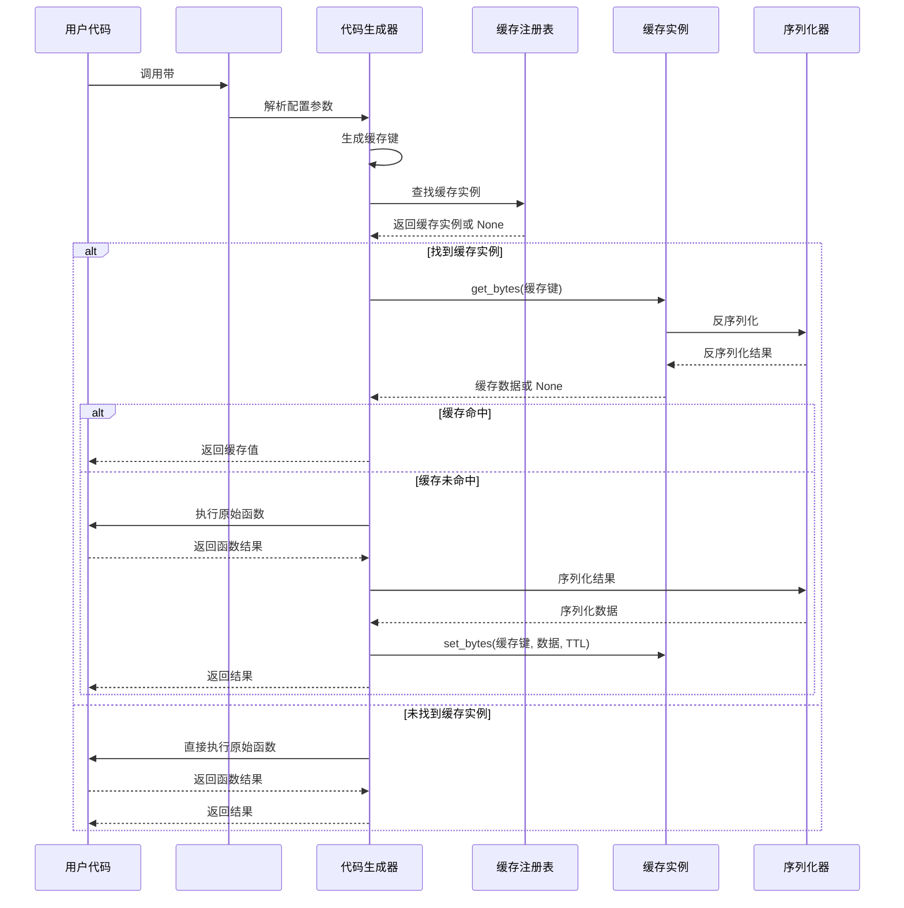
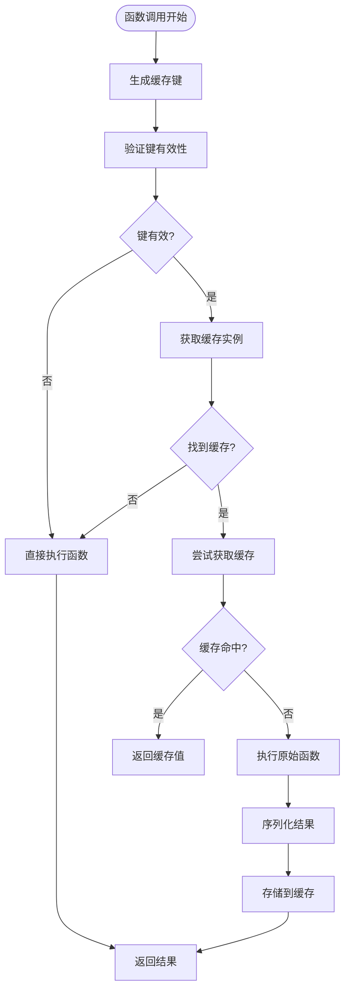
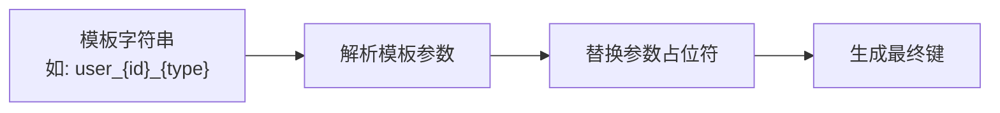
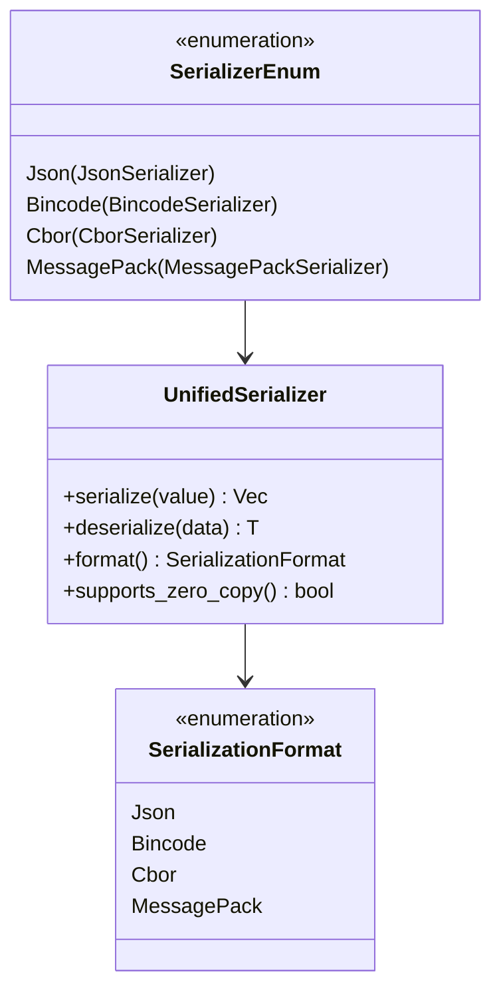
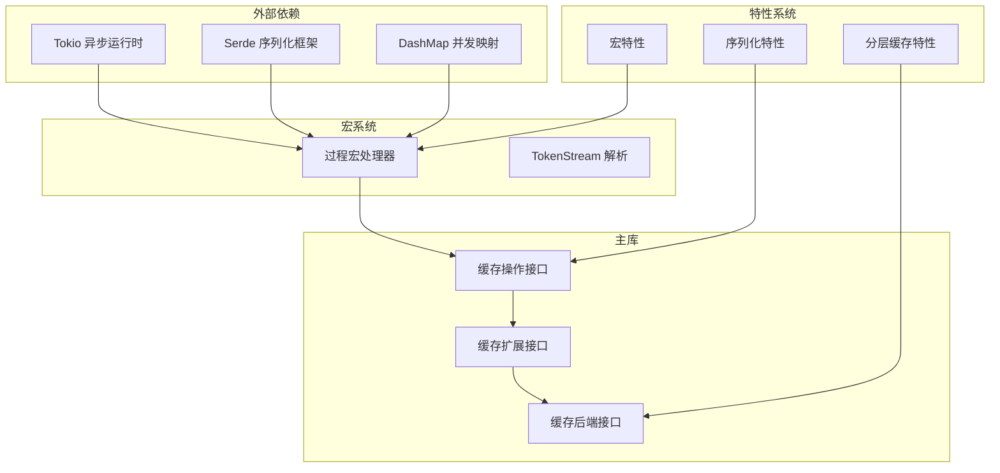

# 宏系统

<cite>
**本文档引用的文件**
- [宏实现源码](file://macros/src/lib.rs)
- [公共库入口](file://src/lib.rs)
- [内部注册表](file://src/internal.rs)
- [缓存接口](file://src/cache_interface.rs)
- [统一序列化](file://src/serialization/unified.rs)
- [键生成器](file://src/utils/key_generator.rs)
- [端到端测试](file://tests/e2e/macro_test.rs)
- [综合示例](file://examples/src/01_basics/example_comprehensive_usage.rs)
- [高级缓存提升示例](file://examples/src/02_advanced/example_cache_promotion.rs)
- [Cargo.toml](file://Cargo.toml)
</cite>

## 目录
1. [简介](#简介)
2. [项目结构](#项目结构)
3. [核心组件](#核心组件)
4. [架构概览](#架构概览)
5. [详细组件分析](#详细组件分析)
6. [依赖关系分析](#依赖关系分析)
7. [性能考虑](#性能考虑)
8. [故障排除指南](#故障排除指南)
9. [结论](#结论)
10. [附录](#附录)

## 简介

oxcache 宏系统提供了 #[cached] 宏，这是一个强大的装饰器宏，能够自动为异步函数添加缓存功能。该宏通过编译时代码生成，在保持原函数语义的同时，为函数调用提供透明的缓存支持。

宏系统的核心特性包括：
- 自动缓存键生成和管理
- 多种缓存类型支持（L1/L2/两层缓存）
- 灵活的 TTL（生存时间）配置
- 多种序列化格式支持
- 完整的错误处理和回退机制

## 项目结构

宏系统位于独立的 `macros` 子模块中，与主库通过条件编译集成：

```mermaid
graph TB
subgraph "宏系统架构"
MacroLib[宏库<br/>macros/src/lib.rs]
ProcMacro[过程宏<br/>#[cached]]
CodeGen[代码生成<br/>展开后的函数]
end
subgraph "主库集成"
PublicAPI[公共API<br/>src/lib.rs]
InternalReg[内部注册表<br/>src/internal.rs]
CacheInterface[缓存接口<br/>src/cache_interface.rs]
end
subgraph "序列化系统"
UnifiedSer[统一序列化<br/>src/serialization/unified.rs]
KeyGen[键生成器<br/>src/utils/key_generator.rs]
end
MacroLib --> ProcMacro
ProcMacro --> CodeGen
CodeGen --> InternalReg
InternalReg --> CacheInterface
CacheInterface --> UnifiedSer
MacroLib --> KeyGen
```

**图表来源**
- [宏实现源码](file://macros/src/lib.rs#L45-L314)
- [公共库入口](file://src/lib.rs#L518-L524)
- [内部注册表](file://src/internal.rs#L15-L33)

**章节来源**
- [宏实现源码](file://macros/src/lib.rs#L1-L314)
- [公共库入口](file://src/lib.rs#L417-L524)

## 核心组件

### #[cached] 宏配置选项

宏支持以下配置选项：

| 选项 | 类型 | 默认值 | 描述 |
|------|------|--------|------|
| `service` | 字符串 | "default" | 缓存服务名称，用于注册表查找 |
| `ttl` | 整数 | None | 缓存生存时间（秒），None 表示不过期 |
| `key` | 字符串 | None | 自定义键格式模式，如 "user_{id}" |
| `key_prefix` | 字符串 | None | 键前缀，与默认生成结合使用 |
| `key_generator` | 字符串 | "default" | 键生成器类型：simple/md5/murmur3/namespace |
| `cache_type` | 字符串 | "two-level" | 缓存类型：l1-only/l2-only/two-level |

### 缓存键生成策略

宏支持多种键生成策略：

1. **自定义格式模式**：使用字符串模板，如 `"user_{id}_{type}"`
2. **简单生成器**：基于服务名、函数名和参数的简单组合
3. **哈希生成器**：MD5 或 Murmur3 哈希，适用于复杂参数
4. **命名空间生成器**：支持键前缀和命名空间管理

**章节来源**
- [宏实现源码](file://macros/src/lib.rs#L51-L100)
- [宏实现源码](file://macros/src/lib.rs#L151-L255)

## 架构概览

宏系统的工作流程分为三个主要阶段：



**图表来源**
- [宏实现源码](file://macros/src/lib.rs#L257-L310)
- [内部注册表](file://src/internal.rs#L21-L33)
- [统一序列化](file://src/serialization/unified.rs#L129-L161)

## 详细组件分析

### 宏展开后的代码结构

当 #[cached] 宏处理函数时，它会生成一个包装函数，该函数包含以下核心逻辑：



**图表来源**
- [宏实现源码](file://macros/src/lib.rs#L257-L310)

### 缓存键生成算法

宏支持多种键生成策略，每种都有其特定的适用场景：

#### 1. 自定义格式模式


#### 2. 哈希键生成器
对于复杂参数，宏使用哈希算法生成固定长度的键：
- MD5：生成 32 字符十六进制字符串
- Murmur3：生成 32 位哈希值
- 简单：基于参数值的简单哈希

#### 3. 命名空间键生成器
支持键的层次化组织：
- 命名空间前缀
- 应用前缀
- 函数名标识
- 参数值组合

**章节来源**
- [宏实现源码](file://macros/src/lib.rs#L151-L225)
- [键生成器](file://src/utils/key_generator.rs#L128-L142)

### 序列化配置

宏使用统一的序列化系统来处理缓存数据的序列化和反序列化：



**图表来源**
- [统一序列化](file://src/serialization/unified.rs#L27-L35)
- [统一序列化](file://src/serialization/unified.rs#L52-L65)

**章节来源**
- [统一序列化](file://src/serialization/unified.rs#L129-L161)
- [缓存接口](file://src/cache_interface.rs#L346-L364)

### 缓存类型配置

宏支持三种缓存类型，每种都有不同的适用场景：

| 缓存类型 | 描述 | 适用场景 | 性能特征 |
|----------|------|----------|----------|
| `two-level` | L1 + L2 分层缓存 | 高并发、需要快速响应 | 最佳整体性能 |
| `l1-only` | 仅内存缓存 | 本地应用、快速访问 | 最快响应时间 |
| `l2-only` | 仅分布式缓存 | 共享缓存、跨进程 | 最大缓存容量 |

**章节来源**
- [宏实现源码](file://macros/src/lib.rs#L300-L304)

## 依赖关系分析

宏系统与主库的集成通过以下依赖关系实现：



**图表来源**
- [Cargo.toml](file://Cargo.toml#L235-L346)
- [宏实现源码](file://macros/src/lib.rs#L7-L11)

**章节来源**
- [Cargo.toml](file://Cargo.toml#L235-L346)
- [公共库入口](file://src/lib.rs#L518-L524)

## 性能考虑

### 缓存键生成性能

宏在编译时进行大部分键生成逻辑的解析，运行时只执行必要的字符串拼接操作。对于复杂键生成器（如哈希生成器），性能开销主要来自于哈希计算。

### 序列化性能优化

- **零拷贝支持**：Bincode 格式支持零拷贝序列化
- **格式选择**：JSON 格式便于调试，Bincode 格式更高效
- **压缩选项**：可选的压缩功能平衡存储空间和 CPU 使用

### 内存管理

宏生成的代码包含内存安全检查：
- 缓存键长度限制（默认 1024 字节）
- 无效字符检测和过滤
- 自动回退到直接执行模式

## 故障排除指南

### 常见问题及解决方案

#### 1. 缓存未生效
**症状**：函数每次调用都重新执行
**原因**：
- 缓存实例未正确注册
- 缓存键生成冲突
- 缓存服务名称不匹配

**Solution**:
```rust
// Ensure cache instance is registered correctly (using new API)
let cache = Cache::memory().await?;
cache.register_for_macro("default").await;

// Use the correct service name
#[cached(service = "default")]
async fn my_function() -> Result<...> {
    // Function implementation
}
```

#### 2. 缓存键过长
**症状**：日志出现 "Cache key too long" 警告
**原因**：生成的缓存键超过 1024 字节限制
**解决方法**：
```rust
// 使用哈希键生成器
#[cached(key_generator = "md5")]
async fn my_function(param: ComplexStruct) -> Result<...> {
    // 函数实现
}

// 或者自定义键生成
#[cached(key = "short_key_{id}")]
async fn my_function(id: u64, param: ComplexStruct) -> Result<...> {
    // 函数实现
}
```

#### 3. 序列化错误
**症状**：缓存读取失败或返回错误
**原因**：返回类型不支持序列化
**解决方法**：
```rust
// 确保返回类型实现序列化
#[derive(Serialize, Deserialize)]
struct MyResult {
    data: String,
    count: u32,
}

#[cached]
async fn my_function() -> Result<MyResult, Error> {
    // 函数实现
}
```

### 调试技巧

#### 1. 启用详细日志
```rust
// 设置环境变量启用调试日志
// RUST_LOG=oxcache=trace cargo run
```

#### 2. 检查缓存状态
```rust
// 获取缓存统计信息
if let Ok(stats) = cache.stats().await {
    for (key, value) in stats {
        println!("{}: {}", key, value);
    }
}
```

#### 3. 验证键生成
```rust
// 手动验证键生成逻辑
let key = KeyGenerator::simple("service", "function_name")
    .generate_full("template_{param}", &[("param", "value")]);
println!("Generated key: {}", key);
```

#### 4. 宏参数注意事项
- 从 `cache` 参数改为 `service` 参数：旧版本使用 `#[cached(cache = "...")]`，新版本使用 `#[cached(service = "...")]`
- 多参数函数处理：宏现在会正确处理多参数函数，避免借用冲突
- 常量访问修复：宏现在使用 `validate_cache_key` 函数进行缓存键验证

**章节来源**
- [宏实现源码](file://macros/src/lib.rs#L261-L276)
- [内部注册表](file://src/internal.rs#L21-L33)
- [键生成器](file://src/utils/key_generator.rs#L128-L142)
- [验证函数](file://src/utils/mod.rs#L1-L10)

## 结论

oxcache 的 #[cached] 宏系统提供了一个强大而灵活的缓存解决方案。通过编译时代码生成和运行时优化，它能够在保持代码简洁性的同时，提供企业级的缓存功能。

### 主要优势

1. **零样板代码**：自动处理缓存逻辑，无需手动编写重复代码
2. **类型安全**：编译时检查确保缓存键和序列化兼容性
3. **灵活配置**：支持多种缓存策略和序列化格式
4. **性能优化**：智能的键生成和序列化策略
5. **错误处理**：完善的错误处理和回退机制

### 适用场景

- 高并发 Web 服务的 API 缓存
- 数据库查询结果缓存
- 复杂计算结果缓存
- 微服务间的缓存共享

## 附录

### 完整使用示例

#### 基础使用
```rust
#[cached]
async fn getUser(id: u64) -> Result<User, Error> {
    // 从数据库获取用户
    Ok(user)
}
```

#### 高级配置
```rust
#[cached(
    service = "user_cache",
    ttl = 3600,
    key_generator = "md5",
    cache_type = "two-level"
)]
async fn getUserWithCache(id: u64, includeProfile: bool) -> Result<User, Error> {
    // 复杂的用户获取逻辑
    Ok(user)
}
```

#### 自定义键生成
```rust
#[cached(
    key = "user_profile_{user_id}_{include_preferences}",
    ttl = 1800
)]
async fn getUserProfile(user_id: u64, include_preferences: bool) -> Result<UserProfile, Error> {
    // 用户资料获取逻辑
    Ok(profile)
}
```

### 最佳实践

1. **合理设置 TTL**：根据数据变化频率设置合适的过期时间
2. **选择合适的键生成器**：复杂参数使用哈希生成器
3. **监控缓存性能**：定期检查命中率和性能指标
4. **错误处理**：确保函数返回类型支持序列化
5. **资源清理**：及时清理不再使用的缓存键