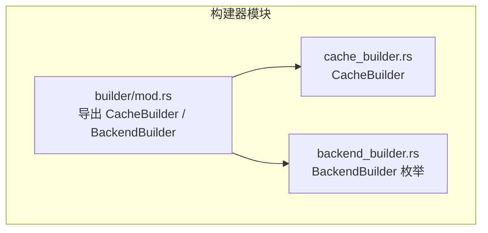
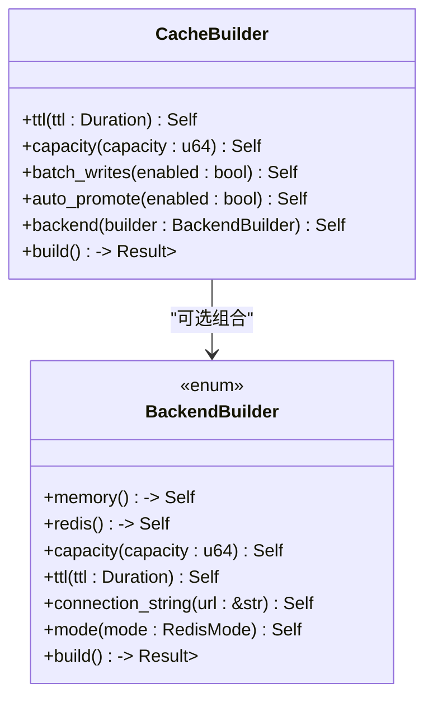
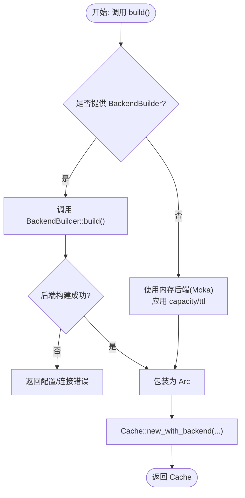
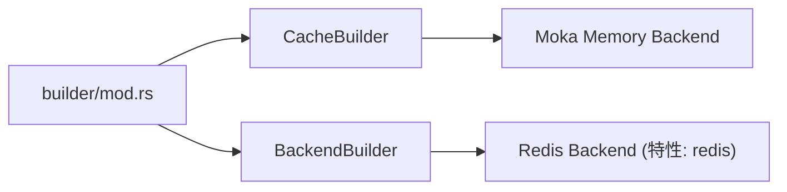

# 构建器

<cite>
**本文引用的文件**
- [src/builder/cache_builder.rs](file://src/builder/cache_builder.rs)
- [src/builder/backend_builder.rs](file://src/builder/backend_builder.rs)
- [src/builder/mod.rs](file://src/builder/mod.rs)
- [Cargo.toml](file://Cargo.toml)
- [docs/API_REFERENCE.md](file://docs/API_REFERENCE.md)
- [examples/src/01_basics/example_comprehensive_usage.rs](file://examples/src/01_basics/example_comprehensive_usage.rs)
- [examples/src/02_advanced/example_batch_write.rs](file://examples/src/02_advanced/example_batch_write.rs)
- [examples/src/02_advanced/example_cache_promotion.rs](file://examples/src/02_advanced/example_cache_promotion.rs)
- [examples/src/redis_native.rs](file://examples/src/redis_native.rs)
</cite>

## 目录
1. [简介](#简介)
2. [项目结构](#项目结构)
3. [核心组件](#核心组件)
4. [架构总览](#架构总览)
5. [组件详解](#组件详解)
6. [依赖关系分析](#依赖关系分析)
7. [性能考量](#性能考量)
8. [故障排查指南](#故障排查指南)
9. [结论](#结论)
10. [附录：配置示例与最佳实践](#附录配置示例与最佳实践)

## 简介
本文件系统性阐述 Oxcache 的构建器 API，聚焦于 CacheBuilder 与 BackendBuilder 的配置选项、链式调用方法、默认值、验证与错误处理、特性门控对其可用性的限制，并提供从简单到复杂的渐进式配置示例。文档同时解释构建器模式的设计原理与使用优势，帮助读者高效、安全地构建不同类型的缓存实例。

## 项目结构
构建器相关代码位于 src/builder 目录，对外通过模块入口导出：
- 入口模块：src/builder/mod.rs
- CacheBuilder 实现：src/builder/cache_builder.rs
- BackendBuilder 实现：src/builder/backend_builder.rs

**图表来源**
- [src/builder/mod.rs](file://src/builder/mod.rs#L1-L12)
- [src/builder/cache_builder.rs](file://src/builder/cache_builder.rs#L1-L248)
- [src/builder/backend_builder.rs](file://src/builder/backend_builder.rs#L1-L250)

**章节来源**
- [src/builder/mod.rs](file://src/builder/mod.rs#L1-L12)

## 核心组件
- CacheBuilder<K, V>：用于配置并构建 Cache 实例，支持 TTL、容量、批写入、自动提升等高级选项。
- BackendBuilder：用于配置底层缓存后端，支持内存后端与 Redis 后端（受特性门控控制）。

两者均采用“不可变更新”的链式构建模式，最终通过 build() 完成实例化。

**章节来源**
- [src/builder/cache_builder.rs](file://src/builder/cache_builder.rs#L38-L209)
- [src/builder/backend_builder.rs](file://src/builder/backend_builder.rs#L40-L221)

## 架构总览
构建器之间的交互关系如下：

**图表来源**
- [src/builder/cache_builder.rs](file://src/builder/cache_builder.rs#L60-L209)
- [src/builder/backend_builder.rs](file://src/builder/backend_builder.rs#L54-L221)

## 组件详解

### CacheBuilder<K, V> 配置项与默认值
- 类型参数
  - K：键类型，需实现 CacheKey trait
  - V：值类型，需实现 Cacheable trait
- 字段与默认值
  - backend_builder: None（可选）
  - ttl: None（可选）
  - capacity: None（可选）
  - batch_writes: false（默认关闭）
  - auto_promote: true（默认开启）
- 关键方法
  - ttl(ttl: Duration) -> Self：设置默认 TTL
  - capacity(capacity: u64) -> Self：设置内存后端容量
  - batch_writes(enabled: bool) -> Self：启用/禁用批写入
  - auto_promote(enabled: bool) -> Self：启用/禁用 L2->L1 自动提升
  - backend(builder: BackendBuilder) -> Self：注入后端构建器
  - build() -> Result<Cache<K,V>>：构建缓存实例
- 行为说明
  - 若未显式传入 backend_builder，则默认使用内存后端（Moka），容量来自 capacity 参数或默认值。
  - 支持将 TTL 作为全局默认 TTL 传递给后端（内存后端支持显式 TTL；Redis 后端由其自身策略管理）。

**章节来源**
- [src/builder/cache_builder.rs](file://src/builder/cache_builder.rs#L38-L209)

### BackendBuilder 配置项与默认值
- 枚举成员
  - Memory { capacity: u64, ttl: Option<Duration> }：默认 capacity=10000，ttl=None
  - Redis { connection_string: Option<String>, mode: RedisMode }：默认 Standalone 模式，connection_string=None
- 关键方法
  - memory() -> Self：创建内存后端构建器
  - redis() -> Self：创建 Redis 后端构建器（受特性门控）
  - capacity(capacity: u64) -> Self：设置内存后端容量
  - ttl(ttl: Duration) -> Self：设置内存后端 TTL
  - connection_string(url: &str) -> Self：设置 Redis 连接字符串（必填，否则构建时报错）
  - mode(mode: RedisMode) -> Self：设置 Redis 模式（Standalone/Sentinel/Cluster）
  - build() -> Result<Arc<dyn CacheBackend>>：构建后端实例
- 错误处理
  - Redis 后端必须提供 connection_string，否则返回配置错误。

**章节来源**
- [src/builder/backend_builder.rs](file://src/builder/backend_builder.rs#L40-L221)

### 特性门控与可用性限制
- 特性门控影响
  - Redis 后端仅在启用 redis 特性时可用（BackendBuilder::redis 及相关方法）
  - 构建器 API 本身不依赖特性门控，但具体后端能力受特性影响
- 特性列表与依赖（节选）
  - minimal：启用 moka、基础日志与序列化
  - core：minimal + redis
  - full：core + 多种高级特性（宏、布隆过滤、限流、WAL、数据库、CLI、指标、批写、智能策略等）
- 参考
  - 特性要求与依赖详见 API 文档“Feature Requirements”章节

**章节来源**
- [Cargo.toml](file://Cargo.toml#L235-L347)
- [docs/API_REFERENCE.md](file://docs/API_REFERENCE.md#L27-L91)

### 配置验证与错误处理
- Redis 后端
  - 必须提供 connection_string，否则在 build() 时返回配置错误
- 内存后端
  - capacity 与 ttl 为可选；若未提供 capacity，将使用默认值
- CacheBuilder.build()
  - 若未提供 backend_builder，则内部创建内存后端并按需应用 capacity
  - 返回统一的 Result<Cache<K,V>>，便于上层捕获错误

**图表来源**
- [src/builder/cache_builder.rs](file://src/builder/cache_builder.rs#L193-L209)
- [src/builder/backend_builder.rs](file://src/builder/backend_builder.rs#L191-L221)

**章节来源**
- [src/builder/backend_builder.rs](file://src/builder/backend_builder.rs#L207-L211)
- [src/builder/cache_builder.rs](file://src/builder/cache_builder.rs#L193-L209)

### 设计原理与使用优势
- 设计原理
  - 不可变更新：每次配置方法返回 Self，保证链式调用时状态不可变
  - 显式默认值：通过 Default 实现清晰表达默认行为
  - 可插拔后端：通过 BackendBuilder 抽象，支持内存与 Redis 等后端切换
- 使用优势
  - 类型安全：泛型 K/V 确保键值类型一致
  - 灵活组合：可独立配置 TTL、容量、批写入、自动提升与后端
  - 易于测试：可创建多个隔离的缓存实例进行单元测试
  - 性能友好：批写入与自动提升等优化在构建阶段即可启用

**章节来源**
- [src/builder/cache_builder.rs](file://src/builder/cache_builder.rs#L47-L58)
- [docs/API_REFERENCE.md](file://docs/API_REFERENCE.md#L807-L812)

## 依赖关系分析
- 模块依赖
  - builder/mod.rs 将 BackendBuilder 与 CacheBuilder 对外导出
  - CacheBuilder 依赖 BackendBuilder 与内存后端（Moka）
  - BackendBuilder 依赖 Redis 后端（在启用 redis 特性时）
- 特性依赖
  - redis 特性开启时，BackendBuilder::redis 可用
  - moka 特性开启时，内存后端可用

**图表来源**
- [src/builder/mod.rs](file://src/builder/mod.rs#L7-L11)
- [src/builder/cache_builder.rs](file://src/builder/cache_builder.rs#L8-L9)
- [src/builder/backend_builder.rs](file://src/builder/backend_builder.rs#L8-L9)
- [Cargo.toml](file://Cargo.toml#L254-L259)

**章节来源**
- [src/builder/mod.rs](file://src/builder/mod.rs#L7-L11)
- [Cargo.toml](file://Cargo.toml#L254-L259)

## 性能考量
- 批写入（batch_writes）
  - 适用于高吞吐场景，减少网络/IO开销
  - 适合与并发写入配合使用
- 自动提升（auto_promote）
  - 热点数据自动从 L2 提升至 L1，降低 L2 访问延迟
- TTL 策略
  - 全局 TTL 与单次写入 TTL 可结合使用，避免过期风暴
- 容量规划
  - 内存后端容量直接影响命中率与内存占用，建议根据业务峰值合理设置

[本节为通用指导，无需特定文件引用]

## 故障排查指南
- Redis 连接失败或未提供连接串
  - 现象：BackendBuilder::build() 返回配置错误
  - 处理：确保提供有效的 connection_string，并检查 Redis 服务可达性
- 缓存健康检查失败
  - 现象：health_check() 返回异常
  - 处理：确认后端连接正常，必要时降级为 L1-only 模式
- 批写入未生效
  - 现象：写入性能未显著提升
  - 处理：确认 batch_writes 已启用，且写入路径支持批处理优化

**章节来源**
- [src/builder/backend_builder.rs](file://src/builder/backend_builder.rs#L207-L211)

## 结论
通过 CacheBuilder 与 BackendBuilder，Oxcache 提供了类型安全、灵活可组合的缓存构建体验。借助特性门控，用户可在最小化依赖与全功能之间自由选择；通过链式配置，可轻松实现从内存缓存到分层缓存的多种形态。建议在生产环境中结合批写入、自动提升与合理的 TTL/容量策略，以获得最佳性能与稳定性。

[本节为总结，无需特定文件引用]

## 附录：配置示例与最佳实践

### 渐进式示例

- 最简内存缓存
  - 使用 Cache::new() 即可创建内存缓存；如需显式配置，可使用 CacheBuilder::default().build()
  - 参考示例：[examples/src/01_basics/example_comprehensive_usage.rs](file://examples/src/01_basics/example_comprehensive_usage.rs#L41-L44)

- 带 TTL 的内存缓存
  - 通过 CacheBuilder::default().ttl(Duration::from_secs(X)).build()
  - 参考示例：[examples/src/01_basics/example_comprehensive_usage.rs](file://examples/src/01_basics/example_comprehensive_usage.rs#L158-L167)

- 带容量的内存缓存
  - 通过 CacheBuilder::default().capacity(N).build()
  - 参考示例：[src/builder/cache_builder.rs](file://src/builder/cache_builder.rs#L102-L104)

- 启用批写入
  - 通过 CacheBuilder::default().batch_writes(true).build()
  - 参考示例：[examples/src/02_advanced/example_batch_write.rs](file://examples/src/02_advanced/example_batch_write.rs#L75-L91)

- 启用自动提升（L2->L1）
  - 通过 CacheBuilder::default().auto_promote(true).build()
  - 参考示例：[examples/src/02_advanced/example_cache_promotion.rs](file://examples/src/02_advanced/example_cache_promotion.rs#L24-L60)

- 使用 Redis 后端（需启用 redis 特性）
  - 通过 BackendBuilder::redis().connection_string("...").mode(...).build()
  - 参考示例：[examples/src/redis_native.rs](file://examples/src/redis_native.rs#L24-L26)

- 分层缓存（L1 + L2）
  - 通过 CacheBuilder::default().backend(BackendBuilder::memory().capacity(N)).build()
  - 或使用 Cache::tiered(...)（参考示例）
  - 参考示例：[examples/src/01_basics/example_comprehensive_usage.rs](file://examples/src/01_basics/example_comprehensive_usage.rs#L52-L54)

### API 参考要点
- 特性门控与功能依赖：详见 API 文档“Feature Requirements”
- 构建器默认值与行为：详见各方法注释与实现
- 错误类型与处理：参见 API 文档“Error Handling”

**章节来源**
- [docs/API_REFERENCE.md](file://docs/API_REFERENCE.md#L27-L91)
- [docs/API_REFERENCE.md](file://docs/API_REFERENCE.md#L641-L655)
- [examples/src/01_basics/example_comprehensive_usage.rs](file://examples/src/01_basics/example_comprehensive_usage.rs#L41-L54)
- [examples/src/02_advanced/example_batch_write.rs](file://examples/src/02_advanced/example_batch_write.rs#L75-L91)
- [examples/src/02_advanced/example_cache_promotion.rs](file://examples/src/02_advanced/example_cache_promotion.rs#L24-L60)
- [examples/src/redis_native.rs](file://examples/src/redis_native.rs#L24-L26)