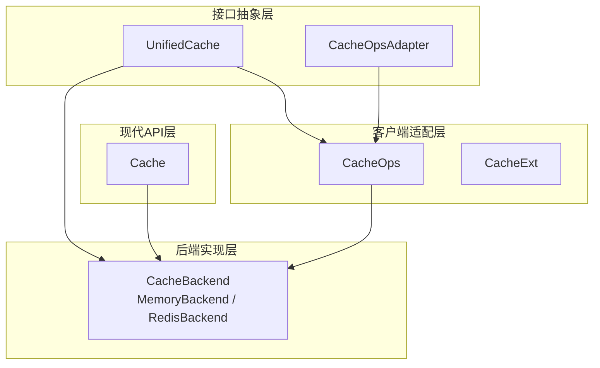
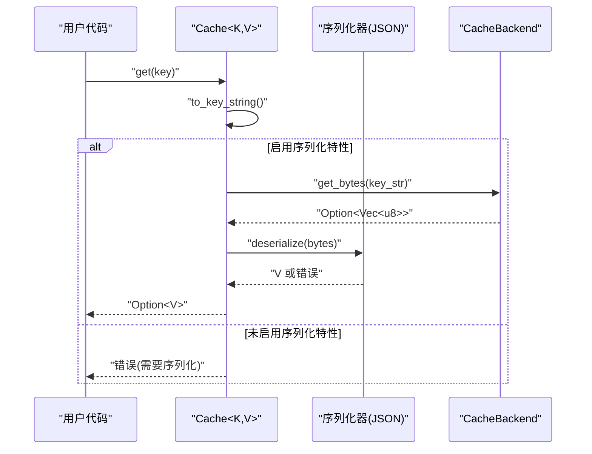
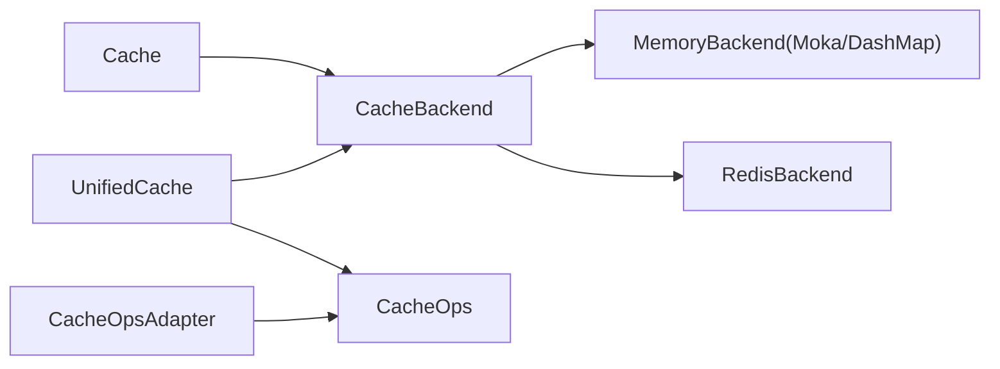

# 核心接口

<cite>
**本文引用的文件**
- [src/lib.rs](file://src/lib.rs)
- [src/cache.rs](file://src/cache.rs)
- [src/cache_interface.rs](file://src/cache_interface.rs)
- [src/client/mod.rs](file://src/client/mod.rs)
- [src/traits/cache_key.rs](file://src/traits/cache_key.rs)
- [src/traits/cacheable.rs](file://src/traits/cacheable.rs)
- [src/backend/mod.rs](file://src/backend/mod.rs)
- [src/backend/client/mod.rs](file://src/backend/client/mod.rs)
- [src/error.rs](file://src/error.rs)
- [Cargo.toml](file://Cargo.toml)
- [examples/src/01_basics/example_basic_operations.rs](file://examples/src/01_basics/example_basic_operations.rs)
- [examples/src/02_advanced/example_batch_write.rs](file://examples/src/02_advanced/example_batch_write.rs)
</cite>

## 目录
1. [简介](#简介)
2. [项目结构](#项目结构)
3. [核心组件](#核心组件)
4. [架构总览](#架构总览)
5. [详细组件分析](#详细组件分析)
6. [依赖关系分析](#依赖关系分析)
7. [性能考量](#性能考量)
8. [故障排查指南](#故障排查指南)
9. [结论](#结论)
10. [附录](#附录)

## 简介
本文件聚焦 Oxcache 的核心接口与使用规范，围绕以下目标展开：
- 全面梳理 Cache、UnifiedCache、CacheOpsAdapter 等主要接口的方法签名与行为边界
- 明确 Cache 泛型参数约束、生命周期要求与使用模式
- 解释 CacheKey 与 Cacheable trait 的实现要求与最佳实践
- 详述各方法的异步返回类型、错误处理机制与性能特征
- 提供从基础 CRUD 到高级批量操作的完整使用示例路径
- 说明接口的线程安全与并发注意事项

## 项目结构
Oxcache 采用“现代 API + 插件化后端”的架构设计：
- 现代 API 层：以 Cache<K, V> 为核心入口，提供类型安全的键值操作与高级能力
- 接口抽象层：UnifiedCache 统一抽象底层 CacheBackend、CacheOps、CacheExt 的能力
- 客户端适配层：CacheOpsAdapter 将旧版 CacheOps 能力桥接到 UnifiedCache
- 后端实现层：内存与 Redis 等后端通过统一接口暴露给上层

**图表来源**
- [src/cache.rs](file://src/cache.rs#L117-L646)
- [src/cache_interface.rs](file://src/cache_interface.rs#L18-L300)
- [src/client/mod.rs](file://src/client/mod.rs#L18-L304)
- [src/backend/client/mod.rs](file://src/backend/client/mod.rs#L1-L34)

**章节来源**
- [src/lib.rs](file://src/lib.rs#L517-L639)
- [src/backend/mod.rs](file://src/backend/mod.rs#L1-L59)

## 核心组件
本节对三大核心接口进行系统化说明。

### Cache<K, V>
- 角色定位：现代 API 的统一入口，面向用户提供的类型安全缓存实例
- 泛型约束
  - K 必须实现 CacheKey：提供稳定的字符串键表示
  - V 必须实现 Cacheable：可序列化/反序列化，用于 typed get/set
- 生命周期与所有权
  - 内部持有 Arc<dyn CacheBackend>，支持跨任务共享与并发安全
  - 提供 to_cache_ops 与 register_for_macro 以便与全局注册与 #[cached] 宏集成
- 主要方法概览（详见下一节“详细组件分析”）
  - 构造：new/memory/redis/builder
  - 基础操作：get/set/set_with_ttl/delete/exists/clear
  - 高级模式：get_or/fallback 计算与缓存
  - 批量操作：set_many/get_many/delete_many
  - 运维：stats/health_check/shutdown
  - 注册：to_cache_ops/register_for_macro

**章节来源**
- [src/cache.rs](file://src/cache.rs#L87-L646)
- [src/traits/cache_key.rs](file://src/traits/cache_key.rs#L38-L49)
- [src/traits/cacheable.rs](file://src/traits/cacheable.rs#L7-L45)

### UnifiedCache
- 角色定位：统一抽象，整合 CacheBackend、CacheOps、CacheExt 的能力
- 设计要点
  - 同时提供字节级与类型级操作，以及 L1/L2 分层与分布式锁能力
  - 对不支持的操作提供默认实现（返回 NotSupported 或空实现）
  - 通过 serializer() 暴露序列化策略，便于 typed 操作
- 适用场景
  - 作为插件化后端的统一对外接口
  - 适配旧版 CacheOps 到新接口栈

**章节来源**
- [src/cache_interface.rs](file://src/cache_interface.rs#L18-L300)

### CacheOpsAdapter
- 角色定位：将旧版 CacheOps 能力桥接至 UnifiedCache
- 行为特征
  - 将 TTL 秒数转换为 Duration
  - 对不支持的能力返回 NotSupported
  - 通过 ops.serializer() 传递序列化器

**章节来源**
- [src/cache_interface.rs](file://src/cache_interface.rs#L375-L487)

## 架构总览
下面的时序图展示了 Cache.get 的典型调用链，体现从类型安全到序列化再到后端存储的完整流程。

**图表来源**
- [src/cache.rs](file://src/cache.rs#L241-L264)

## 详细组件分析

### Cache<K, V> API 详解
- 构造与初始化
  - new()/memory()：创建内存后端缓存
  - redis()：在启用 redis 特性时创建 Redis 后端缓存
  - builder()：高级配置入口（容量、TTL 等）
- 基础操作
  - get(key): 异步返回 Option<V>；未启用序列化特性时返回错误
  - set(key, value)/set_with_ttl(key, value, ttl): 异步返回 ()
  - delete(key): 异步返回 ()
  - exists(key): 异步返回 bool
  - clear(): 异步清空缓存
- 高级模式
  - get_or(key, fallback): 缓存未命中时调用 fallback 计算并写回
- 批量操作
  - set_many(items)/get_many(keys)/delete_many(keys): 迭代式批量处理
- 运维与生命周期
  - stats()/health_check()/shutdown(): 获取统计、健康检查、优雅关闭
  - to_cache_ops()/register_for_macro(): 注册到全局或 #[cached] 宏

返回值与错误处理
- 返回类型均为异步 Result<T>，其中 T 由具体方法决定
- 常见错误类别（参见错误模块）：Serialization、NotFound、NotSupported、BackendError、Timeout 等
- get_or 在 fallback 中抛出的错误会直接透传

性能特征
- set/get 为 O(1) 期望复杂度（内存后端）
- 批量操作建议结合并发与批处理策略（参考示例）
- 序列化成本取决于所选格式与数据大小

使用示例路径
- 基础 CRUD：[示例路径](file://examples/src/01_basics/example_basic_operations.rs#L21-L72)
- 批量写入优化：[示例路径](file://examples/src/02_advanced/example_batch_write.rs#L25-L154)

线程安全与并发
- Cache 内部持有 Arc<dyn CacheBackend>，可跨任务安全共享
- set/get/delete 等方法为异步，需在运行时环境中执行
- 批量操作建议控制并发度，避免过度竞争

**章节来源**
- [src/cache.rs](file://src/cache.rs#L134-L646)
- [src/error.rs](file://src/error.rs#L75-L208)
- [examples/src/01_basics/example_basic_operations.rs](file://examples/src/01_basics/example_basic_operations.rs#L21-L72)
- [examples/src/02_advanced/example_batch_write.rs](file://examples/src/02_advanced/example_batch_write.rs#L25-L154)

### UnifiedCache 接口详解
- 字节级核心操作：get_bytes/set_bytes/delete/exists/clear/close/ttl/expire/health_check/stats
- 分层操作（默认 NotSupported）：get_l1_bytes/set_l1_bytes/clear_l1、get_l2_bytes/set_l2_bytes/clear_l2
- 分布式锁：lock/unlock（默认返回空值或 false）
- 类型级操作：get_typed/set_typed/set_l1_typed/set_l2_typed/get_or_fetch/try_get_typed/remove_typed/contains
- 批量操作：set_many_bytes/get_many_bytes/delete_many、set_many_typed/get_many_typed
- 必需实现：serializer/as_any/into_any_arc

适配与实现
- 为任意 CacheBackend 实现 Blanket 实现，自动获得 UnifiedCache 能力
- CacheOpsAdapter 将旧版 CacheOps 能力桥接至 UnifiedCache

**章节来源**
- [src/cache_interface.rs](file://src/cache_interface.rs#L18-L300)
- [src/cache_interface.rs](file://src/cache_interface.rs#L302-L373)
- [src/cache_interface.rs](file://src/cache_interface.rs#L375-L487)

### CacheOpsAdapter 适配器
- 作用：将旧版 CacheOps 能力桥接至 UnifiedCache
- 关键点
  - TTL 秒数转换为 Duration
  - 对不支持的能力返回 NotSupported
  - 通过 ops.serializer() 传递序列化器

**章节来源**
- [src/cache_interface.rs](file://src/cache_interface.rs#L375-L487)

### CacheKey 与 Cacheable trait
- CacheKey
  - 职责：将任意类型稳定地转为字符串键
  - 约束：Send + Sync
  - 常见实现：String/&str、整数类型等
  - 自定义实现：为 UserId 等类型提供 to_key_string 的确定性映射
- Cacheable
  - 职责：值类型具备序列化/反序列化能力
  - 约束：Sized + Serialize + DeserializeOwned（启用 serialization 特性时）
  - 常见实现：通过 derive(Serialize, Deserialize) 的结构体

最佳实践
- 键空间设计：避免冲突、长度与字符集限制
- 值类型设计：保持可序列化、版本兼容与大小可控
- 键/值的生命周期：避免跨生命周期借用导致的生命周期问题

**章节来源**
- [src/traits/cache_key.rs](file://src/traits/cache_key.rs#L38-L49)
- [src/traits/cache_key.rs](file://src/traits/cache_key.rs#L51-L105)
- [src/traits/cacheable.rs](file://src/traits/cacheable.rs#L7-L45)

## 依赖关系分析
- 特性开关与后端选择
  - moka/dashmap-backend：启用 L1 内存后端
  - redis：启用 L2 Redis 后端
  - serialization/bincode/compression：启用序列化与压缩
  - metrics/opentelemetry/full-metrics：启用可观测性
- Cache 与后端的关系
  - Cache 内部持有 Arc<dyn CacheBackend>，默认内存后端为 Moka
  - 可通过 builder 或 redis() 指定后端
- 客户端与适配
  - CacheOps 为旧版接口，CacheOpsAdapter 用于桥接
  - UnifiedCache 为统一抽象，覆盖 CacheBackend/CacheOps/CacheExt

**图表来源**
- [src/backend/client/mod.rs](file://src/backend/client/mod.rs#L13-L34)
- [src/cache.rs](file://src/cache.rs#L117-L120)
- [src/cache_interface.rs](file://src/cache_interface.rs#L302-L373)

**章节来源**
- [Cargo.toml](file://Cargo.toml#L235-L347)
- [src/backend/mod.rs](file://src/backend/mod.rs#L1-L59)

## 性能考量
- 内存后端（Moka/DashMap）：O(1) 期望复杂度，适合高并发读写
- Redis 后端：网络延迟为主要瓶颈，建议批量写入与合理 TTL
- 序列化成本：JSON/Bincode 等格式在大对象上差异明显，应按场景选择
- 批量操作：并发写入需控制速率，避免后端拥塞
- 统计与指标：通过 stats/health_check 评估命中率与健康状态

[本节为通用指导，无需特定文件引用]

## 故障排查指南
常见错误与处理
- 序列化错误（Serialization）：确认启用 serialization 特性并在 get/set 前后正确序列化
- 未找到（NotFound）：检查键拼写与生命周期
- 不支持（NotSupported）：确认后端是否支持对应能力（如 TTL、分层操作）
- 后端错误（BackendError/L2Error）：检查 Redis 连接与权限
- 超时（Timeout）：增大超时或优化后端性能

定位与诊断
- 使用 health_check/ stats 获取后端状态
- 结合日志与追踪（启用 tracing/opentelemetry）定位慢操作
- 在单元/集成测试中复现问题并最小化示例

**章节来源**
- [src/error.rs](file://src/error.rs#L75-L208)
- [src/cache.rs](file://src/cache.rs#L513-L572)

## 结论
- Cache<K, V> 提供类型安全、易于使用的现代 API
- UnifiedCache 抽象统一了多种后端与能力边界
- CacheOpsAdapter 保障了从旧版到新版的平滑过渡
- CacheKey/Cacheable 确保键值设计的一致性与可维护性
- 合理选择后端与序列化策略、配合批量与并发控制，可获得稳定且高性能的缓存体验

[本节为总结性内容，无需特定文件引用]

## 附录

### API 方法清单与说明（摘要）
- Cache<K, V>
  - new/memory/redis/builder：构造与配置
  - get/set/set_with_ttl/delete/exists/clear：基础与运维
  - get_or：缓存-旁路模式
  - set_many/get_many/delete_many：批量操作
  - stats/health_check/shutdown：运维与生命周期
  - to_cache_ops/register_for_macro：注册与宏集成
- UnifiedCache
  - 字节级：get_bytes/set_bytes/delete/exists/clear/close/ttl/expire/health_check/stats
  - 分层：get_l1_bytes/set_l1_bytes/clear_l1、get_l2_bytes/set_l2_bytes/clear_l2
  - 分布式：lock/unlock
  - 类型级：get_typed/set_typed/set_l1_typed/set_l2_typed/get_or_fetch/try_get_typed/remove_typed/contains
  - 批量：set_many_bytes/get_many_bytes/delete_many、set_many_typed/get_many_typed
- CacheOpsAdapter
  - 将 CacheOps 能力桥接至 UnifiedCache

**章节来源**
- [src/cache.rs](file://src/cache.rs#L134-L646)
- [src/cache_interface.rs](file://src/cache_interface.rs#L18-L300)
- [src/cache_interface.rs](file://src/cache_interface.rs#L375-L487)

### 使用场景示例路径
- 基础 CRUD：[示例路径](file://examples/src/01_basics/example_basic_operations.rs#L21-L72)
- 批量写入优化：[示例路径](file://examples/src/02_advanced/example_batch_write.rs#L25-L154)

**章节来源**
- [examples/src/01_basics/example_basic_operations.rs](file://examples/src/01_basics/example_basic_operations.rs#L21-L72)
- [examples/src/02_advanced/example_batch_write.rs](file://examples/src/02_advanced/example_batch_write.rs#L25-L154)
