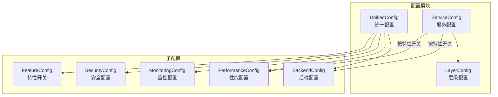
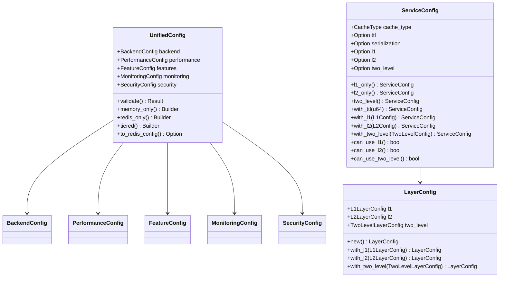
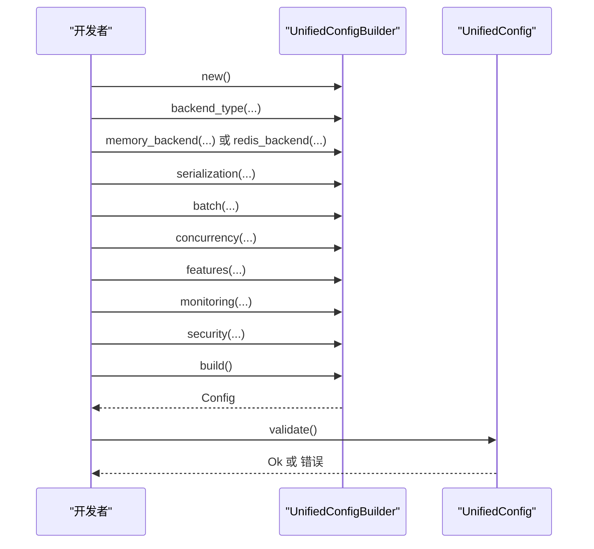
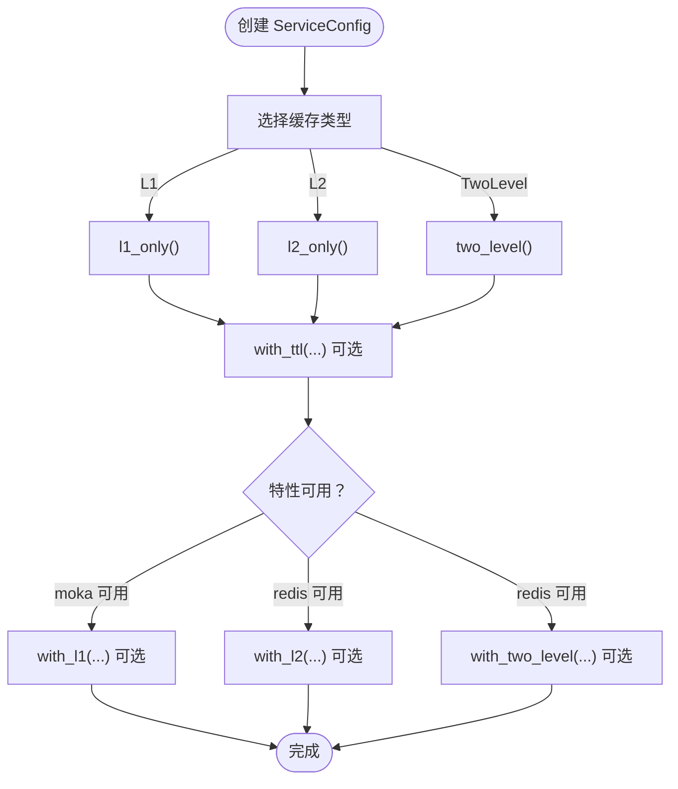
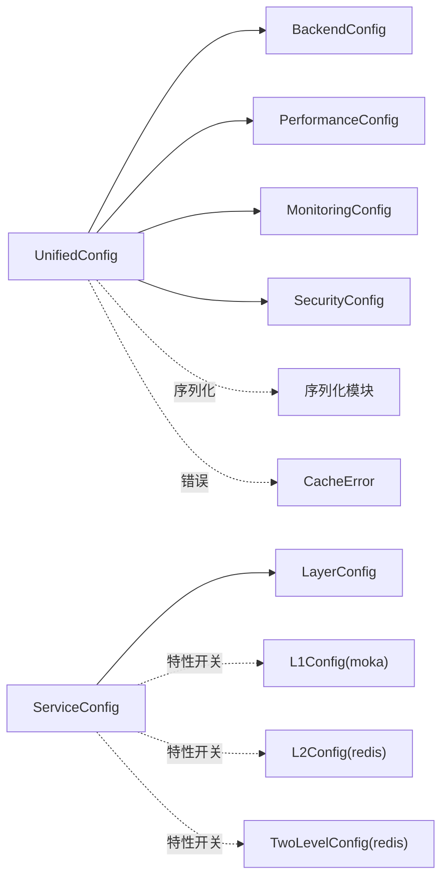

# 配置 API

<cite>
**本文引用的文件**
- [src/config/mod.rs](file://src/config/mod.rs)
- [src/config/unified.rs](file://src/config/unified.rs)
- [src/config/service.rs](file://src/config/service.rs)
- [src/config/layer.rs](file://src/config/layer.rs)
- [src/error.rs](file://src/error.rs)
- [src/serialization/mod.rs](file://src/serialization/mod.rs)
- [src/serialization/unified.rs](file://src/serialization/unified.rs)
- [examples/src/dynamic_config.rs](file://examples/src/dynamic_config.rs)
- [examples/src/01_basics/example_serialization.rs](file://examples/src/01_basics/example_serialization.rs)
- [tests/test_config.toml](file://tests/test_config.toml)
</cite>

## 目录
1. [简介](#简介)
2. [项目结构](#项目结构)
3. [核心组件](#核心组件)
4. [架构总览](#架构总览)
5. [详细组件分析](#详细组件分析)
6. [依赖分析](#依赖分析)
7. [性能考虑](#性能考虑)
8. [故障排查指南](#故障排查指南)
9. [结论](#结论)
10. [附录](#附录)

## 简介
本文件为 Oxcache 配置系统的完整 API 文档，覆盖 UnifiedConfig、ServiceConfig、LayerConfig 等配置类型及其层次结构与继承关系。文档重点说明：
- 配置项的层次结构与继承关系
- 各类配置场景的完整示例（简单配置、复杂多层配置、动态配置更新）
- 配置验证机制与错误处理
- 配置序列化与反序列化 API 使用方法
- 运行时修改与热重载能力
- 最佳实践与性能优化建议

## 项目结构
配置系统位于 src/config 目录，采用模块化设计：
- unified：统一配置入口，聚合后端、性能、监控、安全等配置，并提供构建器与便捷函数
- service：面向服务的配置，按特性开关暴露 L1/L2/TwoLevel 等配置
- layer：层级默认配置，为 ServiceConfig 提供默认值来源

图表来源
- [src/config/unified.rs](file://src/config/unified.rs#L17-L33)
- [src/config/service.rs](file://src/config/service.rs#L105-L128)
- [src/config/layer.rs](file://src/config/layer.rs#L10-L22)

章节来源
- [src/config/mod.rs](file://src/config/mod.rs#L11-L31)
- [src/config/unified.rs](file://src/config/unified.rs#L17-L33)
- [src/config/service.rs](file://src/config/service.rs#L105-L128)
- [src/config/layer.rs](file://src/config/layer.rs#L10-L22)

## 核心组件
- UnifiedConfig：集中式统一配置，包含后端、性能、特性、监控、安全等子配置
- ServiceConfig：面向服务的配置，按特性开关暴露 L1/L2/TwoLevel 等配置
- LayerConfig：层级默认配置，提供 L1/L2/TwoLevel 的默认参数

章节来源
- [src/config/unified.rs](file://src/config/unified.rs#L17-L33)
- [src/config/service.rs](file://src/config/service.rs#L105-L128)
- [src/config/layer.rs](file://src/config/layer.rs#L10-L22)

## 架构总览
UnifiedConfig 作为顶层配置，聚合各子配置；ServiceConfig 通过特性开关决定可用的子配置；LayerConfig 为 ServiceConfig 提供默认值来源。

图表来源
- [src/config/unified.rs](file://src/config/unified.rs#L17-L33)
- [src/config/service.rs](file://src/config/service.rs#L105-L128)
- [src/config/layer.rs](file://src/config/layer.rs#L10-L47)

## 详细组件分析

### UnifiedConfig 接口与验证
- 字段
  - backend：后端类型与具体配置（内存/Redis/自定义）
  - performance：序列化、批处理、并发控制等性能相关配置
  - features：特性开关（指标、健康检查、分布式锁、预取、预热、TTL 管理）
  - monitoring：指标导出、健康检查、日志级别与格式
  - security：加密与访问控制
- 构建器
  - UnifiedConfigBuilder：链式设置各子配置，最终 build 得到配置实例
- 便捷函数
  - memory_only、redis_only、tiered：快速创建典型配置
  - convenience 函数：simple_memory、simple_redis、simple_tiered、high_performance_memory、production_redis
- 验证
  - validate：校验后端类型与对应配置完整性、批处理大小、指标导出间隔等
  - to_redis_config：将 Redis 配置转换为底层客户端配置

图表来源
- [src/config/unified.rs](file://src/config/unified.rs#L468-L540)
- [src/config/unified.rs](file://src/config/unified.rs#L548-L608)

章节来源
- [src/config/unified.rs](file://src/config/unified.rs#L17-L33)
- [src/config/unified.rs](file://src/config/unified.rs#L468-L540)
- [src/config/unified.rs](file://src/config/unified.rs#L664-L800)

### ServiceConfig 接口与特性开关
- 字段
  - cache_type：L1/L2/TwoLevel
  - ttl：全局 TTL
  - serialization：序列化类型（按特性可用）
  - l1/l2/two_level：按特性开关的子配置（moka/redis）
- 方法
  - l1_only/l2_only/two_level：按缓存类型创建配置
  - with_ttl/with_l1/with_l2/with_two_level：链式设置
  - can_use_l1/can_use_l2/can_use_two_level：检测特性可用性

图表来源
- [src/config/service.rs](file://src/config/service.rs#L140-L297)

章节来源
- [src/config/service.rs](file://src/config/service.rs#L105-L128)
- [src/config/service.rs](file://src/config/service.rs#L140-L297)

### LayerConfig 接口与默认值
- L1LayerConfig：容量、键/值限制、清理间隔、淘汰策略
- L2LayerConfig：Redis 模式、连接串、超时、默认 TTL、键/值限制
- TwoLevelLayerConfig：命中提升、批量写入、批大小与间隔、键/值限制
- 提供 with_* 方法与默认值

章节来源
- [src/config/layer.rs](file://src/config/layer.rs#L49-L206)

### 配置验证与错误处理
- UnifiedConfig.validate：校验后端类型与配置完整性、批处理大小、指标导出间隔
- 错误类型：CacheError，包含配置错误、序列化错误、连接错误、超时、未找到、降级、数据库错误、Redis 错误、IO 错误、后端错误、键过长/值过大、缓冲区已满、无效输入/键、锁错误等
- 辅助判断：is_not_found、is_connection_error、is_degraded

章节来源
- [src/config/unified.rs](file://src/config/unified.rs#L548-L608)
- [src/error.rs](file://src/error.rs#L75-L208)
- [src/error.rs](file://src/error.rs#L228-L288)

### 配置序列化与反序列化 API
- UnifiedConfig 中的 PerformanceConfig.serialization：指定序列化格式、零拷贝、压缩与阈值
- 序列化模块：统一序列化器、注册表、便捷函数
- 示例：展示 JSON 与二进制序列化差异

章节来源
- [src/config/unified.rs](file://src/config/unified.rs#L134-L145)
- [src/serialization/mod.rs](file://src/serialization/mod.rs#L41-L98)
- [src/serialization/unified.rs](file://src/serialization/unified.rs#L193-L307)
- [examples/src/01_basics/example_serialization.rs](file://examples/src/01_basics/example_serialization.rs#L1-L63)

### 动态配置更新与热重载
- 动态配置示例：使用 Cache 动态维护配置键值，支持初始化、查询、更新、批量导出与清理
- 注意：该示例演示的是“配置作为缓存内容”的动态更新，非配置对象本身的热重载；配置对象的热重载需结合应用生命周期与缓存刷新策略实现

章节来源
- [examples/src/dynamic_config.rs](file://examples/src/dynamic_config.rs#L1-L133)

### 配置场景示例

#### 简单配置
- 内存缓存：UnifiedConfig.memory_only().build()
- Redis 缓存：UnifiedConfig.redis_only().build()
- 双层缓存：UnifiedConfig.tiered().build()

章节来源
- [src/config/unified.rs](file://src/config/unified.rs#L610-L637)
- [src/config/unified.rs](file://src/config/unified.rs#L664-L688)

#### 复杂多层配置
- 高性能内存：UnifiedConfig.high_performance_memory()
- 生产级 Redis：UnifiedConfig.production_redis()

章节来源
- [src/config/unified.rs](file://src/config/unified.rs#L690-L754)
- [src/config/unified.rs](file://src/config/unified.rs#L756-L800)

#### 动态配置更新
- 初始化、查询、更新、导出与分组统计、清理

章节来源
- [examples/src/dynamic_config.rs](file://examples/src/dynamic_config.rs#L20-L132)

## 依赖分析
- 特性开关
  - moka：启用 L1 相关配置与功能
  - redis：启用 L2 相关配置与功能
  - serialization/full：启用默认序列化格式
  - bincode：启用高性能二进制序列化
  - extra-serialization：启用额外序列化格式
  - serialization-cache：启用序列化缓存
- 组件耦合
  - UnifiedConfig 依赖后端与序列化模块
  - ServiceConfig 依赖 LayerConfig 与特性开关
  - 错误类型 CacheError 为所有配置与运行时操作提供统一错误语义

图表来源
- [src/config/unified.rs](file://src/config/unified.rs#L17-L33)
- [src/config/service.rs](file://src/config/service.rs#L105-L128)
- [src/config/layer.rs](file://src/config/layer.rs#L10-L22)
- [src/error.rs](file://src/error.rs#L75-L208)

章节来源
- [src/config/mod.rs](file://src/config/mod.rs#L7-L31)
- [src/config/service.rs](file://src/config/service.rs#L7-L11)

## 性能考虑
- 批处理与并发
  - 批处理：max_batch_size、batch_timeout、parallel_processing 控制吞吐与延迟权衡
  - 并发：max_concurrent_ops、operation_timeout、enable_queuing、max_queue_size 控制资源占用与排队策略
- 序列化
  - 启用压缩与零拷贝（在支持的格式下）降低 CPU 与内存压力
  - 根据数据规模调整 compression_threshold
- 监控与日志
  - 合理设置指标导出间隔与保留周期，避免过度 I/O
  - 日志级别与格式影响运行时开销

章节来源
- [src/config/unified.rs](file://src/config/unified.rs#L147-L171)
- [src/config/unified.rs](file://src/config/unified.rs#L134-L145)
- [src/config/unified.rs](file://src/config/unified.rs#L201-L246)

## 故障排查指南
- 配置错误
  - 后端类型与配置不匹配、批处理大小为 0、指标导出间隔为 0
  - 使用 validate() 快速定位问题
- 连接与超时
  - Redis 连接失败、网络超时、L1/L2 操作失败
  - 通过 CacheError::is_connection_error() 判断是否为连接类错误
- 键/值限制
  - KeyTooLong、ValueTooLarge：检查键/值大小限制
- 其他
  - NotFound：键不存在
  - Degraded：缓存降级模式
  - BufferFull：批写缓冲区已满
  - InvalidInput/InvalidKey：输入格式或键格式不符合约束

章节来源
- [src/config/unified.rs](file://src/config/unified.rs#L548-L608)
- [src/error.rs](file://src/error.rs#L228-L288)

## 结论
Oxcache 配置系统通过 UnifiedConfig、ServiceConfig、LayerConfig 形成清晰的层次结构，配合特性开关与统一验证机制，既满足简单场景的快速上手，也能支撑复杂多层缓存的精细化调优。结合序列化模块与错误类型体系，可在保证稳定性的同时获得良好的性能表现。

## 附录

### 配置层次与继承关系
- LayerConfig 为 ServiceConfig 提供默认值
- ServiceConfig 在不同特性下暴露不同子配置
- UnifiedConfig 聚合所有配置并提供验证与便捷构建

章节来源
- [src/config/layer.rs](file://src/config/layer.rs#L10-L47)
- [src/config/service.rs](file://src/config/service.rs#L105-L128)
- [src/config/unified.rs](file://src/config/unified.rs#L17-L33)

### 配置示例参考
- 简单配置：memory_only、redis_only、tiered
- 高性能与生产配置：high_performance_memory、production_redis
- 动态配置：examples 中的动态配置示例

章节来源
- [src/config/unified.rs](file://src/config/unified.rs#L610-L637)
- [src/config/unified.rs](file://src/config/unified.rs#L690-L754)
- [src/config/unified.rs](file://src/config/unified.rs#L756-L800)
- [examples/src/dynamic_config.rs](file://examples/src/dynamic_config.rs#L20-L132)

### 配置文件示例
- 测试配置文件（数据库分区）：用于演示配置文件的组织方式与注释规范

章节来源
- [tests/test_config.toml](file://tests/test_config.toml#L1-L32)