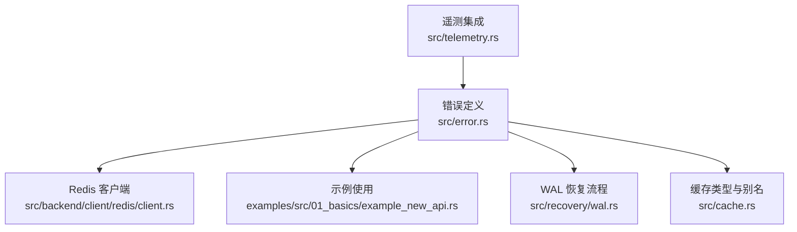
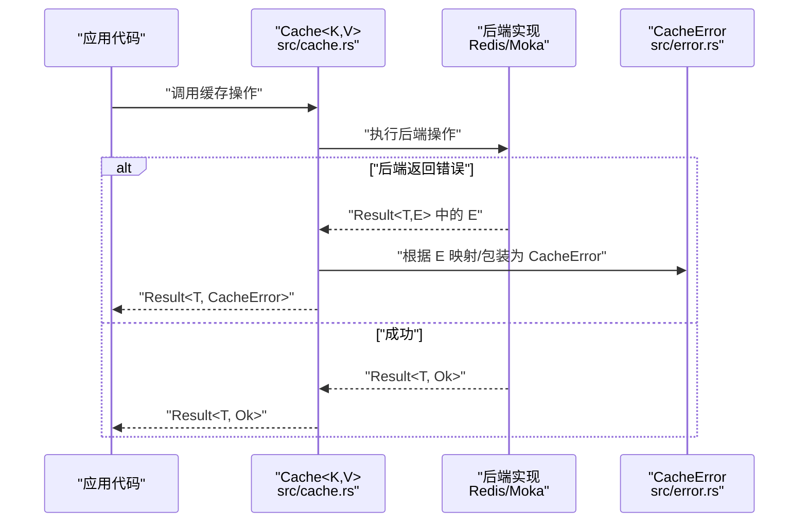
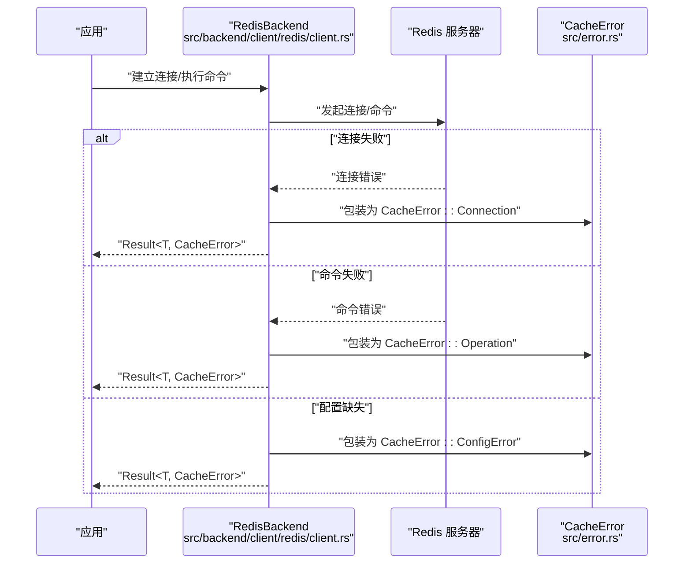
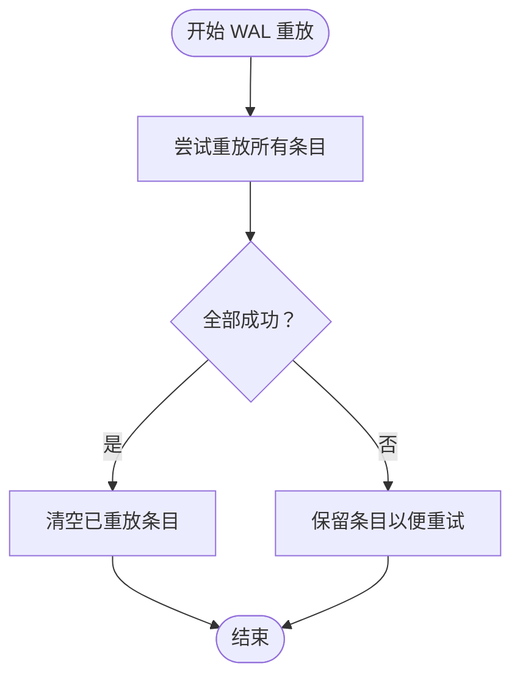
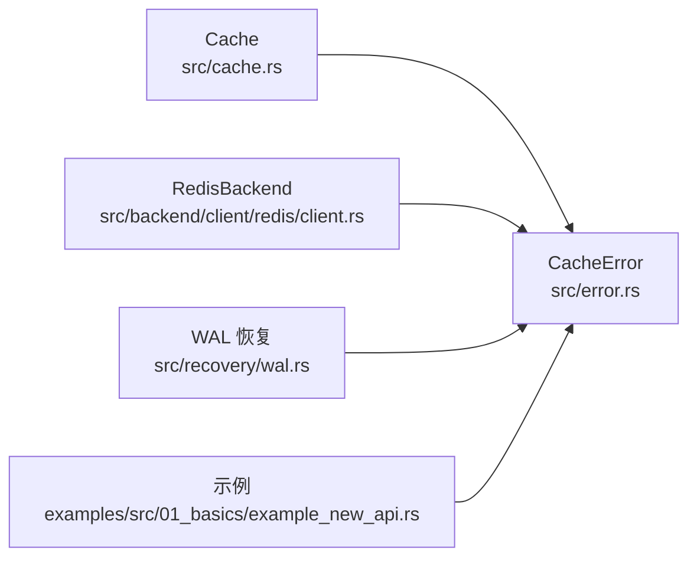

# 错误处理

<cite>
**本文引用的文件**
- [src/error.rs](file://src/error.rs)
- [src/backend/client/redis/client.rs](file://src/backend/client/redis/client.rs)
- [examples/src/01_basics/example_new_api.rs](file://examples/src/01_basics/example_new_api.rs)
- [src/cache.rs](file://src/cache.rs)
- [src/recovery/wal.rs](file://src/recovery/wal.rs)
- [src/telemetry.rs](file://src/telemetry.rs)
</cite>

## 目录
1. [简介](#简介)
2. [项目结构](#项目结构)
3. [核心组件](#核心组件)
4. [架构总览](#架构总览)
5. [详细组件分析](#详细组件分析)
6. [依赖关系分析](#依赖关系分析)
7. [性能考量](#性能考量)
8. [故障排查指南](#故障排查指南)
9. [结论](#结论)
10. [附录](#附录)

## 简介
本文件面向使用者与维护者，系统性梳理缓存系统的错误处理 API，重点围绕 CacheError 枚举的全部变体、触发条件、错误码语义、处理建议与最佳实践展开；同时给出错误传播、错误包装、错误恢复与类型安全的错误处理模式示例，并说明在异步上下文中的注意事项与调试诊断方法。

## 项目结构
与错误处理直接相关的核心位置如下：
- 错误类型定义与工具：src/error.rs
- Redis 后端错误映射与连接校验：src/backend/client/redis/client.rs
- 错误在示例中的使用：examples/src/01_basics/example_new_api.rs
- 全局缓存类型与错误别名：src/cache.rs
- WAL 恢复过程中的错误传播：src/recovery/wal.rs
- 遥测与日志集成：src/telemetry.rs

图表来源
- [src/error.rs](file://src/error.rs#L45-L288)
- [src/backend/client/redis/client.rs](file://src/backend/client/redis/client.rs#L118-L200)
- [examples/src/01_basics/example_new_api.rs](file://examples/src/01_basics/example_new_api.rs#L30-L258)
- [src/cache.rs](file://src/cache.rs#L1-L200)
- [src/recovery/wal.rs](file://src/recovery/wal.rs#L408-L429)
- [src/telemetry.rs](file://src/telemetry.rs#L34-L56)

章节来源
- [src/error.rs](file://src/error.rs#L45-L288)
- [src/backend/client/redis/client.rs](file://src/backend/client/redis/client.rs#L118-L200)
- [examples/src/01_basics/example_new_api.rs](file://examples/src/01_basics/example_new_api.rs#L30-L258)
- [src/cache.rs](file://src/cache.rs#L1-L200)
- [src/recovery/wal.rs](file://src/recovery/wal.rs#L408-L429)
- [src/telemetry.rs](file://src/telemetry.rs#L34-L56)

## 核心组件
- CacheError 枚举：统一的错误类型，覆盖序列化、连接、未找到、降级、L1/L2 后端、配置、IO、超时、关闭、键/值大小限制、缓冲区满、无效输入/键、锁等错误类别。
- Result 别名：为所有缓存操作提供统一的错误返回类型别名，简化调用方处理。
- 辅助工具：
  - is_not_found/is_connection_error/is_degraded：对常见错误进行快速判定。
  - sanitize_connection_string：在 Redis 错误消息中对敏感信息进行脱敏显示。
- 错误映射：
  - std::io::Error → IoError
  - SeaORM DbErr → DatabaseError（当启用 database 特性时）

章节来源
- [src/error.rs](file://src/error.rs#L75-L213)
- [src/error.rs](file://src/error.rs#L222-L226)
- [src/error.rs](file://src/error.rs#L228-L288)

## 架构总览
下图展示错误在不同层级的传播路径：上层业务通过 Result 返回，底层 Redis 客户端与 WAL 恢复在适当时机将具体错误包装为 CacheError 并向上抛出。

图表来源
- [src/cache.rs](file://src/cache.rs#L140-L200)
- [src/backend/client/redis/client.rs](file://src/backend/client/redis/client.rs#L118-L131)
- [src/error.rs](file://src/error.rs#L222-L226)

## 详细组件分析

### CacheError 枚举与错误分类
CacheError 提供了全面的错误分类与语义化消息，便于快速定位问题与制定恢复策略。以下按类别说明：

- 序列化错误（Serialization）
  - 触发条件：尝试序列化不支持的数据类型、序列化器配置不兼容、数据在传输过程中被损坏。
  - 处理建议：检查数据结构与序列化器配置，确保两端一致；必要时切换序列化格式。
  - 参考路径：[src/error.rs](file://src/error.rs#L77-L85)

- 操作错误（Operation）
  - 触发条件：一般的缓存操作失败。
  - 处理建议：重试或检查请求参数与上下文。
  - 参考路径：[src/error.rs](file://src/error.rs#L87-L91)

- 连接错误（Connection）
  - 触发条件：网络连接失败或断开。
  - 处理建议：检查网络连通性、服务器状态与防火墙规则。
  - 参考路径：[src/error.rs](file://src/error.rs#L93-L97)

- 未找到错误（NotFound）
  - 触发条件：请求的键在缓存中不存在。
  - 处理建议：采用回退逻辑从上游源加载数据；或检查键拼写与命名空间。
  - 参考路径：[src/error.rs](file://src/error.rs#L99-L103)

- 降级错误（Degraded）
  - 触发条件：缓存处于降级模式，某些功能受限。
  - 处理建议：监控降级原因，优先修复 L2 后端；在降级期间走直读或本地回退。
  - 参考路径：[src/error.rs](file://src/error.rs#L105-L111)

- L1 缓存错误（L1Error）
  - 触发条件：进程内内存缓存因内存压力或容量上限导致失败。
  - 处理建议：降低单值大小、调整容量或 TTL；观察内存使用趋势。
  - 参考路径：[src/error.rs](file://src/error.rs#L113-L121)

- L2 缓存错误（L2Error）
  - 触发条件：Redis 等分布式缓存后端操作失败。
  - 处理建议：检查 Redis 连接、权限、磁盘空间与资源限制。
  - 参考路径：[src/error.rs](file://src/error.rs#L123-L125)

- 配置错误（ConfigError）
  - 触发条件：缺少必需字段或配置不合法。
  - 处理建议：核对配置文件与环境变量，确保必填项齐全。
  - 参考路径：[src/error.rs](file://src/error.rs#L127-L130)

- 配置错误（Configuration，已弃用别名）
  - 触发条件：旧版配置错误别名。
  - 处理建议：迁移到 ConfigError。
  - 参考路径：[src/error.rs](file://src/error.rs#L132-L135)

- 不支持的操作（NotSupported）
  - 触发条件：当前缓存类型不支持某特性。
  - 处理建议：切换到支持该特性的后端或移除不支持的调用。
  - 参考路径：[src/error.rs](file://src/error.rs#L137-L140)

- WAL 错误（WalError）
  - 触发条件：预写日志操作失败。
  - 处理建议：检查磁盘空间、文件权限与 WAL 文件路径。
  - 参考路径：[src/error.rs](file://src/error.rs#L142-L144)

- 数据库错误（DatabaseError）
  - 触发条件：数据库相关错误（启用 database 特性时）。
  - 处理建议：检查连接串、SQL 语法与权限。
  - 参考路径：[src/error.rs](file://src/error.rs#L146-L148)

- Redis 错误（RedisError）
  - 触发条件：Redis 连接失败或命令异常。
  - 处理建议：检查连接串、认证、网络与服务器状态；生产环境强制 TLS。
  - 参考路径：[src/error.rs](file://src/error.rs#L150-L161)

- IO 错误（IoError）
  - 触发条件：文件系统相关错误。
  - 处理建议：检查权限、磁盘空间与路径有效性。
  - 参考路径：[src/error.rs](file://src/error.rs#L163-L165)

- 后端错误（BackendError）
  - 触发条件：通用后端错误，可能是瞬态问题。
  - 处理建议：重试或降级处理。
  - 参考路径：[src/error.rs](file://src/error.rs#L167-L169)

- 超时错误（Timeout）
  - 触发条件：操作超出设定超时。
  - 处理建议：增大超时或优化后端性能。
  - 参考路径：[src/error.rs](file://src/error.rs#L171-L174)

- 关闭错误（ShutdownError）
  - 触发条件：关闭阶段资源释放异常。
  - 处理建议：记录并清理残留资源，避免泄漏。
  - 参考路径：[src/error.rs](file://src/error.rs#L176-L178)

- 键过长（KeyTooLong）
  - 触发条件：键长度超过最大限制。
  - 处理建议：缩短键或改用哈希摘要。
  - 参考路径：[src/error.rs](file://src/error.rs#L180-L182)

- 值过大（ValueTooLarge）
  - 触发条件：值大小超过最大限制。
  - 处理建议：压缩或分片存储。
  - 参考路径：[src/error.rs](file://src/error.rs#L184-L186)

- 缓冲区已满（BufferFull）
  - 触发条件：批量写入缓冲区达到容量。
  - 处理建议：降低批量大小或增加缓冲区容量。
  - 参考路径：[src/error.rs](file://src/error.rs#L188-L191)

- 无效输入（InvalidInput）
  - 触发条件：输入不符合格式或约束。
  - 处理建议：修正输入或增强校验。
  - 参考路径：[src/error.rs](file://src/error.rs#L193-L197)

- 无效键（InvalidKey）
  - 触发条件：键格式非法或包含禁止字符。
  - 处理建议：规范化键生成规则。
  - 参考路径：[src/error.rs](file://src/error.rs#L199-L201)

- 锁错误（LockError）
  - 触发条件：互斥锁被毒害（先前持有者 panic）。
  - 处理建议：重建锁或避免在并发中 panic；谨慎处理锁作用域。
  - 参考路径：[src/error.rs](file://src/error.rs#L203-L207)

章节来源
- [src/error.rs](file://src/error.rs#L75-L208)

### 错误判定与类型安全
- is_not_found：判断是否为“未找到”类错误，便于区分缺省与异常。
- is_connection_error：聚合连接相关错误（含 Redis/L2），便于统一处理网络类故障。
- is_degraded：判断是否为降级模式错误，指导降级策略。
- 类型安全的错误处理模式：
  - 使用 Result<T> 作为统一返回类型，避免裸错误类型泄露。
  - 在底层将具体错误映射为 CacheError，上层通过分支匹配或 is_* 方法进行策略分流。
  - 对 Redis 错误使用 sanitize_connection_string 进行脱敏输出，避免敏感信息泄露。

章节来源
- [src/error.rs](file://src/error.rs#L228-L288)

### 错误传播与包装示例
- Redis 客户端在连接与命令执行失败时，将底层错误包装为 CacheError::Connection 或 CacheError::Operation，并携带上下文信息。
- 构建器阶段若缺少关键配置，直接返回 CacheError::ConfigError。
- 示例中使用 ? 操作符将错误向上传播至调用方，保持调用栈清晰。

图表来源
- [src/backend/client/redis/client.rs](file://src/backend/client/redis/client.rs#L118-L131)
- [src/backend/client/redis/client.rs](file://src/backend/client/redis/client.rs#L162-L200)
- [src/error.rs](file://src/error.rs#L93-L97)
- [src/error.rs](file://src/error.rs#L87-L91)
- [src/error.rs](file://src/error.rs#L127-L130)

章节来源
- [src/backend/client/redis/client.rs](file://src/backend/client/redis/client.rs#L118-L200)
- [src/error.rs](file://src/error.rs#L222-L226)

### 错误恢复与 WAL 重放
- WAL 重放在成功重放所有条目后才清空日志；若部分失败，保留条目以便后续重试，避免数据丢失。
- 该流程体现了“失败即保留”的稳健策略，配合日志与监控可实现自动恢复。

图表来源
- [src/recovery/wal.rs](file://src/recovery/wal.rs#L408-L429)

章节来源
- [src/recovery/wal.rs](file://src/recovery/wal.rs#L408-L429)

### 异步上下文中的错误处理
- 使用 ? 操作符在 async 函数中传播错误，保持调用栈与上下文信息。
- 对超时、连接失败等网络类错误，结合 is_connection_error 进行指数退避与熔断。
- 在示例中，get_or 回退模式展示了“先缓存后数据库”的容错策略，配合 is_not_found 判定减少不必要的数据库访问。

章节来源
- [examples/src/01_basics/example_new_api.rs](file://examples/src/01_basics/example_new_api.rs#L222-L236)
- [src/error.rs](file://src/error.rs#L248-L268)

## 依赖关系分析
- 上层缓存类型通过 Result<T> 与 CacheError 解耦，屏蔽底层差异。
- Redis 客户端在连接与命令执行处进行错误包装，形成统一的错误语义。
- 数据库错误映射仅在启用 database 特性时生效，避免无用依赖。
- WAL 恢复模块依赖错误类型进行日志记录与重试控制。

图表来源
- [src/cache.rs](file://src/cache.rs#L140-L200)
- [src/error.rs](file://src/error.rs#L75-L213)
- [src/backend/client/redis/client.rs](file://src/backend/client/redis/client.rs#L118-L131)
- [src/recovery/wal.rs](file://src/recovery/wal.rs#L408-L429)
- [examples/src/01_basics/example_new_api.rs](file://examples/src/01_basics/example_new_api.rs#L222-L236)

章节来源
- [src/cache.rs](file://src/cache.rs#L140-L200)
- [src/error.rs](file://src/error.rs#L75-L213)
- [src/backend/client/redis/client.rs](file://src/backend/client/redis/client.rs#L118-L131)
- [src/recovery/wal.rs](file://src/recovery/wal.rs#L408-L429)
- [examples/src/01_basics/example_new_api.rs](file://examples/src/01_basics/example_new_api.rs#L222-L236)

## 性能考量
- 错误判定 is_* 方法为常数时间匹配，适合在热路径中使用。
- 对瞬态错误（如 BackendError、Timeout）建议采用指数退避与限流，避免雪崩。
- Redis 连接池与超时配置需与错误策略协同，防止阻塞放大。
- WAL 重放应批量化处理并记录进度，避免长时间阻塞启动流程。

## 故障排查指南
- 快速定位
  - 使用 is_not_found 判断是否为缺省；is_connection_error 判断是否为网络问题；is_degraded 判断缓存是否处于降级。
- 日志与遥测
  - 通过 init_tracing 与 OpenTelemetry 层集成，记录 span 与错误上下文，便于追踪。
- Redis 连接问题
  - 检查连接串是否使用 TLS（生产环境），必要时设置 OXCACHE_ALLOW_INSECURE_REDIS 仅用于开发测试。
  - 使用 ping 接口快速验证连通性。
- 数据库问题
  - 启用 database 特性后，SeaORM 错误会映射为 DatabaseError，检查连接串与 SQL。
- IO/WAL 问题
  - 检查磁盘空间、文件权限与 WAL 路径；WAL 失败时保留条目以便后续重试。

章节来源
- [src/error.rs](file://src/error.rs#L228-L288)
- [src/telemetry.rs](file://src/telemetry.rs#L34-L56)
- [src/backend/client/redis/client.rs](file://src/backend/client/redis/client.rs#L162-L200)
- [src/recovery/wal.rs](file://src/recovery/wal.rs#L408-L429)

## 结论
CacheError 为缓存系统提供了统一、细粒度且类型安全的错误模型。通过 is_* 判定、错误包装与恢复策略（如 WAL 重放），可在复杂异步场景中实现稳健的容错与可观测性。建议在生产中结合超时、退避与降级策略，并利用遥测与日志进行持续监控与优化。

## 附录
- 错误类型与建议处理一览（摘要）
  - Serialization：检查序列化器与数据格式
  - Operation：重试或检查请求
  - Connection：检查网络与服务器
  - NotFound：回退或检查键
  - Degraded：修复 L2 或降级直读
  - L1Error：调整容量/TTL/单值大小
  - L2Error：检查 Redis 连接与状态
  - ConfigError：补齐配置项
  - NotSupported：切换后端或移除不支持调用
  - WalError：检查磁盘与权限
  - DatabaseError：检查连接与 SQL
  - RedisError：检查连接串与认证
  - IoError：检查权限与空间
  - BackendError：重试或降级
  - Timeout：增大超时或优化性能
  - ShutdownError：记录并清理资源
  - KeyTooLong：缩短键或哈希摘要
  - ValueTooLarge：压缩或分片
  - BufferFull：降低批量或扩容
  - InvalidInput/InvalidKey：规范化输入
  - LockError：重建锁或避免 panic
