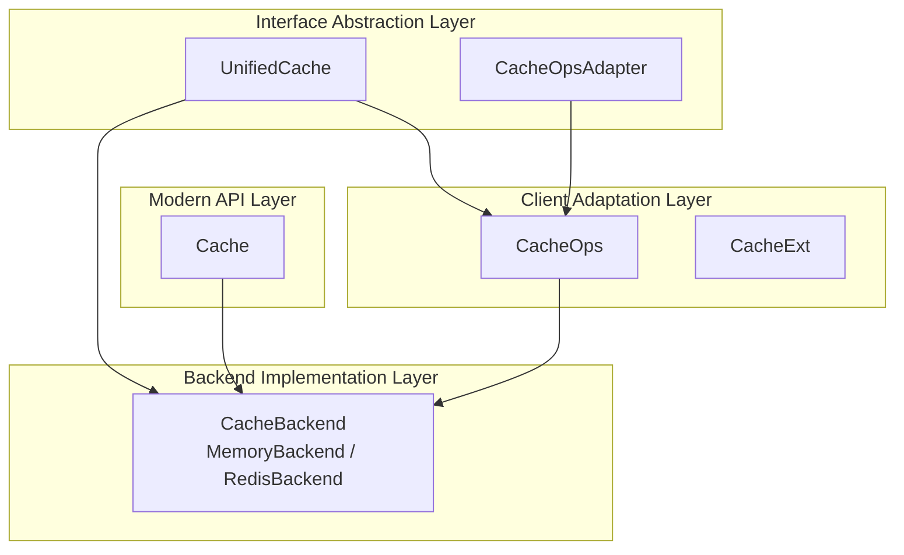
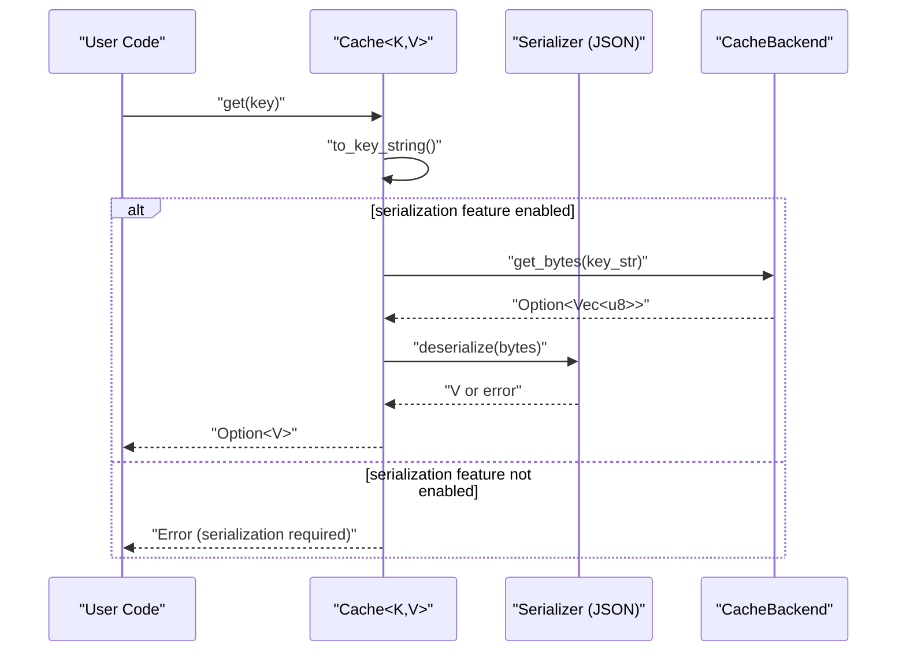
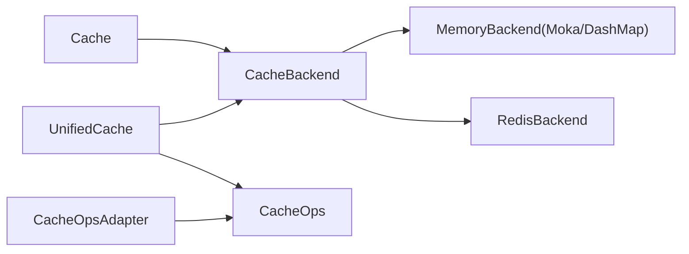

# Core Interfaces

<cite>
**Files referenced in this article**
- [src/lib.rs](file://src/lib.rs)
- [src/cache.rs](file://src/cache.rs)
- [src/cache_interface.rs](file://src/cache_interface.rs)
- [src/client/mod.rs](file://src/client/mod.rs)
- [src/traits/cache_key.rs](file://src/traits/cache_key.rs)
- [src/traits/cacheable.rs](file://src/traits/cacheable.rs)
- [src/backend/mod.rs](file://src/backend/mod.rs)
- [src/backend/client/mod.rs](file://src/backend/client/mod.rs)
- [src/error.rs](file://src/error.rs)
- [Cargo.toml](file://Cargo.toml)
- [examples/src/01_basics/example_basic_operations.rs](file://examples/src/01_basics/example_basic_operations.rs)
- [examples/src/02_advanced/example_batch_write.rs](file://examples/src/02_advanced/example_batch_write.rs)
</cite>

## Table of Contents
1. [Introduction](#introduction)
2. [Project Structure](#project-structure)
3. [Core Components](#core-components)
4. [Architecture Overview](#architecture-overview)
5. [Detailed Component Analysis](#detailed-component-analysis)
6. [Dependency Analysis](#dependency-analysis)
7. [Performance Considerations](#performance-considerations)
8. [Troubleshooting Guide](#troubleshooting-guide)
9. [Conclusion](#conclusion)
10. [Appendix](#appendix)

## Introduction
This file focuses on Oxcache's core interfaces and usage specifications, organized around the following objectives:
- Comprehensively organize method signatures and behavioral boundaries of major interfaces like Cache, UnifiedCache, and CacheOpsAdapter
- Clarify Cache generic parameter constraints, lifecycle requirements, and usage patterns
- Explain implementation requirements and best practices for CacheKey and Cacheable traits
- Detail async return types, error handling mechanisms, and performance characteristics of each method
- Provide complete usage example paths from basic CRUD to advanced batch operations
- Explain interface thread safety and concurrency considerations

## Project Structure
Oxcache adopts a "modern API + pluggable backend" architectural design:
- Modern API layer: Cache<K, V> as the core entry point, providing type-safe key-value operations and advanced capabilities
- Interface abstraction layer: UnifiedCache unifies abstract capabilities of underlying CacheBackend, CacheOps, and CacheExt
- Client adaptation layer: CacheOpsAdapter bridges legacy CacheOps capabilities to UnifiedCache
- Backend implementation layer: Memory and Redis backends expose unified interfaces to upper layers

**Chart source**
- [src/cache.rs](file://src/cache.rs#L117-L646)
- [src/cache_interface.rs](file://src/cache_interface.rs#L18-L300)
- [src/client/mod.rs](file://src/client/mod.rs#L18-L304)
- [src/backend/client/mod.rs](file://src/backend/client/mod.rs#L1-L34)

**Section source**
- [src/lib.rs](file://src/lib.rs#L517-L639)
- [src/backend/mod.rs](file://src/backend/mod.rs#L1-L59)

## Core Components
This section systematically explains the three core interfaces.

### Cache<K, V>
- Role positioning: Unified entry point for modern API, type-safe cache instance provided to users
- Generic constraints
  - K must implement CacheKey: provides stable string key representation
  - V must implement Cacheable: serializable/deserializable, used for typed get/set
- Lifecycle and ownership
  - Internally holds Arc<dyn CacheBackend>, supporting cross-task sharing and concurrency safety
  - Provides to_cache_ops and register_for_macro for global registry and #[cached] macro integration
- Main method overview (detailed in next section "Detailed Component Analysis")
  - Construction: new/memory/redis/builder
  - Basic operations: get/set/set_with_ttl/delete/exists/clear
  - Advanced patterns: get_or/fallback computation and caching
  - Batch operations: set_many/get_many/delete_many
  - Operations: stats/health_check/shutdown
  - Registration: to_cache_ops/register_for_macro

**Section source**
- [src/cache.rs](file://src/cache.rs#L87-L646)
- [src/traits/cache_key.rs](file://src/traits/cache_key.rs#L38-L49)
- [src/traits/cacheable.rs](file://src/traits/cacheable.rs#L7-L45)

### UnifiedCache
- Role positioning: Unified abstraction, integrating capabilities of CacheBackend, CacheOps, and CacheExt
- Design points
  - Provides both byte-level and type-level operations, as well as L1/L2 tiering and distributed lock capabilities
  - Provides default implementations for unsupported operations (returning NotSupported or empty implementations)
  - Exposes serialization strategy through serializer() for typed operations
- Applicable scenarios
  - As unified external interface for pluggable backends
  - Adapting legacy CacheOps to new interface stack

**Section source**
- [src/cache_interface.rs](file://src/cache_interface.rs#L18-L300)

### CacheOpsAdapter
- Role positioning: Bridge legacy CacheOps capabilities to UnifiedCache
- Behavioral characteristics
  - Convert TTL seconds to Duration
  - Return NotSupported for unsupported capabilities
  - Pass serializer through ops.serializer()

**Section source**
- [src/cache_interface.rs](file://src/cache_interface.rs#L375-L487)

## Architecture Overview
The following sequence diagram shows the typical call chain for Cache.get, reflecting the complete flow from type safety to serialization to backend storage.

**Chart source**
- [src/cache.rs](file://src/cache.rs#L241-L264)

## Detailed Component Analysis

### Cache<K, V> API Detailed Explanation
- Construction and initialization
  - new()/memory(): Create in-memory backend cache
  - redis(): Create Redis backend cache when redis feature is enabled
  - builder(): Advanced configuration entry (capacity, TTL, etc.)
- Basic operations
  - get(key): Async returns Option<V>; returns error when serialization feature is not enabled
  - set(key, value)/set_with_ttl(key, value, ttl): Async returns ()
  - delete(key): Async returns ()
  - exists(key): Async returns bool
  - clear(): Async clear cache
- Advanced patterns
  - get_or(key, fallback): Call fallback computation and write back on cache miss
- Batch operations
  - set_many(items)/get_many(keys)/delete_many(keys): Iterative batch processing
- Operations and lifecycle
  - stats()/health_check()/shutdown(): Get statistics, health check, graceful shutdown
  - to_cache_ops()/register_for_macro(): Register globally or with #[cached] macro

Return values and error handling
- Return types are all async Result<T>, where T is determined by specific method
- Common error categories (see error module): Serialization, NotFound, NotSupported, BackendError, Timeout, etc.
- Errors thrown in fallback by get_or are directly propagated

Performance characteristics
- set/get have O(1) expected complexity (in-memory backend)
- Batch operations recommended to combine concurrency and batch processing strategies (refer to examples)
- Serialization cost depends on selected format and data size

Usage example paths
- Basic CRUD: [Example path](file://examples/src/01_basics/example_basic_operations.rs#L21-L72)
- Batch write optimization: [Example path](file://examples/src/02_advanced/example_batch_write.rs#L25-L154)

Thread safety and concurrency
- Cache internally holds Arc<dyn CacheBackend>, can be safely shared across tasks
- set/get/delete and other methods are async, need to execute in runtime environment
- Batch operations recommended to control concurrency to avoid excessive competition

**Section source**
- [src/cache.rs](file://src/cache.rs#L134-L646)
- [src/error.rs](file://src/error.rs#L75-L208)
- [examples/src/01_basics/example_basic_operations.rs](file://examples/src/01_basics/example_basic_operations.rs#L21-L72)
- [examples/src/02_advanced/example_batch_write.rs](file://examples/src/02_advanced/example_batch_write.rs#L25-L154)

### UnifiedCache Interface Detailed Explanation
- Byte-level core operations: get_bytes/set_bytes/delete/exists/clear/close/ttl/expire/health_check/stats
- Tiered operations (default NotSupported): get_l1_bytes/set_l1_bytes/clear_l1, get_l2_bytes/set_l2_bytes/clear_l2
- Distributed locks: lock/unlock (default returns empty value or false)
- Type-level operations: get_typed/set_typed/set_l1_typed/set_l2_typed/get_or_fetch/try_get_typed/remove_typed/contains
- Batch operations: set_many_bytes/get_many_bytes/delete_many, set_many_typed/get_many_typed
- Required implementations: serializer/as_any/into_any_arc

Adaptation and implementation
- Blanket implementation for any CacheBackend, automatically obtains UnifiedCache capabilities
- CacheOpsAdapter bridges legacy CacheOps capabilities to UnifiedCache

**Section source**
- [src/cache_interface.rs](file://src/cache_interface.rs#L18-L300)
- [src/cache_interface.rs](file://src/cache_interface.rs#L302-L373)
- [src/cache_interface.rs](file://src/cache_interface.rs#L375-L487)

### CacheOpsAdapter Adapter
- Purpose: Bridge legacy CacheOps capabilities to UnifiedCache
- Key points
  - Convert TTL seconds to Duration
  - Return NotSupported for unsupported capabilities
  - Pass serializer through ops.serializer()

**Section source**
- [src/cache_interface.rs](file://src/cache_interface.rs#L375-L487)

### CacheKey and Cacheable traits
- CacheKey
  - Responsibility: Stably convert any type to string key
  - Constraints: Send + Sync
  - Common implementations: String/&str, integer types, etc.
  - Custom implementations: Provide deterministic mapping of to_key_string for types like UserId
- Cacheable
  - Responsibility: Value types have serialization/deserialization capabilities
  - Constraints: Sized + Serialize + DeserializeOwned (when serialization feature is enabled)
  - Common implementations: Structs with derive(Serialize, Deserialize)

Best practices
- Key space design: Avoid conflicts, length and character set limitations
- Value type design: Maintain serializability, version compatibility, and controllable size
- Key/value lifecycle: Avoid lifecycle issues caused by cross-lifecycle borrowing

**Section source**
- [src/traits/cache_key.rs](file://src/traits/cache_key.rs#L38-L49)
- [src/traits/cache_key.rs](file://src/traits/cache_key.rs#L51-L105)
- [src/traits/cacheable.rs](file://src/traits/cacheable.rs#L7-L45)

## Dependency Analysis
- Feature switches and backend selection
  - moka/dashmap-backend: Enable L1 in-memory backend
  - redis: Enable L2 Redis backend
  - serialization/bincode/compression: Enable serialization and compression
  - metrics/opentelemetry/full-metrics: Enable observability
- Relationship between Cache and backends
  - Cache internally holds Arc<dyn CacheBackend>, default in-memory backend is Moka
  - Can specify backend through builder or redis()
- Clients and adaptation
  - CacheOps is legacy interface, CacheOpsAdapter used for bridging
  - UnifiedCache is unified abstraction, covering CacheBackend/CacheOps/CacheExt

**Chart source**
- [src/backend/client/mod.rs](file://src/backend/client/mod.rs#L13-L34)
- [src/cache.rs](file://src/cache.rs#L117-L120)
- [src/cache_interface.rs](file://src/cache_interface.rs#L302-L373)

**Section source**
- [Cargo.toml](file://Cargo.toml#L235-L347)
- [src/backend/mod.rs](file://src/backend/mod.rs#L1-L59)

## Performance Considerations
- In-memory backend (Moka/DashMap): O(1) expected complexity, suitable for high-concurrency read/write
- Redis backend: Network latency is main bottleneck, recommend batch writes and reasonable TTL
- Serialization cost: Formats like JSON/Bincode show significant differences on large objects, should choose based on scenario
- Batch operations: Concurrent writes need rate control to avoid backend congestion
- Statistics and metrics: Evaluate hit rate and health status through stats/health_check

[This section provides general guidance, no specific file references needed]

## Troubleshooting Guide
Common errors and handling
- Serialization errors (Serialization): Confirm serialization feature is enabled and correctly serialize/deserialize around get/set
- Not found (NotFound): Check key spelling and lifecycle
- Not supported (NotSupported): Confirm backend supports corresponding capability (e.g., TTL, tiered operations)
- Backend errors (BackendError/L2Error): Check Redis connection and permissions
- Timeout (Timeout): Increase timeout or optimize backend performance

Localization and diagnosis
- Use health_check/stats to get backend status
- Combine logs and tracing (enable tracing/opentelemetry) to locate slow operations
- Reproduce issues in unit/integration tests and minimize examples

**Section source**
- [src/error.rs](file://src/error.rs#L75-L208)
- [src/cache.rs](file://src/cache.rs#L513-L572)

## Conclusion
- Cache<K, V> provides type-safe, easy-to-use modern API
- UnifiedCache abstraction unifies multiple backends and capability boundaries
- CacheOpsAdapter ensures smooth transition from legacy to new version
- CacheKey/Cacheable ensure consistency and maintainability of key-value design
- Reasonable backend and serialization strategy selection, combined with batch and concurrency control, can achieve stable and high-performance cache experience

[This section is summary content, no specific file references needed]

## Appendix

### API Method List and Description (Summary)
- Cache<K, V>
  - new/memory/redis/builder: Construction and configuration
  - get/set/set_with_ttl/delete/exists/clear: Basic and operations
  - get_or: Cache-aside pattern
  - set_many/get_many/delete_many: Batch operations
  - stats/health_check/shutdown: Operations and lifecycle
  - to_cache_ops/register_for_macro: Registration and macro integration
- UnifiedCache
  - Byte-level: get_bytes/set_bytes/delete/exists/clear/close/ttl/expire/health_check/stats
  - Tiered: get_l1_bytes/set_l1_bytes/clear_l1, get_l2_bytes/set_l2_bytes/clear_l2
  - Distributed: lock/unlock
  - Type-level: get_typed/set_typed/set_l1_typed/set_l2_typed/get_or_fetch/try_get_typed/remove_typed/contains
  - Batch: set_many_bytes/get_many_bytes/delete_many, set_many_typed/get_many_typed
- CacheOpsAdapter
  - Bridge CacheOps capabilities to UnifiedCache

**Section source**
- [src/cache.rs](file://src/cache.rs#L134-L646)
- [src/cache_interface.rs](file://src/cache_interface.rs#L18-L300)
- [src/cache_interface.rs](file://src/cache_interface.rs#L375-L487)

### Usage Scenario Example Paths
- Basic CRUD: [Example path](file://examples/src/01_basics/example_basic_operations.rs#L21-L72)
- Batch write optimization: [Example path](file://examples/src/02_advanced/example_batch_write.rs#L25-L154)

**Section source**
- [examples/src/01_basics/example_basic_operations.rs](file://examples/src/01_basics/example_basic_operations.rs#L21-L72)
- [examples/src/02_advanced/example_batch_write.rs](file://examples/src/02_advanced/example_batch_write.rs#L25-L154)
