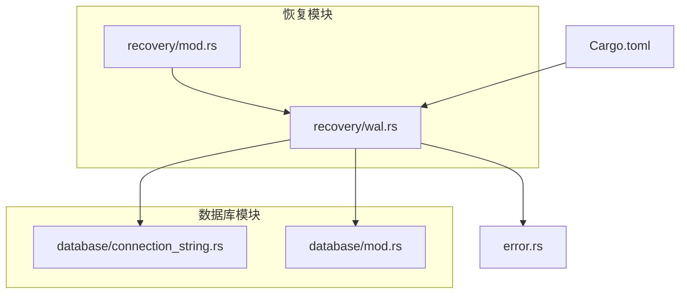
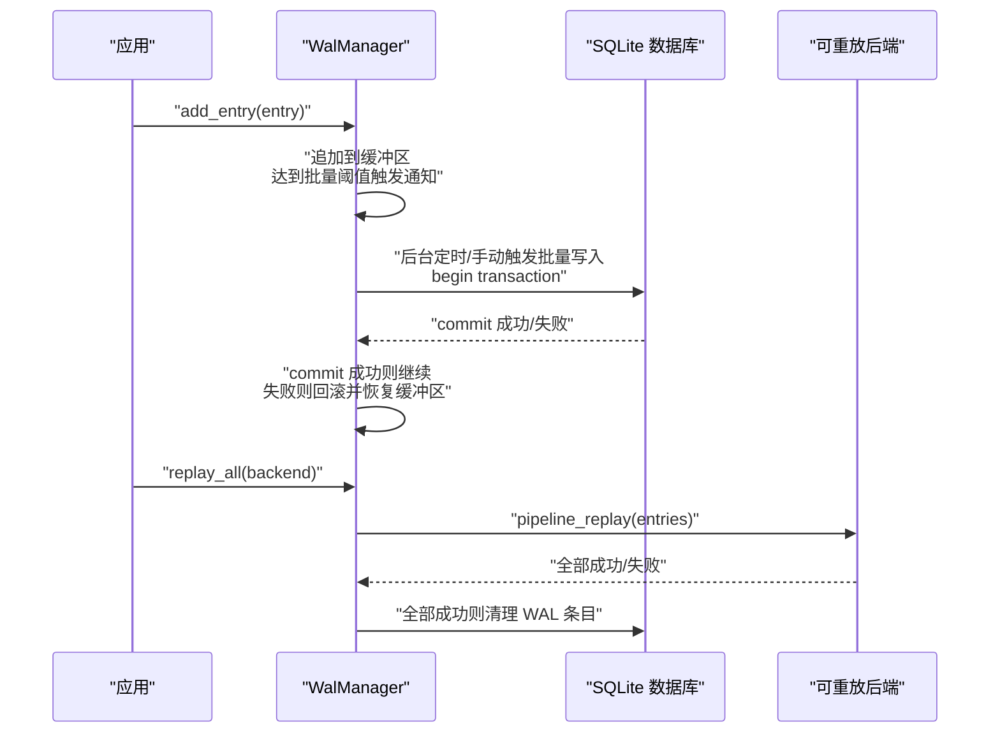
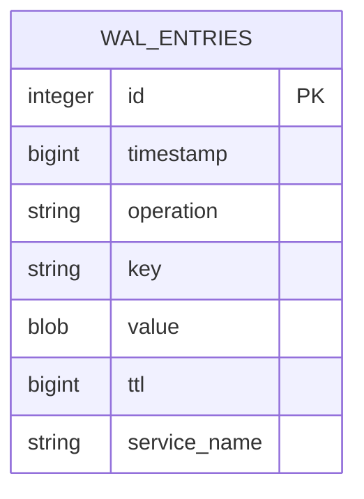
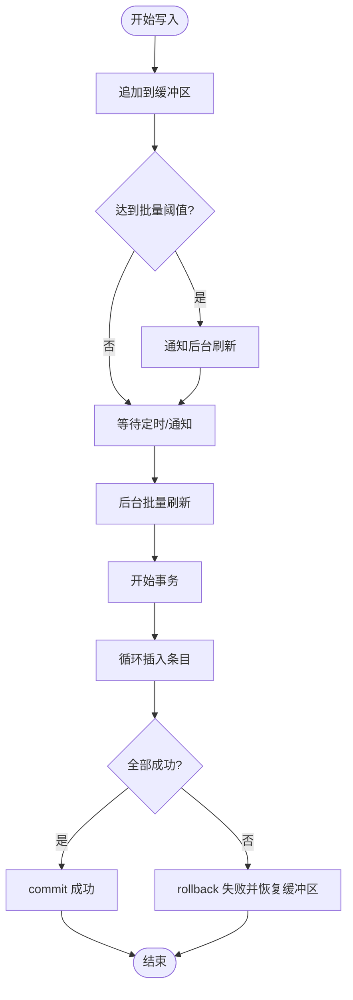
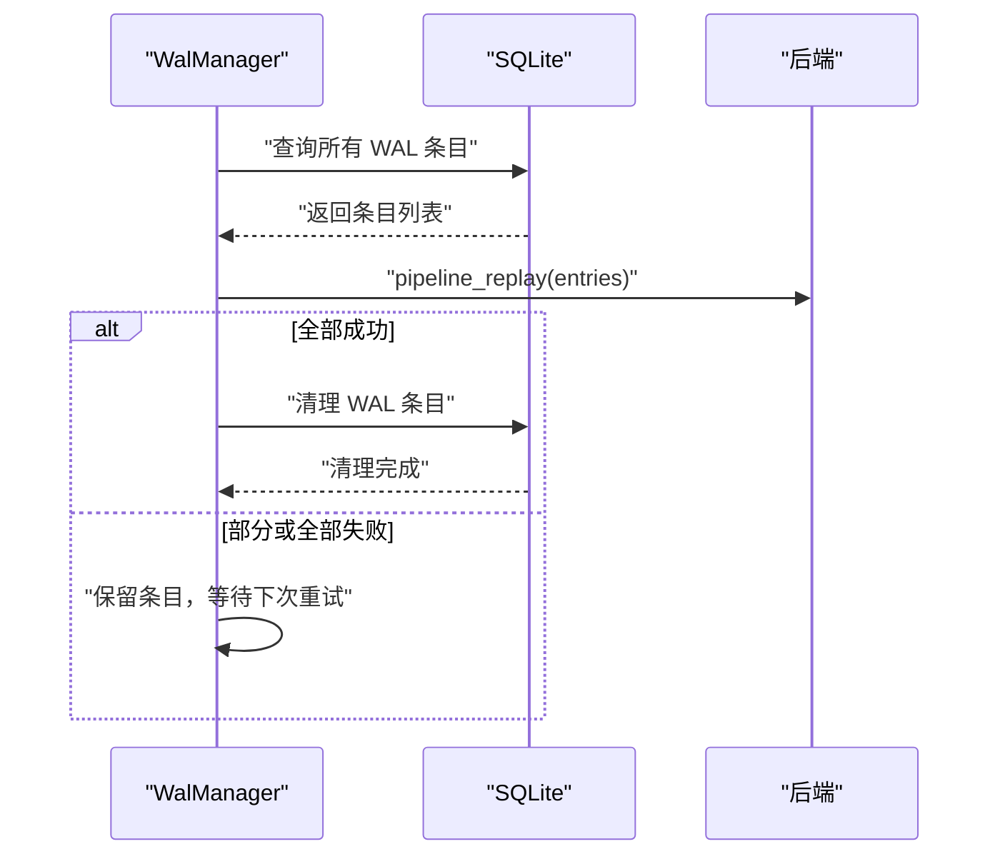
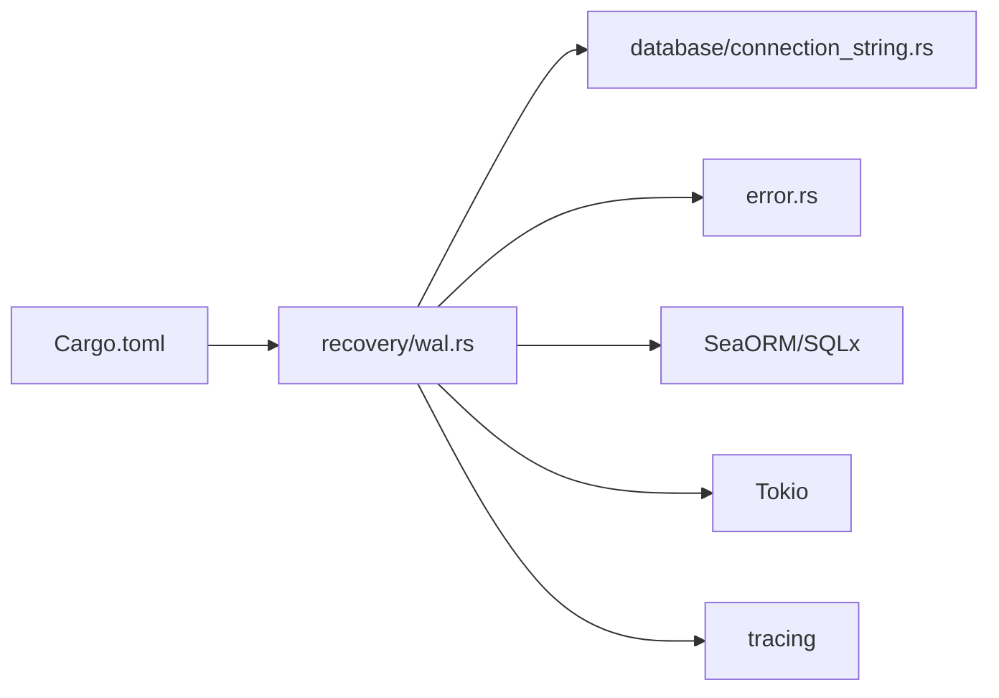

# WAL 恢复

<cite>
**本文引用的文件列表**
- [src/recovery/wal.rs](file://src/recovery/wal.rs)
- [src/recovery/mod.rs](file://src/recovery/mod.rs)
- [src/database/connection_string.rs](file://src/database/connection_string.rs)
- [src/database/mod.rs](file://src/database/mod.rs)
- [src/error.rs](file://src/error.rs)
- [Cargo.toml](file://Cargo.toml)
- [tests/integration/recovery_test.rs](file://tests/integration/recovery_test.rs)
</cite>

## 目录
1. [简介](#简介)
2. [项目结构与定位](#项目结构与定位)
3. [核心组件](#核心组件)
4. [架构总览](#架构总览)
5. [详细组件分析](#详细组件分析)
6. [依赖关系分析](#依赖关系分析)
7. [性能考量](#性能考量)
8. [故障排查指南](#故障排查指南)
9. [结论](#结论)
10. [附录](#附录)

## 简介
本文件深入讲解 Oxcache 的 WAL（写前日志）恢复机制，解释如何通过写前日志保证数据一致性和系统可靠性。内容涵盖 WAL 的实现原理（日志记录、持久化存储、故障恢复）、配置选项（日志文件大小、刷新策略、清理机制）、恢复过程中的数据一致性保障（部分写入与系统崩溃处理）、性能优化建议（刷盘策略与存储介质选择），以及故障恢复测试与监控告警配置。

## 项目结构与定位
- WAL 恢复机制位于 recovery 子模块中，核心实现集中在 wal.rs；mod.rs 提供模块入口与空实现。
- 数据库连接字符串规范化与测试环境判断由 database 子模块提供，影响 WAL 的文件路径与内存模式选择。
- 错误类型定义中包含 WAL 相关错误，便于统一错误处理与告警。
- Cargo 特性中定义了 wal-recovery 开关，决定是否启用 WAL 功能。

图表来源
- [src/recovery/mod.rs](file://src/recovery/mod.rs#L1-L86)
- [src/recovery/wal.rs](file://src/recovery/wal.rs#L1-L512)
- [src/database/connection_string.rs](file://src/database/connection_string.rs#L355-L738)
- [src/database/mod.rs](file://src/database/mod.rs#L1-L43)
- [src/error.rs](file://src/error.rs#L142-L144)
- [Cargo.toml](file://Cargo.toml#L232-L347)

章节来源
- [src/recovery/mod.rs](file://src/recovery/mod.rs#L1-L86)
- [src/recovery/wal.rs](file://src/recovery/wal.rs#L1-L512)
- [src/database/connection_string.rs](file://src/database/connection_string.rs#L355-L738)
- [src/database/mod.rs](file://src/database/mod.rs#L1-L43)
- [src/error.rs](file://src/error.rs#L142-L144)
- [Cargo.toml](file://Cargo.toml#L232-L347)

## 核心组件
- WalEntry：WAL 日志条目，包含时间戳、操作类型（Set/Delete）、键、可选值与可选 TTL。
- Operation：操作枚举，对应 Set 与 Delete。
- WalReplayableBackend：可重放后端 Trait，定义 pipeline_replay 方法，用于将 WAL 条目重放到后端。
- WalManager：WAL 管理器，负责：
  - 初始化 WAL 数据库（SQLite 文件或内存模式）
  - 异步批量写入 WAL 条目（带通知与定时刷新）
  - 事务性批量插入（失败时回滚并恢复缓冲区）
  - 查询与清理 WAL 条目
  - 重放 WAL 条目到后端（事务性：全部成功才清理）

章节来源
- [src/recovery/wal.rs](file://src/recovery/wal.rs#L42-L65)
- [src/recovery/wal.rs](file://src/recovery/wal.rs#L29-L39)
- [src/recovery/wal.rs](file://src/recovery/wal.rs#L59-L65)
- [src/recovery/wal.rs](file://src/recovery/wal.rs#L68-L172)
- [src/recovery/wal.rs](file://src/recovery/wal.rs#L277-L372)
- [src/recovery/wal.rs](file://src/recovery/wal.rs#L392-L429)

## 架构总览
WAL 采用“先写日志再写缓存”的模式，确保即使系统崩溃也能通过 WAL 重放恢复到一致状态。WAL 使用 SQLite 作为持久化存储，通过事务批量写入提升吞吐，同时提供后台定时刷新与手动触发刷新两种策略。

图表来源
- [src/recovery/wal.rs](file://src/recovery/wal.rs#L139-L163)
- [src/recovery/wal.rs](file://src/recovery/wal.rs#L277-L372)
- [src/recovery/wal.rs](file://src/recovery/wal.rs#L392-L429)

## 详细组件分析

### WAL 数据模型与持久化
- 表结构：wal_entries，包含自增主键、时间戳、操作类型、键、值（BLOB）、TTL、服务名。
- 存储介质：默认使用 SQLite 文件（基于服务名生成 WAL 文件），测试环境使用内存数据库。
- 连接字符串：通过数据库连接字符串规范化与测试环境检测，决定使用内存或磁盘文件。

图表来源
- [src/recovery/wal.rs](file://src/recovery/wal.rs#L109-L125)
- [src/database/connection_string.rs](file://src/database/connection_string.rs#L355-L428)
- [src/database/connection_string.rs](file://src/database/connection_string.rs#L701-L726)

章节来源
- [src/recovery/wal.rs](file://src/recovery/wal.rs#L109-L125)
- [src/database/connection_string.rs](file://src/database/connection_string.rs#L355-L428)
- [src/database/connection_string.rs](file://src/database/connection_string.rs#L701-L726)

### 写入与刷新策略
- 缓冲与批量：使用 Mutex 保护的 Vec 作为缓冲区，达到批量阈值（默认 100）触发通知。
- 后台任务：Tokio 任务定时刷新（每 5 秒）与通知触发刷新。
- 事务批量写入：每次刷新开启事务，逐条插入，全部成功才 commit，失败则 rollback 并将条目恢复到缓冲区。
- 刷新接口：提供显式 flush，内部复用批量写入逻辑。

图表来源
- [src/recovery/wal.rs](file://src/recovery/wal.rs#L174-L187)
- [src/recovery/wal.rs](file://src/recovery/wal.rs#L139-L163)
- [src/recovery/wal.rs](file://src/recovery/wal.rs#L277-L372)

章节来源
- [src/recovery/wal.rs](file://src/recovery/wal.rs#L139-L163)
- [src/recovery/wal.rs](file://src/recovery/wal.rs#L174-L187)
- [src/recovery/wal.rs](file://src/recovery/wal.rs#L277-L372)

### 故障恢复与一致性保证
- 重放流程：读取 WAL 条目，调用后端 pipeline_replay 全量重放。
- 事务性重放：只有在全部成功后才清理 WAL；若失败，保留条目以便下次重试。
- 日志清理：清理仅在重放成功后执行，确保“要么全部成功，要么全部保留”。

图表来源
- [src/recovery/wal.rs](file://src/recovery/wal.rs#L392-L429)

章节来源
- [src/recovery/wal.rs](file://src/recovery/wal.rs#L392-L429)

### 配置选项与环境适配
- 功能开关：通过 Cargo 特性 wal-recovery 控制是否启用 WAL。
- 连接字符串：规范化 SQLite 路径，支持绝对/相对路径、内存数据库；测试环境自动切换内存模式。
- 目录创建：若 WAL 文件所在目录不存在，自动创建。
- 连接池与超时：SQLite 连接配置最小/最大连接数与连接超时。

章节来源
- [Cargo.toml](file://Cargo.toml#L232-L347)
- [src/recovery/wal.rs](file://src/recovery/wal.rs#L69-L107)
- [src/recovery/wal.rs](file://src/recovery/wal.rs#L73-L96)
- [src/recovery/wal.rs](file://src/recovery/wal.rs#L83-L93)
- [src/database/connection_string.rs](file://src/database/connection_string.rs#L355-L428)

### 错误处理与监控
- 错误类型：WAL 操作失败归类为 CacheError::WalError，便于统一处理。
- 日志记录：使用 tracing 输出关键事件（开始重放、重放成功/失败、事务失败等）。
- 指标输出：metrics 模块暴露 cache_wal_entries 指标，可用于监控 WAL 条目数量。

章节来源
- [src/error.rs](file://src/error.rs#L142-L144)
- [src/recovery/wal.rs](file://src/recovery/wal.rs#L400-L428)
- [src/metrics.rs](file://src/metrics.rs#L303-L310)

## 依赖关系分析
- 模块耦合：
  - recovery/wal.rs 依赖 database/connection_string.rs 进行连接字符串规范化与测试环境判断。
  - recovery/wal.rs 依赖 error.rs 的错误类型进行异常包装。
  - Cargo.toml 中的 wal-recovery 特性控制模块启用与否。
- 外部依赖：
  - SeaORM/SQLx 用于 SQLite 访问与事务控制。
  - Tokio 用于异步任务与通知机制。
  - tracing 用于日志与可观测性。

图表来源
- [src/recovery/wal.rs](file://src/recovery/wal.rs#L1-L26)
- [src/database/connection_string.rs](file://src/database/connection_string.rs#L355-L428)
- [src/error.rs](file://src/error.rs#L142-L144)
- [Cargo.toml](file://Cargo.toml#L232-L347)

章节来源
- [src/recovery/wal.rs](file://src/recovery/wal.rs#L1-L26)
- [src/database/connection_string.rs](file://src/database/connection_string.rs#L355-L428)
- [src/error.rs](file://src/error.rs#L142-L144)
- [Cargo.toml](file://Cargo.toml#L232-L347)

## 性能考量
- 批量写入阈值：默认 100 条，可根据写入压力调整。
- 刷新策略：
  - 定时刷新：每 5 秒一次，适合低频写入场景。
  - 通知触发：达到批量阈值立即触发，适合高频写入场景。
- 事务批量：单次批量在一个事务内完成，减少事务开销。
- 存储介质：
  - 生产环境建议使用 SSD 或高性能磁盘，降低延迟与提高吞吐。
  - 避免网络文件系统（NFS/SMB）存放 WAL 文件，可能导致性能抖动与不可靠。
- 连接池与超时：SQLite 连接池配置为 1，避免并发竞争；连接超时合理设置，避免阻塞。
- 监控指标：关注 cache_wal_entries，结合后端写入耗时与失败率评估 WAL 压力。

章节来源
- [src/recovery/wal.rs](file://src/recovery/wal.rs#L139-L163)
- [src/recovery/wal.rs](file://src/recovery/wal.rs#L130-L131)
- [src/recovery/wal.rs](file://src/recovery/wal.rs#L100-L107)
- [src/metrics.rs](file://src/metrics.rs#L303-L310)

## 故障排查指南
- WAL 写入失败：
  - 检查磁盘空间与文件权限。
  - 查看事务提交/回滚日志，确认是否出现数据库错误。
  - 关注 CacheError::WalError 与 CacheError::DatabaseError。
- 重放失败：
  - 检查后端 pipeline_replay 实现是否健壮。
  - 重放失败不会清理 WAL，可观察 WAL 条目数量增长趋势。
  - 结合 tracing 日志定位具体失败步骤。
- 测试与验证：
  - 使用测试工具链验证 WAL 行为（如模拟系统崩溃后重放）。
  - 集成测试中验证降级逻辑与缓存操作正确性。

章节来源
- [src/error.rs](file://src/error.rs#L142-L144)
- [src/recovery/wal.rs](file://src/recovery/wal.rs#L300-L371)
- [src/recovery/wal.rs](file://src/recovery/wal.rs#L400-L428)
- [tests/integration/recovery_test.rs](file://tests/integration/recovery_test.rs#L1-L78)

## 结论
Oxcache 的 WAL 恢复机制通过“先写日志、后写缓存”的设计，结合 SQLite 事务批量写入与后台刷新策略，在保证数据一致性的同时兼顾性能。通过特性开关与连接字符串规范化，实现对不同环境的灵活适配。配合统一错误类型与可观测性日志，能够有效支撑故障恢复与运维监控。

## 附录

### 配置清单（基于源码行为）
- 功能开关：Cargo 特性 wal-recovery
- 存储位置：服务名 + "_wal.db"（相对/绝对路径），测试环境使用内存数据库
- 批量阈值：默认 100 条
- 刷新策略：定时（每 5 秒）+ 通知触发
- 连接池：最小/最大连接数均为 1，连接超时 30 秒
- 目录创建：自动创建 WAL 文件所在目录

章节来源
- [Cargo.toml](file://Cargo.toml#L232-L347)
- [src/recovery/wal.rs](file://src/recovery/wal.rs#L69-L107)
- [src/recovery/wal.rs](file://src/recovery/wal.rs#L130-L131)
- [src/recovery/wal.rs](file://src/recovery/wal.rs#L139-L163)
- [src/recovery/wal.rs](file://src/recovery/wal.rs#L73-L96)
- [src/recovery/wal.rs](file://src/recovery/wal.rs#L83-L93)