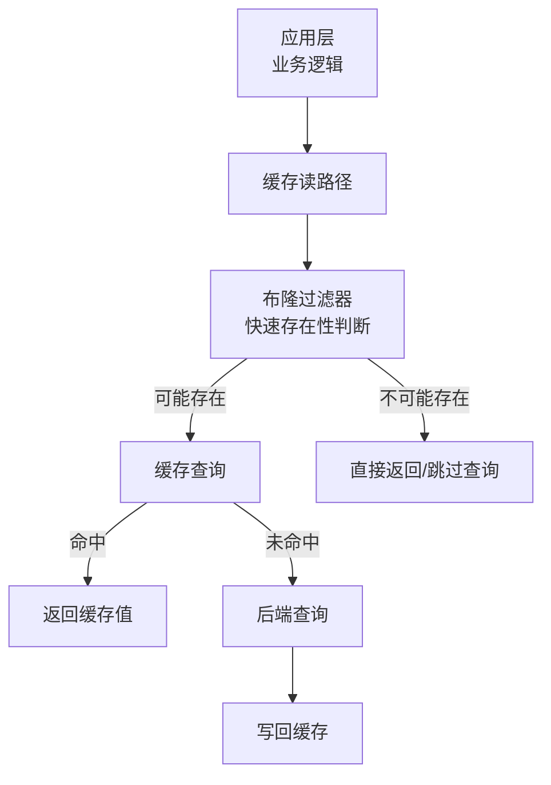
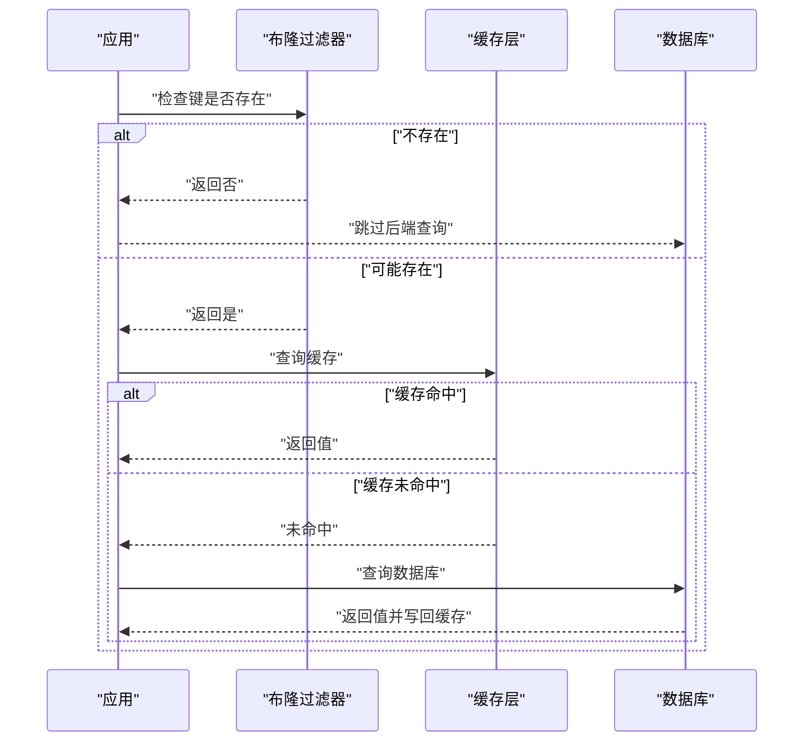
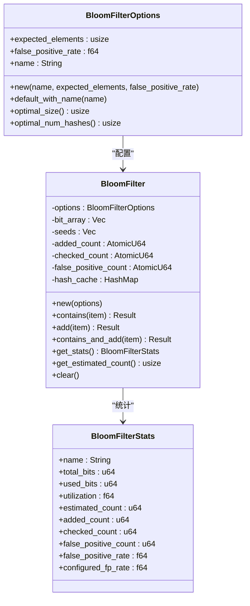
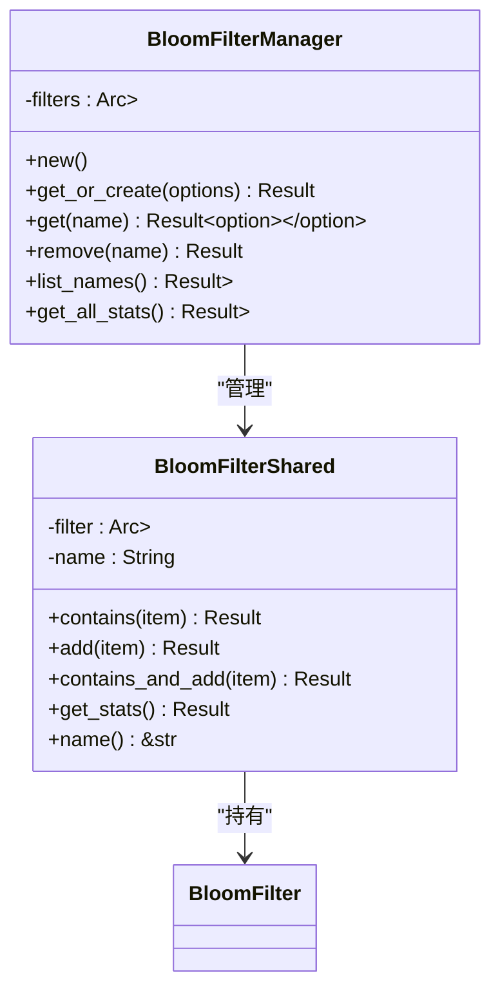
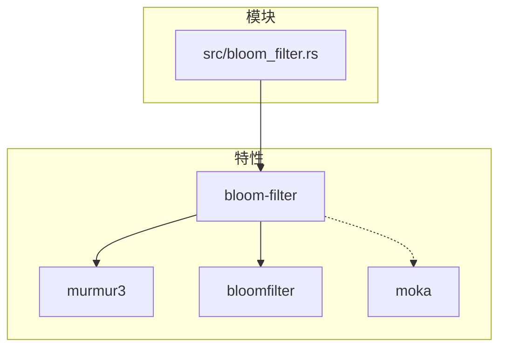

# 布隆过滤器

<cite>
**本文引用的文件**
- [src/bloom_filter.rs](file://src/bloom_filter.rs)
- [docs/ARCHITECTURE.md](file://docs/ARCHITECTURE.md)
- [docs/API_REFERENCE.md](file://docs/API_REFERENCE.md)
- [Cargo.toml](file://Cargo.toml)
- [benches/cache_benchmark.rs](file://benches/cache_benchmark.rs)
</cite>

## 目录
1. [简介](#简介)
2. [项目结构](#项目结构)
3. [核心组件](#核心组件)
4. [架构总览](#架构总览)
5. [详细组件分析](#详细组件分析)
6. [依赖关系分析](#依赖关系分析)
7. [性能考量](#性能考量)
8. [故障排查指南](#故障排查指南)
9. [结论](#结论)
10. [附录](#附录)

## 简介
本章节概述 Oxcache 中布隆过滤器的设计目标与整体定位：通过概率性数据结构在缓存读路径前进行快速存在性判断，有效防止“缓存穿透”攻击，降低无效后端查询压力。布隆过滤器以极低内存占用换取可配置的误判率，并提供统计指标与多实例管理能力，便于在生产环境中安全启用与运维。

## 项目结构
- 布隆过滤器核心实现位于 src/bloom_filter.rs，包含配置、布隆过滤器主体、共享包装与管理器等。
- 文档 ARCHITECTURE.md 对安全特性（含布隆过滤器）进行了总体说明。
- API 参考文档 API_REFERENCE.md 提供了功能开关与使用示例。
- Cargo.toml 定义了布隆过滤器相关特性与依赖。
- benches/cache_benchmark.rs 展示了基准测试框架，可用于评估启用/禁用布隆过滤器对系统性能的影响。

**图表来源**
- [src/bloom_filter.rs](file://src/bloom_filter.rs#L119-L163)
- [docs/ARCHITECTURE.md](file://docs/ARCHITECTURE.md#L339-L358)

**章节来源**
- [src/bloom_filter.rs](file://src/bloom_filter.rs#L1-L727)
- [docs/ARCHITECTURE.md](file://docs/ARCHITECTURE.md#L338-L358)
- [docs/API_REFERENCE.md](file://docs/API_REFERENCE.md#L549-L572)
- [Cargo.toml](file://Cargo.toml#L326)

## 核心组件
- 布隆过滤器配置（BloomFilterOptions）：定义预期元素数量、误判率与实例名称，提供最优位数组长度与哈希次数计算。
- 布隆过滤器（BloomFilter）：基于位数组与多个 Murmur3 哈希种子，提供添加、存在性检查、统计查询与清空等能力；内部包含哈希位置缓存以优化重复查询。
- 共享包装（BloomFilterShared）：使用 Arc + RwLock 包装，支持多线程并发读写与异步接口。
- 管理器（BloomFilterManager）：按名称管理多个布隆过滤器实例，提供创建、获取、删除、列举与聚合统计的能力。

**章节来源**
- [src/bloom_filter.rs](file://src/bloom_filter.rs#L22-L61)
- [src/bloom_filter.rs](file://src/bloom_filter.rs#L69-L106)
- [src/bloom_filter.rs](file://src/bloom_filter.rs#L368-L415)
- [src/bloom_filter.rs](file://src/bloom_filter.rs#L422-L498)

## 架构总览
布隆过滤器作为安全特性之一，与 L1/L2 缓存协同工作，形成“前置快速判断 + 多级缓存”的防御体系。其在读路径上的典型流程如下：

**图表来源**
- [docs/ARCHITECTURE.md](file://docs/ARCHITECTURE.md#L339-L358)
- [src/bloom_filter.rs](file://src/bloom_filter.rs#L119-L163)

## 详细组件分析

### 布隆过滤器配置与参数
- 关键参数
  - 预期元素数量（expected_elements）：决定位数组大小与哈希函数数量。
  - 误判率（false_positive_rate）：目标误判概率，通常取 0.01~0.05。
  - 名称（name）：实例标识，便于统计与管理。
- 参数计算
  - 最优位数组长度（optimal_size）：根据公式推导，按字节对齐至 8 字节边界。
  - 最优哈希次数（optimal_num_hashes）：与位数组长度和元素数量相关。
- 默认值
  - 预设默认配置提供合理的初始值，便于快速上手。

**章节来源**
- [src/bloom_filter.rs](file://src/bloom_filter.rs#L22-L61)

### 布隆过滤器主体（BloomFilter）
- 数据结构
  - 位数组（bit_array）：存储元素的存在标记。
  - 种子数组（seeds）：用于生成多个独立哈希值。
  - 哈希缓存（hash_cache）：缓存已计算的哈希位置，避免重复计算。
  - 统计原子计数器：added_count、checked_count、false_positive_count。
- 核心方法
  - contains(item)：计算哈希位置并检查位数组，支持缓存命中与 LRU 清理。
  - add(item)：将元素加入过滤器，更新位数组。
  - contains_and_add(item)：若不存在则先加入再返回存在性。
  - contains_and_add(item)：若不存在则先加入再返回存在性。
  - get_stats()：输出使用率、误判率、估计元素数等统计。
  - get_estimated_count()：基于位数组使用情况估算元素数量。
  - clear()：清空位数组并重置计数器。
- 错误处理
  - 读写锁与缓存锁异常统一转换为 CacheError，保证线程安全与可观测性。

**图表来源**
- [src/bloom_filter.rs](file://src/bloom_filter.rs#L22-L61)
- [src/bloom_filter.rs](file://src/bloom_filter.rs#L69-L106)
- [src/bloom_filter.rs](file://src/bloom_filter.rs#L260-L300)

**章节来源**
- [src/bloom_filter.rs](file://src/bloom_filter.rs#L69-L326)

### 共享包装与管理器（BloomFilterShared 与 BloomFilterManager）
- 共享包装（BloomFilterShared）
  - 使用 Arc<RwLock<BloomFilter>> 包装，提供线程安全的 contains/add/contains_and_add/get_stats 接口。
  - 支持异步写入与同步读取，适合多任务并发场景。
- 管理器（BloomFilterManager）
  - 以名称为键管理多个过滤器实例，提供 get_or_create、get、remove、list_names、get_all_stats 等能力。
  - 内部使用 HashMap + Arc<RwLock<...>> 保证并发安全与低开销。

**图表来源**
- [src/bloom_filter.rs](file://src/bloom_filter.rs#L368-L415)
- [src/bloom_filter.rs](file://src/bloom_filter.rs#L422-L498)

**章节来源**
- [src/bloom_filter.rs](file://src/bloom_filter.rs#L368-L498)

### 在缓存系统中的集成方式
- 读路径前置检查
  - 在进入缓存查询之前，先调用 contains(item) 判断键是否存在。
  - 若返回“不可能存在”，可直接跳过缓存与后端查询，减少无效负载。
- 写路径配合
  - 对于新增或更新的键，调用 add(item) 或 contains_and_add(item) 将其纳入过滤器，提升后续命中率。
- 与 L1/L2 的协作
  - 布隆过滤器仅作“存在性快速判断”，不替代缓存一致性；与 L1（内存）+ L2（Redis）共同构成多级防护。

**章节来源**
- [docs/ARCHITECTURE.md](file://docs/ARCHITECTURE.md#L339-L358)
- [src/bloom_filter.rs](file://src/bloom_filter.rs#L119-L163)

### 配置参数与计算
- 配置参数
  - expected_elements：预期插入元素数量（如 10万、100万）。
  - false_positive_rate：目标误判率（如 0.01 表示 1%）。
  - name：实例名，便于区分与统计。
- 计算公式
  - 位数组长度（bits）≈ -N * ln(p) / (ln(2)^2)，随后按 8 字节对齐。
  - 哈希函数数量（k）≈ (bits/8/N) * ln(2)。
- 最佳实践
  - 误判率越低，位数组越大；需在内存与精度间权衡。
  - 预估元素数量应考虑峰值与增长空间，避免过早饱和导致误判上升。

**章节来源**
- [src/bloom_filter.rs](file://src/bloom_filter.rs#L49-L61)

### 性能与统计
- 统计指标
  - 使用率（utilization）：位数组被使用的比例。
  - 误判率（false_positive_rate）：实际误判次数与检查次数的比值。
  - 估计元素数（estimated_count）：基于位数组使用情况的估算值。
  - 已添加/已检查计数：added_count、checked_count。
- 性能特征
  - contains/add 操作为 O(k) 哈希与 O(k) 位数组访问，k 为哈希函数数量。
  - 哈希位置缓存可显著降低重复查询成本。
  - 位数组按字节存储，内存占用小，适合高并发场景。

**章节来源**
- [src/bloom_filter.rs](file://src/bloom_filter.rs#L260-L300)

### 集成示例与最佳实践
- 启用方式
  - 在 Cargo.toml 中启用 bloom-filter 特性，同时确保依赖 murmur3。
- 基本使用
  - 创建 BloomFilterOptions，构建 BloomFilter 实例或通过 BloomFilterManager 管理多实例。
  - 在读路径前调用 contains，未命中时跳过后端查询。
- 示例参考
  - 详见 [布隆过滤器示例](file://examples/src/06_features/example_bloom_filter.rs#L19-L180)，展示了完整的布隆过滤器使用场景。
- 最佳实践
  - 为不同业务域（如用户、商品）分别建立独立的过滤器实例，避免相互干扰。
  - 定期监控误判率与使用率，必要时调整参数或重建实例。
  - 在高并发场景下，优先使用 BloomFilterShared 与 BloomFilterManager，确保线程安全与资源复用。

**章节来源**
- [docs/API_REFERENCE.md](file://docs/API_REFERENCE.md#L549-L572)
- [Cargo.toml](file://Cargo.toml#L326)

## 依赖关系分析
- 特性与依赖
  - bloom-filter 特性依赖 murmur3（哈希）与 bloomfilter（库），并受 moka 特性影响（安全特性依赖 L1）。
- 外部依赖
  - murmur3：提供高效的 32 位 MurmurHash3 哈希实现。
  - bloomfilter：提供概率数据结构基础能力（在本项目中主要使用其哈希策略）。
- 内部耦合
  - 布隆过滤器与缓存系统解耦，通过简单的 contains/add 接口集成，便于替换与扩展。

**图表来源**
- [Cargo.toml](file://Cargo.toml#L190-L198)
- [Cargo.toml](file://Cargo.toml#L326)

**章节来源**
- [Cargo.toml](file://Cargo.toml#L190-L198)
- [Cargo.toml](file://Cargo.toml#L326)

## 性能考量
- 读路径优化
  - 布隆过滤器可在纳秒级时间内完成存在性判断，显著减少无效缓存与后端查询。
- 内存占用
  - 位数组按字节存储，空间复杂度与元素数量近似线性；通过合理设置误判率控制内存上限。
- 并发与锁
  - 使用 Arc<RwLock<...>> 与原子计数器，保证高并发下的正确性与可观测性。
- 基准测试建议
  - 可参考 benches/cache_benchmark.rs 的基准测试框架，扩展针对布隆过滤器的读写吞吐与延迟测试，比较启用/禁用布隆过滤器对整体系统性能的影响。

**章节来源**
- [benches/cache_benchmark.rs](file://benches/cache_benchmark.rs#L1-L100)

## 故障排查指南
- 常见问题
  - 误判率过高：检查 expected_elements 与 false_positive_rate 设置，确认是否接近饱和。
  - 内存占用异常：核对位数组长度计算与对齐策略，关注哈希缓存大小与清理策略。
  - 线程安全异常：确认使用 BloomFilterShared 与 BloomFilterManager，避免直接跨线程共享底层 BloomFilter。
- 排查步骤
  - 查看 BloomFilterStats 输出，关注使用率与误判率变化趋势。
  - 检查哈希缓存命中情况，必要时调整缓存大小与清理策略。
  - 在高并发场景下，观察锁竞争与统计计数器的变化。

**章节来源**
- [src/bloom_filter.rs](file://src/bloom_filter.rs#L119-L163)
- [src/bloom_filter.rs](file://src/bloom_filter.rs#L260-L300)

## 结论
Oxcache 的布隆过滤器通过概率性数据结构在读路径前提供快速存在性判断，有效缓解缓存穿透风险，降低无效后端查询压力。其配置灵活、统计完善、并发安全，并与 L1/L2 缓存无缝协作。建议在高并发与热点缺失场景下启用，并结合监控指标持续优化参数与实例管理策略。

## 附录
- 相关文档
  - 安全特性总览（含布隆过滤器）：[docs/ARCHITECTURE.md](file://docs/ARCHITECTURE.md#L338-L358)
  - API 参考（布隆过滤器示例）：[docs/API_REFERENCE.md](file://docs/API_REFERENCE.md#L549-L572)
- 依赖与特性
  - 布隆过滤器特性与依赖：[Cargo.toml](file://Cargo.toml#L326)
  - 哈希与库依赖：[Cargo.toml](file://Cargo.toml#L190-L198)
