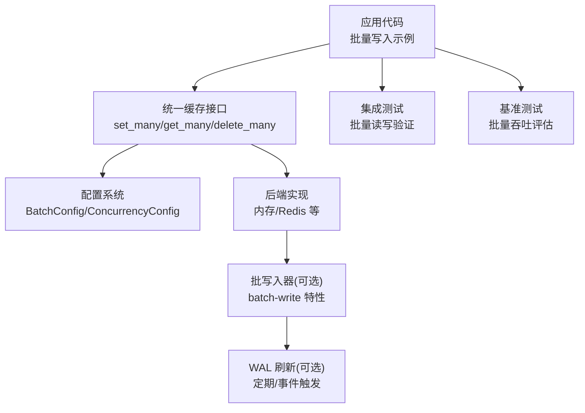
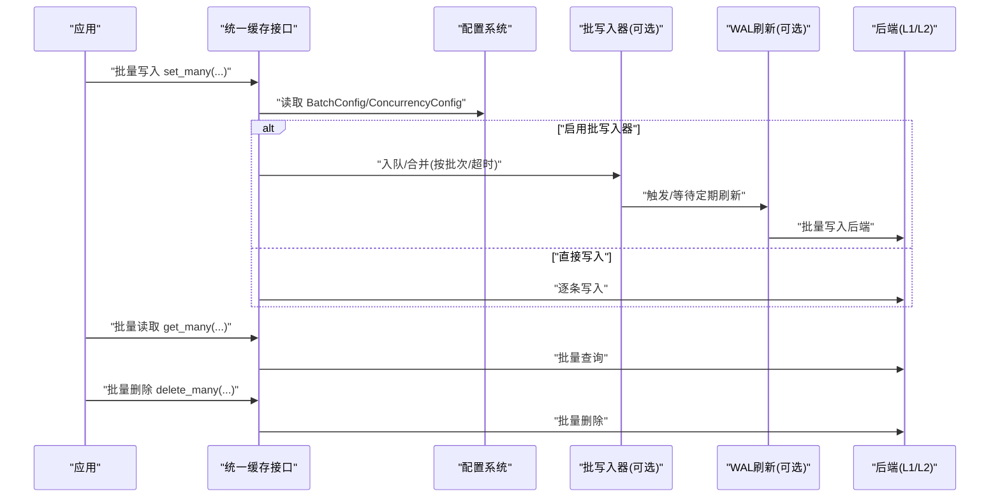
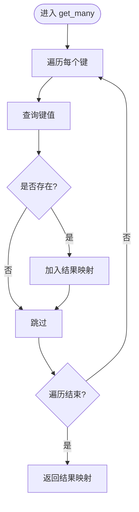
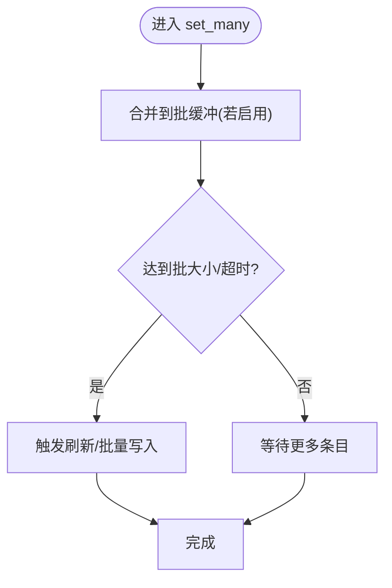
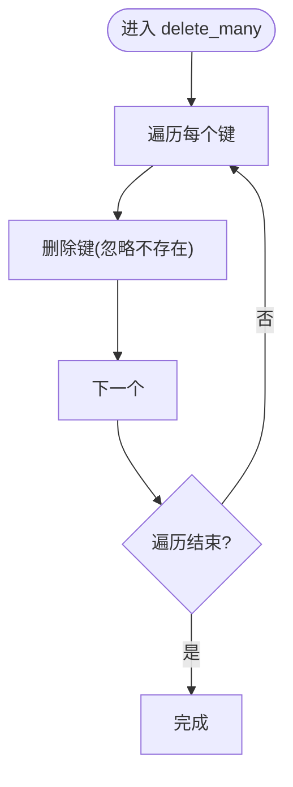
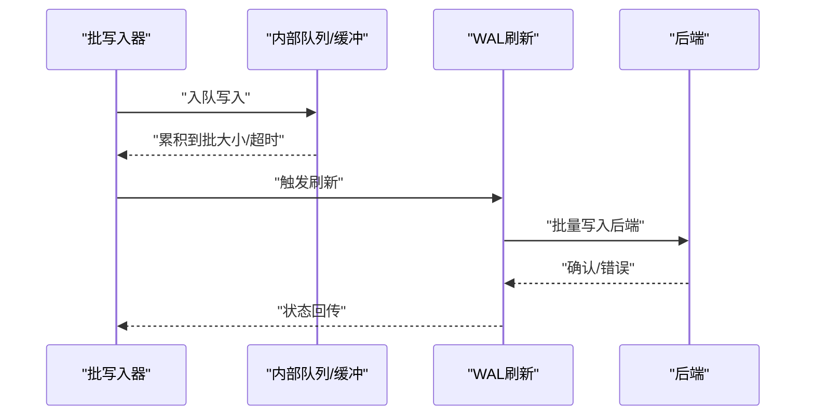
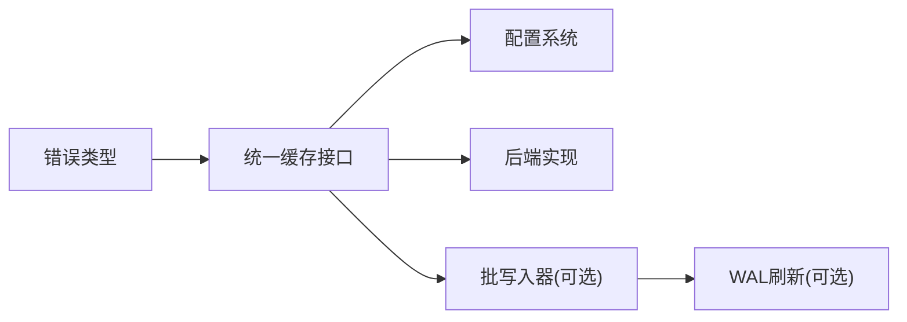

# 批量操作

<cite>
**本文引用的文件**
- [src/cache_interface.rs](file://src/cache_interface.rs)
- [src/config/unified.rs](file://src/config/unified.rs)
- [src/sync/mod.rs](file://src/sync/mod.rs)
- [src/lib.rs](file://src/lib.rs)
- [examples/src/02_advanced/example_batch_write.rs](file://examples/src/02_advanced/example_batch_write.rs)
- [tests/integration/batch_write_test.rs](file://tests/integration/batch_write_test.rs)
- [tests/integration/redis_simple_test.rs](file://tests/integration/redis_simple_test.rs)
- [benches/cache_benchmark.rs](file://benches/cache_benchmark.rs)
- [src/error.rs](file://src/error.rs)
- [src/recovery/wal.rs](file://src/recovery/wal.rs)
</cite>

## 目录
1. [简介](#简介)
2. [项目结构](#项目结构)
3. [核心组件](#核心组件)
4. [架构总览](#架构总览)
5. [详细组件分析](#详细组件分析)
6. [依赖分析](#依赖分析)
7. [性能考量](#性能考量)
8. [故障排查指南](#故障排查指南)
9. [结论](#结论)
10. [附录](#附录)

## 简介
本章节面向希望高效执行大批量缓存操作的用户，系统性介绍 Oxcache 的批量能力：批量读取、批量写入与批量删除。文档重点阐述以下方面：
- 批量操作的性能优势：降低网络往返与系统开销，提升吞吐与稳定性
- 实现机制：请求合并、批内事务化处理、错误隔离与回退策略
- 配置参数：批量大小上限、批内超时、并行处理开关、队列与并发控制
- 最佳实践：批量大小选择、错误重试与幂等设计
- 性能测试与优化建议：结合基准测试与集成测试结果给出实操建议

## 项目结构
围绕批量操作的关键代码分布在以下模块：
- 统一接口层：提供 set_many/get_many/delete_many 等批量 API
- 配置层：集中管理序列化、批量、并发等性能相关配置
- 同步与落盘：批写入器与 WAL 刷新机制（在启用相应特性时生效）
- 示例与测试：展示批量写入流程与性能验证
- 基准测试：覆盖 L1 内存缓存的批量吞吐

**图表来源**
- [src/cache_interface.rs](file://src/cache_interface.rs#L220-L257)
- [src/config/unified.rs](file://src/config/unified.rs#L147-L171)
- [src/sync/mod.rs](file://src/sync/mod.rs#L45-L83)
- [src/recovery/wal.rs](file://src/recovery/wal.rs#L132-L163)
- [examples/src/02_advanced/example_batch_write.rs](file://examples/src/02_advanced/example_batch_write.rs#L25-L154)
- [tests/integration/batch_write_test.rs](file://tests/integration/batch_write_test.rs#L16-L45)
- [benches/cache_benchmark.rs](file://benches/cache_benchmark.rs#L63-L90)

**章节来源**
- [src/cache_interface.rs](file://src/cache_interface.rs#L220-L257)
- [src/config/unified.rs](file://src/config/unified.rs#L147-L171)
- [src/sync/mod.rs](file://src/sync/mod.rs#L45-L83)
- [src/recovery/wal.rs](file://src/recovery/wal.rs#L132-L163)
- [examples/src/02_advanced/example_batch_write.rs](file://examples/src/02_advanced/example_batch_write.rs#L25-L154)
- [tests/integration/batch_write_test.rs](file://tests/integration/batch_write_test.rs#L16-L45)
- [benches/cache_benchmark.rs](file://benches/cache_benchmark.rs#L63-L90)

## 核心组件
- 批量接口（统一缓存接口）：提供 set_many_bytes/get_many_bytes/delete_many 等批量 API；同时提供 set_many_typed/get_many_typed 对上层类型友好
- 批量配置（BatchConfig）：控制是否启用批量、最大批量大小、批内超时、是否并行处理
- 并发与队列（ConcurrencyConfig）：最大并发、单次操作超时、是否启用队列、最大队列长度
- 批写入器（BatchWriter，需启用 batch-write 特性）：将多次写入合并为批，按配置刷盘或触发刷新
- WAL 刷新：定期与事件驱动刷新，保障持久化与恢复

**章节来源**
- [src/cache_interface.rs](file://src/cache_interface.rs#L220-L286)
- [src/config/unified.rs](file://src/config/unified.rs#L147-L171)
- [src/sync/mod.rs](file://src/sync/mod.rs#L45-L83)
- [src/recovery/wal.rs](file://src/recovery/wal.rs#L132-L163)

## 架构总览
批量操作在统一接口层对外暴露，内部根据配置决定是否走批写入器与 WAL 刷新路径。典型流程如下：

**图表来源**
- [src/cache_interface.rs](file://src/cache_interface.rs#L220-L257)
- [src/config/unified.rs](file://src/config/unified.rs#L147-L171)
- [src/sync/mod.rs](file://src/sync/mod.rs#L45-L83)
- [src/recovery/wal.rs](file://src/recovery/wal.rs#L132-L163)

## 详细组件分析

### 批量读取（get_many）
- 接口行为：接收键集合，返回存在值的映射；不存在的键不会出现在结果中
- 实现要点：遍历键集合，逐个查询并聚合结果，避免因个别键缺失导致整体失败
- 典型用途：批量拉取对象、批量校验存在性

**图表来源**
- [src/cache_interface.rs](file://src/cache_interface.rs#L232-L245)

**章节来源**
- [src/cache_interface.rs](file://src/cache_interface.rs#L232-L245)

### 批量写入（set_many）
- 接口行为：接收键值对集合，逐条写入；默认不透传 TTL（可通过具体实现调整）
- 实现要点：在启用批写入器时，写入会被合并到缓冲区，按批大小或超时触发刷新；否则逐条写入后端
- 典型用途：批量导入、批量预热、批量更新

**图表来源**
- [src/cache_interface.rs](file://src/cache_interface.rs#L220-L230)
- [src/sync/mod.rs](file://src/sync/mod.rs#L45-L83)
- [src/recovery/wal.rs](file://src/recovery/wal.rs#L132-L163)

**章节来源**
- [src/cache_interface.rs](file://src/cache_interface.rs#L220-L230)
- [src/sync/mod.rs](file://src/sync/mod.rs#L45-L83)
- [src/recovery/wal.rs](file://src/recovery/wal.rs#L132-L163)

### 批量删除（delete_many）
- 接口行为：接收键集合，逐条删除；不存在的键不会报错
- 实现要点：遍历删除，保证幂等性；适合批量下架、清理过期数据
- 典型用途：批量下架、批量失效

**图表来源**
- [src/cache_interface.rs](file://src/cache_interface.rs#L247-L257)

**章节来源**
- [src/cache_interface.rs](file://src/cache_interface.rs#L247-L257)

### 批写入器与 WAL 刷新
- 批写入器（BatchWriter）：仅在启用 batch-write 特性时可用；负责将多次写入合并、按配置刷盘
- 刷新策略：定时刷新与事件触发刷新相结合，避免长时间积压
- 错误处理：当特性未启用时，相关方法会返回明确的配置错误提示，指导用户启用特性

**图表来源**
- [src/sync/mod.rs](file://src/sync/mod.rs#L45-L83)
- [src/recovery/wal.rs](file://src/recovery/wal.rs#L132-L163)

**章节来源**
- [src/sync/mod.rs](file://src/sync/mod.rs#L45-L83)
- [src/recovery/wal.rs](file://src/recovery/wal.rs#L132-L163)

## 依赖分析
- 批量接口依赖配置系统中的 BatchConfig 与 ConcurrencyConfig
- 批写入器依赖 Redis 后端（当前版本注释指出暂不支持分层，使用 Redis 作为 L2），并在启用 batch-write 特性时生效
- 错误类型中包含缓冲区满、超时等与批量操作密切相关的错误类别

**图表来源**
- [src/cache_interface.rs](file://src/cache_interface.rs#L220-L286)
- [src/config/unified.rs](file://src/config/unified.rs#L147-L171)
- [src/sync/mod.rs](file://src/sync/mod.rs#L45-L83)
- [src/error.rs](file://src/error.rs#L167-L208)

**章节来源**
- [src/cache_interface.rs](file://src/cache_interface.rs#L220-L286)
- [src/config/unified.rs](file://src/config/unified.rs#L147-L171)
- [src/sync/mod.rs](file://src/sync/mod.rs#L45-L83)
- [src/error.rs](file://src/error.rs#L167-L208)

## 性能考量
- 减少网络往返与系统开销：批量操作将多次请求合并为一次或少数几次请求，显著降低 RTT 与协议开销
- 批大小与超时：合理设置 max_batch_size 与 batch_timeout，平衡吞吐与延迟
- 并行处理：开启 parallel_processing 可提升 CPU 密集型场景下的吞吐
- 序列化与压缩：结合序列化配置与压缩阈值，降低数据体积
- 基准测试参考：L1 内存缓存的批量吞吐基准覆盖不同批量大小，可据此评估系统表现

**章节来源**
- [benches/cache_benchmark.rs](file://benches/cache_benchmark.rs#L63-L90)
- [src/config/unified.rs](file://src/config/unified.rs#L147-L171)

## 故障排查指南
- 批写入器未启用：若未启用 batch-write 特性，调用批写入器相关方法会返回配置错误，请按提示启用特性
- 缓冲区已满：当批写入缓冲达到容量上限时会触发缓冲区已满错误，应增大缓冲或减小写入速率
- 超时错误：单次操作或批刷新可能因系统负载过高而超时，适当增加超时或降低批大小
- 集成测试验证：通过集成测试可验证批量写入后的可见性与一致性

**章节来源**
- [src/sync/mod.rs](file://src/sync/mod.rs#L114-L172)
- [src/error.rs](file://src/error.rs#L167-L208)
- [tests/integration/batch_write_test.rs](file://tests/integration/batch_write_test.rs#L16-L45)
- [tests/integration/redis_simple_test.rs](file://tests/integration/redis_simple_test.rs#L75-L100)

## 结论
Oxcache 的批量操作通过统一接口与可配置的批写入器，在内存与 Redis 后端上实现了高效的批量读取、写入与删除。结合合理的批大小、超时与并行策略，可在高并发场景下显著降低网络与系统开销，提升整体吞吐。建议在生产环境中配合监控与基准测试持续优化配置。

## 附录

### 配置参数一览
- 批量配置（BatchConfig）
  - enabled：是否启用批量
  - max_batch_size：最大批大小
  - batch_timeout：批内超时
  - parallel_processing：是否并行处理
- 并发配置（ConcurrencyConfig）
  - max_concurrent_ops：最大并发
  - operation_timeout：单次操作超时
  - enable_queuing：是否启用队列
  - max_queue_size：最大队列长度

**章节来源**
- [src/config/unified.rs](file://src/config/unified.rs#L147-L171)

### 最佳实践
- 批大小选择：从基准测试与实际负载出发，逐步增大至吞吐饱和点附近再微调
- 错误重试：对瞬时性错误进行指数退避重试，避免抖动放大
- 幂等设计：批量删除与写入应具备幂等性，确保重复执行的安全性
- 监控与告警：关注批成功速率、吞吐量与延迟分布，及时发现异常

**章节来源**
- [benches/cache_benchmark.rs](file://benches/cache_benchmark.rs#L63-L90)
- [src/error.rs](file://src/error.rs#L167-L208)

### 示例与测试参考
- 批量写入示例：展示批量添加、更新、读取与删除的完整流程
- 集成测试：验证 Redis 后端上的批量写入与可见性
- 基准测试：覆盖 L1 内存缓存的批量吞吐评估

**章节来源**
- [examples/src/02_advanced/example_batch_write.rs](file://examples/src/02_advanced/example_batch_write.rs#L25-L154)
- [tests/integration/batch_write_test.rs](file://tests/integration/batch_write_test.rs#L16-L45)
- [tests/integration/redis_simple_test.rs](file://tests/integration/redis_simple_test.rs#L75-L100)
- [benches/cache_benchmark.rs](file://benches/cache_benchmark.rs#L63-L90)
