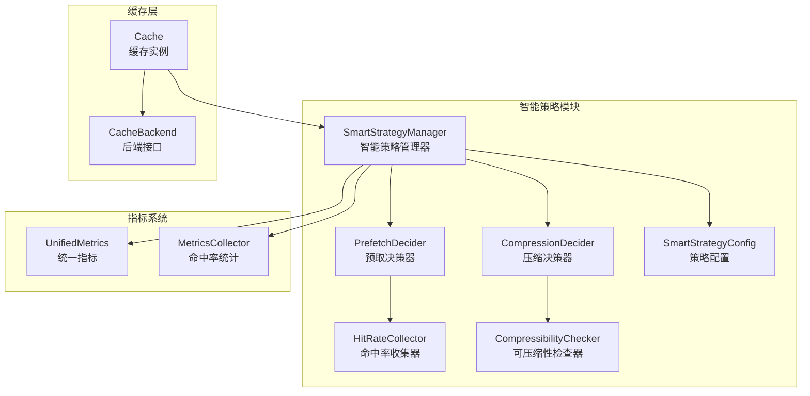
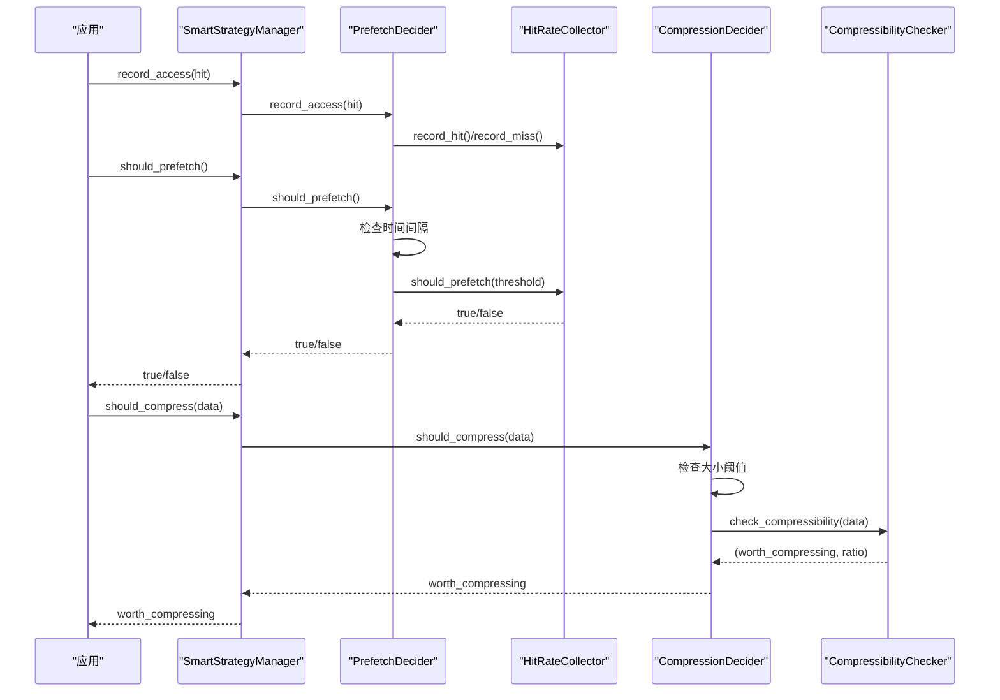
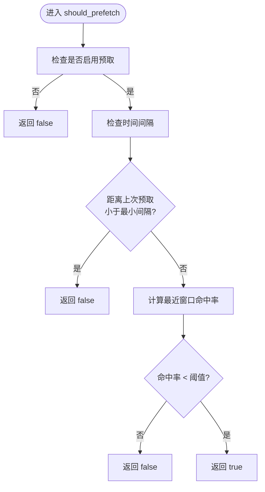
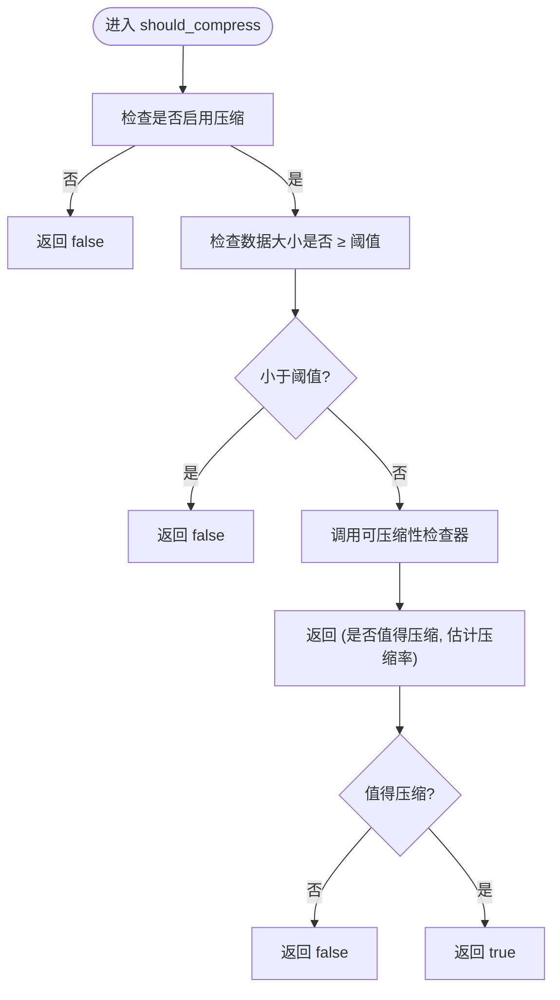
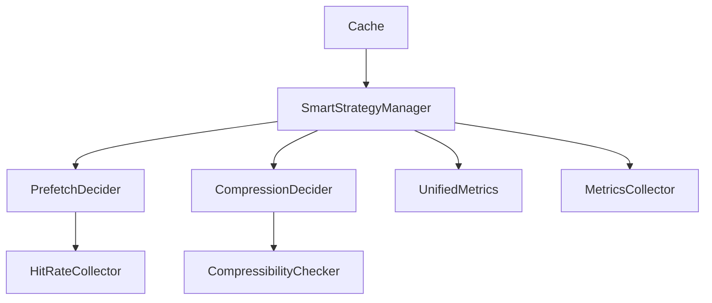

# 智能策略

<cite>
**本文档引用的文件**
- [smart_strategy.rs](file://src/smart_strategy.rs)
- [smart_strategy 示例](file://examples/src/smart_strategy.rs)
- [缓存实现](file://src/cache.rs)
- [统一指标导出](file://src/metrics/unified.rs)
- [命中率指标](file://src/backend/metrics.rs)
- [缓存构建器](file://src/builder/cache_builder.rs)
</cite>

## 目录
1. [简介](#简介)
2. [项目结构](#项目结构)
3. [核心组件](#核心组件)
4. [架构概览](#架构概览)
5. [详细组件分析](#详细组件分析)
6. [依赖关系分析](#依赖关系分析)
7. [性能考量](#性能考量)
8. [故障排除指南](#故障排除指南)
9. [结论](#结论)
10. [附录](#附录)

## 简介
本文件深入解析 Oxcache 的智能策略系统，涵盖自动预取决策、智能压缩选择与自适应缓存优化。系统通过命中率统计与可压缩性检查，动态调整缓存行为，提升整体性能与资源利用率。文档将详细说明智能策略管理器的工作原理、预取决策器的实现机制、压缩决策器的算法，并提供配置参数详解与调优建议。

## 项目结构
智能策略系统位于核心模块中，围绕以下关键文件组织：
- 智能策略核心：src/smart_strategy.rs
- 示例演示：examples/src/smart_strategy.rs
- 缓存实现与集成点：src/cache.rs
- 指标统计与导出：src/metrics/unified.rs、src/backend/metrics.rs
- 构建器与配置入口：src/builder/cache_builder.rs

**图表来源**
- [smart_strategy.rs](file://src/smart_strategy.rs#L355-L421)
- [缓存实现](file://src/cache.rs#L117-L203)
- [统一指标导出](file://src/metrics/unified.rs#L575-L681)
- [命中率指标](file://src/backend/metrics.rs#L483-L522)

**章节来源**
- [smart_strategy.rs](file://src/smart_strategy.rs#L1-L556)
- [缓存实现](file://src/cache.rs#L117-L203)

## 核心组件
- 智能策略配置（SmartStrategyConfig）：定义预取与压缩的开关、阈值与采样参数。
- 命中率收集器（HitRateCollector）：维护总命中/未命中与最近窗口命中/未命中，支持滚动窗口与命中率计算。
- 预取决策器（PrefetchDecider）：结合命中率阈值与最小预取间隔，决定是否触发预取。
- 压缩决策器（CompressionDecider）：基于数据大小阈值与可压缩性检查，决定是否压缩。
- 可压缩性检查器（CompressibilityChecker）：通过采样与熵计算评估数据可压缩性。
- 智能策略管理器（SmartStrategyManager）：聚合决策器与配置，提供统一的策略接口与统计查询。

**章节来源**
- [smart_strategy.rs](file://src/smart_strategy.rs#L13-L47)
- [smart_strategy.rs](file://src/smart_strategy.rs#L49-L143)
- [smart_strategy.rs](file://src/smart_strategy.rs#L241-L315)
- [smart_strategy.rs](file://src/smart_strategy.rs#L317-L353)
- [smart_strategy.rs](file://src/smart_strategy.rs#L156-L239)
- [smart_strategy.rs](file://src/smart_strategy.rs#L355-L421)

## 架构概览
智能策略系统通过管理器协调预取与压缩两个子系统，前者基于命中率统计，后者基于数据特征分析。两者均受配置驱动，并通过指标系统反馈运行状态。

```mermaid
classDiagram
class SmartStrategyConfig {
+bool prefetch_enabled
+f64 prefetch_threshold
+usize prefetch_window_size
+usize prefetch_batch_size
+bool compression_enabled
+usize compression_threshold
+f64 min_compression_ratio
+f64 compression_sample_rate
}
class HitRateCollector {
+record_hit()
+record_miss()
+hit_rate() f64
+recent_hit_rate() f64
+should_prefetch(threshold) bool
+stats() HitRateStats
+reset()
}
class PrefetchDecider {
+record_access(hit)
+should_prefetch() bool
+mark_prefetched()
+hit_rate_stats() HitRateStats
}
class CompressibilityChecker {
+check_compressibility(data) (bool, f64)
-calculate_entropy(data) f64
}
class CompressionDecider {
+should_compress(data) bool
}
class SmartStrategyManager {
+record_access(hit)
+should_prefetch() bool
+mark_prefetched()
+should_compress(data) bool
+hit_rate_stats() HitRateStats
+update_config(config)
}
SmartStrategyManager --> PrefetchDecider : "组合"
SmartStrategyManager --> CompressionDecider : "组合"
PrefetchDecider --> HitRateCollector : "使用"
CompressionDecider --> CompressibilityChecker : "使用"
SmartStrategyManager --> SmartStrategyConfig : "持有"
```

**图表来源**
- [smart_strategy.rs](file://src/smart_strategy.rs#L13-L47)
- [smart_strategy.rs](file://src/smart_strategy.rs#L49-L143)
- [smart_strategy.rs](file://src/smart_strategy.rs#L241-L315)
- [smart_strategy.rs](file://src/smart_strategy.rs#L317-L353)
- [smart_strategy.rs](file://src/smart_strategy.rs#L156-L239)
- [smart_strategy.rs](file://src/smart_strategy.rs#L355-L421)

## 详细组件分析

### 智能策略管理器（SmartStrategyManager）
- 职责：聚合预取与压缩决策器，提供统一接口；支持配置更新与命中率统计查询。
- 关键方法：
  - record_access(hit)：记录一次访问结果，驱动命中率统计。
  - should_prefetch()：综合时间间隔与命中率阈值判断是否预取。
  - mark_prefetched()：标记最近一次预取时间，避免过于频繁。
  - should_compress(data)：基于大小阈值与可压缩性检查决定压缩。
  - update_config(config)：重建内部决策器以应用新配置。
  - hit_rate_stats()：返回当前命中率统计快照。

**图表来源**
- [smart_strategy.rs](file://src/smart_strategy.rs#L355-L421)
- [smart_strategy.rs](file://src/smart_strategy.rs#L241-L315)
- [smart_strategy.rs](file://src/smart_strategy.rs#L317-L353)

**章节来源**
- [smart_strategy.rs](file://src/smart_strategy.rs#L355-L421)

### 预取决策器（PrefetchDecider）
- 时间间隔控制：限制预取执行的最小时间间隔，避免过度预取。
- 命中率阈值：基于最近窗口命中率与阈值比较，低于阈值时触发预取。
- 统计查询：提供命中率统计快照，便于监控与调试。

**图表来源**
- [smart_strategy.rs](file://src/smart_strategy.rs#L270-L290)

**章节来源**
- [smart_strategy.rs](file://src/smart_strategy.rs#L241-L315)

### 压缩决策器（CompressionDecider）
- 大小阈值：仅当数据长度超过阈值时进行压缩决策，避免对小数据进行昂贵的检查。
- 可压缩性检查：委托可压缩性检查器进行采样与熵计算，评估压缩价值。
- 压缩率估算：基于熵归一化与经验模型估算压缩率，辅助决策。

**图表来源**
- [smart_strategy.rs](file://src/smart_strategy.rs#L333-L353)
- [smart_strategy.rs](file://src/smart_strategy.rs#L156-L239)

**章节来源**
- [smart_strategy.rs](file://src/smart_strategy.rs#L317-L353)
- [smart_strategy.rs](file://src/smart_strategy.rs#L156-L239)

### 命中率收集器（HitRateCollector）
- 原子计数：使用原子类型维护命中/未命中总数，保证高并发安全。
- 滚动窗口：当最近窗口计数达到设定大小时重置，确保统计聚焦近期行为。
- 命中率计算：提供总体命中率与最近窗口命中率，支持阈值判断。

**章节来源**
- [smart_strategy.rs](file://src/smart_strategy.rs#L49-L143)

### 可压缩性检查器（CompressibilityChecker）
- 采样检查：按步长采样数据，降低计算开销。
- 熵计算：统计字节频率，计算信息熵，衡量数据随机性。
- 判断逻辑：基于归一化熵与压缩率估算，结合阈值与最小压缩率决定是否压缩。

**章节来源**
- [smart_strategy.rs](file://src/smart_strategy.rs#L156-L239)

### 配置参数详解与调优建议
- 预取相关
  - prefetch_enabled：是否启用自动预取。默认开启，适合大多数场景。
  - prefetch_threshold：预取触发阈值（0~1）。较低阈值更积极地预取，但可能增加带宽与CPU开销。建议根据业务访问模式调整。
  - prefetch_window_size：用于计算命中率的请求数窗口大小。窗口越大越平滑，但响应延迟越高；窗口越小越敏感，但易抖动。
  - prefetch_batch_size：预取批量大小。增大可提升吞吐，但需平衡内存占用与网络压力。
- 压缩相关
  - compression_enabled：是否启用自动压缩。默认开启，适用于大体量文本/JSON等可压缩数据。
  - compression_threshold：压缩阈值（字节）。对小数据跳过压缩，避免额外CPU消耗。
  - min_compression_ratio：最小压缩率阈值。压缩后大小/原始大小低于此值才生效。
  - compression_sample_rate：压缩采样率（0~1）。影响熵计算精度与性能权衡。
- 典型调优思路
  - 高峰期：适当提高预取阈值与窗口大小，减少误触发；适度增大预取批量提升效率。
  - 低延迟要求：缩短预取最小间隔，但要配合命中率阈值防止过度预取。
  - CPU受限：降低压缩采样率或提高压缩阈值，减少压缩检查频率。
  - 存储受限：降低压缩阈值或提高最小压缩率，更多数据参与压缩。

**章节来源**
- [smart_strategy.rs](file://src/smart_strategy.rs#L13-L47)

## 依赖关系分析
- 智能策略管理器依赖预取与压缩决策器；二者分别依赖各自的收集器/检查器。
- 缓存实现通过管理器接口记录访问与决策，间接接入智能策略。
- 指标系统提供统一的计数器与命中率统计，支撑策略效果观测。

**图表来源**
- [smart_strategy.rs](file://src/smart_strategy.rs#L355-L421)
- [缓存实现](file://src/cache.rs#L117-L203)
- [统一指标导出](file://src/metrics/unified.rs#L575-L681)
- [命中率指标](file://src/backend/metrics.rs#L483-L522)

**章节来源**
- [smart_strategy.rs](file://src/smart_strategy.rs#L355-L421)
- [缓存实现](file://src/cache.rs#L117-L203)
- [统一指标导出](file://src/metrics/unified.rs#L575-L681)
- [命中率指标](file://src/backend/metrics.rs#L483-L522)

## 性能考量
- 原子操作与无锁设计：命中率收集器采用原子计数，降低锁竞争，适合高并发场景。
- 采样与窗口：压缩检查与命中率统计均采用采样与滚动窗口，平衡精度与性能。
- 预取间隔：内置最小预取间隔，避免频繁预取带来的抖动与资源浪费。
- 指标开销：统一指标系统使用原子计数器，尽量减少对主路径的影响。
- 实践建议：根据业务特征调整窗口大小与阈值，避免过度预取或压缩导致的额外开销。

[本节为通用性能讨论，无需特定文件分析]

## 故障排除指南
- 预取未触发
  - 检查是否启用预取与时间间隔设置是否过严。
  - 观察命中率统计，确认最近窗口命中率是否确实低于阈值。
- 压缩无效
  - 确认数据大小是否超过压缩阈值。
  - 检查可压缩性检查器的熵阈值与采样率设置。
- 命中率异常
  - 核对窗口大小设置，过大可能导致响应迟钝，过小可能导致波动。
  - 查看指标系统中的命中率统计，定位异常时段与原因。

**章节来源**
- [smart_strategy.rs](file://src/smart_strategy.rs#L423-L555)
- [统一指标导出](file://src/metrics/unified.rs#L575-L681)
- [命中率指标](file://src/backend/metrics.rs#L483-L522)

## 结论
Oxcache 的智能策略系统通过“命中率统计 + 可压缩性检查”的双轨机制，实现了自适应的缓存优化。管理器将预取与压缩两大能力整合，既提升了命中率，又降低了存储与传输成本。合理配置参数并结合指标监控，可在不同业务场景下获得稳定且高效的缓存表现。

[本节为总结性内容，无需特定文件分析]

## 附录

### 实际使用示例
- 示例程序展示了预取策略演示、压缩策略演示、缓存效率演示与统计输出，帮助快速理解智能策略的实际效果。

**章节来源**
- [smart_strategy 示例](file://examples/src/smart_strategy.rs#L1-L109)

### 集成点与最佳实践
- 在缓存读写流程中，优先通过管理器记录访问与决策，确保策略生效。
- 结合统一指标系统导出命中率与操作计数，持续监控策略效果。
- 使用构建器配置缓存容量与TTL，配合智能策略实现更佳的整体性能。

**章节来源**
- [缓存实现](file://src/cache.rs#L117-L203)
- [统一指标导出](file://src/metrics/unified.rs#L575-L681)
- [缓存构建器](file://src/builder/cache_builder.rs#L38-L209)
