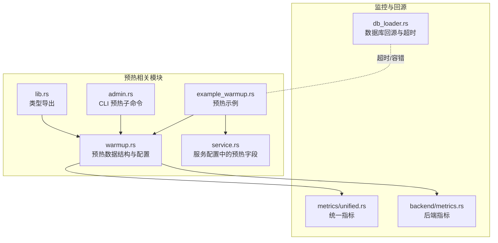
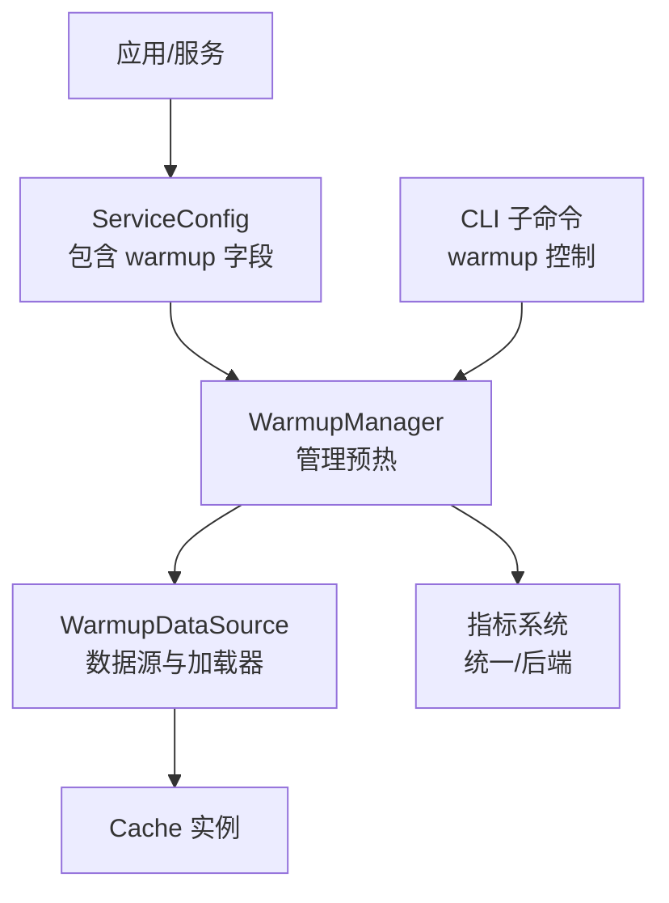
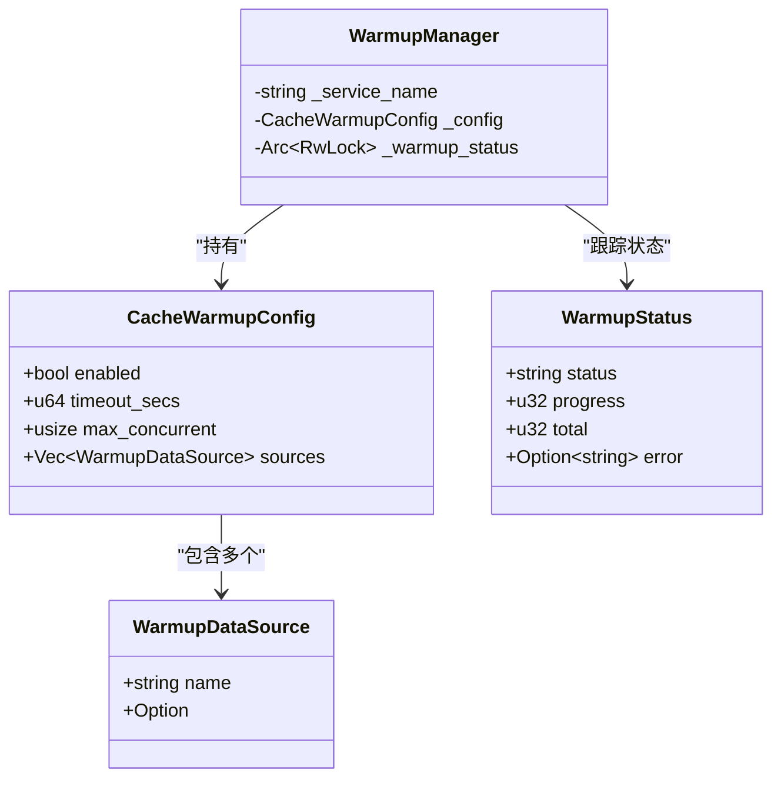
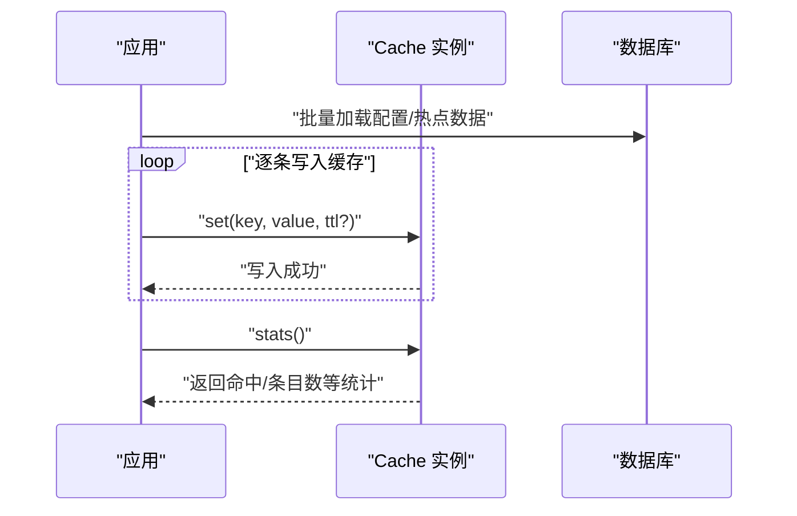
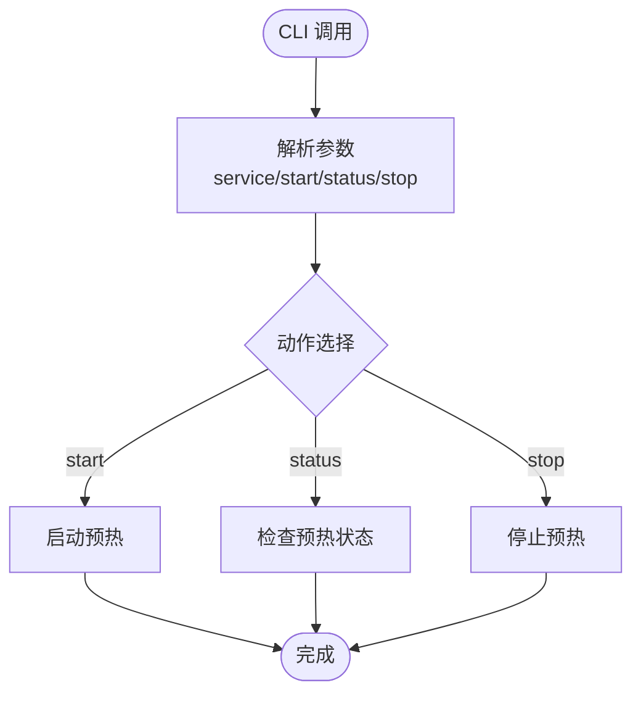
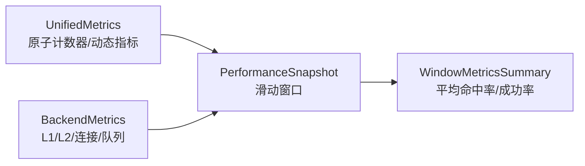
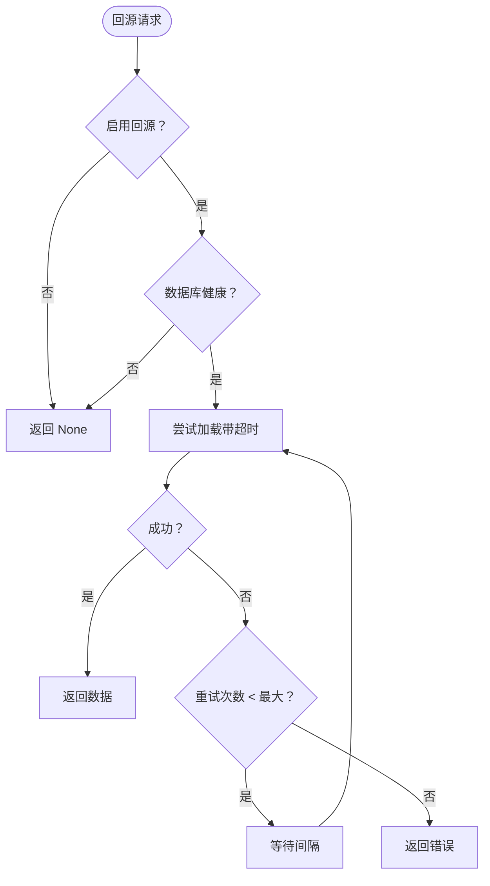
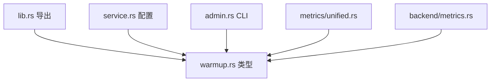

# 缓存预热

<cite>
**本文引用的文件**
- [src/sync/warmup.rs](file://src/sync/warmup.rs)
- [examples/src/02_advanced/example_warmup.rs](file://examples/src/02_advanced/example_warmup.rs)
- [src/config/service.rs](file://src/config/service.rs)
- [src/cli/admin.rs](file://src/cli/admin.rs)
- [src/lib.rs](file://src/lib.rs)
- [src/client/db_loader.rs](file://src/client/db_loader.rs)
- [src/metrics/unified.rs](file://src/metrics/unified.rs)
- [src/backend/metrics.rs](file://src/backend/metrics.rs)
- [tests/integration/lock_warmup_test.rs](file://tests/integration/lock_warmup_test.rs)
</cite>

## 目录
1. [简介](#简介)
2. [项目结构](#项目结构)
3. [核心组件](#核心组件)
4. [架构总览](#架构总览)
5. [详细组件分析](#详细组件分析)
6. [依赖关系分析](#依赖关系分析)
7. [性能考量](#性能考量)
8. [故障排查指南](#故障排查指南)
9. [结论](#结论)
10. [附录](#附录)

## 简介
本章节介绍 Oxcache 的缓存预热能力与实践方法，涵盖以下内容：
- 如何在系统启动或维护期间提前加载热点数据到缓存中
- 预热策略的实现原理：数据批量加载、异步并发预热与进度跟踪
- 预热配置选项：批次大小、并发度控制、超时设置
- 预热过程中的性能监控与对业务流量的影响规避
- 不同场景下的预热策略：启动预热、定期预热、事件驱动预热
- 预热效果评估与调优建议

## 项目结构
与缓存预热相关的代码主要分布在以下模块：
- 预热数据结构与配置：src/sync/warmup.rs
- 预热示例：examples/src/02_advanced/example_warmup.rs
- 预热配置在服务配置中的位置：src/config/service.rs
- 预热命令行控制：src/cli/admin.rs
- 预热类型导出：src/lib.rs
- 数据库回源与超时控制（与预热相关的容错机制）：src/client/db_loader.rs
- 统一指标与后端指标（性能监控基础）：src/metrics/unified.rs、src/backend/metrics.rs
- 集成测试（验证预热行为）：tests/integration/lock_warmup_test.rs

**图示来源**
- [src/sync/warmup.rs](file://src/sync/warmup.rs#L1-L123)
- [examples/src/02_advanced/example_warmup.rs](file://examples/src/02_advanced/example_warmup.rs#L1-L151)
- [src/config/service.rs](file://src/config/service.rs#L514-L554)
- [src/cli/admin.rs](file://src/cli/admin.rs#L40-L68)
- [src/lib.rs](file://src/lib.rs#L607-L608)
- [src/client/db_loader.rs](file://src/client/db_loader.rs#L239-L267)
- [src/metrics/unified.rs](file://src/metrics/unified.rs#L1-L200)
- [src/backend/metrics.rs](file://src/backend/metrics.rs#L524-L695)

**章节来源**
- [src/sync/warmup.rs](file://src/sync/warmup.rs#L1-L123)
- [examples/src/02_advanced/example_warmup.rs](file://examples/src/02_advanced/example_warmup.rs#L1-L151)
- [src/config/service.rs](file://src/config/service.rs#L514-L554)
- [src/cli/admin.rs](file://src/cli/admin.rs#L40-L68)
- [src/lib.rs](file://src/lib.rs#L607-L608)
- [src/client/db_loader.rs](file://src/client/db_loader.rs#L239-L267)
- [src/metrics/unified.rs](file://src/metrics/unified.rs#L1-L200)
- [src/backend/metrics.rs](file://src/backend/metrics.rs#L524-L695)

## 核心组件
- 预热数据源配置：定义数据源名称与加载函数，支持动态注入加载器。
- 缓存预热配置：控制是否启用预热、超时时间（秒）、最大并发数、数据源列表。
- 预热状态：记录状态、进度、总数与错误信息，便于进度跟踪与可观测性。
- 预热管理器：持有服务名、配置与状态映射，负责协调预热生命周期。

这些组件共同构成 Oxcache 的预热基础设施，既可作为独立模块使用，也可通过 CLI 或服务配置进行集成。

**章节来源**
- [src/sync/warmup.rs](file://src/sync/warmup.rs#L14-L55)

## 架构总览
下面的架构图展示了预热在系统中的位置与交互关系：

**图示来源**
- [src/config/service.rs](file://src/config/service.rs#L514-L554)
- [src/sync/warmup.rs](file://src/sync/warmup.rs#L38-L55)
- [src/cli/admin.rs](file://src/cli/admin.rs#L40-L68)
- [src/metrics/unified.rs](file://src/metrics/unified.rs#L1-L200)
- [src/backend/metrics.rs](file://src/backend/metrics.rs#L524-L695)

## 详细组件分析

### 预热数据结构与配置
- WarmupDataSource：包含数据源名称与可选的加载函数，加载函数以异步 Future 形式返回结果，支持发送与同步。
- CacheWarmupConfig：包含启用开关、超时秒数、最大并发数与数据源列表。
- WarmupStatus：包含状态字符串、进度、总数与错误信息，便于前端展示与运维观测。

**图示来源**
- [src/sync/warmup.rs](file://src/sync/warmup.rs#L14-L55)

**章节来源**
- [src/sync/warmup.rs](file://src/sync/warmup.rs#L14-L55)

### 预热流程与示例
示例程序展示了典型的预热流程：
- 启动阶段：先加载配置项并写入缓存
- 热点数据预热：并发生成多个任务，模拟从数据库加载并写入缓存
- 验证与重建：清空缓存后重新预热，并输出统计信息

**图示来源**
- [examples/src/02_advanced/example_warmup.rs](file://examples/src/02_advanced/example_warmup.rs#L36-L139)

**章节来源**
- [examples/src/02_advanced/example_warmup.rs](file://examples/src/02_advanced/example_warmup.rs#L1-L151)

### CLI 预热控制
CLI 提供了预热相关的子命令参数，支持：
- 指定服务名
- 启动预热
- 查询预热状态
- 停止预热

这使得运维人员可以在运行时对预热进行控制，避免与业务高峰期冲突。

**图示来源**
- [src/cli/admin.rs](file://src/cli/admin.rs#L40-L68)

**章节来源**
- [src/cli/admin.rs](file://src/cli/admin.rs#L40-L68)

### 预热配置选项
- 启用开关：决定是否执行预热
- 超时时间（秒）：限制单次预热的最长持续时间
- 最大并发数：控制同时进行的预热任务数量，避免资源争抢
- 数据源列表：支持多数据源并行加载

这些配置在服务配置中体现，便于在不同环境与场景下灵活调整。

**章节来源**
- [src/config/service.rs](file://src/config/service.rs#L544-L554)

### 预热状态与进度跟踪
预热状态包含：
- 状态字符串：如“进行中”、“已完成”、“失败”
- 进度与总数：便于计算百分比与剩余时间
- 错误信息：记录失败原因，辅助排障

WarmupManager 内部使用并发安全的状态映射，结合 RwLock 保证读写一致性。

**章节来源**
- [src/sync/warmup.rs](file://src/sync/warmup.rs#L44-L55)

### 预热与性能监控
- 统一指标系统：提供高频率原子计数器与动态指标，可用于统计预热期间的命中、未命中、操作数与错误数。
- 后端指标：包含 L1/L2 命中率、连接数、活跃任务数、队列深度等，有助于评估预热对后端压力的影响。
- 滑动窗口指标：可对一段时间内的命中率与成功率进行汇总，辅助判断预热效果。

**图示来源**
- [src/metrics/unified.rs](file://src/metrics/unified.rs#L53-L157)
- [src/backend/metrics.rs](file://src/backend/metrics.rs#L524-L695)

**章节来源**
- [src/metrics/unified.rs](file://src/metrics/unified.rs#L1-L200)
- [src/backend/metrics.rs](file://src/backend/metrics.rs#L524-L695)

### 预热与数据库回源的超时控制
虽然预热本身是主动写入缓存，但在回源加载（如缓存未命中时）场景中，数据库回源管理器提供了超时与重试机制，这对预热的容错与稳定性有借鉴意义：
- 超时控制：超过设定时间返回超时错误，避免阻塞
- 重试机制：在健康状态下按最大重试次数进行尝试

**图示来源**
- [src/client/db_loader.rs](file://src/client/db_loader.rs#L170-L267)

**章节来源**
- [src/client/db_loader.rs](file://src/client/db_loader.rs#L170-L267)

### 集成测试与行为验证
集成测试验证了预热的基本行为：手动预热后键应被缓存命中；清理后可重新预热。这为实际业务场景提供了参考模式。

**章节来源**
- [tests/integration/lock_warmup_test.rs](file://tests/integration/lock_warmup_test.rs#L125-L144)

## 依赖关系分析
- 类型导出：lib.rs 将 WarmupManager 与 WarmupStatus 对外导出，便于上层使用。
- 预热配置：service.rs 中的 ServiceConfig 包含 warmup 字段，使预热成为服务配置的一部分。
- CLI 集成：admin.rs 提供预热子命令，便于运维控制。
- 监控支撑：metrics/unified.rs 与 backend/metrics.rs 提供指标采集与汇总能力。

**图示来源**
- [src/lib.rs](file://src/lib.rs#L607-L608)
- [src/config/service.rs](file://src/config/service.rs#L514-L554)
- [src/cli/admin.rs](file://src/cli/admin.rs#L40-L68)
- [src/metrics/unified.rs](file://src/metrics/unified.rs#L1-L200)
- [src/backend/metrics.rs](file://src/backend/metrics.rs#L524-L695)

**章节来源**
- [src/lib.rs](file://src/lib.rs#L607-L608)
- [src/config/service.rs](file://src/config/service.rs#L514-L554)
- [src/cli/admin.rs](file://src/cli/admin.rs#L40-L68)
- [src/metrics/unified.rs](file://src/metrics/unified.rs#L1-L200)
- [src/backend/metrics.rs](file://src/backend/metrics.rs#L524-L695)

## 性能考量
- 并发度控制：通过最大并发数限制预热任务数量，避免抢占 CPU/IO 资源导致业务抖动。
- 超时设置：为预热设置合理超时，防止长时间阻塞影响系统可用性。
- 监控与告警：利用统一指标与后端指标观察命中率、错误率与队列深度，及时发现异常。
- 与业务流量错峰：通过 CLI 或定时任务在低峰时段执行预热，减少对在线请求的影响。
- 分批加载：将大量数据分批处理，降低单次峰值压力。

## 故障排查指南
- 预热失败：检查 WarmupStatus 中的错误信息，定位具体数据源或加载器问题。
- 超时问题：适当提高超时时间或降低并发度；同时检查下游数据库/存储的健康状况。
- 命中率异常：通过滑动窗口指标查看近期命中率变化，确认预热是否生效。
- CLI 控制：使用 CLI 的 status/stop 功能快速诊断与终止异常预热任务。

**章节来源**
- [src/sync/warmup.rs](file://src/sync/warmup.rs#L44-L55)
- [src/client/db_loader.rs](file://src/client/db_loader.rs#L239-L267)
- [src/backend/metrics.rs](file://src/backend/metrics.rs#L524-L695)

## 结论
Oxcache 的缓存预热通过可配置的数据源、并发控制与状态跟踪，实现了在启动或维护期间高效加载热点数据的能力。配合统一指标与 CLI 控制，能够在保障业务稳定性的前提下，显著提升缓存命中率与用户体验。建议在生产环境中结合监控数据与业务高峰特征，制定合适的预热策略与阈值。

## 附录

### 不同场景下的预热策略
- 启动预热：应用启动时加载关键配置与热点键，缩短“冷启动”时间
- 定期预热：在业务低峰时段周期性预热，维持缓存热度
- 事件驱动预热：基于业务事件（如大促前）触发预热，按需扩展

### 预热效果评估与调优建议
- 指标评估：关注命中率、成功率、平均响应时间与队列深度
- 调优方向：逐步增加并发度与批次大小，观察命中率与错误率变化，找到最优平衡点
- 风险控制：设置超时与最大重试次数，避免预热放大故障