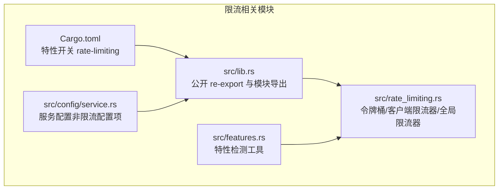
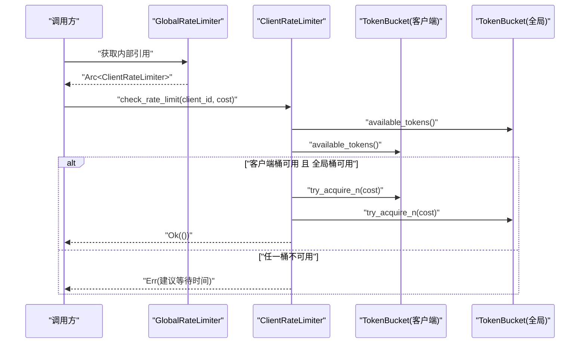
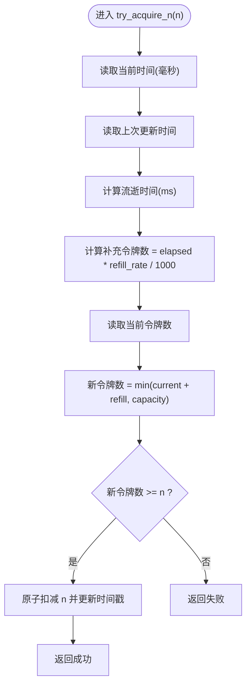
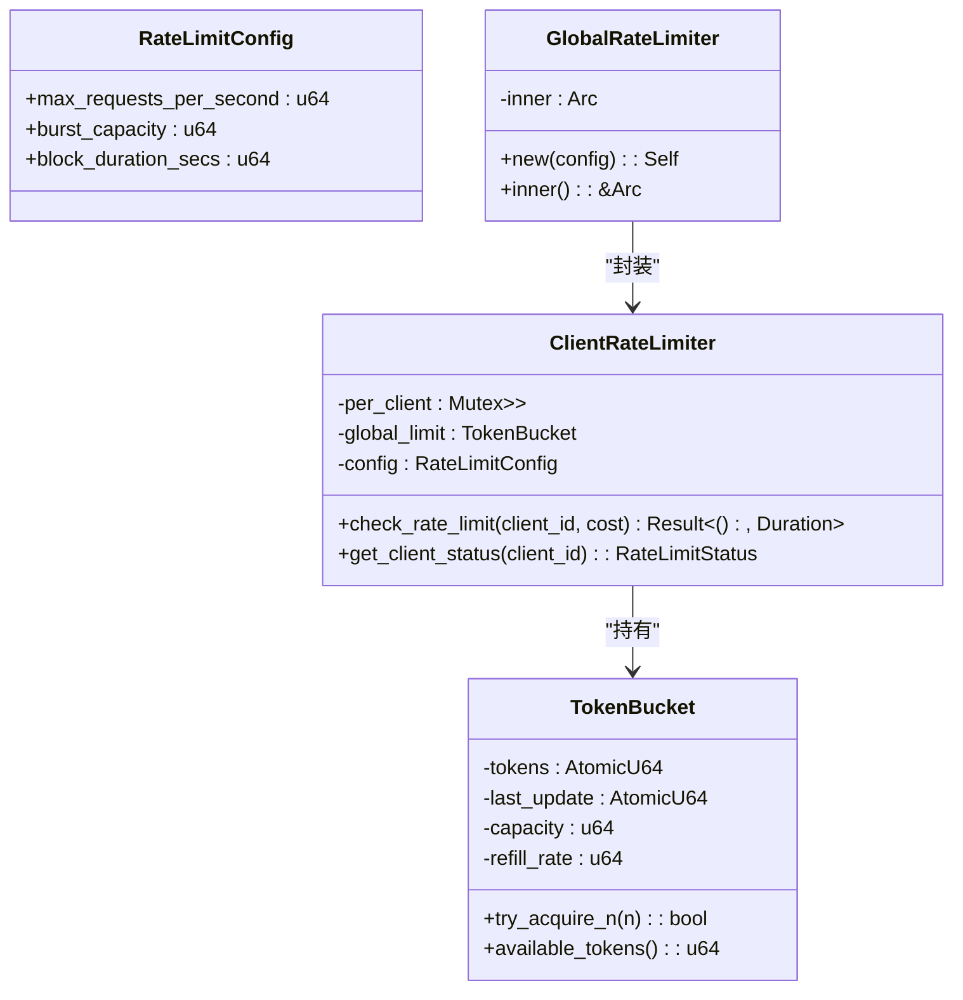
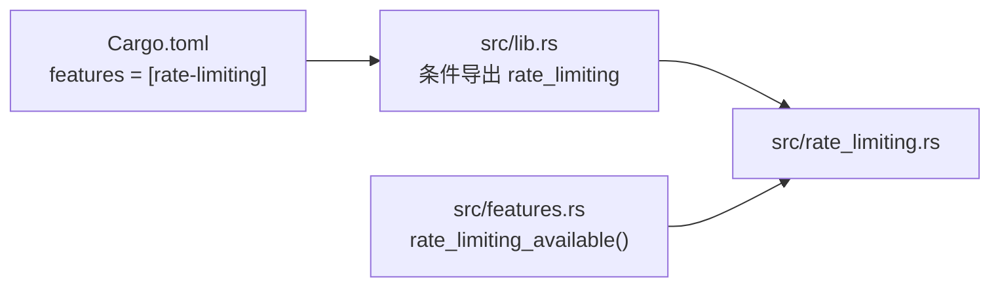

# 限流保护

<cite>
**本文档引用的文件**
- [src/rate_limiting.rs](file://src/rate_limiting.rs)
- [Cargo.toml](file://Cargo.toml)
- [src/lib.rs](file://src/lib.rs)
- [src/features.rs](file://src/features.rs)
- [src/config/service.rs](file://src/config/service.rs)
</cite>

## 目录
1. [简介](#简介)
2. [项目结构](#项目结构)
3. [核心组件](#核心组件)
4. [架构总览](#架构总览)
5. [详细组件分析](#详细组件分析)
6. [依赖关系分析](#依赖关系分析)
7. [性能考量](#性能考量)
8. [故障排查指南](#故障排查指南)
9. [结论](#结论)
10. [附录](#附录)

## 简介
本章节概述 Oxcache 的限流保护机制，重点覆盖以下方面：
- 限流目标：防止缓存滥用与拒绝服务攻击，保障系统稳定运行
- 限流范围：请求速率限制、并发连接控制、资源使用限制
- 算法基础：基于令牌桶的速率限制，支持突发流量
- 配置维度：按 IP、按用户、按 API 端点的限流策略设计思路
- 监控统计：当前速率、峰值速率、超限次数的跟踪方法
- 最佳实践：结合业务场景设置阈值与参数
- 实战部署：策略落地与故障处理方案

## 项目结构
限流模块位于独立源文件中，通过特性开关控制启用/禁用；对外提供统一接口，便于在缓存链路中集成。

**图表来源**
- [src/rate_limiting.rs](file://src/rate_limiting.rs#L1-L415)
- [src/features.rs](file://src/features.rs#L1-L213)
- [src/lib.rs](file://src/lib.rs#L460-L465)
- [src/config/service.rs](file://src/config/service.rs#L1-L682)
- [Cargo.toml](file://Cargo.toml#L235-L288)

**章节来源**
- [src/rate_limiting.rs](file://src/rate_limiting.rs#L1-L415)
- [src/lib.rs](file://src/lib.rs#L460-L465)
- [Cargo.toml](file://Cargo.toml#L235-L288)

## 核心组件
- 速率限制配置（RateLimitConfig）
  - 关键参数：每秒最大请求数、突发容量、封锁时间（秒）
  - 默认值：每秒 1000 请求，突发 2000，封锁 10 秒
- 令牌桶（TokenBucket）
  - 原子计数与上次更新时间，支持按毫秒粒度补充令牌
  - 提供获取单个/多个令牌与查询可用令牌数的能力
- 客户端级限流器（ClientRateLimiter）
  - 为每个客户端维护独立的令牌桶，同时受全局令牌桶约束
  - 提供检查请求许可与查询状态的方法
- 全局限流器（GlobalRateLimiter）
  - 单例封装，提供内部引用以供外部使用

上述组件均通过特性开关控制启用/禁用，未启用时提供“空实现”，保证零开销。

**章节来源**
- [src/rate_limiting.rs](file://src/rate_limiting.rs#L17-L38)
- [src/rate_limiting.rs](file://src/rate_limiting.rs#L44-L121)
- [src/rate_limiting.rs](file://src/rate_limiting.rs#L128-L213)
- [src/rate_limiting.rs](file://src/rate_limiting.rs#L230-L252)

## 架构总览
限流在运行时对每个请求进行评估，优先检查客户端桶，再检查全局桶，两者均满足才放行；否则返回建议的等待时间。

**图表来源**
- [src/rate_limiting.rs](file://src/rate_limiting.rs#L156-L190)

## 详细组件分析

### 令牌桶算法实现
- 补充逻辑：基于当前时间与上次更新时间差，按每秒补充速率计算新增令牌数
- 消耗逻辑：若可用令牌数大于等于消耗数，则原子性扣减并更新时间戳
- 可用令牌数：实时计算，避免重复刷新导致的误差累积

**图表来源**
- [src/rate_limiting.rs](file://src/rate_limiting.rs#L92-L109)

**章节来源**
- [src/rate_limiting.rs](file://src/rate_limiting.rs#L66-L79)
- [src/rate_limiting.rs](file://src/rate_limiting.rs#L92-L120)

### 客户端级限流器
- 客户端桶：按 client_id 维度独立管理，首次访问自动创建
- 全局桶：所有客户端共享，用于整体流量控制
- 检查流程：先比较客户端桶，再比较全局桶，均满足则扣减并放行
- 状态查询：返回客户端与全局可用令牌数及容量

**图表来源**
- [src/rate_limiting.rs](file://src/rate_limiting.rs#L17-L38)
- [src/rate_limiting.rs](file://src/rate_limiting.rs#L44-L121)
- [src/rate_limiting.rs](file://src/rate_limiting.rs#L128-L213)
- [src/rate_limiting.rs](file://src/rate_limiting.rs#L230-L252)

**章节来源**
- [src/rate_limiting.rs](file://src/rate_limiting.rs#L128-L213)

### 全局限流器单例
- 提供构造与内部引用方法，便于在应用生命周期内复用
- 默认配置来源于 RateLimitConfig 的默认实现

**章节来源**
- [src/rate_limiting.rs](file://src/rate_limiting.rs#L230-L252)

### 空实现与特性开关
- 当未启用 rate-limiting 特性时，所有限流相关类型与方法均为“空实现”，返回允许或默认状态
- 通过特性开关与条件编译，确保启用时具备完整功能，禁用时零开销

**章节来源**
- [src/rate_limiting.rs](file://src/rate_limiting.rs#L258-L348)

## 依赖关系分析
- 特性开关
  - 限流功能通过特性开关启用，可在 Cargo.toml 中配置
  - 默认特性集包含限流功能
- 模块导出
  - 在库入口处按特性条件导出限流模块
- 特性检测
  - 提供统一的特性检测工具，可用于运行时判断限流可用性

**图表来源**
- [Cargo.toml](file://Cargo.toml#L266-L267)
- [src/lib.rs](file://src/lib.rs#L462-L464)
- [src/features.rs](file://src/features.rs#L45-L49)

**章节来源**
- [Cargo.toml](file://Cargo.toml#L235-L288)
- [src/lib.rs](file://src/lib.rs#L462-L464)
- [src/features.rs](file://src/features.rs#L45-L49)

## 性能考量
- 原子操作与最小锁竞争
  - 令牌桶使用原子计数与时间戳，减少锁竞争
  - 客户端桶采用互斥容器，按需创建，避免全局锁
- 时间回退处理
  - 对系统时间回退进行容错，记录警告日志并按基准时间处理
- 计算复杂度
  - 令牌补充与可用令牌查询均为 O(1)，适合高并发场景
- 内存占用
  - 每个客户端维护独立桶，长期运行可能产生哈希表增长，建议结合业务做清理策略（可扩展）

[本节为通用性能讨论，无需特定文件引用]

## 故障排查指南
- 系统时间异常
  - 现象：限流器行为异常或令牌补充过快
  - 处理：关注告警日志，修正系统时间；必要时重启进程以重置时间基线
- 令牌桶枯竭
  - 现象：频繁返回等待时间或直接拒绝
  - 处理：增大突发容量或降低峰值请求速率；检查上游流量模式
- 全局桶受限
  - 现象：即使单客户端未达上限，整体仍被限制
  - 处理：评估全局配额与业务总量，适当提高全局速率或拆分业务域
- 特性未启用
  - 现象：限流相关 API 不生效
  - 处理：确认特性开关已启用；检查构建配置与运行环境

**章节来源**
- [src/rate_limiting.rs](file://src/rate_limiting.rs#L66-L79)
- [src/rate_limiting.rs](file://src/rate_limiting.rs#L172-L184)

## 结论
Oxcache 的限流保护以令牌桶为核心，提供客户端级与全局级双重约束，既保证了细粒度控制，又兼顾整体稳定性。通过特性开关实现零开销降级，适配多种部署场景。结合本文提供的配置与最佳实践，可在不同业务形态下实现稳健的限流策略。

[本节为总结性内容，无需特定文件引用]

## 附录

### 限流算法与经典模型对照
- 令牌桶
  - 优点：支持突发、平滑速率、易于理解
  - 适用：Web 接口、缓存读取等场景
- 漏桶
  - 优点：严格平滑输出、实现简单
  - 适用：需要恒定速率的下游消费
- 固定窗口/滑动窗口
  - 优点：实现直观、边界清晰
  - 适用：计数型指标与周期性统计

[本节为概念性说明，无需特定文件引用]

### 配置维度与策略设计
- 按 IP 限流
  - 使用客户端 ID 为 IP 地址，结合突发容量应对短时高峰
- 按用户限流
  - 使用用户 ID 作为客户端 ID，区分付费/免费用户等级
- 按 API 端点限流
  - 在调用层为不同端点分配独立的客户端桶或全局桶配额
- 并发连接控制
  - 可在应用层引入连接池与并发上限，配合限流共同保护后端
- 资源使用限制
  - 结合内存、CPU、网络带宽监控，动态调整令牌补充速率或桶容量

[本节为设计建议，无需特定文件引用]

### 监控与统计
- 当前速率
  - 通过可用令牌数与补充速率计算瞬时速率
- 峰值速率
  - 历史观察与采样统计，结合外部指标系统记录峰值
- 超限次数
  - 统计返回等待时间的次数，作为限流触发频率指标
- 状态导出
  - 使用状态查询接口导出客户端与全局可用令牌数、容量

**章节来源**
- [src/rate_limiting.rs](file://src/rate_limiting.rs#L192-L213)

### 最佳实践
- 合理设置每秒速率与突发容量
  - 基于历史流量与 SLA 设定，留足突发余量
- 分层限流
  - 先做全局限流，再做客户端限流，避免热点集中
- 示例参考
  - 详见 [限流保护示例](file://examples/src/06_features/example_rate_limiting.rs#L20-L150)，展示了完整的限流保护使用场景。
- 动态调参
  - 根据时段与事件动态调整阈值，结合自动化运维
- 观测先行
  - 建立完善的监控与告警，及时发现异常波动

[本节为通用实践建议，无需特定文件引用]

### 实际部署与故障处理
- 部署策略
  - 在网关或服务入口统一接入限流器，集中管理
  - 对不同租户/业务线划分独立桶或配额
- 故障处理
  - 限流触发时返回明确的重试提示与建议等待时间
  - 对关键路径设置白名单或降级策略，保障核心功能

[本节为通用部署建议，无需特定文件引用]
