# 高级特性

<cite>
**本文档引用的文件**
- [Cargo.toml](file://Cargo.toml)
- [src/smart_strategy.rs](file://src/smart_strategy.rs)
- [src/bloom_filter.rs](file://src/bloom_filter.rs)
- [src/rate_limiting.rs](file://src/rate_limiting.rs)
- [src/recovery/wal.rs](file://src/recovery/wal.rs)
- [src/sync/warmup.rs](file://src/sync/warmup.rs)
- [examples/src/02_advanced/example_batch_write.rs](file://examples/src/02_advanced/example_batch_write.rs)
- [examples/src/02_advanced/example_warmup.rs](file://examples/src/02_advanced/example_warmup.rs)
</cite>

## 目录
1. [简介](#简介)
2. [项目结构](#项目结构)
3. [核心组件](#核心组件)
4. [架构总览](#架构总览)
5. [详细组件分析](#详细组件分析)
6. [依赖关系分析](#依赖关系分析)
7. [性能考量](#性能考量)
8. [故障排查指南](#故障排查指南)
9. [结论](#结论)
10. [附录](#附录)

## 简介
本章节面向希望深入掌握 Oxcache 高级能力的工程师与架构师，系统讲解以下增强特性：
- 智能策略：基于命中率的自动预取与启发式可压缩性检测
- 布隆过滤器：防止缓存穿透的高效概率型数据结构
- 限流保护：令牌桶算法实现的速率限制，抵御 DoS 与资源滥用
- 缓存预热：应用启动与重建时的热点数据加载机制
- 批量写入优化：并发与批处理策略，显著提升吞吐
- WAL（写前日志）恢复：持久化日志与事务性重放，保障一致性

同时给出各特性的启用方式、配置要点、最佳实践与常见问题排查建议。

## 项目结构
Oxcache 采用模块化设计，高级特性以独立模块存在，并通过特性开关按需编译启用。关键模块如下：
- 智能策略：src/smart_strategy.rs
- 布隆过滤器：src/bloom_filter.rs
- 限流保护：src/rate_limiting.rs
- 预热机制：src/sync/warmup.rs
- WAL 恢复：src/recovery/wal.rs
- 批量写入示例：examples/src/02_advanced/example_batch_write.rs
- 预热示例：examples/src/02_advanced/example_warmup.rs
- 特性开关：Cargo.toml 中的 features 定义

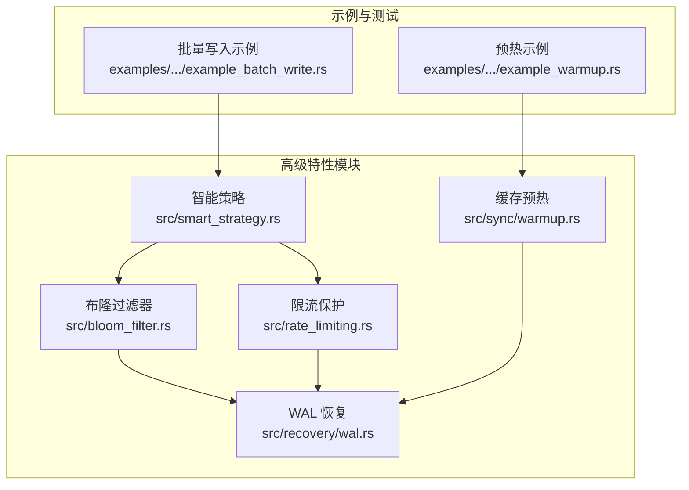

**图表来源**
- [src/smart_strategy.rs](file://src/smart_strategy.rs#L1-L556)
- [src/bloom_filter.rs](file://src/bloom_filter.rs#L1-L728)
- [src/rate_limiting.rs](file://src/rate_limiting.rs#L1-L415)
- [src/sync/warmup.rs](file://src/sync/warmup.rs#L1-L56)
- [src/recovery/wal.rs](file://src/recovery/wal.rs#L1-L512)
- [examples/src/02_advanced/example_batch_write.rs](file://examples/src/02_advanced/example_batch_write.rs#L1-L154)
- [examples/src/02_advanced/example_warmup.rs](file://examples/src/02_advanced/example_warmup.rs#L1-L151)

**章节来源**
- [Cargo.toml](file://Cargo.toml#L235-L347)

## 核心组件
- 智能策略管理器：负责命中率统计、预取决策与压缩决策，支持动态配置更新
- 布隆过滤器：概率型结构，用于快速判断键是否存在，降低缓存穿透风险
- 令牌桶限流器：支持客户端粒度与全局粒度的速率控制，具备突发承载能力
- 预热管理器：定义预热数据源与并发控制，支持状态跟踪
- WAL 管理器：持久化写操作，支持批量写入与事务性重放

**章节来源**
- [src/smart_strategy.rs](file://src/smart_strategy.rs#L355-L421)
- [src/bloom_filter.rs](file://src/bloom_filter.rs#L68-L326)
- [src/rate_limiting.rs](file://src/rate_limiting.rs#L123-L213)
- [src/sync/warmup.rs](file://src/sync/warmup.rs#L38-L56)
- [src/recovery/wal.rs](file://src/recovery/wal.rs#L59-L172)

## 架构总览
下图展示高级特性在系统中的交互关系与数据流向：

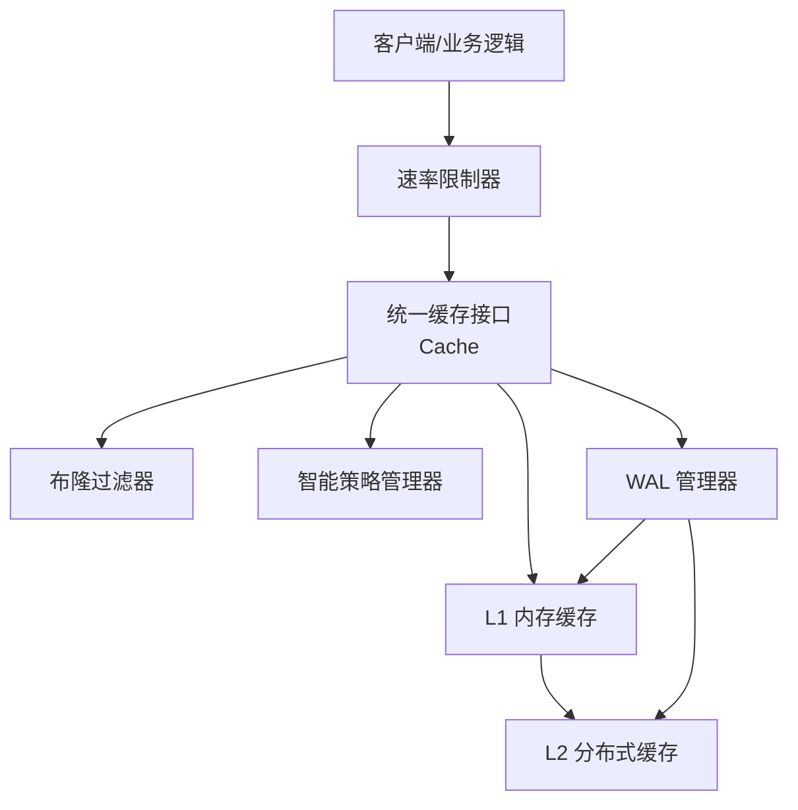

**图表来源**
- [src/bloom_filter.rs](file://src/bloom_filter.rs#L363-L415)
- [src/rate_limiting.rs](file://src/rate_limiting.rs#L123-L213)
- [src/smart_strategy.rs](file://src/smart_strategy.rs#L355-L421)
- [src/recovery/wal.rs](file://src/recovery/wal.rs#L59-L172)

## 详细组件分析

### 智能策略（Smart Strategy）
智能策略通过命中率统计驱动预取，通过可压缩性检查驱动压缩，从而在不同访问模式下自适应优化缓存行为。

- 命中率收集器：维护总命中/未命中与滑动窗口内的命中/未命中，计算总体命中率与近期命中率
- 预取决策器：当近期命中率低于阈值且满足最小预取间隔时触发预取
- 压缩决策器：对大体积数据进行采样熵分析，估算压缩率并决定是否压缩
- 管理器：统一协调预取与压缩决策，支持运行时配置更新

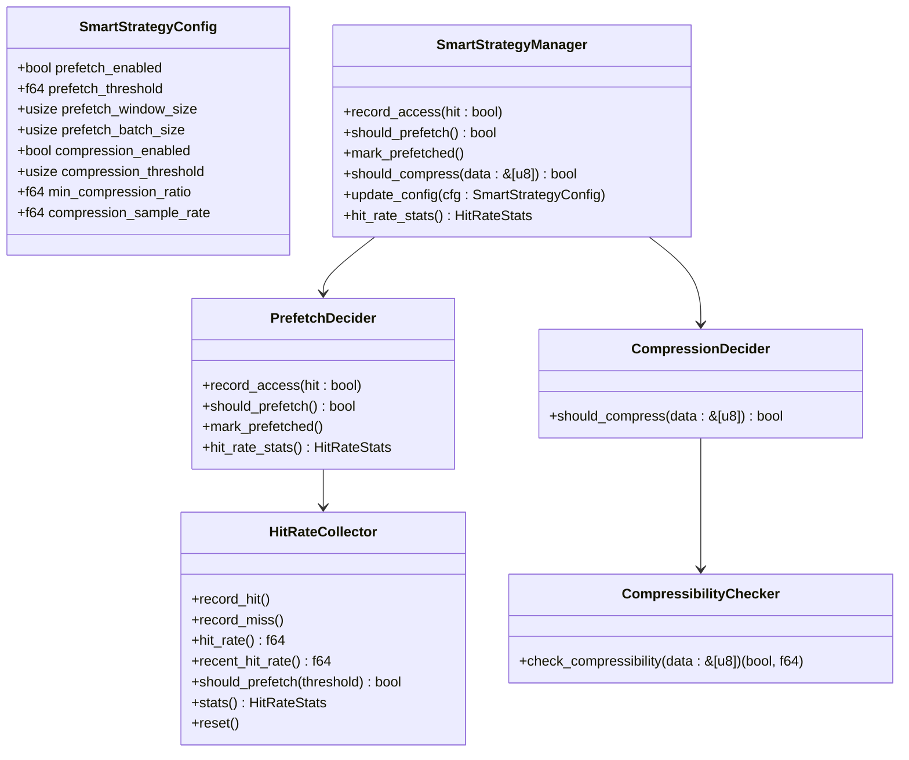

**图表来源**
- [src/smart_strategy.rs](file://src/smart_strategy.rs#L13-L47)
- [src/smart_strategy.rs](file://src/smart_strategy.rs#L49-L143)
- [src/smart_strategy.rs](file://src/smart_strategy.rs#L241-L315)
- [src/smart_strategy.rs](file://src/smart_strategy.rs#L317-L353)
- [src/smart_strategy.rs](file://src/smart_strategy.rs#L355-L421)

工作流程（预取触发）：
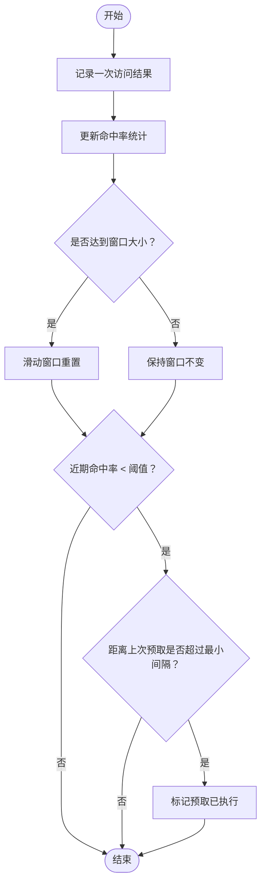

**图表来源**
- [src/smart_strategy.rs](file://src/smart_strategy.rs#L261-L315)

启用与配置要点
- 特性开关：smart-strategy（依赖 compression、metrics、moka）
- 关键参数：预取阈值、窗口大小、批量大小、压缩阈值、采样率
- 动态更新：通过管理器的 update_config 实时生效

**章节来源**
- [src/smart_strategy.rs](file://src/smart_strategy.rs#L13-L47)
- [src/smart_strategy.rs](file://src/smart_strategy.rs#L261-L315)
- [src/smart_strategy.rs](file://src/smart_strategy.rs#L398-L421)

### 布隆过滤器（Bloom Filter）
布隆过滤器以极低空间代价快速判断键是否可能存在，有效防止缓存穿透导致的后端压力。

- 核心结构：位数组 + 多个哈希种子；提供 contains/add/add_checked/contains_and_add 等操作
- 统计指标：添加/检查次数、误判次数、位利用率、误判率、配置误判率
- 线程安全：通过 Arc + RwLock 包装，支持并发读写
- 管理器：支持多实例命名管理、统计聚合、LRU 缓存哈希位置避免重复计算

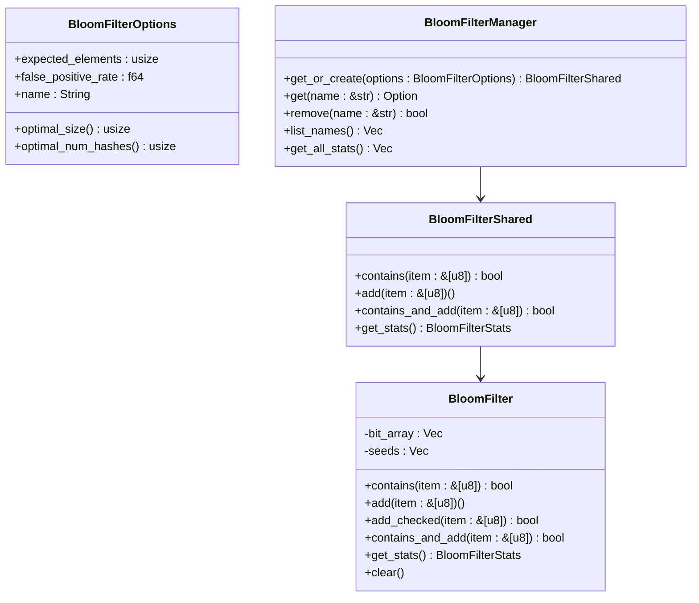

**图表来源**
- [src/bloom_filter.rs](file://src/bloom_filter.rs#L22-L61)
- [src/bloom_filter.rs](file://src/bloom_filter.rs#L68-L326)
- [src/bloom_filter.rs](file://src/bloom_filter.rs#L363-L498)

典型使用流程（防穿透）：
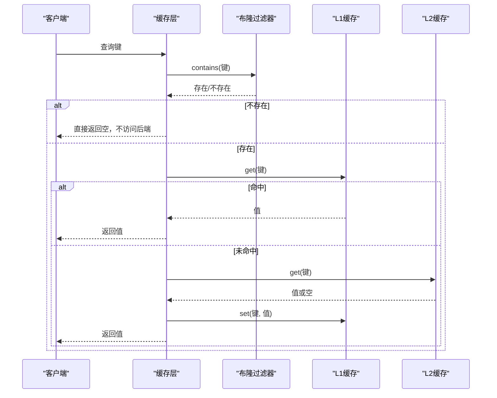

**图表来源**
- [src/bloom_filter.rs](file://src/bloom_filter.rs#L119-L163)
- [src/bloom_filter.rs](file://src/bloom_filter.rs#L186-L254)

启用与配置要点
- 特性开关：bloom-filter（依赖 bloomfilter、murmur3）
- 关键参数：期望元素数、目标误判率、名称
- 最优尺寸与哈希数由公式自动计算，位数组按字节对齐

**章节来源**
- [src/bloom_filter.rs](file://src/bloom_filter.rs#L22-L61)
- [src/bloom_filter.rs](file://src/bloom_filter.rs#L119-L163)
- [src/bloom_filter.rs](file://src/bloom_filter.rs#L260-L300)

### 限流保护（Rate Limiting）
令牌桶算法实现的速率限制，支持客户端粒度与全局粒度，兼顾突发与长期速率控制。

- 令牌桶：容量与补充速率可配置，支持 try_acquire_n
- 客户端限流器：为每个 client_id 维护独立桶，同时受全局桶约束
- 全局限流器：单例封装，提供统一检查与状态查询

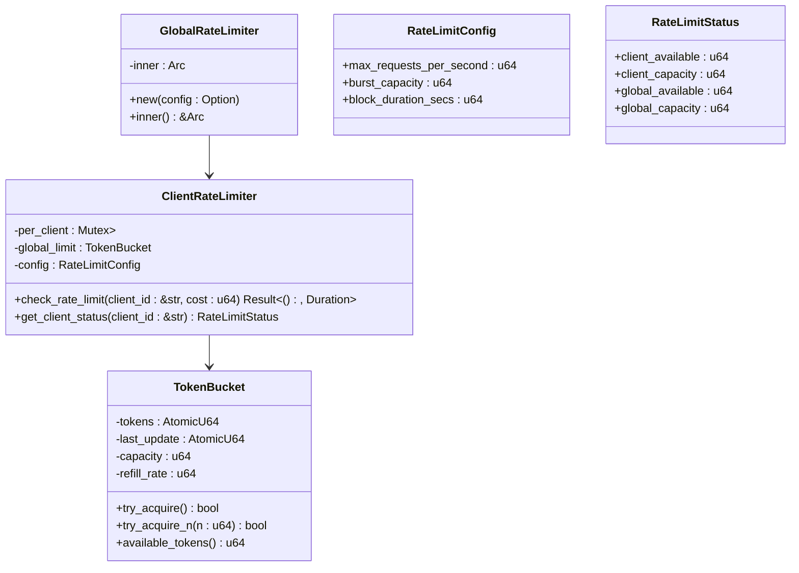

**图表来源**
- [src/rate_limiting.rs](file://src/rate_limiting.rs#L40-L121)
- [src/rate_limiting.rs](file://src/rate_limiting.rs#L123-L213)
- [src/rate_limiting.rs](file://src/rate_limiting.rs#L229-L252)
- [src/rate_limiting.rs](file://src/rate_limiting.rs#L17-L38)

典型调用序列：
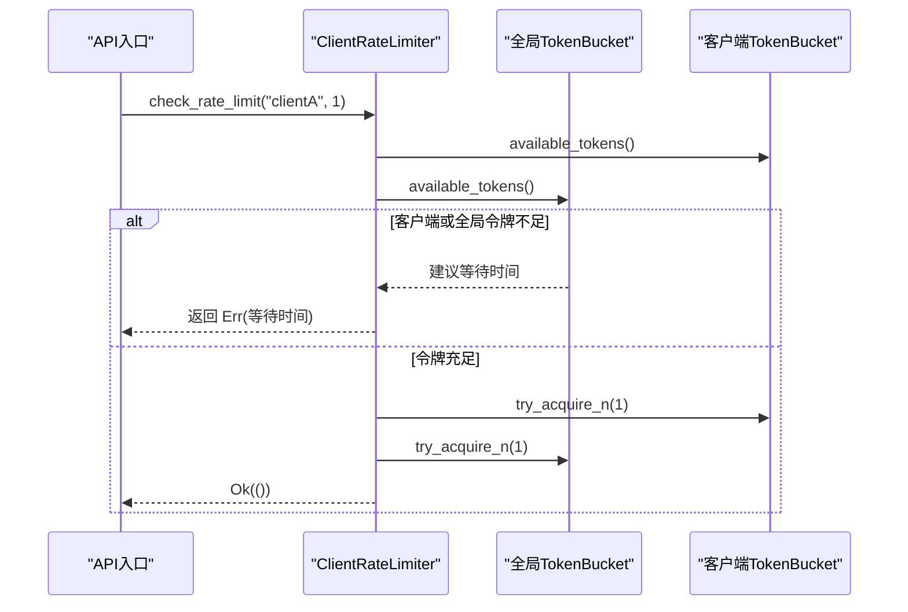

**图表来源**
- [src/rate_limiting.rs](file://src/rate_limiting.rs#L156-L190)

启用与配置要点
- 特性开关：rate-limiting
- 关键参数：每秒请求数、突发容量、封锁时长
- 建议：结合业务峰值与 SLA 设置，对高价值接口单独配置更严格的限制

**章节来源**
- [src/rate_limiting.rs](file://src/rate_limiting.rs#L17-L38)
- [src/rate_limiting.rs](file://src/rate_limiting.rs#L156-L190)

### 缓存预热（Cache Warmup）
在应用启动或缓存重建时，提前加载热点数据，降低冷启动延迟与首屏压力。

- 预热数据源：名称 + 异步加载函数（Future）
- 预热配置：启用开关、超时、并发上限、数据源列表
- 状态跟踪：状态、进度、总数、错误信息

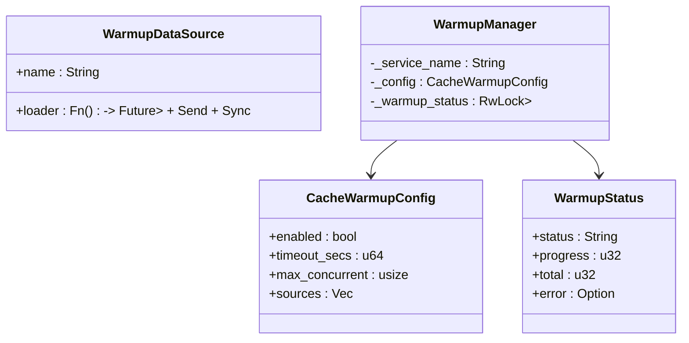

**图表来源**
- [src/sync/warmup.rs](file://src/sync/warmup.rs#L14-L36)
- [src/sync/warmup.rs](file://src/sync/warmup.rs#L38-L56)

使用场景与流程：
- 应用启动：加载配置、热点用户、热门商品等
- 故障恢复：清空缓存后并发重建
- 示例参考：examples/src/02_advanced/example_warmup.rs

**章节来源**
- [src/sync/warmup.rs](file://src/sync/warmup.rs#L14-L36)
- [src/sync/warmup.rs](file://src/sync/warmup.rs#L38-L56)
- [examples/src/02_advanced/example_warmup.rs](file://examples/src/02_advanced/example_warmup.rs#L29-L151)

### 批量写入优化（Batch Write）
通过并发与批处理减少锁竞争与系统调用开销，显著提升写入吞吐。

- 并发写入：多任务并行 set/delete，汇总等待
- 批处理：后台定时/批量刷新，事务性写入数据库（WAL 场景）
- 示例参考：examples/src/02_advanced/example_batch_write.rs

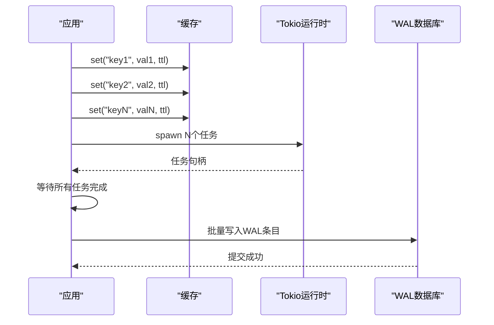

**图表来源**
- [examples/src/02_advanced/example_batch_write.rs](file://examples/src/02_advanced/example_batch_write.rs#L75-L95)
- [src/recovery/wal.rs](file://src/recovery/wal.rs#L277-L372)

**章节来源**
- [examples/src/02_advanced/example_batch_write.rs](file://examples/src/02_advanced/example_batch_write.rs#L75-L95)
- [src/recovery/wal.rs](file://src/recovery/wal.rs#L277-L372)

### WAL（写前日志）恢复（Write-Ahead Log）
WAL 通过持久化写操作，确保在异常情况下可重放恢复，保障数据一致性。

- WAL 条目：时间戳、操作类型（SET/DELETE）、键、值、TTL
- WAL 管理器：后台批量写入、定期刷新、事务性提交、重放接口
- 可重放后端：实现 WalReplayableBackend trait，支持 pipeline_replay

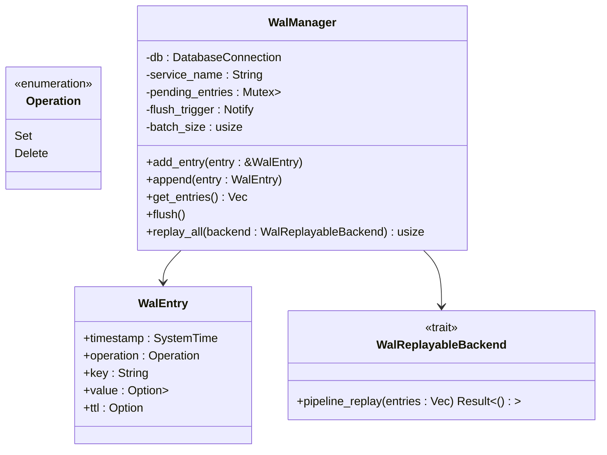

**图表来源**
- [src/recovery/wal.rs](file://src/recovery/wal.rs#L41-L65)
- [src/recovery/wal.rs](file://src/recovery/wal.rs#L59-L172)
- [src/recovery/wal.rs](file://src/recovery/wal.rs#L378-L430)

重放流程（事务性）：
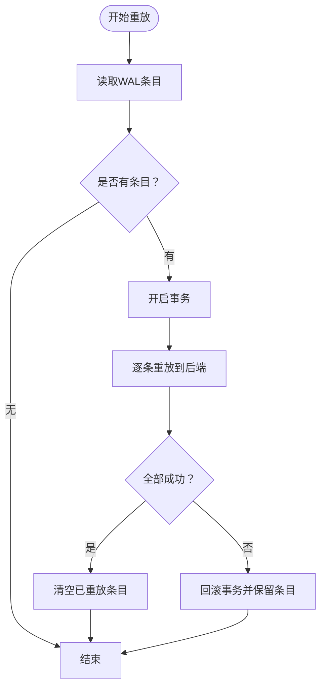

**图表来源**
- [src/recovery/wal.rs](file://src/recovery/wal.rs#L378-L430)

**章节来源**
- [src/recovery/wal.rs](file://src/recovery/wal.rs#L41-L65)
- [src/recovery/wal.rs](file://src/recovery/wal.rs#L174-L172)
- [src/recovery/wal.rs](file://src/recovery/wal.rs#L378-L430)

## 依赖关系分析
- 特性开关与依赖映射：通过 Cargo.toml 的 features 字段控制编译启用
- 智能策略依赖：compression、metrics、moka
- 布隆过滤器依赖：bloomfilter、murmur3
- 限流保护：无外部依赖，纯算法实现
- 预热：始终可用（sync 模块）
- WAL：依赖数据库（SeaORM/SQLite），用于持久化

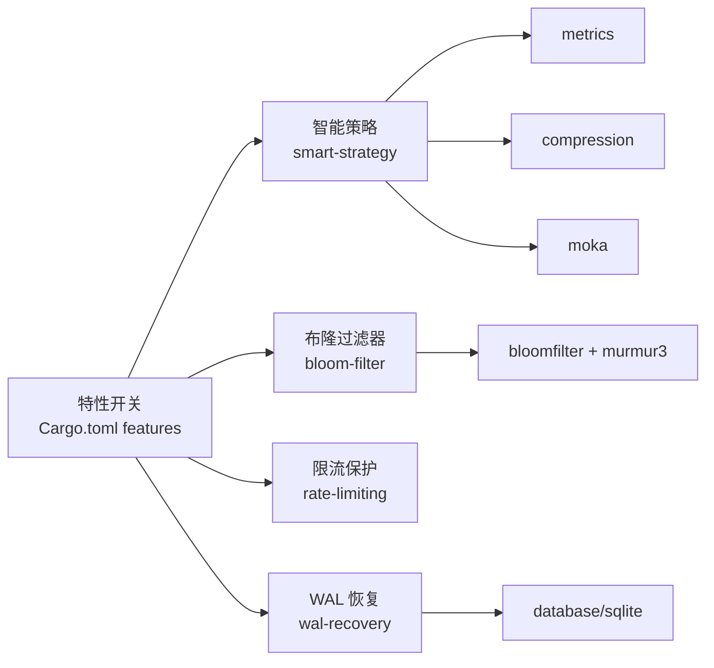

**图表来源**
- [Cargo.toml](file://Cargo.toml#L235-L347)

**章节来源**
- [Cargo.toml](file://Cargo.toml#L235-L347)

## 性能考量
- 智能策略
  - 命中率窗口大小影响预取触发的灵敏度，窗口越大越平滑但响应越慢
  - 预取批量大小与最小间隔避免过度预取造成抖动
  - 压缩仅对大对象有意义，小对象压缩收益低且增加 CPU 开销
- 布隆过滤器
  - 误判率越低，位数组越大；根据预期元素数与误判率自动计算最优尺寸
  - 哈希缓存避免重复计算位置，控制缓存大小防止内存膨胀
- 限流保护
  - 突发容量应覆盖短时峰值；长期速率决定系统承载上限
  - 对不同接口设置差异化限额，避免“一刀切”
- 预热
  - 并发数与超时需平衡吞吐与稳定性；热点数据优先加载
- 批量写入
  - 合理批量大小与后台刷新间隔，减少事务开销
- WAL
  - 批量写入与事务提交提升吞吐；重放失败保留条目，确保最终一致

[本节为通用指导，无需特定文件引用]

## 故障排查指南
- 布隆过滤器误判率过高
  - 检查期望元素数与误判率配置，重新计算最优尺寸
  - 关注哈希缓存清理策略，避免内存泄漏
- 限流频繁触发
  - 检查客户端与全局桶容量、补充速率是否合理
  - 对突发流量接口适当提高突发容量
- 预热失败或超时
  - 检查数据源加载函数是否阻塞；调整并发数与超时
- WAL 写入失败
  - 查看事务提交日志，确认数据库连接与权限
  - 重放失败时保留条目，排查后端实现 pipeline_replay
- 智能策略效果不明显
  - 调整命中率窗口与阈值；观察命中率统计变化趋势

**章节来源**
- [src/bloom_filter.rs](file://src/bloom_filter.rs#L260-L300)
- [src/rate_limiting.rs](file://src/rate_limiting.rs#L156-L190)
- [src/recovery/wal.rs](file://src/recovery/wal.rs#L378-L430)
- [src/sync/warmup.rs](file://src/sync/warmup.rs#L38-L56)

## 结论
Oxcache 的高级特性通过模块化设计与特性开关实现按需启用，既保证了默认性能，又提供了强大的扩展能力。智能策略让缓存自适应访问模式，布隆过滤器有效降低穿透风险，限流保护抵御滥用与攻击，预热与批量写入优化启动与写入体验，WAL 恢复则确保在异常情况下的数据一致性。结合合理的配置与监控，可在生产环境中获得稳定、高性能的缓存体验。

[本节为总结性内容，无需特定文件引用]

## 附录

### 启用方法与最佳实践
- 启用特性
  - 在 Cargo.toml 中选择合适的 features 或使用 full/minimal/core
  - 智能策略：smart-strategy
  - 布隆过滤器：bloom-filter
  - 限流保护：rate-limiting
  - 预热：始终可用（sync）
  - WAL：wal-recovery
- 最佳实践
  - 先在测试环境验证参数，再逐步上线
  - 结合监控指标（命中率、误判率、限流拒绝数、WAL 重放耗时）持续优化
  - 对高价值接口单独限流与预热策略
  - 定期评估智能策略阈值与压缩策略，避免过度优化

**章节来源**
- [Cargo.toml](file://Cargo.toml#L235-L347)
- [src/smart_strategy.rs](file://src/smart_strategy.rs#L398-L421)
- [src/bloom_filter.rs](file://src/bloom_filter.rs#L22-L61)
- [src/rate_limiting.rs](file://src/rate_limiting.rs#L17-L38)
- [src/recovery/wal.rs](file://src/recovery/wal.rs#L69-L172)
