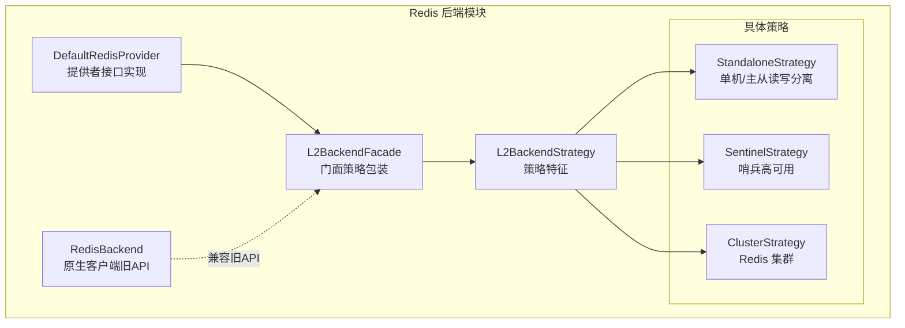
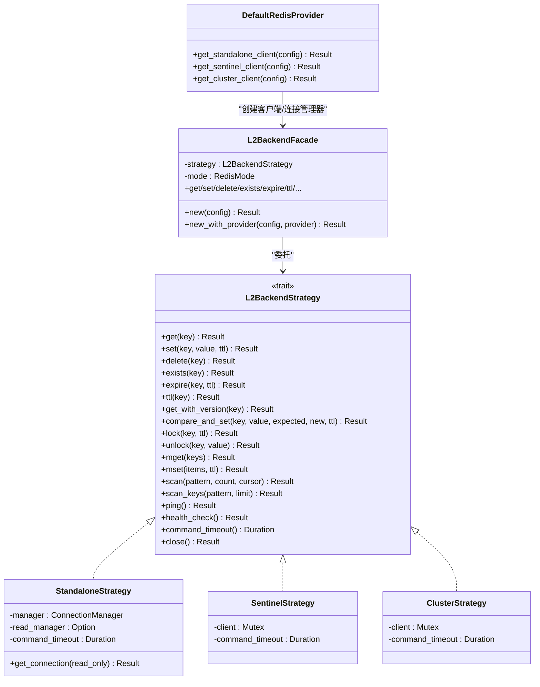
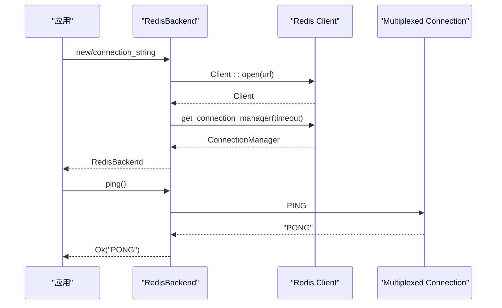
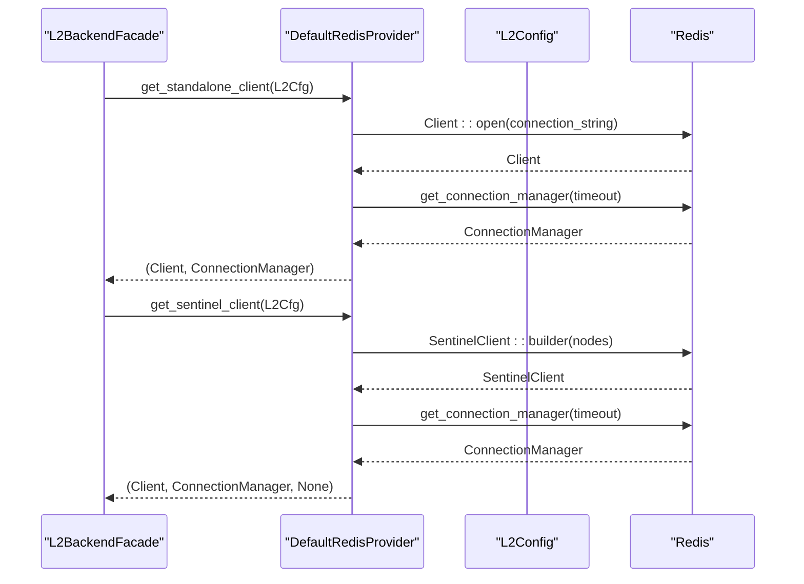
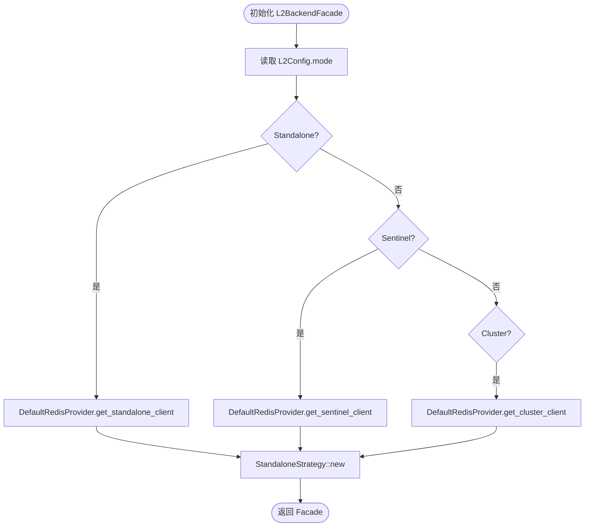
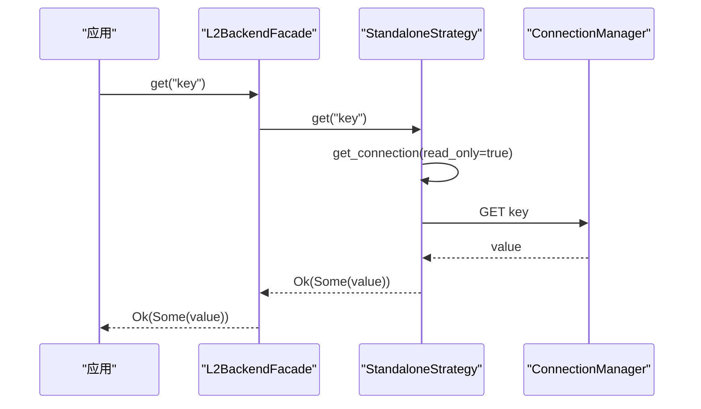
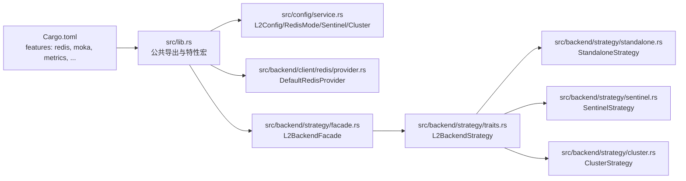

# Redis 后端实现

<cite>
**本文档引用的文件**
- [src/backend/client/redis/mod.rs](file://src/backend/client/redis/mod.rs)
- [src/backend/client/redis/client.rs](file://src/backend/client/redis/client.rs)
- [src/backend/client/redis/provider.rs](file://src/backend/client/redis/provider.rs)
- [src/backend/strategy/mod.rs](file://src/backend/strategy/mod.rs)
- [src/backend/strategy/traits.rs](file://src/backend/strategy/traits.rs)
- [src/backend/strategy/standalone.rs](file://src/backend/strategy/standalone.rs)
- [src/backend/strategy/sentinel.rs](file://src/backend/strategy/sentinel.rs)
- [src/backend/strategy/cluster.rs](file://src/backend/strategy/cluster.rs)
- [src/backend/strategy/facade.rs](file://src/backend/strategy/facade.rs)
- [src/config/service.rs](file://src/config/service.rs)
- [src/lib.rs](file://src/lib.rs)
- [Cargo.toml](file://Cargo.toml)
- [examples/src/redis_native.rs](file://examples/src/redis_native.rs)
- [tests/integration/redis_test.rs](file://tests/integration/redis_test.rs)
</cite>

## 目录
1. [简介](#简介)
2. [项目结构](#项目结构)
3. [核心组件](#核心组件)
4. [架构总览](#架构总览)
5. [详细组件分析](#详细组件分析)
6. [依赖关系分析](#依赖关系分析)
7. [性能考虑](#性能考虑)
8. [故障处理指南](#故障处理指南)
9. [结论](#结论)
10. [附录](#附录)

## 简介
本文件系统性阐述 Oxcache 的 Redis 后端实现架构与配置方法，重点覆盖以下方面：
- Redis 客户端连接管理与连接池配置
- 超时设置与协议选择
- 支持的部署模式（单机、主从读写分离、哨兵、集群）
- 故障处理机制（连接重连、命令重试、降级策略）
- 性能优化建议与监控方法
- Redis 配置最佳实践与常见问题解决方案

## 项目结构
Oxcache 的 Redis 后端采用“策略模式 + 提供者接口”的架构设计，将不同部署模式的差异封装在独立策略中，并通过统一的门面对外暴露一致的 API。

**图表来源**
- [src/backend/client/redis/mod.rs](file://src/backend/client/redis/mod.rs#L1-L15)
- [src/backend/strategy/mod.rs](file://src/backend/strategy/mod.rs#L1-L24)
- [src/backend/strategy/facade.rs](file://src/backend/strategy/facade.rs#L1-L223)
- [src/backend/client/redis/client.rs](file://src/backend/client/redis/client.rs#L1-L522)

**章节来源**
- [src/backend/client/redis/mod.rs](file://src/backend/client/redis/mod.rs#L1-L15)
- [src/backend/strategy/mod.rs](file://src/backend/strategy/mod.rs#L1-L24)

## 核心组件
- RedisBackend（原生客户端）：面向旧 API 的 Redis 客户端，支持连接字符串、TLS、连接池（预留）、超时控制与基础管理命令。
- DefaultRedisProvider：提供者接口的默认实现，负责按部署模式构造 Redis 客户端与连接管理器。
- L2BackendFacade：门面类，根据配置选择具体策略（单机、哨兵、集群），并统一暴露 L2BackendStrategy 接口。
- L2BackendStrategy：策略特征，定义统一的缓存操作、版本化操作、锁操作、批量操作、SCAN 操作、健康检查与超时配置。
- 具体策略：StandaloneStrategy（单机/主从读写分离）、SentinelStrategy（哨兵高可用）、ClusterStrategy（Redis 集群）。

**章节来源**
- [src/backend/client/redis/client.rs](file://src/backend/client/redis/client.rs#L66-L132)
- [src/backend/client/redis/provider.rs](file://src/backend/client/redis/provider.rs#L21-L31)
- [src/backend/strategy/facade.rs](file://src/backend/strategy/facade.rs#L18-L38)
- [src/backend/strategy/traits.rs](file://src/backend/strategy/traits.rs#L85-L303)

## 架构总览
Redis 后端的整体架构围绕“提供者 + 门面 + 策略”展开，既保证了对不同部署模式的无缝适配，又提供了统一的对外接口。

**图表来源**
- [src/backend/client/redis/provider.rs](file://src/backend/client/redis/provider.rs#L21-L31)
- [src/backend/strategy/facade.rs](file://src/backend/strategy/facade.rs#L40-L98)
- [src/backend/strategy/traits.rs](file://src/backend/strategy/traits.rs#L85-L303)
- [src/backend/strategy/standalone.rs](file://src/backend/strategy/standalone.rs#L21-L70)
- [src/backend/strategy/sentinel.rs](file://src/backend/strategy/sentinel.rs#L21-L56)
- [src/backend/strategy/cluster.rs](file://src/backend/strategy/cluster.rs#L21-L56)

## 详细组件分析

### RedisBackend（原生客户端）
- 功能定位：面向旧 API 的 Redis 客户端，提供连接字符串解析、TLS 强制、快速连接验证、基础管理命令（PING、INFO、SCAN+DEL 清理）。
- 连接管理：使用 multiplexed 连接，支持连接池预留字段；连接建立与超时控制在构建阶段完成。
- 超时与安全：提供连接超时与命令超时的配置入口；键与扫描模式均进行安全校验，防止注入风险。
- 错误分类：区分连接错误与操作错误，便于上层进行重试与降级。

**图表来源**
- [src/backend/client/redis/client.rs](file://src/backend/client/redis/client.rs#L162-L213)
- [src/backend/client/redis/client.rs](file://src/backend/client/redis/client.rs#L117-L132)

**章节来源**
- [src/backend/client/redis/client.rs](file://src/backend/client/redis/client.rs#L66-L132)
- [src/backend/client/redis/client.rs](file://src/backend/client/redis/client.rs#L162-L213)

### DefaultRedisProvider（提供者接口）
- 单机模式：基于连接字符串创建 Client，并通过 get_connection_manager 获取 ConnectionManager；支持 TLS 自动转换（redis:// → rediss://）。
- 哨兵模式：解析哨兵节点列表，创建 SentinelClient，自动处理主从切换与故障转移；支持独立的主从连接管理器（当前返回 None，保留扩展空间）。
- 集群模式：构建 ClusterClient，启用读从副本（read_from_replicas），并进行连接超时控制。

**图表来源**
- [src/backend/client/redis/provider.rs](file://src/backend/client/redis/provider.rs#L38-L78)
- [src/backend/client/redis/provider.rs](file://src/backend/client/redis/provider.rs#L111-L193)

**章节来源**
- [src/backend/client/redis/provider.rs](file://src/backend/client/redis/provider.rs#L21-L31)
- [src/backend/client/redis/provider.rs](file://src/backend/client/redis/provider.rs#L38-L78)
- [src/backend/client/redis/provider.rs](file://src/backend/client/redis/provider.rs#L111-L193)

### L2BackendFacade（门面）
- 根据 L2Config.mode 选择具体策略：Standalone、Sentinel、Cluster。
- 统一暴露 L2BackendStrategy 接口，屏蔽底层差异；内置版本缓存以优化版本化读取。
- 当前集群模式使用 StandaloneStrategy（完整集群支持待实现）。

**图表来源**
- [src/backend/strategy/facade.rs](file://src/backend/strategy/facade.rs#L48-L98)

**章节来源**
- [src/backend/strategy/facade.rs](file://src/backend/strategy/facade.rs#L40-L98)

### StandaloneStrategy（单机/主从读写分离）
- 支持主库与可选从库连接管理器；读请求优先走从库（若配置）。
- 命令超时来自 L2Config.command_timeout_ms；提供 PING、SCAN、MGET/MSET 等常用操作。
- 版本化与 CAS：通过 Lua 脚本实现；锁使用 SET NX PX 实现。

**图表来源**
- [src/backend/strategy/standalone.rs](file://src/backend/strategy/standalone.rs#L58-L69)
- [src/backend/strategy/standalone.rs](file://src/backend/strategy/standalone.rs#L84-L100)

**章节来源**
- [src/backend/strategy/standalone.rs](file://src/backend/strategy/standalone.rs#L18-L70)
- [src/backend/strategy/standalone.rs](file://src/backend/strategy/standalone.rs#L84-L184)

### SentinelStrategy（哨兵高可用）
- 使用 SentinelClient 管理主从切换与故障转移；自动处理连接与认证。
- 健壮性：连接超时控制、错误分类、Lua 原子脚本保证 CAS 与解锁一致性。
- 读写分离：当前返回 None（保留扩展空间）。

**章节来源**
- [src/backend/strategy/sentinel.rs](file://src/backend/strategy/sentinel.rs#L21-L56)
- [src/backend/strategy/sentinel.rs](file://src/backend/strategy/sentinel.rs#L108-L182)

### ClusterStrategy（Redis 集群）
- 使用 ClusterClient 管理集群拓扑；SCAN 与批量操作需注意键槽位分布（实现中对集群特性做了简化处理）。
- 读从副本：通过 read_from_replicas 启用读扩展。

**章节来源**
- [src/backend/strategy/cluster.rs](file://src/backend/strategy/cluster.rs#L21-L56)
- [src/backend/strategy/cluster.rs](file://src/backend/strategy/cluster.rs#L324-L354)

### L2BackendStrategy（策略特征）
- 统一定义：核心操作（get/set/delete/exists/expire/ttl）、版本化操作（get_with_version/compare_and_set）、锁操作（lock/unlock）、批量操作（mget/mset）、SCAN 迭代器、健康检查与超时配置。
- 迭代器：ScanIterator 提供基于策略的 SCAN 迭代能力。

**章节来源**
- [src/backend/strategy/traits.rs](file://src/backend/strategy/traits.rs#L85-L303)

## 依赖关系分析
- 依赖组件耦合：Facade 依赖 Provider 与具体策略；策略依赖 redis 客户端库；配置模块提供 L2Config。
- 外部依赖：redis 0.27（启用 aio、tokio-comp、cluster-async、sentinel、connection-manager、script 等特性）。
- 特性开关：通过 Cargo.toml 的 features 控制启用/禁用 Redis 相关功能。

**图表来源**
- [Cargo.toml](file://Cargo.toml#L85-L89)
- [src/lib.rs](file://src/lib.rs#L435-L443)
- [src/config/service.rs](file://src/config/service.rs#L363-L491)
- [src/backend/client/redis/provider.rs](file://src/backend/client/redis/provider.rs#L38-L78)
- [src/backend/strategy/facade.rs](file://src/backend/strategy/facade.rs#L48-L98)

**章节来源**
- [Cargo.toml](file://Cargo.toml#L85-L89)
- [src/lib.rs](file://src/lib.rs#L435-L443)

## 性能考虑
- 连接复用：multiplexed 连接与 ConnectionManager 提供连接复用，减少握手开销。
- 读扩展：哨兵/集群模式启用 read_from_replicas，提升读吞吐。
- 批量操作：mget/mset 在单机模式下使用原生命令；集群模式下注意键槽位一致性，必要时回退为循环单键操作。
- 超时设置：合理配置连接超时与命令超时，避免长时间阻塞；结合重试与熔断策略。
- 序列化：通过统一配置模块选择序列化类型（JSON、Bincode、MessagePack、CBOR），平衡性能与兼容性。
- 监控：利用 OpenTelemetry 与指标模块导出缓存命中、未命中、延迟等关键指标。

[本节为通用指导，无需特定文件引用]

## 故障处理指南
- 连接重连：ConnectionManager 与 SentinelClient 内置重连与故障转移；Provider 层对超时进行显式控制。
- 命令重试：对瞬时网络错误进行指数退避重试；区分连接错误与操作错误，避免对幂等性敏感的操作重复执行。
- 降级策略：当 Redis 不可用时，可降级至 L1 内存缓存或直连后端；通过健康检查与熔断器实现自动切换。
- 错误分类：区分连接错误（超时/IO）与操作错误（语法/权限），采取不同处理策略。
- 健康检查：统一通过 ping/health_check 判断后端状态，定期巡检与告警。

**章节来源**
- [src/backend/client/redis/client.rs](file://src/backend/client/redis/client.rs#L501-L504)
- [src/backend/client/redis/provider.rs](file://src/backend/client/redis/provider.rs#L57-L77)
- [src/backend/strategy/traits.rs](file://src/backend/strategy/traits.rs#L12-L21)

## 结论
Oxcache 的 Redis 后端通过“提供者 + 门面 + 策略”的架构，实现了对单机、哨兵与集群等多种部署模式的统一支持。其连接管理、超时控制、错误分类与健康检查机制为生产环境提供了可靠的保障。未来可在集群模式的策略实现与版本化锁的原子性方面进一步完善，以更好地发挥 Redis 集群的特性。

[本节为总结性内容，无需特定文件引用]

## 附录

### Redis 部署模式与配置要点
- 单机模式：适用于小规模、低复杂度场景；支持主从读写分离（从库连接管理器可选）。
- 哨兵模式：提供高可用与自动故障转移；支持独立主从连接管理器（当前返回 None，保留扩展）。
- 集群模式：水平扩展与数据分片；启用 read_from_replicas 提升读性能；注意键槽位一致性。

**章节来源**
- [src/backend/strategy/facade.rs](file://src/backend/strategy/facade.rs#L68-L91)
- [src/backend/client/redis/provider.rs](file://src/backend/client/redis/provider.rs#L80-L109)
- [src/backend/strategy/cluster.rs](file://src/backend/strategy/cluster.rs#L92-L93)

### 连接管理与超时设置
- 连接超时：Provider 层使用超时控制确保连接建立不阻塞；RedisBackend 构建阶段进行快速连接验证。
- 命令超时：各策略通过 L2Config.command_timeout_ms 统一配置；Facade 暴露 command_timeout 供上层使用。
- TLS 强制：生产环境强制使用 rediss://；开发/测试可通过环境变量覆盖（仅限受限场景）。

**章节来源**
- [src/backend/client/redis/provider.rs](file://src/backend/client/redis/provider.rs#L57-L77)
- [src/backend/client/redis/client.rs](file://src/backend/client/redis/client.rs#L167-L179)
- [src/config/service.rs](file://src/config/service.rs#L372-L453)

### 序列化协议选择与优化
- 支持 JSON、Bincode、MessagePack、CBOR；通过统一配置模块选择；在性能与兼容性之间权衡。
- 建议：高频写入场景优先考虑二进制序列化（Bincode/MessagePack/CBOR）；跨语言互通优先 JSON。

**章节来源**
- [src/config/service.rs](file://src/config/service.rs#L12-L25)

### 使用示例与测试参考
- 原生客户端示例：展示基本 CRUD、批量操作与统计信息。
- 集成测试：验证连接字符串变体、多次连接、错误处理等。

**章节来源**
- [examples/src/redis_native.rs](file://examples/src/redis_native.rs#L19-L115)
- [tests/integration/redis_test.rs](file://tests/integration/redis_test.rs#L16-L153)