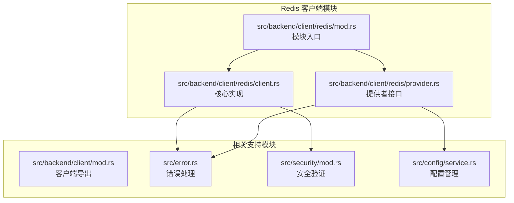
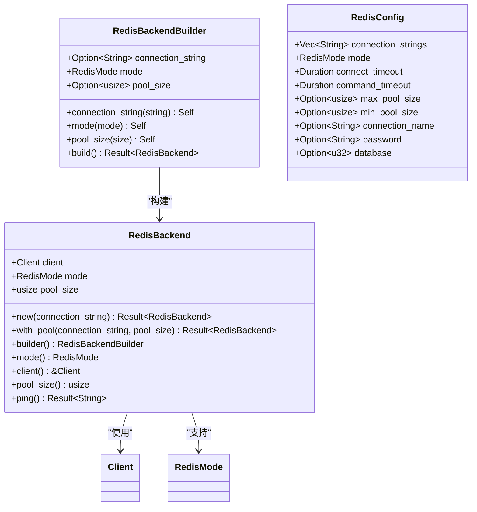
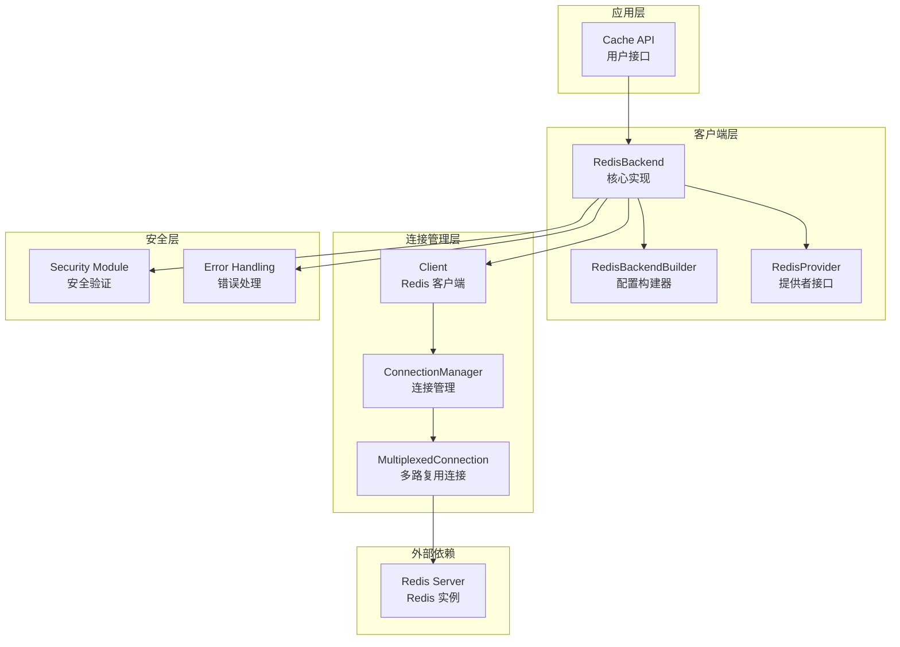
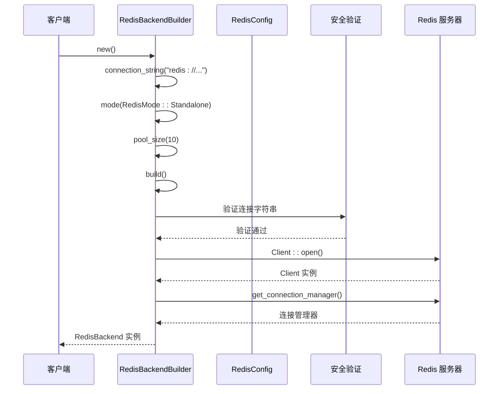
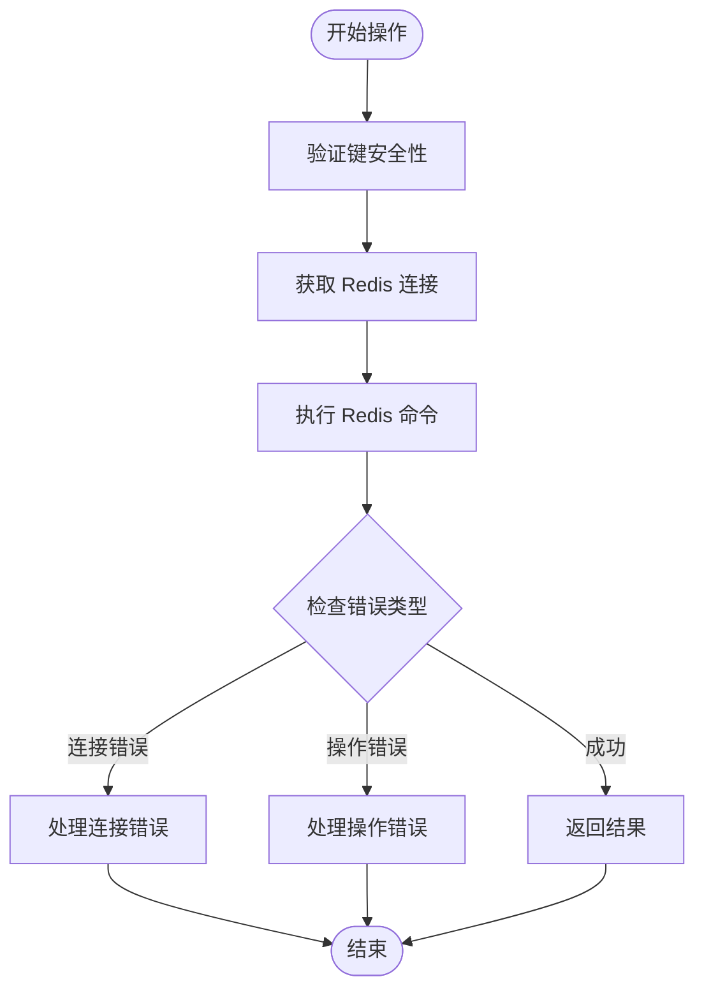
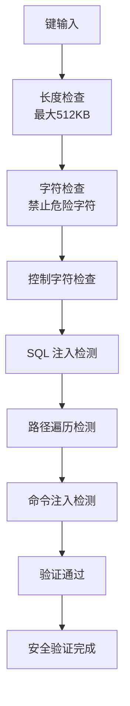
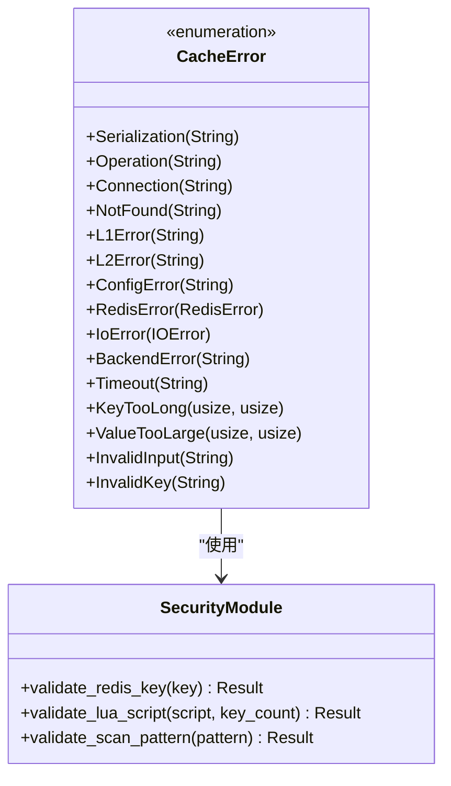
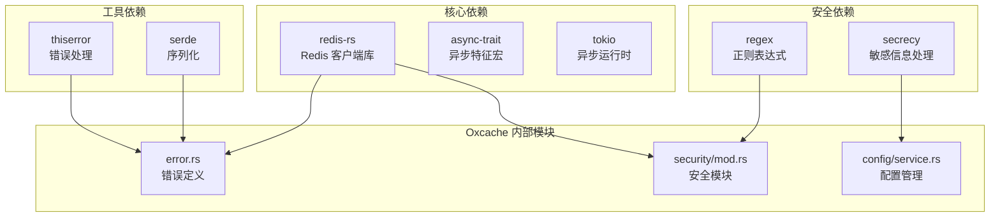
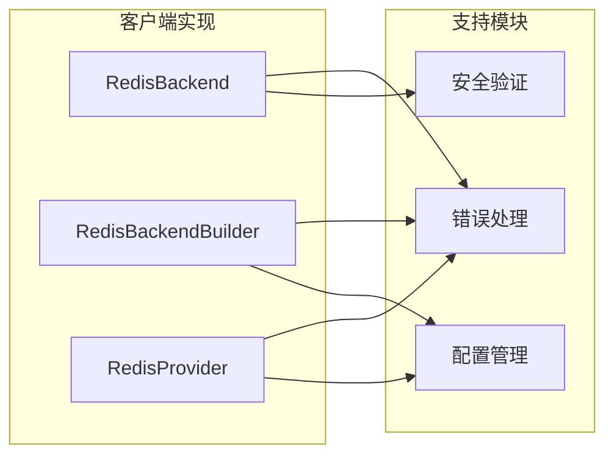

# Redis 客户端实现

<cite>
**本文档引用的文件**
- [src/backend/client/redis/client.rs](file://src/backend/client/redis/client.rs)
- [src/backend/client/redis/provider.rs](file://src/backend/client/redis/provider.rs)
- [src/backend/client/redis/mod.rs](file://src/backend/client/redis/mod.rs)
- [src/backend/client/mod.rs](file://src/backend/client/mod.rs)
- [src/error.rs](file://src/error.rs)
- [src/security/mod.rs](file://src/security/mod.rs)
- [src/config/service.rs](file://src/config/service.rs)
- [examples/src/redis_native.rs](file://examples/src/redis_native.rs)
- [src/lib.rs](file://src/lib.rs)
</cite>

## 目录
1. [简介](#简介)
2. [项目结构](#项目结构)
3. [核心组件](#核心组件)
4. [架构概览](#架构概览)
5. [详细组件分析](#详细组件分析)
6. [依赖分析](#依赖分析)
7. [性能考虑](#性能考虑)
8. [故障排除指南](#故障排除指南)
9. [结论](#结论)
10. [附录](#附录)

## 简介

Oxcache Redis 客户端是一个高性能的分布式缓存解决方案，基于 Rust 语言实现，提供了完整的 Redis 客户端功能。该实现采用现代化的异步设计，支持多种 Redis 部署模式，包括单机、哨兵和集群模式。

本客户端实现了完整的缓存操作接口，包括 GET、SET、DELETE、EXISTS、TTL、EXPIRE 等基本操作，以及高级功能如 SCAN 清理和健康检查。客户端内置了全面的安全验证机制，防止常见的 Redis 攻击和注入漏洞。

## 项目结构

Oxcache 项目的 Redis 客户端实现位于 `src/backend/client/redis/` 目录下，采用模块化设计：



**图表来源**
- [src/backend/client/redis/mod.rs](file://src/backend/client/redis/mod.rs#L1-L15)
- [src/backend/client/redis/client.rs](file://src/backend/client/redis/client.rs#L1-L522)
- [src/backend/client/redis/provider.rs](file://src/backend/client/redis/provider.rs#L1-L195)

**章节来源**
- [src/backend/client/redis/mod.rs](file://src/backend/client/redis/mod.rs#L1-L15)
- [src/backend/client/mod.rs](file://src/backend/client/mod.rs#L1-L34)

## 核心组件

### RedisBackend 结构体

RedisBackend 是客户端的核心实现，负责管理 Redis 连接和执行缓存操作：



**图表来源**
- [src/backend/client/redis/client.rs](file://src/backend/client/redis/client.rs#L66-L137)
- [src/backend/client/redis/client.rs](file://src/backend/client/redis/client.rs#L134-L213)

### RedisMode 枚举

客户端支持三种 Redis 部署模式：

| 模式 | 描述 | 适用场景 |
|------|------|----------|
| Standalone | 单机 Redis 服务器 | 开发环境、小型应用 |
| Sentinel | Redis 哨兵高可用模式 | 生产环境高可用需求 |
| Cluster | Redis 集群水平扩展模式 | 大规模分布式应用 |

**章节来源**
- [src/backend/client/redis/client.rs](file://src/backend/client/redis/client.rs#L15-L25)
- [src/config/service.rs](file://src/config/service.rs#L82-L103)

## 架构概览

Oxcache Redis 客户端采用分层架构设计，确保了良好的可维护性和扩展性：



**图表来源**
- [src/backend/client/redis/client.rs](file://src/backend/client/redis/client.rs#L66-L137)
- [src/backend/client/redis/provider.rs](file://src/backend/client/redis/provider.rs#L22-L31)

## 详细组件分析

### RedisBackendBuilder 配置系统

RedisBackendBuilder 提供了灵活的配置构建机制，支持链式调用和多种配置选项：



**图表来源**
- [src/backend/client/redis/client.rs](file://src/backend/client/redis/client.rs#L142-L213)

#### 配置选项详解

| 配置项 | 类型 | 默认值 | 描述 |
|--------|------|--------|------|
| connection_string | String | "redis://localhost:6379" | Redis 连接字符串 |
| mode | RedisMode | RedisMode::Standalone | 连接模式 |
| pool_size | Option<usize> | Some(10) | 连接池大小 |
| connect_timeout | Duration | 5秒 | 连接超时时间 |
| command_timeout | Duration | 5秒 | 命令执行超时 |
| password | Option<String> | None | 认证密码 |
| database | Option<u32> | Some(0) | 数据库编号 |

**章节来源**
- [src/backend/client/redis/client.rs](file://src/backend/client/redis/client.rs#L27-L64)

### RedisBackend 核心功能实现

RedisBackend 实现了完整的 CacheBackend trait，提供了所有必要的缓存操作：



**图表来源**
- [src/backend/client/redis/client.rs](file://src/backend/client/redis/client.rs#L215-L499)

#### 主要操作实现

1. **GET 操作**: 使用 `redis::cmd("GET").arg(key)` 执行
2. **SET 操作**: 支持普通 SET 和 EXPIRE SET
3. **DELETE 操作**: 使用 DEL 命令删除键
4. **EXISTS 操作**: 检查键是否存在
5. **TTL 操作**: 获取键的剩余生存时间
6. **EXPIRE 操作**: 设置键的过期时间

**章节来源**
- [src/backend/client/redis/client.rs](file://src/backend/client/redis/client.rs#L215-L499)

### 安全验证机制

客户端内置了全面的安全验证机制，防止各种攻击：



**图表来源**
- [src/security/mod.rs](file://src/security/mod.rs#L74-L202)

**章节来源**
- [src/security/mod.rs](file://src/security/mod.rs#L74-L202)

### 错误处理机制

客户端采用了统一的错误处理架构，提供了详细的错误分类和处理策略：



**图表来源**
- [src/error.rs](file://src/error.rs#L75-L208)
- [src/security/mod.rs](file://src/security/mod.rs#L74-L202)

**章节来源**
- [src/error.rs](file://src/error.rs#L75-L208)

## 依赖分析

### 外部依赖关系

Oxcache Redis 客户端主要依赖以下外部库：



**图表来源**
- [src/backend/client/redis/client.rs](file://src/backend/client/redis/client.rs#L6-L13)
- [src/security/mod.rs](file://src/security/mod.rs#L11-L12)

### 内部模块耦合

客户端模块之间的依赖关系相对简单，主要通过错误处理和安全验证模块进行交互：



**图表来源**
- [src/backend/client/redis/client.rs](file://src/backend/client/redis/client.rs#L6-L13)
- [src/backend/client/redis/provider.rs](file://src/backend/client/redis/provider.rs#L7-L19)

**章节来源**
- [src/backend/client/redis/client.rs](file://src/backend/client/redis/client.rs#L6-L13)
- [src/backend/client/redis/provider.rs](file://src/backend/client/redis/provider.rs#L7-L19)

## 性能考虑

### 连接管理优化

客户端采用了连接池和多路复用技术来优化性能：

1. **连接池管理**: 支持可配置的连接池大小
2. **异步操作**: 全面使用 async/await 模型
3. **连接复用**: 复用现有的连接实例
4. **超时控制**: 精确的超时管理和错误处理

### 缓存操作优化

1. **批量操作**: 支持批量读写操作
2. **TTL 管理**: 有效的过期时间管理
3. **内存优化**: 合理的内存使用和释放
4. **并发控制**: 线程安全的并发访问

## 故障排除指南

### 常见连接问题

| 问题类型 | 错误代码 | 解决方案 |
|----------|----------|----------|
| 连接超时 | TimeoutError | 检查网络连接和防火墙设置 |
| 认证失败 | RedisError | 验证密码和用户名配置 |
| 连接断开 | ConnectionError | 检查 Redis 服务器状态 |
| 配置错误 | ConfigError | 验证连接字符串格式 |

### 安全相关错误

1. **键验证失败**: 检查键长度和字符合法性
2. **SQL 注入检测**: 避免在键中使用特殊字符
3. **路径遍历保护**: 确保键不包含路径遍历模式
4. **命令注入防护**: 验证用户输入的安全性

**章节来源**
- [src/error.rs](file://src/error.rs#L228-L288)
- [src/security/mod.rs](file://src/security/mod.rs#L484-L647)

## 结论

Oxcache Redis 客户端是一个设计精良、功能完整的分布式缓存解决方案。其特点包括：

1. **现代化设计**: 基于 async/await 的异步架构
2. **全面功能**: 支持所有必要的缓存操作
3. **安全可靠**: 内置多层次的安全验证机制
4. **灵活配置**: 支持多种 Redis 部署模式
5. **错误处理**: 完善的错误分类和处理策略

该客户端适合各种规模的应用场景，从开发测试到生产环境的高可用部署。

## 附录

### 使用示例

以下是一个完整的 Redis 客户端使用示例：

```rust
use oxcache::Cache;

#[tokio::main]
async fn main() -> Result<(), Box<dyn std::error::Error>> {
    // 创建 Redis 缓存实例
    let cache: Cache<String, User> = Cache::redis("redis://localhost:6379").await?;
    
    // 基本操作
    let user = User { id: 1, name: "张三".to_string() };
    
    // 设置缓存
    cache.set("user:1", &user, Some(3600)).await?;
    
    // 获取缓存
    let retrieved: Option<User> = cache.get("user:1").await?;
    
    // 删除缓存
    cache.delete("user:1").await?;
    
    Ok(())
}
```

**章节来源**
- [examples/src/redis_native.rs](file://examples/src/redis_native.rs#L1-L115)

### 最佳实践

1. **连接字符串**: 始终使用 rediss:// 协议进行生产环境连接
2. **超时设置**: 合理配置连接和命令超时时间
3. **错误处理**: 实现适当的错误处理和重试机制
4. **资源管理**: 确保正确关闭连接和释放资源
5. **安全验证**: 始终验证用户输入和键的安全性