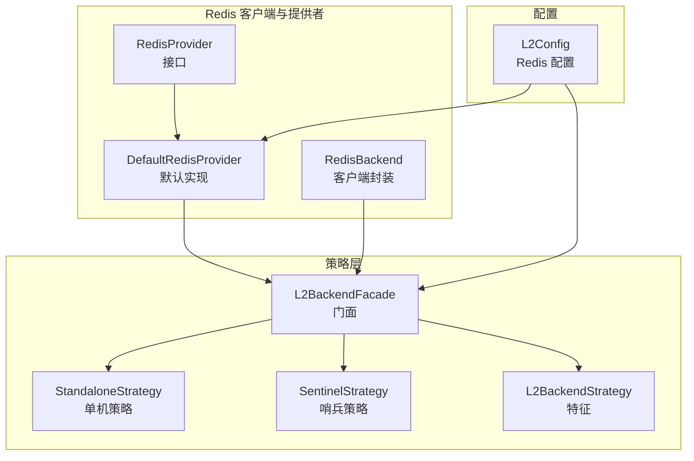
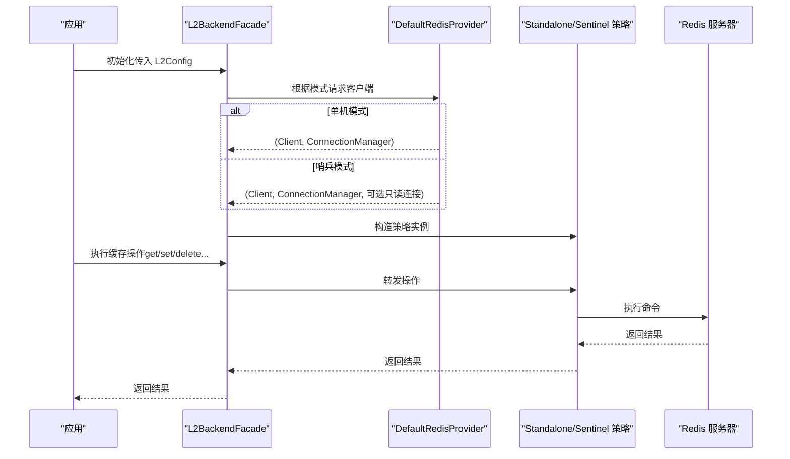
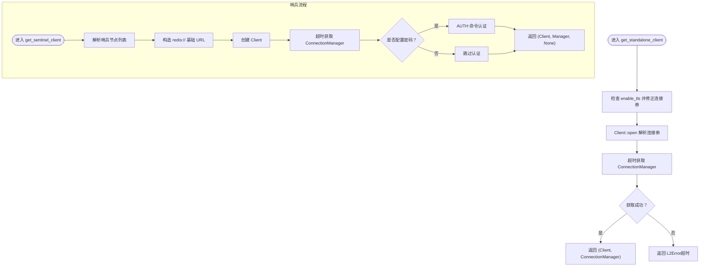
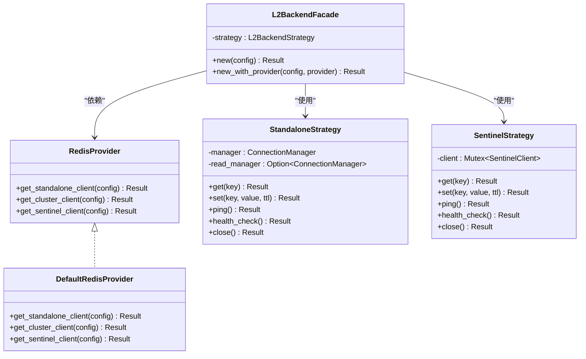

# Redis 连接提供者

<cite>
**本文档引用的文件**
- [src/backend/client/redis/provider.rs](file://src/backend/client/redis/provider.rs)
- [src/backend/client/redis/mod.rs](file://src/backend/client/redis/mod.rs)
- [src/backend/strategy/mod.rs](file://src/backend/strategy/mod.rs)
- [src/backend/strategy/traits.rs](file://src/backend/strategy/traits.rs)
- [src/backend/strategy/facade.rs](file://src/backend/strategy/facade.rs)
- [src/backend/strategy/standalone.rs](file://src/backend/strategy/standalone.rs)
- [src/backend/strategy/sentinel.rs](file://src/backend/strategy/sentinel.rs)
- [src/config/service.rs](file://src/config/service.rs)
- [src/backend/client/redis/client.rs](file://src/backend/client/redis/client.rs)
- [examples/src/redis_native.rs](file://examples/src/redis_native.rs)
- [tests/common/redis_test_utils.rs](file://tests/common/redis_test_utils.rs)
</cite>

## 目录
1. [简介](#简介)
2. [项目结构](#项目结构)
3. [核心组件](#核心组件)
4. [架构总览](#架构总览)
5. [详细组件分析](#详细组件分析)
6. [依赖关系分析](#依赖关系分析)
7. [性能考虑](#性能考虑)
8. [故障排查指南](#故障排查指南)
9. [结论](#结论)

## 简介
本文件深入讲解 Oxcache 中 Redis 连接提供者的架构设计与实现细节，重点覆盖：
- DefaultRedisProvider 的默认连接管理策略与实现机制
- RedisProvider trait 的设计目的与扩展接口
- 连接提供者的生命周期管理、连接池策略与资源回收
- 不同 Redis 部署模式（单机、哨兵、集群）下的连接提供者实现差异
- 自定义连接提供者的实现示例与扩展指南
- 连接状态监控与故障转移处理机制

## 项目结构
Redis 相关代码主要分布在以下模块：
- backend/client/redis：Redis 客户端与提供者
- backend/strategy：策略模式封装（单机、哨兵、集群、门面）
- config/service：L2 配置（含 Redis 模式、连接串、超时、TLS 等）

**图表来源**
- [src/backend/client/redis/provider.rs](file://src/backend/client/redis/provider.rs#L22-L31)
- [src/backend/strategy/facade.rs](file://src/backend/strategy/facade.rs#L48-L98)
- [src/backend/strategy/standalone.rs](file://src/backend/strategy/standalone.rs#L18-L31)
- [src/backend/strategy/sentinel.rs](file://src/backend/strategy/sentinel.rs#L21-L30)
- [src/config/service.rs](file://src/config/service.rs#L364-L491)

**章节来源**
- [src/backend/client/redis/mod.rs](file://src/backend/client/redis/mod.rs#L1-L15)
- [src/backend/strategy/mod.rs](file://src/backend/strategy/mod.rs#L1-L24)

## 核心组件
- RedisProvider trait：定义获取不同部署模式客户端的异步接口，便于替换与扩展。
- DefaultRedisProvider：默认实现，负责根据 L2Config 生成合适的 Client/ConnectionManager，并处理 TLS、超时与认证。
- L2BackendFacade：门面，依据 L2Config.mode 决定使用单机或哨兵策略，屏蔽上层差异。
- StandaloneStrategy/SentinelStrategy：具体策略实现，封装连接获取、命令执行、健康检查与资源回收。

**章节来源**
- [src/backend/client/redis/provider.rs](file://src/backend/client/redis/provider.rs#L22-L31)
- [src/backend/strategy/facade.rs](file://src/backend/strategy/facade.rs#L48-L98)
- [src/backend/strategy/standalone.rs](file://src/backend/strategy/standalone.rs#L18-L31)
- [src/backend/strategy/sentinel.rs](file://src/backend/strategy/sentinel.rs#L21-L30)

## 架构总览
Redis 连接提供者采用“提供者 + 策略 + 门面”的分层设计：
- 提供者层：负责按配置创建并初始化不同模式的 Redis 客户端
- 策略层：针对不同部署模式封装统一的 L2BackendStrategy 接口
- 门面层：对外暴露一致的 API，隐藏底层差异

**图表来源**
- [src/backend/strategy/facade.rs](file://src/backend/strategy/facade.rs#L48-L98)
- [src/backend/client/redis/provider.rs](file://src/backend/client/redis/provider.rs#L38-L193)
- [src/backend/strategy/standalone.rs](file://src/backend/strategy/standalone.rs#L72-L418)
- [src/backend/strategy/sentinel.rs](file://src/backend/strategy/sentinel.rs#L58-L432)

## 详细组件分析

### DefaultRedisProvider：默认连接管理策略
- 单机模式
  - 根据 enable_tls 自动将 redis:// 替换为 rediss://，确保生产环境强制 TLS
  - 使用 Client::open 解析连接串，随后以超时控制获取 ConnectionManager
  - 超时失败时返回 L2Error，提示超时与目标地址（敏感信息脱敏）
- 哨兵模式
  - 解析哨兵节点列表，构造基础 redis:// URL
  - 通过 ConnectionManager 自动处理主从发现与故障转移
  - 若配置了密码，通过 AUTH 命令进行认证
  - 当前返回 None 作为只读连接（主需求为自动故障转移）
- 集群模式
  - 构建 ClusterClient，设置只读副本读取（read_from_replicas）
  - 通过超时控制确保初始连接建立成功

**图表来源**
- [src/backend/client/redis/provider.rs](file://src/backend/client/redis/provider.rs#L38-L193)

**章节来源**
- [src/backend/client/redis/provider.rs](file://src/backend/client/redis/provider.rs#L38-L193)

### RedisProvider trait：设计目的与扩展接口
- 设计目的
  - 抽象不同 Redis 部署模式的客户端创建过程，便于替换与测试
  - 将连接初始化、TLS、认证、超时等细节封装在提供者内
- 扩展接口
  - get_standalone_client：返回主库连接管理器
  - get_sentinel_client：返回主库连接管理器及可选只读连接
  - get_cluster_client：返回集群客户端（当前实现为单机客户端，完整集群策略待实现）

**章节来源**
- [src/backend/client/redis/provider.rs](file://src/backend/client/redis/provider.rs#L22-L31)

### 生命周期管理、连接池策略与资源回收
- 生命周期
  - 初始化：L2BackendFacade::new_with_provider 根据 L2Config.mode 选择策略并创建客户端
  - 运行期：通过 ConnectionManager 管理连接复用与重连
  - 关闭：各策略的 close 方法在当前实现中为轻量级（ConnectionManager 在 drop 时自动回收）
- 连接池策略
  - 当前使用 redis-rs 的 ConnectionManager，默认 multiplexed 连接复用
  - 未显式使用 r2d2/mobc 等第三方连接池，但通过 ConnectionManager 已具备连接复用能力
- 资源回收
  - ConnectionManager 在作用域结束时自动关闭连接
  - 哨兵模式下，ConnectionManager 由提供者持有并在门面中传递给策略

**章节来源**
- [src/backend/strategy/facade.rs](file://src/backend/strategy/facade.rs#L48-L98)
- [src/backend/strategy/standalone.rs](file://src/backend/strategy/standalone.rs#L412-L418)
- [src/backend/strategy/sentinel.rs](file://src/backend/strategy/sentinel.rs#L428-L432)

### 不同 Redis 部署模式下的实现差异
- 单机模式（Standalone）
  - 使用 ConnectionManager 进行读写；可选配置只读连接（read_manager）
  - 命令超时来自 L2Config.command_timeout_ms
- 哨兵模式（Sentinel）
  - 通过 SentinelClient 获取连接，自动处理主从切换
  - 提供者负责认证与超时控制
- 集群模式（Cluster）
  - 当前门面使用 StandaloneStrategy 包装单机客户端
  - 完整集群支持需后续实现 ClusterStrategy

**章节来源**
- [src/backend/strategy/facade.rs](file://src/backend/strategy/facade.rs#L68-L91)
- [src/backend/strategy/standalone.rs](file://src/backend/strategy/standalone.rs#L18-L56)
- [src/backend/strategy/sentinel.rs](file://src/backend/strategy/sentinel.rs#L21-L46)

### 连接状态监控与故障转移处理
- 健康检查
  - L2BackendStrategy::health_check 通过 ping 判断健康状态
  - StandaloneStrategy/SentinelStrategy 的 ping 实现分别基于 ConnectionManager 与 MultiplexedConnection
- 故障转移
  - 哨兵模式下，ConnectionManager 自动处理主从切换
  - 提供者在超时失败时返回明确错误，便于上层感知与降级

**章节来源**
- [src/backend/strategy/traits.rs](file://src/backend/strategy/traits.rs#L292-L302)
- [src/backend/strategy/standalone.rs](file://src/backend/strategy/standalone.rs#L390-L406)
- [src/backend/strategy/sentinel.rs](file://src/backend/strategy/sentinel.rs#L402-L422)
- [src/backend/client/redis/provider.rs](file://src/backend/client/redis/provider.rs#L64-L76)

### 自定义实现示例与扩展指南
- 自定义 RedisProvider
  - 实现 RedisProvider trait 的三个方法，按需支持集群与哨兵
  - 在 L2BackendFacade::new_with_provider 中注入自定义 Provider
- 自定义策略
  - 实现 L2BackendStrategy，封装连接获取与命令执行
  - 在门面中根据 L2Config.mode 分派到自定义策略
- 配置建议
  - 生产环境强制 rediss://，通过环境变量 OXCACHE_ALLOW_INSECURE_REDIS 仅用于开发测试
  - 合理设置连接超时与命令超时，避免阻塞

**章节来源**
- [src/backend/client/redis/provider.rs](file://src/backend/client/redis/provider.rs#L22-L31)
- [src/backend/strategy/facade.rs](file://src/backend/strategy/facade.rs#L62-L98)
- [src/backend/client/redis/client.rs](file://src/backend/client/redis/client.rs#L162-L179)

## 依赖关系分析
- 模块耦合
  - DefaultRedisProvider 依赖 L2Config（模式、连接串、TLS、超时、密码、哨兵/集群配置）
  - L2BackendFacade 依赖 RedisProvider 与策略实现
  - 策略实现依赖 redis-rs 的 Client/ConnectionManager/SentinelClient
- 外部依赖
  - redis：核心客户端与连接管理
  - secrecy：保护敏感配置（密码、连接串）
  - tokio::time：超时控制
  - tracing：日志与可观测性

**图表来源**
- [src/backend/client/redis/provider.rs](file://src/backend/client/redis/provider.rs#L22-L31)
- [src/backend/strategy/facade.rs](file://src/backend/strategy/facade.rs#L22-L30)
- [src/backend/strategy/standalone.rs](file://src/backend/strategy/standalone.rs#L18-L31)
- [src/backend/strategy/sentinel.rs](file://src/backend/strategy/sentinel.rs#L21-L30)

**章节来源**
- [src/backend/client/redis/provider.rs](file://src/backend/client/redis/provider.rs#L22-L31)
- [src/backend/strategy/facade.rs](file://src/backend/strategy/facade.rs#L22-L30)
- [src/backend/strategy/standalone.rs](file://src/backend/strategy/standalone.rs#L18-L31)
- [src/backend/strategy/sentinel.rs](file://src/backend/strategy/sentinel.rs#L21-L30)

## 性能考虑
- 连接复用：通过 ConnectionManager 实现 multiplexed 连接，减少握手开销
- 只读副本：集群模式启用 read_from_replicas，提升读取扩展性
- 超时控制：连接超时与命令超时分离，避免长时间阻塞
- 批量操作：策略层提供 mget/mset 等批量接口，降低 RTT

[本节为通用指导，无需特定文件来源]

## 故障排查指南
- 连接超时
  - 检查 L2Config.connection_timeout_ms 与网络状况
  - 开发环境可通过 OXCACHE_ALLOW_INSECURE_REDIS 允许非 TLS（生产禁止）
- TLS 配置错误
  - 确保连接串为 rediss://（生产）或允许非 TLS 的开发场景
- 哨兵认证失败
  - 确认密码配置与 AUTH 命令执行结果
- 健康检查失败
  - 使用 health_check/ping 排查网络与权限问题

**章节来源**
- [src/backend/client/redis/client.rs](file://src/backend/client/redis/client.rs#L162-L179)
- [src/backend/client/redis/provider.rs](file://src/backend/client/redis/provider.rs#L64-L76)
- [src/backend/strategy/standalone.rs](file://src/backend/strategy/standalone.rs#L401-L406)
- [src/backend/strategy/sentinel.rs](file://src/backend/strategy/sentinel.rs#L416-L422)

## 结论
Oxcache 的 Redis 连接提供者通过 Provider + Strategy + Facade 的分层设计，实现了对不同部署模式的统一抽象与灵活扩展。DefaultRedisProvider 提供了生产友好的默认行为（强制 TLS、超时控制、认证处理），并为自定义提供者与策略留出清晰接口。结合 ConnectionManager 的连接复用与健康检查机制，整体方案在易用性、可维护性与性能之间取得良好平衡。