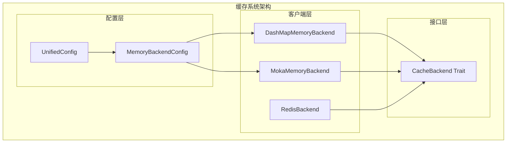
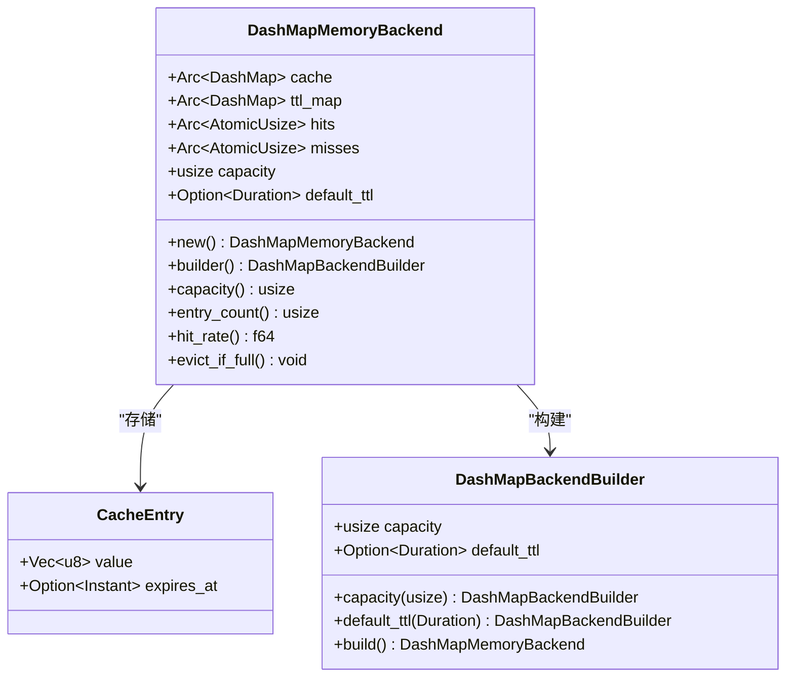
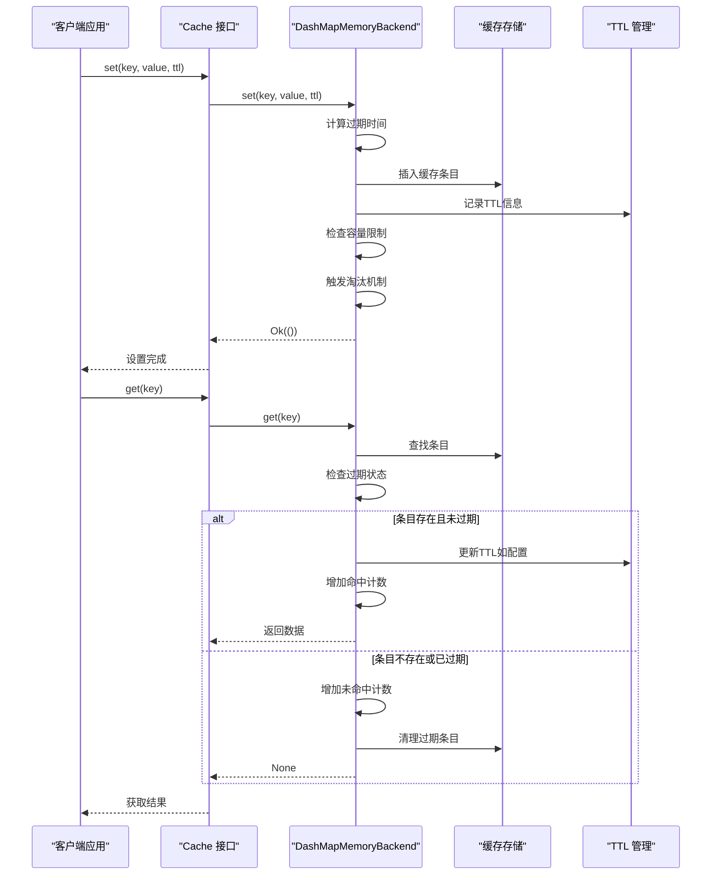
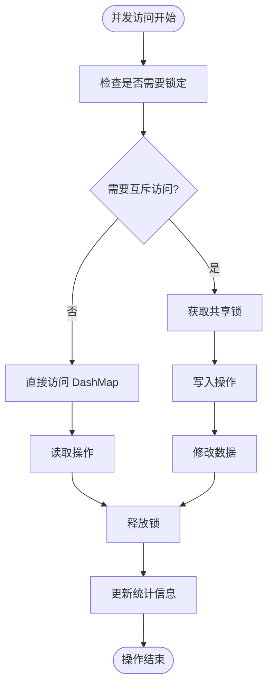
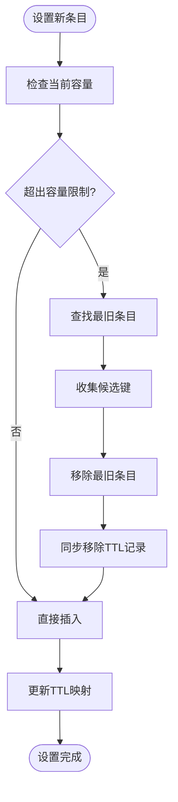
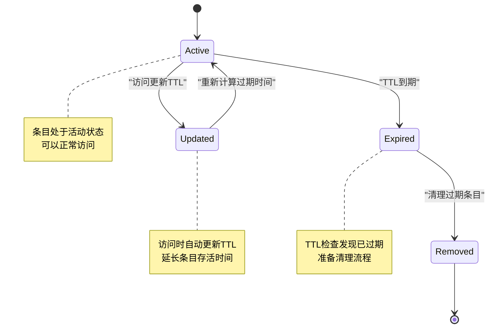
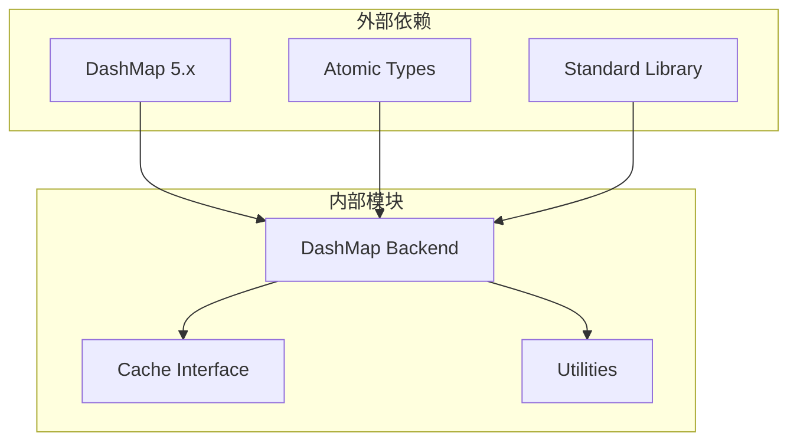
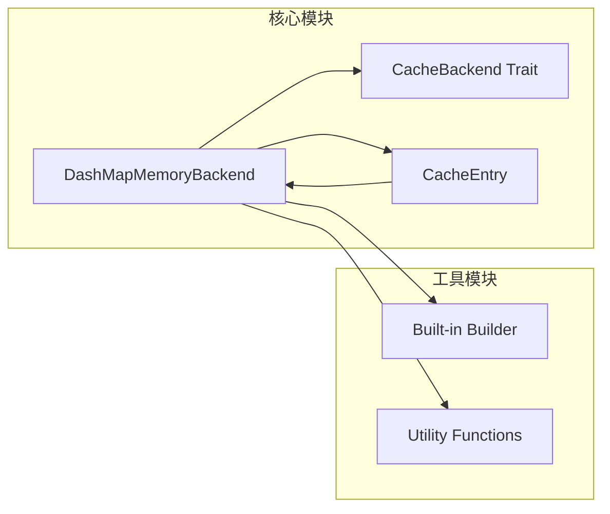
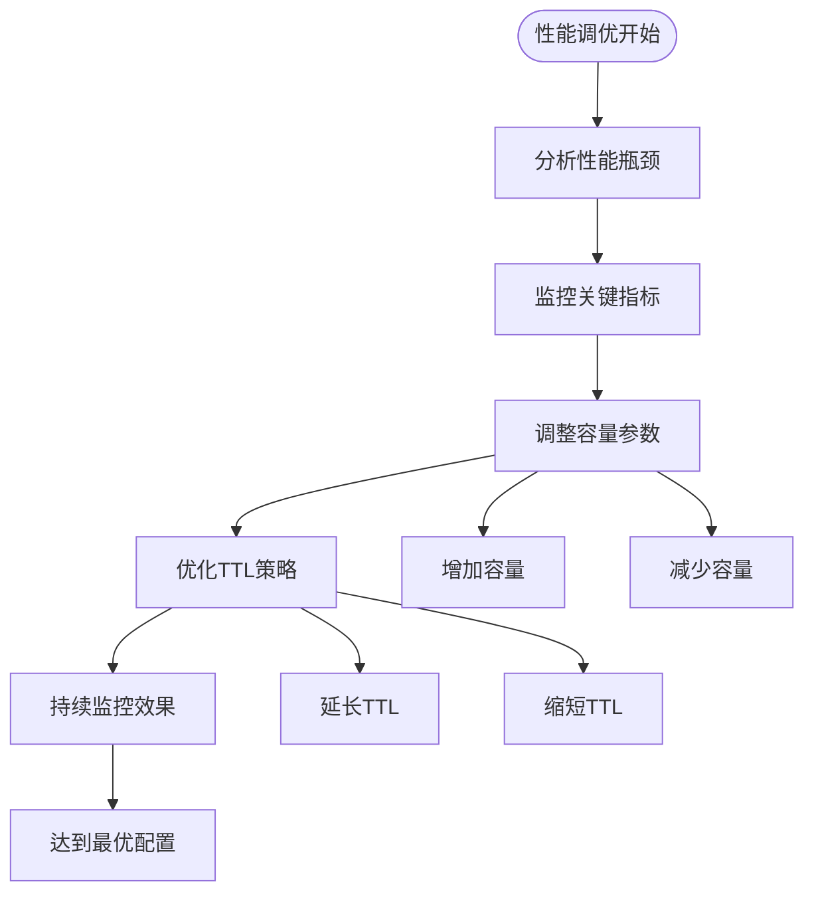

# DashMap 内存后端

<cite>
**本文档引用的文件**
- [src/backend/client/dashmap/backend.rs](file://src/backend/client/dashmap/backend.rs)
- [src/backend/client/dashmap/mod.rs](file://src/backend/client/dashmap/mod.rs)
- [src/backend/mod.rs](file://src/backend/mod.rs)
- [src/config/unified.rs](file://src/config/unified.rs)
- [src/backend/client/moka/backend.rs](file://src/backend/client/moka/backend.rs)
- [examples/src/01_basics/example_comprehensive_usage.rs](file://examples/src/01_basics/example_comprehensive_usage.rs)
</cite>

## 目录
1. [简介](#简介)
2. [项目结构](#项目结构)
3. [核心组件](#核心组件)
4. [架构概览](#架构概览)
5. [详细组件分析](#详细组件分析)
6. [依赖关系分析](#依赖关系分析)
7. [性能考虑](#性能考虑)
8. [故障排查指南](#故障排查指南)
9. [结论](#结论)
10. [附录](#附录)

## 简介

DashMap 内存后端是 Oxcache 缓存系统中的高性能并发内存缓存实现。它基于 Rust 生态系统中的 DashMap 库构建，提供了无锁并发访问能力和灵活的 TTL（生存时间）管理机制。

### 主要特性

- **无锁并发设计**：利用 DashMap 的无锁并发特性，提供高吞吐量的并发访问
- **手动 TTL 管理**：通过独立的 TTL 映射表实现精确的过期控制
- **可配置容量限制**：支持最大条目数量限制和智能淘汰机制
- **统计监控**：内置命中率统计和运行时指标收集
- **灵活配置**：支持通过构建器模式进行详细的后端配置

## 项目结构

DashMap 内存后端位于缓存系统的客户端层，与 Moka 后端并列提供不同的内存缓存实现方案。



**图表来源**
- [src/backend/client/dashmap/backend.rs](file://src/backend/client/dashmap/backend.rs#L51-L63)
- [src/backend/client/moka/backend.rs](file://src/backend/client/moka/backend.rs#L18-L22)
- [src/config/unified.rs](file://src/config/unified.rs#L694-L725)

**章节来源**
- [src/backend/client/dashmap/mod.rs](file://src/backend/client/dashmap/mod.rs#L1-L14)
- [src/backend/mod.rs](file://src/backend/mod.rs#L29-L39)

## 核心组件

### DashMapMemoryBackend 结构

DashMapMemoryBackend 是内存缓存的核心实现，采用组合模式设计多个独立组件：



**图表来源**
- [src/backend/client/dashmap/backend.rs](file://src/backend/client/dashmap/backend.rs#L51-L63)
- [src/backend/client/dashmap/backend.rs](file://src/backend/client/dashmap/backend.rs#L17-L21)
- [src/backend/client/dashmap/backend.rs](file://src/backend/client/dashmap/backend.rs#L324-L361)

### 数据结构设计

系统使用双重映射机制来实现高效的并发访问和 TTL 管理：

| 组件 | 类型 | 用途 | 特性 |
|------|------|------|------|
| cache | Arc<DashMap<String, CacheEntry>> | 主要数据存储 | 无锁并发访问 |
| ttl_map | Arc<DashMap<String, Instant>> | TTL 过期跟踪 | 支持快速过期检查 |
| hits | Arc<AtomicUsize> | 命中次数统计 | 原子操作保证线程安全 |
| misses | Arc<AtomicUsize> | 未命中次数统计 | 原子操作保证线程安全 |

**章节来源**
- [src/backend/client/dashmap/backend.rs](file://src/backend/client/dashmap/backend.rs#L17-L21)
- [src/backend/client/dashmap/backend.rs](file://src/backend/client/dashmap/backend.rs#L51-L63)

## 架构概览

DashMap 内存后端采用分层架构设计，确保高并发性能和良好的可维护性。



**图表来源**
- [src/backend/client/dashmap/backend.rs](file://src/backend/client/dashmap/backend.rs#L157-L203)
- [src/backend/client/dashmap/backend.rs](file://src/backend/client/dashmap/backend.rs#L205-L225)

## 详细组件分析

### 并发访问控制机制

DashMap 内存后端实现了高效的无锁并发访问控制：



**图表来源**
- [src/backend/client/dashmap/backend.rs](file://src/backend/client/dashmap/backend.rs#L94-L108)

### 内存管理策略

系统采用智能的内存管理策略来控制内存使用：



**图表来源**
- [src/backend/client/dashmap/backend.rs](file://src/backend/client/dashmap/backend.rs#L94-L108)
- [src/backend/client/dashmap/backend.rs](file://src/backend/client/dashmap/backend.rs#L219-L222)

### 过期策略实现

DashMap 后端采用手动 TTL 管理机制，提供灵活的过期控制：



**图表来源**
- [src/backend/client/dashmap/backend.rs](file://src/backend/client/dashmap/backend.rs#L157-L203)
- [src/backend/client/dashmap/backend.rs](file://src/backend/client/dashmap/backend.rs#L265-L298)

**章节来源**
- [src/backend/client/dashmap/backend.rs](file://src/backend/client/dashmap/backend.rs#L94-L108)
- [src/backend/client/dashmap/backend.rs](file://src/backend/client/dashmap/backend.rs#L157-L203)
- [src/backend/client/dashmap/backend.rs](file://src/backend/client/dashmap/backend.rs#L265-L298)

### 配置参数详解

DashMap 内存后端支持以下配置参数：

| 参数名称 | 类型 | 默认值 | 描述 | 使用场景 |
|----------|------|--------|------|----------|
| capacity | usize | 10,000 | 最大缓存条目数量 | 控制内存使用上限 |
| default_ttl | Option<Duration> | None | 新条目的默认TTL | 设置全局过期策略 |
| enable_stats | bool | false | 是否启用统计功能 | 监控和调试需求 |

**章节来源**
- [src/backend/client/dashmap/backend.rs](file://src/backend/client/dashmap/backend.rs#L324-L361)
- [src/config/unified.rs](file://src/config/unified.rs#L694-L725)

## 依赖关系分析

### 外部依赖

DashMap 内存后端主要依赖于以下外部库：



**图表来源**
- [src/backend/client/dashmap/backend.rs](file://src/backend/client/dashmap/backend.rs#L7-L14)

### 内部耦合关系



**图表来源**
- [src/backend/client/dashmap/backend.rs](file://src/backend/client/dashmap/backend.rs#L51-L63)
- [src/backend/client/dashmap/backend.rs](file://src/backend/client/dashmap/backend.rs#L324-L361)

**章节来源**
- [src/backend/client/dashmap/backend.rs](file://src/backend/client/dashmap/backend.rs#L7-L14)
- [src/backend/mod.rs](file://src/backend/mod.rs#L29-L39)

## 性能考虑

### 并发性能特征

DashMap 内存后端在高并发场景下表现出色：

- **无锁设计**：避免了传统互斥锁的性能开销
- **细粒度并发**：每个桶独立管理，减少锁竞争
- **内存局部性**：连续内存布局提升缓存命中率

### 内存使用优化

系统通过以下机制优化内存使用：

1. **智能淘汰**：基于 LRU 原理的最旧条目优先淘汰
2. **延迟清理**：过期检查在访问时进行，避免额外的后台任务
3. **原子统计**：使用原子操作减少同步开销

### 性能调优建议



**章节来源**
- [src/backend/client/dashmap/backend.rs](file://src/backend/client/dashmap/backend.rs#L344-L361)
- [src/config/unified.rs](file://src/config/unified.rs#L694-L725)

## 故障排查指南

### 常见问题诊断

| 问题类型 | 症状 | 可能原因 | 解决方案 |
|----------|------|----------|----------|
| 内存泄漏 | 内存使用持续增长 | TTL 未正确清理 | 检查过期逻辑和清理机制 |
| 性能下降 | 并发访问延迟增加 | 锁竞争或容量不足 | 优化容量配置和并发策略 |
| 数据不一致 | 读取到过期数据 | TTL 检查时机不当 | 调整 TTL 检查频率 |
| 配置错误 | 后端行为异常 | 参数设置不当 | 验证配置参数的有效性 |

### 调试技巧

1. **启用统计信息**：通过 `enable_stats` 参数获取详细的运行时指标
2. **监控命中率**：观察 `hit_rate` 指标判断缓存效率
3. **检查容量使用**：监控 `entry_count` 与 `capacity` 的比例
4. **分析过期行为**：通过 TTL 相关 API 验证过期逻辑

**章节来源**
- [src/backend/client/dashmap/backend.rs](file://src/backend/client/dashmap/backend.rs#L305-L320)

## 结论

DashMap 内存后端为 Oxcache 提供了高性能、低延迟的并发内存缓存解决方案。其无锁设计和手动 TTL 管理机制使其在高并发场景下表现出色，特别适合对延迟敏感的应用场景。

### 优势总结

- **高性能并发**：无锁设计提供卓越的并发性能
- **灵活 TTL 管理**：手动控制确保精确的过期策略
- **内存友好**：智能容量管理和清理机制
- **易于集成**：符合统一的缓存接口标准

### 适用场景

- 高并发 Web 应用的会话缓存
- 实时数据的临时存储
- 需要精确 TTL 控制的业务场景
- 对延迟要求极高的应用场景

## 附录

### 配置示例

#### 基础配置
```rust
// 创建默认配置的 DashMap 后端
let backend = DashMapMemoryBackend::new();

// 使用自定义容量
let backend = DashMapMemoryBackend::builder()
    .capacity(50000)
    .build();

// 设置默认 TTL
let backend = DashMapMemoryBackend::builder()
    .capacity(10000)
    .default_ttl(Duration::from_secs(3600))
    .build();
```

#### 高性能配置
```rust
// 生产环境推荐配置
let config = UnifiedConfig::high_performance_memory();
```

### 最佳实践

1. **合理设置容量**：根据可用内存和预期数据量设置合适的容量
2. **优化 TTL 策略**：根据数据访问模式调整 TTL 设置
3. **监控运行指标**：定期检查命中率和内存使用情况
4. **渐进式调优**：从小规模开始，逐步调整配置参数
5. **备份配置**：保存重要的配置参数以便回滚

### 与其他后端的对比

| 特性 | DashMap | Moka |
|------|---------|------|
| 并发模型 | 无锁 | 基于 Arc 的并发 |
| 自动淘汰 | 手动实现 | LRU/TinyLFU 策略 |
| TTL 管理 | 手动控制 | 自动管理 |
| 内存效率 | 高 | 中等 |
| 配置复杂度 | 低 | 中等 |
| 适用场景 | 高并发读取 | 综合缓存需求 |

**章节来源**
- [src/backend/client/dashmap/backend.rs](file://src/backend/client/dashmap/backend.rs#L364-L382)
- [src/config/unified.rs](file://src/config/unified.rs#L694-L725)
- [src/backend/client/moka/backend.rs](file://src/backend/client/moka/backend.rs#L18-L22)
