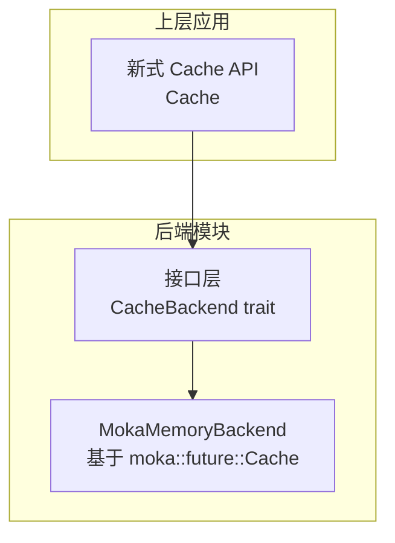
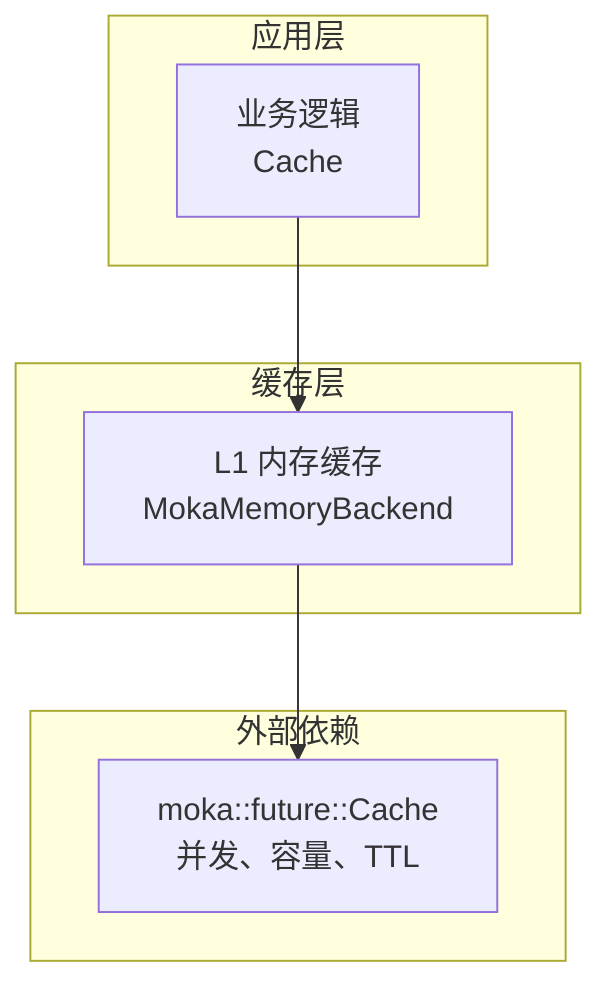
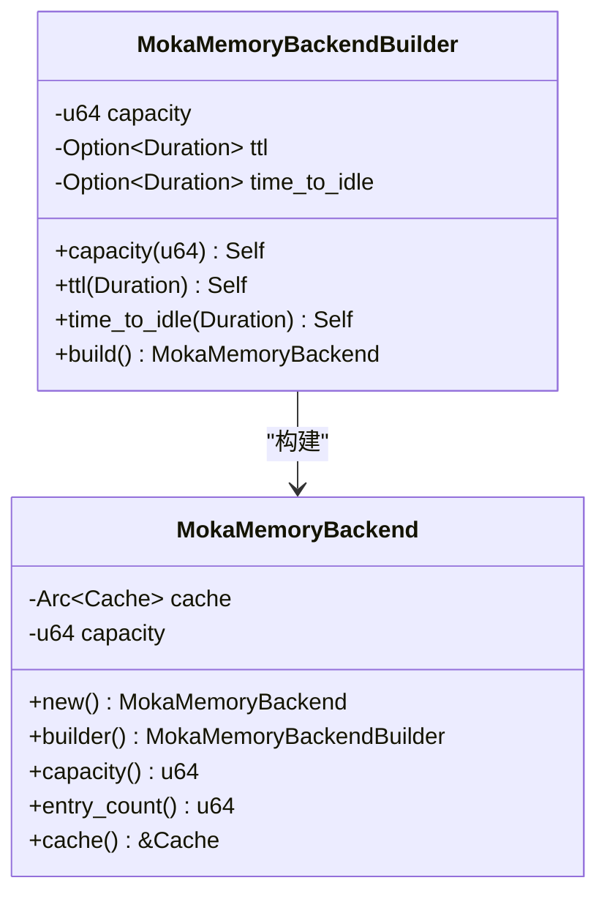
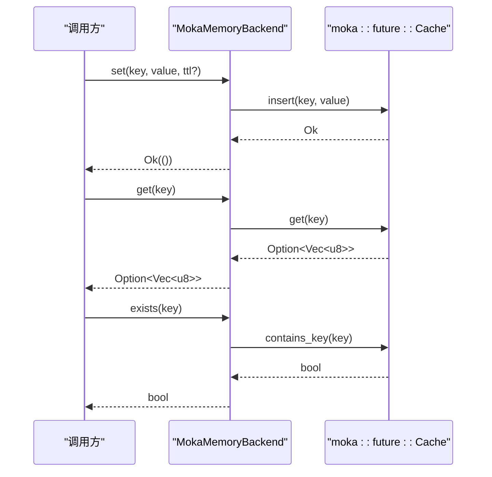
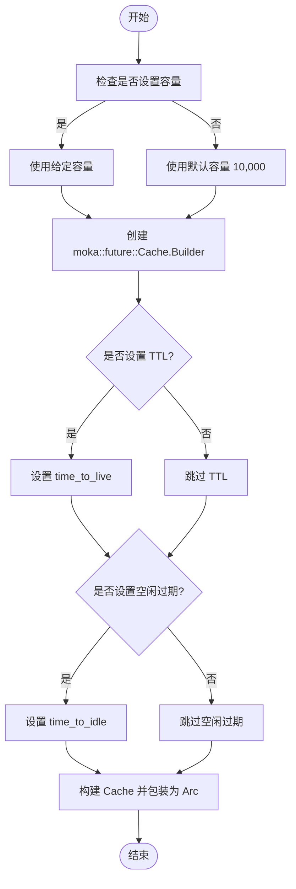
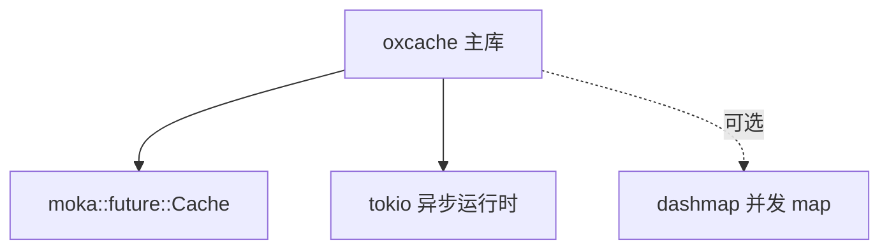

# Moka 内存后端

<cite>
**本文档引用的文件**
- [src/backend/client/moka/backend.rs](file://src/backend/client/moka/backend.rs)
- [src/backend/client/moka/mod.rs](file://src/backend/client/moka/mod.rs)
- [src/backend/interface.rs](file://src/backend/interface.rs)
- [src/backend/mod.rs](file://src/backend/mod.rs)
- [src/lib.rs](file://src/lib.rs)
- [Cargo.toml](file://Cargo.toml)
- [examples/src/01_basics/example_new_api.rs](file://examples/src/01_basics/example_new_api.rs)
- [tests/performance/memory_tests.rs](file://tests/performance/memory_tests.rs)
- [docs/API_REFERENCE.md](file://docs/API_REFERENCE.md)
</cite>

## 目录
1. [简介](#简介)
2. [项目结构](#项目结构)
3. [核心组件](#核心组件)
4. [架构总览](#架构总览)
5. [详细组件分析](#详细组件分析)
6. [依赖关系分析](#依赖关系分析)
7. [性能考量](#性能考量)
8. [故障排查指南](#故障排查指南)
9. [结论](#结论)
10. [附录](#附录)

## 简介
本文件系统性阐述基于 Moka 的内存后端实现与高级特性，重点覆盖以下方面：
- 设计原理：基于 LRU/TinyLFU 混合淘汰策略与内置 TTL 支持
- 自动过期机制：缓存项的 TTL 与空闲过期（Time-To-Idle）行为
- 配置选项与性能参数：容量、TTL、空闲过期等
- 内存管理策略：容量上限、逐出与回收
- 并发安全与线程本地存储优化：基于 Moka 的并发设计
- 与其他内存缓存库的差异与优势
- 监控指标与故障诊断方法

## 项目结构
Moka 内存后端位于后端子模块中，采用“客户端实现 + 接口适配”的分层设计：
- 接口层：定义统一的 CacheBackend trait，屏蔽不同后端的差异
- 客户端实现层：MokaMemoryBackend 基于 moka::future::Cache 实现
- 模块导出：通过 backend/mod.rs 与 lib.rs 对外暴露统一 API

图表来源
- [src/backend/interface.rs](file://src/backend/interface.rs#L46-L166)
- [src/backend/client/moka/backend.rs](file://src/backend/client/moka/backend.rs#L14-L49)
- [src/backend/mod.rs](file://src/backend/mod.rs#L25-L39)
- [src/lib.rs](file://src/lib.rs#L598-L601)

章节来源
- [src/backend/mod.rs](file://src/backend/mod.rs#L1-L59)
- [src/backend/interface.rs](file://src/backend/interface.rs#L1-L264)
- [src/backend/client/moka/backend.rs](file://src/backend/client/moka/backend.rs#L1-L259)
- [src/lib.rs](file://src/lib.rs#L598-L601)

## 核心组件
- MokaMemoryBackend：封装 moka::future::Cache，实现 CacheBackend trait，提供 get/set/delete/exists/clear/close/stats 等能力
- MokaMemoryBackendBuilder：提供容量、TTL、Time-To-Idle 的构建配置
- CacheBackend trait：定义统一的后端接口，支持 TTL 查询与更新、健康检查、统计上报

关键点：
- 容量控制：通过 max_capacity 参数限制条目数量
- TTL 行为：支持 time_to_live 与 time_to_idle；当前实现不暴露 per-entry TTL 查询与更新
- 统计信息：返回类型、容量、条目数等

章节来源
- [src/backend/client/moka/backend.rs](file://src/backend/client/moka/backend.rs#L14-L123)
- [src/backend/client/moka/backend.rs](file://src/backend/client/moka/backend.rs#L125-L175)
- [src/backend/interface.rs](file://src/backend/interface.rs#L46-L166)

## 架构总览
Moka 内存后端在整体架构中的位置如下：

图表来源
- [src/backend/client/moka/backend.rs](file://src/backend/client/moka/backend.rs#L19-L22)
- [src/backend/client/moka/backend.rs](file://src/backend/client/moka/backend.rs#L161-L171)
- [src/lib.rs](file://src/lib.rs#L598-L601)

## 详细组件分析

### MokaMemoryBackend 类与生命周期
- 结构体字段：Arc 包装的 moka::future::Cache、容量
- 生命周期方法：capacity、entry_count、cache 访问器
- Debug 实现：输出容量与当前条目数

图表来源
- [src/backend/client/moka/backend.rs](file://src/backend/client/moka/backend.rs#L19-L49)
- [src/backend/client/moka/backend.rs](file://src/backend/client/moka/backend.rs#L125-L175)

章节来源
- [src/backend/client/moka/backend.rs](file://src/backend/client/moka/backend.rs#L14-L175)

### CacheBackend 接口与实现映射
- get/set/delete/exists/clear/close/ttl/expire/health_check/stats 均有对应实现
- set 不支持 per-entry TTL 插入，TTL 在构建时设定
- expire 不支持对已存在键更新 TTL

图表来源
- [src/backend/client/moka/backend.rs](file://src/backend/client/moka/backend.rs#L67-L123)

章节来源
- [src/backend/client/moka/backend.rs](file://src/backend/client/moka/backend.rs#L67-L123)
- [src/backend/interface.rs](file://src/backend/interface.rs#L46-L166)

### 配置与构建流程
- 默认容量：若未显式设置，使用 10,000 条目
- TTL：time_to_live，作用于整个缓存实例
- Time-To-Idle：time_to_idle，空闲超时
- 构建：通过 moka::future::Cache::builder().max_capacity(...).time_to_live(...).time_to_idle(...) 创建

图表来源
- [src/backend/client/moka/backend.rs](file://src/backend/client/moka/backend.rs#L153-L174)

章节来源
- [src/backend/client/moka/backend.rs](file://src/backend/client/moka/backend.rs#L133-L175)

### 并发安全与线程本地存储优化
- 并发安全：MokaMemoryBackend 封装了 moka::future::Cache，其内部具备并发安全的插入、查询、失效等操作
- 线程本地存储：Moka 在实现中利用了线程本地存储与无锁数据结构，减少锁竞争，提升吞吐
- Arc 包装：后端实例通过 Arc 共享，避免重复构造与资源浪费

章节来源
- [src/backend/client/moka/backend.rs](file://src/backend/client/moka/backend.rs#L19-L22)
- [Cargo.toml](file://Cargo.toml#L71-L75)

### 容量限制、过期策略与内存回收
- 容量限制：max_capacity 控制最大条目数，超出时触发逐出
- 过期策略：
  - TTL：time_to_live，整体生效
  - 空闲过期：time_to_idle，整体生效
- 回收机制：Moka 的逐出策略结合 LRU 与 TinyLFU，优先回收低频或历史不命中条目，降低抖动

章节来源
- [src/backend/client/moka/backend.rs](file://src/backend/client/moka/backend.rs#L161-L169)
- [docs/API_REFERENCE.md](file://docs/API_REFERENCE.md#L361-L385)

### 配置示例与性能调优指南
- 基础配置：通过 MokaMemoryBackend::builder().capacity(n).ttl(d).time_to_idle(d).build()
- 性能调优建议：
  - 合理设置容量：根据峰值 QPS 与平均对象大小估算内存占用
  - TTL 与空闲过期：结合业务热点与冷数据比例，平衡内存与命中率
  - 并发模型：利用 Moka 的并发设计，避免在上层再次加锁

章节来源
- [src/backend/client/moka/backend.rs](file://src/backend/client/moka/backend.rs#L133-L175)
- [examples/src/01_basics/example_new_api.rs](file://examples/src/01_basics/example_new_api.rs#L104-L107)

### 与其他内存缓存库的差异与优势
- 与传统 LRU 库相比：Moka 引入 TinyLFU 作为长期频率估计，显著降低抖动，提升稳定命中率
- 与纯并发 HashMap 相比：Moka 提供容量上限、TTL、空闲过期与细粒度统计，更适合生产环境
- 与 Redis 等分布式缓存相比：Moka 作为本地内存缓存，延迟更低、吞吐更高，适合 L1 层

章节来源
- [src/backend/client/moka/backend.rs](file://src/backend/client/moka/backend.rs#L16-L17)
- [docs/API_REFERENCE.md](file://docs/API_REFERENCE.md#L361-L385)

## 依赖关系分析
- 依赖 moka::future::Cache：提供高性能并发缓存能力
- 依赖 tokio：异步运行时
- 通过 feature gate 控制启用：moka、dashmap 等

图表来源
- [Cargo.toml](file://Cargo.toml#L71-L75)
- [Cargo.toml](file://Cargo.toml#L25)
- [Cargo.toml](file://Cargo.toml#L78-L80)

章节来源
- [Cargo.toml](file://Cargo.toml#L71-L80)

## 性能考量
- 内存占用：由容量与对象大小决定，建议结合压测确定合理容量
- 命中率：Moka 的 LRU/TinyLFU 混合策略在高并发下更稳定
- 并发吞吐：Moka 的无锁设计与线程本地存储减少锁竞争
- 压测参考：仓库提供了内存泄漏与批量操作的测试用例，可用于评估稳定性

章节来源
- [tests/performance/memory_tests.rs](file://tests/performance/memory_tests.rs#L22-L177)

## 故障排查指南
- 健康检查：MokaMemoryBackend.health_check 返回 true（内存后端总是健康）
- TTL 查询与更新：当前实现不支持 per-entry TTL 查询与更新，如需动态 TTL，请在构建时统一配置
- 统计信息：通过 stats 返回类型、容量、条目数等，便于监控与告警
- 常见问题定位：
  - 命中率低：检查容量是否过小、TTL 是否过短
  - 内存增长异常：确认是否频繁创建临时缓存实例，应复用 MokaMemoryBackend

章节来源
- [src/backend/client/moka/backend.rs](file://src/backend/client/moka/backend.rs#L108-L123)
- [src/backend/client/moka/backend.rs](file://src/backend/client/moka/backend.rs#L113-L122)

## 结论
Moka 内存后端以高性能并发缓存为核心，结合 LRU/TinyLFU 混合策略与内置 TTL/空闲过期能力，为上层 Cache 提供稳定、低延迟的 L1 缓存层。通过合理的容量与 TTL 配置、以及对并发特性的充分利用，可在高并发场景下获得优异的命中率与吞吐表现。

## 附录
- 快速开始：使用 Cache::new() 即可获得基于 Moka 的内存缓存
- 配置示例：通过 MokaMemoryBackend::builder() 设置容量、TTL、空闲过期
- 监控指标：通过 stats 获取类型、容量、条目数等

章节来源
- [src/lib.rs](file://src/lib.rs#L48-L53)
- [src/backend/client/moka/backend.rs](file://src/backend/client/moka/backend.rs#L133-L175)
- [src/backend/client/moka/mod.rs](file://src/backend/client/moka/mod.rs#L9-L13)
