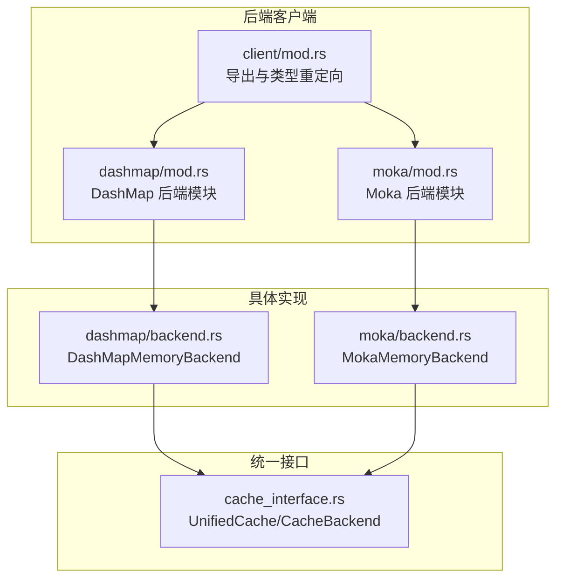
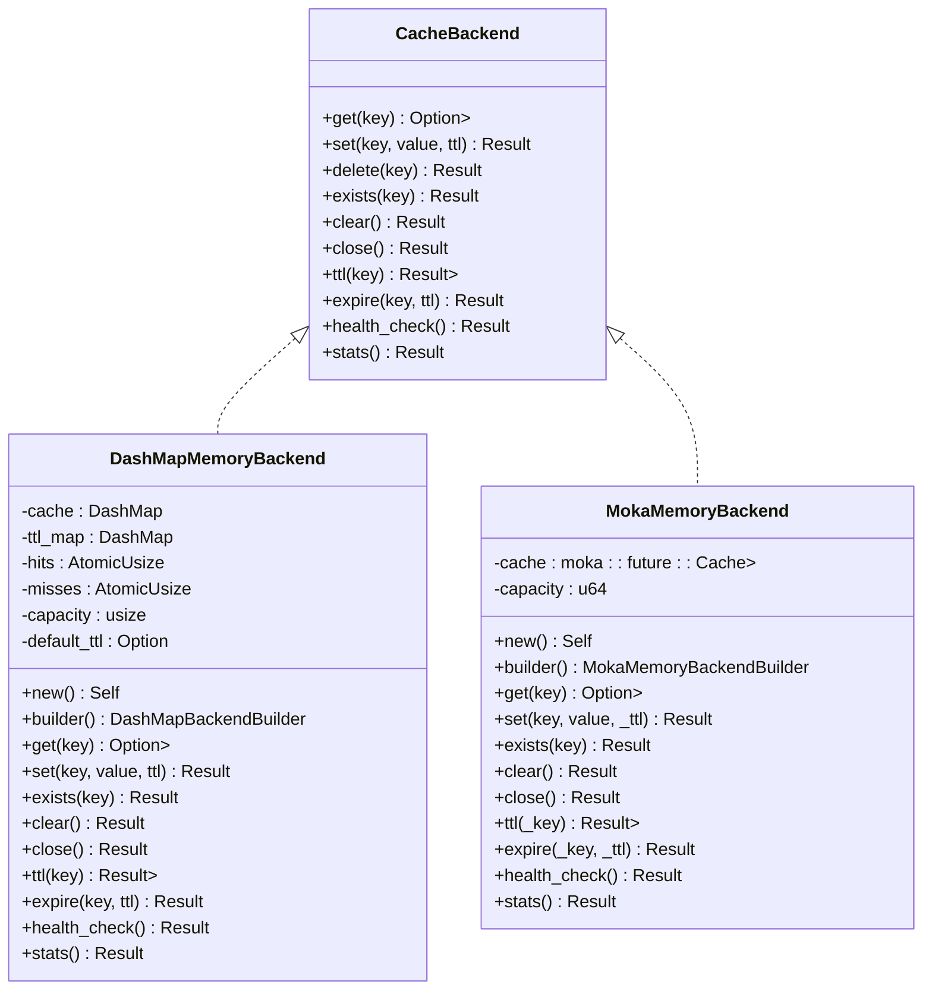
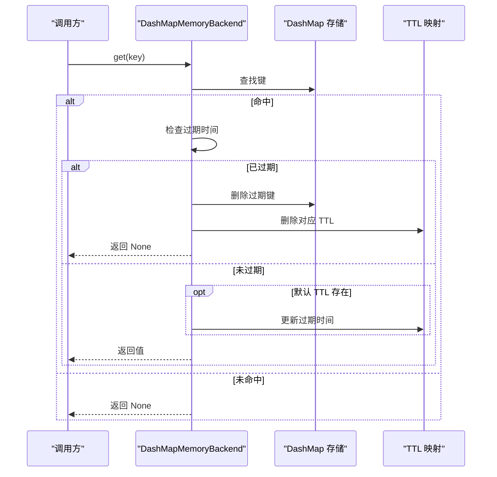
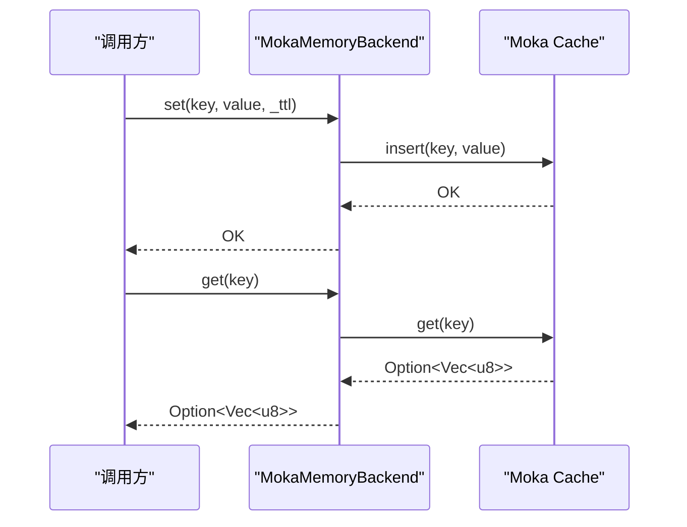
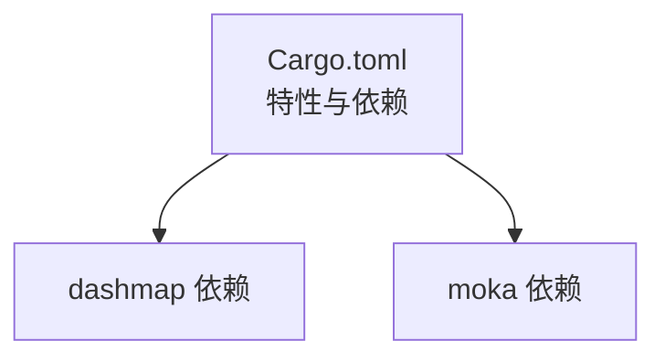

# 内存后端实现

<cite>
**本文档引用的文件**
- [Cargo.toml](file://Cargo.toml)
- [src/backend/client/mod.rs](file://src/backend/client/mod.rs)
- [src/backend/client/dashmap/mod.rs](file://src/backend/client/dashmap/mod.rs)
- [src/backend/client/dashmap/backend.rs](file://src/backend/client/dashmap/backend.rs)
- [src/backend/client/moka/mod.rs](file://src/backend/client/moka/mod.rs)
- [src/backend/client/moka/backend.rs](file://src/backend/client/moka/backend.rs)
- [src/backend/custom_tiered.rs](file://src/backend/custom_tiered.rs)
- [src/cache_interface.rs](file://src/cache_interface.rs)
- [src/features.rs](file://src/features.rs)
- [src/metrics.rs](file://src/metrics.rs)
</cite>

## 目录
1. [简介](#简介)
2. [项目结构](#项目结构)
3. [核心组件](#核心组件)
4. [架构概览](#架构概览)
5. [详细组件分析](#详细组件分析)
6. [依赖关系分析](#依赖关系分析)
7. [性能考量](#性能考量)
8. [故障排查指南](#故障排查指南)
9. [结论](#结论)

## 简介
本文件系统性阐述 Oxcache 内存缓存后端的实现细节，重点对比并深入解析两种内存后端：DashMap 并发哈希表与 Moka 高性能内存缓存。内容涵盖性能特征、适用场景、配置参数、容量管理、过期策略、内存回收机制、线程安全与并发控制、与磁盘缓存的差异与优势，以及性能调优建议、监控与故障排查方法。

## 项目结构
内存后端位于后端客户端模块中，分别提供 DashMap 与 Moka 两种实现，并通过统一接口对外暴露能力。特性开关控制后端可用性，构建器模式提供灵活配置。

**图表来源**
- [src/backend/client/mod.rs](file://src/backend/client/mod.rs#L7-L34)
- [src/backend/client/dashmap/mod.rs](file://src/backend/client/dashmap/mod.rs#L7-L14)
- [src/backend/client/moka/mod.rs](file://src/backend/client/moka/mod.rs#L7-L14)
- [src/backend/client/dashmap/backend.rs](file://src/backend/client/dashmap/backend.rs#L50-L64)
- [src/backend/client/moka/backend.rs](file://src/backend/client/moka/backend.rs#L18-L23)
- [src/cache_interface.rs](file://src/cache_interface.rs#L18-L58)

**章节来源**
- [src/backend/client/mod.rs](file://src/backend/client/mod.rs#L7-L34)
- [src/backend/client/dashmap/mod.rs](file://src/backend/client/dashmap/mod.rs#L7-L14)
- [src/backend/client/moka/mod.rs](file://src/backend/client/moka/mod.rs#L7-L14)

## 核心组件
- 内存后端类型枚举：用于标识与选择内存后端类型（Moka、DashMap）。
- DashMapMemoryBackend：基于 DashMap 的高并发内存缓存，支持容量上限与默认 TTL；需要手动 TTL 管理与逐出策略。
- MokaMemoryBackend：基于 Moka 的高性能内存缓存，内置 LRU/TinyLFU 驱逐与 TTL 支持，支持容量、TTL、空闲超时等配置。
- 统一缓存接口：提供 get/set/delete/exists/clear/close/ttl/expire/stats 等标准操作，便于上层抽象与多后端替换。

**章节来源**
- [src/backend/client/mod.rs](file://src/backend/client/mod.rs#L13-L24)
- [src/backend/client/dashmap/backend.rs](file://src/backend/client/dashmap/backend.rs#L50-L64)
- [src/backend/client/moka/backend.rs](file://src/backend/client/moka/backend.rs#L18-L23)
- [src/cache_interface.rs](file://src/cache_interface.rs#L18-L58)

## 架构概览
内存后端通过统一接口对外提供一致的能力，内部采用不同实现满足不同需求。DashMap 侧重高并发与无锁访问，Moka 侧重高性能与自动驱逐策略。

**图表来源**
- [src/cache_interface.rs](file://src/cache_interface.rs#L18-L58)
- [src/backend/client/dashmap/backend.rs](file://src/backend/client/dashmap/backend.rs#L50-L321)
- [src/backend/client/moka/backend.rs](file://src/backend/client/moka/backend.rs#L18-L123)

## 详细组件分析

### DashMap 内存后端
- 设计要点
  - 使用 DashMap 作为主存储，支持高并发读写，无锁设计降低竞争开销。
  - 通过独立的 TTL 映射维护过期时间，访问时检查并清理过期项。
  - 支持容量上限，达到上限时按“最老”策略逐出单条记录，维持容量。
  - 默认 TTL 可选，若存在则每次访问更新对应键的过期时间。
- 关键配置
  - 容量：默认 10,000 条目，可通过构建器设置。
  - 默认 TTL：可选，影响新插入条目的过期时间与访问时的刷新。
- 过期与回收
  - 访问时检查过期并清理；删除键时同步清理 TTL 映射。
  - 达到容量上限时逐出最旧条目，保证内存占用可控。
- 线程安全
  - DashMap 为并发安全容器，内部使用细粒度锁与无锁优化，适合高并发场景。
  - 统计计数器使用原子类型，避免额外锁争用。
- 适用场景
  - 高并发读写、对过期有严格控制需求、不需要自动驱逐策略的场景。
  - 适合需要“手动 TTL + 手动逐出”的精确控制。

**图表来源**
- [src/backend/client/dashmap/backend.rs](file://src/backend/client/dashmap/backend.rs#L157-L203)

**章节来源**
- [src/backend/client/dashmap/backend.rs](file://src/backend/client/dashmap/backend.rs#L50-L321)

### Moka 内存后端
- 设计要点
  - 基于 Moka 的高性能内存缓存，内置 LRU/TinyLFU 驱逐策略，自动管理容量。
  - 支持全局 TTL 与空闲超时（time-to-idle），插入时不可为每个键单独设置 TTL。
  - 通过构建器设置容量、TTL、空闲超时，运行时不可动态修改单键 TTL。
- 关键配置
  - 容量：默认 10,000 条目，可通过构建器设置。
  - TTL：全局生效，插入时忽略传入的 TTL。
  - 空闲超时：全局生效，用于空闲淘汰。
- 过期与回收
  - 插入时不支持单键 TTL；TTL 与空闲超时在构建阶段设定。
  - 通过 Moka 的内部机制自动驱逐，无需手动逐出。
- 线程安全
  - Moka 的 Cache 是并发安全的异步实现，适合高并发场景。
- 适用场景
  - 对吞吐量要求高、希望自动驱逐与 TTL 管理的场景。
  - 不需要细粒度单键 TTL 控制的通用缓存。

**图表来源**
- [src/backend/client/moka/backend.rs](file://src/backend/client/moka/backend.rs#L67-L123)

**章节来源**
- [src/backend/client/moka/backend.rs](file://src/backend/client/moka/backend.rs#L18-L175)

### 统一缓存接口与特性开关
- 统一接口
  - 提供 get_bytes/set_bytes/delete/exists/clear/close/ttl/expire/stats 等标准操作，便于上层抽象与多后端替换。
- 特性开关
  - 通过 Cargo features 控制后端可用性（如 moka、dashmap-backend），并在运行时检测可用性。
- 分层配置
  - 支持 L1/L2/L3 分层配置，内存后端可作为 L1 或 L2 使用，具备容量、TTL、空闲超时等参数校验与应用。

**章节来源**
- [src/cache_interface.rs](file://src/cache_interface.rs#L18-L58)
- [src/features.rs](file://src/features.rs#L33-L80)
- [src/backend/custom_tiered.rs](file://src/backend/custom_tiered.rs#L684-L732)

## 依赖关系分析
- 依赖库
  - DashMap：提供高并发无锁哈希表。
  - Moka：提供高性能内存缓存，内置 LRU/TinyLFU 驱逐与 TTL 支持。
- 特性映射
  - moka：启用 Moka 后端与相关功能。
  - dashmap-backend：启用 DashMap 后端。
  - metrics：启用指标收集与 DashMap 使用。
- 构建器与工厂
  - 通过构建器模式创建后端实例，支持容量、TTL、空闲超时等参数。
  - 默认内存后端为 Moka，可按需切换为 DashMap。

**图表来源**
- [Cargo.toml](file://Cargo.toml#L71-L81)
- [Cargo.toml](file://Cargo.toml#L297-L301)

**章节来源**
- [Cargo.toml](file://Cargo.toml#L71-L81)
- [Cargo.toml](file://Cargo.toml#L297-L301)

## 性能考量
- DashMap
  - 优点：高并发读写、无锁设计、可预测的容量上限与逐出策略。
  - 代价：需要手动 TTL 管理与逐出，对过期敏感场景需自行维护。
  - 适用：高并发、对过期控制有强约束、不需要自动驱逐的场景。
- Moka
  - 优点：内置 LRU/TinyLFU 驱逐、自动 TTL 管理、吞吐量高。
  - 代价：单键 TTL 不可变、全局 TTL/空闲超时配置。
  - 适用：通用高性能缓存、自动驱逐与 TTL 管理的场景。
- 配置建议
  - 容量：根据内存与键数量估算，预留一定冗余空间。
  - TTL：结合业务访问模式设置，避免过短导致频繁失效。
  - 空闲超时：对长时间未访问的数据进行回收，减少内存占用。
- 监控与指标
  - 利用指标系统收集命中率、操作总数、队列长度等关键指标，定期评估与调优。

[本节为通用性能讨论，不直接分析具体文件]

## 故障排查指南
- 常见问题
  - 过期不生效：确认是否使用了支持 TTL 的后端与正确的配置方式。
  - 内存占用过高：检查容量设置与 TTL 配置，必要时调整驱逐策略或缩短 TTL。
  - 并发冲突：确认使用的是并发安全的后端实现（DashMap/Moka），避免在非并发容器上进行高并发操作。
- 排查步骤
  - 检查特性开关是否正确启用（moka/dashmap-backend）。
  - 核对配置参数范围（容量、TTL、空闲超时），确保在允许范围内。
  - 通过 stats 接口查看当前状态（类型、容量、条目数、命中率等）。
  - 结合指标系统定位热点键与异常波动。
- 监控与日志
  - 启用 tracing/opentelemetry 等可观测性工具，记录关键操作与异常。
  - 使用 DashMap 的无锁迭代与原子计数器输出指标字符串，便于 Prometheus 等系统采集。

**章节来源**
- [src/backend/custom_tiered.rs](file://src/backend/custom_tiered.rs#L684-L732)
- [src/metrics.rs](file://src/metrics.rs#L267-L361)

## 结论
- 选择建议
  - 若需要精细的 TTL 控制与手动逐出策略，优先考虑 DashMap。
  - 若追求高吞吐与自动驱逐，优先考虑 Moka。
- 最佳实践
  - 明确业务场景与性能目标，合理设置容量与 TTL。
  - 结合指标系统持续监控与调优。
  - 在多后端场景中，通过统一接口与分层配置实现灵活替换与扩展。

[本节为总结性内容，不直接分析具体文件]