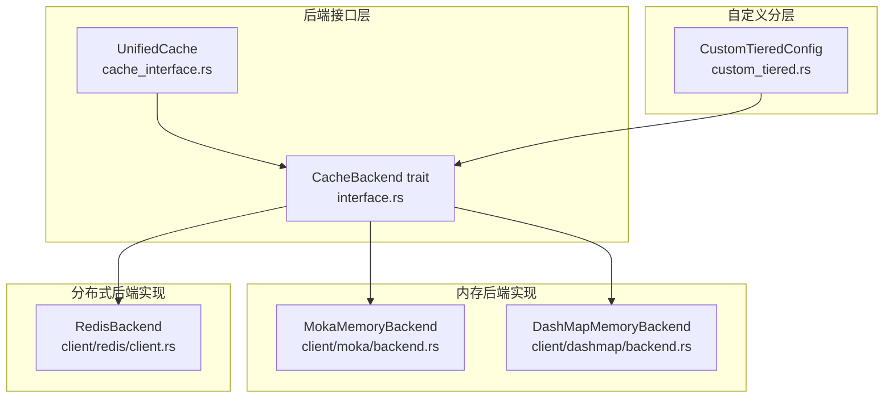
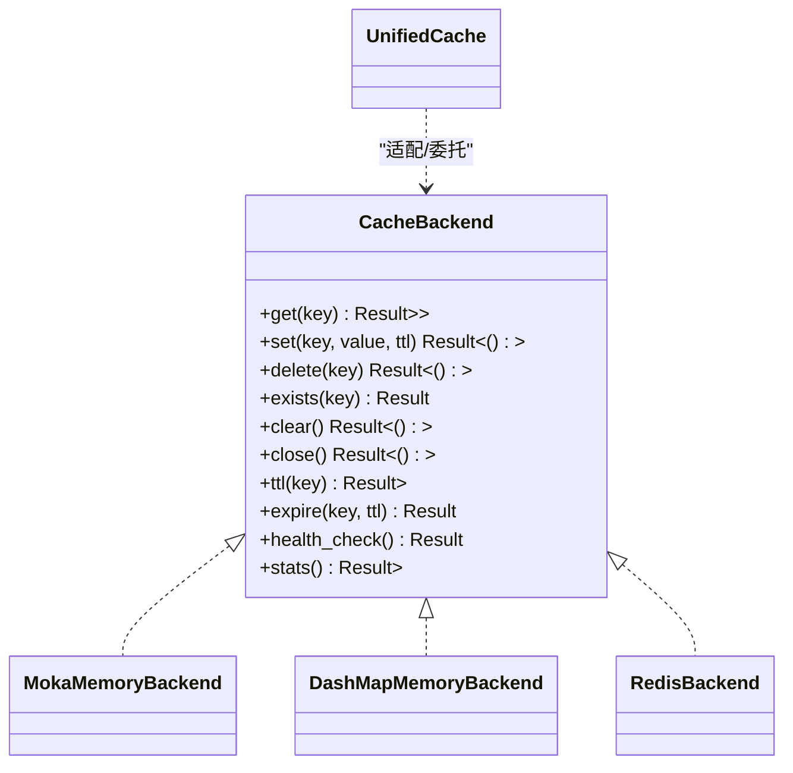
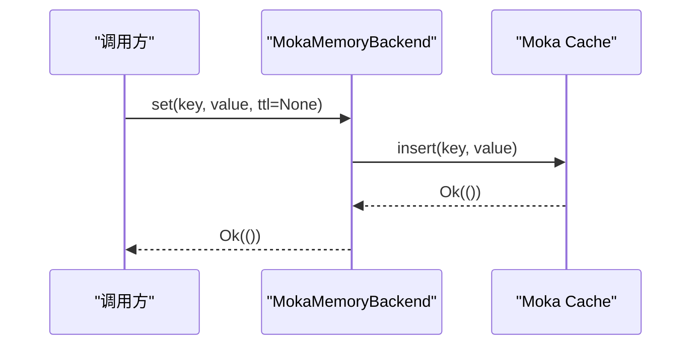
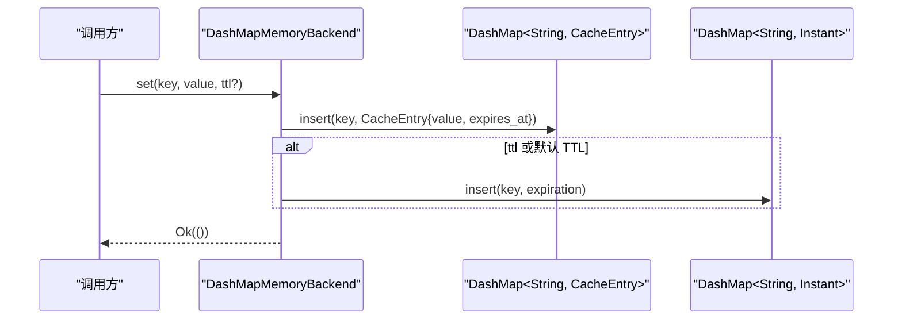
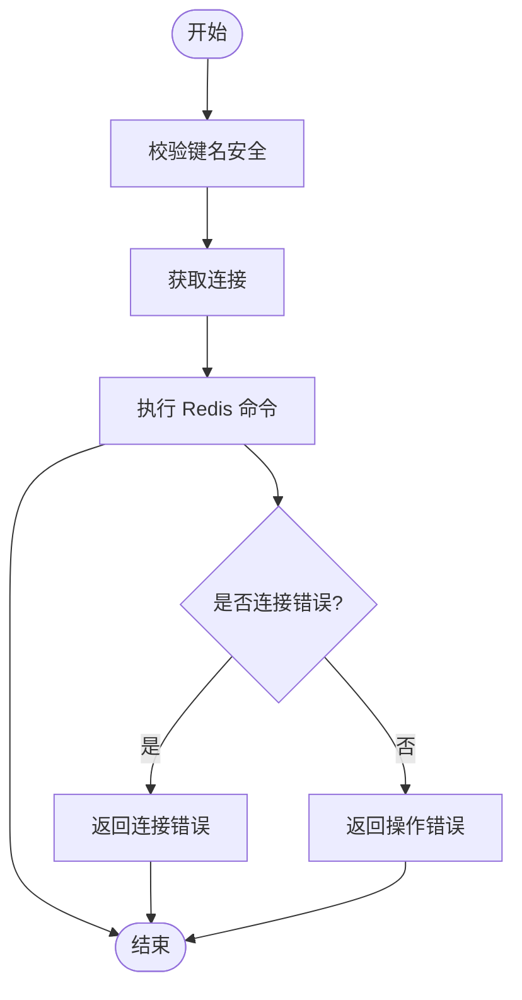
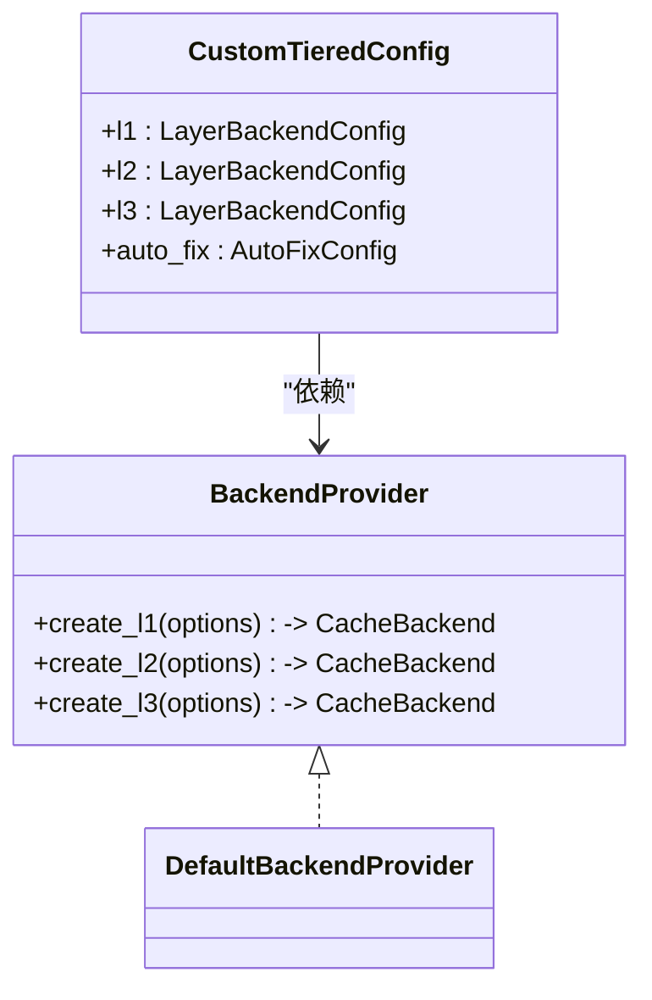
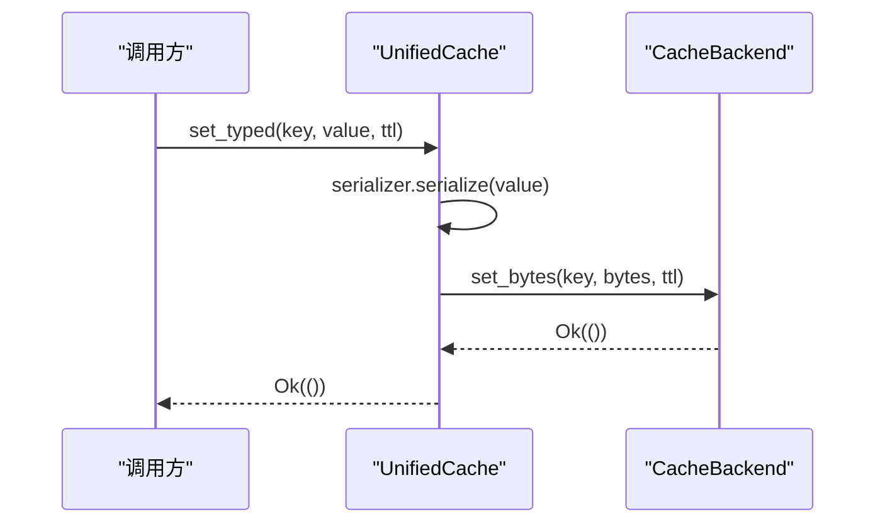
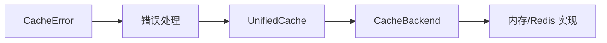

# 后端接口设计

<cite>
**本文档引用的文件**
- [src/backend/interface.rs](file://src/backend/interface.rs)
- [src/backend/client/mod.rs](file://src/backend/client/mod.rs)
- [src/backend/client/dashmap/backend.rs](file://src/backend/client/dashmap/backend.rs)
- [src/backend/client/moka/backend.rs](file://src/backend/client/moka/backend.rs)
- [src/backend/client/redis/client.rs](file://src/backend/client/redis/client.rs)
- [src/backend/custom_tiered.rs](file://src/backend/custom_tiered.rs)
- [src/cache_interface.rs](file://src/cache_interface.rs)
- [src/error.rs](file://src/error.rs)
- [src/lib.rs](file://src/lib.rs)
- [examples/src/01_basics/example_basic_operations.rs](file://examples/src/01_basics/example_basic_operations.rs)
</cite>

## 目录
1. [简介](#简介)
2. [项目结构](#项目结构)
3. [核心组件](#核心组件)
4. [架构总览](#架构总览)
5. [详细组件分析](#详细组件分析)
6. [依赖分析](#依赖分析)
7. [性能考量](#性能考量)
8. [故障排查指南](#故障排查指南)
9. [结论](#结论)
10. [附录](#附录)

## 简介
本文件系统性阐述 Oxcache 后端接口的设计原理与实现规范，重点围绕 CacheBackend trait 的设计思想、统一异步接口、错误处理机制、生命周期管理、类型安全与并发安全保证展开，并结合内存与 Redis 后端的具体实现，给出最佳实践、常见陷阱与扩展指导。

## 项目结构
后端接口位于 backend 子模块，核心接口定义在 interface.rs；具体实现包括内存（Moka、DashMap）与 Redis 后端；同时提供自定义分层后端配置能力。统一接口由 cache_interface.rs 汇聚，便于上层使用。

**图表来源**
- [src/backend/interface.rs](file://src/backend/interface.rs#L46-L166)
- [src/cache_interface.rs](file://src/cache_interface.rs#L18-L300)
- [src/backend/client/moka/backend.rs](file://src/backend/client/moka/backend.rs#L14-L123)
- [src/backend/client/dashmap/backend.rs](file://src/backend/client/dashmap/backend.rs#L23-L321)
- [src/backend/client/redis/client.rs](file://src/backend/client/redis/client.rs#L66-L499)
- [src/backend/custom_tiered.rs](file://src/backend/custom_tiered.rs#L766-L800)

**章节来源**
- [src/backend/mod.rs](file://src/backend/mod.rs#L1-L59)
- [src/backend/client/mod.rs](file://src/backend/client/mod.rs#L1-L34)

## 核心组件
- CacheBackend trait：定义统一的异步后端接口，涵盖 get、set、delete、exists、clear、close、ttl、expire、health_check、stats 等方法，采用 async_trait，确保跨后端一致性。
- 具体实现：
  - MokaMemoryBackend：基于 Moka 的高性能内存缓存，支持容量、TTL、Tti 等配置。
  - DashMapMemoryBackend：基于 DashMap 的高并发内存缓存，手动 TTL 管理，具备容量淘汰与命中率统计。
  - RedisBackend：基于 Redis 的分布式缓存，支持 Standalone/Sentinel/Cluster 模式，连接池与安全校验。
- 统一接口：UnifiedCache 将 CacheBackend 与类型化操作、批量操作、分层操作整合，便于上层使用。

**章节来源**
- [src/backend/interface.rs](file://src/backend/interface.rs#L46-L166)
- [src/backend/client/moka/backend.rs](file://src/backend/client/moka/backend.rs#L14-L123)
- [src/backend/client/dashmap/backend.rs](file://src/backend/client/dashmap/backend.rs#L23-L321)
- [src/backend/client/redis/client.rs](file://src/backend/client/redis/client.rs#L66-L499)
- [src/cache_interface.rs](file://src/cache_interface.rs#L18-L300)

## 架构总览
CacheBackend 采用策略模式，允许不同后端（内存/Redis/自定义分层）无缝替换。统一接口层提供类型化与批量操作，错误通过统一的 Result/CacheError 体系传递。

**图表来源**
- [src/backend/interface.rs](file://src/backend/interface.rs#L46-L166)
- [src/backend/client/moka/backend.rs](file://src/backend/client/moka/backend.rs#L66-L123)
- [src/backend/client/dashmap/backend.rs](file://src/backend/client/dashmap/backend.rs#L155-L321)
- [src/backend/client/redis/client.rs](file://src/backend/client/redis/client.rs#L215-L499)
- [src/cache_interface.rs](file://src/cache_interface.rs#L302-L373)

## 详细组件分析

### CacheBackend 设计思想与接口语义
- 统一异步接口：所有方法均为 async，返回 Result，确保跨后端行为一致。
- 错误处理：通过统一的 Result/CacheError 体系，区分连接、序列化、配置、超时、降级等错误类别。
- 生命周期管理：提供 close 与 clear，分别用于资源释放与清空数据；health_check 用于健康状态评估。
- 类型安全：接口以字节串形式提供原始能力，上层可通过 UnifiedCache 的类型化方法实现类型安全。
- 并发安全：内存后端使用并发容器（DashMap、Moka），Redis 后端通过连接池与命令队列保障并发安全。

接口方法语义要点（来自接口注释与实现）：
- get：返回值存在或不存在，失败返回错误。
- set：支持可选 TTL；失败返回错误。
- delete：删除键，失败返回错误。
- exists：判断键是否存在，失败返回错误。
- clear：清空缓存，失败返回错误。
- close：释放资源，失败返回错误。
- ttl：查询剩余 TTL，不存在或过期返回 None。
- expire：更新键 TTL，不存在返回 false。
- health_check：后端健康状态。
- stats：返回后端统计信息映射。

**章节来源**
- [src/backend/interface.rs](file://src/backend/interface.rs#L46-L166)
- [src/error.rs](file://src/error.rs#L75-L208)

### 内存后端实现对比：Moka vs DashMap
- MokaMemoryBackend
  - 特点：内置 LRU/TinyLFU 驱逐策略、TTL 支持（创建时设定）、无 per-entry TTL 插入与更新。
  - 行为：set 不支持 per-entry TTL，delete 使用 invalidate，clear/close 使用 invalidate_all。
  - 统计：暴露容量与 entry_count。
- DashMapMemoryBackend
  - 特点：高并发、无驱逐、手动 TTL 管理、容量淘汰、命中率统计。
  - 行为：get/set/delete/exists/clear/ttl/expire 均实现；支持默认 TTL 自动刷新。
  - 统计：容量、条目数、命中/未命中计数、命中率。

**图表来源**
- [src/backend/client/moka/backend.rs](file://src/backend/client/moka/backend.rs#L66-L96)

**图表来源**
- [src/backend/client/dashmap/backend.rs](file://src/backend/client/dashmap/backend.rs#L205-L225)

**章节来源**
- [src/backend/client/moka/backend.rs](file://src/backend/client/moka/backend.rs#L14-L123)
- [src/backend/client/dashmap/backend.rs](file://src/backend/client/dashmap/backend.rs#L23-L321)

### Redis 后端实现与安全校验
- 连接与模式：支持 Standalone/Sentinel/Cluster，连接字符串校验与连接池预留。
- 命令封装：get/set/delete/exists/ttl/expire/clear/health_check/stats 均基于 Redis 命令实现。
- 安全校验：键名与 SCAN 模式的安全校验，生产环境强制 TLS（可通过环境变量放宽用于测试）。
- 错误处理：区分连接错误与操作错误，统一映射到 CacheError。

**图表来源**
- [src/backend/client/redis/client.rs](file://src/backend/client/redis/client.rs#L215-L388)

**章节来源**
- [src/backend/client/redis/client.rs](file://src/backend/client/redis/client.rs#L15-L522)

### 自定义分层后端配置
- 支持 L1/L2/L3 层级与后端类型枚举，自动验证层级限制与修复不合理配置。
- BackendProvider trait 支持依赖注入，DefaultBackendProvider 提供默认 L1/L2/L3 后端创建逻辑。
- 配置验证包含容量、TTL、TTI、自定义名称等范围与格式校验。

**图表来源**
- [src/backend/custom_tiered.rs](file://src/backend/custom_tiered.rs#L766-L800)
- [src/backend/custom_tiered.rs](file://src/backend/custom_tiered.rs#L587-L682)

**章节来源**
- [src/backend/custom_tiered.rs](file://src/backend/custom_tiered.rs#L309-L517)

### 统一接口与类型安全
- UnifiedCache 将 CacheBackend 与类型化、批量、分层操作整合，提供 serializer 抽象，默认 JSON 或 Bincode。
- 通过 blanket impl 将任何实现 CacheBackend 的类型自动实现 UnifiedCache，简化上层使用。

**图表来源**
- [src/cache_interface.rs](file://src/cache_interface.rs#L145-L154)
- [src/cache_interface.rs](file://src/cache_interface.rs#L302-L373)

**章节来源**
- [src/cache_interface.rs](file://src/cache_interface.rs#L18-L300)

## 依赖分析
- 接口依赖：CacheBackend 是后端实现的唯一契约；各实现均直接实现该 trait。
- 统一接口依赖：UnifiedCache 依赖 CacheBackend，并通过 blanket impl 自动适配。
- 错误依赖：所有后端操作返回统一的 Result/CacheError，便于上层统一处理。
- 功能特性：内存后端依赖 moka/dashmap，Redis 后端依赖 redis；通过 feature gate 控制可用性。

**图表来源**
- [src/error.rs](file://src/error.rs#L75-L208)
- [src/backend/interface.rs](file://src/backend/interface.rs#L46-L166)
- [src/cache_interface.rs](file://src/cache_interface.rs#L302-L373)

**章节来源**
- [src/lib.rs](file://src/lib.rs#L436-L443)
- [src/backend/client/mod.rs](file://src/backend/client/mod.rs#L1-L34)

## 性能考量
- 内存后端
  - Moka：适合高吞吐、需要驱逐策略的场景；TTL 在创建时设定，适合全局 TTL 场景。
  - DashMap：适合高并发读写且无需驱逐的场景；需自行管理 TTL 与容量淘汰。
- Redis 后端
  - 连接池与命令队列提升并发；注意网络延迟与命令超时配置。
  - SCAN 清理避免阻塞，但需注意键数量与扫描批次大小。
- 统一接口
  - 类型化序列化带来额外 CPU 开销，建议在热点路径谨慎使用；可结合批量操作减少往返。

[本节为通用性能讨论，不直接分析具体文件]

## 故障排查指南
- 常见错误类型
  - 连接错误：网络不通、认证失败、超时。
  - 操作错误：命令语法、键不存在、权限不足。
  - 配置错误：键过长、值过大、参数越界。
  - 降级错误：后端不可用时进入降级模式。
- 排查步骤
  - 使用 health_check 判断后端健康状态。
  - 通过 stats 获取后端统计信息辅助定位。
  - 对 Redis 后端，检查连接字符串、TLS 设置与安全校验规则。
  - 对内存后端，确认容量、TTL 配置与驱逐策略是否符合预期。

**章节来源**
- [src/error.rs](file://src/error.rs#L75-L208)
- [src/backend/client/redis/client.rs](file://src/backend/client/redis/client.rs#L455-L474)
- [src/backend/client/moka/backend.rs](file://src/backend/client/moka/backend.rs#L108-L122)
- [src/backend/client/dashmap/backend.rs](file://src/backend/client/dashmap/backend.rs#L300-L320)

## 结论
CacheBackend 通过统一的异步接口与严格的错误处理，为 Oxcache 提供了可插拔、可扩展的后端抽象。内存与 Redis 后端分别针对不同场景优化，配合自定义分层配置与统一接口，既保证了类型安全与并发安全，又兼顾了性能与可维护性。建议在生产环境中优先选择 Moka 或 DashMap 作为 L1，Redis 作为 L2/L3，并结合健康检查与统计监控持续优化。

[本节为总结性内容，不直接分析具体文件]

## 附录

### 接口方法语义速查
- get(key)：获取字节值，不存在返回 None。
- set(key, value, ttl)：设置字节值，支持可选 TTL。
- delete(key)：删除键。
- exists(key)：判断键是否存在。
- clear()：清空缓存。
- close()：释放资源。
- ttl(key)：查询剩余 TTL。
- expire(key, ttl)：更新键 TTL。
- health_check()：健康检查。
- stats()：返回统计信息。

**章节来源**
- [src/backend/interface.rs](file://src/backend/interface.rs#L46-L166)

### 类型安全与序列化
- 字节接口：CacheBackend 以字节形式提供原始能力，保证类型无关。
- 类型化接口：UnifiedCache 提供类型化 set/get 与批量操作，内部通过序列化器完成序列化/反序列化。
- 序列化器：默认 JSON 或 Bincode，可通过配置切换。

**章节来源**
- [src/cache_interface.rs](file://src/cache_interface.rs#L133-L154)
- [src/cache_interface.rs](file://src/cache_interface.rs#L346-L364)

### 并发安全与生命周期
- 并发安全：内存后端使用并发容器；Redis 后端使用连接池与命令队列。
- 生命周期：close 用于优雅释放；clear 用于清空数据；health_check 用于健康检查。

**章节来源**
- [src/backend/client/moka/backend.rs](file://src/backend/client/moka/backend.rs#L93-L96)
- [src/backend/client/dashmap/backend.rs](file://src/backend/client/dashmap/backend.rs#L261-L263)
- [src/backend/client/redis/client.rs](file://src/backend/client/redis/client.rs#L450-L453)

### 最佳实践与常见陷阱
- 最佳实践
  - L1 选用 Moka/DashMap，L2/L3 选用 Redis。
  - 明确 TTL 策略：Moka 使用全局 TTL，DashMap 使用手动 TTL。
  - 使用 health_check 与 stats 进行监控。
  - Redis 生产环境强制 TLS，严格校验键名与扫描模式。
- 常见陷阱
  - Moka set 不支持 per-entry TTL，需在创建时设定。
  - DashMap 需自行处理过期与容量淘汰。
  - Redis 清理使用 SCAN 替代 FLUSHDB，避免影响其他连接/数据库。

**章节来源**
- [src/backend/client/moka/backend.rs](file://src/backend/client/moka/backend.rs#L72-L77)
- [src/backend/client/dashmap/backend.rs](file://src/backend/client/dashmap/backend.rs#L93-L108)
- [src/backend/client/redis/client.rs](file://src/backend/client/redis/client.rs#L390-L448)

### 扩展与自定义实现指导
- 实现 CacheBackend：遵循统一异步接口与错误处理规范，确保并发安全与生命周期管理。
- 自定义分层：通过 CustomTieredConfig 与 BackendProvider 注入自定义后端，利用层级限制与自动修复机制保证配置合理性。
- 示例参考：示例程序展示基本 CRUD 操作流程，便于对照实现。

**章节来源**
- [src/backend/custom_tiered.rs](file://src/backend/custom_tiered.rs#L587-L682)
- [examples/src/01_basics/example_basic_operations.rs](file://examples/src/01_basics/example_basic_operations.rs#L21-L72)