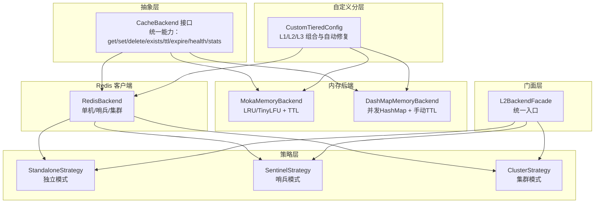
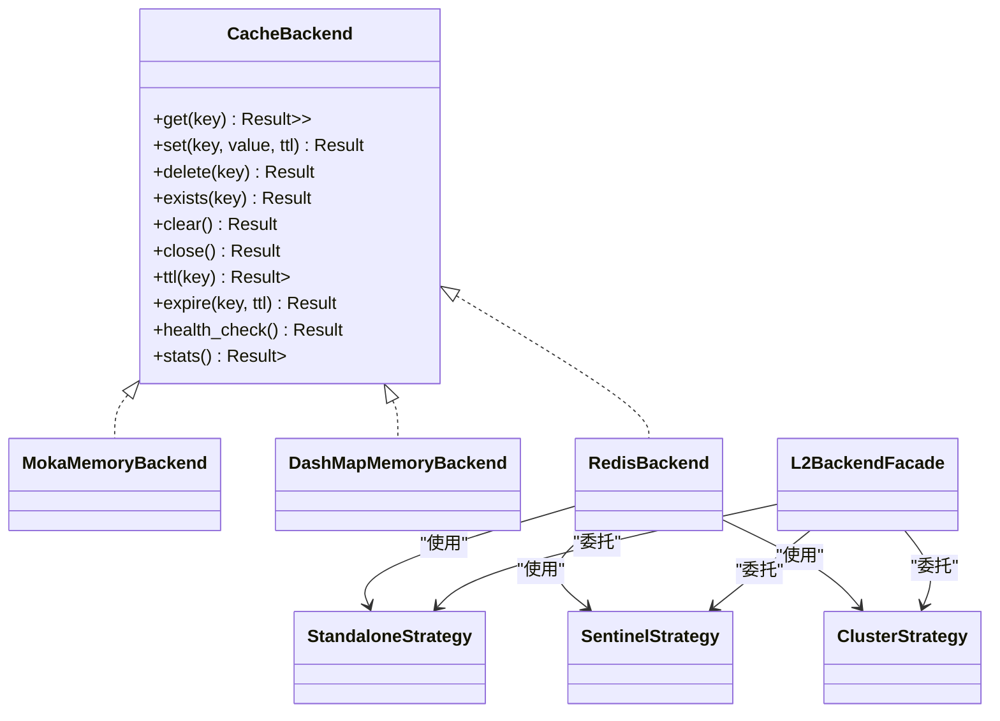
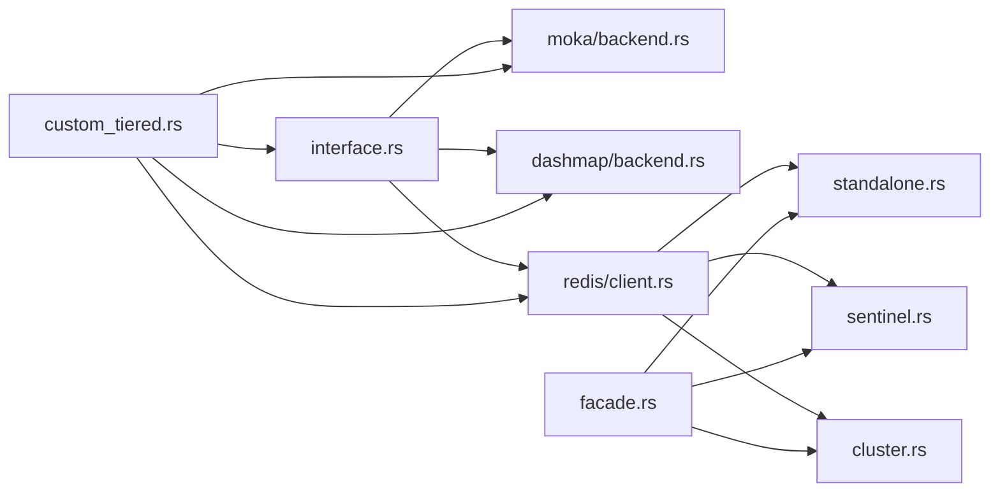

# 后端架构

<cite>
**本文引用的文件**
- [src/lib.rs](file://src/lib.rs)
- [src/backend/mod.rs](file://src/backend/mod.rs)
- [src/backend/client/mod.rs](file://src/backend/client/mod.rs)
- [src/backend/client/moka/backend.rs](file://src/backend/client/moka/backend.rs)
- [src/backend/client/dashmap/backend.rs](file://src/backend/client/dashmap/backend.rs)
- [src/backend/interface.rs](file://src/backend/interface.rs)
- [src/backend/custom_tiered.rs](file://src/backend/custom_tiered.rs)
- [src/backend/strategy/mod.rs](file://src/backend/strategy/mod.rs)
- [src/backend/strategy/traits.rs](file://src/backend/strategy/traits.rs)
- [src/backend/strategy/standalone.rs](file://src/backend/strategy/standalone.rs)
- [src/backend/strategy/sentinel.rs](file://src/backend/strategy/sentinel.rs)
- [src/backend/strategy/cluster.rs](file://src/backend/strategy/cluster.rs)
- [src/backend/strategy/facade.rs](file://src/backend/strategy/facade.rs)
- [src/backend/client/redis/mod.rs](file://src/backend/client/redis/mod.rs)
</cite>

## 目录
1. [简介](#简介)
2. [项目结构](#项目结构)
3. [核心组件](#核心组件)
4. [架构总览](#架构总览)
5. [详细组件分析](#详细组件分析)
6. [依赖分析](#依赖分析)
7. [性能考量](#性能考量)
8. [故障排查指南](#故障排查指南)
9. [结论](#结论)
10. [附录](#附录)

## 简介
本文件系统性阐述 Oxcache 的后端架构设计，重点覆盖以下方面：
- 抽象层与接口设计：统一的 CacheBackend 抽象，屏蔽不同后端差异
- 客户端实现：内存后端（Moka、DashMap）与 Redis 后端
- 策略模式应用：独立模式、哨兵模式、集群模式的统一接入
- 后端选择与负载均衡：基于配置的模式选择与连接管理
- 自定义后端开发：通过 Provider 与配置校验实现可插拔扩展
- 配置与调优：容量、TTL、命令超时等关键参数
- 故障转移与高可用：健康检查、降级与回退策略
- 性能监控与健康检查：统计指标与运行态健康度评估

## 项目结构
Oxcache 的后端子系统采用“抽象层 + 客户端实现 + 策略封装”的分层设计：
- 抽象层：定义 CacheBackend 接口，约束所有后端必须实现的能力
- 客户端层：内存后端（Moka、DashMap）与 Redis 客户端
- 策略层：针对 Redis 的独立、哨兵、集群三种部署模式的策略实现
- 门面层：L2BackendFacade 将具体策略对外暴露统一接口
- 自定义分层：CustomTieredConfig 提供灵活的 L1/L2/L3 组合与自动修复

图表来源
- [src/backend/interface.rs](file://src/backend/interface.rs#L46-L166)
- [src/backend/client/moka/backend.rs](file://src/backend/client/moka/backend.rs#L14-L123)
- [src/backend/client/dashmap/backend.rs](file://src/backend/client/dashmap/backend.rs#L23-L321)
- [src/backend/strategy/standalone.rs](file://src/backend/strategy/standalone.rs#L18-L418)
- [src/backend/strategy/sentinel.rs](file://src/backend/strategy/sentinel.rs#L21-L432)
- [src/backend/strategy/cluster.rs](file://src/backend/strategy/cluster.rs#L21-L436)
- [src/backend/strategy/facade.rs](file://src/backend/strategy/facade.rs#L18-L222)
- [src/backend/custom_tiered.rs](file://src/backend/custom_tiered.rs#L766-L800)

章节来源
- [src/backend/mod.rs](file://src/backend/mod.rs#L1-L59)
- [src/backend/client/mod.rs](file://src/backend/client/mod.rs#L1-L34)
- [src/backend/strategy/mod.rs](file://src/backend/strategy/mod.rs#L1-L24)

## 核心组件
- CacheBackend 抽象接口：定义缓存后端的最小能力集，包括读写、存在性、过期、健康检查与统计
- 内存后端
  - MokaMemoryBackend：基于 Moka 的高性能内存缓存，支持容量上限、TTL、TinyLFU/LRU 策略
  - DashMapMemoryBackend：基于 DashMap 的并发 HashMap，支持手动 TTL 与容量驱逐
- Redis 后端与策略
  - StandaloneStrategy：单机 Redis，支持主从读写分离
  - SentinelStrategy：Redis Sentinel 高可用
  - ClusterStrategy：Redis Cluster 分布式
  - L2BackendFacade：统一门面，按配置选择具体策略
- 自定义分层与配置
  - CustomTieredConfig：支持 L1/L2/L3 的灵活组合与自动修复
  - BackendType/BackendProvider：后端类型枚举与依赖注入

章节来源
- [src/backend/interface.rs](file://src/backend/interface.rs#L46-L166)
- [src/backend/client/moka/backend.rs](file://src/backend/client/moka/backend.rs#L14-L123)
- [src/backend/client/dashmap/backend.rs](file://src/backend/client/dashmap/backend.rs#L23-L321)
- [src/backend/strategy/standalone.rs](file://src/backend/strategy/standalone.rs#L18-L418)
- [src/backend/strategy/sentinel.rs](file://src/backend/strategy/sentinel.rs#L21-L432)
- [src/backend/strategy/cluster.rs](file://src/backend/strategy/cluster.rs#L21-L436)
- [src/backend/strategy/facade.rs](file://src/backend/strategy/facade.rs#L18-L222)
- [src/backend/custom_tiered.rs](file://src/backend/custom_tiered.rs#L362-L517)

## 架构总览
Oxcache 的后端架构遵循“接口抽象 + 多实现 + 策略封装 + 门面统一”的设计模式：
- 接口层：CacheBackend 统一所有后端能力
- 实现层：内存与 Redis 各自实现
- 策略层：针对 Redis 的多种部署形态
- 门面层：L2BackendFacade 将策略对外暴露一致接口
- 配置层：CustomTieredConfig 支持 L1/L2/L3 组合与自动修复

图表来源
- [src/backend/interface.rs](file://src/backend/interface.rs#L46-L166)
- [src/backend/client/moka/backend.rs](file://src/backend/client/moka/backend.rs#L14-L123)
- [src/backend/client/dashmap/backend.rs](file://src/backend/client/dashmap/backend.rs#L23-L321)
- [src/backend/strategy/standalone.rs](file://src/backend/strategy/standalone.rs#L18-L418)
- [src/backend/strategy/sentinel.rs](file://src/backend/strategy/sentinel.rs#L21-L432)
- [src/backend/strategy/cluster.rs](file://src/backend/strategy/cluster.rs#L21-L436)
- [src/backend/strategy/facade.rs](file://src/backend/strategy/facade.rs#L18-L222)

## 详细组件分析

### 抽象层与接口设计
- 设计目标：通过 CacheBackend 抽象屏蔽底层差异，统一上层调用
- 关键能力：读取、写入、删除、存在性、过期、健康检查、统计
- 设计模式：策略模式的接口基座，便于替换与扩展

章节来源
- [src/backend/interface.rs](file://src/backend/interface.rs#L46-L166)

### 内存后端实现对比（Moka vs DashMap）

#### MokaMemoryBackend
- 特点
  - 基于 Moka 的高性能内存缓存
  - 支持容量上限、TTL、TinyLFU/LRU 策略
  - 适合 L1 场景，吞吐高、延迟低
- 能力边界
  - 插入时不支持单条 TTL（TTL 在构建时设定）
  - 不支持单条键 TTL 更新
  - 提供容量与条目计数统计
- 适用场景
  - 高并发、低延迟的一级缓存
  - 需要自动驱逐与全局 TTL 的场景

章节来源
- [src/backend/client/moka/backend.rs](file://src/backend/client/moka/backend.rs#L14-L123)

#### DashMapMemoryBackend
- 特点
  - 基于 DashMap 的并发 HashMap
  - 无内置驱逐策略，需手动容量控制
  - 支持手动 TTL 与命中率统计
- 能力边界
  - 插入时可指定 TTL，访问时更新 TTL
  - 存在过期键时会清理
  - 提供命中/未命中计数与命中率
- 适用场景
  - 需要细粒度 TTL 控制与高并发读写的场景
  - 对驱逐策略有定制需求的 L1 缓存

章节来源
- [src/backend/client/dashmap/backend.rs](file://src/backend/client/dashmap/backend.rs#L23-L321)

#### 内存后端性能对比与选择建议
- Moka 更适合追求吞吐与自动驱逐的场景；DashMap 更适合需要精确 TTL 与并发控制的场景
- 两者均提供健康检查与统计接口，便于监控与调优

章节来源
- [src/backend/client/moka/backend.rs](file://src/backend/client/moka/backend.rs#L108-L122)
- [src/backend/client/dashmap/backend.rs](file://src/backend/client/dashmap/backend.rs#L300-L320)

### Redis 后端与策略模式

#### 策略特征 L2BackendStrategy
- 统一 Redis 后端能力：get/set/delete/exists/expire/ttl、版本化操作、分布式锁、批量操作、SCAN、健康检查、命令超时
- 通过枚举模式支持独立、哨兵、集群三种部署形态

章节来源
- [src/backend/strategy/traits.rs](file://src/backend/strategy/traits.rs#L85-L303)

#### 独立模式（StandaloneStrategy）
- 支持单实例与可选从库读写分离
- 提供 GET/SET/DEL/EXISTS/EXPIRE/TTL、MGET/MSET、SCAN、锁与 CAS 等能力
- 健康检查通过 PING 实现

章节来源
- [src/backend/strategy/standalone.rs](file://src/backend/strategy/standalone.rs#L18-L418)

#### 哨兵模式（SentinelStrategy）
- 支持 Redis Sentinel 高可用，自动处理主从切换
- 提供与独立模式一致的能力集合
- 通过 Lua 脚本实现 CAS 与锁的原子性

章节来源
- [src/backend/strategy/sentinel.rs](file://src/backend/strategy/sentinel.rs#L21-L432)

#### 集群模式（ClusterStrategy）
- 支持 Redis Cluster 分布式
- 针对键槽位分布的 MGET/MSET 与 SCAN 实现做了适配
- 通过 Lua 脚本保障 CAS 与锁的原子性

章节来源
- [src/backend/strategy/cluster.rs](file://src/backend/strategy/cluster.rs#L21-L436)

#### 门面层 L2BackendFacade
- 根据配置选择具体策略（独立/哨兵/集群）
- 统一对外暴露 L2BackendStrategy 接口
- 内置版本缓存以优化版本化读取

章节来源
- [src/backend/strategy/facade.rs](file://src/backend/strategy/facade.rs#L18-L222)

### 自定义后端与分层配置
- BackendType：枚举支持 Moka、DashMap、Redis、Sqlite、Tiered、Custom
- Layer 与 LayerRestriction：限定后端在 L1/L2/L3 的适用层级
- CustomTieredConfig：支持 L1/L2/L3 的灵活组合与自动修复
- BackendProvider：依赖注入接口，支持自定义后端创建

章节来源
- [src/backend/custom_tiered.rs](file://src/backend/custom_tiered.rs#L309-L517)

### 后端选择与负载均衡策略
- 选择依据
  - 功能特性：是否启用 moka、dashmap、redis、sqlite 等特性
  - 部署形态：独立/哨兵/集群
  - 层级需求：L1 优先选择内存后端，L2/L3 选择 Redis/持久化
- 负载均衡
  - 独立模式：可通过配置主从库连接实现读写分离
  - 哨兵模式：自动感知主从切换
  - 集群模式：键槽位路由，天然分布式

章节来源
- [src/backend/custom_tiered.rs](file://src/backend/custom_tiered.rs#L362-L451)
- [src/backend/strategy/facade.rs](file://src/backend/strategy/facade.rs#L68-L98)

### Redis 客户端与 Provider
- RedisBackend 与 RedisBackendBuilder：Redis 后端的构建与配置
- DefaultRedisProvider/RedisProvider：提供不同部署形态的客户端与连接管理器

章节来源
- [src/backend/client/redis/mod.rs](file://src/backend/client/redis/mod.rs#L1-L15)

## 依赖分析
- 模块耦合
  - interface.rs 为所有后端实现的共同依赖
  - strategy/*.rs 依赖 interface.rs 与 config/service 中的 L2Config
  - facade.rs 依赖各策略实现，并通过 Provider 获取客户端
  - custom_tiered.rs 依赖 client 与 interface，实现灵活组合
- 外部依赖
  - Moka/DashMap/Redis 客户端库
  - 异步运行时与 tracing 日志

图表来源
- [src/backend/interface.rs](file://src/backend/interface.rs#L46-L166)
- [src/backend/client/moka/backend.rs](file://src/backend/client/moka/backend.rs#L14-L123)
- [src/backend/client/dashmap/backend.rs](file://src/backend/client/dashmap/backend.rs#L23-L321)
- [src/backend/strategy/standalone.rs](file://src/backend/strategy/standalone.rs#L18-L418)
- [src/backend/strategy/sentinel.rs](file://src/backend/strategy/sentinel.rs#L21-L432)
- [src/backend/strategy/cluster.rs](file://src/backend/strategy/cluster.rs#L21-L436)
- [src/backend/strategy/facade.rs](file://src/backend/strategy/facade.rs#L18-L222)
- [src/backend/custom_tiered.rs](file://src/backend/custom_tiered.rs#L766-L800)

## 性能考量
- 内存后端
  - Moka：适合高吞吐、自动驱逐与全局 TTL 的场景
  - DashMap：适合需要细粒度 TTL 与高并发读写的场景
- Redis 后端
  - 独立模式：延迟低，适合小规模部署
  - 哨兵模式：高可用，主从切换带来一定开销
  - 集群模式：分布式扩展强，键槽位路由与跨节点操作增加复杂度
- 批量操作与 SCAN
  - MGET/MSET 在 Redis 中为原子批量写入，注意键分布与 TTL 设置
  - SCAN 为增量遍历，需结合游标与限制返回数量
- 命令超时与健康检查
  - 通过 command_timeout 控制命令超时，避免阻塞
  - health_check/ping 用于快速判断后端健康状态

## 故障排查指南
- 健康检查
  - Redis：通过 PING/PONG 判断连通性
  - 内存后端：始终返回健康（内存不可用时应触发降级）
- 常见问题
  - 过期键：内存后端访问时会清理过期键；Redis 后端 TTL 查询返回 -2 表示不存在
  - 批量操作：Redis Cluster 的 MGET/MSET 要求键在同一槽位，否则退化为逐个请求
  - 锁与 CAS：使用 Lua 脚本保证原子性，注意锁值一致性与释放条件
- 降级与回退
  - 当 Redis 不可用时，可回退至内存后端（取决于配置与 Provider）
  - 自动修复：CustomTieredConfig 支持自动修复不合理的层级分配

章节来源
- [src/backend/strategy/standalone.rs](file://src/backend/strategy/standalone.rs#L390-L406)
- [src/backend/strategy/sentinel.rs](file://src/backend/strategy/sentinel.rs#L402-L422)
- [src/backend/strategy/cluster.rs](file://src/backend/strategy/cluster.rs#L406-L426)
- [src/backend/custom_tiered.rs](file://src/backend/custom_tiered.rs#L776-L800)

## 结论
Oxcache 的后端架构通过统一的抽象接口与策略封装，实现了内存与 Redis 后端的无缝切换与组合。内存后端（Moka/DashMap）与 Redis 后端（独立/哨兵/集群）在能力与性能上各有侧重，配合自定义分层配置与 Provider 注入，能够灵活适配不同业务场景。通过健康检查、命令超时与自动修复等机制，系统具备良好的高可用与可维护性。

## 附录

### 后端接口设计原则与实现要求
- 设计原则
  - 统一抽象：CacheBackend 提供一致能力集
  - 可插拔：通过 Provider 与配置实现后端替换
  - 可观测：提供 health_check 与 stats
- 实现要求
  - 必须实现 get/set/delete/exists/clear/close
  - 可选实现 ttl/expire、版本化与锁、批量操作、SCAN
  - 健康检查与统计需稳定可靠

章节来源
- [src/backend/interface.rs](file://src/backend/interface.rs#L46-L166)

### 自定义后端开发与集成步骤
- 开发步骤
  - 实现 CacheBackend 接口
  - 在 BackendType 中注册后端类型
  - 通过 BackendProvider 注入创建逻辑
  - 在 CustomTieredConfig 中配置层级与参数
- 集成步骤
  - 选择合适的层级（L1/L2/L3）
  - 配置容量、TTL、命令超时等参数
  - 启用相应特性（如 moka、redis、sqlite）
  - 进行健康检查与性能测试

章节来源
- [src/backend/custom_tiered.rs](file://src/backend/custom_tiered.rs#L587-L732)

### 配置与调优要点
- 内存后端
  - 容量上限：避免内存溢出
  - TTL/TTI：平衡命中率与内存占用
- Redis 后端
  - 命令超时：避免阻塞影响整体性能
  - 批量操作：合理设置 COUNT 与键分布
  - SCAN：限制每次返回数量与总次数
- 自定义分层
  - 自动修复：启用以规避不合理配置
  - 层级限制：遵循后端类型推荐层级

章节来源
- [src/backend/custom_tiered.rs](file://src/backend/custom_tiered.rs#L216-L307)
- [src/backend/strategy/traits.rs](file://src/backend/strategy/traits.rs#L298-L302)