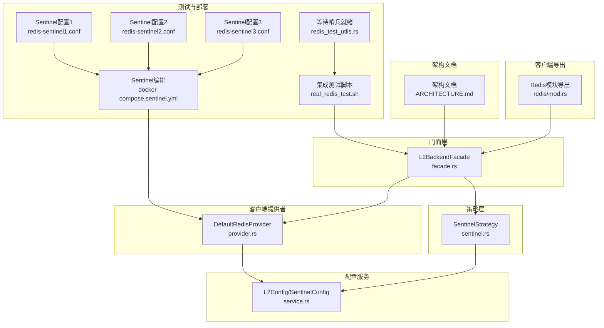
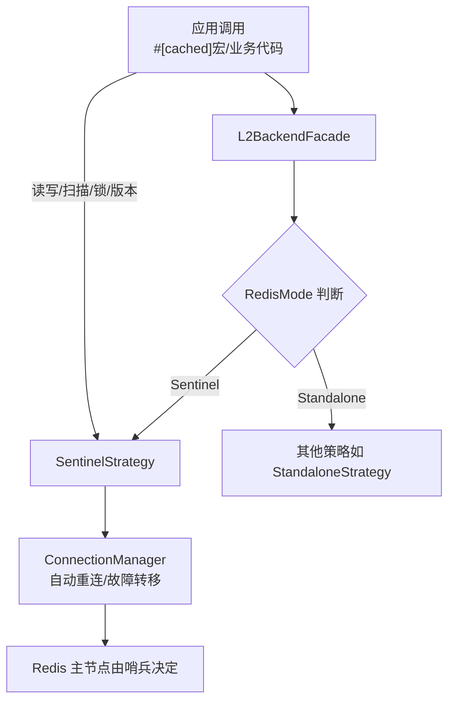
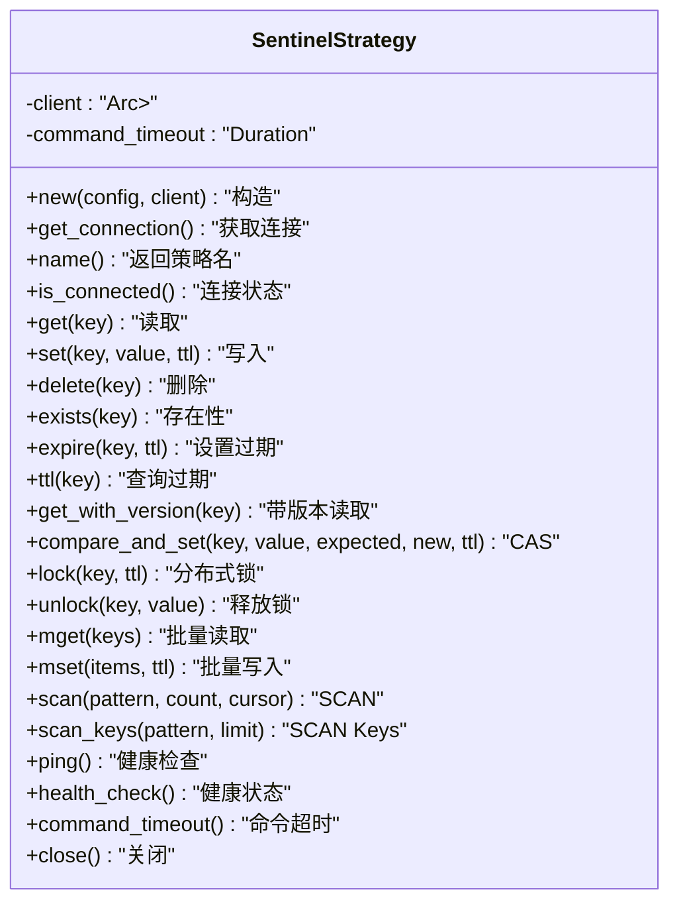
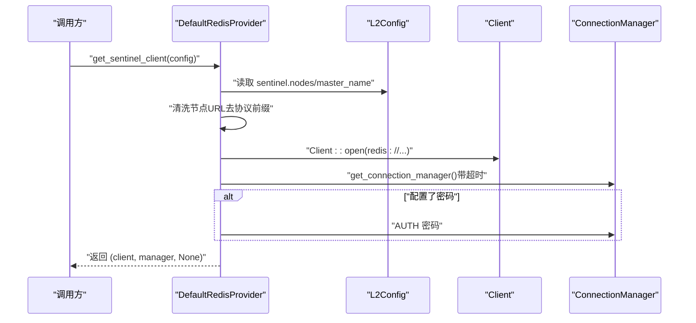
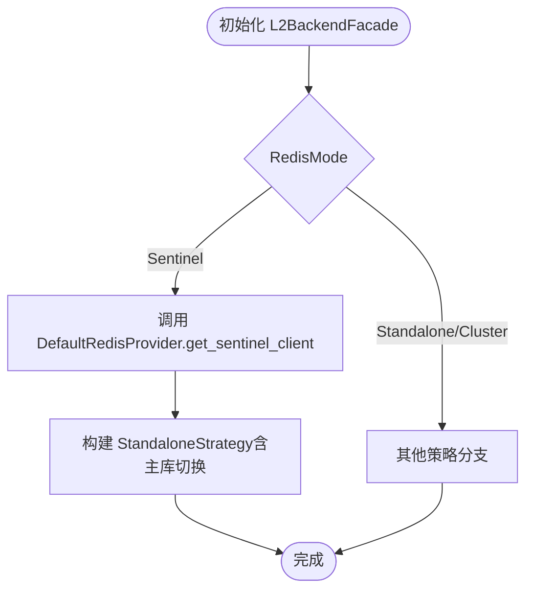
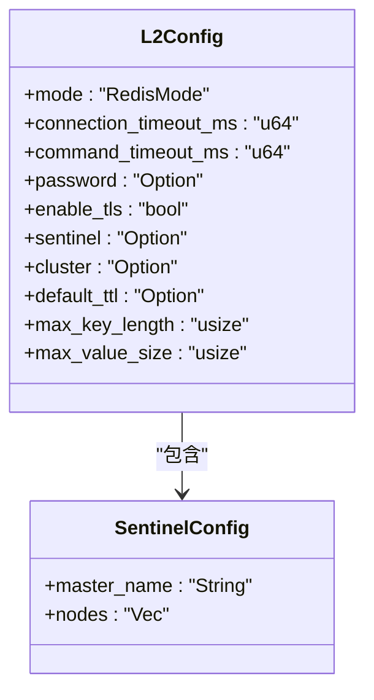
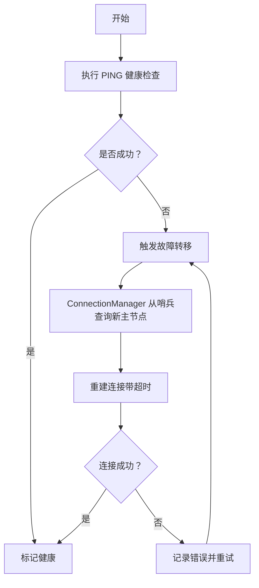
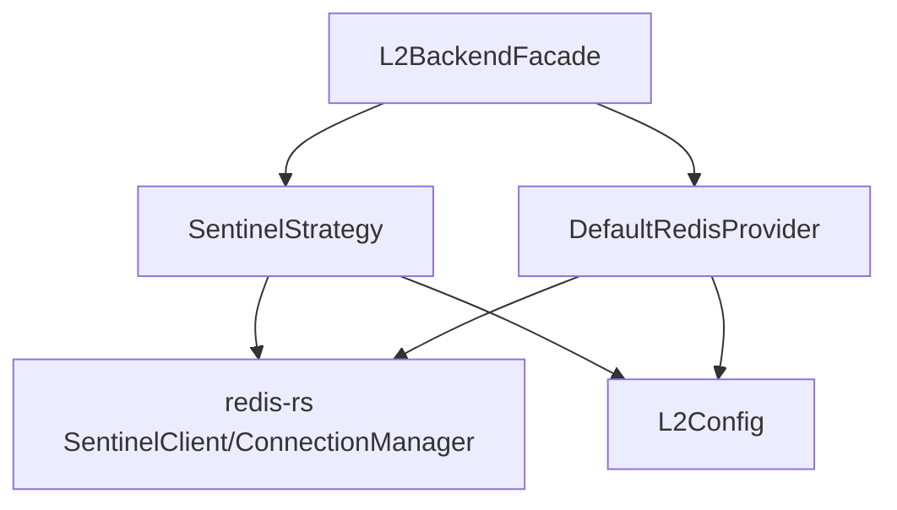

# 哨兵模式策略

<cite>
**本文引用的文件**
- [src/backend/strategy/sentinel.rs](file://src/backend/strategy/sentinel.rs)
- [src/backend/strategy/mod.rs](file://src/backend/strategy/mod.rs)
- [src/backend/client/redis/provider.rs](file://src/backend/client/redis/provider.rs)
- [src/backend/client/redis/mod.rs](file://src/backend/client/redis/mod.rs)
- [src/backend/strategy/facade.rs](file://src/backend/strategy/facade.rs)
- [src/config/service.rs](file://src/config/service.rs)
- [src/backend/client/redis/client.rs](file://src/backend/client/redis/client.rs)
- [docs/ARCHITECTURE.md](file://docs/ARCHITECTURE.md)
- [tests/real_env/docker-compose.sentinel.yml](file://tests/real_env/docker-compose.sentinel.yml)
- [tests/real_env/configs/redis-sentinel1.conf](file://tests/real_env/configs/redis-sentinel1.conf)
- [tests/real_env/configs/redis-sentinel2.conf](file://tests/real_env/configs/redis-sentinel2.conf)
- [tests/real_env/configs/redis-sentinel3.conf](file://tests/real_env/configs/redis-sentinel3.conf)
- [scripts/real_redis_test.sh](file://scripts/real_redis_test.sh)
- [tests/redis_test_utils.rs](file://tests/redis_test_utils.rs)
</cite>

## 目录
1. [简介](#简介)
2. [项目结构](#项目结构)
3. [核心组件](#核心组件)
4. [架构总览](#架构总览)
5. [详细组件分析](#详细组件分析)
6. [依赖关系分析](#依赖关系分析)
7. [性能考量](#性能考量)
8. [故障排查指南](#故障排查指南)
9. [结论](#结论)
10. [附录](#附录)

## 简介
本文件系统性阐述 Oxcache 在 Redis 哨兵模式下的缓存策略设计与实现，重点覆盖以下方面：
- 哨兵高可用部署与自动故障转移机制
- 故障检测与健康检查流程
- 自动恢复与连接管理
- 哨兵客户端的节点发现与连接池策略
- 配置参数（哨兵地址、主节点名、超时等）
- 高可用部署最佳实践与故障处理策略
- 与独立模式相比的优势与适用场景

## 项目结构
围绕哨兵模式的关键代码分布在如下模块：
- 策略层：实现 Redis 哨兵模式的具体策略
- 客户端提供者：负责构建与初始化哨兵连接
- 配置服务：定义 L2 配置与哨兵配置结构
- 门面层：统一对外暴露的 L2BackendFacade，按模式选择具体策略
- 文档与测试：架构文档、哨兵部署示例与集成测试脚本

**图表来源**
- [src/backend/strategy/sentinel.rs](file://src/backend/strategy/sentinel.rs#L21-L56)
- [src/backend/client/redis/provider.rs](file://src/backend/client/redis/provider.rs#L111-L194)
- [src/config/service.rs](file://src/config/service.rs#L41-L49)
- [src/backend/strategy/facade.rs](file://src/backend/strategy/facade.rs#L75-L91)
- [src/backend/client/redis/mod.rs](file://src/backend/client/redis/mod.rs#L7-L15)
- [docs/ARCHITECTURE.md](file://docs/ARCHITECTURE.md#L177-L217)
- [tests/real_env/docker-compose.sentinel.yml](file://tests/real_env/docker-compose.sentinel.yml#L1-L135)
- [tests/real_env/configs/redis-sentinel1.conf](file://tests/real_env/configs/redis-sentinel1.conf#L1-L14)
- [tests/real_env/configs/redis-sentinel2.conf](file://tests/real_env/configs/redis-sentinel2.conf#L1-L14)
- [tests/real_env/configs/redis-sentinel3.conf](file://tests/real_env/configs/redis-sentinel3.conf#L1-L14)
- [scripts/real_redis_test.sh](file://scripts/real_redis_test.sh#L167-L199)
- [tests/redis_test_utils.rs](file://tests/redis_test_utils.rs#L160-L202)

**章节来源**
- [src/backend/strategy/mod.rs](file://src/backend/strategy/mod.rs#L10-L24)
- [src/backend/client/redis/mod.rs](file://src/backend/client/redis/mod.rs#L7-L15)

## 核心组件
- 哨兵策略（SentinelStrategy）：封装 Redis 哨兵模式的读写、扫描、锁、版本控制等操作，内部持有哨兵客户端与命令超时配置。
- 客户端提供者（DefaultRedisProvider）：负责解析 L2 配置，构造哨兵连接（ConnectionManager），并执行可选的密码认证。
- 门面层（L2BackendFacade）：根据 RedisMode 决策使用 SentinelStrategy 或其他策略，并统一暴露 L2Backend 接口。
- 配置服务（L2Config/SentinelConfig）：定义哨兵模式所需的主节点名与哨兵节点列表等配置项。

关键职责与交互：
- SentinelStrategy 通过异步 MultiplexedConnection 执行 Redis 命令，所有操作均记录调试日志并在错误时返回统一的 CacheError。
- DefaultRedisProvider 以哨兵节点列表初始化连接管理器，支持超时控制与密码认证，确保连接建立与健康检查。
- L2BackendFacade 将模式选择与策略实例化解耦，便于未来扩展集群模式。

**章节来源**
- [src/backend/strategy/sentinel.rs](file://src/backend/strategy/sentinel.rs#L21-L56)
- [src/backend/client/redis/provider.rs](file://src/backend/client/redis/provider.rs#L111-L194)
- [src/backend/strategy/facade.rs](file://src/backend/strategy/facade.rs#L75-L91)
- [src/config/service.rs](file://src/config/service.rs#L41-L49)

## 架构总览
哨兵模式在整体架构中的定位与数据流如下：

**图表来源**
- [docs/ARCHITECTURE.md](file://docs/ARCHITECTURE.md#L177-L217)
- [src/backend/strategy/facade.rs](file://src/backend/strategy/facade.rs#L75-L91)
- [src/backend/strategy/sentinel.rs](file://src/backend/strategy/sentinel.rs#L48-L56)

## 详细组件分析

### 哨兵策略（SentinelStrategy）
- 设计要点
  - 使用 Arc<Mutex<SentinelClient>> 保护共享的哨兵客户端，确保并发安全。
  - 命令超时来自 L2Config.command_timeout_ms，保障长尾请求不会阻塞。
  - 所有 Redis 操作通过 MultiplexedConnection 执行，支持 GET/SET/DEL/EXISTS/EXPIRE/TTL/MGET/MSET/SCAN/SCAN_KEYS/PING/HEALTH_CHECK 等。
  - 版本控制与 CAS 通过 Lua 脚本保证原子性；分布式锁采用 SET NX PX 实现。
- 关键流程
  - 获取连接：加锁获取 Mutex<SentinelClient>，再获取异步连接。
  - 健康检查：通过 PING 命令判断可达性，异常时返回不健康状态。
  - 错误处理：捕获 RedisError 并转换为统一 CacheError，同时记录警告日志。

**图表来源**
- [src/backend/strategy/sentinel.rs](file://src/backend/strategy/sentinel.rs#L21-L56)
- [src/backend/strategy/sentinel.rs](file://src/backend/strategy/sentinel.rs#L58-L432)

**章节来源**
- [src/backend/strategy/sentinel.rs](file://src/backend/strategy/sentinel.rs#L21-L56)
- [src/backend/strategy/sentinel.rs](file://src/backend/strategy/sentinel.rs#L58-L432)

### 客户端提供者（DefaultRedisProvider）
- 设计要点
  - 从 L2Config.sentinel 解析哨兵节点列表与主节点名，去除多余协议前缀，确保兼容多种输入格式。
  - 使用 Client::open 构造基础客户端，随后通过 get_connection_manager 获取 ConnectionManager，实现自动重连与故障转移。
  - 支持可选密码认证，认证命令单独执行，避免密码出现在日志中。
  - 连接超时通过 L2Config.connection_timeout_ms 控制，超时则抛出统一错误。
- 关键流程
  - 参数校验：哨兵配置缺失或节点为空时直接报错。
  - 连接建立：超时包装，确保初始化阶段不会无限等待。
  - 认证：若配置了密码，则对连接执行 AUTH 命令。

**图表来源**
- [src/backend/client/redis/provider.rs](file://src/backend/client/redis/provider.rs#L111-L194)

**章节来源**
- [src/backend/client/redis/provider.rs](file://src/backend/client/redis/provider.rs#L111-L194)

### 门面层（L2BackendFacade）
- 设计要点
  - 根据 RedisMode 选择策略：Sentinel 模式下调用 DefaultRedisProvider.get_sentinel_client 获取 ConnectionManager。
  - 统一暴露 L2BackendStrategy 接口，屏蔽底层差异。
- 关键流程
  - Sentinel 分支：获取哨兵客户端与连接管理器，构建 StandaloneStrategy（哨兵模式下主库自动切换由 ConnectionManager 负责）。

**图表来源**
- [src/backend/strategy/facade.rs](file://src/backend/strategy/facade.rs#L75-L91)

**章节来源**
- [src/backend/strategy/facade.rs](file://src/backend/strategy/facade.rs#L75-L91)

### 配置参数与结构
- L2Config
  - mode: RedisMode::Sentinel
  - connection_timeout_ms: 连接建立超时
  - command_timeout_ms: 命令执行超时
  - password: 可选密码
  - enable_tls: 是否启用 TLS
  - sentinel: 哨兵配置（见下）
  - cluster: 集群配置（当前未在哨兵模式下使用）
  - default_ttl/max_key_length/max_value_size: 其他通用配置
- SentinelConfig
  - master_name: 主节点名称（如 mymaster）
  - nodes: 哨兵节点列表（支持多种 URL 格式）

**图表来源**
- [src/config/service.rs](file://src/config/service.rs#L364-L491)
- [src/config/service.rs](file://src/config/service.rs#L41-L49)

**章节来源**
- [src/config/service.rs](file://src/config/service.rs#L364-L491)
- [src/config/service.rs](file://src/config/service.rs#L41-L49)

### 故障检测与自动恢复流程
- 健康检查
  - SentinelStrategy.ping：通过 PING 判断连接可用性；失败时返回不健康状态。
  - L2BackendFacade.health_check：委托给具体策略的 health_check。
- 故障转移
  - 由 ConnectionManager 负责：当主节点不可达时，自动从哨兵查询新主节点并切换连接。
  - 超时控制：连接超时与命令超时分别由 connection_timeout_ms 与 command_timeout_ms 控制。
- 自动恢复
  - 连接断开后，ConnectionManager 会在后台重试；待主节点恢复后，自动切回新主节点。
  - WAL 与降级策略：参考架构文档中的降级与恢复流程，确保在 L2 不可用时仍可继续服务。

**图表来源**
- [src/backend/strategy/sentinel.rs](file://src/backend/strategy/sentinel.rs#L402-L422)
- [src/backend/client/redis/provider.rs](file://src/backend/client/redis/provider.rs#L164-L174)
- [docs/ARCHITECTURE.md](file://docs/ARCHITECTURE.md#L575-L607)

**章节来源**
- [src/backend/strategy/sentinel.rs](file://src/backend/strategy/sentinel.rs#L402-L422)
- [src/backend/client/redis/provider.rs](file://src/backend/client/redis/provider.rs#L164-L174)
- [docs/ARCHITECTURE.md](file://docs/ARCHITECTURE.md#L575-L607)

### 节点发现与连接管理
- 节点发现
  - 通过 SentinelConfig.nodes 提供的哨兵节点列表，初始化连接管理器。
  - ConnectionManager 会定期向哨兵查询主节点状态，动态更新主节点地址。
- 连接管理
  - MultiplexedConnection：复用单连接执行多命令，降低连接开销。
  - 超时控制：连接超时与命令超时分别配置，避免阻塞。
  - 密码认证：独立执行 AUTH，避免密码泄露到日志。

**章节来源**
- [src/backend/client/redis/provider.rs](file://src/backend/client/redis/provider.rs#L111-L194)
- [src/backend/strategy/sentinel.rs](file://src/backend/strategy/sentinel.rs#L48-L56)

### 配置参数详解与示例
- 必填参数
  - sentinel.master_name：主节点名称（如 mymaster）
  - sentinel.nodes：至少一个哨兵节点地址（支持 redis:// 或 http:// 前缀，内部会清洗）
- 可选参数
  - password：Redis 密码（可选）
  - enable_tls：是否启用 TLS（生产建议开启）
  - connection_timeout_ms/command_timeout_ms：连接与命令超时
- 示例（来自测试编排）
  - 哨兵节点配置文件展示了 master 名称、down-after-milliseconds、failover-timeout 等参数
  - docker-compose.sentinel.yml 展示了主从与哨兵容器的网络拓扑

**章节来源**
- [src/config/service.rs](file://src/config/service.rs#L41-L49)
- [tests/real_env/configs/redis-sentinel1.conf](file://tests/real_env/configs/redis-sentinel1.conf#L9-L13)
- [tests/real_env/configs/redis-sentinel2.conf](file://tests/real_env/configs/redis-sentinel2.conf#L9-L13)
- [tests/real_env/configs/redis-sentinel3.conf](file://tests/real_env/configs/redis-sentinel3.conf#L9-L13)
- [tests/real_env/docker-compose.sentinel.yml](file://tests/real_env/docker-compose.sentinel.yml#L68-L121)

### 高可用部署最佳实践
- 至少部署 3 个哨兵节点，确保多数派决策
- 主从节点与哨兵节点分布在不同容器/主机，避免单点故障
- 生产环境启用 TLS，严格限制网络访问
- 合理设置 down-after-milliseconds 与 failover-timeout，平衡快速切换与稳定性
- 监控 PING 与 SCAN 等关键命令的延迟与成功率

**章节来源**
- [tests/real_env/docker-compose.sentinel.yml](file://tests/real_env/docker-compose.sentinel.yml#L68-L121)
- [tests/real_env/configs/redis-sentinel1.conf](file://tests/real_env/configs/redis-sentinel1.conf#L9-L13)
- [docs/ARCHITECTURE.md](file://docs/ARCHITECTURE.md#L575-L607)

### 与独立模式对比
- 优势
  - 高可用：自动故障转移，无需手动干预
  - 可扩展：可配合只读副本（在 ConnectionManager 层面透明处理）
  - 管理简化：通过哨兵集中管理主从切换
- 适用场景
  - 对可用性要求高的生产环境
  - 需要自动故障恢复的业务
- 与独立模式差异
  - 独立模式无自动切换能力，需外部工具或手动干预
  - 哨兵模式引入哨兵节点与主从拓扑，增加复杂度但换取高可用

**章节来源**
- [docs/ARCHITECTURE.md](file://docs/ARCHITECTURE.md#L177-L217)
- [src/backend/strategy/facade.rs](file://src/backend/strategy/facade.rs#L75-L91)

## 依赖关系分析
- 组件耦合
  - SentinelStrategy 依赖 redis::sentinel::SentinelClient 与 L2Config
  - DefaultRedisProvider 依赖 L2Config 与 redis::Client/ConnectionManager
  - L2BackendFacade 依赖 RedisMode 与 DefaultRedisProvider
- 外部依赖
  - redis-rs：提供 SentinelClient、ConnectionManager、Lua 脚本与命令执行
  - tokio::time：超时控制
  - tracing：日志与指标

**图表来源**
- [src/backend/strategy/sentinel.rs](file://src/backend/strategy/sentinel.rs#L12-L18)
- [src/backend/client/redis/provider.rs](file://src/backend/client/redis/provider.rs#L7-L20)
- [src/backend/strategy/facade.rs](file://src/backend/strategy/facade.rs#L75-L91)

**章节来源**
- [src/backend/strategy/sentinel.rs](file://src/backend/strategy/sentinel.rs#L12-L18)
- [src/backend/client/redis/provider.rs](file://src/backend/client/redis/provider.rs#L7-L20)
- [src/backend/strategy/facade.rs](file://src/backend/strategy/facade.rs#L75-L91)

## 性能考量
- 连接复用：MultiplexedConnection 减少连接建立开销
- 超时控制：合理设置连接与命令超时，避免长尾阻塞
- 批量写入：mset/mget 等批量操作可显著提升吞吐
- Lua 原子性：CAS 与锁通过 Lua 脚本保证一致性，减少往返

**章节来源**
- [src/backend/strategy/sentinel.rs](file://src/backend/strategy/sentinel.rs#L344-L352)
- [src/backend/strategy/sentinel.rs](file://src/backend/strategy/sentinel.rs#L208-L267)
- [src/backend/strategy/sentinel.rs](file://src/backend/strategy/sentinel.rs#L269-L322)

## 故障排查指南
- 常见问题
  - 连接超时：检查 connection_timeout_ms 与网络连通性
  - 命令超时：调整 command_timeout_ms 或优化 Redis 性能
  - 认证失败：确认 password 配置正确
  - 哨兵不可达：核对 sentinel.nodes 与网络策略
- 排查步骤
  - 使用 ping/health_check 确认可用性
  - 查看日志中的错误信息与警告
  - 使用集成测试脚本验证故障转移路径

**章节来源**
- [src/backend/client/redis/provider.rs](file://src/backend/client/redis/provider.rs#L164-L174)
- [src/backend/strategy/sentinel.rs](file://src/backend/strategy/sentinel.rs#L402-L422)
- [scripts/real_redis_test.sh](file://scripts/real_redis_test.sh#L167-L199)
- [tests/redis_test_utils.rs](file://tests/redis_test_utils.rs#L160-L202)

## 结论
哨兵模式通过 ConnectionManager 与哨兵节点协作，实现了 Redis 主库的自动故障转移与高可用。结合统一的门面层与配置体系，Oxcache 在保证易用性的同时提供了可靠的生产级缓存能力。建议在生产环境中启用 TLS、合理设置超时与监控告警，并遵循多哨兵、跨主机部署的最佳实践。

## 附录
- 相关文档与测试
  - 架构文档：整体设计与降级策略
  - Sentinel 部署编排：主从与哨兵容器网络
  - 集成测试脚本：演示故障转移与版本写入

**章节来源**
- [docs/ARCHITECTURE.md](file://docs/ARCHITECTURE.md#L177-L217)
- [tests/real_env/docker-compose.sentinel.yml](file://tests/real_env/docker-compose.sentinel.yml#L1-L135)
- [scripts/real_redis_test.sh](file://scripts/real_redis_test.sh#L167-L199)