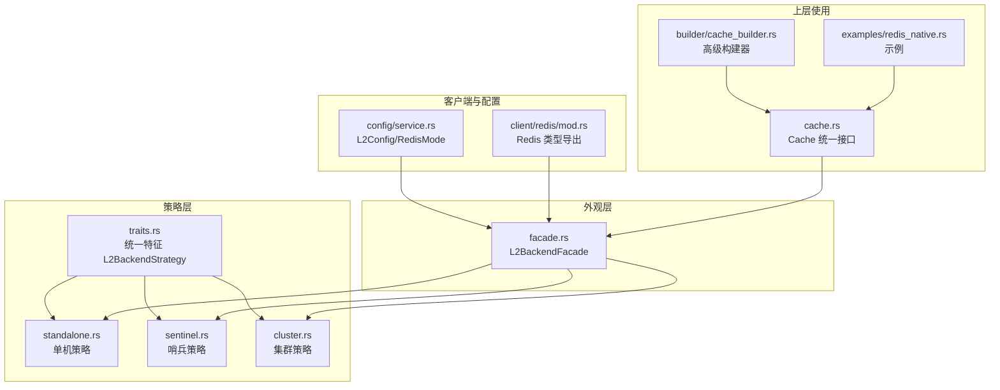
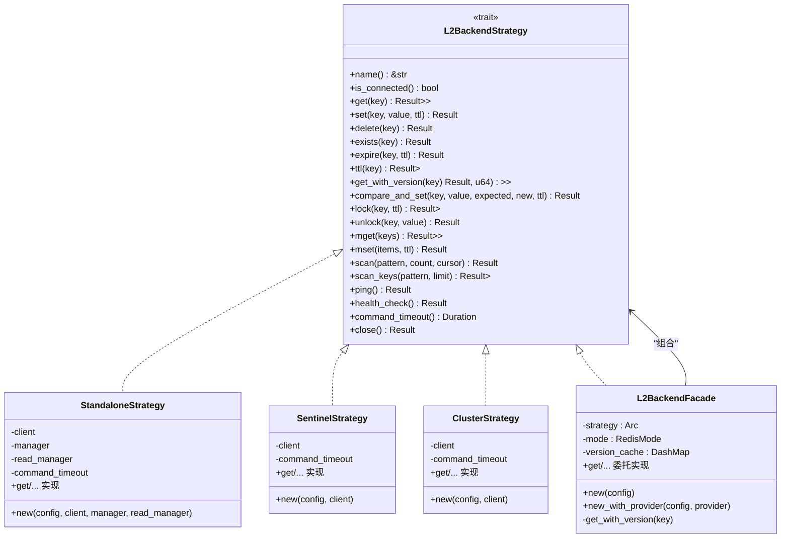
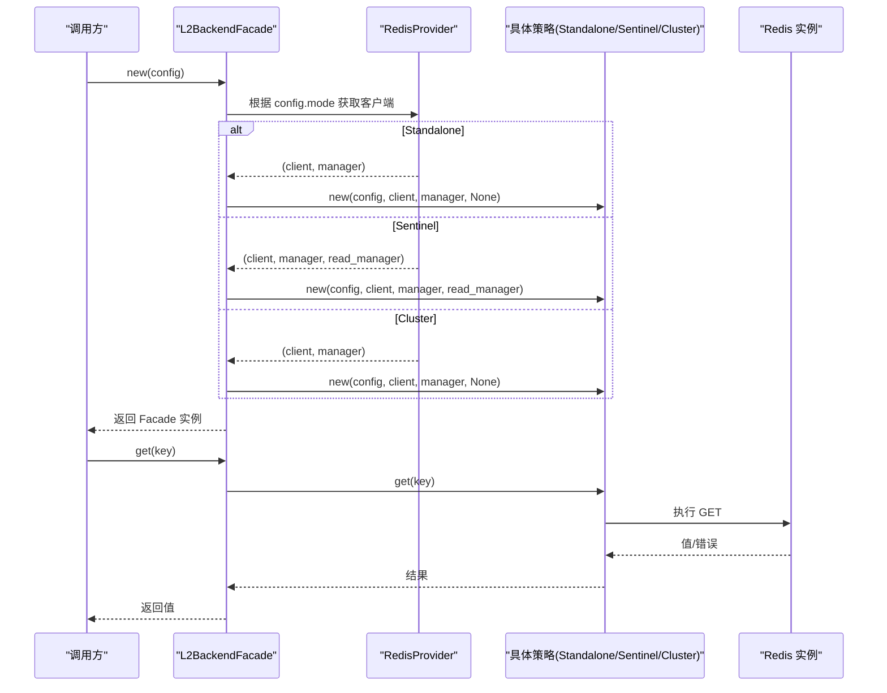
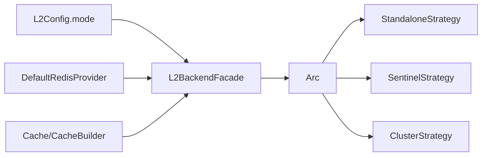

# 外观模式策略

<cite>
**本文档引用的文件**
- [src/backend/strategy/facade.rs](file://src/backend/strategy/facade.rs)
- [src/backend/strategy/mod.rs](file://src/backend/strategy/mod.rs)
- [src/backend/strategy/traits.rs](file://src/backend/strategy/traits.rs)
- [src/backend/strategy/standalone.rs](file://src/backend/strategy/standalone.rs)
- [src/backend/strategy/sentinel.rs](file://src/backend/strategy/sentinel.rs)
- [src/backend/strategy/cluster.rs](file://src/backend/strategy/cluster.rs)
- [src/backend/client/redis/mod.rs](file://src/backend/client/redis/mod.rs)
- [src/config/service.rs](file://src/config/service.rs)
- [src/cache.rs](file://src/cache.rs)
- [src/builder/cache_builder.rs](file://src/builder/cache_builder.rs)
- [examples/src/redis_native.rs](file://examples/src/redis_native.rs)
</cite>

## 目录
1. [简介](#简介)
2. [项目结构](#项目结构)
3. [核心组件](#核心组件)
4. [架构总览](#架构总览)
5. [详细组件分析](#详细组件分析)
6. [依赖关系分析](#依赖关系分析)
7. [性能考量](#性能考量)
8. [故障排查指南](#故障排查指南)
9. [结论](#结论)
10. [附录](#附录)

## 简介
本文件系统性阐述 Oxcache 中“外观模式”在缓存策略设计中的应用，重点说明其如何以统一接口封装多种 Redis 部署模式（单机、哨兵、集群），并通过策略选择逻辑实现透明的部署模式切换。文档还对比了外观模式与直接策略模式的差异与优势，并给出多租户与混合部署场景的应用建议。

## 项目结构
围绕外观模式与策略模式的关键目录与文件如下：
- 策略模块：定义统一特征与具体策略实现
- 外观模块：封装策略选择与统一接口
- 客户端与配置：提供 Redis 提供者与部署模式配置
- 示例与构建器：展示典型使用方式与高级配置

**图表来源**
- [src/backend/strategy/traits.rs](file://src/backend/strategy/traits.rs#L85-L303)
- [src/backend/strategy/standalone.rs](file://src/backend/strategy/standalone.rs#L18-L419)
- [src/backend/strategy/sentinel.rs](file://src/backend/strategy/sentinel.rs#L21-L433)
- [src/backend/strategy/cluster.rs](file://src/backend/strategy/cluster.rs#L21-L437)
- [src/backend/strategy/facade.rs](file://src/backend/strategy/facade.rs#L18-L223)
- [src/backend/client/redis/mod.rs](file://src/backend/client/redis/mod.rs#L11-L15)
- [src/config/service.rs](file://src/config/service.rs#L82-L103)
- [src/cache.rs](file://src/cache.rs#L117-L200)
- [src/builder/cache_builder.rs](file://src/builder/cache_builder.rs#L15-L200)
- [examples/src/redis_native.rs](file://examples/src/redis_native.rs#L19-L115)

**章节来源**
- [src/backend/strategy/mod.rs](file://src/backend/strategy/mod.rs#L10-L24)
- [src/backend/strategy/facade.rs](file://src/backend/strategy/facade.rs#L18-L98)
- [src/config/service.rs](file://src/config/service.rs#L82-L103)

## 核心组件
- 统一特征 L2BackendStrategy：定义所有后端操作的契约，包括基本 CRUD、版本化操作、分布式锁、批量操作、SCAN、健康检查等。
- 具体策略实现：
  - StandaloneStrategy：单机与主从读写分离
  - SentinelStrategy：高可用哨兵模式
  - ClusterStrategy：集群模式（当前简化为单机策略）
- L2BackendFacade：外观层，负责根据配置选择具体策略并提供统一接口；内置版本缓存以支持乐观并发控制。
- Redis 提供者与配置：DefaultRedisProvider 与 L2Config/RedisMode 决定连接与部署模式。

**章节来源**
- [src/backend/strategy/traits.rs](file://src/backend/strategy/traits.rs#L85-L303)
- [src/backend/strategy/standalone.rs](file://src/backend/strategy/standalone.rs#L18-L419)
- [src/backend/strategy/sentinel.rs](file://src/backend/strategy/sentinel.rs#L21-L433)
- [src/backend/strategy/cluster.rs](file://src/backend/strategy/cluster.rs#L21-L437)
- [src/backend/strategy/facade.rs](file://src/backend/strategy/facade.rs#L18-L127)
- [src/backend/client/redis/mod.rs](file://src/backend/client/redis/mod.rs#L11-L15)
- [src/config/service.rs](file://src/config/service.rs#L82-L103)

## 架构总览
外观模式通过 L2BackendFacade 将上层调用与底层多种 Redis 部署模式解耦。Facade 在初始化时依据 L2Config.mode 选择具体策略（Standalone/Sentinel/Cluster），并将所有操作委托给该策略。同时，Facade 内部维护版本缓存，增强版本化读取与 CAS 的一致性保障。

**图表来源**
- [src/backend/strategy/traits.rs](file://src/backend/strategy/traits.rs#L85-L303)
- [src/backend/strategy/standalone.rs](file://src/backend/strategy/standalone.rs#L18-L419)
- [src/backend/strategy/sentinel.rs](file://src/backend/strategy/sentinel.rs#L21-L433)
- [src/backend/strategy/cluster.rs](file://src/backend/strategy/cluster.rs#L21-L437)
- [src/backend/strategy/facade.rs](file://src/backend/strategy/facade.rs#L18-L127)

## 详细组件分析

### 外观模式：L2BackendFacade
- 策略选择逻辑
  - 根据 L2Config.mode 决定策略：
    - Standalone：使用 DefaultRedisProvider 获取主库连接，可选从库连接（当前实现为单机策略）
    - Sentinel：使用哨兵客户端，包含主从读写分离
    - Cluster：当前简化为单机策略（完整集群支持待实现）
- 统一接口
  - Facade 实现 L2BackendStrategy，将所有方法委托给内部策略，确保上层无需感知底层差异
- 版本缓存与 CAS
  - 内置 DashMap 版本缓存，优先从版本缓存命中后读取值，再进行 CAS 比较，提升并发一致性与性能

**图表来源**
- [src/backend/strategy/facade.rs](file://src/backend/strategy/facade.rs#L40-L98)
- [src/backend/client/redis/mod.rs](file://src/backend/client/redis/mod.rs#L11-L15)
- [src/backend/strategy/standalone.rs](file://src/backend/strategy/standalone.rs#L33-L70)
- [src/backend/strategy/sentinel.rs](file://src/backend/strategy/sentinel.rs#L32-L56)
- [src/backend/strategy/cluster.rs](file://src/backend/strategy/cluster.rs#L32-L56)

**章节来源**
- [src/backend/strategy/facade.rs](file://src/backend/strategy/facade.rs#L40-L127)
- [src/config/service.rs](file://src/config/service.rs#L82-L103)

### 策略层：Standalone/Sentinel/Cluster
- StandaloneStrategy
  - 支持主从读写分离，读操作可路由至从库
  - 提供完整的 CRUD、SCAN、批量操作与健康检查
- SentinelStrategy
  - 基于哨兵客户端，自动处理主从切换
  - 提供版本化读取与 CAS 的 Lua 脚本实现
- ClusterStrategy
  - 当前简化实现，按单机策略执行
  - 未来将支持键槽位路由与跨节点批量操作

**章节来源**
- [src/backend/strategy/standalone.rs](file://src/backend/strategy/standalone.rs#L18-L419)
- [src/backend/strategy/sentinel.rs](file://src/backend/strategy/sentinel.rs#L21-L433)
- [src/backend/strategy/cluster.rs](file://src/backend/strategy/cluster.rs#L21-L437)

### 统一接口与上层使用
- Cache 统一接口
  - 通过 Cache::redis 或 CacheBuilder 配置 Redis 后端，内部即使用 L2BackendFacade
- 示例与构建器
  - 示例展示通过连接字符串快速创建 Redis 缓存
  - 构建器支持 TTL、容量、批写入、自动提升等高级配置

**章节来源**
- [src/cache.rs](file://src/cache.rs#L181-L200)
- [src/builder/cache_builder.rs](file://src/builder/cache_builder.rs#L151-L200)
- [examples/src/redis_native.rs](file://examples/src/redis_native.rs#L19-L115)

## 依赖关系分析
- 外观层依赖策略层：Facade 通过 Arc<L2BackendStrategy> 组合具体策略
- 配置驱动：L2Config.mode 决定策略选择；RedisMode 枚举提供序列化支持
- 客户端提供者：DefaultRedisProvider 根据模式返回相应客户端
- 上层解耦：Cache 与 CacheBuilder 仅依赖统一特征，不关心具体策略

**图表来源**
- [src/backend/strategy/facade.rs](file://src/backend/strategy/facade.rs#L68-L91)
- [src/config/service.rs](file://src/config/service.rs#L82-L103)
- [src/backend/client/redis/mod.rs](file://src/backend/client/redis/mod.rs#L11-L15)
- [src/cache.rs](file://src/cache.rs#L181-L200)

**章节来源**
- [src/backend/strategy/facade.rs](file://src/backend/strategy/facade.rs#L68-L98)
- [src/config/service.rs](file://src/config/service.rs#L82-L103)

## 性能考量
- 版本缓存：Facade 内部 DashMap 版本缓存减少重复版本查询，提升 CAS 场景吞吐
- 读写分离：StandaloneStrategy 的从库读取降低主库压力，适合读多写少场景
- 健康检查：统一的 HealthStatus 便于快速定位部署问题
- 批量操作：策略层提供 mget/mset，减少网络往返
- 超时控制：command_timeout 在策略层统一配置，避免上层分散处理

[本节为通用性能讨论，不直接分析具体文件]

## 故障排查指南
- 连接失败
  - 检查 L2Config 的连接参数与 RedisMode 是否正确
  - 通过 health_check() 获取健康状态，区分 Healthy/Unhealthy/Degraded
- 哨兵切换异常
  - 确认哨兵节点配置与主节点名称一致
  - 观察 SentinelStrategy 的连接获取流程
- 集群兼容性
  - 当前 ClusterStrategy 为简化实现，若出现跨槽位批量操作问题，请升级到完整实现
- 版本化冲突
  - 检查 Facade 的版本缓存与 compare_and_set 流程，确认版本号一致性

**章节来源**
- [src/backend/strategy/traits.rs](file://src/backend/strategy/traits.rs#L12-L303)
- [src/backend/strategy/sentinel.rs](file://src/backend/strategy/sentinel.rs#L416-L432)
- [src/backend/strategy/cluster.rs](file://src/backend/strategy/cluster.rs#L420-L436)
- [src/backend/strategy/facade.rs](file://src/backend/strategy/facade.rs#L115-L127)

## 结论
外观模式在 Oxcache 中实现了“统一接口 + 多种后端”的解耦设计：上层仅需面向 L2BackendStrategy，无需关心 Redis 的单机、哨兵或集群差异。Facade 的策略选择逻辑与版本缓存增强了并发一致性与性能；结合统一的健康检查与超时控制，使得部署模式切换对上层透明，便于在多租户与混合部署场景中灵活演进。

## 附录

### 外观模式 vs 直接策略模式
- 外观模式（本项目采用）
  - 优点：统一入口、隐藏复杂性、支持运行时策略切换、便于扩展新部署模式
  - 适用：多部署模式、多租户、混合部署、需要透明切换的场景
- 直接策略模式
  - 优点：更轻量、无额外封装开销
  - 适用：单一部署模式、对性能极致敏感且无需切换的场景

[本节为概念性对比，不直接分析具体文件]

### 多租户与混合部署应用建议
- 多租户
  - 通过 L2Config 为每个租户配置独立 RedisMode 与连接参数
  - 使用 Facade 的统一接口，租户间部署模式可独立演进
- 混合部署
  - 在同一系统内同时支持 Standalone/Sentinel/Cluster
  - 通过配置动态切换，逐步迁移部署模式而不影响业务

[本节为实践建议，不直接分析具体文件]
