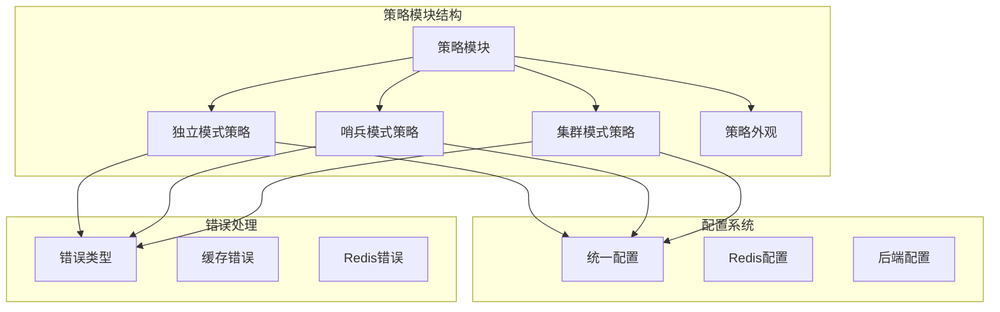
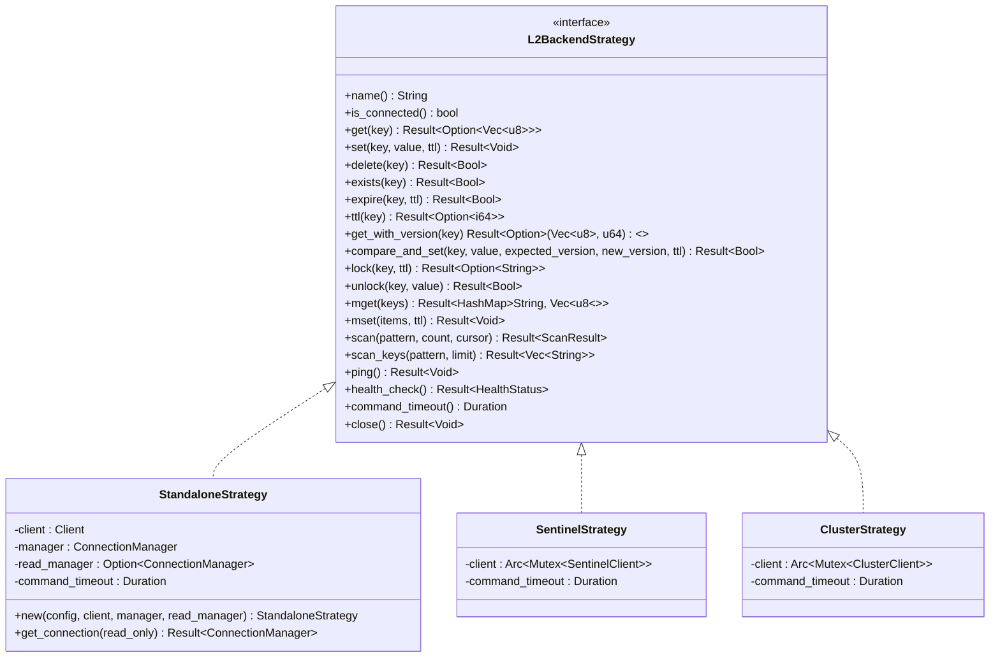
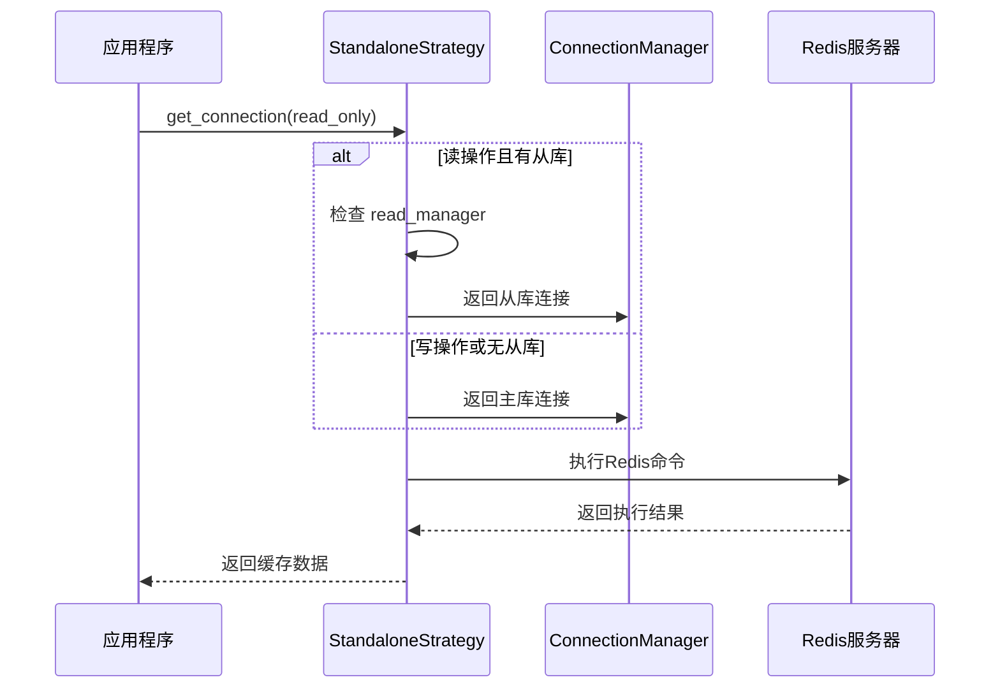
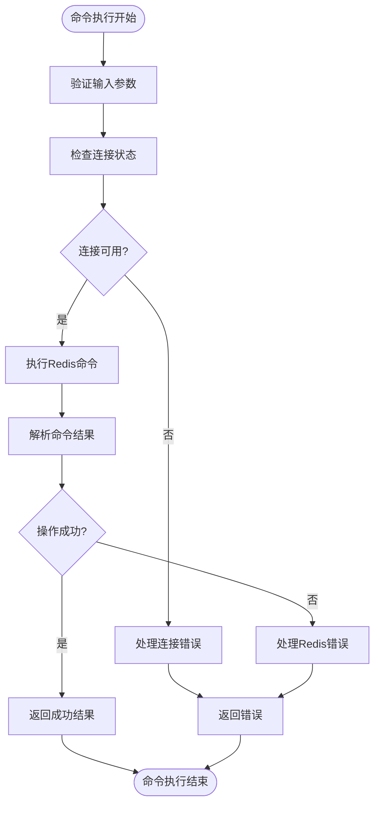
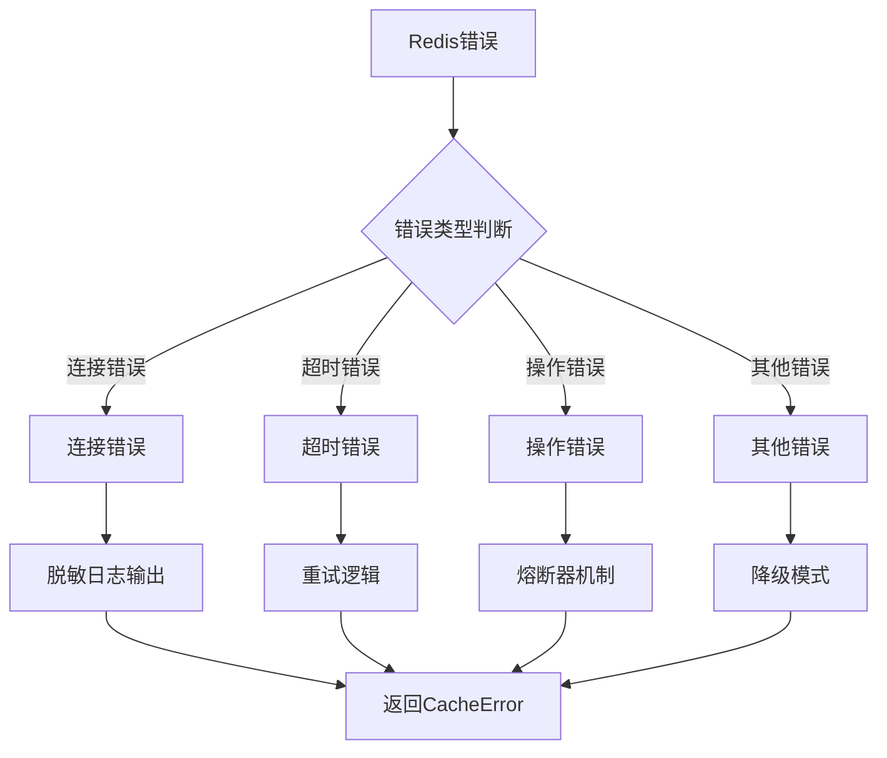
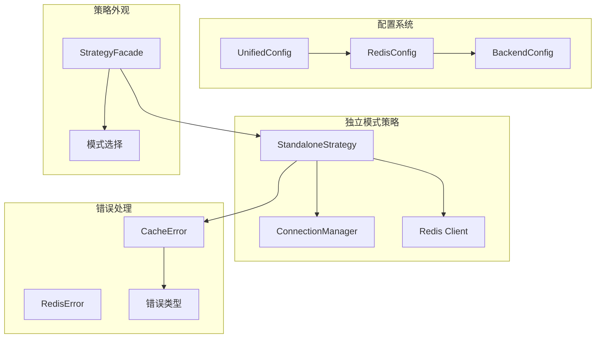

# 独立模式策略

<cite>
**本文档引用的文件**
- [standalone.rs](file://src/backend/strategy/standalone.rs)
- [mod.rs](file://src/backend/strategy/mod.rs)
- [unified.rs](file://src/config/unified.rs)
- [error.rs](file://src/error.rs)
- [facade.rs](file://src/backend/strategy/facade.rs)
- [sentinel.rs](file://src/backend/strategy/sentinel.rs)
- [cluster.rs](file://src/backend/strategy/cluster.rs)
- [redis_native.rs](file://examples/src/redis_native.rs)
- [USER_GUIDE.md](file://docs/USER_GUIDE.md)
- [API_REFERENCE.md](file://docs/API_REFERENCE.md)
- [README.md](file://README.md)
</cite>

## 目录
1. [简介](#简介)
2. [项目结构](#项目结构)
3. [核心组件](#核心组件)
4. [架构概览](#架构概览)
5. [详细组件分析](#详细组件分析)
6. [依赖关系分析](#依赖关系分析)
7. [性能考虑](#性能考虑)
8. [故障排除指南](#故障排除指南)
9. [结论](#结论)
10. [附录](#附录)

## 简介

独立模式（Standalone）是 Oxcache 缓存系统中的一种 Redis 部署策略，专为单机 Redis 部署场景设计。该策略支持单个 Redis 实例，可选配置读从库，提供完整的 Redis 命令集支持，包括基本的 CRUD 操作、批量操作、扫描操作、分布式锁等高级功能。

独立模式适用于开发环境、测试环境或小型应用，具有配置简单、部署成本低、维护方便的特点。该策略通过 ConnectionManager 实现连接池管理，支持命令超时控制和健康检查机制。

## 项目结构

Oxcache 的独立模式策略位于后端策略模块中，采用清晰的模块组织结构：



**图表来源**
- [mod.rs](file://src/backend/strategy/mod.rs#L1-L24)
- [unified.rs](file://src/config/unified.rs#L1-L800)
- [error.rs](file://src/error.rs#L1-L289)

**章节来源**
- [mod.rs](file://src/backend/strategy/mod.rs#L1-L24)
- [unified.rs](file://src/config/unified.rs#L1-L800)

## 核心组件

独立模式策略的核心组件包括连接管理器、命令执行器、错误处理器和健康检查器。这些组件协同工作，为应用程序提供可靠的 Redis 缓存服务。

### 连接管理器

独立模式使用 ConnectionManager 实现连接池管理，支持主库和可选的读从库连接。连接管理器负责：

- 自动连接建立和维护
- 连接池大小管理
- 连接超时和重连机制
- 读写分离路由

### 命令执行器

命令执行器封装了所有 Redis 命令的执行逻辑，支持：

- 基本 CRUD 操作（GET、SET、DEL、EXISTS）
- 批量操作（MGET、MSET）
- 键扫描（SCAN）
- TTL 管理（EXPIRE、TTL）
- 分布式锁（SET NX PX）

### 错误处理器

错误处理器提供统一的错误处理机制，支持：

- Redis 错误转换
- 连接错误检测
- 超时错误处理
- 降级模式支持

**章节来源**
- [standalone.rs](file://src/backend/strategy/standalone.rs#L18-L70)
- [error.rs](file://src/error.rs#L75-L208)

## 架构概览

独立模式策略采用策略模式设计，通过统一的接口支持不同的 Redis 部署模式：



**图表来源**
- [standalone.rs](file://src/backend/strategy/standalone.rs#L72-L418)
- [sentinel.rs](file://src/backend/strategy/sentinel.rs#L58-L432)
- [cluster.rs](file://src/backend/strategy/cluster.rs#L58-L436)

## 详细组件分析

### 独立模式策略实现

独立模式策略通过 StandaloneStrategy 结构体实现，该结构体包含 Redis 客户端、主库连接管理器、可选的读从库连接管理器和命令超时配置。

#### 连接管理机制



**图表来源**
- [standalone.rs](file://src/backend/strategy/standalone.rs#L58-L69)

#### 命令执行流程

独立模式支持完整的 Redis 命令集，每个命令都有对应的执行方法：



**图表来源**
- [standalone.rs](file://src/backend/strategy/standalone.rs#L84-L100)
- [standalone.rs](file://src/backend/strategy/standalone.rs#L102-L124)

#### 错误处理机制

独立模式采用统一的错误处理机制，所有 Redis 错误都会转换为 CacheError 类型：



**图表来源**
- [error.rs](file://src/error.rs#L150-L161)
- [standalone.rs](file://src/backend/strategy/standalone.rs#L93-L99)

**章节来源**
- [standalone.rs](file://src/backend/strategy/standalone.rs#L33-L70)
- [standalone.rs](file://src/backend/strategy/standalone.rs#L72-L418)
- [error.rs](file://src/error.rs#L75-L208)

### 配置参数详解

独立模式的配置参数主要通过 RedisBackendConfig 结构体定义，包含连接配置、池配置、默认 TTL 和键前缀等选项。

#### 连接配置参数

| 参数名 | 类型 | 默认值 | 描述 |
|--------|------|--------|------|
| connection_strings | Vec<String> | ["redis://localhost:6379"] | Redis 连接字符串列表 |
| mode | String | "standalone" | 连接模式（standalone/sentinel/cluster） |
| connect_timeout | Duration | 5秒 | 连接超时时间 |
| command_timeout | Duration | 5秒 | 命令执行超时时间 |
| password | Option<String> | None | 认证密码 |
| database | Option<i64> | Some(0) | 数据库编号 |
| connection_name | Option<String> | Some("oxcache") | 连接名称 |

#### 池配置参数

| 参数名 | 类型 | 默认值 | 描述 |
|--------|------|--------|------|
| max_size | usize | 10 | 最大连接池大小 |
| min_size | usize | 1 | 最小连接池大小 |
| idle_timeout | Option<Duration> | Some(300秒) | 连接空闲超时 |
| max_lifetime | Option<Duration> | Some(1800秒) | 连接最大生命周期 |

**章节来源**
- [unified.rs](file://src/config/unified.rs#L76-L121)
- [unified.rs](file://src/config/unified.rs#L353-L376)

### 性能特点分析

独立模式在性能方面具有以下特点：

#### 响应时间特性
- **读操作**: 通常在毫秒级别，取决于网络延迟
- **写操作**: 通常在毫秒级别，受数据大小影响
- **批量操作**: 显著优于单次操作的总和

#### 内存使用特点
- **连接池内存**: 与连接池大小成正比
- **命令缓冲**: 与并发请求数量相关
- **键值数据**: 直接存储在 Redis 内存中

#### 并发处理能力
- **连接池并发**: 受 max_size 限制
- **命令队列**: 支持异步命令执行
- **超时控制**: 防止资源长时间占用

**章节来源**
- [standalone.rs](file://src/backend/strategy/standalone.rs#L408-L410)

## 依赖关系分析

独立模式策略与其他组件的依赖关系如下：



**图表来源**
- [facade.rs](file://src/backend/strategy/facade.rs#L68-L98)
- [unified.rs](file://src/config/unified.rs#L639-L662)

**章节来源**
- [facade.rs](file://src/backend/strategy/facade.rs#L68-L98)
- [mod.rs](file://src/backend/strategy/mod.rs#L13-L23)

## 性能考虑

### 连接池优化

独立模式通过 ConnectionManager 实现高效的连接池管理：

- **连接复用**: 减少连接建立开销
- **空闲连接回收**: 避免资源浪费
- **动态调整**: 根据负载自动调整连接数量

### 命令批量化

对于批量操作，独立模式提供了优化的实现：

- **MGET/MSET**: 支持批量读写
- **管道执行**: 减少网络往返
- **原子操作**: 通过 Lua 脚本保证原子性

### 缓存策略建议

针对独立模式的最佳实践：

1. **合理设置连接池大小**: 根据并发需求调整 max_size
2. **启用适当的超时**: 防止请求阻塞
3. **使用键前缀**: 避免键冲突
4. **监控连接状态**: 及时发现连接问题

## 故障排除指南

### 常见问题及解决方案

#### 连接失败问题

**症状**: 应用启动时报连接错误

**可能原因**:
- Redis 服务器不可达
- 认证信息错误
- 网络配置问题

**解决方法**:
1. 检查 Redis 服务器状态
2. 验证连接字符串格式
3. 确认认证凭据正确性

#### 超时问题

**症状**: 命令执行超时

**可能原因**:
- 网络延迟过高
- Redis 负载过重
- 超时配置过短

**解决方法**:
1. 增加 command_timeout 配置
2. 优化 Redis 性能
3. 调整网络环境

#### 内存不足问题

**症状**: Redis 报内存不足错误

**可能原因**:
- 数据量超出内存限制
- 键过期策略不当
- 内存泄漏

**解决方法**:
1. 增加 Redis 内存
2. 优化数据结构
3. 实施合理的过期策略

**章节来源**
- [error.rs](file://src/error.rs#L228-L288)
- [USER_GUIDE.md](file://docs/USER_GUIDE.md#L711-L765)

## 结论

独立模式策略为 Oxcache 提供了简单而强大的单机 Redis 缓存解决方案。该策略具有以下优势：

1. **部署简单**: 无需复杂的 Redis 集群配置
2. **成本低廉**: 单实例部署，资源消耗较少
3. **易于维护**: 配置直观，故障排查简单
4. **功能完整**: 支持所有核心 Redis 功能

独立模式特别适合以下场景：
- 开发和测试环境
- 小型应用或微服务
- 原型开发阶段
- 预算有限的项目

对于需要高可用性和水平扩展能力的应用，建议考虑哨兵模式或集群模式。但对大多数中小型应用场景而言，独立模式提供了最佳的性价比和易用性平衡。

## 附录

### 配置示例

#### 基本独立模式配置

```toml
[services.default.l2]
mode = "standalone"
connection_string = "redis://127.0.0.1:6379"
```

#### 生产环境独立模式配置

```toml
[services.production.l2]
mode = "standalone"
connection_string = "redis://:${REDIS_PASSWORD}@production-redis:6379/0"
connect_timeout = 10
command_timeout = 5
max_pool_size = 20
min_pool_size = 5
enable_compression = true
key_prefix = "prod:"
```

### 最佳实践

1. **连接管理**: 合理配置连接池大小，避免过度连接
2. **超时设置**: 根据网络环境调整超时时间
3. **监控告警**: 建立完善的监控和告警机制
4. **备份策略**: 定期备份 Redis 数据
5. **安全配置**: 启用认证和网络隔离

### 迁移指南

从独立模式迁移到其他模式的步骤：

1. **评估需求**: 分析当前负载和扩展需求
2. **选择目标模式**: 根据需求选择哨兵或集群模式
3. **准备基础设施**: 部署相应的 Redis 集群环境
4. **更新配置**: 修改配置文件中的连接参数
5. **测试验证**: 全面测试新配置的功能和性能
6. **切换上线**: 逐步切换流量到新的部署模式

**章节来源**
- [README.md](file://README.md#L119-L172)
- [USER_GUIDE.md](file://docs/USER_GUIDE.md#L514-L555)
- [API_REFERENCE.md](file://docs/API_REFERENCE.md#L54-L75)
