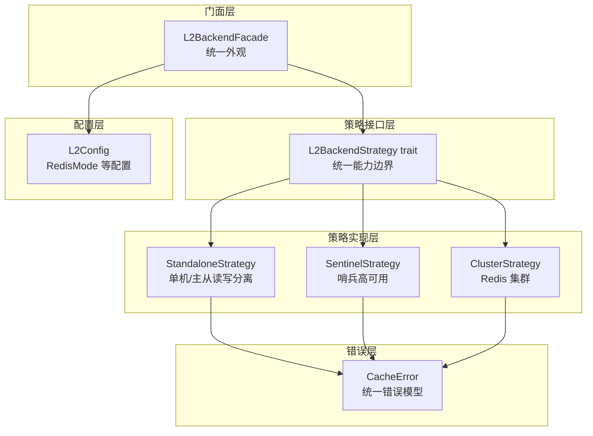
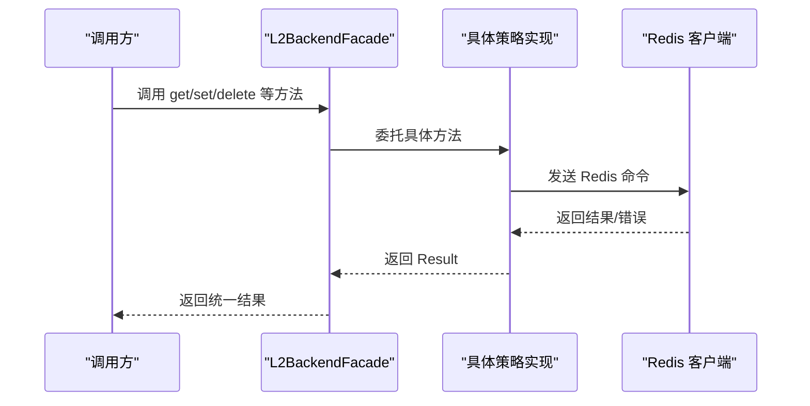
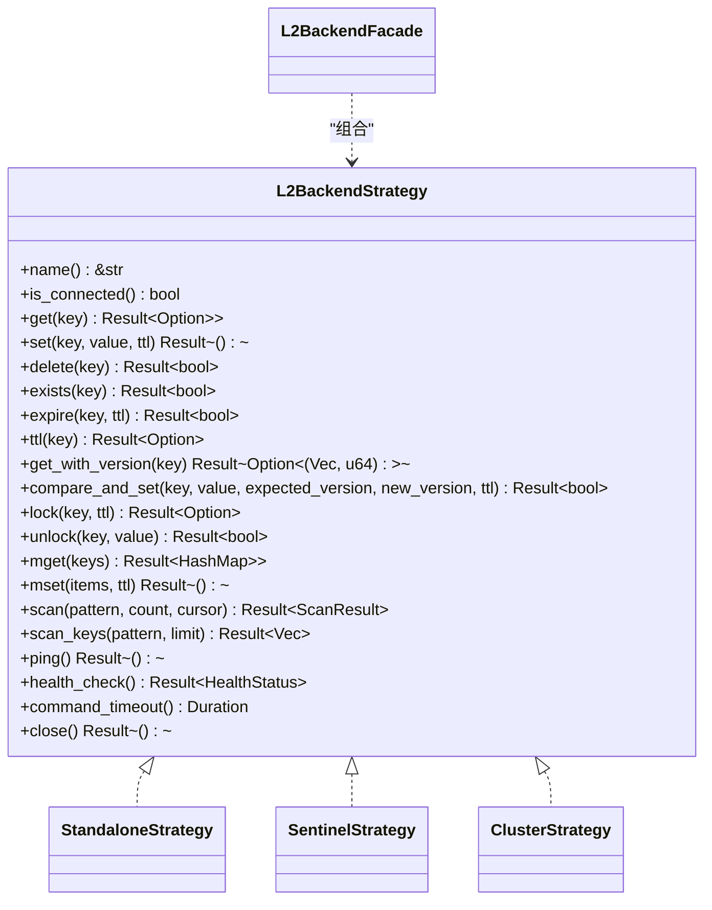

# 策略接口与抽象

<cite>
**本文引用的文件**
- [traits.rs](file://src/backend/strategy/traits.rs)
- [standalone.rs](file://src/backend/strategy/standalone.rs)
- [sentinel.rs](file://src/backend/strategy/sentinel.rs)
- [cluster.rs](file://src/backend/strategy/cluster.rs)
- [facade.rs](file://src/backend/strategy/facade.rs)
- [mod.rs](file://src/backend/strategy/mod.rs)
- [service.rs](file://src/config/service.rs)
- [error.rs](file://src/error.rs)
</cite>

## 目录
1. [简介](#简介)
2. [项目结构](#项目结构)
3. [核心组件](#核心组件)
4. [架构总览](#架构总览)
5. [详细组件分析](#详细组件分析)
6. [依赖关系分析](#依赖关系分析)
7. [性能考量](#性能考量)
8. [故障排查指南](#故障排查指南)
9. [结论](#结论)

## 简介
本文件聚焦于缓存系统中 L2 后端的策略接口设计与抽象层，系统性阐述 L2BackendStrategy trait 的设计思想、方法签名与职责边界；详解 HealthStatus 健康状态枚举的状态定义与转换逻辑；解析 ScanResult 结构体的设计目的与使用场景；并说明策略接口如何为不同 Redis 部署模式（单机、哨兵、集群）提供统一抽象。最后给出接口实现的最佳实践与注意事项，帮助读者在不改变上层调用的前提下，灵活适配多种 Redis 部署形态。

## 项目结构
策略接口与实现位于后端策略模块，采用“接口 + 多种具体策略实现 + 门面聚合”的分层设计：
- 接口层：L2BackendStrategy trait 定义统一能力边界
- 策略层：StandaloneStrategy、SentinelStrategy、ClusterStrategy 分别对应不同部署模式
- 门面层：L2BackendFacade 统一对外暴露策略接口，屏蔽底层差异
- 配置层：L2Config、RedisMode 等配置类型驱动策略选择
- 错误层：CacheError 提供统一错误模型，便于策略层抛错与上层处理

图表来源
- [traits.rs](file://src/backend/strategy/traits.rs#L85-L303)
- [standalone.rs](file://src/backend/strategy/standalone.rs#L72-L418)
- [sentinel.rs](file://src/backend/strategy/sentinel.rs#L58-L432)
- [cluster.rs](file://src/backend/strategy/cluster.rs#L58-L436)
- [facade.rs](file://src/backend/strategy/facade.rs#L18-L98)
- [service.rs](file://src/config/service.rs#L82-L103)
- [error.rs](file://src/error.rs#L45-L208)

章节来源
- [mod.rs](file://src/backend/strategy/mod.rs#L1-L24)
- [service.rs](file://src/config/service.rs#L82-L103)

## 核心组件
- L2BackendStrategy trait：定义 L2 后端统一能力，覆盖基本 CRUD、版本化操作、分布式锁、批量操作、SCAN、健康检查与连接管理等。
- HealthStatus 枚举：描述服务健康状态，包含 Healthy、Unhealthy、Degraded 三态，用于策略层健康检查与上层降级决策。
- ScanResult 结构体：封装 SCAN 操作返回的键集合与下一次游标，支撑增量式键扫描。
- L2BackendFacade 门面：根据 L2Config.mode 选择具体策略，向上提供一致的 L2BackendStrategy 接口。
- 具体策略实现：StandaloneStrategy、SentinelStrategy、ClusterStrategy 分别针对不同部署形态实现统一接口。

章节来源
- [traits.rs](file://src/backend/strategy/traits.rs#L12-L303)
- [facade.rs](file://src/backend/strategy/facade.rs#L18-L222)

## 架构总览
L2BackendFacade 依据 L2Config.mode 选择策略，并将所有 L2BackendStrategy 方法委托给具体实现。策略层负责与 Redis 客户端交互，实现统一的 API 表面，屏蔽不同部署模式的差异。

图表来源
- [facade.rs](file://src/backend/strategy/facade.rs#L129-L222)
- [standalone.rs](file://src/backend/strategy/standalone.rs#L84-L100)
- [sentinel.rs](file://src/backend/strategy/sentinel.rs#L70-L85)
- [cluster.rs](file://src/backend/strategy/cluster.rs#L70-L85)

## 详细组件分析

### L2BackendStrategy 接口设计与方法签名
- 设计思想
  - 以 trait 抽象统一能力，屏蔽不同 Redis 部署模式差异
  - 明确职责边界：只暴露 L2 缓存所需的核心操作，避免过度耦合
  - 异步接口：统一使用 async/await，便于与上层异步缓存系统集成
  - 错误统一：返回统一的 CacheError，便于上层统一处理
- 核心方法族
  - 基本操作：get、set、delete、exists、expire、ttl
  - 版本化操作：get_with_version、compare_and_set（乐观锁）
  - 分布式锁：lock、unlock（Lua 原子脚本保障一致性）
  - 批量操作：mget、mset
  - SCAN：scan、scan_keys（支持游标增量扫描）
  - 健康检查：ping、health_check
  - 连接管理：is_connected、command_timeout、close
- 方法签名要点
  - 所有方法均返回 Result<T, CacheError>，确保错误可传播
  - TTL 相关方法返回 Option 类型，区分“不存在/永不过期”语义
  - SCAN 方法返回 ScanResult，包含 keys 与 cursor，支持增量迭代

章节来源
- [traits.rs](file://src/backend/strategy/traits.rs#L85-L303)

### HealthStatus 健康状态定义与转换逻辑
- 状态定义
  - Healthy：服务健康
  - Unhealthy(String)：服务不健康，携带错误信息
  - Degraded(String)：部分健康（如集群中部分节点故障）
- 转换逻辑
  - 各策略通过 ping 或连接探测实现健康检查
  - 健康检查成功返回 Healthy
  - 健康检查失败返回 Unhealthy(错误信息)
  - 部分节点故障可返回 Degraded(错误信息)，用于上层降级策略
- 使用场景
  - 上层监控与告警
  - 自动降级与熔断
  - 运维诊断与排障

章节来源
- [traits.rs](file://src/backend/strategy/traits.rs#L12-L21)
- [standalone.rs](file://src/backend/strategy/standalone.rs#L401-L406)
- [sentinel.rs](file://src/backend/strategy/sentinel.rs#L416-L422)
- [cluster.rs](file://src/backend/strategy/cluster.rs#L420-L426)

### ScanResult 结构体设计与使用场景
- 设计目的
  - 封装 SCAN 增量扫描结果，包含本次匹配的键集合与下一次游标
  - 支持大规模键空间的高效遍历，避免一次性返回全部键
- 字段说明
  - keys：匹配的键集合
  - cursor：下一次扫描的游标，0 表示扫描完成
- 使用场景
  - 清理过期键、统计键分布、迁移/备份键空间
  - 与 ScanIterator 结合，提供迭代式访问
- 与 SCAN 迭代器的关系
  - ScanIterator 基于 L2BackendStrategy::scan 实现，内部维护 cursor 并在游标为 0 时停止

章节来源
- [traits.rs](file://src/backend/strategy/traits.rs#L23-L30)
- [traits.rs](file://src/backend/strategy/traits.rs#L40-L83)
- [standalone.rs](file://src/backend/strategy/standalone.rs#L353-L370)
- [sentinel.rs](file://src/backend/strategy/sentinel.rs#L354-L377)
- [cluster.rs](file://src/backend/strategy/cluster.rs#L356-L381)

### 不同 Redis 部署模式的策略实现
- 单机策略（StandaloneStrategy）
  - 支持主从读写分离：读请求可路由至从库，写请求强制主库
  - 使用 ConnectionManager 管理连接，支持命令超时配置
  - SCAN 实现基于单机 SCAN 命令
  - 健康检查通过 PING 判断
- 哨兵策略（SentinelStrategy）
  - 基于 SentinelClient 获取连接，自动处理主从切换
  - 版本化操作通过 Lua 脚本保证原子性
  - MGET/MSET 在键分布跨槽位时退化为逐个键操作
  - 健康检查通过 PING 判断
- 集群策略（ClusterStrategy）
  - 基于 ClusterClient 获取连接，自动处理槽位映射
  - 当前实现对 MGET/MSET 的处理与单机类似（逐个键操作）
  - SCAN 仅扫描首个节点（简化实现，完整集群支持需扩展）
  - 健康检查通过 PING 判断

章节来源
- [standalone.rs](file://src/backend/strategy/standalone.rs#L18-L418)
- [sentinel.rs](file://src/backend/strategy/sentinel.rs#L21-L432)
- [cluster.rs](file://src/backend/strategy/cluster.rs#L21-L436)

### 门面层 L2BackendFacade 的统一抽象
- 设计目标
  - 隐藏底层策略差异，向上提供一致的 L2BackendStrategy 接口
  - 根据 L2Config.mode 动态选择策略实现
- 关键流程
  - new/new_with_provider：依据 RedisMode 创建具体策略实例
  - 代理转发：将所有 L2BackendStrategy 方法委托给内部策略
  - 版本缓存：L2BackendFacade 内部维护版本缓存，优化版本化读取
- 与配置的耦合
  - 通过 L2Config.mode 选择策略
  - 通过 L2Config.command_timeout_ms 设置命令超时

章节来源
- [facade.rs](file://src/backend/strategy/facade.rs#L18-L222)
- [service.rs](file://src/config/service.rs#L82-L103)

### 错误模型与统一处理
- 错误类型
  - CacheError 提供统一错误模型，涵盖序列化、连接、超时、数据库、Redis 等错误类别
  - RedisError 通过 thiserror 自动派生，支持脱敏连接串输出
- 与策略接口的结合
  - 所有策略方法返回 Result<T, CacheError>，便于上层统一处理
  - 健康检查与连接管理方法返回健康状态或错误，便于上层降级策略

章节来源
- [error.rs](file://src/error.rs#L45-L208)
- [traits.rs](file://src/backend/strategy/traits.rs#L85-L303)

## 依赖关系分析
- 接口与实现
  - L2BackendStrategy 是所有策略实现的共同父接口
  - Standalone/Sentinel/Cluster 分别实现 L2BackendStrategy
- 门面与策略
  - L2BackendFacade 持有 Arc<dyn L2BackendStrategy>，通过组合实现统一外观
  - 门面根据 L2Config.mode 在运行时选择策略
- 配置与策略
  - L2Config.mode 决定策略选择
  - L2Config.command_timeout_ms 影响各策略的命令超时配置
- 错误与策略
  - 策略层统一返回 CacheError，便于上层统一处理

图表来源
- [traits.rs](file://src/backend/strategy/traits.rs#L85-L303)
- [standalone.rs](file://src/backend/strategy/standalone.rs#L72-L418)
- [sentinel.rs](file://src/backend/strategy/sentinel.rs#L58-L432)
- [cluster.rs](file://src/backend/strategy/cluster.rs#L58-L436)
- [facade.rs](file://src/backend/strategy/facade.rs#L22-L30)

章节来源
- [traits.rs](file://src/backend/strategy/traits.rs#L85-L303)
- [facade.rs](file://src/backend/strategy/facade.rs#L18-L98)

## 性能考量
- 命令超时与连接池
  - 各策略通过 command_timeout 控制命令超时，避免阻塞影响整体性能
  - 单机策略支持读从库，可将只读请求分流，降低主库压力
- 批量操作
  - mget/mset 在单机与哨兵模式下直接使用原生命令
  - 集群模式下若键跨槽位，退化为逐个键操作，建议尽量将相关键放在同一槽位
- SCAN 增量遍历
  - 使用 ScanResult 与游标实现增量扫描，避免一次性返回大量键
  - ScanIterator 提供迭代式访问，适合大数据量场景
- 健康检查
  - 健康检查应轻量，避免频繁 PING 影响性能
  - 可结合上层降级策略，减少异常节点的重试次数

[本节为通用性能指导，无需特定文件来源]

## 故障排查指南
- 健康状态异常
  - 若 health_check 返回 Unhealthy，优先检查网络连通性与 Redis 服务器状态
  - 对于哨兵/集群模式，确认主从切换与节点可达性
- 错误类型定位
  - CacheError::RedisError：多为连接或命令执行失败，检查连接串、认证与权限
  - CacheError::Timeout：命令超时，适当增大 command_timeout_ms
  - CacheError::Connection：网络连接问题，检查防火墙与 DNS 解析
- 版本化与锁冲突
  - compare_and_set 返回 false：版本不匹配，检查并发更新策略
  - lock 返回 None：锁被占用，检查锁持有者与超时设置
- 扫描性能问题
  - scan_keys 返回为空或耗时过长：调整 COUNT 参数与游标推进策略
  - 集群模式下 SCAN 仅扫描首个节点：考虑扩展为全节点扫描

章节来源
- [error.rs](file://src/error.rs#L45-L208)
- [standalone.rs](file://src/backend/strategy/standalone.rs#L401-L406)
- [sentinel.rs](file://src/backend/strategy/sentinel.rs#L416-L422)
- [cluster.rs](file://src/backend/strategy/cluster.rs#L420-L426)

## 结论
通过 L2BackendStrategy 接口与策略模式，系统实现了对不同 Redis 部署形态的统一抽象。HealthStatus 与 ScanResult 等核心数据结构进一步完善了接口的表达力与易用性。L2BackendFacade 作为门面层，将复杂度隐藏在统一接口之后，使上层调用无需关心底层差异。配合统一的错误模型与合理的性能考量，该设计既保证了可扩展性，又兼顾了可维护性与稳定性。
