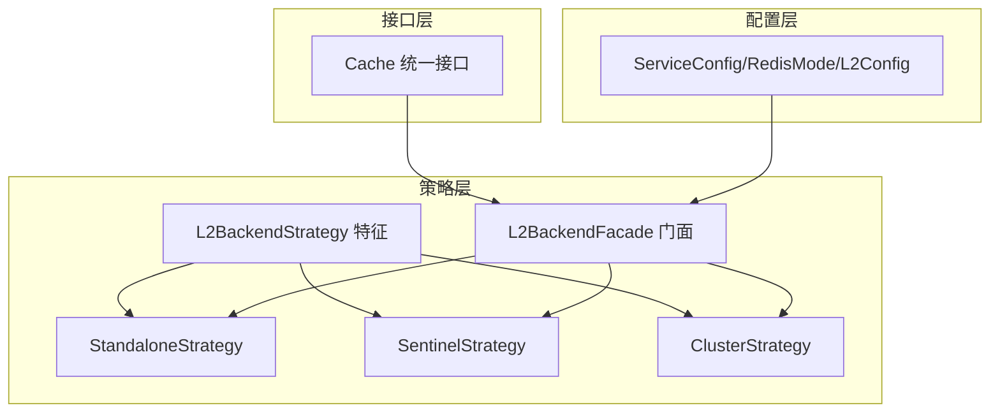
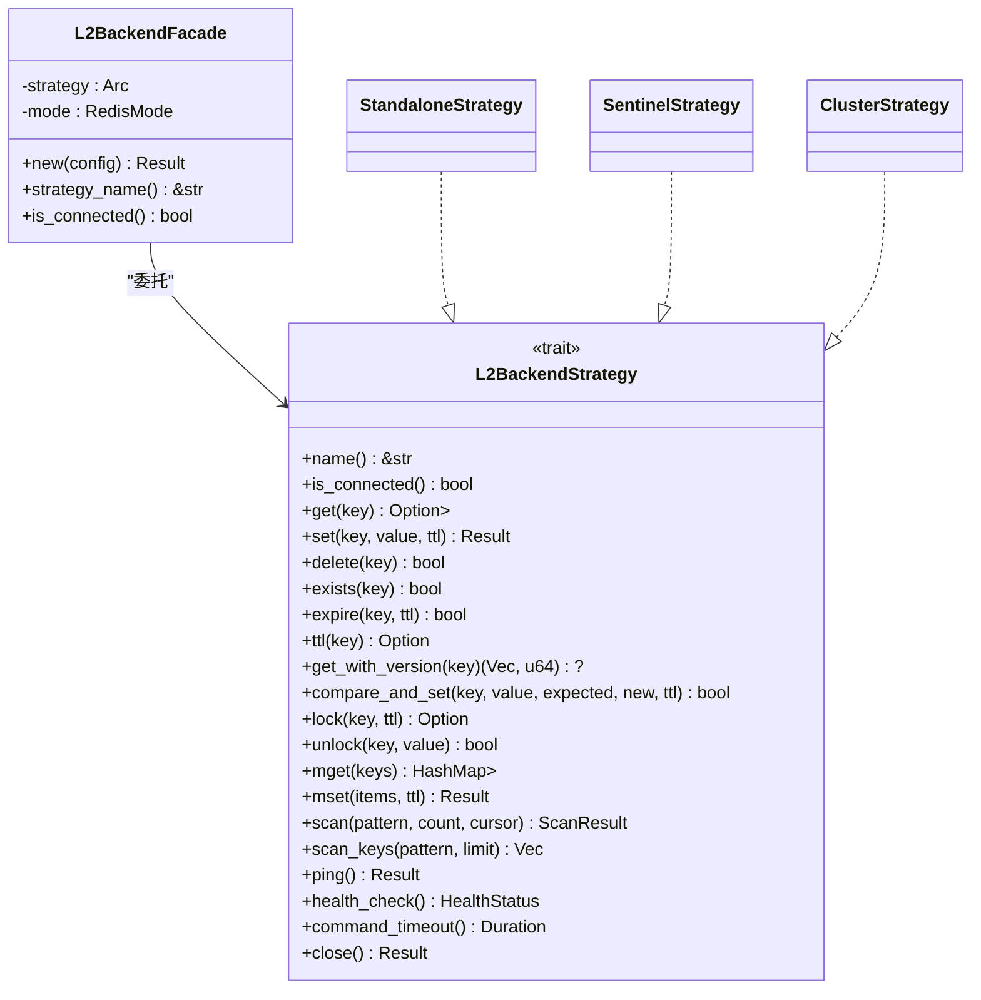
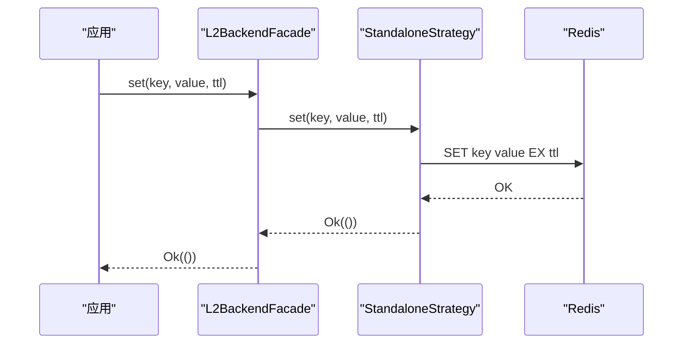
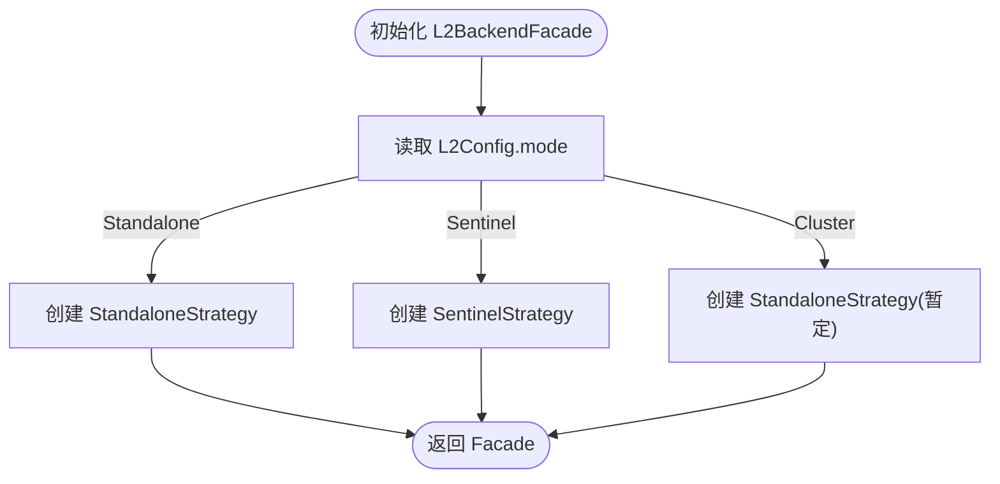
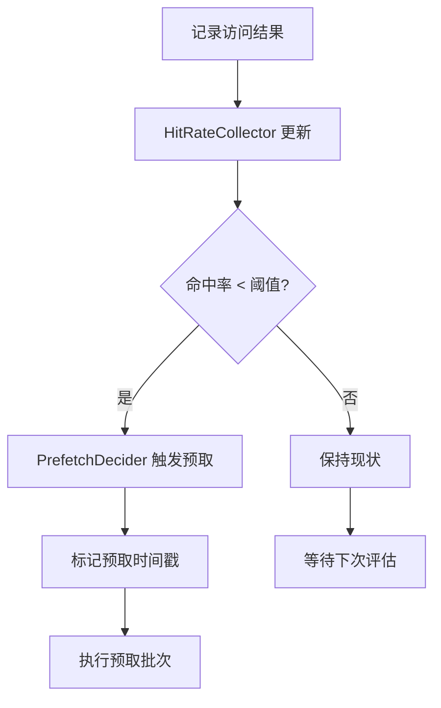
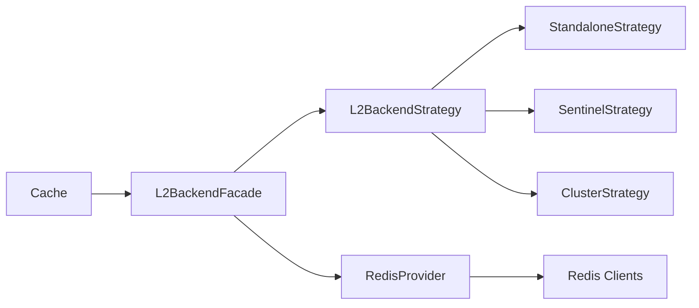

# 缓存策略模式

<cite>
**本文档引用的文件**
- [src/lib.rs](file://src/lib.rs)
- [src/backend/mod.rs](file://src/backend/mod.rs)
- [src/backend/strategy/mod.rs](file://src/backend/strategy/mod.rs)
- [src/backend/strategy/traits.rs](file://src/backend/strategy/traits.rs)
- [src/backend/strategy/standalone.rs](file://src/backend/strategy/standalone.rs)
- [src/backend/strategy/sentinel.rs](file://src/backend/strategy/sentinel.rs)
- [src/backend/strategy/cluster.rs](file://src/backend/strategy/cluster.rs)
- [src/backend/strategy/facade.rs](file://src/backend/strategy/facade.rs)
- [src/cache.rs](file://src/cache.rs)
- [src/smart_strategy.rs](file://src/smart_strategy.rs)
- [src/config/service.rs](file://src/config/service.rs)
- [docs/ARCHITECTURE.md](file://docs/ARCHITECTURE.md)
- [docs/USER_GUIDE.md](file://docs/USER_GUIDE.md)
- [docs/API_REFERENCE.md](file://docs/API_REFERENCE.md)
- [examples/src/smart_strategy.rs](file://examples/src/smart_strategy.rs)
</cite>

## 目录
1. [引言](#引言)
2. [项目结构](#项目结构)
3. [核心组件](#核心组件)
4. [架构总览](#架构总览)
5. [详细组件分析](#详细组件分析)
6. [依赖关系分析](#依赖关系分析)
7. [性能考量](#性能考量)
8. [故障处理与监控](#故障处理与监控)
9. [结论](#结论)
10. [附录](#附录)

## 引言
本文件系统性阐述 Oxcache 缓存策略模式的实现架构与应用场景，重点解析策略模式在缓存系统中的作用：通过统一接口下的多种实现方式，支撑独立模式（Standalone）、哨兵模式（Sentinel）、集群模式（Cluster）等不同 Redis 部署形态；并介绍策略选择算法、动态切换机制、配置方法与参数调优、性能对比与选择指导，以及故障处理与监控方法。

## 项目结构
Oxcache 的缓存策略模式主要分布在以下模块：
- 策略接口与抽象：`src/backend/strategy/traits.rs`
- 具体策略实现：`standalone.rs`、`sentinel.rs`、`cluster.rs`
- 策略门面：`facade.rs`
- 缓存统一接口：`src/cache.rs`
- 配置与模式枚举：`src/config/service.rs`
- 智能策略（预取/压缩）：`src/smart_strategy.rs`
- 文档与示例：`docs/` 与 `examples/`

**图表来源**
- [src/backend/strategy/traits.rs](file://src/backend/strategy/traits.rs#L85-L303)
- [src/backend/strategy/standalone.rs](file://src/backend/strategy/standalone.rs#L18-L419)
- [src/backend/strategy/sentinel.rs](file://src/backend/strategy/sentinel.rs#L21-L433)
- [src/backend/strategy/cluster.rs](file://src/backend/strategy/cluster.rs#L21-L437)
- [src/backend/strategy/facade.rs](file://src/backend/strategy/facade.rs#L18-L223)
- [src/cache.rs](file://src/cache.rs#L117-L646)
- [src/config/service.rs](file://src/config/service.rs#L82-L103)

**章节来源**
- [src/backend/strategy/mod.rs](file://src/backend/strategy/mod.rs#L1-L24)
- [src/backend/mod.rs](file://src/backend/mod.rs#L1-L59)
- [src/lib.rs](file://src/lib.rs#L416-L525)

## 核心组件
- L2BackendStrategy 特征：定义 Redis 后端统一操作接口，包括 get/set/delete/exist/expire/ttl、版本化操作（get_with_version/compare_and_set）、分布式锁（lock/unlock）、批量操作（mget/mset）、SCAN 操作、健康检查（ping/health_check）、命令超时与关闭等。
- 具体策略实现：
  - StandaloneStrategy：单机 Redis，支持主从读写分离（可选从库连接）。
  - SentinelStrategy：Redis Sentinel 高可用部署，自动处理主从切换。
  - ClusterStrategy：Redis Cluster 分布式部署，键槽位路由与集群连接管理。
- L2BackendFacade 门面：根据配置的 RedisMode（Standalone/Sentinel/Cluster）动态选择对应策略，对外暴露统一的 L2BackendStrategy 接口。
- Cache<K,V>：面向用户的统一缓存接口，内部持有 Arc<dyn CacheBackend>，通过策略门面实现 L2 后端的统一访问。

**章节来源**
- [src/backend/strategy/traits.rs](file://src/backend/strategy/traits.rs#L85-L303)
- [src/backend/strategy/standalone.rs](file://src/backend/strategy/standalone.rs#L18-L419)
- [src/backend/strategy/sentinel.rs](file://src/backend/strategy/sentinel.rs#L21-L433)
- [src/backend/strategy/cluster.rs](file://src/backend/strategy/cluster.rs#L21-L437)
- [src/backend/strategy/facade.rs](file://src/backend/strategy/facade.rs#L18-L223)
- [src/cache.rs](file://src/cache.rs#L117-L646)

## 架构总览
策略模式在 Oxcache 中的应用体现在 L2 后端的可插拔设计：通过 L2BackendStrategy 抽象统一 Redis 操作，Standalone/Sentinel/Cluster 三种具体策略实现不同部署形态，Facade 门面负责策略选择与动态切换。上层 Cache<K,V> 通过统一接口访问 L2BackendFacade，从而实现“同一套 API，多策略后端”的灵活架构。

**图表来源**
- [src/backend/strategy/traits.rs](file://src/backend/strategy/traits.rs#L85-L303)
- [src/backend/strategy/standalone.rs](file://src/backend/strategy/standalone.rs#L18-L419)
- [src/backend/strategy/sentinel.rs](file://src/backend/strategy/sentinel.rs#L21-L433)
- [src/backend/strategy/cluster.rs](file://src/backend/strategy/cluster.rs#L21-L437)
- [src/backend/strategy/facade.rs](file://src/backend/strategy/facade.rs#L18-L223)

## 详细组件分析

### 策略接口与抽象：L2BackendStrategy
- 统一能力：读写、存在性检查、过期与 TTL、版本化读写、CAS、分布式锁、批量操作、SCAN、健康检查、命令超时与关闭。
- 设计要点：通过 async_trait 定义异步接口，便于不同后端实现；提供 HealthStatus 枚举用于健康状态表达；SCAN 结果封装为 ScanResult，支持游标迭代。

**章节来源**
- [src/backend/strategy/traits.rs](file://src/backend/strategy/traits.rs#L12-L303)

### 独立模式（Standalone）策略
- 适用场景：单机 Redis 或主从读写分离场景。
- 实现特点：
  - 读写分离：支持独立的从库连接（read_manager），读请求可走从库，写请求走主库。
  - 命令超时：基于 L2Config.command_timeout_ms 配置。
  - 版本化与 CAS：通过 Lua 脚本实现 compare_and_set。
  - 锁实现：使用 SET NX PX 实现分布式锁，解锁使用 Lua 脚本保证原子性。
  - 批量与 SCAN：MGET/MSET 与 SCAN 命令封装。

**图表来源**
- [src/backend/strategy/standalone.rs](file://src/backend/strategy/standalone.rs#L102-L124)

**章节来源**
- [src/backend/strategy/standalone.rs](file://src/backend/strategy/standalone.rs#L18-L419)

### 哨兵模式（Sentinel）策略
- 适用场景：Redis Sentinel 高可用部署，自动主从切换。
- 实现特点：
  - SentinelClient 管理连接池，自动感知主从变化。
  - compare_and_set 使用 Lua 脚本，结合版本键实现原子 CAS。
  - 锁实现与 Standalone 类似，但通过 SentinelClient 获取连接。
  - SCAN 与 MGET/MSET 采用逐键处理策略（键不在同一槽位时）。

**章节来源**
- [src/backend/strategy/sentinel.rs](file://src/backend/strategy/sentinel.rs#L21-L433)

### 集群模式（Cluster）策略
- 适用场景：Redis Cluster 分布式部署，键槽位路由。
- 实现特点：
  - ClusterClient 管理集群连接，自动路由到对应节点。
  - MGET/MSET 需要在同一槽位内执行，否则退化为逐键处理。
  - SCAN 仅扫描首个节点（简化实现），可扩展为多节点扫描。
  - compare_and_set 与锁实现与 Sentinel 类似。

**章节来源**
- [src/backend/strategy/cluster.rs](file://src/backend/strategy/cluster.rs#L21-L437)

### 策略门面：L2BackendFacade
- 策略选择算法：
  - 根据 L2Config.mode（Standalone/Sentinel/Cluster）选择对应策略。
  - Standalone：创建 StandaloneStrategy，可选读从库连接。
  - Sentinel：通过 Provider 获取 SentinelClient 与读写连接。
  - Cluster：当前使用 StandaloneStrategy（完整集群支持待实现）。
- 动态切换机制：
  - 通过构造函数接收 L2Config，在运行时确定策略实现。
  - 门面对象持有 Arc<dyn L2BackendStrategy>，对外暴露统一接口。

**图表来源**
- [src/backend/strategy/facade.rs](file://src/backend/strategy/facade.rs#L40-L98)

**章节来源**
- [src/backend/strategy/facade.rs](file://src/backend/strategy/facade.rs#L18-L223)

### 统一缓存接口：Cache<K,V>
- 类型安全：泛型 K/V，通过 CacheKey/Cacheable trait 约束键值类型。
- 序列化：在启用 serialization 特性时，自动进行 JSON/Bincode 序列化/反序列化。
- 统一操作：get/set/delete/exists/get_or/batch operations/clear/stats/health_check/shutdown 等。
- 适配器：内部使用 BackendCacheOps 包装 CacheBackend，支持注册到全局缓存注册表。

**章节来源**
- [src/cache.rs](file://src/cache.rs#L87-L646)

### 智能策略：预取与压缩
- 预取策略：基于命中率统计（HitRateCollector）与滑动窗口，当近期命中率低于阈值时触发预取，支持最小预取间隔与批量大小。
- 压缩策略：基于数据熵的可压缩性检查（CompressibilityChecker），结合配置阈值与压缩率，决定是否对大体积数据进行压缩。
- 管理器：SmartStrategyManager 聚合预取与压缩决策器，支持运行时配置更新与统计查询。

**图表来源**
- [src/smart_strategy.rs](file://src/smart_strategy.rs#L241-L315)

**章节来源**
- [src/smart_strategy.rs](file://src/smart_strategy.rs#L13-L556)

### 配置与参数调优
- Redis 模式与连接：
  - RedisMode：Standalone/Sentinel/Cluster。
  - L2Config：连接字符串、超时、TLS、哨兵/集群配置、默认 TTL、键值大小限制等。
- 缓存类型与策略：
  - ServiceConfig：CacheType（L1/L2/TwoLevel），序列化类型，feature-gated 的 L1/L2/TwoLevel 配置。
- 参数调优建议：
  - Standalone：合理设置 command_timeout_ms，必要时配置读从库连接。
  - Sentinel：确保 master_name 与 nodes 配置正确，关注主从切换时延。
  - Cluster：关注键槽位分布，避免跨槽位批量操作导致退化。
  - 智能策略：根据业务访问模式调整预取阈值、窗口大小与压缩阈值。

**章节来源**
- [src/config/service.rs](file://src/config/service.rs#L82-L103)
- [src/config/service.rs](file://src/config/service.rs#L360-L491)
- [src/config/service.rs](file://src/config/service.rs#L493-L542)

## 依赖关系分析
- 策略接口依赖：Standalone/Sentinel/Cluster 均实现 L2BackendStrategy。
- 门面依赖：Facade 依赖 Provider 获取具体客户端，再创建对应策略。
- 上层依赖：Cache<K,V> 依赖 L2BackendFacade（通过 CacheBackend 抽象）。
- 配置依赖：ServiceConfig/L2Config/RedisMode 为策略选择与参数提供依据。

**图表来源**
- [src/cache.rs](file://src/cache.rs#L117-L120)
- [src/backend/strategy/facade.rs](file://src/backend/strategy/facade.rs#L40-L98)
- [src/backend/strategy/traits.rs](file://src/backend/strategy/traits.rs#L85-L303)

**章节来源**
- [src/backend/strategy/mod.rs](file://src/backend/strategy/mod.rs#L1-L24)
- [src/backend/mod.rs](file://src/backend/mod.rs#L1-L59)

## 性能考量
- 策略选择对性能的影响：
  - Standalone：延迟最低，适合单机或主从读写分离场景。
  - Sentinel：引入哨兵发现与主从切换开销，适合高可用需求。
  - Cluster：键槽位路由与跨节点通信带来额外开销，适合大规模分布式场景。
- 智能策略收益：
  - 预取：在命中率下降时提前加载热点数据，降低 L2 命中成本。
  - 压缩：对大体积数据进行压缩，减少网络与存储开销。
- 参数调优建议：
  - 预取阈值与窗口大小需结合业务访问模式调整，避免过度预取造成资源浪费。
  - 压缩阈值与压缩率需平衡 CPU 开销与带宽节省。
  - 批量写入与连接池参数需根据吞吐目标与网络状况优化。

[本节为通用指导，无需特定文件引用]

## 故障处理与监控
- 健康检查：
  - L2BackendStrategy 提供 ping/health_check，返回 HealthStatus（Healthy/Unhealthy/Degraded）。
  - Facade 层代理健康检查，统一对外暴露。
- 故障恢复：
  - Sentinel/Cluster 策略具备主从切换与节点感知能力。
  - Standalone 策略可通过读从库连接提升读取可用性。
- 监控与观测：
  - Cache<K,V> 提供 stats/health_check/shutdown 等接口，便于集成监控系统。
  - 智能策略提供命中率统计与配置更新能力，辅助性能调优。

**章节来源**
- [src/backend/strategy/traits.rs](file://src/backend/strategy/traits.rs#L12-L303)
- [src/backend/strategy/facade.rs](file://src/backend/strategy/facade.rs#L207-L221)
- [src/cache.rs](file://src/cache.rs#L517-L572)

## 结论
Oxcache 的缓存策略模式通过 L2BackendStrategy 抽象与策略门面设计，实现了对 Standalone/Sentinel/Cluster 等多种 Redis 部署形态的统一支持。配合智能预取与压缩策略，系统能够在不同业务场景下实现更高的命中率与更低的网络/存储开销。合理的配置与参数调优、完善的健康检查与监控体系，是保障生产环境稳定性的关键。

[本节为总结性内容，无需特定文件引用]

## 附录

### 策略选择与应用场景对照
- 独立模式（Standalone）
  - 适用：单机 Redis 或主从读写分离。
  - 优点：延迟低、实现简单。
  - 注意：无自动故障转移，需自行处理主库故障。
- 哨兵模式（Sentinel）
  - 适用：需要高可用与自动主从切换的场景。
  - 优点：自动故障转移、运维友好。
  - 注意：主从切换存在短暂不可用风险。
- 集群模式（Cluster）
  - 适用：大规模分布式与水平扩展需求。
  - 优点：天然分布式、水平扩展能力强。
  - 注意：键槽位路由与跨节点通信带来复杂性。

**章节来源**
- [src/backend/strategy/standalone.rs](file://src/backend/strategy/standalone.rs#L18-L419)
- [src/backend/strategy/sentinel.rs](file://src/backend/strategy/sentinel.rs#L21-L433)
- [src/backend/strategy/cluster.rs](file://src/backend/strategy/cluster.rs#L21-L437)

### 智能策略示例与运行效果
- 示例展示了预取策略与压缩策略在实际场景中的应用，包括预热数据、不同大小数据的写入与读取、吞吐量统计等。
- 通过示例可直观感受智能策略对缓存效率的提升。

**章节来源**
- [examples/src/smart_strategy.rs](file://examples/src/smart_strategy.rs#L1-L109)

### 相关文档与参考
- 架构文档：涵盖整体架构、数据流、一致性模型、故障处理、性能优化与安全等。
- 用户指南：快速入门、特性选择、Redis 模式配置、批量写入优化、监控指标、分布式追踪、优雅关闭等。
- API 参考：特性要求、缓存宏、缓存管理、配置、同步、恢复、数据库集成、安全特性、可观测性等。

**章节来源**
- [docs/ARCHITECTURE.md](file://docs/ARCHITECTURE.md#L1-L723)
- [docs/USER_GUIDE.md](file://docs/USER_GUIDE.md#L1-L1104)
- [docs/API_REFERENCE.md](file://docs/API_REFERENCE.md#L1-L813)
