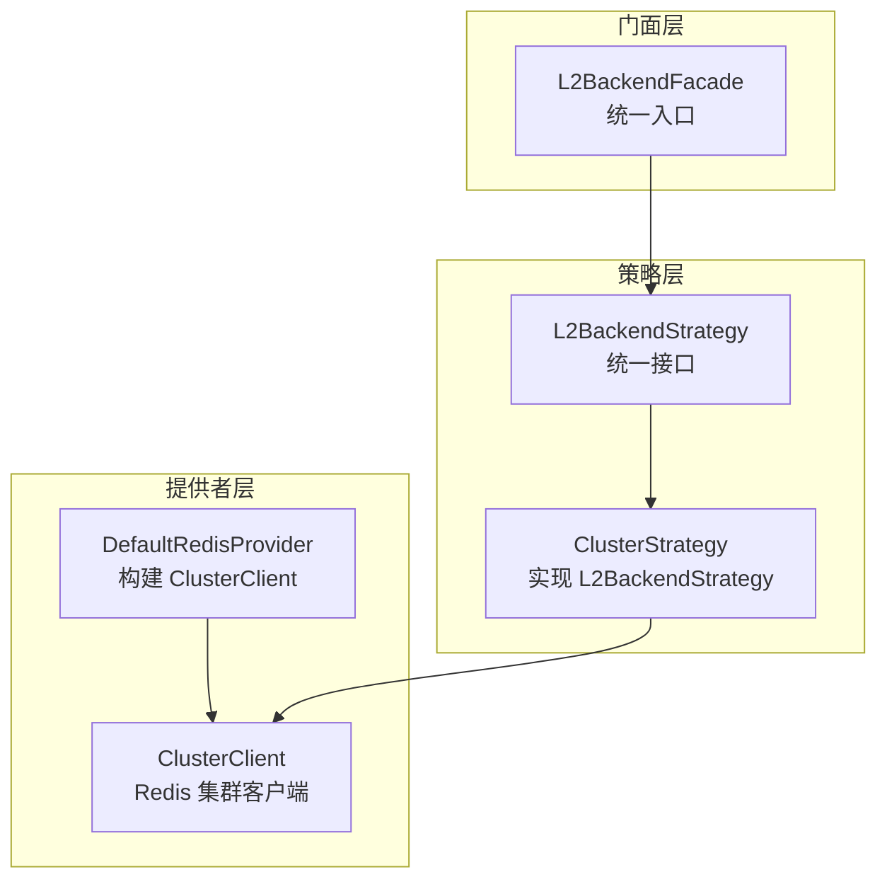
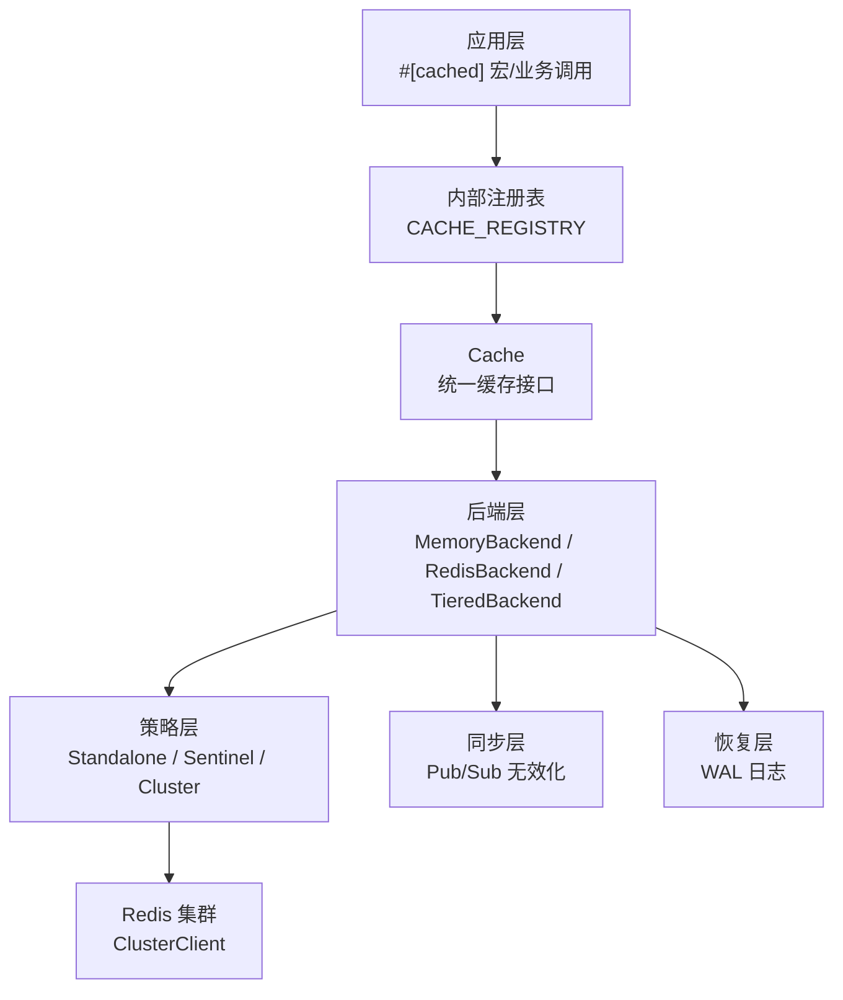
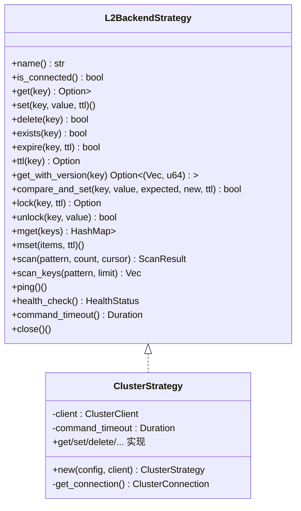
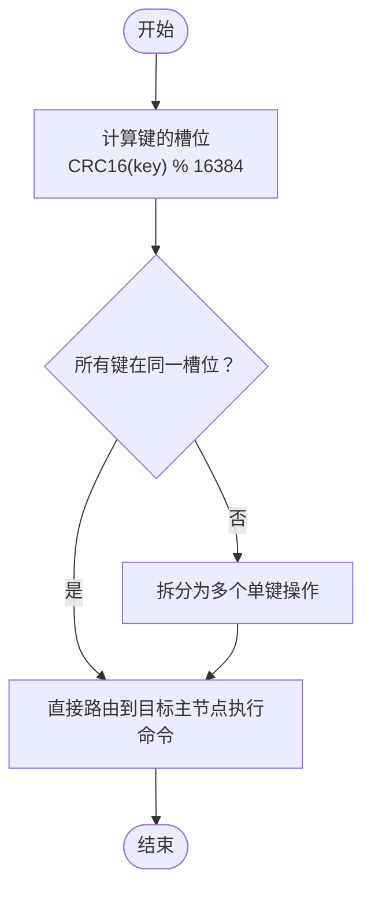
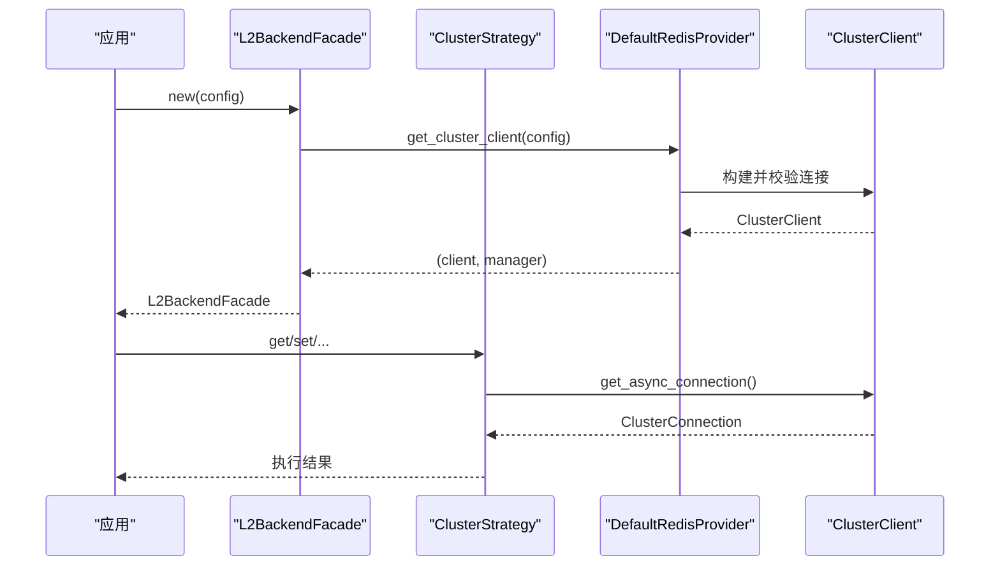
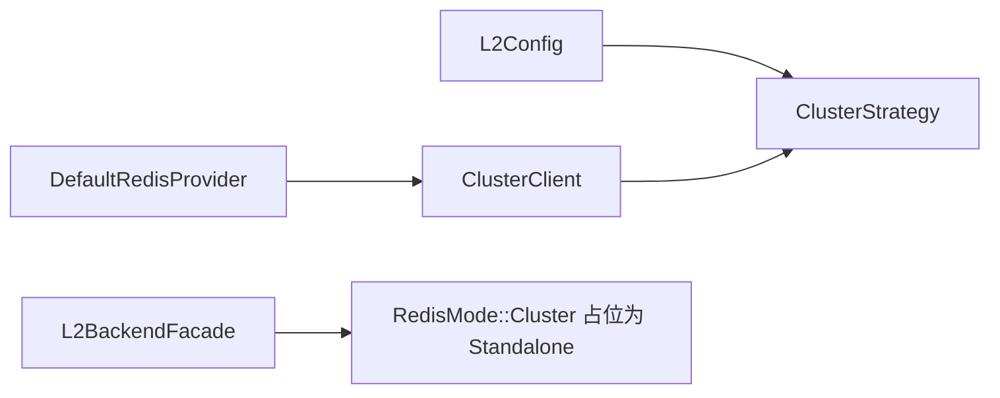

# 集群模式策略

<cite>
**本文档引用的文件**
- [src/backend/strategy/cluster.rs](file://src/backend/strategy/cluster.rs)
- [src/backend/strategy/traits.rs](file://src/backend/strategy/traits.rs)
- [src/backend/strategy/facade.rs](file://src/backend/strategy/facade.rs)
- [src/backend/client/redis/provider.rs](file://src/backend/client/redis/provider.rs)
- [src/config/service.rs](file://src/config/service.rs)
- [src/metrics.rs](file://src/metrics.rs)
- [docs/ARCHITECTURE.md](file://docs/ARCHITECTURE.md)
- [scripts/real_redis_test.sh](file://scripts/real_redis_test.sh)
- [tests/redis_test_utils.rs](file://tests/redis_test_utils.rs)
</cite>

## 目录
1. [简介](#简介)
2. [项目结构](#项目结构)
3. [核心组件](#核心组件)
4. [架构总览](#架构总览)
5. [详细组件分析](#详细组件分析)
6. [依赖关系分析](#依赖关系分析)
7. [性能考虑](#性能考虑)
8. [故障排查指南](#故障排查指南)
9. [结论](#结论)
10. [附录](#附录)

## 简介
本文件聚焦于集群模式（Cluster）缓存策略的架构设计与实现细节，系统阐述 Redis 集群的槽位分配、节点路由与命令分片机制；解释连接池管理与节点选择算法；梳理关键配置参数（初始节点列表、哈希槽映射、重定向处理）；并给出大规模部署的性能优化建议与监控策略，以及扩展性与容错能力说明。

## 项目结构
围绕集群模式的核心代码位于后端策略模块与 Redis 客户端提供者之间，形成“策略 + 提供者”的协作关系：
- 策略层：ClusterStrategy 实现 L2BackendStrategy，负责具体命令执行与错误处理
- 提供者层：DefaultRedisProvider 负责构建 ClusterClient，并启用从节点读取以提升可扩展性
- 门面层：L2BackendFacade 在运行时根据配置模式选择策略（当前集群模式暂用 Standalone 策略占位）

**图表来源**
- [src/backend/strategy/cluster.rs](file://src/backend/strategy/cluster.rs#L21-L56)
- [src/backend/strategy/traits.rs](file://src/backend/strategy/traits.rs#L85-L303)
- [src/backend/client/redis/provider.rs](file://src/backend/client/redis/provider.rs#L80-L109)
- [src/backend/strategy/facade.rs](file://src/backend/strategy/facade.rs#L68-L98)

**章节来源**
- [src/backend/strategy/cluster.rs](file://src/backend/strategy/cluster.rs#L1-L437)
- [src/backend/strategy/traits.rs](file://src/backend/strategy/traits.rs#L1-L304)
- [src/backend/strategy/facade.rs](file://src/backend/strategy/facade.rs#L1-L223)
- [src/backend/client/redis/provider.rs](file://src/backend/client/redis/provider.rs#L1-L194)
- [src/config/service.rs](file://src/config/service.rs#L51-L57)

## 核心组件
- ClusterStrategy：实现 L2BackendStrategy，封装 Redis 集群客户端，提供 GET/SET/DEL/MGET/MSET/SCAN/PING/HEALTH 等操作
- L2BackendStrategy：统一的后端策略接口，定义所有缓存操作的标准方法
- DefaultRedisProvider：负责构建 ClusterClient，支持密码认证与从节点读取
- L2BackendFacade：根据配置模式选择策略（当前集群模式暂用 Standalone 策略占位）

关键职责与行为：
- 槽位分配与节点路由：由底层 ClusterClient 自动处理，应用侧无需关心槽位计算
- 命令分片：MGET/MSET 在集群中要求所有键在同一槽位，否则需拆分为多次单键操作
- 连接池管理：ClusterClient 内部维护连接池，提供异步连接获取
- 健康检查：通过 PING 命令与超时控制保障可用性

**章节来源**
- [src/backend/strategy/cluster.rs](file://src/backend/strategy/cluster.rs#L21-L56)
- [src/backend/strategy/traits.rs](file://src/backend/strategy/traits.rs#L85-L303)
- [src/backend/client/redis/provider.rs](file://src/backend/client/redis/provider.rs#L80-L109)
- [src/backend/strategy/facade.rs](file://src/backend/strategy/facade.rs#L68-L98)

## 架构总览
集群模式在整体架构中的定位如下：

**图表来源**
- [docs/ARCHITECTURE.md](file://docs/ARCHITECTURE.md#L36-L73)
- [src/backend/strategy/cluster.rs](file://src/backend/strategy/cluster.rs#L58-L436)
- [src/backend/strategy/facade.rs](file://src/backend/strategy/facade.rs#L18-L98)

## 详细组件分析

### ClusterStrategy 组件分析
ClusterStrategy 是集群模式的核心实现，遵循 L2BackendStrategy 接口，提供以下能力：
- 基础操作：get/set/delete/exists/expire/ttl
- 版本化操作：get_with_version/compare_and_set（基于 Lua 原子脚本）
- 分布式锁：lock/unlock（基于 SET NX PX 与 Lua 脚本）
- 批量操作：mget/mset（注意集群限制：键需同槽位）
- 扫描：scan/scan_keys（当前简化实现，仅扫描首个节点）
- 健康检查：ping/health_check/command_timeout/close

**图表来源**
- [src/backend/strategy/traits.rs](file://src/backend/strategy/traits.rs#L85-L303)
- [src/backend/strategy/cluster.rs](file://src/backend/strategy/cluster.rs#L21-L56)

**章节来源**
- [src/backend/strategy/cluster.rs](file://src/backend/strategy/cluster.rs#L21-L436)
- [src/backend/strategy/traits.rs](file://src/backend/strategy/traits.rs#L12-L30)

### 命令分片与槽位分配流程
- 槽位分配：由 ClusterClient 自动根据 CRC16(key) % 16384 计算槽位，路由至对应主节点
- 命令分片：
  - MGET/MSET：要求所有键在同一槽位，否则需拆分为多次单键操作
  - SCAN：当前实现简化为仅扫描首个节点，完整实现应遍历所有节点
- 重定向处理：ClusterClient 内部处理 MOVED/ASK 重定向，应用侧透明

**图表来源**
- [src/backend/strategy/cluster.rs](file://src/backend/strategy/cluster.rs#L324-L354)

**章节来源**
- [src/backend/strategy/cluster.rs](file://src/backend/strategy/cluster.rs#L324-L354)

### 连接池管理与节点选择算法
- 连接池：ClusterClient 内部维护连接池，提供异步连接获取
- 节点选择：优先主节点；通过 read_from_replicas() 启用从节点读取，提升读扩展性
- 超时控制：command_timeout 来源于 L2Config，统一约束命令执行时间

**图表来源**
- [src/backend/strategy/facade.rs](file://src/backend/strategy/facade.rs#L68-L98)
- [src/backend/client/redis/provider.rs](file://src/backend/client/redis/provider.rs#L80-L109)
- [src/backend/strategy/cluster.rs](file://src/backend/strategy/cluster.rs#L48-L55)

**章节来源**
- [src/backend/client/redis/provider.rs](file://src/backend/client/redis/provider.rs#L80-L109)
- [src/backend/strategy/cluster.rs](file://src/backend/strategy/cluster.rs#L28-L45)

### 集群配置关键参数
- ClusterConfig.nodes：初始节点列表（至少一个即可发现全集群拓扑）
- L2Config.cluster：嵌套集群配置对象
- L2Config.password：可选密码认证
- L2Config.connection_timeout_ms/command_timeout_ms：连接与命令超时
- L2Config.enable_tls：是否启用 TLS（当前提供者未显式使用）
- read_from_replicas：在提供者中启用从节点读取，提升读吞吐

**章节来源**
- [src/config/service.rs](file://src/config/service.rs#L51-L57)
- [src/config/service.rs](file://src/config/service.rs#L382-L384)
- [src/config/service.rs](file://src/config/service.rs#L372-L375)
- [src/backend/client/redis/provider.rs](file://src/backend/client/redis/provider.rs#L85-L93)

### 健康检查与监控
- 健康检查：ping/health_check 通过 PING 命令与超时控制评估可用性
- 监控指标：operation_duration、l2_health_status 等指标便于观测 L2 层性能与健康状态

**章节来源**
- [src/backend/strategy/cluster.rs](file://src/backend/strategy/cluster.rs#L406-L426)
- [src/metrics.rs](file://src/metrics.rs#L294-L331)

## 依赖关系分析
- ClusterStrategy 依赖 L2Config（超时等参数）与 redis::cluster::ClusterClient
- L2BackendFacade 在 RedisMode::Cluster 分支下创建 StandaloneStrategy（当前占位），未来可替换为 ClusterStrategy
- DefaultRedisProvider 负责构建 ClusterClient，并启用 read_from_replicas

**图表来源**
- [src/backend/strategy/cluster.rs](file://src/backend/strategy/cluster.rs#L41-L45)
- [src/backend/client/redis/provider.rs](file://src/backend/client/redis/provider.rs#L85-L93)
- [src/backend/strategy/facade.rs](file://src/backend/strategy/facade.rs#L85-L89)

**章节来源**
- [src/backend/strategy/cluster.rs](file://src/backend/strategy/cluster.rs#L41-L45)
- [src/backend/strategy/facade.rs](file://src/backend/strategy/facade.rs#L85-L89)
- [src/backend/client/redis/provider.rs](file://src/backend/client/redis/provider.rs#L85-L93)

## 性能考虑
- 读扩展：启用 read_from_replicas 提升读吞吐，降低主节点压力
- 批量写：MSET 在同槽位场景下可显著提升写入吞吐
- 超时控制：合理设置 command_timeout_ms 与 connection_timeout_ms，避免长尾阻塞
- 序列化：优先使用二进制序列化（如 bincode）降低网络负载
- 扫描策略：SCAN 当前简化实现，生产环境建议按节点轮询或分片扫描

**章节来源**
- [src/backend/client/redis/provider.rs](file://src/backend/client/redis/provider.rs#L92-L93)
- [src/config/service.rs](file://src/config/service.rs#L372-L375)
- [docs/ARCHITECTURE.md](file://docs/ARCHITECTURE.md#L608-L632)

## 故障排查指南
常见问题与处理建议：
- 连接超时：检查 connection_timeout_ms 与网络连通性，确认 CLUSTER INFO 输出包含 cluster_state:ok
- 命令超时：调整 command_timeout_ms，关注热点键与慢查询
- 槽位不一致导致的批量失败：拆分为单键操作或确保键在同一槽位
- 健康检查失败：通过 health_check/ping 定位节点不可达或认证失败

验证工具与脚本：
- 等待 Redis 集合就绪并检查 CLUSTER INFO
- 集群哈希分布测试脚本

**章节来源**
- [tests/redis_test_utils.rs](file://tests/redis_test_utils.rs#L109-L158)
- [scripts/real_redis_test.sh](file://scripts/real_redis_test.sh#L248-L281)

## 结论
集群模式通过 ClusterClient 实现透明的槽位分配与节点路由，应用侧仅需关注统一的缓存接口。当前实现中，集群模式在门面层采用 Standalone 策略占位，后续可直接替换为 ClusterStrategy 以获得完整的集群特性。通过合理的配置参数、连接池与读扩展策略，可在大规模部署中获得良好的性能与可扩展性。

## 附录
- 集群模式测试脚本与工具可参考仓库中的集成测试与辅助脚本
- 架构文档提供了整体设计与性能基准，有助于理解集群模式在整个系统中的定位

**章节来源**
- [scripts/real_redis_test.sh](file://scripts/real_redis_test.sh#L248-L281)
- [docs/ARCHITECTURE.md](file://docs/ARCHITECTURE.md#L1-L723)
