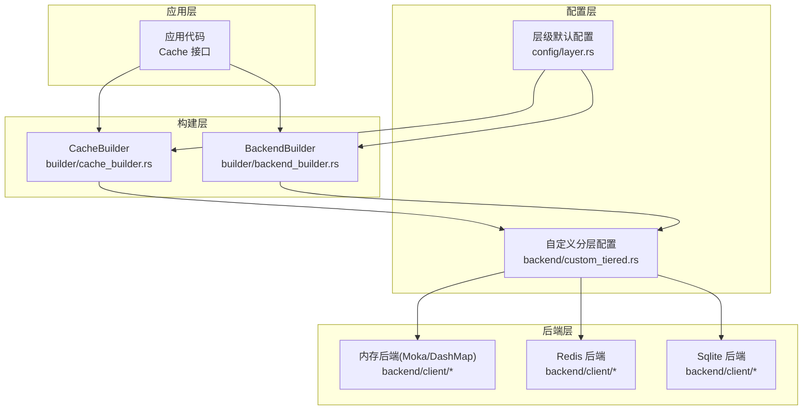
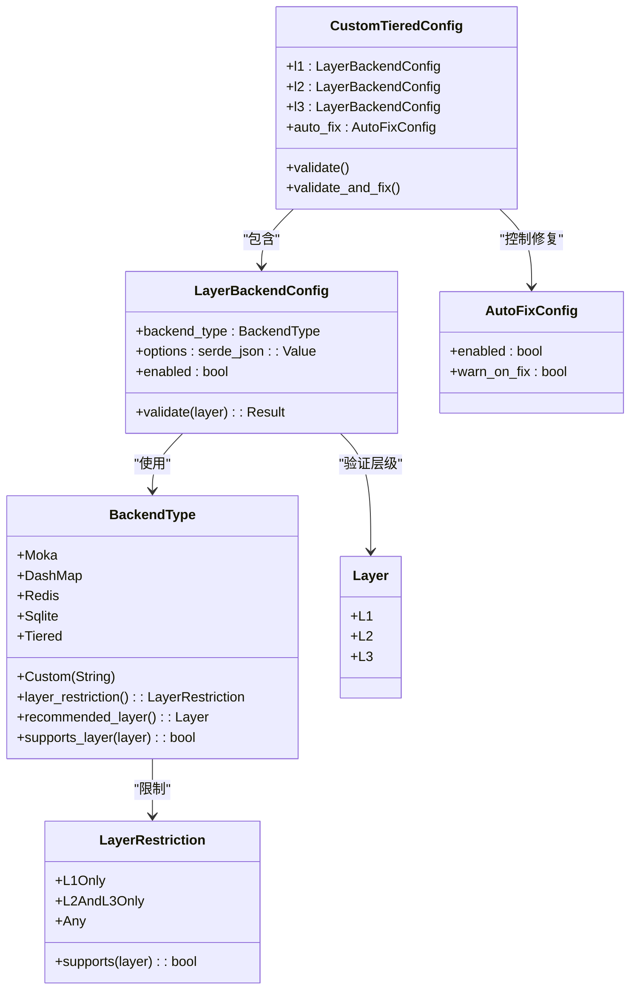
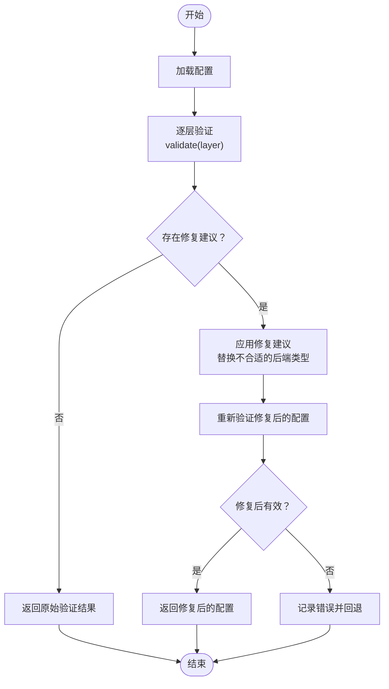
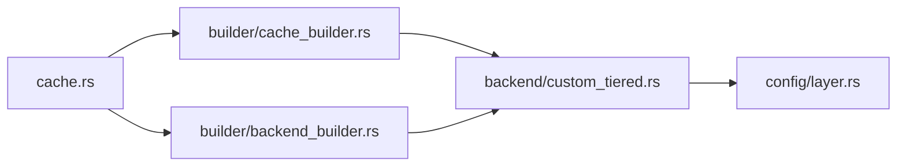

# 自定义层级缓存

<cite>
**本文引用的文件**
- [src/backend/custom_tiered.rs](file://src/backend/custom_tiered.rs)
- [src/config/layer.rs](file://src/config/layer.rs)
- [src/lib.rs](file://src/lib.rs)
- [src/cache.rs](file://src/cache.rs)
- [src/builder/cache_builder.rs](file://src/builder/cache_builder.rs)
- [src/builder/backend_builder.rs](file://src/builder/backend_builder.rs)
- [examples/src/smart_strategy.rs](file://examples/src/smart_strategy.rs)
</cite>

## 目录
1. [简介](#简介)
2. [项目结构](#项目结构)
3. [核心组件](#核心组件)
4. [架构总览](#架构总览)
5. [详细组件分析](#详细组件分析)
6. [依赖关系分析](#依赖关系分析)
7. [性能考虑](#性能考虑)
8. [故障排查指南](#故障排查指南)
9. [结论](#结论)
10. [附录](#附录)

## 简介
本文件系统性阐述 Oxcache 自定义层级缓存系统的实现原理与配置方法，重点覆盖以下内容：
- 分层缓存设计理念：L1 内存层与 L2/L3 分布式/持久化层的协作机制
- 自定义层级配置语法与参数含义：层优先级、容量分配、过期策略
- 层级间数据传播与一致性保障机制
- 智能选择算法与负载均衡策略
- 性能优化建议与监控方法
- 故障排查与调试技巧

## 项目结构
围绕自定义层级缓存，Oxcache 的相关模块组织如下：
- 后端与分层配置：位于 backend/custom_tiered.rs，提供 L1/L2/L3 后端类型、层级限制、自动修复与配置加载
- 层级默认配置：位于 config/layer.rs，提供 L1/L2/双层缓存默认参数
- 新式缓存接口：位于 cache.rs，统一对外的 Cache<K,V> 接口
- 构建器：位于 builder/cache_builder.rs 与 builder/backend_builder.rs，提供高级配置能力
- 文档与示例：位于 docs 与 examples，包含架构、性能、智能策略等文档与示例

图表来源
- [src/cache.rs](file://src/cache.rs#L117-L120)
- [src/builder/cache_builder.rs](file://src/builder/cache_builder.rs#L38-L45)
- [src/builder/backend_builder.rs](file://src/builder/backend_builder.rs#L40-L52)
- [src/config/layer.rs](file://src/config/layer.rs#L14-L22)
- [src/backend/custom_tiered.rs](file://src/backend/custom_tiered.rs#L362-L391)

章节来源
- [src/lib.rs](file://src/lib.rs#L417-L443)
- [src/config/layer.rs](file://src/config/layer.rs#L14-L22)

## 核心组件
- 自定义层级配置模型
  - 层级枚举：L1/L2/L3
  - 后端类型：Moka、DashMap、Redis、Sqlite、Tiered、Custom
  - 层级限制：L1Only、L2AndL3Only、Any
  - 单层后端配置：包含后端类型、选项、启用状态
  - 自动修复配置：开启/关闭、修复时告警
- 配置验证与修复
  - 验证每层后端类型与层级的匹配关系
  - 自动生成修复建议，并可自动修复
- 后端提供者与工厂
  - BackendProvider trait 支持依赖注入
  - DefaultBackendProvider 默认创建 L1/Moka、L2/Redis、L3/Redis
- 配置加载与安全校验
  - load_from_file 支持 TOML 文件加载
  - 路径安全校验：绝对路径、规范化、禁止符号链接等

章节来源
- [src/backend/custom_tiered.rs](file://src/backend/custom_tiered.rs#L309-L361)
- [src/backend/custom_tiered.rs](file://src/backend/custom_tiered.rs#L362-L451)
- [src/backend/custom_tiered.rs](file://src/backend/custom_tiered.rs#L519-L585)
- [src/backend/custom_tiered.rs](file://src/backend/custom_tiered.rs#L766-L779)
- [src/backend/custom_tiered.rs](file://src/backend/custom_tiered.rs#L805-L822)
- [src/backend/custom_tiered.rs](file://src/backend/custom_tiered.rs#L1032-L1139)
- [src/backend/custom_tiered.rs](file://src/backend/custom_tiered.rs#L1402-L1470)

## 架构总览
自定义层级缓存采用“配置驱动 + 类型安全 + 自动修复”的架构：
- 配置驱动：通过 CustomTieredConfig 描述 L1/L2/L3 的后端类型与选项
- 类型安全：BackendType 与 LayerRestriction 确保层级与后端类型匹配
- 自动修复：validate_and_fix 在启用时自动修正不合理的层级配置
- 统一接口：Cache<K,V> 对外暴露一致的缓存操作接口

图表来源
- [src/backend/custom_tiered.rs](file://src/backend/custom_tiered.rs#L309-L361)
- [src/backend/custom_tiered.rs](file://src/backend/custom_tiered.rs#L362-L451)
- [src/backend/custom_tiered.rs](file://src/backend/custom_tiered.rs#L519-L585)
- [src/backend/custom_tiered.rs](file://src/backend/custom_tiered.rs#L766-L779)
- [src/backend/custom_tiered.rs](file://src/backend/custom_tiered.rs#L805-L822)

## 详细组件分析

### 自定义层级配置模型与参数
- 层级与后端类型
  - L1：推荐 Moka/DashMap（高性能内存缓存）
  - L2：推荐 DashMap/Redis/Sqlite（本地持久化或分布式）
  - L3：推荐 Redis/Sqlite（分布式或持久化存储）
- 单层配置字段
  - backend_type：后端类型
  - options：后端特定配置（JSON）
  - enabled：是否启用该层
- 自动修复配置
  - enabled：是否启用自动修复
  - warn_on_fix：修复时是否输出告警

章节来源
- [src/backend/custom_tiered.rs](file://src/backend/custom_tiered.rs#L362-L451)
- [src/backend/custom_tiered.rs](file://src/backend/custom_tiered.rs#L519-L585)
- [src/backend/custom_tiered.rs](file://src/backend/custom_tiered.rs#L766-L779)
- [src/backend/custom_tiered.rs](file://src/backend/custom_tiered.rs#L805-L822)

### 配置验证与自动修复流程
- 验证步骤
  - 对每层调用 LayerBackendConfig::validate，检查后端类型与层级匹配
  - 生成 ConfigValidationResult，记录有效/无效层与修复建议
- 自动修复
  - 若启用 auto_fix 且存在修复建议，则将不合适的后端替换为推荐层级的合适类型
  - 重新验证修复后的配置，若仍无效则记录错误并回退

图表来源
- [src/backend/custom_tiered.rs](file://src/backend/custom_tiered.rs#L1032-L1139)
- [src/backend/custom_tiered.rs](file://src/backend/custom_tiered.rs#L1141-L1240)
- [src/backend/custom_tiered.rs](file://src/backend/custom_tiered.rs#L1251-L1317)

章节来源
- [src/backend/custom_tiered.rs](file://src/backend/custom_tiered.rs#L1032-L1139)
- [src/backend/custom_tiered.rs](file://src/backend/custom_tiered.rs#L1141-L1240)
- [src/backend/custom_tiered.rs](file://src/backend/custom_tiered.rs#L1251-L1317)

### 配置加载与安全校验
- load_from_file
  - 安全路径校验：绝对路径、规范化、禁止符号链接、可选目录白名单
  - TOML 解析并验证配置
  - 若验证失败或启用自动修复，按规则处理并返回结果

章节来源
- [src/backend/custom_tiered.rs](file://src/backend/custom_tiered.rs#L1402-L1470)

### 层级默认配置（L1/L2/双层）
- L1 层级配置：最大容量、键长、值大小、清理间隔、淘汰策略
- L2 层级配置：Redis 模式、连接串、超时、默认 TTL、键长、值大小
- 双层缓存配置：命中提升、批量写入开关与参数、键长与值大小上限

章节来源
- [src/config/layer.rs](file://src/config/layer.rs#L49-L95)
- [src/config/layer.rs](file://src/config/layer.rs#L97-L155)
- [src/config/layer.rs](file://src/config/layer.rs#L157-L206)

### 新式缓存接口与构建器
- Cache<K,V>：统一的类型安全缓存接口，封装底层 CacheBackend
- CacheBuilder：支持 TTL、容量、批量写入、自动提升等高级配置
- BackendBuilder：支持内存/Redis 后端的构建与配置

章节来源
- [src/cache.rs](file://src/cache.rs#L117-L120)
- [src/builder/cache_builder.rs](file://src/builder/cache_builder.rs#L38-L45)
- [src/builder/backend_builder.rs](file://src/builder/backend_builder.rs#L40-L52)

## 依赖关系分析
- 模块耦合
  - backend/custom_tiered.rs 与 config/layer.rs 通过统一的层级概念耦合
  - cache.rs 与 builder/* 通过类型安全接口耦合
- 外部依赖
  - Redis 后端需启用 redis feature
  - Moka/DashMap 后端需启用对应 feature
- 可能的循环依赖
  - 未发现直接循环依赖；模块职责清晰，接口边界明确

图表来源
- [src/backend/custom_tiered.rs](file://src/backend/custom_tiered.rs#L766-L779)
- [src/config/layer.rs](file://src/config/layer.rs#L14-L22)
- [src/cache.rs](file://src/cache.rs#L117-L120)
- [src/builder/cache_builder.rs](file://src/builder/cache_builder.rs#L38-L45)
- [src/builder/backend_builder.rs](file://src/builder/backend_builder.rs#L40-L52)

章节来源
- [src/lib.rs](file://src/lib.rs#L417-L443)
- [src/config/layer.rs](file://src/config/layer.rs#L14-L22)

## 性能考虑
- 层级容量分配
  - L1：高吞吐低延迟，容量适中，建议结合业务热点数据规模
  - L2：容量可放大，承担持久化与跨节点共享
  - L3：容量最大，适合冷数据与长期缓存
- 过期策略
  - L1：短 TTL，结合 LRU/LFU/TinyLfu 等策略
  - L2/L3：较长 TTL，配合批量写入与后台清理
- 批量写入与自动提升
  - 双层缓存可启用批量写入与命中提升，降低后端压力
- 智能策略
  - 预取与压缩：根据访问模式与数据大小自动优化

章节来源
- [src/config/layer.rs](file://src/config/layer.rs#L208-L232)
- [src/config/layer.rs](file://src/config/layer.rs#L234-L245)
- [src/config/layer.rs](file://src/config/layer.rs#L157-L206)
- [examples/src/smart_strategy.rs](file://examples/src/smart_strategy.rs#L27-L56)

## 故障排查指南
- 配置错误
  - 后端类型与层级不匹配：启用自动修复或手动调整
  - TTL/容量越界：遵循配置验证常量范围
- 路径安全
  - 配置文件路径必须为绝对路径，避免符号链接
- 日志与告警
  - 自动修复时会输出告警日志
  - 健康检查与统计接口可用于定位问题
- 常见问题
  - Redis 后端不可用：降级为内存后端或启用相应 feature
  - L3 后端缺失：确认 feature 开启或禁用 L3

章节来源
- [src/backend/custom_tiered.rs](file://src/backend/custom_tiered.rs#L216-L307)
- [src/backend/custom_tiered.rs](file://src/backend/custom_tiered.rs#L1402-L1470)
- [src/cache.rs](file://src/cache.rs#L534-L572)

## 结论
Oxcache 的自定义层级缓存通过“配置驱动 + 类型安全 + 自动修复”实现了灵活、稳健的多层缓存方案。借助 L1 内存层与 L2/L3 分布式/持久化层的协同，结合智能策略与完善的监控手段，可在不同业务场景下获得优异的性能与可靠性。

## 附录
- 配置示例与最佳实践
  - 三层缓存：L1 Moka、L2 DashMap、L3 Redis
  - 两层缓存：L1 Moka、L2 Redis
  - 单层 Redis：适用于简单场景
- 监控与运维
  - 利用 Cache::stats 与健康检查接口
  - 结合智能策略进行预取与压缩优化

章节来源
- [src/backend/custom_tiered.rs](file://src/backend/custom_tiered.rs#L744-L766)
- [src/cache.rs](file://src/cache.rs#L517-L572)
- [examples/src/smart_strategy.rs](file://examples/src/smart_strategy.rs#L73-L91)
