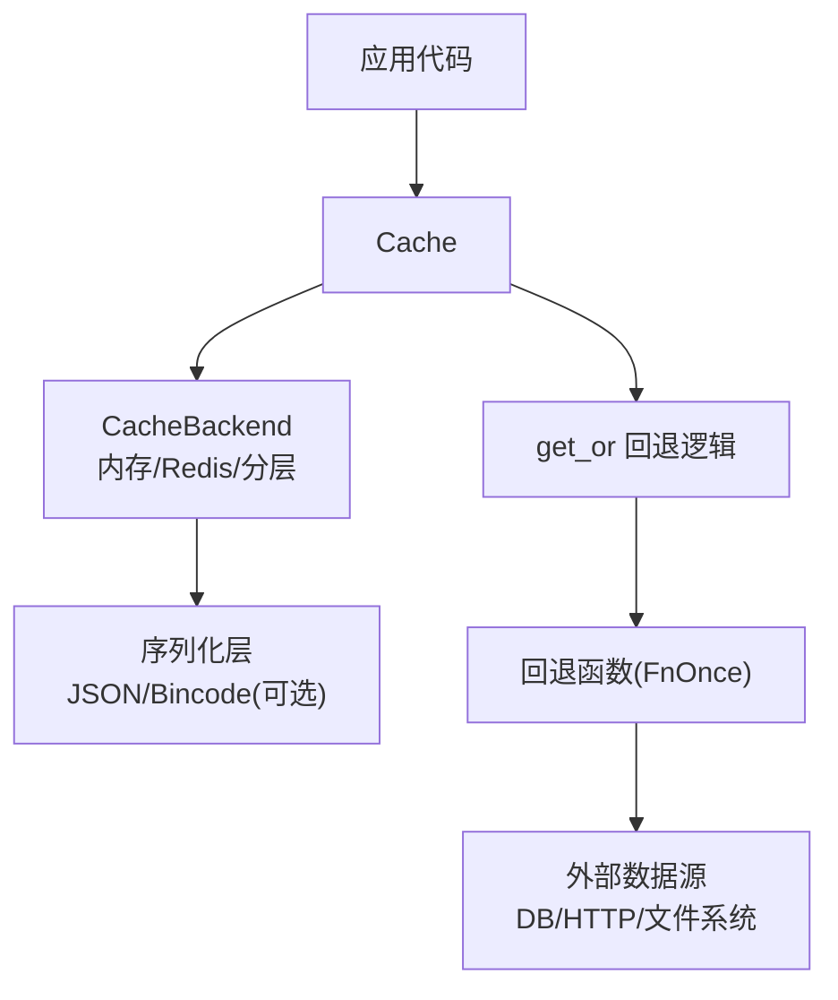
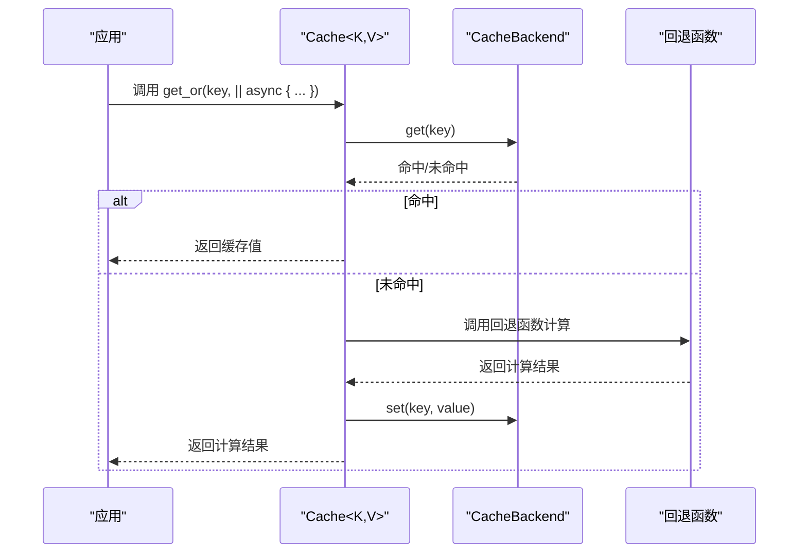
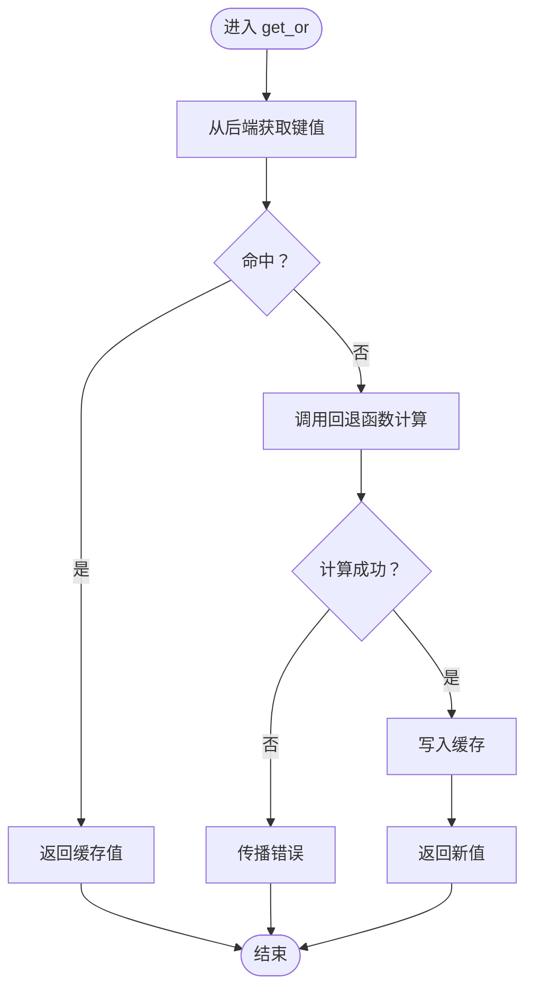
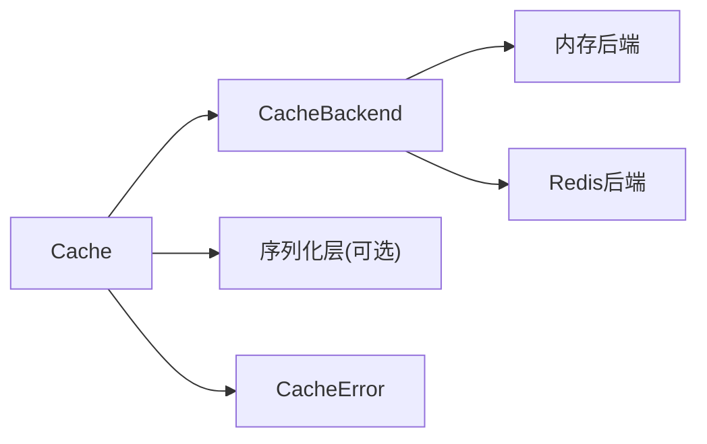

# 回退计算模式

<cite>
**本文档引用的文件**
- [src/lib.rs](file://src/lib.rs)
- [src/cache.rs](file://src/cache.rs)
- [src/error.rs](file://src/error.rs)
- [examples/src/01_basics/example_basic_operations.rs](file://examples/src/01_basics/example_basic_operations.rs)
- [examples/src/01_basics/example_comprehensive_usage.rs](file://examples/src/01_basics/example_comprehensive_usage.rs)
- [examples/src/http_cache.rs](file://examples/src/http_cache.rs)
- [examples/src/02_advanced/example_batch_write.rs](file://examples/src/02_advanced/example_batch_write.rs)
- [src/client/db_loader.rs](file://src/client/db_loader.rs)
- [docs/ARCHITECTURE.md](file://docs/ARCHITECTURE.md)
</cite>

## 目录
1. [简介](#简介)
2. [项目结构](#项目结构)
3. [核心组件](#核心组件)
4. [架构总览](#架构总览)
5. [详细组件分析](#详细组件分析)
6. [依赖分析](#依赖分析)
7. [性能考虑](#性能考虑)
8. [故障排除指南](#故障排除指南)
9. [结论](#结论)
10. [附录](#附录)

## 简介
本节介绍 Oxcache 的 get_or 回退计算模式，重点说明：
- 缓存旁路（Cache-Aside）与回退计算的工作原理
- 如何使用回退函数实现懒加载与延迟计算
- 典型使用场景：数据库查询、远程 API 调用等
- 回退函数的异步执行与错误处理策略
- 回退计算对性能的影响与优化方法
- 最佳实践与常见陷阱
- 完整代码示例路径（以文件路径代替具体代码）

## 项目结构
Oxcache 的现代 API 采用“统一缓存接口 + 可插拔后端”的设计。核心入口位于根模块导出，并通过 Cache 结构体提供类型安全的缓存操作，其中 get_or 方法即为回退计算模式的实现载体。

图示来源
- [src/lib.rs](file://src/lib.rs#L10-L43)
- [src/cache.rs](file://src/cache.rs#L117-L120)

章节来源
- [src/lib.rs](file://src/lib.rs#L10-L43)
- [src/cache.rs](file://src/cache.rs#L117-L120)

## 核心组件
- Cache<K, V>：统一缓存接口，提供 get、set、delete、exists、get_or 等方法；K 为键类型（需实现 CacheKey），V 为值类型（需实现 Cacheable）。
- get_or：实现缓存旁路与回退计算的核心方法，若缓存命中则直接返回，否则调用回退函数计算并写入缓存。
- 错误模型：统一的 CacheError 枚举，便于在回退计算中进行错误分类与处理。

章节来源
- [src/cache.rs](file://src/cache.rs#L117-L120)
- [src/cache.rs](file://src/cache.rs#L396-L408)
- [src/error.rs](file://src/error.rs#L75-L208)

## 架构总览
回退计算模式遵循经典的 Cache-Aside 模式：先查缓存，未命中再回源计算，最后写回缓存。该流程在 get_or 中以异步方式实现，支持任意外部数据源（数据库、远程服务等）。

图示来源
- [src/cache.rs](file://src/cache.rs#L396-L408)

## 详细组件分析

### get_or 回退计算模式
- 设计目标：简化“缓存旁路 + 回退计算”的常见模式，避免重复样板代码。
- 执行流程：
  1) 从后端获取键值；
  2) 若存在则直接返回；
  3) 若不存在，则调用回退函数异步计算；
  4) 将计算结果写入缓存并返回。
- 类型约束：回退函数接受 FnOnce() -> Fut，Fut 为异步 Future<Output = Result<V>>，保证只在未命中时执行一次。
- 错误传播：回退函数返回的错误将直接向上抛出，调用方负责处理。

图示来源
- [src/cache.rs](file://src/cache.rs#L396-L408)

章节来源
- [src/cache.rs](file://src/cache.rs#L396-L408)

### 回退函数的异步执行与错误处理
- 异步执行：回退函数必须返回 Future，确保不会阻塞缓存线程。
- 错误处理：
  - 回退函数内部可抛出 CacheError；get_or 将原样返回，调用方可根据错误类型决定是否重试或降级。
  - 常见策略：区分“未找到”与“网络/数据库异常”，前者可允许继续回退，后者可快速失败或重试。
  - 参考错误类型：NotFound、Connection、Timeout、DatabaseError、L2Error 等。

章节来源
- [src/error.rs](file://src/error.rs#L75-L208)

### 缓存旁路模式与懒加载
- 懒加载：只有在首次访问或缓存失效时才触发回退计算，后续请求直接命中缓存。
- 旁路策略：get_or 明确分离“读缓存”和“回源计算”，避免在缓存命中时做无谓的外部调用。

章节来源
- [src/cache.rs](file://src/cache.rs#L396-L408)

### 使用场景示例（代码路径）
- 基础 CRUD 与回退模式结合：参考示例中的基本操作与 get_or 使用路径。
  - [示例：基本操作](file://examples/src/01_basics/example_basic_operations.rs#L21-L72)
  - [示例：综合使用（含 get_or 场景思路）](file://examples/src/01_basics/example_comprehensive_usage.rs#L37-L224)
- HTTP 缓存集成：将 HTTP 响应作为缓存值，结合 get_or 实现“缓存未命中时发起请求”的模式。
  - [示例：HTTP 缓存](file://examples/src/http_cache.rs#L20-L107)
- 批量写入优化：虽然非回退场景，但展示了并发写入与性能优化思路，有助于理解回退计算的吞吐优化。
  - [示例：批量写入](file://examples/src/02_advanced/example_batch_write.rs#L25-L153)

章节来源
- [examples/src/01_basics/example_basic_operations.rs](file://examples/src/01_basics/example_basic_operations.rs#L21-L72)
- [examples/src/01_basics/example_comprehensive_usage.rs](file://examples/src/01_basics/example_comprehensive_usage.rs#L37-L224)
- [examples/src/http_cache.rs](file://examples/src/http_cache.rs#L20-L107)
- [examples/src/02_advanced/example_batch_write.rs](file://examples/src/02_advanced/example_batch_write.rs#L25-L153)

### 回退函数的实现建议
- 数据库查询：在回退函数中执行 SQL 查询，遇到超时或连接错误时返回相应错误，由上层决定重试或降级。
- 远程 API：封装 HTTP 客户端，设置合理超时与重试策略，避免阻塞缓存线程。
- 文件系统：读取本地文件或对象存储，注意权限与路径校验。

章节来源
- [src/client/db_loader.rs](file://src/client/db_loader.rs#L269-L305)

## 依赖分析
- Cache<K, V> 依赖 CacheBackend 抽象，通过统一接口适配内存与 Redis 后端。
- get_or 依赖序列化层（可选）以支持类型安全的 get/set。
- 错误模型统一，便于在回退链路中进行错误分类与处理。

图示来源
- [src/cache.rs](file://src/cache.rs#L117-L120)
- [src/error.rs](file://src/error.rs#L75-L208)

章节来源
- [src/cache.rs](file://src/cache.rs#L117-L120)
- [src/error.rs](file://src/error.rs#L75-L208)

## 性能考虑
- 回退计算的性能瓶颈通常来自外部数据源（数据库、远程服务）。建议：
  - 为回退函数设置合理的超时与重试策略，避免长时间阻塞。
  - 对热点数据设置合适的 TTL，减少回退频率。
  - 使用并发与批量写入（如批量写入示例所示）提升吞吐。
- 缓存命中率：通过 stats 接口监控命中率，持续优化键设计与 TTL。
- 旁路成本：get_or 在未命中时会产生一次额外的回源调用与一次写入，需权衡一致性与性能。

章节来源
- [examples/src/02_advanced/example_batch_write.rs](file://examples/src/02_advanced/example_batch_write.rs#L25-L153)
- [src/cache.rs](file://src/cache.rs#L517-L532)

## 故障排除指南
- 常见错误类型与处理：
  - NotFound：键不存在，适合继续回退计算。
  - Connection/Timeout/L2Error：网络或后端异常，建议快速失败或有限重试。
  - DatabaseError：数据库错误，可结合业务策略进行重试或降级。
- 错误分类辅助方法：is_not_found、is_connection_error、is_degraded 等，便于在回退链路中进行差异化处理。
- 回源超时：对于数据库加载器等场景，可设置超时并在超时后旁路返回，避免阻塞主流程。

章节来源
- [src/error.rs](file://src/error.rs#L228-L287)
- [src/client/db_loader.rs](file://src/client/db_loader.rs#L269-L305)

## 结论
Oxcache 的 get_or 回退计算模式以简洁的 API 实现了标准的 Cache-Aside 模式，使开发者能够以最小代价实现懒加载与延迟计算。通过合理的错误处理、超时与重试策略，以及性能优化手段（如并发与批量写入），可以在高并发场景下获得稳定且高效的缓存体验。

## 附录
- 架构图（读取路径与 #[cached] 宏流程）可参考架构文档中的流程图，帮助理解回退计算在宏缓存与直接 API 两种使用方式下的差异与共性。

章节来源
- [docs/ARCHITECTURE.md](file://docs/ARCHITECTURE.md#L448-L504)
