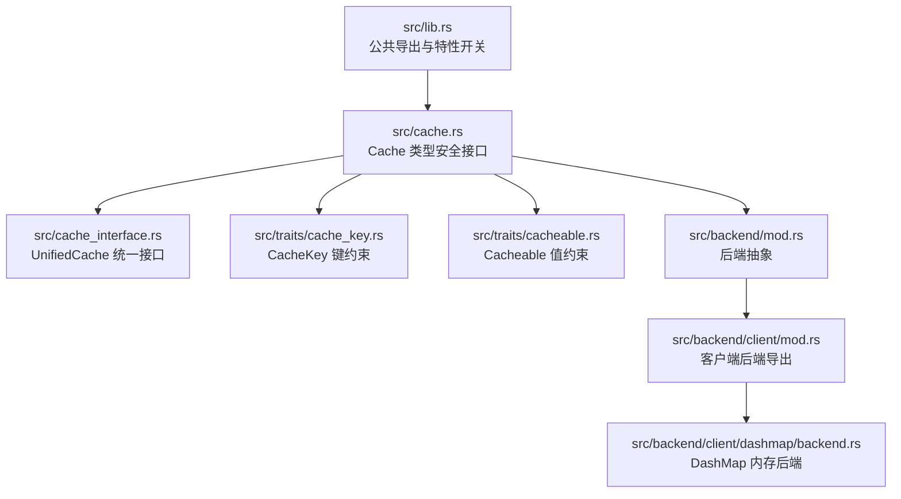
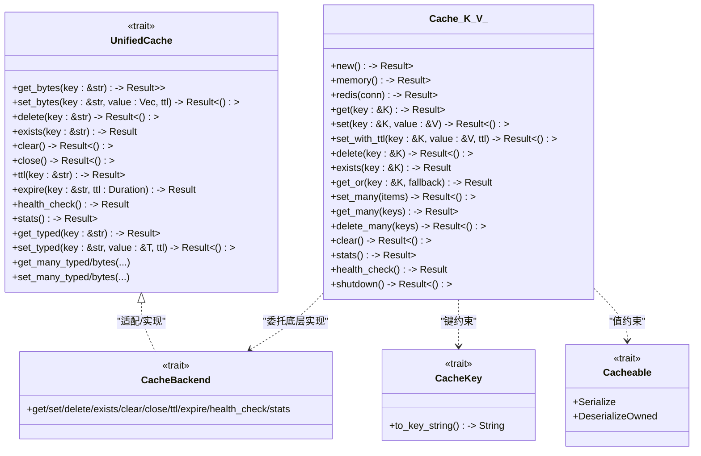
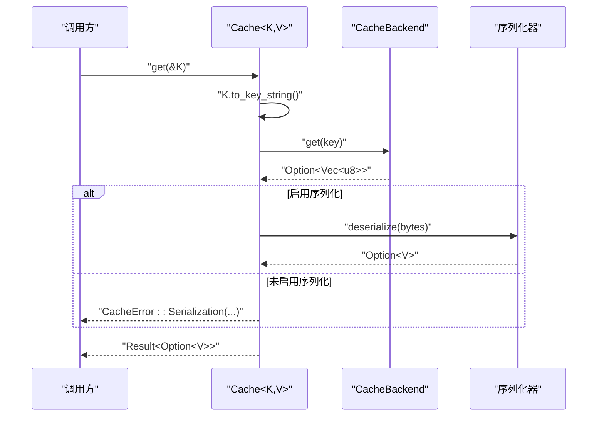
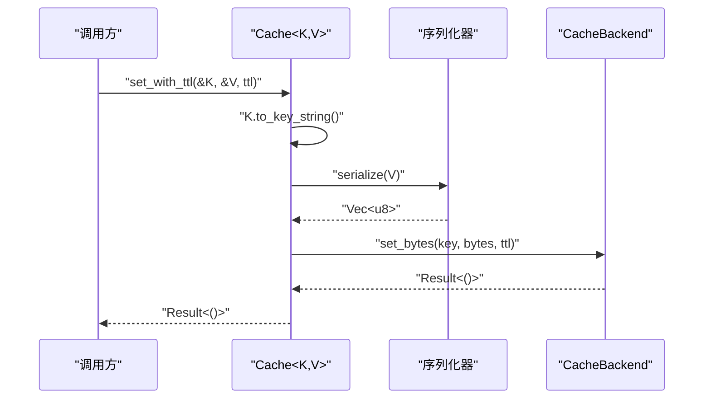
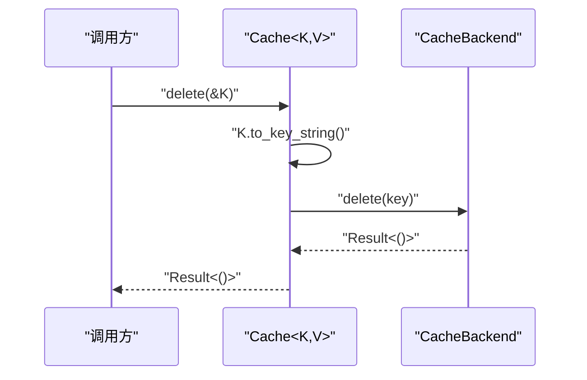
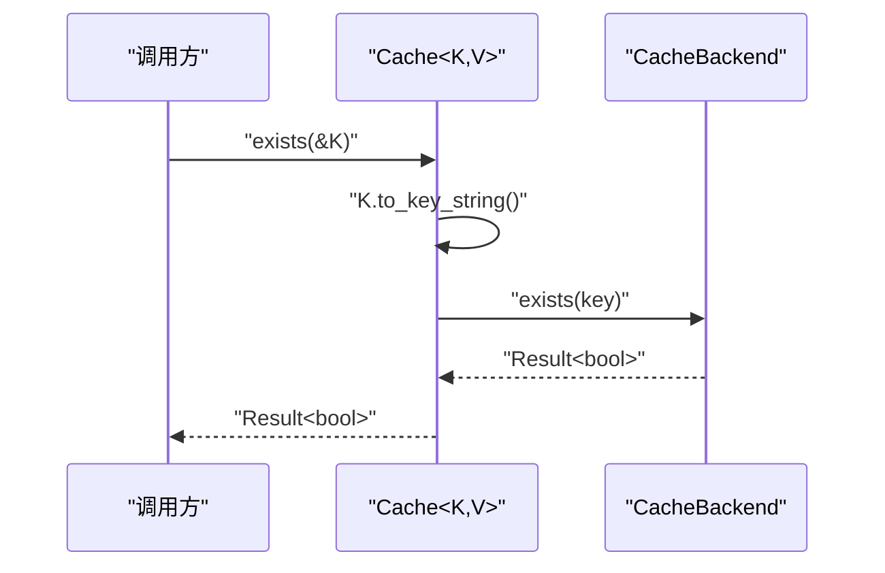
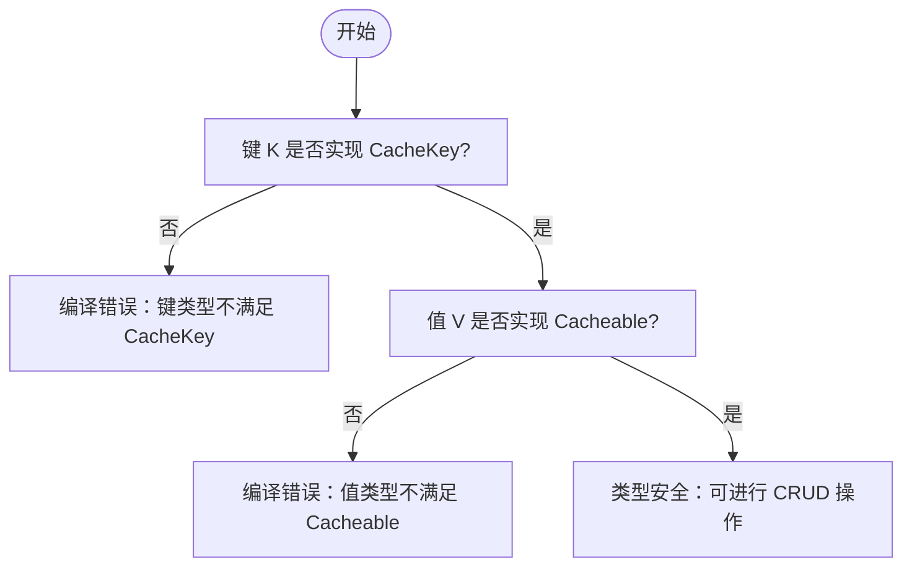
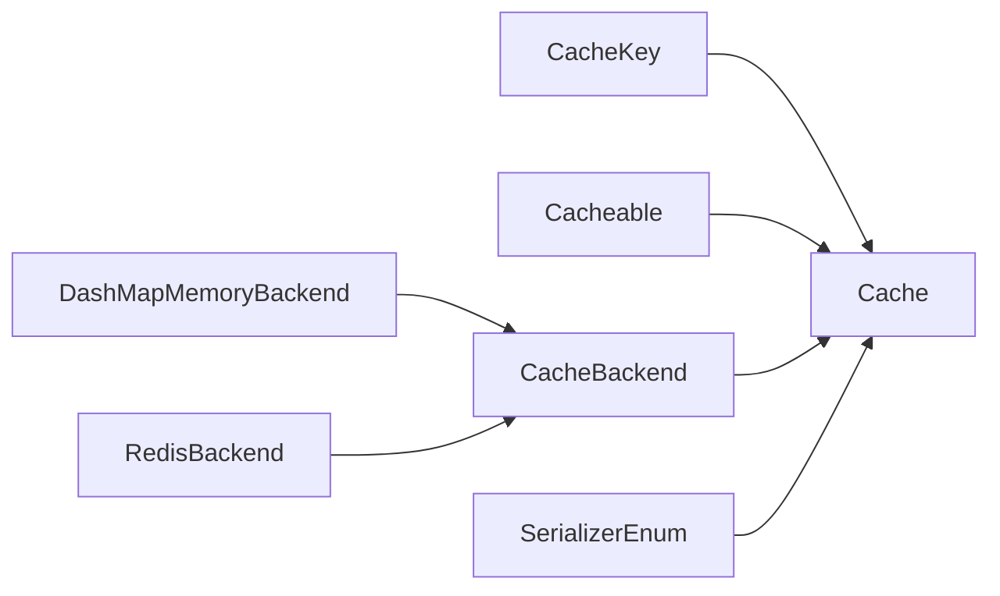

# 基础 CRUD 操作

<cite>
**本文引用的文件**
- [src/lib.rs](file://src/lib.rs)
- [src/cache.rs](file://src/cache.rs)
- [src/cache_interface.rs](file://src/cache_interface.rs)
- [src/traits/cache_key.rs](file://src/traits/cache_key.rs)
- [src/traits/cacheable.rs](file://src/traits/cacheable.rs)
- [src/backend/mod.rs](file://src/backend/mod.rs)
- [src/backend/client/mod.rs](file://src/backend/client/mod.rs)
- [src/backend/client/dashmap/mod.rs](file://src/backend/client/dashmap/mod.rs)
- [src/backend/client/dashmap/backend.rs](file://src/backend/client/dashmap/backend.rs)
- [examples/src/01_basics/example_basic_operations.rs](file://examples/src/01_basics/example_basic_operations.rs)
- [examples/src/01_basics/example_new_api.rs](file://examples/src/01_basics/example_new_api.rs)
- [examples/src/01_basics/example_comprehensive_usage.rs](file://examples/src/01_basics/example_comprehensive_usage.rs)
- [docs/API_REFERENCE.md](file://docs/API_REFERENCE.md)
</cite>

## 目录
1. [简介](#简介)
2. [项目结构](#项目结构)
3. [核心组件](#核心组件)
4. [架构总览](#架构总览)
5. [详细组件分析](#详细组件分析)
6. [依赖分析](#依赖分析)
7. [性能考量](#性能考量)
8. [故障排查指南](#故障排查指南)
9. [结论](#结论)
10. [附录](#附录)

## 简介
本章节聚焦 Oxcache 的基础 CRUD 操作接口，系统讲解 get、set、delete、exists 四个核心方法的实现原理与使用方式；阐明类型安全设计如何通过泛型约束与 trait 约束确保键值类型的正确性；给出异步执行机制与错误处理策略；对比内存与 Redis 两种后端在基本操作上的行为差异，并提供性能优化建议与最佳实践。

## 项目结构
围绕基础 CRUD 的关键模块与文件如下：
- 核心入口与公共 API：lib.rs
- Cache 类型与 CRUD 方法：cache.rs
- 统一缓存接口与适配器：cache_interface.rs
- 键与可缓存类型约束：traits/cache_key.rs、traits/cacheable.rs
- 后端抽象与实现：backend/mod.rs、backend/client/mod.rs
- 内存后端实现（DashMap）：backend/client/dashmap/backend.rs
- 示例与用法：examples 下的基础示例

图表来源
- [src/lib.rs](file://src/lib.rs#L517-L639)
- [src/cache.rs](file://src/cache.rs#L117-L121)
- [src/cache_interface.rs](file://src/cache_interface.rs#L24-L300)
- [src/traits/cache_key.rs](file://src/traits/cache_key.rs#L38-L49)
- [src/traits/cacheable.rs](file://src/traits/cacheable.rs#L7-L46)
- [src/backend/mod.rs](file://src/backend/mod.rs#L26-L59)
- [src/backend/client/mod.rs](file://src/backend/client/mod.rs#L12-L34)
- [src/backend/client/dashmap/backend.rs](file://src/backend/client/dashmap/backend.rs#L50-L63)

章节来源
- [src/lib.rs](file://src/lib.rs#L517-L639)
- [src/cache.rs](file://src/cache.rs#L117-L121)
- [src/cache_interface.rs](file://src/cache_interface.rs#L24-L300)
- [src/traits/cache_key.rs](file://src/traits/cache_key.rs#L38-L49)
- [src/traits/cacheable.rs](file://src/traits/cacheable.rs#L7-L46)
- [src/backend/mod.rs](file://src/backend/mod.rs#L26-L59)
- [src/backend/client/mod.rs](file://src/backend/client/mod.rs#L12-L34)
- [src/backend/client/dashmap/backend.rs](file://src/backend/client/dashmap/backend.rs#L50-L63)

## 核心组件
- Cache<K, V>：面向用户的类型安全缓存接口，提供 get、set、delete、exists 等 CRUD 方法，以及 get_or、批量操作、清理与健康检查等扩展能力。
- UnifiedCache：统一的底层接口，封装字节级与类型级操作、分层与分布式能力、批处理与 TTL 控制等。
- CacheKey：键到字符串的转换约束，支持 String/&str、整数类型及自定义类型。
- Cacheable：值的序列化/反序列化约束，要求实现 serde 的 Serialize 与 DeserializeOwned。
- 后端抽象：CacheBackend 接口由具体内存/Redis 实现提供，Cache 将键值转换与序列化委托给后端。

章节来源
- [src/cache.rs](file://src/cache.rs#L117-L121)
- [src/cache_interface.rs](file://src/cache_interface.rs#L24-L300)
- [src/traits/cache_key.rs](file://src/traits/cache_key.rs#L38-L49)
- [src/traits/cacheable.rs](file://src/traits/cacheable.rs#L7-L46)

## 架构总览
下面以类图展示 Cache、UnifiedCache 与后端的关系，以及键值约束如何保证类型安全。

图表来源
- [src/cache.rs](file://src/cache.rs#L117-L646)
- [src/cache_interface.rs](file://src/cache_interface.rs#L24-L300)
- [src/traits/cache_key.rs](file://src/traits/cache_key.rs#L38-L49)
- [src/traits/cacheable.rs](file://src/traits/cacheable.rs#L7-L46)
- [src/backend/mod.rs](file://src/backend/mod.rs#L26-L59)

## 详细组件分析

### get 方法：读取缓存值
- 类型安全：键通过 K: CacheKey 转换为字符串；值通过 V: Cacheable 反序列化。
- 序列化路径：当启用 serialization 特性时，Cache::get 先调用后端 get_bytes，再用 JsonSerializer 反序列化为 V；否则返回“需要序列化”错误。
- 异步执行：所有后端操作均为异步，返回 Result，错误通过统一的 CacheError 表达。
- 行为差异：内存后端（如 DashMap）按需检查 TTL；Redis 后端由远端管理 TTL。

图表来源
- [src/cache.rs](file://src/cache.rs#L241-L264)
- [src/cache_interface.rs](file://src/cache_interface.rs#L133-L143)

章节来源
- [src/cache.rs](file://src/cache.rs#L241-L264)
- [src/cache_interface.rs](file://src/cache_interface.rs#L133-L143)

### set 方法：写入缓存值
- set：默认不设置 TTL，调用 set_with_ttl(None)。
- set_with_ttl：将 V 序列化为字节，调用后端 set_bytes(key, bytes, ttl)。
- 异步与错误：后端返回 Result，统一映射为 CacheError；内存/Redis 后端分别处理本地或网络异常。

图表来源
- [src/cache.rs](file://src/cache.rs#L307-L325)
- [src/cache_interface.rs](file://src/cache_interface.rs#L145-L154)

章节来源
- [src/cache.rs](file://src/cache.rs#L283-L325)
- [src/cache_interface.rs](file://src/cache_interface.rs#L145-L154)

### delete 方法：删除缓存键
- 将键转换为字符串后直接调用后端 delete。
- 行为一致性：内存与 Redis 后端均支持删除，返回 Result<()>。

图表来源
- [src/cache.rs](file://src/cache.rs#L343-L346)
- [src/cache_interface.rs](file://src/cache_interface.rs#L35-L39)

章节来源
- [src/cache.rs](file://src/cache.rs#L343-L346)
- [src/cache_interface.rs](file://src/cache_interface.rs#L35-L39)

### exists 方法：键存在性检查
- 将键转换为字符串后调用后端 exists，返回布尔结果。
- 语义：若后端返回 None（内存后端）或不存在（Redis），视为 false。

图表来源
- [src/cache.rs](file://src/cache.rs#L367-L370)
- [src/cache_interface.rs](file://src/cache_interface.rs#L38-L41)

章节来源
- [src/cache.rs](file://src/cache.rs#L367-L370)
- [src/cache_interface.rs](file://src/cache_interface.rs#L38-L41)

### 类型安全设计：泛型与 trait 约束
- 键约束：K: CacheKey，确保任意类型键可稳定转为字符串键。
- 值约束：V: Cacheable（在启用序列化特性时），确保值可被序列化与反序列化。
- 键的常见实现：String、&str、u64/i64 等；也可自定义类型实现 CacheKey。
- 值的常见实现：任何实现 serde 的 Serialize/DeserializeOwned 的类型。

图表来源
- [src/traits/cache_key.rs](file://src/traits/cache_key.rs#L38-L49)
- [src/traits/cacheable.rs](file://src/traits/cacheable.rs#L7-L46)

章节来源
- [src/traits/cache_key.rs](file://src/traits/cache_key.rs#L38-L49)
- [src/traits/cacheable.rs](file://src/traits/cacheable.rs#L7-L46)

### 异步执行机制与错误处理
- 异步模型：所有 CRUD 操作均返回 Result，内部通过 async/await 调用后端。
- 错误来源：序列化/反序列化失败、后端连接异常、特性缺失（如未启用 serialization 导致无法进行类型化 get/set）。
- 统一错误：通过 CacheError 表达，调用方可据此进行重试、降级或记录日志。

章节来源
- [src/cache.rs](file://src/cache.rs#L241-L264)
- [src/cache.rs](file://src/cache.rs#L307-L325)

### 不同缓存后端的行为差异（内存 vs Redis）
- 内存后端（DashMap/Moka）：
  - 本地并发访问，无网络开销。
  - TTL 管理策略：DashMap 需手动检查过期；Moka 支持自动逐出与 TTL。
  - 清理与统计：支持 clear、stats 等。
- Redis 后端：
  - 远程持久化与共享缓存，适合多实例部署。
  - TTL 由 Redis 管理，支持原子过期控制。
  - 支持分布式锁、发布订阅等高级特性（取决于配置与特性）。

章节来源
- [src/backend/client/dashmap/backend.rs](file://src/backend/client/dashmap/backend.rs#L155-L200)
- [src/cache_interface.rs](file://src/cache_interface.rs#L53-L57)

### 具体使用示例（代码片段路径）
- 基本 CRUD 操作示例：[examples/src/01_basics/example_basic_operations.rs](file://examples/src/01_basics/example_basic_operations.rs#L21-L72)
- 新 API 综合示例（含 TTL、exists、delete、clear、get_or 等）：[examples/src/01_basics/example_new_api.rs](file://examples/src/01_basics/example_new_api.rs#L30-L271)
- 综合使用示例（批量、TTL、并发性能）：[examples/src/01_basics/example_comprehensive_usage.rs](file://examples/src/01_basics/example_comprehensive_usage.rs#L37-L225)

章节来源
- [examples/src/01_basics/example_basic_operations.rs](file://examples/src/01_basics/example_basic_operations.rs#L21-L72)
- [examples/src/01_basics/example_new_api.rs](file://examples/src/01_basics/example_new_api.rs#L30-L271)
- [examples/src/01_basics/example_comprehensive_usage.rs](file://examples/src/01_basics/example_comprehensive_usage.rs#L37-L225)

## 依赖分析
- Cache<K, V> 依赖：
  - CacheKey：键转换
  - Cacheable：值序列化
  - CacheBackend：后端实现
  - SerializerEnum（可选）：序列化器选择
- 后端导出：
  - 内存后端：Moka/DashMap
  - Redis 后端：RedisBackend（受 feature 控制）

图表来源
- [src/cache.rs](file://src/cache.rs#L117-L121)
- [src/backend/mod.rs](file://src/backend/mod.rs#L26-L59)
- [src/backend/client/mod.rs](file://src/backend/client/mod.rs#L12-L34)

章节来源
- [src/cache.rs](file://src/cache.rs#L117-L121)
- [src/backend/mod.rs](file://src/backend/mod.rs#L26-L59)
- [src/backend/client/mod.rs](file://src/backend/client/mod.rs#L12-L34)

## 性能考量
- 序列化成本：启用 serialization 特性会引入序列化/反序列化开销；对于简单字节数组可考虑使用 get_bytes/set_bytes 避免序列化。
- 并发与锁：DashMap 无锁并发，适合高吞吐读场景；Moka 提供更丰富的逐出策略与 TTL 管理。
- 批量操作：优先使用 set_many/get_many 减少往返次数。
- TTL 策略：合理设置 TTL，避免频繁重建与热点失效。
- 特性选择：根据部署环境选择内存或 Redis 后端，必要时结合两者（分层缓存）。

## 故障排查指南
- “需要序列化”错误：未启用 serialization 特性时，无法进行类型化的 get/set。请启用相应特性或改用字节级操作。
- Redis 不可用：检查连接字符串、网络连通性与 TLS 设置；可在示例中参考环境变量与降级逻辑。
- TTL 无效：确认后端是否支持 TTL（Redis 支持），或在内存后端正确配置默认 TTL。
- 键冲突：确保自定义键类型实现 CacheKey 时输出唯一且稳定的字符串表示。

章节来源
- [src/cache.rs](file://src/cache.rs#L241-L264)
- [src/cache.rs](file://src/cache.rs#L307-L325)
- [docs/API_REFERENCE.md](file://docs/API_REFERENCE.md#L27-L92)

## 结论
Oxcache 的基础 CRUD 接口通过类型安全的泛型与 trait 约束，结合统一的后端抽象与序列化机制，提供了跨内存与 Redis 的一致使用体验。开发者应根据部署与性能需求选择合适的后端与特性组合，并遵循批量操作、合理 TTL 与错误处理的最佳实践。

## 附录
- API 参考与特性说明：[docs/API_REFERENCE.md](file://docs/API_REFERENCE.md#L27-L92)
- DashMap 后端实现要点：[src/backend/client/dashmap/backend.rs](file://src/backend/client/dashmap/backend.rs#L155-L200)