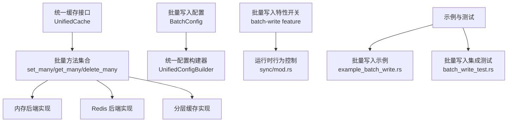
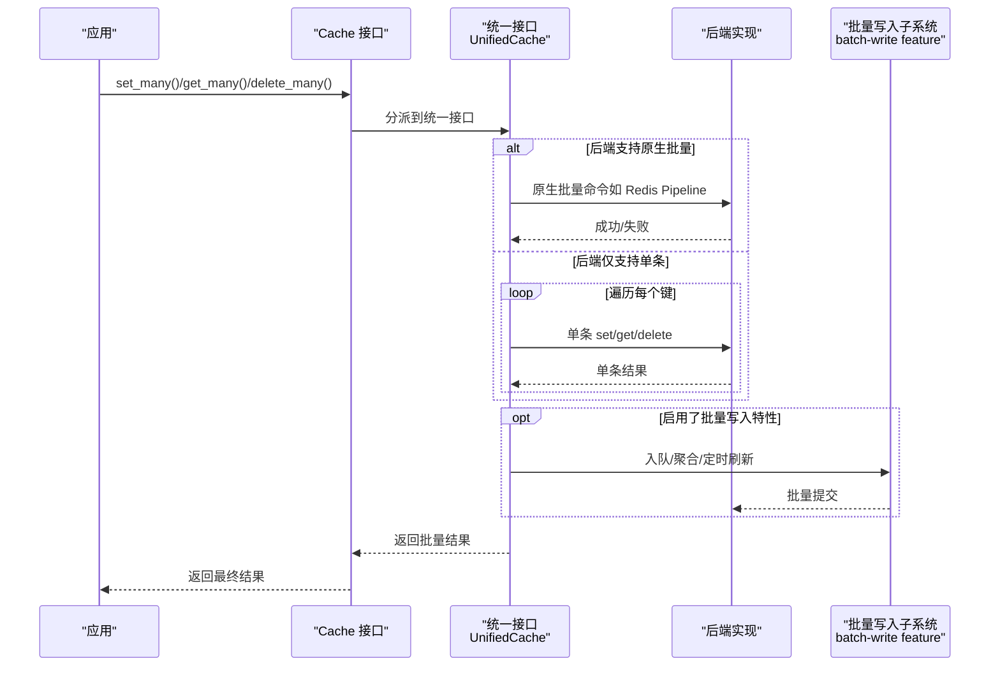
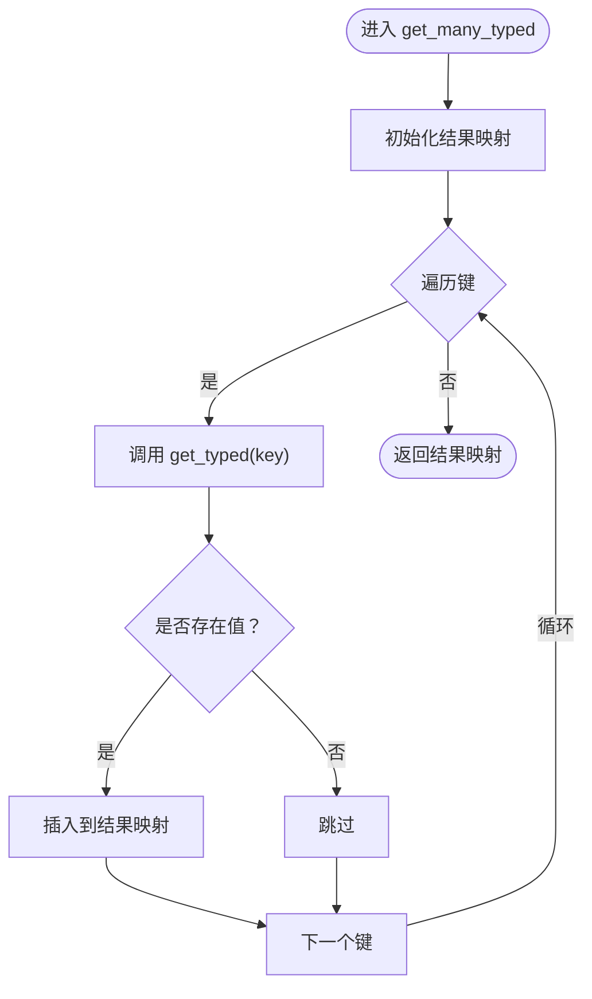
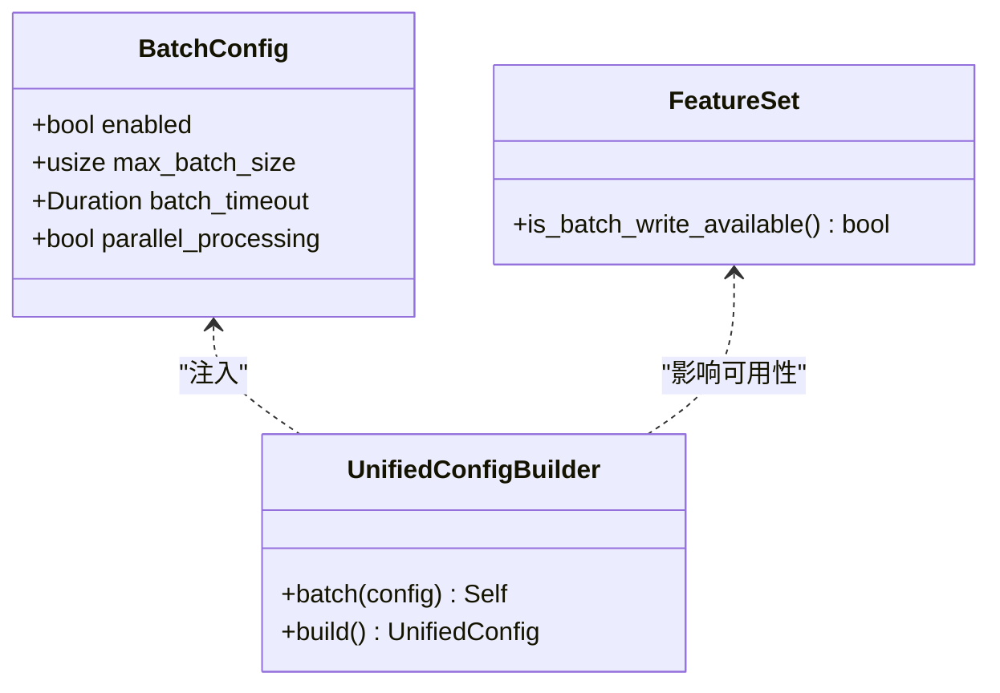
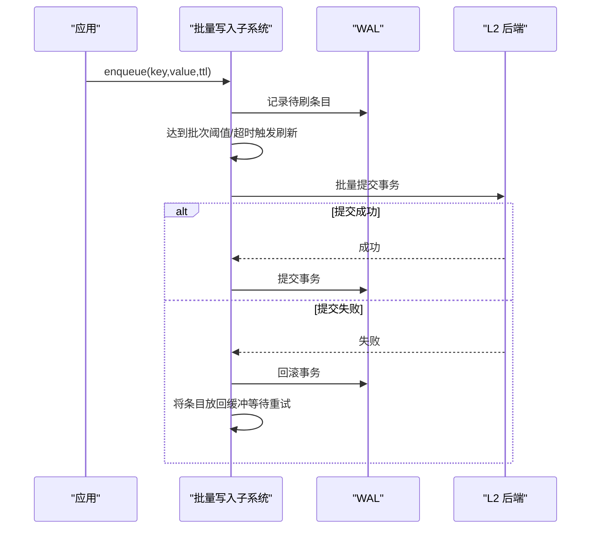
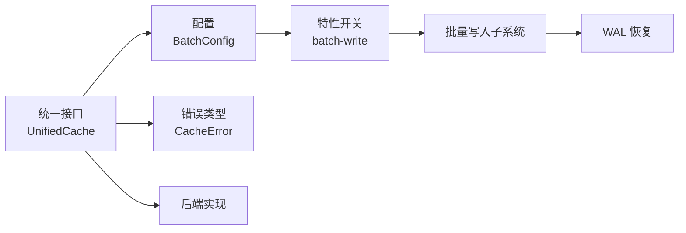

# 批量操作

<cite>
**本文引用的文件**
- [src/cache_interface.rs](file://src/cache_interface.rs)
- [examples/src/02_advanced/example_batch_write.rs](file://examples/src/02_advanced/example_batch_write.rs)
- [tests/integration/batch_write_test.rs](file://tests/integration/batch_write_test.rs)
- [src/config/unified.rs](file://src/config/unified.rs)
- [src/error.rs](file://src/error.rs)
- [benches/cache_benchmark.rs](file://benches/cache_benchmark.rs)
- [src/sync/mod.rs](file://src/sync/mod.rs)
- [src/recovery/wal.rs](file://src/recovery/wal.rs)
</cite>

## 目录
1. [简介](#简介)
2. [项目结构](#项目结构)
3. [核心组件](#核心组件)
4. [架构总览](#架构总览)
5. [详细组件分析](#详细组件分析)
6. [依赖关系分析](#依赖关系分析)
7. [性能考量](#性能考量)
8. [故障排查指南](#故障排查指南)
9. [结论](#结论)
10. [附录](#附录)

## 简介
本章节聚焦 Oxcache 的批量操作能力，系统性阐述 set_many、get_many、delete_many 的实现机制、性能优势与最佳实践。文档同时解释批量操作如何降低网络往返次数、提升吞吐与稳定性，并给出大数据集高效处理策略、错误处理与部分失败处理机制，以及与单个操作的性能对比与适用场景。

## 项目结构
Oxcache 的批量操作主要由统一接口层提供，具体后端（如内存、Redis、分层缓存）可按需实现或复用默认行为。批量写入的“后台批处理”能力受特性开关控制，配置位于统一配置模块中；示例与集成测试展示了典型用法与性能验证路径。

图示来源
- [src/cache_interface.rs](file://src/cache_interface.rs#L216-L286)
- [src/config/unified.rs](file://src/config/unified.rs#L400-L409)
- [src/sync/mod.rs](file://src/sync/mod.rs#L1-L43)

章节来源
- [src/cache_interface.rs](file://src/cache_interface.rs#L216-L286)
- [src/config/unified.rs](file://src/config/unified.rs#L400-L409)
- [src/sync/mod.rs](file://src/sync/mod.rs#L1-L43)

## 核心组件
- 统一缓存接口中的批量方法族
  - set_many_bytes / set_many_typed：批量写入字节或类型化数据
  - get_many_bytes / get_many_typed：批量读取，返回存在值的映射
  - delete_many：批量删除
- 批量写入配置
  - BatchConfig：启用开关、最大批次大小、批次超时、并行处理等
- 错误类型
  - 缓冲区已满、键过长、值过大、后端错误、超时等
- 示例与测试
  - 示例展示并发触发与批量写入效果
  - 集成测试验证 Redis 场景下的批量写入落盘与可见性

章节来源
- [src/cache_interface.rs](file://src/cache_interface.rs#L220-L286)
- [src/config/unified.rs](file://src/config/unified.rs#L147-L158)
- [src/error.rs](file://src/error.rs#L167-L208)
- [examples/src/02_advanced/example_batch_write.rs](file://examples/src/02_advanced/example_batch_write.rs#L25-L154)
- [tests/integration/batch_write_test.rs](file://tests/integration/batch_write_test.rs#L16-L45)

## 架构总览
批量操作在统一接口层提供一致的 API，具体后端可选择实现更高效的批量协议（例如 Redis Pipeline）。对于需要“后台聚合提交”的场景，可通过特性开关启用批量写入子系统，配合 WAL 与恢复机制保证可靠性。

图示来源
- [src/cache_interface.rs](file://src/cache_interface.rs#L220-L286)
- [src/sync/mod.rs](file://src/sync/mod.rs#L1-L43)

## 详细组件分析

### 统一接口中的批量方法
- set_many_bytes / set_many_typed
  - 语义：顺序对每个键执行写入，内部逐条调用对应单条写入方法
  - 适用：后端未实现原生批量时的通用实现
  - 复杂度：时间 O(n)，空间 O(1)
- get_many_bytes / get_many_typed
  - 语义：遍历键列表，仅返回存在的值，缺失键不进入结果
  - 适用：批量查询存在性与读取
  - 复杂度：时间 O(n)，空间 O(k)（k 为命中数）
- delete_many
  - 语义：顺序删除每个键，忽略不存在的情况
  - 适用：批量失效、清理
  - 复杂度：时间 O(n)，空间 O(1)

图示来源
- [src/cache_interface.rs](file://src/cache_interface.rs#L272-L286)

章节来源
- [src/cache_interface.rs](file://src/cache_interface.rs#L220-L286)

### 批量写入配置与特性开关
- BatchConfig
  - enabled：是否启用批量写入
  - max_batch_size：最大批次大小
  - batch_timeout：批次超时，用于触发定时刷新
  - parallel_processing：是否启用并行处理（当前默认关闭）
- 特性开关 batch-write
  - 未启用时，批量写入子系统为空实现，调用会返回配置错误
  - 启用后，可使用批量写入子系统进行缓冲、聚合与定时刷新
- 高性能配置示例
  - 提供高吞吐内存配置模板，开启批量与并行处理参数

图示来源
- [src/config/unified.rs](file://src/config/unified.rs#L147-L158)
- [src/config/unified.rs](file://src/config/unified.rs#L400-L409)
- [src/config/unified.rs](file://src/config/unified.rs#L690-L754)
- [src/features.rs](file://src/features.rs#L172-L175)

章节来源
- [src/config/unified.rs](file://src/config/unified.rs#L147-L158)
- [src/config/unified.rs](file://src/config/unified.rs#L400-L409)
- [src/config/unified.rs](file://src/config/unified.rs#L690-L754)
- [src/features.rs](file://src/features.rs#L172-L175)

### 批量写入子系统与错误处理
- 未启用 batch-write 特性时的行为
  - 批量写入子系统为空实现，任何调用都会返回配置错误
- 启用 batch-write 特性后的行为
  - 支持入队、缓冲、聚合与定时刷新
  - WAL（预写日志）提供事务性重放保障，失败时回滚并保留条目以重试
- 错误类型
  - 缓冲区已满：提示增大缓冲或稍后重试
  - 后端错误/超时：建议重试或检查系统状态
  - 键过长/值过大：检查数据尺寸限制

图示来源
- [src/sync/mod.rs](file://src/sync/mod.rs#L85-L143)
- [src/recovery/wal.rs](file://src/recovery/wal.rs#L353-L398)

章节来源
- [src/sync/mod.rs](file://src/sync/mod.rs#L1-L43)
- [src/sync/mod.rs](file://src/sync/mod.rs#L85-L143)
- [src/recovery/wal.rs](file://src/recovery/wal.rs#L353-L398)
- [src/error.rs](file://src/error.rs#L167-L208)

### 实际批量数据处理示例
- 并发触发 + 批量写入
  - 示例展示对一组商品并发 set，随后批量读取与批量删除
  - 适合高并发写入场景，结合后端能力可进一步优化
- Redis 集成测试
  - 连续写入 100 个键，等待批量刷新后验证可见性
  - 用于验证批量写入在 Redis 场景下的正确性与时效性

章节来源
- [examples/src/02_advanced/example_batch_write.rs](file://examples/src/02_advanced/example_batch_write.rs#L25-L154)
- [tests/integration/batch_write_test.rs](file://tests/integration/batch_write_test.rs#L16-L45)

### 批量操作与单个操作的性能对比与适用场景
- 对比维度
  - 网络往返：批量可显著减少 RTT 次数
  - 吞吐：批量在高并发下具备更高吞吐潜力
  - 延迟：单条操作延迟更低，但总延迟随请求量线性增长
- 适用场景
  - 大批量写入/读取：优先使用批量方法
  - 小规模或低频操作：单条更简单直接
  - 需要可靠持久化：结合 WAL 与批量写入特性

章节来源
- [benches/cache_benchmark.rs](file://benches/cache_benchmark.rs#L63-L90)

## 依赖关系分析
- 统一接口依赖后端实现
  - 批量方法在无原生批量支持时退化为多次单条调用
- 配置驱动行为
  - BatchConfig 控制批量策略，FeatureSet 决定特性可用性
- 错误类型贯穿全链路
  - 缓冲区已满、后端错误、超时等均会影响批量提交与回退策略

图示来源
- [src/cache_interface.rs](file://src/cache_interface.rs#L220-L286)
- [src/config/unified.rs](file://src/config/unified.rs#L147-L158)
- [src/error.rs](file://src/error.rs#L167-L208)
- [src/sync/mod.rs](file://src/sync/mod.rs#L1-L43)
- [src/recovery/wal.rs](file://src/recovery/wal.rs#L353-L398)

## 性能考量
- 减少网络往返
  - 批量写入/读取合并为一次请求，显著降低 RTT 影响
- 批次大小与超时
  - 合理设置 max_batch_size 与 batch_timeout，平衡延迟与吞吐
- 并行处理
  - parallel_processing 可选开启，适用于 CPU 密集型序列化/压缩场景
- 序列化与压缩
  - 高性能内存配置示例展示了零拷贝与压缩阈值的组合策略
- 基准测试
  - 提供 L1 缓存批量写入基准，便于评估不同批次规模的性能表现

章节来源
- [src/config/unified.rs](file://src/config/unified.rs#L690-L754)
- [benches/cache_benchmark.rs](file://benches/cache_benchmark.rs#L63-L90)

## 故障排查指南
- 批量写入特性未启用
  - 现象：调用批量写入相关 API 抛出配置错误
  - 处理：启用 batch-write 特性或改用单条操作
- 缓冲区已满
  - 现象：出现 BufferFull 错误
  - 处理：增大缓冲区或降低写入速率，等待刷新后再试
- 后端错误/超时
  - 现象：BackendError 或 Timeout
  - 处理：检查后端连通性与资源，适当增加超时或重试
- 部分失败
  - 现象：批量操作返回部分成功
  - 处理：根据返回结果重试失败项，必要时启用 WAL 重放

章节来源
- [src/sync/mod.rs](file://src/sync/mod.rs#L85-L143)
- [src/error.rs](file://src/error.rs#L167-L208)
- [src/recovery/wal.rs](file://src/recovery/wal.rs#L353-L398)

## 结论
Oxcache 的批量操作在统一接口层提供了简洁一致的 API，既可利用后端原生批量能力，也可在无原生支持时通过顺序单条实现保证正确性。结合批量写入特性与 WAL，可在高并发与大规模数据场景下显著提升吞吐、降低延迟，并提供可靠的持久化保障。合理配置批次大小、超时与并行策略，是发挥批量能力的关键。

## 附录
- 最佳实践
  - 大批量写入优先使用 set_many_bytes/set_many_typed
  - 批量读取使用 get_many_typed 并自行处理缺失键
  - 批量删除使用 delete_many，避免二次查询
  - 启用 batch-write 特性并结合 WAL，确保可靠性
  - 根据数据规模调整 BatchConfig，权衡延迟与吞吐
- 性能优化建议
  - 选择合适的序列化格式与压缩策略
  - 在 CPU 密集场景考虑并行处理
  - 使用基准测试工具评估不同批次规模的效果