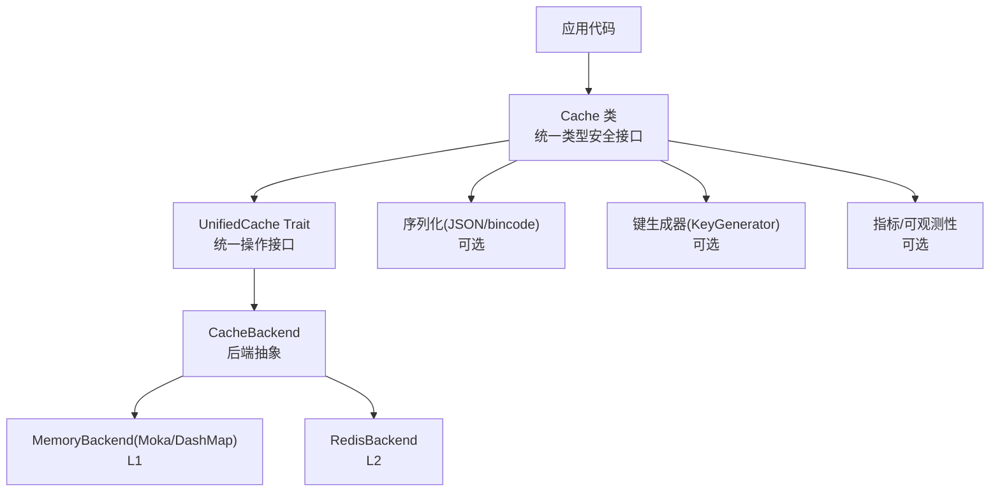
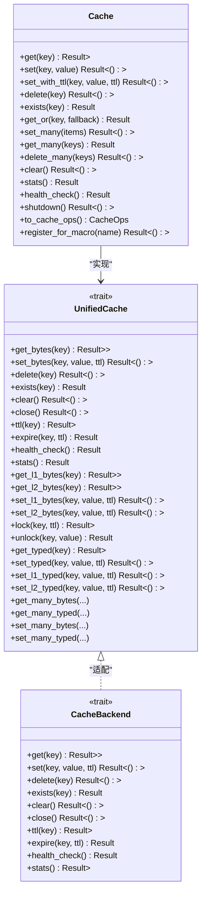

# 缓存操作

<cite>
**本文引用的文件**
- [README.md](file://README.md)
- [lib.rs](file://src/lib.rs)
- [cache.rs](file://src/cache.rs)
- [cache_interface.rs](file://src/cache_interface.rs)
- [key_generator.rs](file://src/utils/key_generator.rs)
- [mod.rs](file://src/backend/mod.rs)
- [client/mod.rs](file://src/backend/client/mod.rs)
- [API_REFERENCE.md](file://docs/API_REFERENCE.md)
- [error.rs](file://src/error.rs)
- [example_basic_operations.rs](file://examples/src/01_basics/example_basic_operations.rs)
- [example_comprehensive_usage.rs](file://examples/src/01_basics/example_comprehensive_usage.rs)
- [example_batch_write.rs](file://examples/src/02_advanced/example_batch_write.rs)
- [example_invalidation.rs](file://examples/src/02_advanced/example_invalidation.rs)
</cite>

## 目录
1. [简介](#简介)
2. [项目结构](#项目结构)
3. [核心组件](#核心组件)
4. [架构总览](#架构总览)
5. [详细组件分析](#详细组件分析)
6. [依赖分析](#依赖分析)
7. [性能考虑](#性能考虑)
8. [故障排查指南](#故障排查指南)
9. [结论](#结论)
10. [附录](#附录)

## 简介
本章节面向希望系统掌握 Oxcache 缓存操作与使用的读者，围绕以下目标展开：
- 详解 CRUD 接口：get、set、delete、exists 等方法的使用与参数说明
- 解释三种缓存类型：L1-only、L2-only、two-level 的行为差异与适用场景
- 介绍批量操作优化机制：智能批处理写入与吞吐提升策略
- 说明缓存键生成规则与自定义方法
- 提供从简单键值存储到复杂对象缓存的多种使用场景示例
- 说明错误处理与异常情况的应对方式
- 给出性能优化建议与最佳实践

## 项目结构
Oxcache 采用“现代 API + 插件化后端”的设计，核心能力集中在新 API 模块，并通过特征门控选择性启用 L1/Moka、L2/Redis、序列化、指标、批量写入等能力。

图示来源
- [lib.rs](file://src/lib.rs#L575-L639)
- [cache.rs](file://src/cache.rs#L117-L120)
- [cache_interface.rs](file://src/cache_interface.rs#L24-L300)
- [mod.rs](file://src/backend/mod.rs#L26-L27)
- [client/mod.rs](file://src/backend/client/mod.rs#L13-L34)

章节来源
- [lib.rs](file://src/lib.rs#L575-L639)
- [cache.rs](file://src/cache.rs#L117-L120)
- [cache_interface.rs](file://src/cache_interface.rs#L24-L300)
- [mod.rs](file://src/backend/mod.rs#L26-L27)
- [client/mod.rs](file://src/backend/client/mod.rs#L13-L34)

## 核心组件
- Cache<K, V>：统一的类型安全缓存接口，封装底层后端，提供 get/set/delete/exists 等常用操作，以及 get_or、批量操作、统计与健康检查等高级能力。
- UnifiedCache Trait：将字节级操作、层特定操作（L1/L2）、分布式锁、批量操作、序列化等能力整合为单一接口。
- CacheBackend：后端抽象，屏蔽 L1/L2 差异，向上提供统一的 get/set/delete/exists/ttl/expire/clear/close/stats/health_check 等能力。
- KeyGenerator：键生成与校验工具，支持命名空间、前缀、模板化生成、长度与字符集限制、可选指纹截断等。
- 错误体系：统一的 CacheError 枚举，涵盖序列化、连接、超时、降级、键值大小、缓冲区满、输入非法等错误类型。

章节来源
- [cache.rs](file://src/cache.rs#L117-L646)
- [cache_interface.rs](file://src/cache_interface.rs#L24-L300)
- [key_generator.rs](file://src/utils/key_generator.rs#L48-L207)
- [error.rs](file://src/error.rs#L76-L208)

## 架构总览
Oxcache 的新 API 以 Cache 为核心，通过 CacheBackend 抽象对接 L1（Moka/DashMap）与 L2（Redis），并通过序列化模块实现类型安全的读写；同时提供统一的批量与层特定操作接口。

图示来源
- [cache.rs](file://src/cache.rs#L117-L646)
- [cache_interface.rs](file://src/cache_interface.rs#L24-L300)

章节来源
- [cache.rs](file://src/cache.rs#L117-L646)
- [cache_interface.rs](file://src/cache_interface.rs#L24-L300)

## 详细组件分析

### CRUD 操作详解与使用
- get(key)
  - 功能：按类型安全的方式从缓存读取值；若开启序列化，则自动反序列化；否则返回序列化相关错误。
  - 参数：key 必须实现 CacheKey；返回 Option<V>。
  - 异常：当未启用序列化特性时，get 操作会返回序列化错误。
  - 参考路径：[cache.rs](file://src/cache.rs#L241-L264)

- set(key, value) / set_with_ttl(key, value, ttl)
  - 功能：类型安全地写入缓存；若开启序列化，先序列化再写入；支持 TTL。
  - 参数：key 实现 CacheKey；value 实现 Cacheable；ttl 可选。
  - 异常：未启用序列化特性时，set/set_with_ttl 会返回序列化错误。
  - 参考路径：[cache.rs](file://src/cache.rs#L283-L325)

- delete(key)
  - 功能：删除指定键。
  - 参数：key 实现 CacheKey。
  - 参考路径：[cache.rs](file://src/cache.rs#L343-L346)

- exists(key)
  - 功能：判断键是否存在。
  - 参数：key 实现 CacheKey。
  - 参考路径：[cache.rs](file://src/cache.rs#L367-L370)

- get_or(key, fallback)
  - 功能：缓存-旁路模式；缓存命中则返回，未命中则调用回源函数计算并写入缓存。
  - 参数：key 实现 CacheKey；fallback 为异步函数。
  - 参考路径：[cache.rs](file://src/cache.rs#L396-L408)

- 批量操作
  - set_many、get_many、delete_many：对多个键进行批量写入、读取、删除。
  - 参考路径：[cache.rs](file://src/cache.rs#L430-L499)

- 其他能力
  - clear：清空缓存。
  - stats：获取统计信息。
  - health_check：健康检查。
  - shutdown：释放资源。
  - 参考路径：[cache.rs](file://src/cache.rs#L513-L572)

章节来源
- [cache.rs](file://src/cache.rs#L241-L572)

### 缓存类型与行为差异（L1-only、L2-only、two-level）
- L1-only（内存缓存）
  - 后端：Moka 或 DashMap（由特征门控决定）。
  - 特点：极低延迟、高吞吐、进程内、易失性。
  - 适用：热数据、短生命周期、强本地性。
  - 参考路径：[client/mod.rs](file://src/backend/client/mod.rs#L13-L34)

- L2-only（Redis 分布式缓存）
  - 后端：Redis（支持 Standalone/Sentinel/Cluster）。
  - 特点：跨进程共享、持久化潜力、网络开销、可扩展。
  - 适用：全局共享状态、跨实例一致性需求。
  - 参考路径：[client/mod.rs](file://src/backend/client/mod.rs#L25-L28)

- two-level（L1 + L2）
  - 行为：读优先 L1，未命中回源 L2；写入通常双写，或根据策略写 L1/L2。
  - 优势：兼顾低延迟与共享一致性。
  - 参考路径：[README.md](file://README.md#L277-L300)

章节来源
- [client/mod.rs](file://src/backend/client/mod.rs#L13-L34)
- [README.md](file://README.md#L277-L300)

### 批量操作优化机制
- 智能批处理写入
  - 通过内置的优化批写器（OptimizedBatchWriter）合并多次写入，降低网络往返与系统调用开销。
  - 可配置批大小与刷新间隔，平衡延迟与吞吐。
  - 参考路径：[API_REFERENCE.md](file://docs/API_REFERENCE.md#L282-L296)

- 并发批量示例
  - 示例展示了并发写入与批量读取的组合，体现高吞吐场景下的性能优势。
  - 参考路径：
    - [example_batch_write.rs](file://examples/src/02_advanced/example_batch_write.rs#L75-L95)
    - [example_comprehensive_usage.rs](file://examples/src/01_basics/example_comprehensive_usage.rs#L174-L209)

- 批量接口（当前版本）
  - 当前版本提供 set_many/get_many/delete_many 等接口；更底层的批写优化由内部组件负责。
  - 参考路径：[cache.rs](file://src/cache.rs#L430-L499)

章节来源
- [API_REFERENCE.md](file://docs/API_REFERENCE.md#L282-L296)
- [example_batch_write.rs](file://examples/src/02_advanced/example_batch_write.rs#L75-L95)
- [example_comprehensive_usage.rs](file://examples/src/01_basics/example_comprehensive_usage.rs#L174-L209)
- [cache.rs](file://src/cache.rs#L430-L499)

### 缓存键生成规则与自定义
- 默认键规则
  - CacheKey trait：要求实现 to_key_string()，将任意类型键转换为字符串键。
  - 参考路径：[cache.rs](file://src/cache.rs#L241-L264)

- KeyGenerator 工具
  - 支持命名空间、前缀、模板化生成、长度与字符集校验、可选指纹截断（结合布隆过滤器特性）。
  - 参考路径：[key_generator.rs](file://src/utils/key_generator.rs#L48-L207)

- 自定义键生成
  - 为自定义类型实现 CacheKey；
  - 或使用 KeyGenerator 生成规范键，再传入缓存接口。
  - 参考路径：[cache.rs](file://src/cache.rs#L241-L264)，[key_generator.rs](file://src/utils/key_generator.rs#L128-L142)

章节来源
- [cache.rs](file://src/cache.rs#L241-L264)
- [key_generator.rs](file://src/utils/key_generator.rs#L48-L207)

### 使用场景与示例
- 基础 CRUD
  - 展示 set/get/delete 的基本流程与断言。
  - 参考路径：[example_basic_operations.rs](file://examples/src/01_basics/example_basic_operations.rs#L33-L64)

- 综合使用
  - 演示内存/Redis/分层缓存创建、批量操作、TTL 控制、并发读写与统计。
  - 参考路径：
    - [example_comprehensive_usage.rs](file://examples/src/01_basics/example_comprehensive_usage.rs#L41-L54)
    - [example_comprehensive_usage.rs](file://examples/src/01_basics/example_comprehensive_usage.rs#L109-L156)
    - [example_comprehensive_usage.rs](file://examples/src/01_basics/example_comprehensive_usage.rs#L157-L168)
    - [example_comprehensive_usage.rs](file://examples/src/01_basics/example_comprehensive_usage.rs#L169-L210)

- 批量写入优化
  - 并发批量写入、批量更新与批量删除示例。
  - 参考路径：[example_batch_write.rs](file://examples/src/02_advanced/example_batch_write.rs#L75-L142)

- 缓存失效策略
  - 单键删除、清空缓存、基于 TTL 的自动失效、写入时失效（write-invalidation）。
  - 参考路径：[example_invalidation.rs](file://examples/src/02_advanced/example_invalidation.rs#L67-L87)

章节来源
- [example_basic_operations.rs](file://examples/src/01_basics/example_basic_operations.rs#L33-L64)
- [example_comprehensive_usage.rs](file://examples/src/01_basics/example_comprehensive_usage.rs#L41-L54)
- [example_comprehensive_usage.rs](file://examples/src/01_basics/example_comprehensive_usage.rs#L109-L156)
- [example_comprehensive_usage.rs](file://examples/src/01_basics/example_comprehensive_usage.rs#L157-L168)
- [example_comprehensive_usage.rs](file://examples/src/01_basics/example_comprehensive_usage.rs#L169-L210)
- [example_batch_write.rs](file://examples/src/02_advanced/example_batch_write.rs#L75-L142)
- [example_invalidation.rs](file://examples/src/02_advanced/example_invalidation.rs#L67-L87)

### 错误处理与异常情况
- 错误类型概览
  - 序列化、连接、超时、未找到、降级、L1/L2 后端错误、配置、键值大小、缓冲区满、输入非法、锁错误等。
  - 参考路径：[error.rs](file://src/error.rs#L76-L208)

- 常见处理策略
  - 对 NotFound 进行分支处理（例如回源加载）；
  - 对连接错误进行重试或降级（L2 不可用时退化为 L1-only）；
  - 对序列化错误检查数据格式与序列化特性开关；
  - 对键值过大/过长进行裁剪或改用指纹键。
  - 参考路径：[error.rs](file://src/error.rs#L228-L288)，[key_generator.rs](file://src/utils/key_generator.rs#L154-L175)

- 日志与脱敏
  - 连接串中的密码会被脱敏输出，避免泄露。
  - 参考路径：[error.rs](file://src/error.rs#L12-L43)

章节来源
- [error.rs](file://src/error.rs#L76-L208)
- [error.rs](file://src/error.rs#L228-L288)
- [key_generator.rs](file://src/utils/key_generator.rs#L154-L175)

## 依赖分析
- 特征门控与后端选择
  - moka → L1 内存缓存（Moka/DashMap）
  - redis → L2 分布式缓存（Redis）
  - serialization → JSON/bincode 序列化
  - batch-write → 批量写入优化
  - metrics/full-metrics → 指标收集
  - bloom-filter/rate-limiting/wal-recovery/database/cli/opentelemetry → 辅助能力
  - 参考路径：[lib.rs](file://src/lib.rs#L436-L460)，[API_REFERENCE.md](file://docs/API_REFERENCE.md#L27-L91)

- 组件耦合
  - Cache 依赖 CacheBackend 抽象，通过特征门控注入具体后端；
  - UnifiedCache 将 CacheOps/CacheExt/CacheBackend 能力统一；
  - KeyGenerator 作为可选工具，与 Cache/Key 生成流程解耦。
  - 参考路径：[cache.rs](file://src/cache.rs#L117-L120)，[cache_interface.rs](file://src/cache_interface.rs#L24-L300)

章节来源
- [lib.rs](file://src/lib.rs#L436-L460)
- [API_REFERENCE.md](file://docs/API_REFERENCE.md#L27-L91)
- [cache.rs](file://src/cache.rs#L117-L120)
- [cache_interface.rs](file://src/cache_interface.rs#L24-L300)

## 性能考虑
- 读写路径优化
  - L1-only：极致低延迟，适合热点数据；
  - two-level：读命中 L1，未命中回源 L2，写入可双写或按策略写入；
  - L2-only：跨实例共享，注意网络 RTT。
  - 参考路径：[README.md](file://README.md#L277-L300)

- 批量写入
  - 使用 OptimizedBatchWriter 合并写入，减少网络往返；
  - 并发批量写入可显著提升吞吐。
  - 参考路径：[API_REFERENCE.md](file://docs/API_REFERENCE.md#L282-L296)，[example_batch_write.rs](file://examples/src/02_advanced/example_batch_write.rs#L75-L95)

- TTL 与淘汰
  - 为热数据设置合理 TTL，避免过期风暴；
  - L1 使用 LRU/TinyLFU 等策略，关注容量与 TTI 配置。
  - 参考路径：[README.md](file://README.md#L137-L142)

- 序列化与键大小
  - 选择合适序列化格式（JSON/bincode）；
  - 控制键长度与字符集，必要时使用指纹截断。
  - 参考路径：[cache.rs](file://src/cache.rs#L241-L264)，[key_generator.rs](file://src/utils/key_generator.rs#L154-L197)

## 故障排查指南
- 常见错误定位
  - NotFound：确认键是否存在、是否被 TTL 清除；
  - Serialization：检查序列化特性是否启用、数据格式是否兼容；
  - Connection/L2Error：检查 Redis 连接串、网络连通性、服务状态；
  - Degraded：L2 不可用时的降级提示，检查 L2 健康状态；
  - KeyTooLong/ValueTooLarge：调整键策略或压缩数据；
  - BufferFull：增大批写缓冲或降低刷新频率。
  - 参考路径：[error.rs](file://src/error.rs#L76-L208)

- 健康检查与统计
  - 使用 health_check 与 stats 获取运行状态；
  - 结合指标与日志定位性能瓶颈。
  - 参考路径：[cache.rs](file://src/cache.rs#L554-L532)

章节来源
- [error.rs](file://src/error.rs#L76-L208)
- [cache.rs](file://src/cache.rs#L554-L532)

## 结论
Oxcache 通过统一的 Cache 接口与抽象的 CacheBackend，将 L1/Moka、L2/Redis 与序列化、批量写入、指标等能力有机整合，既保证了易用性，又提供了强大的性能与可靠性保障。针对不同场景选择合适的缓存类型与键策略，并结合批量写入与 TTL 管理，可获得稳定高效的缓存体验。

## 附录
- 快速上手与配置参考
  - 参考路径：[README.md](file://README.md#L116-L172)
- API 参考与迁移
  - 参考路径：[API_REFERENCE.md](file://docs/API_REFERENCE.md#L1-L91)