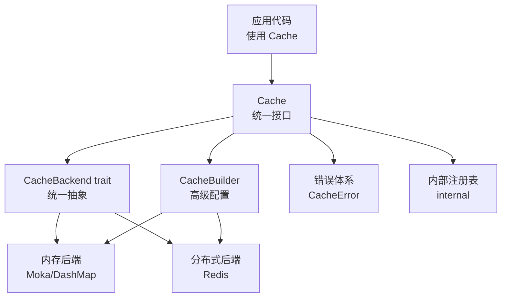
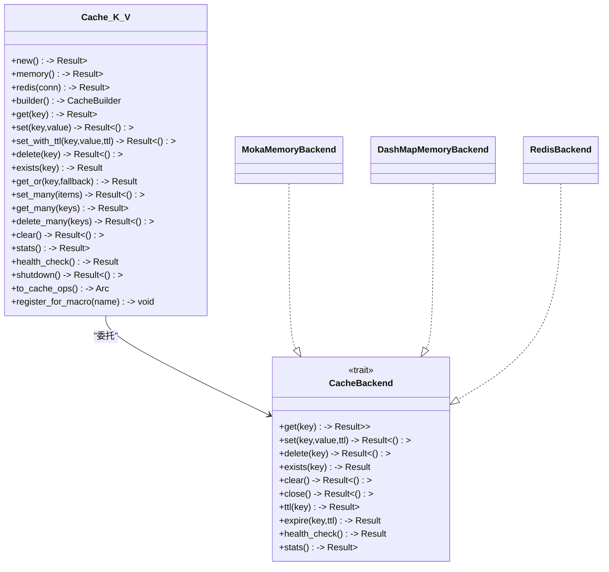
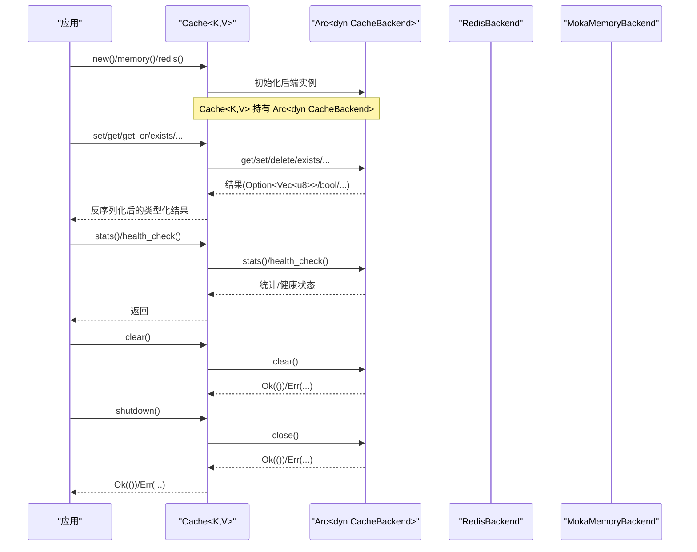
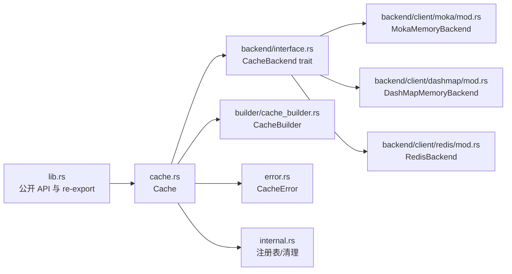

# 缓存生命周期

<cite>
**本文引用的文件**
- [src/lib.rs](file://src/lib.rs)
- [src/cache.rs](file://src/cache.rs)
- [src/backend/mod.rs](file://src/backend/mod.rs)
- [src/backend/interface.rs](file://src/backend/interface.rs)
- [src/backend/client/mod.rs](file://src/backend/client/mod.rs)
- [src/backend/client/moka/mod.rs](file://src/backend/client/moka/mod.rs)
- [src/backend/client/dashmap/mod.rs](file://src/backend/client/dashmap/mod.rs)
- [src/backend/client/redis/mod.rs](file://src/backend/client/redis/mod.rs)
- [src/builder/cache_builder.rs](file://src/builder/cache_builder.rs)
- [src/error.rs](file://src/error.rs)
- [src/internal.rs](file://src/internal.rs)
</cite>

## 目录
1. [简介](#简介)
2. [项目结构](#项目结构)
3. [核心组件](#核心组件)
4. [架构总览](#架构总览)
5. [详细组件分析](#详细组件分析)
6. [依赖分析](#依赖分析)
7. [性能考量](#性能考量)
8. [故障排查指南](#故障排查指南)
9. [结论](#结论)
10. [附录](#附录)

## 简介
本文件系统性阐述 Oxcache 的缓存生命周期管理，覆盖从创建、初始化、使用到销毁的全过程；对比不同后端（内存与 Redis）在生命周期上的差异与特殊处理；明确 clear 清空与 shutdown 关闭的语义与用途；给出资源管理最佳实践（内存与连接池）、健康检查与故障恢复策略，并提供可操作的生命周期监控与调试方法。

## 项目结构
Oxcache 采用“现代 API + 可插拔后端”的架构设计：
- 新版 API 通过 Cache<K, V> 统一对外接口，内部委托给实现 CacheBackend trait 的后端（内存/Redis 等）。
- 后端模块按功能拆分：interface 定义统一接口；client 子模块提供具体实现（Moka、DashMap、Redis）。
- 构建器 CacheBuilder 提供高级配置能力（TTL、容量、批写、自动提升等）。
- 错误体系集中于 error 模块，便于统一处理与诊断。
- 内部模块 internal 提供 #[cached] 宏注册表与清理逻辑，体现全局生命周期管理。

**图表来源**
- [src/cache.rs](file://src/cache.rs#L117-L120)
- [src/backend/interface.rs](file://src/backend/interface.rs#L46-L166)
- [src/backend/client/mod.rs](file://src/backend/client/mod.rs#L12-L28)
- [src/builder/cache_builder.rs](file://src/builder/cache_builder.rs#L38-L208)
- [src/error.rs](file://src/error.rs#L75-L208)
- [src/internal.rs](file://src/internal.rs#L15-L39)

**章节来源**
- [src/lib.rs](file://src/lib.rs#L417-L639)
- [src/cache.rs](file://src/cache.rs#L117-L120)
- [src/backend/mod.rs](file://src/backend/mod.rs#L7-L59)
- [src/backend/client/mod.rs](file://src/backend/client/mod.rs#L12-L28)
- [src/builder/cache_builder.rs](file://src/builder/cache_builder.rs#L38-L208)
- [src/error.rs](file://src/error.rs#L75-L208)
- [src/internal.rs](file://src/internal.rs#L15-L39)

## 核心组件
- Cache<K, V>：面向用户的统一缓存接口，封装键值序列化/反序列化、批量操作、统计与健康检查等。
- CacheBackend trait：定义 get/set/delete/exists/clear/close/ttl/expire/health_check/stats 等后端能力。
- 后端实现：
  - 内存后端：MokaMemoryBackend、DashMapMemoryBackend（默认内存后端由 Moka 提供）。
  - 分布式后端：RedisBackend（支持多种模式与提供者）。
- CacheBuilder：提供 TTL、容量、批写、自动提升等高级配置，最终构建出具体后端实例。
- 错误体系：统一的 CacheError 枚举，涵盖序列化、连接、超时、降级、关闭、键/值大小限制等。
- 内部注册表：为 #[cached] 宏提供全局缓存实例注册与清理。

**章节来源**
- [src/cache.rs](file://src/cache.rs#L117-L646)
- [src/backend/interface.rs](file://src/backend/interface.rs#L46-L166)
- [src/backend/client/mod.rs](file://src/backend/client/mod.rs#L12-L28)
- [src/builder/cache_builder.rs](file://src/builder/cache_builder.rs#L38-L208)
- [src/error.rs](file://src/error.rs#L75-L208)
- [src/internal.rs](file://src/internal.rs#L15-L39)

## 架构总览
Oxcache 的现代 API 将用户态的 Cache<K, V> 与后端实现解耦。Cache<K, V> 仅负责键值序列化、调用后端接口、统计与健康检查；具体存储介质（内存或 Redis）由后端实现决定。构建器负责装配后端参数，最终以 Arc<dyn CacheBackend> 形式注入 Cache。

**图表来源**
- [src/cache.rs](file://src/cache.rs#L117-L646)
- [src/backend/interface.rs](file://src/backend/interface.rs#L46-L166)
- [src/backend/client/moka/mod.rs](file://src/backend/client/moka/mod.rs#L9-L13)
- [src/backend/client/dashmap/mod.rs](file://src/backend/client/dashmap/mod.rs#L9-L13)
- [src/backend/client/redis/mod.rs](file://src/backend/client/redis/mod.rs#L11-L14)

## 详细组件分析

### 生命周期阶段与控制流
- 创建与初始化
  - Cache::memory()：默认使用内存后端（Moka），返回 Cache<K, V> 实例。
  - Cache::redis()：在启用 redis 特性时，基于连接字符串创建 RedisBackend 并注入 Cache。
  - Cache::builder()：通过 CacheBuilder 设置 TTL、容量、批写、自动提升等，最终 build() 得到 Cache。
- 使用阶段
  - get/set/get_or/delete/exists/批量操作：均委托至 Arc<dyn CacheBackend>。
  - stats()/health_check()：查询后端统计与健康状态。
- 销毁阶段
  - shutdown()：调用 backend.close()，释放后端资源（内存后端通常无外部连接，Redis 后端会关闭连接池/客户端）。
  - clear()：清空缓存内容（内存后端为本地数据结构清空；Redis 后端为执行清空命令）。
  - 注册表清理：internal 提供全局注册表，支持统一 shutdown 与清理。

**图表来源**
- [src/cache.rs](file://src/cache.rs#L140-L572)
- [src/backend/interface.rs](file://src/backend/interface.rs#L46-L166)
- [src/backend/client/redis/mod.rs](file://src/backend/client/redis/mod.rs#L11-L14)
- [src/backend/client/moka/mod.rs](file://src/backend/client/moka/mod.rs#L9-L13)

**章节来源**
- [src/cache.rs](file://src/cache.rs#L140-L572)
- [src/backend/interface.rs](file://src/backend/interface.rs#L46-L166)
- [src/builder/cache_builder.rs](file://src/builder/cache_builder.rs#L193-L208)
- [src/internal.rs](file://src/internal.rs#L43-L50)

### 不同后端的生命周期差异与特殊处理
- 内存后端（Moka/DashMap）
  - 创建：直接构造内存结构，无外部连接。
  - 使用：读写在进程内完成，性能高；支持 TTL（取决于具体实现）。
  - 销毁：close() 通常为空操作或释放内部资源；clear() 直接清空内存数据。
- Redis 后端
  - 创建：解析连接字符串，建立连接池/客户端。
  - 使用：网络 IO，支持原子操作与持久化；可通过 TTL 控制过期。
  - 销毁：close() 会关闭连接池、释放网络资源；clear() 会执行清空命令。
- 多级后端（Tiered）
  - 通过 CacheBuilder 配置 L1/L2 层，支持自动提升（auto_promote）与批写优化；生命周期同样遵循 clear/shutdown 规范。

**章节来源**
- [src/backend/client/moka/mod.rs](file://src/backend/client/moka/mod.rs#L9-L13)
- [src/backend/client/dashmap/mod.rs](file://src/backend/client/dashmap/mod.rs#L9-L13)
- [src/backend/client/redis/mod.rs](file://src/backend/client/redis/mod.rs#L11-L14)
- [src/builder/cache_builder.rs](file://src/builder/cache_builder.rs#L107-L149)

### clear 清空与 shutdown 关闭的区别与用途
- clear()
  - 语义：清空缓存中的所有键值对，但不释放后端持有的资源。
  - 适用场景：业务侧需要快速“清库”而不中断服务；例如灰度切换前的预热清空。
  - 行为差异：内存后端为本地结构清空；Redis 后端为执行清空命令。
- shutdown()
  - 语义：优雅关闭后端，释放所有资源（连接池、句柄、后台任务等）。
  - 适用场景：应用退出、热重启、运维维护窗口。
  - 行为差异：Redis 后端会关闭连接池与网络通道；内存后端通常无外部资源，close() 为轻量操作。

**章节来源**
- [src/cache.rs](file://src/cache.rs#L501-L572)
- [src/backend/interface.rs](file://src/backend/interface.rs#L99-L116)

### 资源管理最佳实践
- 内存释放
  - 使用合适的容量与淘汰策略（Moka 支持 TinyLFU/LRU 等），避免内存压力导致频繁回收。
  - 对大对象进行序列化压缩（如启用相应序列化器），降低内存占用。
- 连接池管理
  - Redis 后端建议在构建器中设置合理的最大连接数、空闲超时与命令超时。
  - 在应用生命周期末尾调用 shutdown()，确保连接池与后台任务被正确回收。
- 批量写入
  - 启用批写（batch_writes）可显著降低网络往返与锁竞争，适用于高频写入场景。
- 自动提升
  - Tiered 场景开启 auto_promote 可减少跨层访问延迟，但需权衡 L1 内存占用。

**章节来源**
- [src/builder/cache_builder.rs](file://src/builder/cache_builder.rs#L107-L149)
- [src/cache.rs](file://src/cache.rs#L558-L572)

### 健康检查机制与故障恢复策略
- 健康检查
  - Cache::health_check() 委托后端 health_check()，返回布尔值表示健康状态。
  - stats() 返回后端自报告的统计信息（如类型、命中率、容量等），辅助判断健康状况。
- 故障恢复
  - 当 L2（Redis）不可用时，系统可进入降级模式（错误类型为降级），上层应具备回退策略（如直连数据库或本地缓存）。
  - WAL（预写日志）可用于 Redis 场景下的持久化保障与恢复（启用 wal-recovery 特性）。
- 连接安全
  - 错误信息对敏感连接串进行脱敏输出，避免日志泄露。

**章节来源**
- [src/cache.rs](file://src/cache.rs#L534-L572)
- [src/backend/interface.rs](file://src/backend/interface.rs#L145-L165)
- [src/error.rs](file://src/error.rs#L13-L43)
- [src/lib.rs](file://src/lib.rs#L670-L679)

### 生命周期监控与调试方法
- 统计导出
  - 通过 stats() 获取后端统计；在启用 metrics 特性时，可导出 JSON/Prometheus 格式指标。
- 注册表与全局清理
  - 使用 register_for_macro() 将 Cache 注册到内部注册表，便于 #[cached] 宏使用。
  - __internal_clear_all() 可遍历注册表并逐一调用 shutdown()，实现全局清理。
- 常见问题定位
  - 序列化错误：确认启用 serialization 特性且值类型实现 Cacheable。
  - 连接错误：检查 Redis 连接字符串与网络可达性。
  - 键/值过大：根据错误提示调整键长度与值大小限制。

**章节来源**
- [src/cache.rs](file://src/cache.rs#L517-L646)
- [src/internal.rs](file://src/internal.rs#L21-L50)
- [src/error.rs](file://src/error.rs#L75-L208)

## 依赖分析
- 模块耦合
  - Cache<K, V> 与 CacheBackend 通过 trait 解耦，后端实现可替换。
  - 构建器与后端实现通过工厂/构建流程耦合，便于集中配置。
- 外部依赖
  - Redis 后端依赖外部 Redis 服务器与连接池；内存后端依赖 Moka/DashMap。
- 特性开关
  - 通过 feature 标记启用/禁用特定后端与能力（如 metrics、serialization、wal-recovery 等），并在编译期进行依赖校验。

**图表来源**
- [src/lib.rs](file://src/lib.rs#L517-L639)
- [src/cache.rs](file://src/cache.rs#L117-L646)
- [src/backend/interface.rs](file://src/backend/interface.rs#L46-L166)
- [src/backend/client/moka/mod.rs](file://src/backend/client/moka/mod.rs#L9-L13)
- [src/backend/client/dashmap/mod.rs](file://src/backend/client/dashmap/mod.rs#L9-L13)
- [src/backend/client/redis/mod.rs](file://src/backend/client/redis/mod.rs#L11-L14)
- [src/builder/cache_builder.rs](file://src/builder/cache_builder.rs#L38-L208)
- [src/error.rs](file://src/error.rs#L75-L208)
- [src/internal.rs](file://src/internal.rs#L15-L39)

**章节来源**
- [src/lib.rs](file://src/lib.rs#L517-L639)
- [src/cache.rs](file://src/cache.rs#L117-L646)
- [src/backend/interface.rs](file://src/backend/interface.rs#L46-L166)
- [src/builder/cache_builder.rs](file://src/builder/cache_builder.rs#L38-L208)
- [src/error.rs](file://src/error.rs#L75-L208)
- [src/internal.rs](file://src/internal.rs#L15-L39)

## 性能考量
- 读写路径
  - 内存后端：极低延迟；Redis 后端受网络与序列化影响。
- 批处理
  - 启用批写可减少系统调用与上下文切换，提高吞吐。
- TTL 与淘汰
  - 合理设置 TTL 与容量，避免频繁逐出与重建。
- 统计与观测
  - 通过 stats() 与 metrics 导出持续监控命中率、延迟与资源使用。

[本节为通用指导，无需列出具体文件来源]

## 故障排查指南
- 常见错误类型与处理
  - 序列化错误：启用 serialization 特性并确保值类型实现 Cacheable。
  - 连接错误：检查 Redis 连接字符串、网络连通性与认证信息（错误信息已脱敏）。
  - 降级错误：在 L2 不可用时，评估回退策略（如直连数据库）。
  - 关闭错误：确保在应用退出前调用 shutdown()，避免资源泄漏。
- 调试步骤
  - 使用 health_check() 与 stats() 快速判断后端健康与状态。
  - 在注册表中查找已注册的缓存实例，确认生命周期是否一致。
  - 对 Redis 场景启用 WAL 与 metrics，结合日志定位问题。

**章节来源**
- [src/error.rs](file://src/error.rs#L75-L208)
- [src/cache.rs](file://src/cache.rs#L534-L572)
- [src/internal.rs](file://src/internal.rs#L21-L50)

## 结论
Oxcache 通过现代 API 与可插拔后端，提供了清晰、可扩展的缓存生命周期管理模型。内存与 Redis 后端在生命周期上的差异主要体现在资源持有与释放方式；clear 与 shutdown 的职责明确，分别用于“清空内容”与“释放资源”。配合健康检查、统计导出与注册表清理，可实现可观测、可维护的缓存系统。建议在生产环境启用必要的特性（如 metrics、serialization、wal-recovery），并结合批写与容量策略获得最佳性能与稳定性。

[本节为总结性内容，无需列出具体文件来源]

## 附录

### 生命周期管理示例（步骤说明）
- 创建内存缓存
  - 使用 Cache::memory() 获取 Cache<K, V>。
- 创建 Redis 缓存
  - 使用 Cache::redis("redis://...") 获取 Cache<K, V>。
- 高级配置
  - 使用 Cache::builder().ttl().capacity().batch_writes().auto_promote().build()。
- 使用与监控
  - set/get/get_or/delete/exists/批量操作；定期调用 stats()/health_check()。
- 清理与关闭
  - 业务侧清空：cache.clear()。
  - 应用退出：cache.shutdown()；或通过内部注册表统一清理。

**章节来源**
- [src/cache.rs](file://src/cache.rs#L140-L572)
- [src/builder/cache_builder.rs](file://src/builder/cache_builder.rs#L174-L208)
- [src/internal.rs](file://src/internal.rs#L43-L50)
