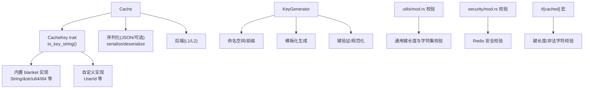
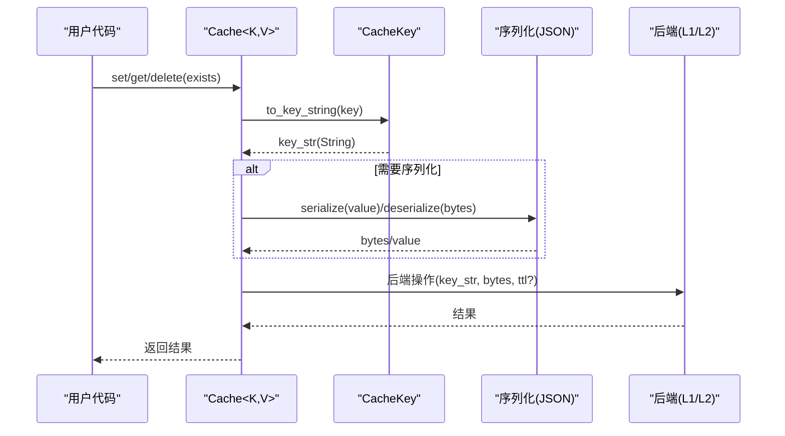
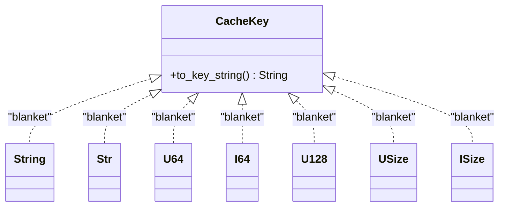
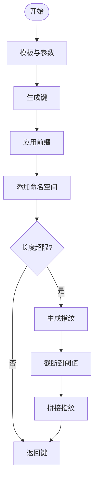
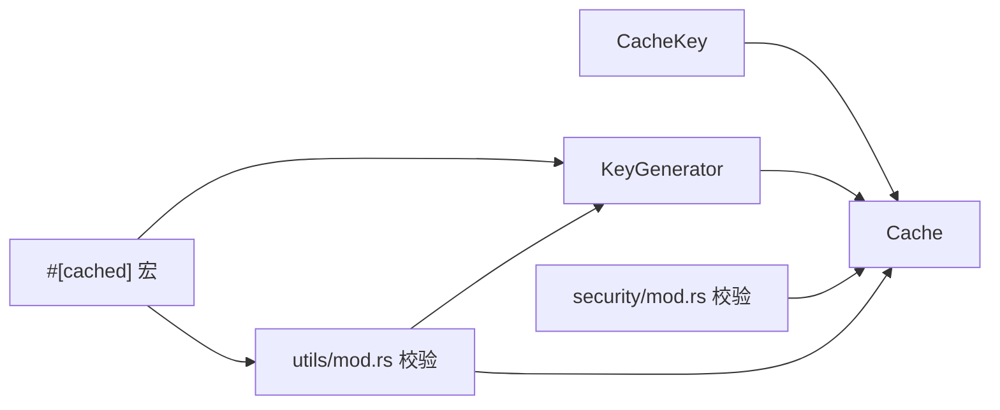

# 缓存键管理

<cite>
**本文引用的文件**
- [src/traits/cache_key.rs](file://src/traits/cache_key.rs)
- [src/utils/key_generator.rs](file://src/utils/key_generator.rs)
- [src/lib.rs](file://src/lib.rs)
- [src/cache.rs](file://src/cache.rs)
- [src/utils/mod.rs](file://src/utils/mod.rs)
- [src/security/mod.rs](file://src/security/mod.rs)
- [examples/src/01_basics/example_basic_operations.rs](file://examples/src/01_basics/example_basic_operations.rs)
- [examples/src/01_basics/example_serialization.rs](file://examples/src/01_basics/example_serialization.rs)
- [macros/src/lib.rs](file://macros/src/lib.rs)
</cite>

## 目录
1. [简介](#简介)
2. [项目结构](#项目结构)
3. [核心组件](#核心组件)
4. [架构总览](#架构总览)
5. [详细组件分析](#详细组件分析)
6. [依赖分析](#依赖分析)
7. [性能考量](#性能考量)
8. [故障排查指南](#故障排查指南)
9. [结论](#结论)
10. [附录](#附录)

## 简介
本章节系统阐述 Oxcache 的缓存键管理体系，重点围绕 CacheKey trait 的设计与实现、键生成与规范化、键序列化流程、有效期与过期策略、以及键监控与调试方法。文档同时提供最佳实践、冲突避免策略、示例与常见问题的解决方案，帮助开发者在不同后端与序列化场景下安全、稳定地使用缓存键。

## 项目结构
Oxcache 将“键”相关能力分布在以下模块：
- traits/cache_key.rs：定义 CacheKey trait 与常用类型的 blanket 实现
- utils/key_generator.rs：提供键生成器与验证、规范化、命名空间/前缀管理
- utils/mod.rs：提供通用键校验工具（与 Redis 安全校验互补）
- security/mod.rs：针对 Redis 的键安全校验（防注入、协议污染等）
- cache.rs：新式 Cache API 中对键的转换与调用
- lib.rs：对外导出 CacheKey、KeyGenerator 等公共 API
- macros/src/lib.rs：#[cached] 宏在生成键时对键长度与非法字符的校验逻辑
- examples：基础示例展示键的使用方式

图表来源
- [src/cache.rs](file://src/cache.rs#L241-L346)
- [src/traits/cache_key.rs](file://src/traits/cache_key.rs#L38-L105)
- [src/utils/key_generator.rs](file://src/utils/key_generator.rs#L47-L207)
- [src/utils/mod.rs](file://src/utils/mod.rs#L17-L50)
- [src/security/mod.rs](file://src/security/mod.rs#L74-L202)
- [macros/src/lib.rs](file://macros/src/lib.rs#L13-L43)

章节来源
- [src/lib.rs](file://src/lib.rs#L517-L639)
- [src/cache.rs](file://src/cache.rs#L117-L120)

## 核心组件
- CacheKey trait：定义任意类型到字符串键的转换，保证确定性与可重复性
- 内置 blanket 实现：覆盖 String、&str、u64、i64、u128、usize、isize 等常见类型
- KeyGenerator：模板化生成键、命名空间/前缀、键验证与规范化、长键指纹
- utils/mod.rs 校验：通用键长度与字符集校验
- security/mod.rs 校验：Redis 专用安全校验（防注入、协议污染）
- #[cached] 宏：在编译期/宏展开阶段进行键长度与非法字符校验

章节来源
- [src/traits/cache_key.rs](file://src/traits/cache_key.rs#L38-L105)
- [src/utils/key_generator.rs](file://src/utils/key_generator.rs#L47-L207)
- [src/utils/mod.rs](file://src/utils/mod.rs#L17-L50)
- [src/security/mod.rs](file://src/security/mod.rs#L74-L202)
- [macros/src/lib.rs](file://macros/src/lib.rs#L13-L43)

## 架构总览
新式 Cache API 在读写缓存时，先通过 CacheKey 将键转换为字符串，再交给后端执行具体操作；序列化模块在需要时负责值的序列化/反序列化。

图表来源
- [src/cache.rs](file://src/cache.rs#L241-L346)
- [src/traits/cache_key.rs](file://src/traits/cache_key.rs#L38-L48)

章节来源
- [src/cache.rs](file://src/cache.rs#L241-L346)

## 详细组件分析

### CacheKey trait 设计与实现
- 设计原则
  - 确定性：相同输入始终产生相同字符串表示
  - 可重复性：多次调用返回一致结果
  - 语义唯一性：不同业务含义应生成不同键
- 内置 blanket 实现
  - String/&str：直接复制或转 String
  - 数值类型：整数到字符串的稳定映射
- 自定义实现
  - 对于 UserId、PageId 等领域类型，建议显式实现，统一前缀与分隔符，避免跨类型混淆
  - 示例参考：示例程序中使用字符串键 user:1 的形式

图表来源
- [src/traits/cache_key.rs](file://src/traits/cache_key.rs#L53-L105)

章节来源
- [src/traits/cache_key.rs](file://src/traits/cache_key.rs#L38-L105)
- [examples/src/01_basics/example_basic_operations.rs](file://examples/src/01_basics/example_basic_operations.rs#L34-L35)

### 键生成与规范化（KeyGenerator）
- 功能
  - 模板化生成：支持 {placeholder} 替换
  - 命名空间与前缀：统一前缀与命名空间，避免键冲突
  - 键验证：长度与字符集校验
  - 规范化：长键生成指纹后截断拼接，保证不超过最大长度
- 最佳实践
  - 固定命名空间：如 app:v1
  - 固定前缀：如 user:、order:，避免跨模块键重名
  - 使用模板：将参数名作为占位符，减少手拼错误
  - 长键场景：启用指纹，确保键长度可控

图表来源
- [src/utils/key_generator.rs](file://src/utils/key_generator.rs#L128-L197)

章节来源
- [src/utils/key_generator.rs](file://src/utils/key_generator.rs#L47-L207)

### 键序列化与不同数据类型的键生成规则
- 键序列化
  - CacheKey 将键转换为 String
  - 值的序列化由序列化模块负责（JSON/可选），与键无关
- 数据类型规则
  - 字符串与数值类型：直接映射为字符串
  - 复合类型：建议实现 CacheKey，统一前缀与分隔符，避免跨类型键冲突
  - 示例：示例程序使用 "user:1" 形式的字符串键

章节来源
- [src/cache.rs](file://src/cache.rs#L241-L346)
- [examples/src/01_basics/example_basic_operations.rs](file://examples/src/01_basics/example_basic_operations.rs#L34-L35)

### 有效期管理与过期策略
- TTL 设置
  - set_with_ttl 允许为单次写入设置过期时间
  - get_or 模式下，若回源计算成功，通常也会写入带 TTL 的缓存
- 策略建议
  - 不同业务采用不同 TTL：热数据短 TTL，冷数据长 TTL
  - 对于批量写入，考虑统一 TTL 或按业务分组设置
  - 避免全局 TTL 与业务语义割裂，建议在业务层明确 TTL 策略

章节来源
- [src/cache.rs](file://src/cache.rs#L287-L325)

### 键监控与调试
- 常见监控点
  - 键长度分布：识别长键与潜在指纹化需求
  - 键字符集：发现非法字符导致的校验失败
  - 命名空间/前缀命中率：评估命名空间是否合理
  - Redis 安全校验：拦截注入风险
- 调试技巧
  - 在业务入口打印最终键（脱敏后）
  - 使用 KeyGenerator.generate_full 生成完整键，便于日志比对
  - 对长键启用指纹，结合日志定位原始键

章节来源
- [src/utils/key_generator.rs](file://src/utils/key_generator.rs#L153-L175)
- [src/utils/mod.rs](file://src/utils/mod.rs#L25-L50)
- [src/security/mod.rs](file://src/security/mod.rs#L92-L202)

### 键命名最佳实践与冲突避免策略
- 命名最佳实践
  - 固定命名空间：app:v1
  - 固定前缀：user:、order:、product: 等
  - 模板化：将参数名作为占位符，减少手拼
  - 明确分隔符：冒号 : 或下划线 _，保持一致性
- 冲突避免策略
  - 不同业务域使用不同命名空间
  - 不同版本使用不同命名空间或前缀
  - 复合键使用稳定顺序与分隔符
  - 长键统一走指纹化流程

章节来源
- [src/utils/key_generator.rs](file://src/utils/key_generator.rs#L199-L206)

### 为自定义类型实现 CacheKey
- 实现步骤
  - 为领域类型（如 UserId、OrderId）实现 CacheKey
  - 在 to_key_string 中统一前缀、分隔符与格式
  - 保证与现有命名空间/前缀策略一致
- 示例参考
  - 示例程序展示了字符串键 user:1 的使用方式，自定义类型可仿照此风格

章节来源
- [src/traits/cache_key.rs](file://src/traits/cache_key.rs#L26-L37)
- [examples/src/01_basics/example_basic_operations.rs](file://examples/src/01_basics/example_basic_operations.rs#L34-L35)

### 键安全与 Redis 校验
- 通用键校验（utils/mod.rs）
  - 长度上限与字符集校验
- Redis 专用校验（security/mod.rs）
  - 防注入与协议污染：禁止 \r/\n/\0 等控制字符
  - SQL 注入与路径遍历模式检测
  - 命令注入字符检测（仅对较长键严格）

章节来源
- [src/utils/mod.rs](file://src/utils/mod.rs#L17-L50)
- [src/security/mod.rs](file://src/security/mod.rs#L74-L202)

### 宏生成键与校验（#[cached]）
- 宏在生成键时会进行键长度与非法字符校验
- 支持多种键生成策略：simple/md5/murmur3/namespace
- 可通过 key、key_prefix、key_generator 等参数控制键生成

章节来源
- [macros/src/lib.rs](file://macros/src/lib.rs#L45-L100)
- [macros/src/lib.rs](file://macros/src/lib.rs#L151-L255)

## 依赖分析
- Cache<K,V> 依赖 CacheKey 将键转换为字符串
- KeyGenerator 依赖 utils/mod.rs 的通用校验与安全校验
- 宏 #[cached] 依赖 KeyGenerator 与 utils/mod.rs 的校验逻辑
- Redis 场景额外依赖 security/mod.rs 的安全校验

图表来源
- [src/cache.rs](file://src/cache.rs#L241-L346)
- [src/utils/key_generator.rs](file://src/utils/key_generator.rs#L153-L175)
- [src/utils/mod.rs](file://src/utils/mod.rs#L17-L50)
- [src/security/mod.rs](file://src/security/mod.rs#L74-L202)
- [macros/src/lib.rs](file://macros/src/lib.rs#L151-L255)

章节来源
- [src/lib.rs](file://src/lib.rs#L517-L639)

## 性能考量
- 键长度与指纹
  - 长键会增加序列化与网络开销，建议启用指纹化并截断
- 字符集与校验
  - 频繁的非法字符检测会带来 CPU 开销，建议在入口统一校验
- 命名空间/前缀
  - 合理的命名空间与前缀有助于命中率与维护性，间接提升整体性能

## 故障排查指南
- 常见问题
  - 键为空或超长：检查 KeyGenerator 配置与模板参数
  - 键包含非法字符：检查输入数据与字符集
  - Redis 写入失败：检查 security/mod.rs 的安全校验
  - 宏生成键失败：检查 key_generator 类型与参数
- 排查步骤
  - 打印最终键（脱敏）
  - 使用 KeyGenerator.generate_full 生成完整键
  - 分别调用 utils/mod.rs 与 security/mod.rs 的校验函数定位问题

章节来源
- [src/utils/key_generator.rs](file://src/utils/key_generator.rs#L153-L175)
- [src/utils/mod.rs](file://src/utils/mod.rs#L25-L50)
- [src/security/mod.rs](file://src/security/mod.rs#L92-L202)
- [macros/src/lib.rs](file://macros/src/lib.rs#L23-L43)

## 结论
Oxcache 的缓存键管理体系通过 CacheKey trait、KeyGenerator、通用与 Redis 安全校验、宏生成键等机制，提供了从设计、生成、验证到监控的完整闭环。遵循命名空间/前缀、模板化与指纹化等最佳实践，可在保证键唯一性的同时提升可维护性与安全性。

## 附录
- 示例参考
  - 基础 CRUD 示例展示了字符串键 user:1 的使用
  - 序列化示例展示了值的序列化流程（与键无关）

章节来源
- [examples/src/01_basics/example_basic_operations.rs](file://examples/src/01_basics/example_basic_operations.rs#L34-L35)
- [examples/src/01_basics/example_serialization.rs](file://examples/src/01_basics/example_serialization.rs#L46-L53)