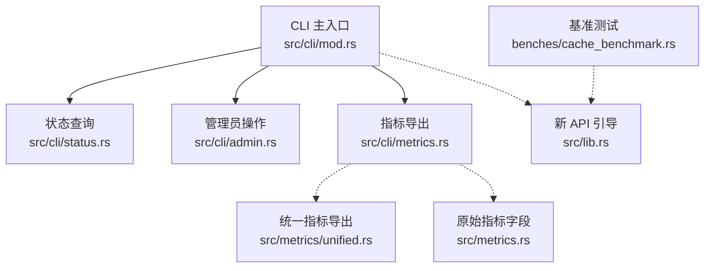
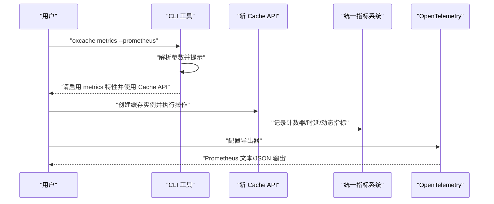
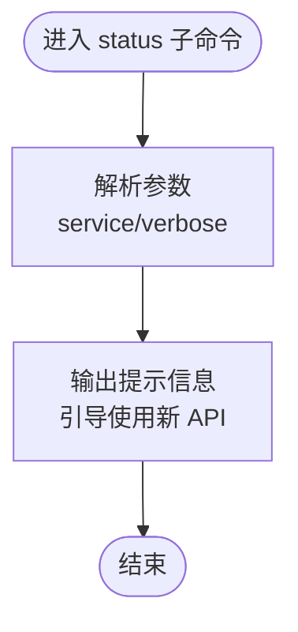
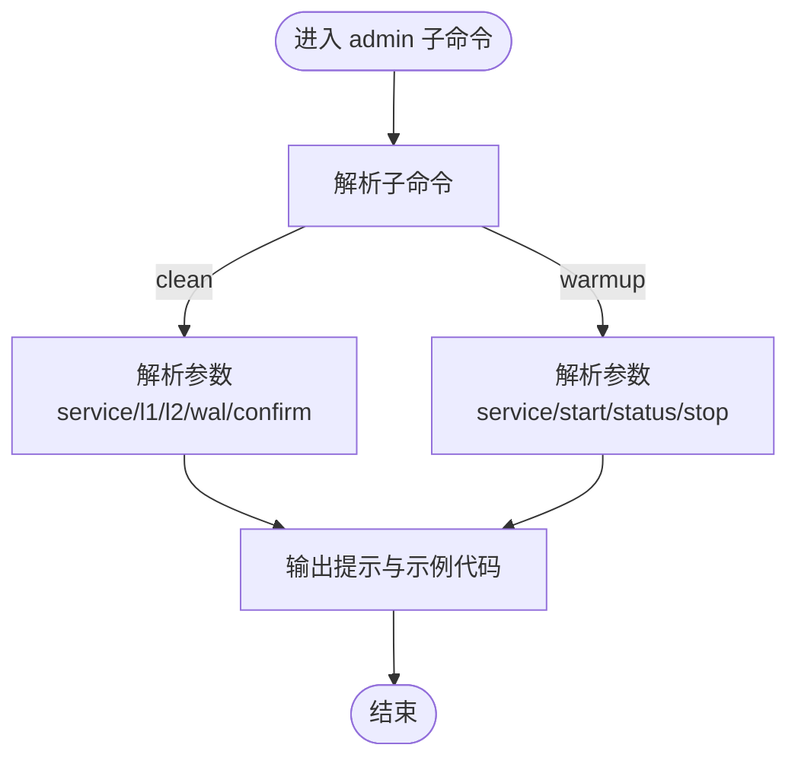
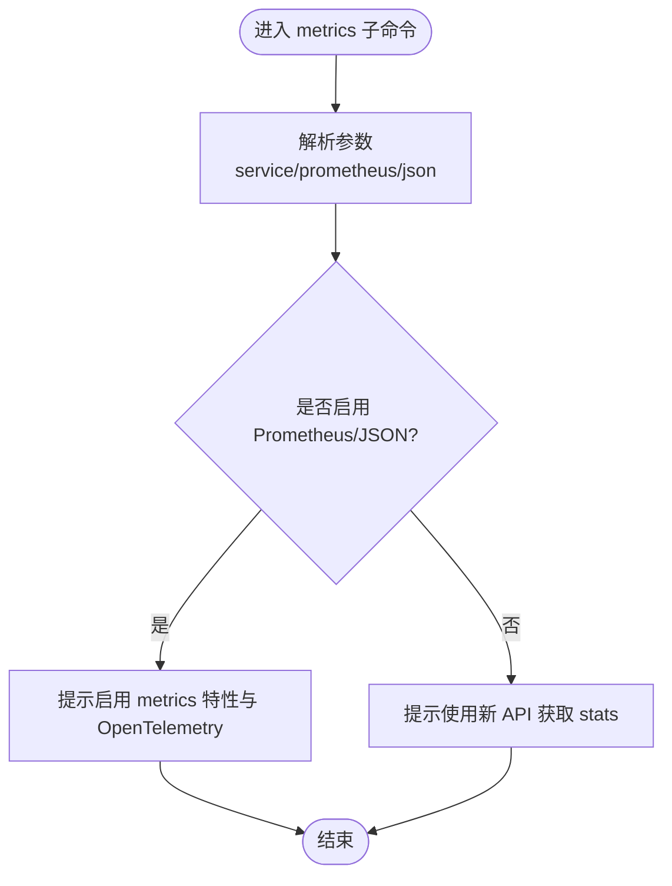
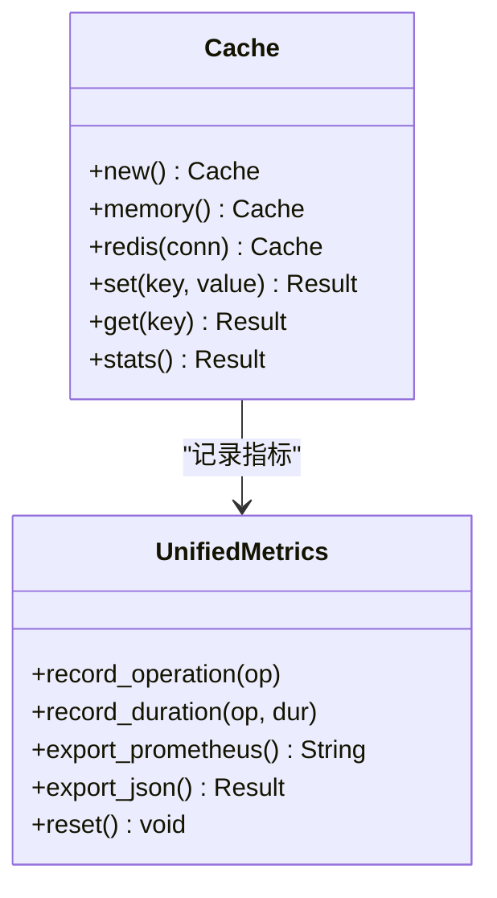
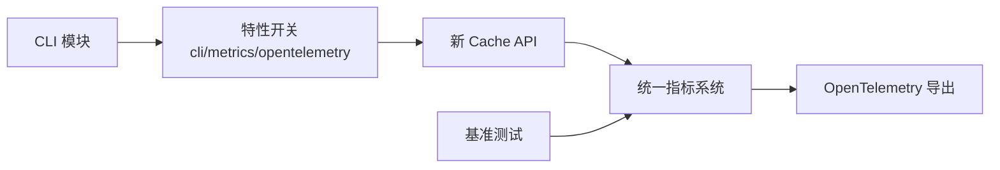

# 命令行工具

<cite>
**本文引用的文件**
- [src/cli/mod.rs](file://src/cli/mod.rs)
- [src/cli/admin.rs](file://src/cli/admin.rs)
- [src/cli/status.rs](file://src/cli/status.rs)
- [src/cli/metrics.rs](file://src/cli/metrics.rs)
- [Cargo.toml](file://Cargo.toml)
- [src/lib.rs](file://src/lib.rs)
- [src/metrics/unified.rs](file://src/metrics/unified.rs)
- [src/metrics.rs](file://src/metrics.rs)
- [benches/cache_benchmark.rs](file://benches/cache_benchmark.rs)
- [tests/integration/cli_test.rs](file://tests/integration/cli_test.rs)
</cite>

## 目录
1. [简介](#简介)
2. [项目结构](#项目结构)
3. [核心组件](#核心组件)
4. [架构总览](#架构总览)
5. [详细组件分析](#详细组件分析)
6. [依赖关系分析](#依赖关系分析)
7. [性能考量](#性能考量)
8. [故障排查指南](#故障排查指南)
9. [结论](#结论)
10. [附录](#附录)

## 简介
本章节面向运维与开发人员，系统性介绍 Oxcache 的命令行工具能力与使用方法。当前仓库中的 CLI 模块为“占位实现”，其主要职责是提示用户通过新的 Cache API 来完成缓存管理、状态查询与性能诊断等任务；同时，仓库提供了完整的指标体系与基准测试框架，可作为 CLI 能力的“后端支撑”。

- CLI 当前支持的子命令与参数：
  - status：查询缓存服务状态（占位提示）
  - admin：管理员操作（清理、预热）（占位提示）
  - metrics：获取缓存指标（占位提示）

- CLI 的安装与运行方式：
  - 通过 Cargo 安装：cargo install oxcache
  - 运行命令：oxcache <子命令> [参数]

- CLI 的功能现状：
  - CLI 模块本身不直接调用缓存后端，而是引导用户使用新的 Cache API（如 Cache::memory()/Cache::redis()）以获得真实的能力。
  - 指标导出（Prometheus/JSON）需启用 metrics 特性并结合 OpenTelemetry 使用。

**章节来源**
- [src/cli/mod.rs](file://src/cli/mod.rs#L10-L65)
- [src/cli/status.rs](file://src/cli/status.rs#L17-L25)
- [src/cli/admin.rs](file://src/cli/admin.rs#L11-L19)
- [src/cli/metrics.rs](file://src/cli/metrics.rs#L10-L24)
- [Cargo.toml](file://Cargo.toml#L235-L347)

## 项目结构
Oxcache 的 CLI 工具位于 src/cli 目录下，采用子命令分发模式，分别处理状态查询、管理员操作与指标导出。CLI 模块通过特性开关与 Cargo.toml 中的 feature 标记进行集成。

**图表来源**
- [src/cli/mod.rs](file://src/cli/mod.rs#L10-L65)
- [src/cli/status.rs](file://src/cli/status.rs#L17-L25)
- [src/cli/admin.rs](file://src/cli/admin.rs#L11-L19)
- [src/cli/metrics.rs](file://src/cli/metrics.rs#L10-L24)
- [src/lib.rs](file://src/lib.rs#L10-L82)
- [src/metrics/unified.rs](file://src/metrics/unified.rs#L619-L681)
- [src/metrics.rs](file://src/metrics.rs#L294-L331)
- [benches/cache_benchmark.rs](file://benches/cache_benchmark.rs#L1-L100)

**章节来源**
- [src/cli/mod.rs](file://src/cli/mod.rs#L10-L65)
- [Cargo.toml](file://Cargo.toml#L235-L347)

## 核心组件
- CLI 主解析器与分发
  - 定义命令名称、作者、版本与帮助信息
  - 子命令：status、admin、metrics
  - 分发逻辑：根据子命令调用对应模块的 execute 函数

- 状态查询模块
  - 占位实现：提示用户使用新的 Cache API 获取状态

- 管理员操作模块
  - 占位实现：提示用户使用新的 Cache API 执行清理与预热
  - 参数：服务名、层级选择（L1/L2/WAL）、确认跳过等

- 指标导出模块
  - 占位实现：提示用户启用 metrics 特性并通过 OpenTelemetry 导出 Prometheus/JSON

**章节来源**
- [src/cli/mod.rs](file://src/cli/mod.rs#L10-L65)
- [src/cli/status.rs](file://src/cli/status.rs#L10-L25)
- [src/cli/admin.rs](file://src/cli/admin.rs#L21-L67)
- [src/cli/metrics.rs](file://src/cli/metrics.rs#L10-L24)

## 架构总览
CLI 与缓存系统的交互路径如下：CLI 作为“门面”提示用户使用新的 Cache API；新的 Cache API 内部使用统一指标系统进行统计与导出；最终通过 OpenTelemetry 将指标暴露为 Prometheus 或 JSON。

**图表来源**
- [src/cli/metrics.rs](file://src/cli/metrics.rs#L10-L24)
- [src/lib.rs](file://src/lib.rs#L10-L82)
- [src/metrics/unified.rs](file://src/metrics/unified.rs#L619-L715)

## 详细组件分析

### 状态查询组件（status）
- 功能定位：占位实现，引导用户使用新的 Cache API 获取服务状态
- 典型用法：通过 Cache::memory()/Cache::redis() 创建实例后，结合应用内部状态检查逻辑
- 输出形态：当前 CLI 输出提示信息，未来可扩展为返回 JSON/文本格式的状态摘要

**图表来源**
- [src/cli/status.rs](file://src/cli/status.rs#L17-L25)

**章节来源**
- [src/cli/status.rs](file://src/cli/status.rs#L10-L25)

### 管理员操作组件（admin）
- 功能定位：占位实现，引导用户使用新的 Cache API 执行缓存清理与预热
- 支持的子命令与参数：
  - clean：按服务名清理 L1/L2/WAL，支持跳过确认
  - warmup：启动/查询/停止预热流程
- 交互方式：CLI 输出示例代码，用户在应用中调用相应 API

**图表来源**
- [src/cli/admin.rs](file://src/cli/admin.rs#L21-L67)

**章节来源**
- [src/cli/admin.rs](file://src/cli/admin.rs#L11-L67)

### 指标导出组件（metrics）
- 功能定位：占位实现，提示用户启用 metrics 特性并通过 OpenTelemetry 导出指标
- 支持的输出格式：Prometheus、JSON（需启用 metrics 特性）
- 指标内容：命中/未命中、增删改、错误计数、操作时延、L2 健康状态、WAL 条目数等

**图表来源**
- [src/cli/metrics.rs](file://src/cli/metrics.rs#L10-L24)
- [src/metrics/unified.rs](file://src/metrics/unified.rs#L619-L681)
- [src/metrics.rs](file://src/metrics.rs#L294-L331)

**章节来源**
- [src/cli/metrics.rs](file://src/cli/metrics.rs#L10-L24)
- [src/metrics/unified.rs](file://src/metrics/unified.rs#L619-L715)
- [src/metrics.rs](file://src/metrics.rs#L294-L331)

### 新 Cache API 与指标系统
- 新 API 能力
  - 创建内存缓存与 Redis 缓存实例
  - 批量写入/读取/删除
  - 与序列化、TTL 控制、智能策略等特性协同
- 指标系统
  - 统一计数器与动态指标
  - Prometheus 导出格式
  - JSON 导出（启用序列化特性）
  - 全局指标实例与便捷函数

**图表来源**
- [src/lib.rs](file://src/lib.rs#L140-L200)
- [src/metrics/unified.rs](file://src/metrics/unified.rs#L159-L175)
- [src/metrics/unified.rs](file://src/metrics/unified.rs#L686-L715)

**章节来源**
- [src/lib.rs](file://src/lib.rs#L10-L82)
- [src/metrics/unified.rs](file://src/metrics/unified.rs#L619-L715)

## 依赖关系分析
- CLI 与特性开关
  - CLI 本身通过 cargo feature “cli” 集成（clap、dashmap、tracing、metrics）
  - 指标导出依赖 OpenTelemetry 生态（opentelemetry、opentelemetry_sdk、tracing-opentelemetry、opentelemetry-otlp）
- CLI 与新 API 的耦合
  - CLI 通过“占位实现”引导用户使用新的 Cache API，避免直接耦合具体后端
- 性能测试与指标的关系
  - 基准测试覆盖 L1 设置/获取/不同数据尺寸/批量写入
  - 指标系统提供命中率、时延、错误等关键观测点

**图表来源**
- [Cargo.toml](file://Cargo.toml#L235-L347)
- [benches/cache_benchmark.rs](file://benches/cache_benchmark.rs#L1-L100)
- [src/metrics/unified.rs](file://src/metrics/unified.rs#L619-L715)

**章节来源**
- [Cargo.toml](file://Cargo.toml#L235-L347)
- [benches/cache_benchmark.rs](file://benches/cache_benchmark.rs#L1-L100)

## 性能考量
- 基准测试覆盖
  - L1 设置/获取、不同数据尺寸、批量写入
  - 通过 Criterion 提供吞吐与时延度量
- 指标观测
  - 命中率、错误计数、操作时延、L2 健康状态、WAL 条目数
  - Prometheus 导出便于与监控系统集成
- 最佳实践
  - 在生产环境启用 metrics 特性与 OpenTelemetry
  - 结合基准测试与实时指标进行容量规划与性能回归检测

**章节来源**
- [benches/cache_benchmark.rs](file://benches/cache_benchmark.rs#L1-L100)
- [src/metrics/unified.rs](file://src/metrics/unified.rs#L619-L715)
- [src/metrics.rs](file://src/metrics.rs#L294-L331)

## 故障排查指南
- CLI 无法识别子命令
  - 确认已启用 CLI 特性（feature “cli”）
- 指标导出失败
  - 确认已启用 metrics 特性与 OpenTelemetry 相关 feature
  - 检查导出器配置（Prometheus/JSON）
- 状态查询无结果
  - CLI 为占位实现，需在应用中使用新 API 获取状态
- 管理员操作无效
  - CLI 为占位实现，需在应用中使用新 API 执行清理/预热

**章节来源**
- [src/cli/mod.rs](file://src/cli/mod.rs#L10-L65)
- [src/cli/metrics.rs](file://src/cli/metrics.rs#L10-L24)
- [src/cli/status.rs](file://src/cli/status.rs#L17-L25)
- [src/cli/admin.rs](file://src/cli/admin.rs#L11-L19)
- [Cargo.toml](file://Cargo.toml#L235-L347)

## 结论
- CLI 当前为“占位实现”，核心能力通过新的 Cache API 提供
- 指标体系完善，支持 Prometheus/JSON 导出，适配 OpenTelemetry
- 基准测试覆盖关键场景，可作为性能诊断与回归验证的基础
- 建议在生产环境中启用 metrics 特性，并结合 CLI 引导与新 API 使用方式，形成完整的可观测性闭环

[无需章节来源：本节为总结性内容]

## 附录

### 安装与使用
- 安装
  - cargo install oxcache
- 使用
  - oxcache status [--service SERVICE] [--verbose]
  - oxcache admin clean --service SERVICE [--l1] [--l2] [--wal] [--confirm]
  - oxcache admin warmup --service SERVICE --start|--status|--stop
  - oxcache metrics [--service SERVICE] [--prometheus] [--json]

**章节来源**
- [src/cli/mod.rs](file://src/cli/mod.rs#L10-L65)

### 配置与定制
- 特性开关
  - cli：启用 CLI 解析与基础依赖
  - metrics/full-metrics：启用指标与 OpenTelemetry
  - redis：启用 L2 Redis 后端
  - serialization/bincode/compression：启用序列化与压缩
- 定制建议
  - 在应用中通过 Cache::builder() 配置后端、TTL、序列化策略
  - 在 CI 中启用 metrics 特性，结合基准测试进行性能回归

**章节来源**
- [Cargo.toml](file://Cargo.toml#L235-L347)
- [src/lib.rs](file://src/lib.rs#L68-L82)

### 常见操作示例与最佳实践
- 示例（概念性）
  - 创建内存缓存并设置/获取键值
  - 使用 Redis 缓存实例进行分布式缓存
  - 启用 metrics 并导出 Prometheus 指标
- 最佳实践
  - 在开发阶段使用内存缓存，生产阶段使用 Redis
  - 对大对象启用压缩，对热点数据设置合理 TTL
  - 定期导出指标并建立告警阈值

**章节来源**
- [src/lib.rs](file://src/lib.rs#L10-L82)
- [src/cli/metrics.rs](file://src/cli/metrics.rs#L10-L24)
- [src/metrics/unified.rs](file://src/metrics/unified.rs#L619-L715)

### CLI 与缓存系统的交互机制与数据格式
- 交互机制
  - CLI 作为“门面”，引导用户使用新 API
  - 新 API 内部维护统一指标系统，支持导出
- 数据格式
  - Prometheus 文本格式（键值对）
  - JSON 格式（启用序列化特性）
  - CLI 当前输出为提示信息，未来可扩展为结构化输出

**章节来源**
- [src/cli/mod.rs](file://src/cli/mod.rs#L10-L65)
- [src/metrics/unified.rs](file://src/metrics/unified.rs#L619-L715)
- [src/metrics.rs](file://src/metrics.rs#L294-L331)