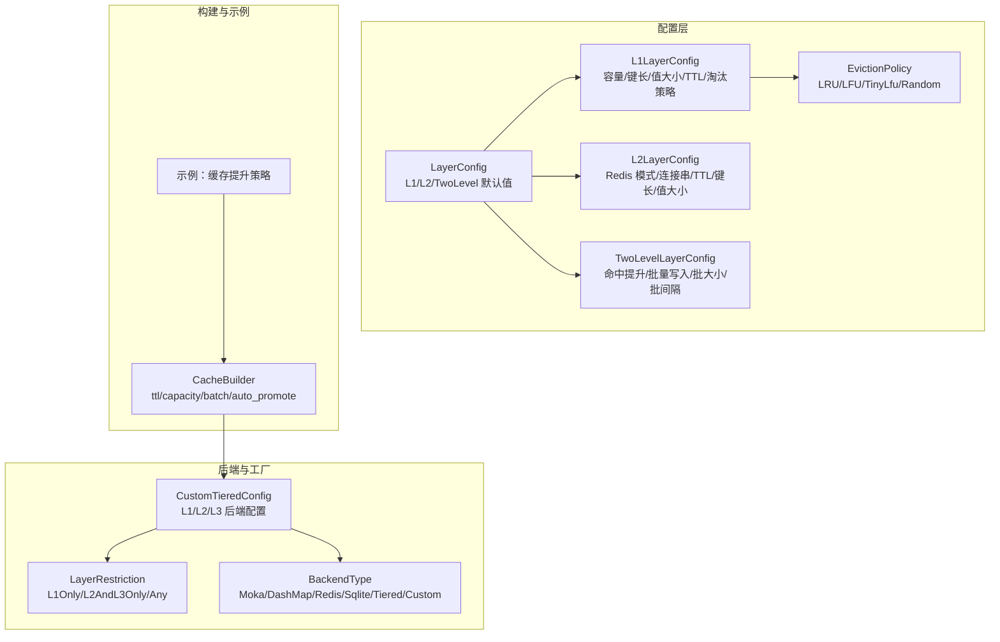
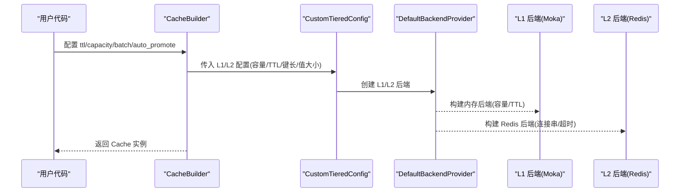
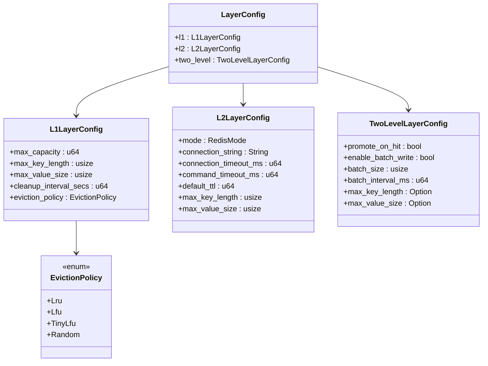
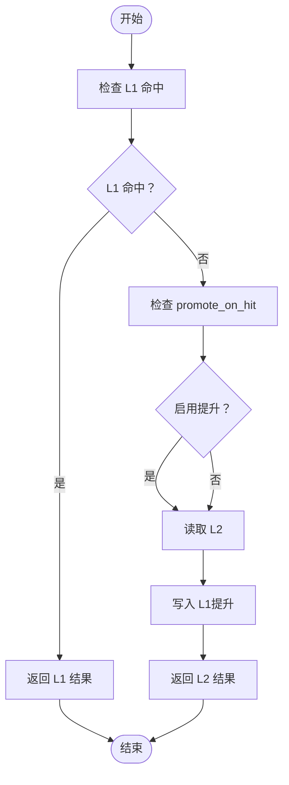
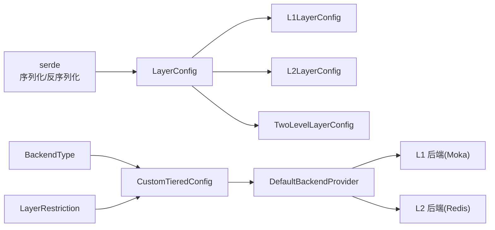

# 层级配置

<cite>
**本文引用的文件**
- [src/config/layer.rs](file://src/config/layer.rs)
- [src/backend/custom_tiered.rs](file://src/backend/custom_tiered.rs)
- [src/builder/cache_builder.rs](file://src/builder/cache_builder.rs)
- [examples/src/02_advanced/example_cache_promotion.rs](file://examples/src/02_advanced/example_cache_promotion.rs)
- [src/metrics.rs](file://src/metrics.rs)
- [src/config/service.rs](file://src/config/service.rs)
- [src/config/unified.rs](file://src/config/unified.rs)
</cite>

## 目录
1. [简介](#简介)
2. [项目结构](#项目结构)
3. [核心组件](#核心组件)
4. [架构总览](#架构总览)
5. [详细组件分析](#详细组件分析)
6. [依赖关系分析](#依赖关系分析)
7. [性能考量](#性能考量)
8. [故障排查指南](#故障排查指南)
9. [结论](#结论)
10. [附录](#附录)

## 简介
本篇文档聚焦 Oxcache 的“层级配置系统”，系统性阐述 L1/L2 两级缓存的配置结构与运行机制，覆盖以下主题：
- 配置结构：LayerConfig、L1LayerConfig、L2LayerConfig、TwoLevelLayerConfig 的设计与用途
- 淘汰策略：EvictionPolicy 枚举及其在 L1 层的应用
- 层级间参数传递：L1 与 L2 的参数如何协同工作，以及提升策略（promote_on_hit）的作用
- 优先级与数据流：L1 优先、L2 作为后备的访问与写入顺序
- 完整示例：不同层级配置组合的效果与对比
- 性能影响与优化策略：容量、TTL、批量写入、提升策略等对吞吐与延迟的影响
- 最佳实践与常见问题：如何选择后端、如何避免配置冲突、如何监控命中率与性能

## 项目结构
层级配置系统主要分布在以下模块：
- 配置定义：src/config/layer.rs
- 自定义分层后端与配置校验：src/backend/custom_tiered.rs
- 构建器与高层封装：src/builder/cache_builder.rs
- 示例与用法：examples/src/02_advanced/example_cache_promotion.rs
- 指标统计：src/metrics.rs
- 服务配置与特性开关：src/config/service.rs、src/config/unified.rs

**图示来源**
- [src/config/layer.rs](file://src/config/layer.rs#L14-L22)
- [src/config/layer.rs](file://src/config/layer.rs#L52-L95)
- [src/config/layer.rs](file://src/config/layer.rs#L100-L155)
- [src/config/layer.rs](file://src/config/layer.rs#L157-L206)
- [src/config/layer.rs](file://src/config/layer.rs#L208-L232)
- [src/backend/custom_tiered.rs](file://src/backend/custom_tiered.rs#L362-L451)
- [src/backend/custom_tiered.rs](file://src/backend/custom_tiered.rs#L331-L360)
- [src/builder/cache_builder.rs](file://src/builder/cache_builder.rs#L38-L58)
- [examples/src/02_advanced/example_cache_promotion.rs](file://examples/src/02_advanced/example_cache_promotion.rs#L21-L25)

**章节来源**
- [src/config/layer.rs](file://src/config/layer.rs#L14-L22)
- [src/backend/custom_tiered.rs](file://src/backend/custom_tiered.rs#L362-L451)
- [src/builder/cache_builder.rs](file://src/builder/cache_builder.rs#L38-L58)

## 核心组件
- LayerConfig：统一的层级默认配置容器，包含 L1、L2、TwoLevel 三部分默认值，便于服务配置继承与复用。
- L1LayerConfig：定义 L1（本地内存）缓存的容量、键长、值大小、过期清理间隔与淘汰策略。
- L2LayerConfig：定义 L2（Redis 等分布式/持久化）缓存的连接模式、连接串、超时、默认 TTL、键长与值大小。
- TwoLevelLayerConfig：定义双层缓存的行为，如命中时是否提升到 L1、是否启用批量写入及批大小与间隔等。
- EvictionPolicy：淘汰策略枚举，支持 LRU、LFU、TinyLfu、Random，默认为 LRU。

这些结构均实现了可组合的 with_* 方法与 Default，便于链式配置与测试。

**章节来源**
- [src/config/layer.rs](file://src/config/layer.rs#L14-L47)
- [src/config/layer.rs](file://src/config/layer.rs#L52-L95)
- [src/config/layer.rs](file://src/config/layer.rs#L100-L155)
- [src/config/layer.rs](file://src/config/layer.rs#L157-L206)
- [src/config/layer.rs](file://src/config/layer.rs#L208-L232)

## 架构总览
Oxcache 的层级配置通过“配置层 + 后端工厂 + 构建器”的协作实现：
- 配置层提供默认值与可选参数（容量、TTL、淘汰策略、批量写入等）
- 后端工厂根据配置选择合适的后端类型，并进行层级合法性校验与自动修复
- 构建器将高层参数（如 TTL、容量、批量写入、自动提升）注入到具体后端
- 示例展示了“命中提升”在 L1/L2 双层缓存中的作用

**图示来源**
- [src/builder/cache_builder.rs](file://src/builder/cache_builder.rs#L193-L208)
- [src/backend/custom_tiered.rs](file://src/backend/custom_tiered.rs#L613-L682)
- [src/backend/custom_tiered.rs](file://src/backend/custom_tiered.rs#L766-L779)

## 详细组件分析

### 配置结构与用途
- LayerConfig：作为服务配置的基线，提供 L1/L2/TwoLevel 的默认值，便于继承与覆盖。
- L1LayerConfig：面向 L1 的容量与淘汰策略，直接影响 L1 的命中率与内存占用；cleanup_interval_secs 控制过期扫描频率。
- L2LayerConfig：面向 L2 的连接与超时参数，default_ttl 影响 L2 中条目的生命周期。
- TwoLevelLayerConfig：控制“命中提升”与“批量写入”，前者提升热数据到 L1，后者降低 L2 写入开销。

**图示来源**
- [src/config/layer.rs](file://src/config/layer.rs#L14-L22)
- [src/config/layer.rs](file://src/config/layer.rs#L52-L95)
- [src/config/layer.rs](file://src/config/layer.rs#L100-L155)
- [src/config/layer.rs](file://src/config/layer.rs#L157-L206)
- [src/config/layer.rs](file://src/config/layer.rs#L208-L232)

**章节来源**
- [src/config/layer.rs](file://src/config/layer.rs#L14-L22)
- [src/config/layer.rs](file://src/config/layer.rs#L52-L95)
- [src/config/layer.rs](file://src/config/layer.rs#L100-L155)
- [src/config/layer.rs](file://src/config/layer.rs#L157-L206)
- [src/config/layer.rs](file://src/config/layer.rs#L208-L232)

### 淘汰策略（EvictionPolicy）
- LRU：最近最少使用，适合大多数场景，命中率稳定。
- LFU：最不经常使用，适合访问分布极不均匀的数据集。
- TinyLfu：轻量级 LFU，空间效率更高，适合内存受限场景。
- Random：随机淘汰，简单高效，适合高并发下的低开销场景。

注意：L1LayerConfig 中的 eviction_policy 仅用于 L1 层的内存后端（如 Moka），L2 层（Redis）由后端自身策略决定。

**章节来源**
- [src/config/layer.rs](file://src/config/layer.rs#L208-L232)

### 层级间参数传递与协调
- L1 与 L2 的容量、TTL、键长/值大小在各自配置结构中独立设置，互不影响。
- 命中提升（promote_on_hit）：当 L2 命中时，将数据提升到 L1，提升后续访问速度。
- 批量写入（enable_batch_write + batch_size + batch_interval_ms）：合并写操作，降低 L2 写入压力，提高吞吐。
- 自动修复（CustomTieredConfig.auto_fix）：在配置不合法时自动调整后端类型，确保 L1/L2/L3 的层级约束得到满足。

**图示来源**
- [src/config/layer.rs](file://src/config/layer.rs#L157-L206)
- [src/backend/custom_tiered.rs](file://src/backend/custom_tiered.rs#L1032-L1138)

**章节来源**
- [src/config/layer.rs](file://src/config/layer.rs#L157-L206)
- [src/backend/custom_tiered.rs](file://src/backend/custom_tiered.rs#L1032-L1138)

### 优先级与数据流向控制
- 优先级：L1 优先，L2 作为后备。L1 命中即返回，未命中再回退到 L2。
- 写入：根据 TwoLevelLayerConfig 的策略决定是否同时写入 L1/L2，以及是否启用批量写入。
- 提升：当 promote_on_hit 为真时，L2 命中后将数据写入 L1，使热数据更快命中。

**章节来源**
- [src/config/layer.rs](file://src/config/layer.rs#L157-L206)
- [examples/src/02_advanced/example_cache_promotion.rs](file://examples/src/02_advanced/example_cache_promotion.rs#L21-L65)

### 完整示例：不同层级配置组合
- 示例：双层缓存（L1 内存 + L2 Redis），演示“命中提升”效果
  - 通过 Cache::tiered 创建带 L1/L2 的缓存
  - 首次访问 L2 并提升到 L1，后续访问 L1 命中更快
- 示例路径参考：
  - [examples/src/02_advanced/example_cache_promotion.rs](file://examples/src/02_advanced/example_cache_promotion.rs#L21-L65)

提示：若需更复杂的三层（L1/L2/L3）或多后端组合，可使用自定义分层配置（CustomTieredConfig）并启用自动修复。

**章节来源**
- [examples/src/02_advanced/example_cache_promotion.rs](file://examples/src/02_advanced/example_cache_promotion.rs#L21-L65)
- [src/backend/custom_tiered.rs](file://src/backend/custom_tiered.rs#L766-L779)

### 配置与构建器的衔接
- CacheBuilder 提供高层参数（ttl、capacity、batch_writes、auto_promote），最终通过 BackendBuilder 或默认工厂创建后端。
- 在双层缓存场景，auto_promote 对应 TwoLevelLayerConfig.promote_on_hit，batch_writes 对应 enable_batch_write。

**章节来源**
- [src/builder/cache_builder.rs](file://src/builder/cache_builder.rs#L38-L58)
- [src/builder/cache_builder.rs](file://src/builder/cache_builder.rs#L129-L149)
- [src/builder/cache_builder.rs](file://src/builder/cache_builder.rs#L193-L208)

## 依赖关系分析
- 配置层依赖 serde 进行序列化/反序列化，便于从 TOML/JSON 加载配置。
- 后端工厂依赖 BackendType 与 LayerRestriction 确保层级与后端类型匹配，避免错误配置。
- 构建器依赖后端工厂创建具体后端实例，并将高层参数注入。

**图示来源**
- [src/config/layer.rs](file://src/config/layer.rs#L7-L8)
- [src/backend/custom_tiered.rs](file://src/backend/custom_tiered.rs#L362-L451)
- [src/backend/custom_tiered.rs](file://src/backend/custom_tiered.rs#L766-L779)

**章节来源**
- [src/config/layer.rs](file://src/config/layer.rs#L7-L8)
- [src/backend/custom_tiered.rs](file://src/backend/custom_tiered.rs#L362-L451)
- [src/backend/custom_tiered.rs](file://src/backend/custom_tiered.rs#L766-L779)

## 性能考量
- 容量与淘汰策略
  - L1 容量越大，命中率越高，但内存占用增加；淘汰策略影响冷数据替换效率。
  - EvictionPolicy 的选择需结合访问模式：热点集中用 LRU，访问分布不均用 LFU/TinyLfu。
- TTL 与清理间隔
  - L1.cleanup_interval_secs 控制过期扫描频率，过短增加 CPU 开销，过长导致过期条目滞留。
  - L2.default_ttl 控制 L2 条目生命周期，需与业务缓存窗口匹配。
- 批量写入
  - enable_batch_write + batch_size + batch_interval_ms 可显著降低 L2 写入 RTT，提升吞吐。
- 命中提升
  - promote_on_hit 能让热数据更快命中 L1，降低整体延迟，但会增加 L1 写入压力。

**章节来源**
- [src/config/layer.rs](file://src/config/layer.rs#L52-L95)
- [src/config/layer.rs](file://src/config/layer.rs#L100-L155)
- [src/config/layer.rs](file://src/config/layer.rs#L157-L206)
- [src/metrics.rs](file://src/metrics.rs#L463-L496)

## 故障排查指南
- 配置不合法
  - 后端类型与层级不匹配：例如将仅支持 L1 的后端放在 L2/L3，工厂会报错或自动修复。
  - 自动修复：开启 auto_fix 后，工厂会尝试将后端类型调整为推荐层级，可通过日志查看修复记录。
- 特性缺失
  - 若缺少 moka 或 redis 特性，某些默认配置不可用，构建器会回退到可用后端。
- 命中率低
  - 检查 L1 容量是否过小、TTL 是否过短、淘汰策略是否合适。
  - 开启 promote_on_hit 并评估批量写入对 L2 压力的影响。
- 指标监控
  - 使用指标模块统计 L1/L2 命中率与总体命中率，定位瓶颈。

**章节来源**
- [src/backend/custom_tiered.rs](file://src/backend/custom_tiered.rs#L1032-L1138)
- [src/config/service.rs](file://src/config/service.rs#L283-L296)
- [src/metrics.rs](file://src/metrics.rs#L463-L496)

## 结论
Oxcache 的层级配置系统通过“配置层 + 后端工厂 + 构建器”的分层设计，提供了灵活、可扩展且安全的 L1/L2 两级缓存能力。合理设置容量、TTL、淘汰策略与批量写入/提升策略，可在命中率与吞吐之间取得平衡；通过自动修复与层级约束，可有效避免配置错误带来的运行风险。

## 附录
- 关键配置项速览
  - L1：max_capacity、max_key_length、max_value_size、cleanup_interval_secs、eviction_policy
  - L2：mode、connection_string、connection_timeout_ms、command_timeout_ms、default_ttl、max_key_length、max_value_size
  - 双层：promote_on_hit、enable_batch_write、batch_size、batch_interval_ms、max_key_length、max_value_size
- 常用组合建议
  - 高并发低延迟：增大 L1 容量，启用 promote_on_hit，适度批量写入
  - 内存受限：选择 TinyLfu 或 Random 淘汰策略，缩短 L2 TTL
  - 热点数据多：启用 LFU/TinyLfu，配合较长 L1 容量