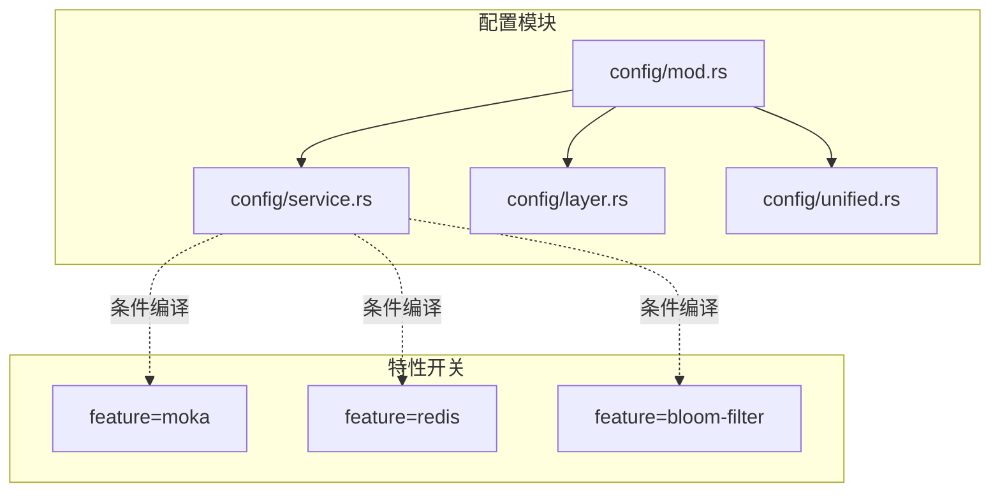
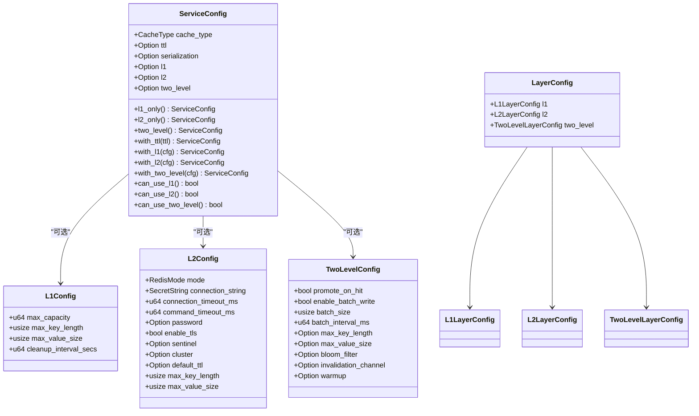
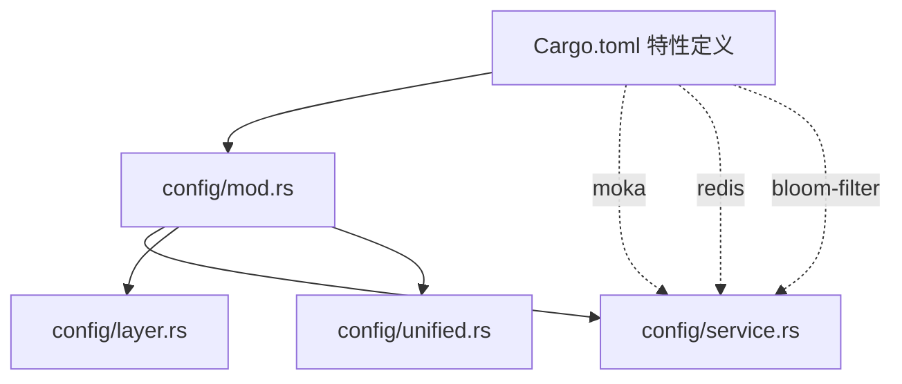

# 服务配置

<cite>
**本文引用的文件**
- [service.rs](file://src/config/service.rs)
- [layer.rs](file://src/config/layer.rs)
- [unified.rs](file://src/config/unified.rs)
- [mod.rs](file://src/config/mod.rs)
- [Cargo.toml](file://Cargo.toml)
- [error.rs](file://src/error.rs)
- [dynamic_config.rs](file://examples/src/dynamic_config.rs)
- [example_batch_write.rs](file://examples/src/02_advanced/example_batch_write.rs)
- [lifecycle_test.rs](file://tests/integration/lifecycle_test.rs)
- [comprehensive_test.rs](file://tests/integration/comprehensive_test.rs)
</cite>

## 目录
1. [简介](#简介)
2. [项目结构](#项目结构)
3. [核心组件](#核心组件)
4. [架构总览](#架构总览)
5. [详细组件分析](#详细组件分析)
6. [依赖关系分析](#依赖关系分析)
7. [性能考量](#性能考量)
8. [故障排查指南](#故障排查指南)
9. [结论](#结论)
10. [附录](#附录)

## 简介
本章节系统性介绍 Oxcache 的服务配置体系，重点覆盖以下核心类型与能力：
- 服务配置 ServiceConfig：统一入口，按特性开关暴露 L1/L2/TwoLevel 配置字段
- 缓存类型 CacheType：支持 L1、L2、TwoLevel 三种模式
- L1 层配置 L1Config：内存缓存参数（容量、键值限制、清理周期等）
- L2 层配置 L2Config：Redis 缓存参数（连接、超时、认证、TLS、模式、键值限制等）
- 两层缓存配置 TwoLevelConfig：批量写入、命中提升、布隆过滤器、失效通道、预热等高级能力
- 层级默认配置 LayerConfig：便于继承与复用的默认值
- 统一配置 UnifiedConfig：面向“统一配置系统”的高层封装（与服务配置并行存在）

同时，文档将说明不同缓存类型的适用场景、参数范围与默认值、参数传递机制、实际示例、配置验证与错误处理、以及性能优化建议。

## 项目结构
Oxcache 的配置模块位于 src/config 目录，采用“按职责分层”的组织方式：
- config/mod.rs：模块入口与 re-export，按特性开关导出类型
- config/service.rs：服务配置（ServiceConfig、L1Config、L2Config、TwoLevelConfig、CacheType 等）
- config/layer.rs：层级默认配置（LayerConfig、L1LayerConfig、L2LayerConfig、TwoLevelLayerConfig、EvictionPolicy、RedisMode）
- config/unified.rs：统一配置系统（UnifiedConfig、BackendConfig、PerformanceConfig 等），提供高层封装与校验

图表来源
- [mod.rs](file://src/config/mod.rs#L11-L31)
- [service.rs](file://src/config/service.rs#L7-L31)
- [layer.rs](file://src/config/layer.rs#L1-L22)
- [unified.rs](file://src/config/unified.rs#L17-L33)

章节来源
- [mod.rs](file://src/config/mod.rs#L11-L31)
- [service.rs](file://src/config/service.rs#L7-L31)
- [layer.rs](file://src/config/layer.rs#L1-L22)
- [unified.rs](file://src/config/unified.rs#L17-L33)

## 核心组件
本节对关键配置类型进行深入解析，包括字段含义、默认值、可选范围与典型用途。

- 服务配置 ServiceConfig
  - 字段：cache_type、ttl、serialization、l1（可选）、l2（可选）、two_level（可选）
  - 行为：提供 with_xxx 方法设置子配置；can_use_xxx 判断当前特性是否可用
  - 工厂方法：l1_only、l2_only、two_level，按特性组合返回对应配置
  - 适用场景：统一服务维度的缓存策略选择与参数注入

- 缓存类型 CacheType
  - 枚举：L1、L2、TwoLevel（默认）
  - 作用：决定 ServiceConfig 中哪些子配置生效

- L1 层配置 L1Config（需 moka 特性）
  - 字段：max_capacity、max_key_length、max_value_size、cleanup_interval_secs
  - 默认值：容量 10000、键最大长度 512、值最大大小 1MB、清理间隔 300 秒
  - 适用场景：进程内高性能缓存，低延迟访问

- L2 层配置 L2Config（需 redis 特性）
  - 字段：mode、connection_string、connection_timeout_ms、command_timeout_ms、password（可选）、enable_tls、sentinel（可选）、cluster（可选）、default_ttl（可选）、max_key_length、max_value_size
  - 默认值：连接超时 5000ms、命令超时 30000ms、禁用 TLS、键最大长度 512、值最大大小 10MB
  - 适用场景：跨进程/多实例共享缓存，支持单机、哨兵、集群模式

- 两层缓存配置 TwoLevelConfig（需 redis 特性）
  - 字段：promote_on_hit、enable_batch_write、batch_size、batch_interval_ms、max_key_length（可选）、max_value_size（可选）、bloom_filter（可选）、invalidation_channel（可选）、warmup（可选）
  - 默认值：promote_on_hit=true、enable_batch_write=false、batch_size=100、batch_interval_ms=10、键/值限制可选
  - 适用场景：结合 L1/L2 的混合策略，提升命中率与吞吐

- 层级默认配置 LayerConfig
  - 字段：l1、l2、two_level
  - 作用：为 L1/L2/TwoLevel 提供默认参数，便于继承与复用

- 统一配置 UnifiedConfig（可选路径）
  - 字段：backend、performance、features、monitoring、security
  - 作用：面向“统一配置系统”的高层封装，提供更丰富的性能、监控、安全等配置维度

章节来源
- [service.rs](file://src/config/service.rs#L105-L297)
- [service.rs](file://src/config/service.rs#L299-L358)
- [service.rs](file://src/config/service.rs#L360-L491)
- [service.rs](file://src/config/service.rs#L493-L542)
- [layer.rs](file://src/config/layer.rs#L14-L47)
- [layer.rs](file://src/config/layer.rs#L49-L95)
- [layer.rs](file://src/config/layer.rs#L97-L155)
- [layer.rs](file://src/config/layer.rs#L157-L206)
- [unified.rs](file://src/config/unified.rs#L17-L33)

## 架构总览
服务配置系统围绕 ServiceConfig 展开，按特性开关决定可用的子配置。TwoLevel 模式需要 moka 与 redis 特性同时启用；L1 仅 moka 可用；L2 仅 redis 可用。

图表来源
- [service.rs](file://src/config/service.rs#L105-L297)
- [service.rs](file://src/config/service.rs#L299-L542)
- [layer.rs](file://src/config/layer.rs#L14-L206)

章节来源
- [service.rs](file://src/config/service.rs#L105-L297)
- [service.rs](file://src/config/service.rs#L299-L542)
- [layer.rs](file://src/config/layer.rs#L14-L206)

## 详细组件分析

### ServiceConfig：服务级配置入口
- 设计要点
  - 以 cache_type 作为“开关”，决定启用哪种缓存形态
  - 通过 with_xxx 方法链式设置子配置，便于构建复杂场景
  - can_use_xxx 用于运行时判断特性可用性，避免编译期错误
- 典型用法
  - 仅 L1：ServiceConfig::l1_only()
  - 仅 L2：ServiceConfig::l2_only()
  - L1+L2：ServiceConfig::two_level()
  - 自定义 TTL：with_ttl(秒)
- 参数传递机制
  - ServiceConfig 将 TTL 与序列化策略传递给具体后端
  - L1/L2/TwoLevel 子配置分别影响各自层的行为与资源占用

章节来源
- [service.rs](file://src/config/service.rs#L105-L297)

### L1Config：内存缓存参数
- 关键参数
  - max_capacity：内存缓存最大条目数，默认 10000
  - max_key_length：键最大长度，默认 512
  - max_value_size：值最大大小，默认 1MB
  - cleanup_interval_secs：过期清理周期，默认 300 秒
- 适用场景
  - 本地高并发、低延迟访问
  - 对一致性要求高、无需跨实例共享的场景
- 参数范围与默认值
  - 默认值来源于 L1Config::default
  - 可通过 with_max_capacity/with_max_key_length/with_max_value_size/with_cleanup_interval_secs 调整

章节来源
- [service.rs](file://src/config/service.rs#L299-L358)

### L2Config：Redis 分布式缓存参数
- 关键参数
  - mode：Standalone/Sentinel/Cluster
  - connection_string：连接串（含凭据时使用 SecretString）
  - connection_timeout_ms/command_timeout_ms：连接与命令超时
  - password：可选密码（SecretString）
  - enable_tls：是否启用 TLS
  - sentinel/cluster：哨兵/集群节点配置
  - default_ttl：默认过期时间（可选）
  - max_key_length/max_value_size：键值限制
- 适用场景
  - 多实例共享缓存、高可用部署（哨兵/集群）
  - 需要持久化或跨语言互通的场景
- 参数范围与默认值
  - 默认值来源于 L2Config::default
  - 可通过 with_mode/with_connection_string/with_password/with_enable_tls/with_sentinel/with_cluster/with_default_ttl 等设置

章节来源
- [service.rs](file://src/config/service.rs#L360-L491)

### TwoLevelConfig：两层缓存高级能力
- 关键参数
  - promote_on_hit：命中时是否提升到 L1
  - enable_batch_write：是否启用批量写入
  - batch_size/batch_interval_ms：批量写入大小与间隔
  - max_key_length/max_value_size：可选的键值限制
  - bloom_filter：可选布隆过滤器配置（需 bloom-filter 特性）
  - invalidation_channel：可选失效频道配置
  - warmup：可选缓存预热配置
- 适用场景
  - 高吞吐写入场景（批量写入）
  - 需要降低 L2 压力、提升 L1 命中的场景（命中提升）
  - 需要跨实例一致性的失效通知（失效频道）
  - 预热热点键，降低首次访问延迟
- 参数范围与默认值
  - 默认值来源于 TwoLevelConfig::default
  - 可通过 with_enable_batch_write/with_batch_size/with_batch_interval_ms 设置

章节来源
- [service.rs](file://src/config/service.rs#L493-L542)

### LayerConfig：层级默认配置
- 作用
  - 为 L1/L2/TwoLevel 提供默认参数模板，便于继承与复用
  - 适合在大型系统中统一各服务的默认行为
- 默认值
  - L1：容量 10000、键最大长度 512、值最大大小 1MB、清理间隔 300 秒、淘汰策略默认
  - L2：Standalone 模式、连接超时 5000ms、命令超时 30000ms、默认 TTL 3600s、键/值限制 512/10MB
  - TwoLevel：promote_on_hit=true、enable_batch_write=false、batch_size=100、batch_interval_ms=10、键/值限制可选

章节来源
- [layer.rs](file://src/config/layer.rs#L14-L206)

### UnifiedConfig：统一配置系统（可选路径）
- 作用
  - 提供更全面的配置维度：后端类型、性能、特性、监控、安全
  - 提供 validate 校验、to_redis_config 转换等工具
- 适用场景
  - 需要集中化、标准化配置的大型系统
  - 对性能、监控、安全有更高要求的生产环境

章节来源
- [unified.rs](file://src/config/unified.rs#L17-L33)
- [unified.rs](file://src/config/unified.rs#L548-L662)

## 依赖关系分析
- 特性开关
  - moka：启用 L1Config 与相关内存后端
  - redis：启用 L2Config 与 Redis 后端
  - bloom-filter：启用布隆过滤器相关配置
- 模块耦合
  - config/mod.rs 将 service.rs、layer.rs、unified.rs 的类型按特性 re-export
  - service.rs 与 layer.rs 互相独立，分别面向“服务配置”和“层级默认配置”
  - unified.rs 与 service.rs 并行存在，提供不同抽象层次的配置体验

图表来源
- [Cargo.toml](file://Cargo.toml#L235-L346)
- [mod.rs](file://src/config/mod.rs#L11-L31)

章节来源
- [Cargo.toml](file://Cargo.toml#L235-L346)
- [mod.rs](file://src/config/mod.rs#L11-L31)

## 性能考量
- L1 层
  - 合理设置 max_capacity 与 cleanup_interval_secs，平衡内存占用与清理成本
  - 对于高频小对象，适当增大 max_capacity；对于大对象，控制 max_value_size
- L2 层
  - 根据实例数量与网络状况调整 connection_timeout_ms 与 command_timeout_ms
  - 启用 TLS 时注意 CPU 开销；哨兵/集群模式下的连接管理与故障切换成本
- 两层缓存
  - 启用 promote_on_hit 提升 L1 命中率，降低 L2 压力
  - 批量写入（enable_batch_write）配合合适的 batch_size 与 batch_interval_ms，提升吞吐
  - 布隆过滤器可显著降低 L2 查询压力，但需权衡误判率与内存占用
- 统一配置
  - 通过 UnifiedConfig 的 performance.batch 与 performance.serialization 等维度进一步优化

章节来源
- [service.rs](file://src/config/service.rs#L299-L542)
- [layer.rs](file://src/config/layer.rs#L49-L206)
- [unified.rs](file://src/config/unified.rs#L123-L171)

## 故障排查指南
- 常见错误类型
  - 配置错误：如缺少必要字段、参数范围非法
  - 连接错误：网络连通性、认证失败、超时
  - 键/值过大：超过 max_key_length 或 max_value_size
  - 降级错误：L2 不可用时的降级提示
- 定位与处理
  - 使用 error::CacheError 的 is_connection_error/is_degraded 等辅助方法快速识别错误类别
  - 对 Redis 相关错误，检查 connection_string、password、enable_tls、sentinel/cluster 配置
  - 对键/值过大错误，调整 max_key_length/max_value_size 或压缩策略
- 配置校验
  - UnifiedConfig::validate 提供统一校验逻辑，确保后端类型与子配置匹配

章节来源
- [error.rs](file://src/error.rs#L75-L208)
- [unified.rs](file://src/config/unified.rs#L548-L608)

## 结论
Oxcache 的服务配置系统通过 ServiceConfig 将 L1/L2/TwoLevel 的配置抽象为统一入口，并按特性开关灵活暴露相应能力。结合 LayerConfig 的默认模板与 UnifiedConfig 的高层封装，开发者可以在不同规模与复杂度的场景中快速搭建高性能、可维护的缓存方案。建议在生产环境中优先启用两层缓存与批量写入，并结合布隆过滤器与失效通道提升整体性能与一致性。

## 附录

### 实际使用示例与场景
- 动态配置示例
  - 展示如何使用 Cache 管理动态配置，体现配置的增删改查与分组导出
  - 适合需要运行时动态下发与变更的配置中心场景
- 批量写入优化示例
  - 展示并发批量写入、批量更新与批量删除的实践，体现 TwoLevelConfig 的批量写入能力
  - 适合电商促销、商品上下架等高吞吐场景

章节来源
- [dynamic_config.rs](file://examples/src/dynamic_config.rs#L1-L133)
- [example_batch_write.rs](file://examples/src/02_advanced/example_batch_write.rs#L1-L154)

### 配置验证与测试参考
- 生命周期与综合测试
  - lifecycle_test：展示 TwoLevelClient 的生命周期管理思路（当前简化版）
  - comprehensive_test：验证 Cache API 的基本与边界行为
- 统一配置测试
  - unified.rs 测试：验证默认配置、序列化、转换与有效性

章节来源
- [lifecycle_test.rs](file://tests/integration/lifecycle_test.rs#L1-L25)
- [comprehensive_test.rs](file://tests/integration/comprehensive_test.rs#L1-L139)
- [unified.rs](file://src/config/unified.rs#L811-L986)